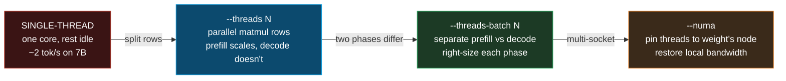
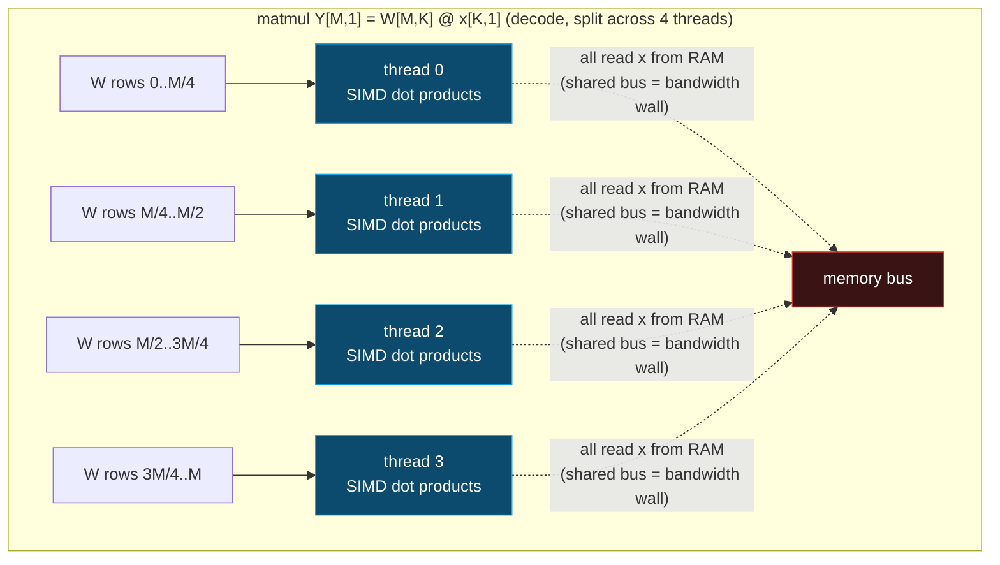

# CPU Threading — `--threads` vs `--threads-batch` (why prefill scales, decode doesn't)

> Companion: [threading.py](https://github.com/quanhua92/tutorials/blob/main/local-llm/threading.py)
> Live: [threading.html](./threading.html)

## 0. TL;DR

Every llama.cpp forward pass has **two phases** that stress the CPU in opposite
ways:

- **Prefill** (prompt processing) — processes all prompt tokens at once. Big
  matmul, **compute-bound**. Adding threads parallelises the FLOPs → near-linear
  speedup up to physical-core count.
- **Decode** (token generation) — emits one token per step. Tiny matmul, the
  whole weight matrix is streamed for one column of work → **memory-bandwidth
  bound**. Adding threads shares ONE bus → speedup saturates at ~2×.

Because they scale so differently, llama.cpp gives you **two knobs**:
`--threads N` (decode) and `--threads-batch N` (prefill).

**Gold (verified, [check: OK] in the `.py` and `.html`):** on an 8-physical-core
CPU — prefill @ 8 threads = **5.5×**, decode @ 8 threads = **2.0×**, and at 16
hyperthreads BOTH drop (**5.0×** prefill, **1.8×** decode — the hyperthread
penalty).

---

## 1. What it is (lineage old → new, WHY each step)



| Step | Problem it fixes | What changes |
|---|---|---|
| **1. Single-thread** | — (the baseline) | One core does every matmul row serially. Other cores idle. |
| **2. `--threads N`** | Idle cores | The thread pool splits each matmul's output rows across N workers. Prefill scales well (compute-bound); decode barely (memory-bound). |
| **3. `--threads-batch N`** | One knob for two phases that scale oppositely | Independent thread counts: `--threads-batch` high for prefill, `--threads` lower for decode. |
| **4. `--numa`** | Cross-socket memory traffic on servers | Pins each thread to the NUMA node where its weights live, so reads stay on local DRAM instead of crossing the UPI/Infinity Fabric. |

**Why it matters:** on an 8-core CPU, going 1 → 8 threads takes prefill from
baseline to **5.5×**. But decode only reaches **2.0×** (RAM bandwidth is the
wall), and pushing to 16 hyperthreads makes *both* phases slower (cache
thrashing + FPU contention). Right-sizing the two thread counts is free perf.

---

## 2. The mechanism (internals)

### 2a. Prefill vs decode — the roofline tells you everything

A matmul `Y[M,N] = W[M,K] @ X[K,N]` has:

- **compute** = `2·M·K·N` FLOPs (multiply-adds)
- **memory** = `M·K·bw` bytes to stream the weight matrix (`bw` = bytes/weight)
- **arithmetic intensity** = compute / memory (FLOPs per byte moved)

| Phase | Batch N | Compute | Memory | Intensity | Bottleneck |
|---|---|---|---|---|---|
| **decode** | 1 | `2·M·K` | `M·K·bw` | ~1/bw (**low**) | **MEMORY** (the bus caps you) |
| **prefill** | B (large) | `2·M·K·B` | `M·K·bw` | ~B/bw (**high**) | **COMPUTE** (cores cap you) |

Threads parallelise **compute** but **share** the memory bus. So a memory-bound
phase (decode) cannot scale past the bus bandwidth, while a compute-bound phase
(prefill) scales near-linearly with threads until the physical cores are
saturated.

> From threading.py Section A:
> ```
> Roofline on a [d=4096, d=4096] layer, Q4_0 weights (0.5 B/elem):
>
> | phase   | batch | FLOPs      | memory bytes | intensity (FLOP/byte) | bound     |
> |---------|-------|------------|--------------|-----------------------|-----------|
> | decode  | 1     | 33554432   | 8396800      | 4.00                  | MEMORY    |
> | prefill | 512   | 17179869184 | 12582912     | 1365.33               | COMPUTE   |
>
> Decode  intensity = 4.00 FLOP/byte  -> the bus sets the
>          ceiling. More threads share ONE bus -> speedup saturates fast.
> Prefill intensity = 1365 FLOP/byte -> cores are the
>          ceiling. More threads = more parallel FLOPs -> near-linear speedup.
> ```

### 2b. Thread pool — how matmul rows are split

ggml maintains a thread pool (`ggml_threadpool`). For every matmul, the output
rows `M` are partitioned into `N` contiguous chunks — one per worker. Each worker
runs the SIMD dot-product kernel on its slice. First `M % N` workers get one
extra row so the split is even.



### 2c. Why physical cores, not hyperthreads

A **hyperthread** (SMT thread) is a second architectural state on the *same*
physical core. It shares the **FPU/SIMD unit**, the **L1/L2 cache**, and the
**memory execution resources** with its sibling. For SIMD-heavy matmul work:

- two hyperthreads on one core do **not** double the SIMD throughput (they
  alternate on the same vector unit),
- they **thrash the shared L1/L2** (each pulls a different weight slice),
- they add **scheduling/sync overhead** at every graph-compute barrier.

The net effect: going from `N = physical` to `N = 2·physical` threads makes
inference **slower**, not faster.

> From threading.py Section B:
> ```
> This CPU: 8 physical cores, 16 logical (2-way hyperthreading).
>
> | threads | type                | prefill speedup | decode speedup |
> |---------|---------------------|-----------------|----------------|
> | 1       | physical            | 1.0             | 1.0            |
> | 2       | physical            | 1.8             | 1.6            |
> | 4       | physical            | 3.2             | 1.9            |
> | 8       | physical (PEAK)     | 5.5             | 2.0            |
> | 16      | hyperthread (penalty) | 5.0           | 1.8            |
>
> Prefill @ 8 threads (physical): 5.5x  -- PEAK
> Prefill @ 16 threads (hyper):   5.0x  -- -9% vs peak (WORSE)
> ```

---

## 3. Practical config / commands

### The two thread knobs

```bash
# decode (token generation) — memory-bound, set to physical cores
--threads N

# prefill (prompt processing) — compute-bound, set to physical cores
--threads-batch N

# multi-socket servers only — pin threads to the NUMA node of their weights
--numa [distribute|isolate|numactl]
```

### Setting them

```bash
# laptop / desktop (8 physical cores): both at 8
./llama-cli -m model.gguf --threads 8 --threads-batch 8

# large-prompt workload: prefill benefits most from full core count
./llama-cli -m model.gguf --threads 6 --threads-batch 8

# multi-socket server (2 x 32-core EPYC): ALWAYS add --numa
./llama-server -m model.gguf --threads 32 --threads-batch 32 --numa isolate
```

### NUMA pinning policies

| `--numa` value | Behaviour | When to use |
|---|---|---|
| *(omitted)* | No pinning; OS scheduler may migrate threads across nodes | Single-socket machines (no NUMA penalty) |
| `distribute` | Spread threads evenly across all NUMA nodes | Weights interleaved across nodes (`numactl --interleave=all`) |
| `isolate` | Pin each thread to one node; weights accessed cross-node | One model replica per node (cleanest) |
| `numactl` | Use the `numactl`/`libnuma` API for affinity | Fine-grained control via external `numactl` |

> From threading.py Section E:
> ```
> For this 8-core / 16-thread CPU:
>   optimal --threads-batch = 8   (prefill peaks here: 5.5x)
>   optimal --threads       = 6   (decode peaks here: 2.0x)
> ```

---

## 4. Worked example (the gold centerpiece)

> From threading.py Section G:
> ```
> Canonical 8-physical-core CPU. Speedup vs 1 thread.
>
> | threads | kind         | prefill (x) | decode (x) |
> |---------|--------------|-------------|------------|
> | 1       | physical     | 1.0         | 1.0        |
> | 2       | physical     | 1.8         | 1.6        |
> | 4       | physical     | 3.2         | 1.9        |
> | 8       | physical     | 5.5         | 2.0        |
> | 16      | hyperthread  | 5.0         | 1.8        |
>
> GOLD (recomputed & badge-checked in threading.html):
>   prefill @ 8 threads  = 5.5x   (peak)
>   decode  @ 8 threads  = 2.0x   (peak)
>   prefill @ 16 threads = 5.0x   (hyperthread penalty)
>   decode  @ 16 threads = 1.8x   (hyperthread penalty)
>
> [check] prefill @8 == 5.5x: True -> OK
> [check] decode  @8 == 2.0x: True -> OK
> [check] prefill @16 == 5.0x: True -> OK
> [check] decode  @16 == 1.8x: True -> OK
> [check] hyperthread penalty: @16 < @8 (both phases): True -> OK
> ```

---

## 5. Pitfalls (trap | symptom | fix)

| Trap | Symptom | Fix |
|---|---|---|
| **`--threads` = logical cores (hyperthreads)** | Tok/s *drops* vs physical-core count; CPU shows 100% but slower | Set `--threads` and `--threads-batch` to **physical** core count (`nproc` on Linux over-counts; use `lscpu -e` or `hw.logicalcpu` on macOS) |
| **One `--threads` for both phases** | Long prompts crawl (prefill under-threaded) OR decode stutters (over-threaded → contention) | Set `--threads-batch` high (prefill, compute-bound) and `--threads` lower (decode, bandwidth-bound) |
| **No `--numa` on a multi-socket server** | 64-thread run *slower* than an 8-thread single-socket run; interconnect saturates | Add `--numa isolate`; verify with `numactl --hardware` and pin model weights to one node |
| **Setting `--threads` higher than the model needs** | Decode plateaus then regresses past ~6 threads on an 8-core box | Benchmark decode tok/s at 4, 6, 8 threads; pick the peak (often 4-6, not 8) |
| **Assuming more threads = more bandwidth** | Expecting 8 threads to give 8× decode speedup, seeing only ~2× | Decode is memory-bandwidth-bound (intensity ~1-4 FLOP/byte); threads share one bus. Only prefill (compute-bound) scales near-linearly |
| **Container/VM hides the real core count** | Threading slower than bare metal; `nproc` reports host cores not cgroup quota | Use `--threads` = the quota (`cat /sys/fs/cgroup/cpu.max` or the container limit), not host `nproc` |
| **`--threads` and `--threads-batch` unset** | llama.cpp defaults to a guess that may over- or under-subscribe | Always set both explicitly; the default is rarely optimal for your exact CPU |

---

## 6. Cheat sheet

```
phases     : PREFILL (prompt, batch=large) -> COMPUTE-bound -> scales with threads
             DECODE  (token,   batch=1)     -> MEMORY-bound  -> saturates ~2x

knobs      : --threads N          decode (token generation)
             --threads-batch N    prefill (prompt processing)
             --numa [distribute|isolate|numactl]   multi-socket pinning

rule       : set BOTH to PHYSICAL core count. hyperthreads make it SLOWER.
             decode often peaks at 4-6 (lower than prefill's physical count).

why        : threads parallelise COMPUTE but SHARE the memory bus.
             prefill intensity ~B FLOP/byte  -> cores are the ceiling
             decode  intensity ~1 FLOP/byte  -> bus   is the ceiling

numbers    : 8-core CPU:
               prefill @8  = 5.5x (peak)   @16 = 5.0x (hyperthread penalty)
               decode  @8  = 2.0x (peak)   @16 = 1.8x (hyperthread penalty)

numa       : cross-node reads cost ~50-70% bandwidth AND share the interconnect.
             8/8 remote threads -> effective bw 0.4x -> decode 0.8x (vs 2.0x local).
             ALWAYS use --numa on 2-socket servers.
```

---

## 🔗 Cross-references

- **[CPU_SIMD](./CPU_SIMD.md)** (sibling) — SIMD is *per-thread*. Threads +
  SIMD = full CPU utilisation: each worker runs an AVX2/AVX-512/NEON dot-product
  kernel on its row slice. Threading multiplies the SIMD throughput across cores.
- **[HARDWARE_LANDSCAPE](./HARDWARE_LANDSCAPE.md)** (sibling) — different CPUs
  have different physical/logical core counts and NUMA topologies. This bundle's
  "8 physical cores" is one data point; the landscape bundle covers EPYC/Xeon/
  Apple Silicon/edge.
- **[GGML_BACKEND](./GGML_BACKEND.md)** (sibling) — the thread pool is part of
  `ggml_graph_compute`'s plan: the cgraph's matmul nodes are what get split into
  per-thread row chunks.
- **[llm/ROOFLINE](../llm/ROOFLINE.md)** — the arithmetic-intensity / memory-
  bandwidth framework that *predicts* whether a phase is compute- or memory-
  bound. This bundle applies it to the prefill-vs-decode split.

## Sources

- [llama.cpp CLI README (`--threads`, `--threads-batch`, `--numa`)](https://github.com/ggml-org/llama.cpp/blob/master/examples/cli/README.md)
- [llama.cpp `common/arg.cpp` thread-pool configuration](https://github.com/ggml-org/llama.cpp/blob/master/common/arg.cpp)
- [ggml thread pool source (`ggml/src/ggml-cpu/ggml-cpu.c`)](https://github.com/ggml-org/llama.cpp/tree/master/ggml/src/ggml-cpu)
- [Scaling llama.cpp on Neoverse N2: solving cross-NUMA performance issues (SemiEngineering)](https://semiengineering.com/scaling-llama-cpp-on-neoverse-n2-solving-cross-numa-performance-issues/)
- [Split model between NUMA nodes for CPU inference (llama.cpp discussion #12303)](https://github.com/ggml-org/llama.cpp/discussions/12303)
- [Examine multi-threaded performance patterns in llama.cpp (Arm Learning Paths)](https://learn.arm.com/learning-paths/servers-and-cloud-computing/llama_cpp_streamline/6_multithread_analyze/)
- [LLaMA Now Goes Faster on CPUs — Justine Tunnicliffe (matmul/threading analysis)](https://justine.lol/matmul/)
- [llama.cpp and thread count optimization (r/LocalLLaMA)](https://www.reddit.com/r/LocalLLaMA/comments/14djns5/llamacpp_and_thread_count_optimization/)
