# TODO.md — Local LLM Inference Build Queue

> **26 bundles across 6 phases.** Pure Python stdlib. Orange accent `#f97316`.
> Companion to [`llm/`](../llm/) — the algorithm/math side.
>
> Build order: Phase 1 (style anchor) → 2 → 3 → 4 → 5 → 6. Max 4 workers per batch.

```mermaid
graph LR
    P1["Phase 1 — Format & Runtime<br/>(4 bundles)"] --> P2["Phase 2 — Hardware & Memory<br/>(5 bundles)"]
    P2 --> P3["Phase 3 — Inference Features<br/>(4 bundles)"]
    P3 --> P4["Phase 4 — Serving & Ecosystem<br/>(4 bundles)"]
    P4 --> P5["Phase 5 — Image & Video Gen<br/>(5 bundles)"]
    P5 --> P6["Phase 6 — Audio & Music<br/>(4 bundles)"]
    P6 --> DONE["🚀 26 bundles complete"]
    style P1 fill:#eafaf1,stroke:#27ae60
    style P2 fill:#fef3e7,stroke:#f97316
    style P3 fill:#eaf2f8,stroke:#58a6ff
    style P4 fill:#f3eefb,stroke:#b9a9e8
    style P5 fill:#fdf0f5,stroke:#ec4899
    style P6 fill:#fdf0f5,stroke:#ec4899
    style DONE fill:#eafaf1,stroke:#27ae60
```



---

## Progress

| Phase | Theme | Bundles | Status |
|---|---|---|---|
| 1 | Format & Runtime | 4 | ⬜ Not started |
| 2 | Hardware & Memory | 5 | ⬜ Not started |
| 3 | Inference Features | 4 | ⬜ Not started |
| 4 | Serving & Ecosystem | 4 | ⬜ Not started |
| 5 | Image & Video Generation | 5 | ⬜ Not started |
| 6 | Audio & Music | 4 | ⬜ Not started |
| | **Total** | **26** | **0/26** |

---

## Phase 1 — Format & Runtime `#27ae60` (4 bundles)

> The llama.cpp foundation: what GGUF is, how GGML executes, why mmap matters,
> how quantization types differ. Build `gguf_format` FIRST as the style anchor.

| # | Bundle | Lineage (old → new, WHY) | Key source | Gold value | Cross-ref | Status |
|---|---|---|---|---|---|---|
| 01 | `gguf_format` | GGML (old flat format) → GGUF v3 (extensible KV metadata, mmap-friendly, single-file) | [GGUF spec](https://github.com/ggml-org/llama.cpp/blob/master/gguf-py/gguf/gguf.py), [HF GGUF docs](https://huggingface.co/docs/hub/en/gguf) | `magic = 0x46554747, version = 3` | — | ⬜ STYLE ANCHOR |
| 02 | `quant_types` | Legacy Q4_0 → K-quants Q4_K_M → I-quants IQ3_S (importance matrix, lookup tables) | [k-quants README](https://github.com/ggml-org/llama.cpp/blob/master/examples/quantize/README.md) | Q4_0 block `{[3,7,1,6], scale=0.5}` → `[1.5, 3.5, 0.5, 3.0]` | 🔗 `llm/QUANTIZATION` | ⬜ |
| 03 | `ggml_backend` | PyTorch eager → GGML compute graph (build cgraph → schedule on backend → execute) | [ggml source](https://github.com/ggml-org/llama.cpp/tree/master/ggml) | 3-node graph topo-sort order: `[A, B, C]` | 🔗 `llm/FLASH_ATTENTION` | ⬜ |
| 04 | `mmap_weights` | Full load (read entire file into RAM) → mmap (lazy page-fault, copy-on-write, shared multi-process) | [mmap(2)](https://man7.org/linux/man-pages/man2/mmap.2.html), [llama.cpp mmap discussion](https://github.com/ggml-org/llama.cpp/discussions/3800) | `4GB model: mmap=0.1s startup vs full-load=12s` | — | ⬜ |

**Batch 1:** All 4 in parallel (gguf_format is style anchor — ship first if needed).

---

## Phase 2 — Hardware & Memory `#e67e22` (5 bundles)

> The practical "will it fit on my GPU?" calculations. The #1 question in local LLMs.

| # | Bundle | Lineage (old → new, WHY) | Key source | Gold value | Cross-ref | Status |
|---|---|---|---|---|---|---|
| 05 | `vram_estimator` | Rule-of-thumb → exact formula: `params×bits/8 + n_layers×2×n_ctx×n_kv_heads×head_dim×bytes + overhead` | [VRAM math](https://github.com/ggml-org/llama.cpp/discussions/3800) | Llama-3-8B Q4_K_M 4K ctx: weights 4.5GB + KV 0.5GB ≈ 5.3GB | 🔗 `llm/KV_CACHE` | ⬜ |
| 06 | `gpu_offload` | All-CPU → partial `-ngl` (N layers on GPU, rest CPU) → activation-only transfer bottleneck | [llama.cpp -ngl docs](https://github.com/ggml-org/llama.cpp/blob/master/examples/cli/README.md) | 32 layers, 16GB VRAM, Q4: `-ngl 28` fits | 🔗 `llm/KTRANSFORMERS_OFFLOAD` | ⬜ |
| 07 | `cpu_simd` | Scalar (1 value/op) → AVX2 `__m256i` (8×Q4 in 1 op) → AVX-512 `__m512i` (16×Q4) → NEON (ARM 128-bit) | [ggml-cpu SIMD](https://github.com/ggml-org/llama.cpp/tree/master/ggml/src/ggml-cpu) | AVX2 dequant 8×Q4 + dot-product = 1 SIMD op | — | ⬜ |
| 08 | `threading` | Single-thread → `--threads N` (parallel matmul rows) → NUMA-aware → `--threads-batch` (prefill vs decode) | [llama.cpp threading](https://github.com/ggml-org/llama.cpp/wiki/Configurations-and-Performance-Tips) | 8 threads optimal on 8-core; >8 = contention penalty | — | ⬜ |
| 09 | `hardware_landscape` | RTX 3090 (24GB GDDR6X) → Mac Studio M3 Ultra (512GB unified, 819 GB/s) → DGX Spark (128GB LPDDR5X, CUDA) → AMD Strix Halo (128GB, ROCm, $2348) | [Hardware-Corner](https://hardware-corner.net), [AIMultiple](https://aimultiple.com/dgx-spark-alternatives) | 3×RTX 3090: 124 tok/s on 120B (memory bandwidth wins) | 🔗 `llm/NCCL_COLLECTIVES` | ⬜ |

**Batch 2a:** #05, #06, #07, #08 (4 in parallel)
**Batch 2b:** #09 (hardware_landscape — needs VRAM/offload as context)

---

## Phase 3 — Inference Features `#58a6ff` (4 bundles)

> What makes local inference useful beyond raw speed: long context, memory savings,
> structured output, speculative acceleration.

| # | Bundle | Lineage (old → new, WHY) | Key source | Gold value | Cross-ref | Status |
|---|---|---|---|---|---|---|
| 10 | `context_extension` | Linear scaling → NTK-aware (base frequency adjustment) → YaRN (extrapolation) → dynamic (per-token) | [YaRN arXiv:2309.00071](https://arxiv.org/abs/2309.00071) | RoPE base=10000, NTK scale 4K→32K: θ₁ changes from `10000` to `...` | 🔗 `llm/ROPE` | ⬜ |
| 11 | `kv_cache_quant` | FP16 KV (2 bytes/elem) → Q8_0 KV (1 byte, 2x savings) → Q4_0 KV (0.5 byte, 4x savings) | [llama.cpp KV quant PR](https://github.com/ggml-org/llama.cpp/pull/2832) | 8B model 32K ctx: FP16 KV=4.0GB → Q8 KV=2.0GB → Q4 KV=1.0GB | 🔗 `llm/KV_CACHE` | ⬜ |
| 12 | `grammar_output` | Free-form sampling → GBNF grammar rules → token masking (only valid tokens get probability) → guaranteed JSON/regex | [GBNF docs](https://github.com/ggml-org/llama.cpp/blob/master/grammars/README.md) | Grammar `root ::= "{\"name\": \"" [a-z]+ "\"}"` forces valid JSON | 🔗 `llm/SAMPLING` | ⬜ |
| 13 | `speculative_local` | 1 token/step → draft model proposes γ tokens → target verifies in 1 forward → accept/reject (rejection sampling) | [spec decoding PR](https://github.com/ggml-org/llama.cpp/pull/2926) | γ=4, acceptance=0.7 → effective 3.1 tokens/step → ~3x speedup | 🔗 `llm/SPECULATIVE_DECODING` | ⬜ |

**Batch 3:** All 4 in parallel.

---

## Phase 4 — Serving & Ecosystem `#b9a9e8` (4 bundles)

> The practical map: which tool for what. vLLM for production, Ollama/LM Studio for
> dev, MLX for Apple Silicon, Open WebUI for the frontend.

| # | Bundle | Lineage (old → new, WHY) | Key source | Gold value | Cross-ref | Status |
|---|---|---|---|---|---|---|
| 14 | `vllm_serving` | HuggingFace TGI (static batching) → vLLM (PagedAttention + continuous batching, 16-24x throughput) | [vLLM docs](https://docs.vllm.ai/), [PagedAttention arXiv:2309.06180](https://arxiv.org/abs/2309.06180) | 50 concurrent users: vLLM=24x throughput vs sequential | 🔗 `llm/PAGED_ATTENTION`, `llm/SCHEDULER` | ⬜ |
| 15 | `ollama_lmstudio` | Raw llama.cpp (manual compile) → Ollama (Go wrapper, `pull/run`, OpenAI API) + LM Studio (Electron GUI, HF browser, side-by-side compare) | [Ollama](https://github.com/ollama/ollama), [LM Studio](https://lmstudio.ai/) | Both wrap llama.cpp; Ollama=CLI-first, LM Studio=GUI-first | — | ⬜ |
| 16 | `mlx_inference` | PyTorch MPS (discrete GPU assumption) → MLX (unified memory, zero-copy, lazy eval, Metal fusion) → 2-3x faster on Apple Silicon | [MLX docs](https://ml-explore.github.io/mlx/), [MLX unified memory](https://ml-explore.github.io/mlx/build/html/usage/unified_memory.html) | Lazy eval: `(a*2)+5` fuses to 1 Metal kernel; no `.to(device)` needed | — | ⬜ |
| 17 | `open_webui` | Raw API calls → Open WebUI (multi-model chat, RAG with 9 vector DBs, MCP tools, pipelines, multi-user RBAC) | [Open WebUI docs](https://docs.openwebui.com/) | RAG pipeline: doc → chunk(512) → embed → vector search(top-5) → rerank → inject | 🔗 `vector-db/` | ⬜ |

**Batch 4:** All 4 in parallel.

---

## Phase 5 — Image & Video Generation `#ec4899` (5 bundles)

> Local creative AI: diffusion fundamentals, ComfyUI workflows, Flux for images,
> LTX-Video and Wan 2.2 for video.

| # | Bundle | Lineage (old → new, WHY) | Key source | Gold value | Cross-ref | Status |
|---|---|---|---|---|---|---|
| 18 | `diffusion_fundamentals` | GANs → DDPM (forward noise + reverse denoise) → DDIM (deterministic, fewer steps) → DPM++/Euler schedulers | [DDPM arXiv:2006.11239](https://arxiv.org/abs/2006.11239), [DDIM arXiv:2010.02502](https://arxiv.org/abs/2010.02502) | Linear β schedule: β₁=0.001, β₅₀=0.02; 30 steps = sweet spot | 🔗 `llm/SAMPLING` | ⬜ |
| 19 | `comfyui_workflow` | Scripts (hardcoded pipeline) → ComfyUI (node graph → topo-sort → execute, reusable/composable/visual) | [ComfyUI GitHub](https://github.com/comfyanonymous/ComfyUI) | Workflow JSON: 6 nodes, topo-sort = [Loader, CLIP, Positive, Negative, KSampler, VAE] | — | ⬜ |
| 20 | `flux_gguf` | SDXL U-Net (2.6B) → Flux.1 DiT (12B, higher quality) → GGUF Q4 quant (23GB → 6GB, fits 12GB VRAM) | [Flux](https://blackforestlabs.ai/), [ComfyUI-GGUF](https://github.com/city96/ComfyUI-GGUF) | Flux 12B: FP16=23GB, Q8=12GB, Q4=6GB; Q4 quality drop <2% FID | 🔗 `local-llm/quant_types` | ⬜ |
| 21 | `ltx_video` | U-Net video models (heavy) → LTX DiT (Video VAE compresses 8×spatial + 8×temporal) → faster-than-real-time on 8GB | [LTX-Video](https://github.com/Lightricks/ltx-video) | 720×480×121 frames: pixel=498MB → latent=324KB (1500× compression) | — | ⬜ |
| 22 | `wan_video` | LTX (fast, lower quality) → Wan 2.2 14B (higher quality) + Lightning distillation (30→4 steps) + TeaCache (skip redundant attention) + GGUF Q4 | [Wan2.1](https://github.com/Wan-Video/Wan2.1), [ComfyUI Wan docs](https://docs.comfy.org/tutorials/video/wan/wan2_2) | Wan 14B: base 30 steps=5min → +Lightning(4 steps)=40s → +TeaCache=16s → +GGUF fits 12GB | — | ⬜ |

**Batch 5a:** #18, #19, #20, #21 (4 in parallel)
**Batch 5b:** #22 (wan_video — needs diffusion + LTX as context)

---

## Phase 6 — Audio & Music `#f472b6` (4 bundles)

> Local audio: speech synthesis (TTS), speech recognition (STT), and music generation.

| # | Bundle | Lineage (old → new, WHY) | Key source | Gold value | Cross-ref | Status |
|---|---|---|---|---|---|---|
| 23 | `tts_kokoro` | Tacotron (attention-based, unstable) → FastSpeech (non-autoregressive) → StyleTTS2 (style encoder + duration predictor) → Kokoro-82M (tiny, CPU-capable, <2GB VRAM) | [Kokoro-82M](https://huggingface.co/hexgrad/Kokoro-82M), [StyleTTS2 arXiv:2306.07691](https://arxiv.org/abs/2306.07691) | 82M params, 54 voices, 8 languages; <2GB VRAM; runs on CPU | — | ⬜ |
| 24 | `qwen3_tts` | Cascade TTS (text→acoustic→vocoder, error compounds) → Qwen3-TTS end-to-end multi-codebook LM (Qwen3-TTS-Tokenizer-12Hz, Dual-Track streaming, 97ms first packet) → voice clone (3s), voice design (NL→timbre), 10 languages | [Qwen3-TTS blog](https://qwen.ai/blog?id=qwen3tts-0115), [GitHub](https://github.com/qwenlm/qwen2.5-omni) | 1.7B/0.6B sizes; 97ms latency; WER 1.835%; 10 languages; non-DiT architecture | — | ⬜ |
| 25 | `whisper_stt` | Wav2Vec (representation learning) → Whisper (encoder-decoder, multilingual ASR, weak supervision) → faster-whisper (CTranslate2, 4x faster) → distil-whisper (distilled, 6x faster) | [Whisper arXiv:2212.04356](https://arxiv.org/abs/2212.04356), [faster-whisper](https://github.com/SYSTRAN/faster-whisper) | Whisper-large-v3: 1550M params; faster-whisper 4x speedup; real-time factor <1.0 | — | ⬜ |
| 26 | `music_generation` | MusicGen (autoregressive, mono) → YuE (lyrics→full song, vocals+accompaniment, 7B) → ACE-Step (3.5B, SOTA, full song <2s on A100, step-based) → DiffRhythm (diffusion-based) | [ACE-Step](https://github.com/ace-step/ACE-Step), [YuE](https://github.com/multimodal-art-projection/YuE) | ACE-Step 3.5B: full song <2s on A100, <30min on 10GB VRAM; outperforms Suno v5 on benchmarks | — | ⬜ |

**Batch 6:** All 4 in parallel.

---

## Cross-reference map (the 🔗 spine)

```mermaid
graph TD
    subgraph p1["Phase 1 — Format & Runtime"]
        GGUF[gguf_format]
        QT[quant_types]
        GGML[ggml_backend]
        MMAP[mmap_weights]
    end
    subgraph p2["Phase 2 — Hardware & Memory"]
        VRAM[vram_estimator]
        GO[gpu_offload]
        SIMD[cpu_simd]
        THR[threading]
        HW[hardware_landscape]
    end
    subgraph p3["Phase 3 — Inference Features"]
        CE[context_extension]
        KCQ[kv_cache_quant]
        GRAM[grammar_output]
        SPEC[speculative_local]
    end
    subgraph p4["Phase 4 — Serving & Ecosystem"]
        VLLM[vllm_serving]
        OLL[ollama_lmstudio]
        MLX[mlx_inference]
        OWUI[open_webui]
    end
    subgraph p5["Phase 5 — Image & Video Gen"]
        DIFF[diffusion_fundamentals]
        CFY[comfyui_workflow]
        FLUX[flux_gguf]
        LTX[ltx_video]
        WAN[wan_video]
    end
    subgraph p6["Phase 6 — Audio & Music"]
        KOK[tts_kokoro]
        QWN[qwen3_tts]
        WHS[whisper_stt]
        MUS[music_generation]
    end

    %% Cross-refs to llm/
    QT -.->|"block-quant vs W4A16"| LLMQ["llm/QUANTIZATION"]
    GGML -.->|"same op, different backend"| LLMS["llm/FLASH_ATTENTION"]
    VRAM -.->|"KV cache term"| LLKVC["llm/KV_CACHE"]
    GO -.->|"CPU weight storage"| LLKT["llm/KTRANSFORMERS_OFFLOAD"]
    CE -.->|"scaling the base rotation"| LLR["llm/ROPE"]
    KCQ -.->|"dense → quantized"| LLKVC
    GRAM -.->|"constrained sampling"| LLS["llm/SAMPLING"]
    SPEC -.->|"same algo, local"| LLSD["llm/SPECULATIVE_DECODING"]
    VLLM -.->|"PagedAttention math"| LLPA["llm/PAGED_ATTENTION"]
    VLLM -.->|"scheduler math"| LLSCH["llm/SCHEDULER"]
    OWUI -.->|"9 vector DBs"| VDB["vector-db/"]

    %% Internal cross-refs
    FLUX -.->|"same GGUF format"| QT
    DIFF -.->|"both stochastic"| LLS

    style p1 fill:#eafaf1,stroke:#27ae60
    style p2 fill:#fef3e7,stroke:#f97316
    style p3 fill:#eaf2f8,stroke:#58a6ff
    style p4 fill:#f3eefb,stroke:#b9a9e8
    style p5 fill:#fdf0f5,stroke:#ec4899
    style p6 fill:#fdf0f5,stroke:#f472b6
```



---

## Build schedule

| Wave | Phase(s) | Bundles | Workers/batch | Status |
|---|---|---|---|---|
| 1 | Phase 1 | #01–04 | 4 (batch 1) | ⬜ |
| 2 | Phase 2 | #05–08 | 4 (batch 2a) | ⬜ |
| 3 | Phase 2 | #09 | 1 (batch 2b) | ⬜ |
| 4 | Phase 3 | #10–13 | 4 (batch 3) | ⬜ |
| 5 | Phase 4 | #14–17 | 4 (batch 4) | ⬜ |
| 6 | Phase 5 | #18–21 | 4 (batch 5a) | ⬜ |
| 7 | Phase 5 | #22 | 1 (batch 5b) | ⬜ |
| 8 | Phase 6 | #23–26 | 4 (batch 6) | ⬜ |

8 waves, 26 bundles, ~8 orchestrator messages.

---

## Style anchor

**Bundle #01 (`gguf_format`)** is the style anchor for this section. Every later
worker's `{MODEL_BUNDLES}` field should reference it:

```
Study these bundles and COPY THEIR STYLE EXACTLY:
  local-llm/gguf_format.py + GGUF_FORMAT.md + gguf_format.html
```

Ship it first (or in Batch 1 alongside #02–04). If it's not ready when Batch 2
launches, reference an `observability/` or `systemdesign/` bundle as a fallback
model — the banner/check/callout/pitfalls pattern is the same across sections.
