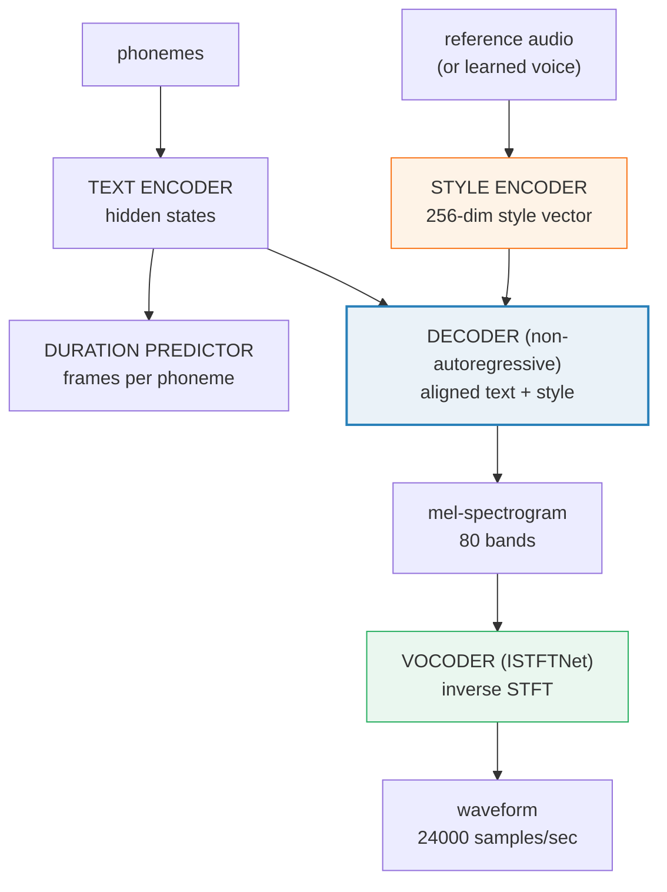

# Kokoro-82M TTS — 82M-param text-to-speech via StyleTTS 2

> Companion: [tts_kokoro.py](https://github.com/quanhua92/tutorials/blob/main/local-llm/tts_kokoro.py)
> Live playground: [tts_kokoro.html](./tts_kokoro.html)
> Sibling (the advanced end-to-end TTS): [QWEN3_TTS.md](./QWEN3_TTS.md) 🔗
> Sibling (the reverse direction, speech→text): [WHISPER_STT.md](./WHISPER_STT.md) 🔗

## 0. TL;DR

**Kokoro-82M** is an open-weight text-to-speech model with **82 million
parameters** that punches far above its weight: it rivals commercial TTS APIs
while fitting in **<2 GB VRAM** and running on **CPU at ~3× real-time**. It
inherits the **StyleTTS 2** architecture (arxiv:2306.07691) and an **ISTFTNet**
vocoder (arxiv:2203.02395) — a decoder-only design with **no diffusion and no
released encoder**.

Text becomes speech through a 5-stage funnel:

| Stage | Name | Input → Output | Example |
|---|---|---|---|
| 1 | **Text normalization** | raw text → cleaned words | `"I have $5."` → `I have five dollars.` |
| 2 | **Phonemization (G2P)** | words → IPA phonemes | `five` → `/f/ /aɪ/ /v/` |
| 3 | **Prosody prediction** | phonemes → duration/pitch/energy | `/oʊ/` → 35 frames |
| 4 | **Acoustic model** | phonemes + prosody → mel-spectrogram | 60 frames × 80 bands |
| 5 | **Vocoder** | mel-spectrogram → waveform | 15 360 samples |

**Gold value (the hero number the HTML playground reproduces):**

```
"hello" = 5 phoneme segments /h/ /ə/ /l/ /o/ /ʊ/
durations        = [5, 12, 8, 15, 20]  mel frames
total            = 60 frames → 60 × 256 = 15 360 samples → 0.64 s
```

---

## 1. The lineage — WHY each step exists

```mermaid
graph LR
    TXT["raw text<br/>'I have $5.'"] -->|"normalization"| NORM["cleaned words<br/>'I have five dollars.'"]
    NORM -->|"G2P (misaki)"| PHO["IPA phonemes<br/>/aɪ/ /h/ /æ/ /v/ ..."]
    PHO -->|"duration predictor"| PRO["prosody<br/>frames per phoneme"]
    PRO -->|"acoustic model<br/>(StyleTTS2 decoder)"| MEL["mel-spectrogram<br/>frames x 80 bands"]
    MEL -->|"vocoder (ISTFTNet)"| WAV["waveform<br/>24000 samples/sec"]
    style TXT fill:#fef3e7,stroke:#f97316,stroke-width:2px
    style MEL fill:#eaf2f8,stroke:#2980b9,stroke-width:2px
    style WAV fill:#eaf7ef,stroke:#27ae60,stroke-width:2px
```



**The single recurring trick across modern TTS: replace autoregressive,
one-sample-at-a-time generation with a parallel, non-autoregressive mel
decoder + a cheap inverse-STFT vocoder.** Kokoro gets its quality from
**adversarial training + style diffusion** (the StyleTTS 2 trick), not from
a huge parameter count.

### StyleTTS 2 architecture (what Kokoro is built on)



Five components, **all sharing one backbone** — that sharing is the biggest
reason Kokoro is only 82 M params (see §4).

---

## 2. The mechanism — the pipeline stage by stage

Every number below is printed by `tts_kokoro.py`; the audio config (24 000 Hz,
hop 256, 80 bands) is verified against the Kokoro-82M Model Facts and ISTFTNet.

### A — The 5-stage pipeline (the full funnel)

> From `tts_kokoro.py` Section A:
> ```
> Stage 1 - TEXT NORMALIZATION
>   raw   = 'I have $5.'
>   rules = $5 -> five dollars, & -> and, % -> percent, ...
>   out   = 'I have five dollars.'
>
> Stage 2 - PHONEMIZATION (G2P via `misaki`)
>   words     = ['I', 'have', 'five', 'dollars']
>   phonemes  = ['/aɪ/', '/h/', '/æ/', '/v/', '/f/', '/aɪ/', '/v/', '/d/', '/ɑ/', '/l/', '/ɚ/', '/z/']  (12 IPA symbols)
>
> Stage 3 - PROSODY PREDICTION (duration per phoneme, in mel frames)
>   durations = [22, 5, 14, 6, 7, 22, 6, 7, 16, 8, 12, 9]  -> total 134 frames
>
> Stage 4 - ACOUSTIC MODEL (phonemes + prosody -> mel-spectrogram)
>   mel shape = 134 frames x 80 bands
>   (each frame = 80 floats = a frequency snapshot)
>
> Stage 5 - VOCODER (mel-spectrogram -> waveform, ISTFTNet)
>   samples   = 34304
>   seconds   = 1.4293  (= samples / 24000)
> ```

Note how each stage changes the **shape** of the data: text → symbols →
frames → a 2-D matrix (frames × bands) → a 1-D waveform. The mel-spectrogram
is the central abstraction; everything upstream produces it and everything
downstream consumes it.

### B — The gold example: `hello` → 0.64 s

The `/oʊ/` diphthong is **split into onset `/o/` + glide `/ʊ/`** so the
duration predictor can model the two phases separately — standard practice in
many TTS duration heads.

> From `tts_kokoro.py` Section B:
> ```
>   text       = 'hello'
>   phonemes   = ['/h/', '/ə/', '/l/', '/o/', '/ʊ/']  (5 segments)
>   durations  = [5, 12, 8, 15, 20]  (mel frames per segment)
>   sum        = 60 frames
>   samples    = 60 * 256 = 15360
>   seconds    = 15360 / 24000 = 0.6400
>
> | segment | phoneme | dur (frames) | dur (ms)  |
> |---------|---------|--------------|-----------|
> | 0       | /h/     |            5 |   53.33   |
> | 1       | /ə/     |           12 |  128.00   |
> | 2       | /l/     |            8 |   85.33   |
> | 3       | /o/     |           15 |  160.00   |
> | 4       | /ʊ/     |           20 |  213.33   |
> | total   |         |           60 |  640.00   |
> ```

### C — Audio fundamentals

> From `tts_kokoro.py` Section C:
> ```
> Kokoro audio config (verified: Model Facts + ISTFTNet):
>   sample_rate = 24000 Hz  (24000 samples per second)
>   hop_length  = 256 samples per mel frame
>   fft_size    = 1024 samples (STFT window)
>   n_mel_bands = 80 frequency bands
>
> mel frames per second = sample_rate / hop_length
>                      = 24000 / 256 = 93.75
>                      ~ 94 frames/sec
>
> Per mel frame: 80 floats = a snapshot of frequency content
>   -> frame covers 256 samples = 10.67 ms of audio
> ```

The conversion you will re-use constantly:

```
seconds  =  frames × hop / sample_rate   =  frames × 256 / 24000
samples  =  frames × hop                 =  frames × 256
```

So **1 second of audio = 24 000 samples = 93.75 ≈ 94 mel frames**.

---

## 3. Practical config / commands

```bash
# install (Python ≥ 3.10). espeak-ng provides the phonemizer fallback.
pip install -q "kokoro>=0.9.2" soundfile
apt-get -qq -y install espeak-ng          # Linux; brew install espeak on macOS

# minimal synthesis (rate=24000 is fixed by the model)
python3 -c "
from kokoro import KPipeline
import soundfile as sf
pipe = KPipeline(lang_code='a')                 # 'a' = American English
for i, (gs, ps, audio) in enumerate(pipe('Hello, world.', voice='af_heart')):
    print(i, gs, ps)                            # gs=graphemes ps=phonemes
    sf.write(f'out_{i}.wav', audio, 24000)
"
```

**Choosing a voice / language:** voices are named `<lang><sex>_<name>`, e.g.
`af_heart` (American-female), `bm_lewis` (British-male). `KPipeline(lang_code=…)`
sets the G2P front-end; valid codes include `a` (US English), `b` (British),
`j` (Japanese), `z` (Mandarin), `k` (Korean), `f` (French), `i` (Italian),
`p` (Portuguese), `e` (Spanish).

**Where it runs:** the 164 MB of fp16 weights + ~55 KB of voice vectors fit
any modern GPU and run on CPU at roughly **3× real-time** (1 s of compute →
3 s of audio). No GPU is required.

---

## 4. Why Kokoro is only 82 M params

> From `tts_kokoro.py` Section G:
> ```
> | # | Trick                              | Effect                          |
> |---|------------------------------------|---------------------------------|
> | 1 | Shared encoder backbone            | Text/duration/decoder share ONE feature extractor, not 3 duplicates |
> | 2 | Non-autoregressive decoder         | All mel frames generated in parallel, no per-step recurrence stack |
> | 3 | Compact 256-dim style vectors      | 256-dim style per voice vs huge speaker-embedding tables |
> | 4 | Pre-computed phoneme embeddings    | Phoneme vocab is tiny (~100 IPA symbols), so the embedding table is tiny |
> | 5 | ISTFTNet vocoder                   | Inverse-STFT is cheaper than HiFi-GAN's multi-block upsampling stack |
> ```

**VRAM budget (weights dominate):**

> From `tts_kokoro.py` Section G:
> ```
> weights fp32 = 82000000 * 4 = 328 MB
> weights fp16 = 82000000 * 2 = 164 MB
> voices       = 54 * 256 * 4 = 54.0 KB
> + activations + mel buffers       ~ a few tens of MB
> => total well under 2 GB on any GPU, and runs on CPU.
> ```

For contrast, autoregressive / multi-stack TTS families are far larger:

| model family | params | why bigger |
|---|---|---|
| **Kokoro-82M (StyleTTS 2)** | **82 M** | shared backbone, NAR decoder |
| XTTS / Tortoise | 300 M+ | autoregressive decoder + flow matching |
| Bark | 1 B+ | text + audio LLM stack |
| VALL-E style | 1 B+ | full autoregressive phoneme → acoustic |

---

## 5. Worked example — the full mel-spectrogram for `hello`

> From `tts_kokoro.py` Section D (downsampled ASCII heatmap, 10 band-groups,
> one frame per phoneme segment):
> ```
> Input : phonemes=['/h/', '/ə/', '/l/', '/o/', '/ʊ/'], durations=[5, 12, 8, 15, 20]
> Output: mel-spectrogram = 60 frames x 80 bands
>
>   band-groups: low freq <----> high freq
>    /h/  /ə/  /l/  /o/  /ʊ/
>   frame 0   : % @ @ @ @ @ @ @ @ %   (segment 0 /h/ dur=5)
>   frame 5   :   = @ @ @ % :         (segment 1 /ə/ dur=12)
>   frame 17  : . @ @ @ + . + @ @ :   (segment 2 /l/ dur=8)
>   frame 25  : : @ @ % .             (segment 3 /o/ dur=15)
>   frame 40  : = @ @ :               (segment 4 /ʊ/ dur=20)
>
> | segment | phoneme | frames | mean energy | peak band |
> |---------|---------|--------|-------------|-----------|
> | 0       | /h/     |      5 |      0.6859 |        40 |
> | 1       | /ə/     |     12 |      0.3008 |        30 |
> | 2       | /l/     |      8 |      0.4206 |        62 |
> | 3       | /o/     |     15 |      0.2096 |        19 |
> | 4       | /ʊ/     |     20 |      0.1792 |        15 |
>
> mel-spectrogram size: 60 x 80 = 4800 floats
> ```

Each phoneme contributes a horizontal stripe at its formant band(s); the
duration predictor sets how wide each stripe is. The `/h/` is broadband
(breathy noise), while `/o/` and `/ʊ/` concentrate at low bands (back rounded
vowel + high-back glide).

> From `tts_kokoro.py` Section E (vocoder inversion):
> ```
> mel-spectrogram: 60 frames
> waveform       : 15360 samples (= 60 frames * 256 hop)
> duration       : 0.6400 s (= 15360 / 24000)
>
> First 8 waveform samples (segment 0, /h/, breathy onset):
> | i | sample    |
> |---|-----------|
> | 0 |  +0.00000 |
> | 1 |  +0.03228 |
> | 2 |  +0.06449 |
> ...
>
> CPU real-time factor ~ 3.0x
>   generate 0.6400s of audio in ~0.2133s compute
> ```

---

## 6. Pitfalls (trap → symptom → fix)

| Trap | Symptom | Fix |
|---|---|---|
| **Forgetting sample rate = 24 000** | Generated `.wav` plays too fast/slow, pitch shifted | Always write with `sf.write(path, audio, 24000)`. The rate is fixed by the model, not configurable. |
| **Confusing mel frames with samples** | Duration math off by 256× | A mel *frame* = 256 samples (the hop). `seconds = frames × 256 / 24000`, not `frames / 24000`. |
| **Mixing up phoneme count with frame count** | Expecting 5 phonemes → 5 samples | Phonemes expand to *many* frames via the duration predictor; `/ʊ/` alone spans 20 frames. |
| **Skipping text normalization** | `$5`, `100%`, `Dr.` are pronounced letter-by-letter | Run normalization (Kokoro's `misaki` front-end) **before** phonemization. |
| **Treating the `/oʊ/` diphthong as one unit** | Duration head can't model the onset→glide transition | Many duration heads split diphthongs (onset + glide) — that's why `hello` has 5 segments, not 4. |
| **Assuming Kokoro does voice cloning** | Trying to feed arbitrary reference audio and getting nothing | Kokoro ships **54 fixed voice vectors**, not a zero-shot cloning engine. Pick a built-in voice. |
| **Expecting streaming / low-latency** | Long utterances block until fully generated | The non-autoregressive decoder is fast per-utterance but not incremental. Chunk long text yourself. |
| **Forgetting `espeak-ng` for non-English** | Phonemes garbled or missing on `zh`/`ja`/`ko` | Install `espeak-ng` and use the right `KPipeline(lang_code=…)`. |
| **Comparing VRAM to 82 M LLMs** | Expecting ~500 MB and seeing spikes | TTS activations + mel buffers add a few tens of MB on top of the 164 MB weights; still well under 2 GB. |
| **Assuming `0.94` vs `93.75` frames/sec is an error** | Spot-check "fails" | 24 000/256 = 93.75 exactly; "~94" is a deliberate rounding, not a bug. |

---

## 7. Cheat sheet

**The pipeline (memorize the shape changes):**

```
text ──normalization──> words ──G2P──> phonemes ──prosody──> durations
      ──acoustic model──> mel (frames × 80) ──vocoder──> waveform (24000 Hz)
```

**The audio math:**

```
sample_rate = 24000 Hz        hop = 256          mel bands = 80
mel frames/sec = 24000 / 256 = 93.75  (≈ 94)
1 mel frame     = 256 samples = 10.67 ms
seconds         = frames × 256 / 24000
```

**The hero numbers:**

```
"hello": 5 segments /h/ /ə/ /l/ /o/ /ʊ/ → durations [5,12,8,15,20]
         = 60 frames = 15 360 samples = 0.64 s
```

**Why 82 M is enough:**

| Trick | Effect |
|---|---|
| shared encoder backbone | no duplicated feature extractors |
| non-autoregressive decoder | parallel mel generation |
| 256-dim style vectors | 54 voices cost only 54 KB |
| pre-computed phoneme embeddings | tiny IPA vocab → tiny table |
| ISTFTNet vocoder | inverse-STFT, cheaper than HiFi-GAN |

**Specs at a glance:** 82 M params · 54 voices · 8 languages · < 2 GB VRAM ·
~3× real-time on CPU · Apache-2.0 · StyleTTS 2 + ISTFTNet.

---

## 🔗 Cross-references

- **[QWEN3_TTS.md](./QWEN3_TTS.md)** 🔗 — the advanced **end-to-end** TTS
  alternative. Qwen3-TTS is a large multimodal model that does text→speech
  (and more) directly, without the explicit pipeline above. Kokoro is the
  **small, fast, pipeline-based** choice; Qwen3-TTS is the **big, flexible,
  end-to-end** choice. Same goal, opposite trade-offs.
- **[WHISPER_STT.md](./WHISPER_STT.md)** 🔗 — the **reverse direction**,
  speech → text. Whisper consumes the waveforms Kokoro produces and turns them
  back into tokens. Together they are the round-trip: text → Kokoro → audio →
  Whisper → text.
- **[VRAM_ESTIMATOR.md](./VRAM_ESTIMATOR.md)** — the VRAM-budget reasoning that
  explains why an 82 M model is trivially small (< 2 GB) compared to LLMs.
- **[DIFFUSION_FUNDAMENTALS.md](./DIFFUSION_FUNDAMENTALS.md)** — StyleTTS 2's
  "style diffusion" training trick reuses the same diffusion concept, applied
  to the style vector rather than to pixels.

---

## Sources

- [hexgrad/Kokoro-82M — HuggingFace model card](https://huggingface.co/hexgrad/Kokoro-82M) (Model Facts, Training Details, Releases). Primary source for every spec here: 82 M params, 54 voices, 8 languages, Apache-2.0, decoder-only (no diffusion, no released encoder), base model `yl4579/StyleTTS2-LJSpeech`, ~1000 A100-80GB hours / ~$1000 training.
- [hexgrad/kokoro — GitHub](https://github.com/hexgrad/kokoro) — the `kokoro` Python package and `KPipeline` usage.
- [hexgrad/misaki — GitHub](https://github.com/hexgrad/misaki) — the G2P (grapheme-to-phoneme) front-end Kokoro uses for text normalization + phonemization.
- [StyleTTS 2: Towards Human-Level TTS through Style Diffusion and Adversarial Training (arXiv:2306.07691)](https://arxiv.org/abs/2306.07691) — the architecture Kokoro inherits (style encoder, duration predictor, text encoder, non-autoregressive decoder, adversarial + style-diffusion training).
- [iSTFTNet: Fast and Lightweight Mel-Spectrogram Vocoder (arXiv:2203.02395)](https://arxiv.org/abs/2203.02395) — the ISTFTNet vocoder that turns the mel-spectrogram into a 24 000 Hz waveform via inverse STFT.
- [VOICES.md](https://huggingface.co/hexgrad/Kokoro-82M/blob/main/VOICES.md) — the 54 voice names across 8 languages.
