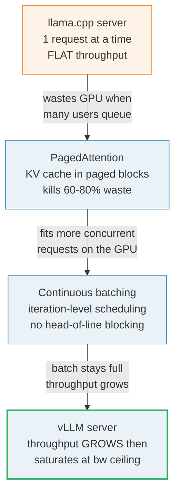

# vLLM Serving — high-throughput serving for many concurrent users

> Companion: [vllm_serving.py](https://github.com/quanhua92/tutorials/blob/main/local-llm/vllm_serving.py)
> Live: [vllm_serving.html](./vllm_serving.html)

## 0. TL;DR

`llama.cpp`/Ollama and `vLLM` are both ways to serve a local LLM over an API —
but they are optimized for **opposite** workloads. The entire choice collapses
to one question: **how many concurrent users?**

- **1 user, interactive** → `llama.cpp`/Ollama. Lower overhead, fast cold-start,
  runs on CPU, works on a laptop.
- **Many concurrent users / an API** → `vLLM`. Its two innovations
  (PagedAttention + continuous batching) turn the flat sequential throughput of
  `llama.cpp` into a curve that **grows with concurrency**.

The headline numbers (Llama-3-8B, single RTX 4090, simulated — see Section 4):

| concurrent users | llama.cpp /user | vLLM /user | vLLM speedup |
|---|---|---|---|
| 1 | 60.0 tok/s | 81.8 tok/s | 1.36x |
| 10 | **6.0 tok/s** | **45.0 tok/s** | **7.5x** |
| 50 | 1.2 tok/s | 15.0 tok/s | 12.5x |

At 10 users, vLLM serves each user **7.5x faster**. At 50, vLLM's *aggregate*
throughput is **750 tok/s** vs `llama.cpp`'s flat 60. Below ~4–5 users the
difference barely matters; above it, there is no contest.

---

## 1. What it is — lineage, and WHY each step



The lineage is the story of **why serving one request at a time wastes the GPU**,
and the two ideas that close the gap:

1. **llama.cpp server** — serves requests sequentially (or with simple static
   batching). Each decode pass reads the whole weight matrix from VRAM to
   produce *one* token for *one* request. Memory bandwidth is the bottleneck,
   and at batch 1 the bus is under-used. Total throughput is flat no matter how
   many users queue.
2. **PagedAttention** (vLLM, 2023) — the KV cache is stored in fixed-size
   non-contiguous **blocks**, like OS virtual-memory pages. Naive contiguous
   allocation reserves a worst-case buffer per request and wastes **60–80%** of
   KV-cache memory to internal fragmentation; paging wastes **<5%**, so far more
   concurrent requests fit on the same GPU. 🔗 [`llm/PAGED_ATTENTION`](../llm/PAGED_ATTENTION.md)
3. **Continuous batching** (iteration-level scheduling) — instead of waiting
   for a whole batch to finish before admitting new requests, vLLM inserts a
   waiting request into the running batch the very next iteration a slot frees
   up. No head-of-line blocking, no half-empty batches. 🔗 [`llm/SCHEDULER`](../llm/SCHEDULER.md)
4. **vLLM server** — PagedAttention + continuous batching together let the
   batch stay full of many sequences sharing one weight read, so aggregate
   throughput grows with concurrency — until the memory bus saturates.

> From vllm_serving.py Section A:
> ```
> | property     | llama.cpp / Ollama                  | vLLM                                |
> |--------------|-------------------------------------|-------------------------------------|
> | target       | single user, interactive            | multiple concurrent users, API serving |
> | batching     | sequential / static (request-level) | continuous (iteration-level scheduling) |
> | kv_cache     | contiguous buffer per request       | PagedAttention (non-contiguous blocks) |
> | gpu          | GPU optional (runs on CPU, Apple Metal) | NVIDIA GPU required (CUDA)          |
> | throughput   | flat (does not scale with users)    | grows with concurrency, saturates at bw ceiling |
> ```

---

## 2. The mechanism — PagedAttention kills the KV-cache waste

A request's KV cache grows as it generates. The naive scheme reserves a
**contiguous worst-case buffer** (`max_model_len` tokens) for *every* request —
so a 200-token chat sits in a 2048-token slot. Real workloads are heavy-tailed
(many short chats, a few long contexts), so most of every buffer is empty.

PagedAttention stores KV in fixed 16-token **blocks** grabbed on demand:
`ceil(actual_len / 16)` blocks per request. Fragmentation collapses from the
bulk of memory to a few tokens per request.

> From vllm_serving.py Section B (16 concurrent requests, heavy-tailed, seed=42):
> ```
> | scheme          | reserved | used  | waste   | waste % |
> |-----------------|----------|-------|---------|---------|
> | naive contiguous|    32768 |  7899 |   24869 |   75.9%  |
> | PagedAttention  |     8032 |  7899 |     133 |    1.7%  |
>
> Same 2048-token budget, paging uses 8032/32768 = 24.5% of the naive footprint.
> -> on the SAME GPU you can hold ~4.1x as many concurrent requests.
> ```

The 75.9% waste lands inside the **60–80% band** the PagedAttention paper
reports for existing systems (arXiv:2309.06180). Paging drops it to **1.7%** —
so on the same GPU you hold ~4.1x more concurrent requests. More requests in KV
room means bigger batches, which is what feeds the throughput curve in Section 4.

### The deep reason batching wins at all

Decode is **memory-bandwidth-bound**: the dominant cost of one forward pass is
streaming the weight matrix from VRAM once, and that cost is ~the **same** for
batch 1 and batch 32 (the extra activations are negligible). So running N
sequences together produces N× the tokens for barely-more time — *until* the
memory bus saturates. That is why vLLM's total throughput **grows then flattens**,
and it is the same fact that makes speculative decoding work (🔗 `speculative_local`).
Cross-ref [`llm/PAGED_ATTENTION`](../llm/PAGED_ATTENTION.md) for the
logical→physical block-table math.

---

## 3. Continuous batching — no head-of-line blocking

Two admission policies for a bounded batch (here `MAX_BATCH=2`):

- **Static (request-level)**: form a batch, run it until **every** request
  finishes, *then* admit the next batch. A request that finishes early leaves
  its slot **empty** until the whole batch drains.
- **Continuous (iteration-level)**: at **every** iteration, admit a queued
  request into any free slot. A freed slot is refilled the very next iteration.

> From vllm_serving.py Section C (R0/R2 = 20 tok, R1/R3 = 8 tok; `MAX_BATCH=2`):
> ```
> STATIC - a batch runs until ALL finish, then the next batch is admitted:
> R0 |####################----------------------------   (runs 0-19)
> R1 | ...................########--------------------   (WAITED 1-19, runs 20-27)
> R2 |  .....................................########
> R3 |   ######################################
>
> CONTINUOUS - a freed slot is refilled at the VERY NEXT iteration:
> R0 |####################----------------------------   (runs 0-19)
> R1 | ########---------------------------------------   (no waiting, runs 1-8)
> R2 |  .......####################-------------------
> R3 |   .................########--------------------
> ('#' = running, '.' = waiting/queued, ' ' = not yet arrived, '-' = done)
>
> | request | arrival | length | static finish | continuous finish |
> | R1       |       1 |      8 |            27 |                 8 |
> | R3       |       3 |      8 |            47 |                27 |
>   wall-clock: static=47 iters, continuous=28 iters -> 1.68x faster
>   R1 (short req): @8 (continuous) vs @27 (static) -> 3.4x less waiting
> ```

Notice R1 in **static**: it arrives at iter 1 but **waits until iter 20** (long
row of dots) because it sits behind the batch. In **continuous** it runs
immediately and finishes at iter 8 — **3.4x less waiting**. Short requests are
exactly the ones static batching punishes hardest. Cross-ref
[`llm/SCHEDULER`](../llm/SCHEDULER.md) for the scheduler's iteration-loop
algorithm.

---

## 4. The throughput curves — sequential vs continuous batching

Llama-3-8B on a single RTX 4090. Two models of aggregate throughput:

```
llama.cpp total(N) = 60                       [flat — one request at a time]
vLLM    total(N) = 900 * N / (N + 10)   [saturating toward the bandwidth ceiling]
```

`llama.cpp` is flat at 60 tok/s no matter how many users queue (they take
turns). `vLLM` follows a **saturating** curve: total grows with N because
batching amortises the weight read across sequences, then flattens at the memory
bandwidth ceiling (`T_SAT = 900`, half-saturation at `N = 10`).

> From vllm_serving.py Section D:
> ```
> | users | llama total | llama /user | vLLM total | vLLM /user | vLLM speedup |
> |-------|-------------|-------------|------------|------------|--------------|
> |     1 |        60   |      60.0   |       82   |     81.8   |       1.36x |
> |     2 |        60   |      30.0   |      150   |     75.0   |       2.50x |
> |     5 |        60   |      12.0   |      300   |     60.0   |       5.00x |
> |    10 |        60   |       6.0   |      450   |     45.0   |       7.50x |
> |    20 |        60   |       3.0   |      600   |     30.0   |      10.00x |
> |    30 |        60   |       2.0   |      675   |     22.5   |      11.25x |
> |    50 |        60   |       1.2   |      750   |     15.0   |      12.50x |
> ```

Read it two ways:

- **Per-user (latency)**: both degrade as N grows, but `llama.cpp` **collapses
  as 1/N** (10 users → 6 tok/s each), while vLLM degrades gently (15 tok/s even
  at 50 users).
- **Total (throughput)**: `llama.cpp` is pinned at 60; vLLM climbs from 82 toward
  900 (at N=50 it is 750). The flat top is the memory bus saturating — vLLM does
  **not** get N×60 forever.

### GOLD (the load-bearing claim)

> From vllm_serving.py GOLD:
> ```
> 10 concurrent users, Llama-3-8B on RTX 4090:
>   llama.cpp sequential    = 6.0 tok/s/user   (total 60 / 10)
>   vLLM continuous batching= 45.0 tok/s/user   (total 450)   -> 7.5x
> 50 concurrent users:
>   vLLM = 15.0 tok/s/user, total = 750 tok/s   (per-user = 900/60)
> ```

These reproduce in [`vllm_serving.html`](./vllm_serving.html) with the identical
formulas and a `[check: OK]` badge.

---

## 5. Pitfalls (trap | symptom | fix)

| Trap | Symptom | Fix |
|---|---|---|
| Running `vllm serve` for a single user | High startup cost, VRAM overhead, no win over `llama.cpp` | At <5 users use `llama.cpp`/Ollama; vLLM's gains only appear under concurrency |
| Expecting vLLM on CPU / Apple Silicon | `vLLM requires NVIDIA GPU` error | vLLM needs CUDA. On Apple Silicon use **MLX**/Ollama; on CPU use `llama.cpp` |
| `--max-model-len` too large | OOM / few concurrent requests fit (KV eats VRAM) | Lower it to the real context; KV room = `(1-util)*VRAM`, shared by all blocks |
| `--gpu-memory-utilization` left low | Tiny block pool, low max batch, throughput starved | Raise toward ~0.9 (leaves room for PyTorch activations) to grow the block pool |
| Comparing *per-user* tok/s at N=1 | "vLLM is barely faster" conclusion | The win is *aggregate throughput under load*. Always compare at your real concurrency |
| Assuming vLLM = N×60 forever | Curve "should" be linear | It **saturates** at the memory-bandwidth ceiling — the flat top is the bus, not a bug |
| Static batching as "good enough" | Short requests wait behind a long batch (head-of-line blocking) | Continuous batching refills freed slots each iteration (Section 3) |
| Ignoring the crossover | Overspending on vLLM for a 2-user dev box, or OOMing llama.cpp at 20 users | Crossover ≈ 4–5 concurrent users (community + Red Hat benchmark) |

---

## 6. Cheat sheet

```bash
# vLLM — high-throughput API server (NVIDIA GPU, many users)
vllm serve meta-llama/Llama-3.1-8B-Instruct \
    --tensor-parallel-size 1 \        # number of GPUs (tensor-parallel degree)
    --max-model-len 8192 \            # max context -> caps per-request KV
    --gpu-memory-utilization 0.9      # VRAM fraction for weights+KV block pool

# llama.cpp — single-user server (no GPU required)
llama-server -m Llama-3.1-8B-Instruct.Q4_K_M.gguf \
    -ngl 99 -c 8192 --port 8080
```

**Pick by concurrency:**

| workload | pick | why |
|---|---|---|
| single user, interactive | `llama.cpp`/Ollama | lower overhead, fast cold-start, CPU-capable |
| multiple concurrent users / API | `vLLM` | 7.5–15x throughput (Section 4) |
| CPU-only / edge | `llama.cpp` only | vLLM requires an NVIDIA GPU |
| Apple Silicon (M-series) | `MLX` / Ollama | no CUDA for vLLM; MLX is the native path |

**The two vLLM formulas** (reproduced verbatim in the `.html`):

```
llama.cpp:  total(N) = 60            per_user(N) = 60 / N           [flat]
vLLM:       total(N) = 900*N/(N+10)  per_user(N) = 900 / (N + 10)  [saturating]
```

**The two vLLM innovations:** PagedAttention (paged KV blocks → 1.7% waste vs
75.9%) + continuous batching (iteration-level admission → no head-of-line
blocking, 1.68x faster wall-clock in the trace).

---

## 🔗 Cross-references

- [`llm/PAGED_ATTENTION`](../llm/PAGED_ATTENTION.md) — the block-table
  (logical→physical page) memory management behind PagedAttention.
- [`llm/SCHEDULER`](../llm/SCHEDULER.md) — the iteration-level scheduler loop
  that implements continuous batching.
- [`ollama_lmstudio`](./OLLAMA_LMSTUDIO.md) — the single-user/interactive
  alternative (wraps `llama.cpp`); the "below the crossover" choice.
- [`speculative_local`](./SPECULATIVE_LOCAL.md) — same memory-bound insight
  (batch N ≈ batch 1), applied to one user via a draft model instead of many
  users via batching.
- [`hardware_landscape`](./HARDWARE_LANDSCAPE.md) — decode is bandwidth-bound;
  the GPU's GB/s sets the `T_SAT` ceiling the vLLM curve flattens against.

## Sources

- [vLLM documentation](https://docs.vllm.ai/) — `vllm serve` flags, PagedAttention, continuous batching (official docs).
- [Efficient Memory Management for Large Language Model Serving with PagedAttention (Kwon et al., arXiv:2309.06180)](https://arxiv.org/abs/2309.06180) — the 60–80% KV-cache waste figure and the paging mechanism.
- [vLLM or llama.cpp: Choosing the right LLM inference engine (Red Hat)](https://developers.redhat.com/articles/2025/09/30/vllm-or-llamacpp-choosing-right-llm-inference-engine-your-use-case) — single-user vs multi-user design points, the ~4–5 user crossover.
- [vLLM vs llama.cpp: Batching Architecture and Production Readiness (Contra Collective)](https://contracollective.com/blog/vllm-vs-llama-cpp-batching-production-inference-2026) — static vs continuous batching architecture comparison.
- [Ollama vs vLLM: Performance Benchmark (SitePoint, 2026)](https://www.sitepoint.com/ollama-vs-vllm-performance-benchmark-2026/) — vLLM wins throughput/latency above ~5 concurrent users.
