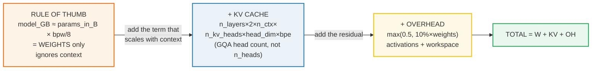
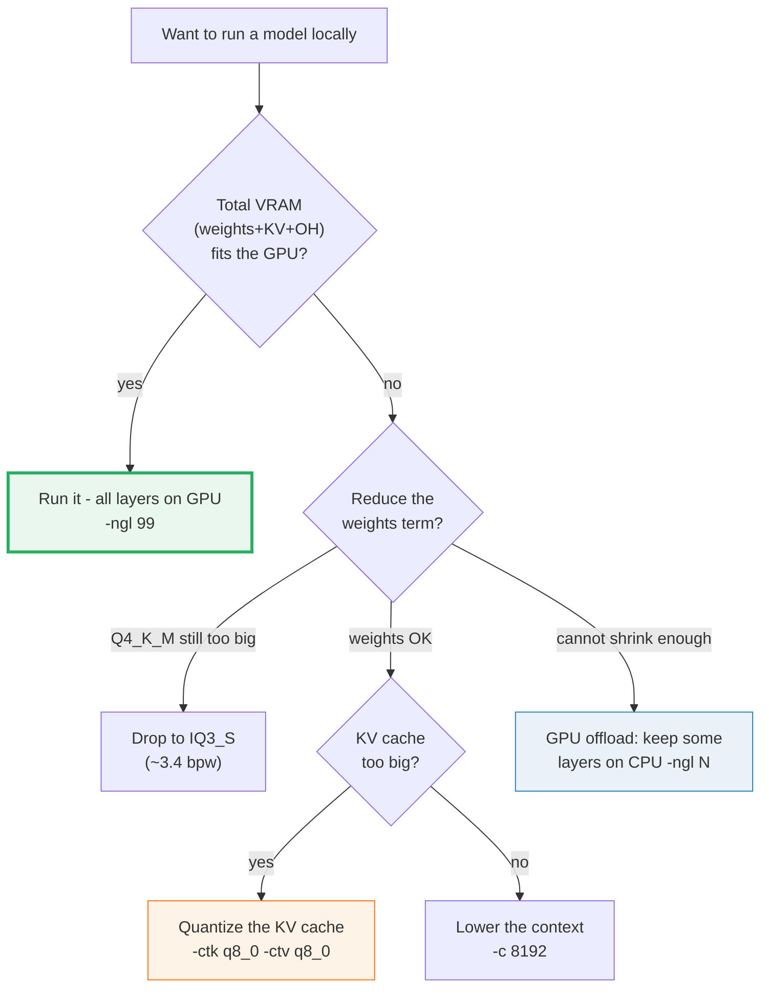

# VRAM Estimator — weights + KV cache + overhead (the exact budget)

> Companion: [vram_estimator.py](https://github.com/quanhua92/tutorials/blob/main/local-llm/vram_estimator.py)
> Live playground: [vram_estimator.html](./vram_estimator.html)
> Sibling (the math side): [../llm/KV_CACHE.md](../llm/KV_CACHE.md) — what the KV term actually is
> The quant type that sets the weights term: [QUANT_TYPES.md](./QUANT_TYPES.md) 🔗

## 0. TL;DR

"Will this model fit on my GPU?" is a sum of **exactly three terms**:

```
VRAM = WEIGHTS + KV_CACHE + OVERHEAD
```

| Term | Formula | Set by | Dominates when |
|---|---|---|---|
| **Weights** | `params_b × bpw / 8` | the **quant type** | short context (almost always) |
| **KV cache** | `n_layers × 2 × n_ctx × n_kv_heads × head_dim × bpe / 1e9` | **context length + GQA** | long context |
| **Overhead** | `max(0.5, 0.10 × weights)` GB | activations + workspace | small models (floor) |

The **rule of thumb** (`model_GB ≈ params_in_B × bits/8`) is just the weights
term — it works for a 5-second guess but **silently ignores the KV cache**, which
grows linearly with context and is why a "3.5 GB Q4 7B model" balloons past 8 GB
once you actually decode 32k tokens.

**Gold value** (reproduced in the HTML playground):

```
Llama-3-8B, Q4_K_M (4.5 bpw), 4096 ctx, FP16 KV:
  weights  = 8.03 × 4.5 / 8          = 4.52 GB
  kv_cache = 32×2×4096×8×128×2 / 1e9 = 0.54 GB
  overhead = max(0.5, 0.10×4.52)     = 0.50 GB
  TOTAL                              = 5.55 GB   → fits an 8 GB card
```

---

## 1. The lineage — rule-of-thumb → exact



**Why the rule of thumb fails silently.** At 4K context the weights term is
~85% of the budget, so `params × bpw/8` is "close enough". But the KV cache is
**linear in `n_ctx`**, so at 32K context it can exceed the weights:

> From `vram_estimator.py` Section B:
> ```
> Worked: Llama-3-8B (32 layers, 8 KV heads, head_dim=128), FP16 KV (2 B/E):
>   @   4096 ctx: 32*2*4096*8*128*2   =   536,870,912 bytes = 0.536871 GB
>   @  32768 ctx: 32*2*32768*8*128*2  = 4,294,967,296 bytes = 4.294967 GB
>   -> context x8 (4k->32k) => KV x8.0 (strictly linear in n_ctx)
> ```

---

## 2. The mechanism — each term from scratch

Every number below is printed by `vram_estimator.py`; the per-model head/layer
counts are verified against each model's `config.json`.

### A — Weights: `params_b × bpw / 8`

> From `vram_estimator.py` Section A:
> ```
> Formula (the rule of thumb, made exact):
>   weights_GB = params_in_billions * bits_per_weight / 8
>   (the 1e9 from params and the 1e9 bytes->GB cancel)
>
> bpw per quant type (cross-ref QUANT_TYPES.md):
> | quant   | bpw  | bytes/weight | note                              |
> |---------|------|--------------|-----------------------------------|
> | FP16    | 16.0 |       2.0000 | unquantized half precision        |
> | Q4_K_M  |  4.5 |       0.5625 | rule-of-thumb (pure Q4_K block)   |
> | Q8_0    |  8.5 |       1.0625 | near-lossless int8 block          |
> ```

The quant type is the single biggest lever on this term — and hence on the whole
budget at short context. **This is the gold-checked value** the HTML playground
reproduces:

> From `vram_estimator.py` Section A (gold):
> ```
> GOLD (for VRAM_ESTIMATOR.html):
>   Llama-3-8B Q4_K_M weights = 8.03 * 4.5 / 8 = 4.516875 GB  (~4.52 GB)
> [check] Q4_K_M weights ~= 4.52 GB :  OK  (got 4.516875)
> ```

> ⚠️ The estimator uses **4.5 bpw** for Q4_K_M (the pure `Q4_K` block bpw from
> `QUANT_TYPES.md`). Real `_M` files average **~4.84 bpw** because the sensitive
> layers ship at `Q6_K`; for a precise on-disk size, read the `.gguf` file size.

### B — KV cache: `n_layers × 2 × n_ctx × n_kv_heads × head_dim × bpe`

> From `vram_estimator.py` Section B:
> ```
> Formula:
>   bytes = n_layers * 2 * n_ctx * n_kv_heads * head_dim * bytes_per_element
>            ^^^^^^^^  ^        ^^^^^^^^^^   ^^^^^^^^   ^^^^^^^^^^^^^^^^^^^^^
>            per layer K+V      GQA heads    head width   FP16=2, Q8=1
>   GB    = bytes / 1e9
> ```

Three facts that decide this term:

1. **Factor 2** = the K tensor and the V tensor (both stored, every layer).
2. **`n_kv_heads`, NOT `n_heads`.** Grouped-query attention (GQA) shares one KV
   head across a group of query heads, so the cache scales with the **small** KV
   head count. Using `n_heads` here is the #1 estimation bug — it over-counts by
   the GQA ratio (4×–8× on modern models).
3. **Linear in `n_ctx`.** Doubling context doubles the cache. No escape except
   quantizing it (see `kv_cache_quant`).

> From `vram_estimator.py` Section B (GQA ratio table):
> ```
> | model        | n_heads | n_kv_heads | GQA ratio | KV@4K (FP16) | KV@32K (FP16) |
> |--------------|---------|------------|-----------|--------------|---------------|
> | Llama-2-13B  |      40 |         40 |    1.0x   |     3.3554 GB |     26.8435 GB |
> | Llama-3-70B  |      64 |          8 |    8.0x   |     1.3422 GB |     10.7374 GB |
> | Llama-3-8B   |      32 |          8 |    4.0x   |     0.5369 GB |      4.2950 GB |
> | Qwen2.5-7B   |      28 |          4 |    7.0x   |     0.2349 GB |      1.8790 GB |
> ```

The punchline: **a 13B plain-multi-head model caches more VRAM than a 70B GQA
model at the same context.** That is why every modern model (Llama-3, Qwen2.5,
Mistral, Gemma) adopted GQA — it is a free KV-cache cut with no quality loss.

> From `vram_estimator.py` Section B:
> ```
>   Llama-2-13B @32K FP16 KV = 26.844 GB   vs   Llama-3-70B @32K FP16 KV = 10.737 GB
> [check] 70B GQA KV < 13B MHA KV at 32K :  OK  (70B=10.737 vs 13B=26.844)
> ```

KV-cache quantization (`Q8`, 1 B/E) **halves** this term — see `kv_cache_quant`:

> ```
>   Llama-3-8B @32K: FP16 KV = 4.295 GB, Q8 KV = 2.147 GB (-50%)
> ```

### C — Overhead: `max(0.5, 0.10 × weights)` GB

> From `vram_estimator.py` Section C:
> ```
> Formula (the least-exact term - it is a rule of thumb):
>   overhead_GB = max(0.5, 0.10 * weights_GB)
>   (a ~0.5 GB floor for small models, ~10% of weights for large ones)
> ```

The catch-all term: activations, the compute workspace (scratch buffers for the
matmuls / attention), the CUDA/Metal launch context, and OS/display reservation
on consumer cards. It is the **least deterministic** — if you OOM right at the
edge, bump it up, quantize the KV cache, or drop `--parallel-context` / batch.

The `0.5` floor is why even a tiny model needs ~0.5 GB beyond its weights; the
`10%` is because activation/workspace tensors scale with the matmul sizes.

---

## 3. The full comparison table

> From `vram_estimator.py` Section D (4096 ctx, short):
> ```
> | model        | quant   | weights | KV     | overhd | TOTAL  |
> |--------------|---------|---------|--------|--------|--------|
> | Llama-2-13B  | FP16    |  26.04GB |  3.36GB |  2.60GB | 32.00GB |
> | Llama-2-13B  | Q4_K_M  |   7.32GB |  3.36GB |  0.73GB | 11.41GB |
> | Llama-2-13B  | Q8_0    |  13.83GB |  3.36GB |  1.38GB | 18.57GB |
> | Llama-3-70B  | FP16    | 140.00GB |  1.34GB | 14.00GB | 155.34GB |
> | Llama-3-70B  | Q4_K_M  |  39.38GB |  1.34GB |  3.94GB | 44.65GB |
> | Llama-3-70B  | Q8_0    |  74.38GB |  1.34GB |  7.44GB | 83.15GB |
> | Llama-3-8B   | FP16    |  16.06GB |  0.54GB |  1.61GB | 18.20GB |
> | Llama-3-8B   | Q4_K_M  |   4.52GB |  0.54GB |  0.50GB |  5.55GB |
> | Llama-3-8B   | Q8_0    |   8.53GB |  0.54GB |  0.85GB |  9.92GB |
> | Qwen2.5-7B   | FP16    |  15.24GB |  0.23GB |  1.52GB | 17.00GB |
> | Qwen2.5-7B   | Q4_K_M  |   4.29GB |  0.23GB |  0.50GB |  5.02GB |
> | Qwen2.5-7B   | Q8_0    |   8.10GB |  0.23GB |  0.81GB |  9.14GB |
> ```

> From `vram_estimator.py` Section D (32768 ctx, long):
> ```
> | model        | quant   | weights | KV     | overhd | TOTAL  |
> |--------------|---------|---------|--------|--------|--------|
> | Llama-2-13B  | FP16    |  26.04GB | 26.84GB |  2.60GB | 55.49GB |
> | Llama-2-13B  | Q4_K_M  |   7.32GB | 26.84GB |  0.73GB | 34.90GB |
> | Llama-2-13B  | Q8_0    |  13.83GB | 26.84GB |  1.38GB | 42.06GB |
> | Llama-3-70B  | FP16    | 140.00GB | 10.74GB | 14.00GB | 164.74GB |
> | Llama-3-70B  | Q4_K_M  |  39.38GB | 10.74GB |  3.94GB | 54.05GB |
> | Llama-3-70B  | Q8_0    |  74.38GB | 10.74GB |  7.44GB | 92.55GB |
> | Llama-3-8B   | FP16    |  16.06GB |  4.29GB |  1.61GB | 21.96GB |
> | Llama-3-8B   | Q4_K_M  |   4.52GB |  4.29GB |  0.50GB |  9.31GB |
> | Llama-3-8B   | Q8_0    |   8.53GB |  4.29GB |  0.85GB | 13.68GB |
> | Qwen2.5-7B   | FP16    |  15.24GB |  1.88GB |  1.52GB | 18.64GB |
> | Qwen2.5-7B   | Q4_K_M  |   4.29GB |  1.88GB |  0.50GB |  6.67GB |
> | Qwen2.5-7B   | Q8_0    |   8.10GB |  1.88GB |  0.81GB | 10.78GB |
> ```

Read downward: quantizing `16 → 4.5 bpw` cuts the total ~3.5× at short context,
but at long context the **quant-invariant KV term** caps the win. For
Llama-3-8B, FP16→Q4_K_M saves the same 12.65 GB of weights at either context —
but at 32K that saving is dwarfed by the 4.29 GB cache you still pay.

---

## 4. "Will it fit?" — decision matrix vs common GPUs

> From `vram_estimator.py` Section E (Q4_K_M, the default local quant):
> ```
> | model        | ctx    | total(Q4_K_M) | 8GB | 12GB | 16GB | 24GB |
> |--------------|--------|---------------|--------|--------|--------|--------|
> | Llama-2-13B  | 4K     |       11.41 GB |    no    |    FIT    |    FIT    |    FIT   |
> | Llama-2-13B  | 32K    |       34.90 GB |    no    |     no    |     no    |     no   |
> | Llama-3-70B  | 4K     |       44.65 GB |    no    |     no    |     no    |     no   |
> | Llama-3-70B  | 32K    |       54.05 GB |    no    |     no    |     no    |     no   |
> | Llama-3-8B   | 4K     |        5.55 GB |   FIT    |    FIT    |    FIT    |    FIT   |
> | Llama-3-8B   | 32K    |        9.31 GB |    no    |    FIT    |    FIT    |    FIT   |
> | Qwen2.5-7B   | 4K     |        5.02 GB |   FIT    |    FIT    |    FIT    |    FIT   |
> | Qwen2.5-7B   | 32K    |        6.67 GB |   FIT    |    FIT    |    FIT    |    FIT   |
> ```

`FIT` means **total ≤ nominal GPU VRAM**. Real usable VRAM is **~90% of nominal**
(OS/display + CUDA context), so leave headroom. When a model doesn't fit, the
escape hatches are: (a) a smaller quant, (b) Q8 KV-cache quant, (c) shorter
context, (d) **GPU offload** — keep some layers on CPU RAM (see `gpu_offload`).

Decision tree:



---

## 5. Pitfalls (trap → symptom → fix)

| Trap | Symptom | Fix |
|---|---|---|
| **Using `n_heads` instead of `n_kv_heads`** for the KV term | Estimate is 4×–8× too high; you think a GQA model won't fit when it will | GQA models (`config.json` `num_key_value_heads`) share KV across query-head groups. Always use the **KV** head count, never the query head count. |
| **Trusting the rule of thumb past 8K context** | `params×bpw/8` says 4 GB, you load it and OOM at 20K tokens | The rule of thumb is **weights only**. Add the KV term — it is linear in `n_ctx` and overtakes weights on long contexts. |
| **Quoting 4.5 bpw for Q4_K_M file size** | Predicted file is ~7% smaller than the real `.gguf` | 4.5 is the pure `Q4_K` block bpw (the estimate). Real `_M` files average ~4.84 bpw (mixed layer types). Read the file size for ground truth. |
| **Forgetting the `×2` (K and V) in the cache** | KV estimate half the real cache | The cache stores **both** the K and the V tensor per layer. The factor 2 is non-negotiable. |
| **Assuming nominal VRAM == usable VRAM** | "It says 8 GB, my card is 8 GB" → OOM on the last layer | Consumer cards lose ~0.5–1 GB to the OS/display + the CUDA/Metal context. Plan for **~90%** of nominal; keep a headroom margin in the overhead term. |
| **Ignoring GQA when comparing models** | Picking a 13B (MHA) over a 70B (GQA) thinking it caches less | MHA (`n_kv_heads == n_heads`) caches proportionally to the full head count. A 13B MHA caches **more** than a 70B GQA at the same context. Prefer GQA models for long context. |
| **Treating overhead as exact** | Estimate lands at the exact card size, you OOM randomly | Overhead (`max(0.5, 10%×weights)`) is a rule of thumb for activations/workspace/CUDA ctx. If you are at the edge, add slack or quantize the KV cache. |
| **Mixing GB (decimal) and GiB (binary)** | Numbers disagree with `ls -l` / `nvidia-smi` by ~7% | This estimator uses **decimal GB** (`/1e9`). `nvidia-smi` and `ls` often print **GiB** (`/1024³`). 1 GiB ≈ 1.074 GB. |

---

## 6. Cheat sheet

```
# the three terms (decimal GB)
weights  = params_in_billions * bpw / 8
kv       = n_layers * 2 * n_ctx * n_kv_heads * head_dim * bpe / 1e9
overhead = max(0.5, 0.10 * weights)
total    = weights + kv + overhead

# bpw by quant (cross-ref QUANT_TYPES.md)
Q4_K_M = 4.5      Q8_0 = 8.5      FP16 = 16.0
# KV bytes/element: FP16 = 2, Q8 = 1   (cache quant halves the term)
```

```bash
# let llama.cpp tell you the real VRAM/context budget (ground truth, no estimating)
./llama-server -m model.gguf -c 32768 -ngl 99  # watch the
#   "llama_context:   CUDA0 compute buffer = ... / VRAM ..." log lines at startup;
#   it sizes the weights + KV + compute buffers for you.

# quantize the KV cache to Q8_0 when the cache term dominates (long context)
./llama-server -m model.gguf -c 32768 -ctk q8_0 -ctv q8_0    # ~halves the KV term

# GPU offload when the total exceeds the GPU (keep N layers on GPU, rest on CPU)
./llama-cli -m model.gguf -ngl 12     # only 12 of 32 layers on the GPU
```

| You want… | Do this |
|---|---|
| 5-second guess | `params_B × bpw / 8` (weights only) |
| Will it actually fit? | weights + KV + overhead vs GPU (this guide) |
| Shrink the weights term | smaller quant: `Q4_K_M` → `IQ3_S` |
| Shrink the KV term | `-ctk q8_0 -ctv q8_0` (cache quant) or shorter `-c` |
| Doesn't fit at all | `-ngl N` GPU offload (see `gpu_offload`) |
| Exact on-disk size | `ls -l model.gguf` (not an estimate) |

---

## 🔗 Cross-references

- **[../llm/KV_CACHE.md](../llm/KV_CACHE.md)** — the math side. This guide's KV
  term *is* that cache, sized for a concrete (model, context). `llm/` covers the
  dense → paged → radix-tree *internals*; here we only need its byte footprint.
- **[QUANT_TYPES.md](./QUANT_TYPES.md)** 🔗 — the quant type that sets `bpw`, the
  single biggest lever on the weights term (and the whole budget at short ctx).
- **[KV_CACHE_QUANT.md](./KV_CACHE_QUANT.md)** — the `bpe` knob in the KV term:
  `Q8_0` KV cache (1 B/E) halves it. The cheapest win on long-context budgets.
- **[GPU_OFFLOAD.md](./GPU_OFFLOAD.md)** — when the total exceeds the GPU: split
  layers across GPU + CPU RAM with `-ngl N`, the budget's escape hatch.

---

## Sources

- [llama.cpp memory math (discussion #3800 era / `llama_context` VRAM logging)](https://github.com/ggml-org/llama.cpp/discussions/3800) — the canonical community VRAM-estimation threads; the weights + context-buffers breakdown this guide formalizes.
- [llama.cpp `llama_context` / `llama_kv_cache` source](https://github.com/ggml-org/llama.cpp/blob/master/include/llama.h) — where the runtime actually allocates the KV tensors and compute buffers (the ground truth to compare any estimate against).
- [VRAM calculator (vram-calculator.ai)](https://vram-calculator.ai/) — an independent online estimator using the same weights + KV + overhead decomposition; cross-check for the per-model numbers.
- [HuggingFace model `config.json`s](https://huggingface.co/meta-llama/Meta-Llama-3-8B/blob/main/config.json) — the authoritative `num_hidden_layers`, `num_attention_heads`, `num_key_value_heads`, and `hidden_size` per head used for the KV term (Llama-3-8B, Llama-3-70B, Qwen2.5-7B, Llama-2-13B).
- [QUANT_TYPES.md](./QUANT_TYPES.md) — the `bpw` values (4.5 / 8.5 / 16.0) feeding the weights term, with the pure-block vs `_M`-average caveat.
