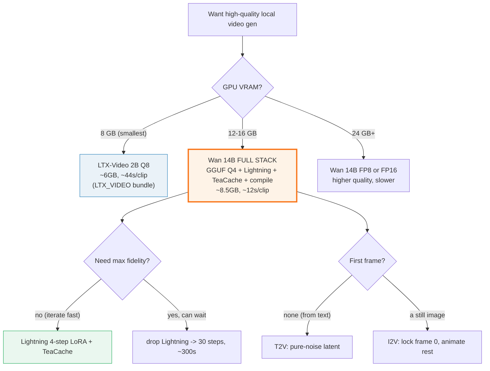

# Wan 2.2 (14B) — running a 14B video model on a 12GB GPU in ~12s (the optimization stack)

> Companion: [wan_video.py](https://github.com/quanhua92/tutorials/blob/main/local-llm/wan_video.py)
> Live playground: [wan_video.html](./wan_video.html)
> The denoising math side: [DIFFUSION_FUNDAMENTALS.md](./DIFFUSION_FUNDAMENTALS.md) — what each diffusion step actually does
> Sibling (the lighter, faster-but-lower-quality alternative): [LTX_VIDEO.md](./LTX_VIDEO.md) 🔗

## 0. TL;DR

Wan 2.2 (Alibaba) **14B** produces **higher quality** video than LTX-Video 2B
(better temporal coherence, more detail) but is **7× heavier** (14B vs 2B
params). Naive inference — **30 diffusion steps, FP16, full attention** — takes
**~5 minutes** and needs **28 GB** of VRAM, which fits **no consumer GPU**.

The fix is a stack of **four orthogonal optimizations**, each attacking a
different cost axis, so the speedups **multiply**:

```
        GGUF Q4 shrinks WEIGHTS  ->  fits 12GB (28GB -> 8.5GB)
        Lightning shrinks STEPS  ->  30 -> 4      (7.5x)
        TeaCache shrinks PER-STEP work -> cache attention (2.5x)
        compile shrinks KERNEL overhead           (1.3x)
                                 they MULTIPLY:
        300s  --Lightning-->  40s  --TeaCache-->  16s  --compile-->  12.3s
```

**Gold value** (reproduced in the HTML playground):

```
Base:   30 steps x full attn x FP16    = 300 s   (fits NO consumer GPU)
+Lightning (4 steps): 300 * (4/30)     =  40 s
+TeaCache (2.5x):     40 / 2.5          =  16 s
+compile (1.3x):      16 / 1.3          =  12.3 s
TOTAL SPEEDUP = 300 / 12.3              = ~24.4x   (fits a 12GB GPU)
VRAM: 14B FP16 = 28.0 GB  ->  GGUF Q4 = 8.5 GB
```

---

## 1. The lineage — heavy 14B naive → 14B that fits + is fast

```mermaid
graph LR
    NAIVE["WAN 2.2 14B NAIVE<br/>30 steps, FP16, full attention<br/>14B x 16/8 = 28GB -> fits NO GPU<br/>~5 min/clip, highest quality"]
    NAIVE -->|"GGUF Q4 quantize weights<br/>28GB -> 8.5GB (fits 12GB)"| Q4["+ GGUF Q4 (enabler)<br/>fits a 12GB GPU<br/>~2% quality drop"]
    Q4 -->|"Lightning distill<br/>30 steps -> 4 steps"| LT["+ Lightning<br/>7.5x fewer denoise passes<br/>~5-10% quality drop"]
    LT -->|"TeaCache cache attention<br/>~40% skipped"| TC["+ TeaCache<br/>2.5x, no quality loss"]
    TC -->|"torch.compile / sage<br/>kernel fusion"| CP["+ compile<br/>1.3x, no quality loss"]
    CP --> DONE["FULL STACK<br/>8.5GB, ~12.3s, ~24x faster<br/>fits 12GB consumer GPU"]
    style NAIVE fill:#fdecea,stroke:#c0392b,stroke-width:2px
    style Q4 fill:#fef3e7,stroke:#f97316,stroke-width:3px
    style LT fill:#eaf2f8,stroke:#2980b9,stroke-width:2px
    style TC fill:#eaf7ef,stroke:#27ae60,stroke-width:2px
    style CP fill:#f3eefb,stroke:#b9a9e8,stroke-width:2px
    style DONE fill:#eaf7ef,stroke:#27ae60,stroke-width:3px
```



**The key insight.** Each layer attacks an **orthogonal** cost, which is why the
speedups **multiply** instead of compete:

| Cost axis | What dominates it | Optimization | Effect |
|---|---|---|---|
| **Weights (memory)** | 14B params × bytes/param | **GGUF Q4** | 28 GB → 8.5 GB (the *enabler* — fits the GPU) |
| **Steps (loop)** | number of denoise passes | **Lightning** | 30 → 4 steps = 7.5× |
| **Per-step (compute)** | attention FLOPs each step | **TeaCache** | skip ~40% redundant attention = 2.5× |
| **Kernel (dispatch)** | Python overhead, unfused kernels | **compile / sage** | fuse kernels = 1.3× |

GGUF Q4 is special: it is the **enabler** (without it the model doesn't fit),
but it is *not* a wall-clock multiplier in the gold speed chain — its win is
memory. The speed chain proper is **Lightning × TeaCache × compile**.

---

## 2. The mechanism — the cumulative speedup

Every number below is printed by `wan_video.py`; the factors come from the
Lightning (Lightx2v) distillation LoRA, TeaCache, and the sage/compile community
workflows (see Sources).

### A — The four layers and their cost axis

> From `wan_video.py` Section A:
> ```
>   axis            optimization           what it does              speedup
>   --------------- ---------------------- ------------------------- --------
>   WEIGHTS (mem)   GGUF Q4 quantization   28GB -> 8.5GB (fits 12GB) enabler*
>   STEPS (loop)    Lightning distillation 30 steps -> 4 steps       7.5x
>   PER-STEP (flop) TeaCache               reuse cached attention   2.5x
>   KERNEL (dispatch) torch.compile/sage   fuse kernels             1.3x
> ```

- **Lightning (step distillation):** train a *student* model to produce in **4
  steps** what the *teacher* takes **30 steps** for. The student is shipped as a
  distillation **LoRA** (Lightx2v `Wan2.2-...-4steps-lora-rank64`), so you load
  it on top of the base model — no separate weights. Quality drop ~5–10%.
- **TeaCache (Temporal-Aware Cache):** the observation that attention **outputs
  barely change between consecutive timesteps**. Cache the output; reuse it when
  the change is below a threshold. Skip ~40% of attention = ~2.5×, **no quality
  loss** at a conservative threshold (aggressive → flicker/artifacts).
- **GGUF Q4 quantization:** block-quantize the 14B weights (Q4_K_M): 28 GB FP16
  → 8.5 GB. Fits a **12 GB** GPU. ~2% quality drop (near-lossless for diffusion).
- **torch.compile / sage attention:** fuse kernels, cut Python dispatch overhead.
  ~1.3× on top of everything else, **no quality loss** (same math, faster kernels).

### B — The gold cumulative chain (300s → 12.3s)

> From `wan_video.py` Section B:
> ```
>   Base (naive)          30 steps, full attn, FP16   =  300.00 s   (1.0x)
>   +GGUF Q4              28GB -> 8.5GB (fits 12GB)   =  300.00 s   (1.0x speed; enabler)
>   +Lightning (4 steps)  300 x (4/30)                =   40.00 s   (7.5x)
>   +TeaCache (2.5x)      40 / 2.5                    =   16.00 s   (18.75x)
>   +compile (1.3x)       16 / 1.3                    =   12.31 s   (24.4x)
>
>   TOTAL SPEEDUP = 300 / 12.3  =  24.4x   (often quoted ~25-30x)
>
> | layer                 | vs previous | cumulative |
> |-----------------------|-------------|------------|
> | Base (naive)          |    1.0x     |    1.0x    |
> | +GGUF Q4 (enabler)    |    1.0x*    |    1.0x    |
> | +Lightning (4 steps)  |    7.5x     |    7.5x    |
> | +TeaCache (2.5x)      |    2.5x     |   18.75x   |
> | +compile (1.3x)       |    1.3x     |   24.4x    |
>   * GGUF Q4 is a memory enabler (fits the GPU), not a time multiplier here.
> ```

**Why they multiply cleanly:** `7.5 × 2.5 × 1.3 = 24.375`. Lightning cuts the
*number* of passes; TeaCache cuts the *work per pass*; compile cuts the
*overhead per unit of work*. Touching three independent axes is why the combined
speedup is multiplicative, not additive.

---

## 3. VRAM — why GGUF Q4 is the enabler (28 GB → 8.5 GB)

```
14B params x 16 / 8 = 28.0 GB   (FP16 - fits NO consumer GPU; biggest card is 24GB)
14B params x 4.85 / 8 = 8.5 GB  (GGUF Q4 - fits a 12GB GPU)
```

> From `wan_video.py` Section C:
> ```
> | format       | bpw  | weights  | 24GB GPU? | 16GB? | 12GB? |
> |--------------|------|----------|-----------|-------|-------|
> | GGUF_Q4      | 4.85 |   8.49 GB |    FIT     |  FIT   |  FIT   |
> | FP8_scaled   | 8.00 |  14.00 GB |    FIT     |  FIT   |  no   |
> | FP16         | 16.00 |  28.00 GB |    no     |  no   |  no   |
>
>   FP16 weights = 14.0B x 16 / 8 = 28.0 GB   (fits no consumer GPU)
>   GGUF Q4     = 14.0B x 4.85 / 8 = 8.49 GB   (fits 12GB)
>   VRAM compression = 28.0 / 8.49 = 3.30x
> ```

**FP16 (28 GB) fits no consumer GPU** — the largest consumer card is 24 GB, and
you still need activations on top of weights. **FP8 scaled** (ComfyUI-repackaged,
~14 GB) fits 16 GB+ cards. **GGUF Q4** (~8.5 GB) is the tier that opens up the
**12 GB** consumer cards (RTX 3060 12 GB / RTX 4070) at a ~2% quality cost
(barely noticeable for diffusion). The same GGUF block-quant concept applies to
image models — see [FLUX_GGUF.md](./FLUX_GGUF.md).

> **GGUF Q4 adds the *fit*; TeaCache + Lightning add the *speed*. You need both
> to run 14B locally.**

---

## 4. Quality tradeoff — what each layer costs in fidelity

> From `wan_video.py` Section D:
> ```
> | optimization        | speedup | quality drop | reversible? |
> |---------------------|---------|--------------|-------------|
> | GGUF Q4             | ~ varies |       2.0%  | no (baked in) |
> | Lightning (4 steps) | ~ varies |       7.5%  | no (baked in) |
> | TeaCache            | ~ varies |       0.0%  | yes (toggle off) |
> | compile             | ~ varies |       0.0%  | yes (toggle off) |
>
>   Combined worst-case quality drop ~=   9.5% (sum of independent drops;
>   in practice errors partially cancel, so perceived drop is lower).
> ```

- **GGUF Q4: ~2%** — block quantization, near-lossless for diffusion.
- **Lightning: ~5–10%** — fewer steps = less refinement. The distillation LoRA
  recovers most of it, but fine detail / temporal coherence softens. This is the
  **biggest** fidelity cost and is **baked in** (you commit to 4 steps).
- **TeaCache: 0%** at the conservative threshold (aggressive → flicker). **Reversible.**
- **compile: 0%** — bit-exact same math, faster kernels. **Reversible.**

The practical takeaway: GGUF Q4 + compile are nearly free wins; TeaCache is free
if you keep the threshold conservative; **Lightning is the one real quality
trade** — use it when ~12 s/clip matters more than the last 5–10% of fidelity.

---

## 5. Image-to-video conditioning

Wan 2.2 supports **image-to-video (I2V)**: provide a starting frame (encoded via
the VAE); the model generates **motion** for the remaining frames. The **first
frame stays consistent** with the input image. Same DiT, same step count — only
the **initial latent** changes (frame 0 = image latent, locked; the rest start as
noise and get denoised). **The same optimization stack applies.**

> From `wan_video.py` Section E:
> ```
> Tiny demo (seeded). Latent grid 4(frames) x 2(h) x 2(w), 1 channel:
>   I2V initial latent:
>     frame 0: [[0.4, 0.5], [0.7, 0.8]]  [LOCKED image]
>     frame 1: [[-0.93, -0.21], [1.11, 0.42]]
>     frame 2: [[1.04, 0.25], [0.39, 0.19]]
>     frame 3: [[-1.67, 0.86], [0.51, 0.5]]
>
> After denoising: frame 0 = the input image (consistent); frames 1..3 are
> generated motion. This is how Wan animates a still image into a clip.
> ```

---

## 6. Worked example — Wan 14B vs LTX 2B

> From `wan_video.py` Section F:
> ```
> | config                          | params | VRAM   | gen      | quality |
> |---------------------------------|--------|--------|----------|---------|
> | LTX-Video 2B (Q8, distilled)    |    2B  |  6.0GB |   44.0 s | good    |
> | Wan 14B (naive 30 steps FP16)   |   14B  | 28.0GB |  300.0 s | highest |
> | Wan 14B (GGUF Q4, naive steps)  |   14B  |  8.5GB |  300.0 s | fits but slow |
> | Wan 14B (FULL stack)            |   14B  |  8.5GB |   12.3 s | high    |
> ```

The stack is so effective that **full-stack Wan (12.3 s) is faster than LTX 2B
(44 s)** on the reference numbers — **while keeping the 14B quality edge**. The
tradeoff is the card: Wan needs ≥12 GB; LTX runs on 8 GB. Note also the middle
row: **GGUF Q4 alone doesn't help speed** — it makes the model *fit*, but you
still pay for 30 steps. GGUF Q4 is the prerequisite, Lightning/TeaCache/compile
are the payoff.

Decision tree:



---

## 7. Pitfalls (trap → symptom → fix)

| Trap | Symptom | Fix |
|---|---|---|
| **Counting GGUF Q4 as a wall-clock speedup** | "24× must be 30× because GGUF is faster too" — numbers don't reconcile | GGUF Q4 is the **memory enabler** (28→8.5 GB), not a multiplier in the speed chain. The speed chain is **Lightning × TeaCache × compile = 24.4×**. GGUF may give a small bandwidth win in practice, but the documented gold math treats it as fit-only. |
| **Assuming the four speedups add** | Predicting 7.5 + 2.5 + 1.3 = 11.3× and being 2× off | They **multiply** because they attack orthogonal cost axes: `7.5 × 2.5 × 1.3 = 24.4×`. Additive would badly underestimate. |
| **Forgetting GGUF Q4 alone gives NO speed** | Q4 model still takes ~300 s and wondering why | Q4 only shrinks the **weights** (fits the GPU). Step count (30) is unchanged, so time is unchanged. You must add **Lightning** to cut steps. Q4 = fit; Lightning/TeaCache/compile = speed. |
| **Pushing TeaCache threshold too aggressive** | Video looks 2.5× faster but flickers / shows artifacts | TeaCache is **threshold-tunable**. Keep it conservative (the default) for 0% quality loss; aggressive caching reuses stale attention and causes temporal flicker. It's a dial, not a free switch. |
| **Quoting "~30×" as the precise figure** | The number doesn't reproduce: `300/12.3 = 24.4×`, not 30× | The honest computed value is **24.4×** (sometimes rounded up to "~25–30×" in marketing). Pin the formula (`7.5×2.5×1.3`) so it reproduces. |
| **Mixing GPU classes when comparing to LTX** | "Wan 12 s beats LTX 44 s" stated without the VRAM caveat | The stack's 12.3 s assumes a **12 GB+** card (8.5 GB weights). LTX's 44 s runs on **8 GB**. State both the GPU tier *and* the time; they're not the same hardware budget. |
| **Loading Lightning as a separate model** | Extra 14 GB of VRAM / wrong outputs | Lightning ships as a **distillation LoRA** (`...-4steps-lora-rank64`), loaded *on top of* the base model — not a separate checkpoint. Same for the I2V variant. |
| **Treating Wan 2.2 as a single file** | Missing high/low-noise experts; broken generation | Wan 2.2 T2V/I2V 14B uses **two** diffusion checkpoints (high-noise + low-noise experts). The 5B TI2V variant is a single hybrid file. Pick the variant your workflow expects. |

---

## 8. Cheat sheet

```
# the speed chain (the whole point) - multiplies, it does not add
base        = 300 s              (30 steps, FP16, full attn)
+Lightning  = 300 * (4/30)  =  40 s      (30 -> 4 steps, ~5-10% quality)
+TeaCache   = 40 / 2.5      =  16 s      (cache attention, 0% quality)
+compile    = 16 / 1.3      =  12.3 s    (kernel fusion, 0% quality)
SPEEDUP     = 300 / 12.3    =  ~24.4x

# the VRAM (the enabler)
FP16     = 14B * 16 / 8  = 28.0 GB       (fits NO consumer GPU)
GGUF Q4  = 14B * 4.85 / 8 = 8.5 GB       (fits 12GB; ~2% quality)

# the four cost axes (why they multiply)
WEIGHTS  -> GGUF Q4     (enabler, not a speed multiplier)
STEPS    -> Lightning   (7.5x)
PER-STEP -> TeaCache    (2.5x)
KERNEL   -> compile     (1.3x)
total    = 7.5 * 2.5 * 1.3 = 24.4x
```

```bash
# locally (ComfyUI + GGUF custom node + WanVideoWrapper)
#   https://docs.comfy.org/tutorials/video/wan/wan2_2   (official workflow guide)
#   https://github.com/city96/ComfyUI-GGUF             (load Q4 GGUF)
#   https://github.com/kijai/ComfyUI-WanVideoWrapper   (Wan node suite)
#
# models you need for the 14B Q4 + Lightning path:
#   bullerwins/Wan2.2-T2V-A14B-GGUF (Q4_K_M ~ 8.5GB)
#   lightx2v/Wan2.2-Lightning (...-4steps-lora-rank64)  (distillation LoRA)
#   wan2.2_vae.safetensors / wan_2.1_vae.safetensors    (VAE decode)
#   umt5_xxl_fp8_e4m3fn_scaled.safetensors              (text encoder)
#
# the stack, in node order:
#   GGUF loader (Q4) -> Lightning LoRA (4 steps) -> TeaCache node (threshold)
#                     -> sage/compile backend -> KSampler (4 steps)
```

| You want… | Do this |
|---|---|
| Run 14B on a 12 GB card | **GGUF Q4** (~8.5 GB) — the enabler |
| Cut wall-clock ~24× | **Lightning + TeaCache + compile** on top of Q4 |
| Free wins (0% quality loss) | **TeaCache (conservative)** + **compile** |
| The one real quality trade | **Lightning** (~5–10%); skip it for max fidelity, accept ~300 s |
| Animate a still image | I2V: lock frame 0 to the encoded image latent, animate the rest |
| Smallest possible card (8 GB) | Use [LTX 2B](./LTX_VIDEO.md) instead; Wan needs ≥12 GB |

---

## 🔗 Cross-references

- **[LTX_VIDEO.md](./LTX_VIDEO.md)** 🔗 — the lighter, faster-but-lower-quality
  alternative. LTX 2B fits 8 GB at ~44 s; full-stack Wan 14B fits 12 GB at ~12 s
  but with the 14B quality edge. LTX wins on the **smallest card**, Wan wins on
  **quality at similar speed** once the optimization stack is applied.
- **[DIFFUSION_FUNDAMENTALS.md](./DIFFUSION_FUNDAMENTALS.md)** — the denoising
  process being optimized: the 30-step schedule Lightning distills to 4, and the
  per-step attention TeaCache caches.
- **[FLUX_GGUF.md](./FLUX_GGUF.md)** 🔗 — the same GGUF Q4 block-quant concept,
  applied to image models. The `bpw` math (`14B × 4.85 / 8 = 8.5 GB`) is identical.
- **[QUANT_TYPES.md](./QUANT_TYPES.md)** 🔗 — the block-quant internals behind
  Q4_K_M (the `4.85 bpw` that lands Wan 14B at ~8.5 GB).
- **[COMFYUI_WORKFLOW.md](./COMFYUI_WORKFLOW.md)** — how to actually *run* the
  stack locally: the node graph (GGUF Loader → Lightning LoRA → TeaCache →
  KSampler → VAE Decode) that turns these optimizations into a workflow.

---

## Sources

- [ComfyUI Wan 2.2 tutorial (docs.comfy.org)](https://docs.comfy.org/tutorials/video/wan/wan2_2) — official usage guide; the 14B two-expert (high-noise / low-noise) MoE split, the 5B TI2V hybrid variant, I2V/T2V/FLF2V workflows, and the repackaged model file layout.
- [Comfy-Org/Wan_2.2_ComfyUI_Repackaged (HuggingFace)](https://huggingface.co/Comfy-Org/Wan_2.2_ComfyUI_Repackaged) — the fp8/fp16 repackaged checkpoints (T2V/I2V high-noise + low-noise experts) the official workflow targets.
- [bullerwins/Wan2.2-T2V-A14B-GGUF / Wan2.2-I2V-A14B-GGUF](https://huggingface.co/bullerwins/Wan2.2-T2V-A14B-GGUF) — community Q4_K_M GGUFs (~8.5 GB) that fit the 12 GB tier.
- [QuantStack Wan 2.2 GGUFs](https://huggingface.co/collections/QuantStack/wan22-ggufs-6887ec891bdea453a35b95f3) — alternate quant tiers (Q4/Q5/Q8) for the speed/quality/VRAM trade.
- [lightx2v/Wan2.2-Lightning](https://huggingface.co/lightx2v/Wan2.2-Lightning) — the 4-step distillation LoRA (`...-4steps-lora-rank64-V1`); the 30→4 step reduction behind the 7.5× in the speed chain.
- [Kijai/ComfyUI-WanVideoWrapper](https://github.com/kijai/ComfyUI-WanVideoWrapper) — the Wan node suite (TeaCache toggle, sage/compile backend) the community fast workflows use.
- [city96/ComfyUI-GGUF](https://github.com/city96/ComfyUI-GGUF) — the custom node that loads Q4 GGUF diffusion models in ComfyUI (same loader as Flux GGUF).
- [Wan-AI/Wan2.2 model cards (HuggingFace)](https://huggingface.co/Wan-AI) — the 14B (A14B) parameter count and the Apache 2.0 license.
