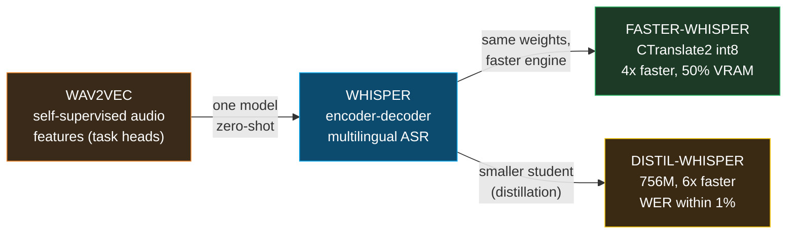
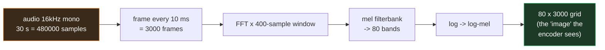
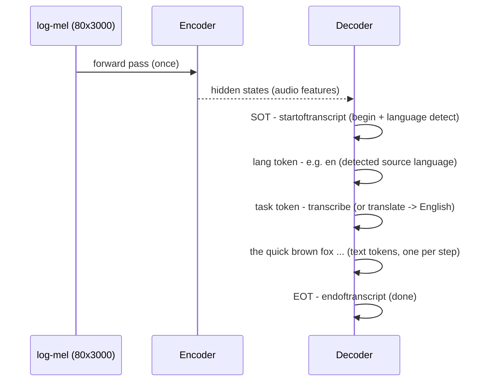

# Whisper STT — speech-to-text for local transcription (encoder-decoder Transformer + faster-whisper + distil-whisper)

> Companion: [whisper_stt.py](https://github.com/quanhua92/tutorials/blob/main/local-llm/whisper_stt.py)
> Live: [whisper_stt.html](./whisper_stt.html)

## 0. TL;DR

Whisper is an **encoder-decoder Transformer** for speech-to-text. Audio goes in
(16 kHz mono), text comes out. The pipeline:

1. **Resample** to 16 kHz mono (Whisper is hard-wired to this rate).
2. **Log-mel spectrogram**: 25 ms windows every 10 ms → 80 mel bands → log. This
   is the "image" the model sees. **30 s of audio = 3000 mel frames** (`80 × 3000`).
3. **Encoder**: reads the mel spectrogram → hidden states (audio features).
4. **Decoder**: autoregressively emits **text tokens**, one per step, conditioned
   on the encoder output + prior tokens. **Special tokens** select the behaviour:
   `<|startoftranscript|> <|en|> <|transcribe|> … <|endoftranscript|>` — the same
   weights transcribe **or** translate-to-English.

**Gold (verified, [check: OK] in the `.py` and `.html`):** 30 s audio → **3000
mel frames** (`30 × 100`). large-v3 = **1550M params, ~10 GB VRAM**.
**faster-whisper** (CTranslate2, int8) = same model, **~4× faster, ~50% less
VRAM** (int8 weights = 1550 MB vs FP16 3100 MB). On an RTX 4090, large-v3 runs at
**RTF 0.03 = 33× real-time** (30 s clip in 0.9 s) — you can transcribe **live**.

---

## 1. What it is (lineage old → new, WHY each step)



| Step | Problem it fixes | What changes |
|---|---|---|
| **1. Wav2Vec** | — (the precursor) | Self-supervised representation learning on raw audio. Great features, but needs task-specific heads; not zero-shot ASR out of the box. |
| **2. Whisper** | Per-task training; brittle ASR | Train ONE encoder-decoder on **680k hours** of weakly-supervised web audio → multilingual, zero-shot, robust. Problem: the official OpenAI impl (PyTorch, FP16/FP32) is **slow** and **memory-heavy**. |
| **3. faster-whisper** | Slow + memory-heavy inference | The **same** Whisper weights on **CTranslate2** (optimised C++ Transformer runtime, int8/FP16, fused kernels). **~4× faster, ~50% less VRAM**, bit-identical greedy output. The local default. |
| **4. distil-whisper** | Full model is still big | Knowledge distillation: a **student** with fewer decoder layers mimics the teacher. distil-large-v3 = **756M params, ~6× faster, WER within ~1%**. |

**Why it matters:** on an RTX 4090, faster-whisper large-v3 runs at **RTF 0.03 —
33× real-time**. You can transcribe live speech with huge headroom. Even an M1
Pro laptop runs medium at ~6× real-time. The official OpenAI model on CPU
(RTF ~2–4) **cannot** keep up live.

---

## 2. The mechanism (internals)

### 2a. Audio → log-mel spectrogram (30 s = 3000 frames)

Whisper is **hard-coded to 16 kHz mono** — the mel filterbank is fixed to that
rate, so any other sample rate silently degrades accuracy.

- **FFT window** = 400 samples = 25 ms (`400 / 16000`)
- **hop** = 160 samples = 10 ms (`160 / 16000`) → **100 frames/s**
- **mel bands** = 80

So **30 s of audio → `30 × 100 = 3000` mel frames**, an `80 × 3000` grid. The
encoder sees this as a 1-channel "image".



> From whisper_stt.py Section A:
> ```
> frames/s = sample_rate / hop = 16000 / 160 = 100
> 30 s of audio -> 3000 mel frames (= 300 x 10)
> mel grid for 30 s = 80 bands x 3000 frames = 240000 values
> ```

### 2b. Encoder-decoder + special tokens (autoregressive decode)

The **encoder** runs **once** over the mel spectrogram → hidden states. The
**decoder** is **autoregressive**: it emits **one text token per step**,
conditioned on the encoder output + all tokens so far (KV-cached after the first
step). Special tokens select the behaviour of the **same weights**:



> From whisper_stt.py Section B:
> ```
> Autoregressive decode trace (phrase = 'the quick brown fox'):
>
> | step | emitted token                | conditioned on (mel + tokens so far)        |
> |------|------------------------------|----------------------------------------------|
> | 1    | <|startoftranscript|>        | (mel context)                                |
> | 2    | <|en|>                       | <|startoftranscript|>                        |
> | 3    | <|transcribe|>               | <|startoftranscript|> <|en|>                 |
> | 4    | the                          | <|startoftranscript|> <|en|> <|transcribe|>  |
> | 5    | quick                        | <|startoftranscript|> <|en|> <|transcribe... |
> | ...
> | 8    | <|endoftranscript|>          | <|startoftranscript|> <|en|> <|transcribe... |
>
> Full emitted sequence:
>   <|startoftranscript|> <|en|> <|transcribe|> the quick brown fox <|endoftranscript|>
> ```

The same model also emits `<|nospeech|>` when there is no speech (skip the clip),
which is how Whisper handles silence without hallucinating.

---

## 3. Model sizes + practical config

### The model size ladder

> From whisper_stt.py Section C:
> ```
> | model    | params (M) | VRAM (GB) | rel speed | best for       |
> |----------|------------|-----------|-----------|----------------|
> | tiny     | 39         | 1         | 32        | testing        |
> | base     | 74         | 1         | 16        | quick draft    |
> | small    | 244        | 2         | 6         | good quality   |
> | medium   | 769        | 5         | 2         | high quality   |
> | large-v3 | 1550       | 10        | 1         | best quality   |
> ```

All sizes share the **same architecture** and mel front-end; only layer counts /
widths differ. `large-v3` is the current best-quality checkpoint (supersedes
`large-v1`/`v2`).

### faster-whisper (CTranslate2)

```python
from faster_whisper import WhisperModel

model = WhisperModel("large-v3", device="cuda", compute_type="int8")  # default: fast + lean
segments, info = model.transcribe("audio.mp3", beam_size=5)
for seg in segments:
    print(seg.text)
```

Key flags: `compute_type` — `"int8"` (default, fastest, ~50% VRAM), `"float16"`
(slightly more accurate, ~2× VRAM), `"int8_float16"` (int8 weights + FP16
compute, the common sweet spot). `info.language` gives the detected language;
`info.language_probability` its confidence.

---

## 4. Worked example (the gold centerpiece)

### faster-whisper vs OpenAI Whisper (memory)

int8 weights are **exactly half** of FP16 → ~50% less memory, plus CTranslate2's
fused kernels give ~4× throughput — same model, (for greedy decoding)
bit-identical transcripts.

> From whisper_stt.py Section D:
> ```
> | model    | params (M) | FP16 MB | int8 MB | memory of FP16 | reduction |
> |----------|------------|---------|---------|----------------|-----------|
> | tiny     | 39         | 78      | 39      | 0.50          | 50%       |
> | base     | 74         | 148     | 74      | 0.50          | 50%       |
> | small    | 244        | 488     | 244     | 0.50          | 50%       |
> | medium   | 769        | 1538    | 769     | 0.50          | 50%       |
> | large-v3 | 1550       | 3100    | 1550    | 0.50          | 50%       |
> ```

### distil-whisper (knowledge distillation)

distil-large-v3 keeps the teacher's encoder, distils the 32-layer decoder down
to 2 layers: **756M params** (`756/1550 = 48.8%` of large-v3, ~49–51% smaller),
**~6× faster**, **WER within ~1%** of the teacher on English. Trade-off: it
trims multilingual coverage — for non-English, use the full model.

> From whisper_stt.py Section E:
> ```
> distil-large-v3: 756M params (48.8% of large-v3)
> reduction = 1 - 756/1550 = 51.2% fewer params (~49-51% smaller)
> speed: ~6x faster than the teacher (fewer decoder layers per token)
> quality: WER within ~1% of large-v3 on English
> ```

### RTF + WER benchmarks

> From whisper_stt.py Section F:
> ```
> | setup                       | hardware       | RTF   | x real-time | 30s clip in |
> |-----------------------------|----------------|-------|-------------|-------------|
> | faster-whisper large-v3     | RTX 4090       | 0.03  | 33.3        | 0.9      s  |
> | faster-whisper large-v3     | Apple M1 Pro   | 0.10  | 10.0        | 3.0      s  |
> | faster-whisper medium       | Apple M1 Pro   | 0.15  | 6.7         | 4.5      s  |
> | faster-whisper small        | Apple M1 Pro   | 0.35  | 2.9         | 10.5     s  |
> | OpenAI whisper large        | CPU (8-core)   | 3.00  | 0.3         | 90.0     s  |
> ```

**RTF < 1.0 ⇒ faster than real-time (live-capable).** RTF 0.03 → 33× real-time.

### Gold table (recomputed in the `.html`)

> From whisper_stt.py Section G:
> ```
> | stage / metric                  | value                |
> |---------------------------------|----------------------|
> | sample rate                     | 16000 Hz             |
> | mel bands                       | 80                   |
> | frames/s (10 ms hop)            | 100                  |
> | 30 s -> mel frames              | 3000                 |
> | mel grid shape                  | 80 x 3000            |
> | large-v3 params                 | 1550M                |
> | large-v3 VRAM (practical)       | ~10 GB               |
> | int8 weights (faster-whisper)   | 1550 MB (50% of FP16)|
> | faster-whisper vs OpenAI        | ~4x faster, 50% VRAM |
> | RTF (RTX 4090, large-v3)        | 0.03                 |
> | real-time speedup (1/RTF)       | 33.3x                |
> | 30 s clip processing time       | 0.9 s                |
>
> [check] 30 s -> 3000 mel frames: True -> OK
> [check] int8 = 50% of FP16 memory: True -> OK
> [check] int8 large-v3 = 1550 MB: True -> OK
> [check] RTF 0.03 -> 33.3x real-time: True -> OK
> [check] 30 s @ RTF 0.03 -> 0.9 s: True -> OK
> [check] mel grid 80 x 3000: True -> OK
> ```

---

## 5. Pitfalls (trap | symptom | fix)

| Trap | Symptom | Fix |
|---|---|---|
| **Wrong sample rate** | Garbled / wrong-language output, high WER | Whisper is **hard-coded to 16 kHz mono**. Resample (`ffmpeg -ar 16000 -ac 1`) before feeding; the mel filterbank is fixed to that rate. |
| **Using the OpenAI impl on CPU** | RTF ~2–4, cannot transcribe live | Switch to **faster-whisper** (CTranslate2): ~4× faster, ~50% less VRAM, same model. On CPU it is often the only way to get near real-time. |
| **Hallucinations on silence/music** | Phantom text ("Thanks for watching!") during quiet or musical segments | Whisper has no silence gate in the OpenAI impl. Use the `<|nospeech|>` detection (`no_speech_threshold`), or VAD (e.g. Silero) to drop non-speech segments before/around Whisper. |
| **30 s window slicing** | Dropped words at chunk boundaries | Whisper processes **30 s windows**. Chunk longer audio with overlap and re-align timestamps (faster-whisper / whisperX do this); never hard-cut mid-word. |
| **Confusing RTF with WER** | "It's fast so it must be accurate" | **RTF = speed, WER = accuracy.** A tiny model is fast (low RTF) but high WER. Pick the size for your accuracy budget, then faster-whisper/distil for speed. |
| **distil for non-English** | Poor multilingual accuracy | distil-whisper trims coverage for speed. For non-English, use the **full** large-v3 (or medium). |
| **Timestamp drift** | Word/sentence timestamps off by seconds | Greedy decode has coarse timestamps. Use **whisperX** (forced alignment) or faster-whisper's `word_timestamps=True` for word-level accuracy. |
| **Expecting bit-identical across engines** | Tiny diffs vs the OpenAI model | Greedy decoding is bit-identical on faster-whisper; **beam search / temperature sampling can differ** (different RNG/numerics). Pin `beam_size` and `temperature=0` for reproducibility. |

---

## 6. Cheat sheet

```
pipeline   : 16kHz mono -> log-mel (80 bands, 10ms hop) -> encoder -> decoder -> text
             30s audio -> 3000 mel frames (80 x 3000 grid).

arch       : encoder reads mel ONCE -> hidden states.
             decoder is autoregressive: 1 token/step, KV-cached.
             special tokens SELECT behaviour of the SAME weights:
               <|startoftranscript|> <|lang|> <|transcribe|/|translate|> ... <|endoftranscript|>

sizes      : tiny 39M ~1GB 32x | base 74M ~1GB 16x | small 244M ~2GB 6x
             medium 769M ~5GB 2x | large-v3 1550M ~10GB 1x

faster-wh  : same weights on CTranslate2 (int8 default).
             int8 = 50% of FP16 memory (large-v3: 1550MB vs 3100MB).
             ~4x faster, 50% less VRAM, bit-identical greedy output. LOCAL DEFAULT.

distil-wh  : distil-large-v3 = 756M (49% smaller), ~6x faster, WER within 1%.
             English-only sweet spot; full model for multilingual.

RTF        : processing_time / audio_duration.  <1.0 = faster than real-time (LIVE).
             RTX4090 large-v3: 0.03 (33x).  M1Pro medium: 0.15 (6x).  CPU large: ~3 (slow).

WER        : large-v3 English ~5-8% | multilingual ~10-15% | distil ~6-9% (within 1%).

gold       : 30s -> 3000 frames.  large-v3 1550M/~10GB.  faster-whisper 4x/50% VRAM.
             RTF 0.03 -> 33x real-time -> 30s clip in 0.9s.
```

---

## 🔗 Cross-references

- **[tts_kokoro](./TTS_KOKORO.md)** (sibling, reverse direction) — Kokoro is
  **text → speech** (the inverse pipeline). Whisper is speech → text; together
  they form a full bidirectional voice loop. Where Whisper is an encoder-decoder
  reading a mel spectrogram, Kokoro (StyleTTS2 family) is a non-autoregressive
  acoustic model writing one.
- **[qwen3_tts](./QWEN3_TTS.md)** (sibling, end-to-end speech) — Qwen3-TTS is an
  end-to-end speech LM; Whisper's encoder-decoder + special-token control is the
  same "token steers behaviour" pattern, applied to ASR instead of TTS.
- **[VRAM_ESTIMATOR](./VRAM_ESTIMATOR.md)** (sibling) — the int8-vs-FP16 weight
  math here (`params × bytes/param`) is the same budget used for LLM VRAM; the
  faster-whisper 50% reduction is a quantisation story akin to GGUF quants.
- **[music_generation](./MUSIC_GENERATION.md)** (sibling) — Whisper's mel
  spectrogram is the shared audio representation; ACE-Step/YuE also reason over
  mel-style features for music.

## Sources

- [Robust Speech Recognition via Large-Scale Weak Supervision (Radford et al., arXiv:2212.04356)](https://arxiv.org/abs/2212.04356)
- [faster-whisper (SYSTRAN/faster-whisper, CTranslate2 backend)](https://github.com/SYSTRAN/faster-whisper)
- [CTranslate2 inference engine](https://github.com/OpenNMT/CTranslate2)
- [distil-whisper: 6× faster, 49% smaller, within 1% WER](https://github.com/huggingface/distil-whisper)
- [Distil-Whisper Large v3 vs Whisper Large v3 benchmark (Salad)](https://blog.salad.com/distil-whisper-large-v2/)
- [OpenAI Whisper (model card + code)](https://github.com/openai/whisper)
