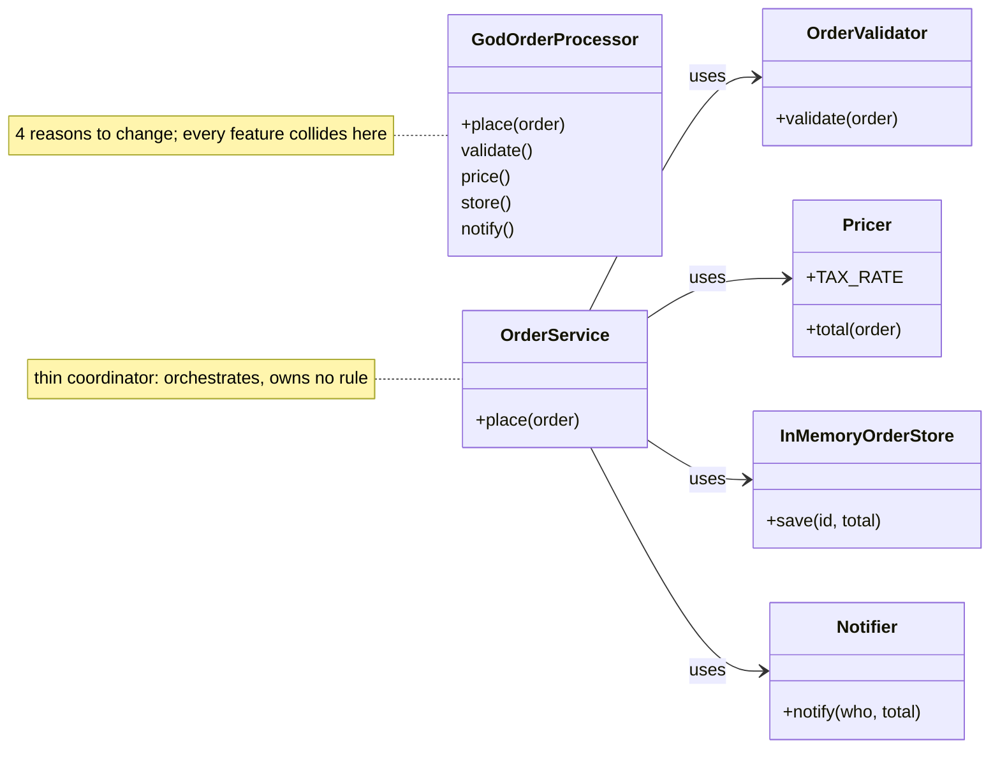
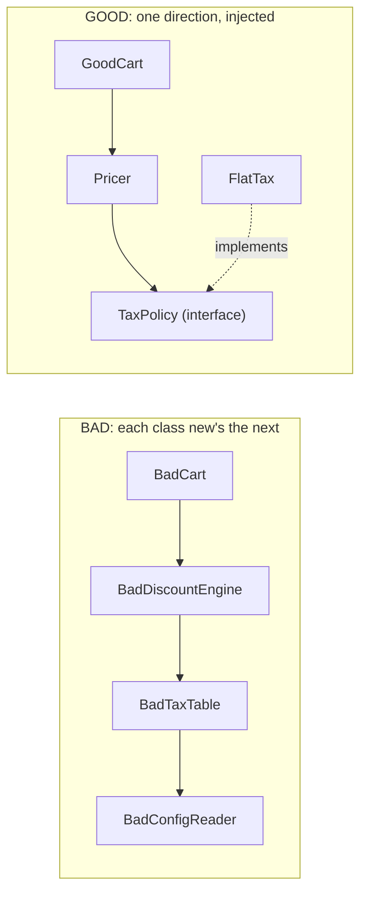

# Anti-Patterns — God Object, Spaghetti, Golden Hammer & friends

> **Companion code:** [`antipatterns.py`](https://github.com/quanhua92/tutorials/blob/main/lowleveldesign/antipatterns.py).
> **Captured output:** [`antipatterns_output.txt`](https://github.com/quanhua92/tutorials/blob/main/lowleveldesign/antipatterns_output.txt).
> **Live demo:** [`antipatterns.html`](https://github.com/quanhua92/tutorials/blob/main/lowleveldesign/antipatterns.html) — click an anti-pattern, see the before/after diff and a live gold check.
> **Dashboard:** [`./index.html`](./index.html)

---

## 0. TL;DR — the one idea

> **The analogy:** an anti-pattern is a *recurring bad habit that feels right in the moment*. A **God Object** is a junk drawer — you keep tossing things in because it's the easiest place to reach. A **Spaghetti** system is a bowl of noodles where pulling one strand drags five others. A **Golden Hammer** is the one screwdriver you own, so every screw, nail, and bolt gets the screwdriver. The cure is never "try harder" — it's a *structural* change: split by reason-to-change, inject dependencies, reach for the right tool, kill duplication, name your literals, and *measure before you optimize*.

This bundle shows the **six classic software anti-patterns** as runnable before/after code.
Every refactor in [`antipatterns.py`](https://github.com/quanhua92/tutorials/blob/main/lowleveldesign/antipatterns.py)
is **behavior-preserving** — `BAD == GOOD` is asserted for each one, then a green
`[check] OK` is printed, so you can see the smell removed without changing behavior.

| # | Anti-pattern | One-line symptom | Structural fix |
|---|---|---|---|
| 01 | **God Object** | One class validates, prices, stores, notifies | Split by reason-to-change + thin coordinator |
| 02 | **Spaghetti Code** | Each class `new`s the next concrete class | Dependency injection; depend on interfaces |
| 03 | **Golden Hammer** | Regex used to parse ints, split kv, count words | Pick the right tool per job (`int`, `partition`, `split`) |
| 04 | **Premature Optimization** | Ord-table lowercase + hand-rolled Counter | Clear code; `collections.Counter`; profile first |
| 05 | **Copy-Paste Programming** | Round-and-format boilerplate pasted 3× | Extract one helper; keep only the unique formula |
| 06 | **Magic Numbers** | `200`, `1.08`, `4` scattered with no names | Named constants + `HttpStatus` enum |

---

## 1. The six anti-patterns, visualized

### God Object — before vs after



### Spaghetti — coupling direction



---

## 2. Implementation map (where each lives in `antipatterns.py`)

All six live in [`antipatterns.py`](https://github.com/quanhua92/tutorials/blob/main/lowleveldesign/antipatterns.py).
Each section prints an `=== ... BAD ===` banner, an `=== ... GOOD ===` banner, the
sample output of both, and finally a `[check] OK` after asserting the two agree.

```
=== 01. GOD OBJECT -- BAD ===
GodOrderProcessor.place(...)        -> 54.0
  stored keys: ['o1']
  notified   : ('Alice', 54.0)
=== 01. GOD OBJECT -- GOOD ===
OrderService.place(...)            -> 54.0
  [check] OK   God Object refactor preserves total (12.5 * 4 * 1.08 = 54.0)

=== 02. SPAGHETTI CODE -- BAD ===
BadCart.checkout(100, 0.10)         -> 97.2  (4 classes, 0 injectable)
=== 02. SPAGHETTI CODE -- GOOD ===
GoodCart.checkout(100, 0.10)        -> 97.2  (deps injected, 1-liner test)
  [check] OK   Spaghetti -> DI preserves net (100 * 0.9 * 1.08 = 97.2)

... (Golden Hammer, Premature Optimization, Copy-Paste, Magic Numbers) ...

=== ALL SIX ANTI-PATTERNS: BAD == GOOD (behavior preserved), refactor safe ===
    God Object | Spaghetti | Golden Hammer | Premature Opt | Copy-Paste | Magic Numbers
  [check] OK   antipatterns.py complete
```

Run it yourself:

```bash
python3 antipatterns.py                 # prints all banners + 7 [check] OK lines
python3 antipatterns.py > antipatterns_output.txt 2>/dev/null   # capture
```

---

## 3. The fix for each, in one snippet

### 01 God Object — split by reason-to-change
```python
class OrderValidator:    @staticmethod  def validate(o): ...
class Pricer:            TAX_RATE = 0.08;  def total(self, o): ...
class InMemoryOrderStore: def save(self, oid, total): ...
class Notifier:           def notify(self, who, total): ...

class OrderService:       # thin coordinator — orchestrates, owns no rule
    def place(self, order):
        self._validator.validate(order)
        total = self._pricer.total(order)
        self._store.save(order["id"], total)
        self._notifier.notify(order["customer"], total)
        return total
```

### 02 Spaghetti — depend on an interface, inject the concrete
```python
class TaxPolicy(ABC):
    @abstractmethod  def tax(self, amount): ...

class FlatTax(TaxPolicy):
    def __init__(self, rate): self._rate = rate
    def tax(self, amount): return amount * self._rate

cart = GoodCart(Pricer(FlatTax(0.08)))   # swap the rate any time, one-liner test
```

### 03 Golden Hammer — reach for the honest tool
```python
def good_validate_int(s):
    try: int(s); return True          # was: re.fullmatch(r"-?\d+", s)
    except ValueError: return False

def good_parse_kv(line):
    key, sep, val = line.partition("=")   # was: re.fullmatch(r"(\w+)=(\w+)", line)
    return (key, val) if sep else None

def good_count_words(text):
    return len(text.split())              # was: len(re.findall(r"\S+", text))
```

### 04 Premature optimization — clear code first, profile second
```python
from collections import Counter
def good_is_even(n):      return n % 2 == 0                    # was: (n & 1) == 0
def good_word_freq(text): return dict(Counter(w.lower()        # was: ord-table
                                   for w in text.split()))
```

### 05 Copy-paste — extract the shared rule once
```python
def _format_area(area): return f"{round(area, 2):.1f} sq units"  # the one true copy

def good_square_area(side):     return _format_area(side * side)
def good_rectangle_area(w, h):  return _format_area(w * h)
def good_triangle_area(b, h):   return _format_area(0.5 * b * h)
```

### 06 Magic numbers — name them, and use an enum for closed sets
```python
class HttpStatus(Enum):
    OK = 200;  NOT_FOUND = 404;  SERVER_ERROR = 500

SALES_TAX_RATE = 0.08
PIN_LENGTH = 4

def good_price_with_tax(amount): return amount * (1 + SALES_TAX_RATE)
def good_is_valid_pin(pin):      return len(pin) == PIN_LENGTH and pin.isdigit()
```

---

## 4. SOLID / principle analysis

| Principle | Anti-pattern that violates it | How the GOOD version restores it |
|---|---|---|
| **S**RP | God Object (4 responsibilities) | One reason-to-change per class: `Validator`, `Pricer`, `Store`, `Notifier` |
| **O**CP | Copy-Paste (paste a 4th shape) | Extract `_format_area`; a new shape adds a 1-line function, no edit to siblings |
| **L**SP | Spaghetti (concrete baked in) | `FlatTax` is substitutable for any `TaxPolicy` — `GoodCart` never knows the rate source |
| **I**SP | God Object (fat interface) | Each collaborator exposes the minimum (`save`, `notify`, `total`) |
| **D**IP | Spaghetti (`BadCart` depends on `BadDiscountEngine` concrete) | Depend on `TaxPolicy` abstraction; inject the concrete at the root |
| **DRY** | Copy-Paste | The round+format rule lives in exactly one `_format_area` |
| **PIE** / clarity | Premature Optimization, Magic Numbers, Golden Hammer | Prefer the obvious tool; name literals; measure before tuning |

---

## 5. Tradeoffs

| Option | Pros | Cons |
|---|---|---|
| God Object | Fast to write for a throwaway script; one file to grep | Merge-conflict magnet; untestable; every change risks unrelated regressions |
| Decomposed services | Each unit testable in isolation; change radius small | More files; wiring (`OrderService.__init__`) needs a composition root / DI container |
| Regex-for-everything | One mental model; no imports | Slower than `str.split`; rejects valid inputs (`+5`); unreadable for non-trivial parsing |
| Stdlib tools (`int`, `partition`, `split`, `Counter`) | Clear, tested, fast, self-documenting | Need to know the stdlib exists (the real "cost") |
| "Clever" micro-optimizations | Looks impressive; sometimes genuinely faster in C/C++ | In CPython usually *not* faster; obscures intent; defeats the JIT/GC heuristics |
| Clear + profile-driven | Correctness obvious; hotspot fixes have data behind them | Requires a profiler step and discipline to resist early tuning |
| Magic numbers | Less typing; no extra symbols | Meaning lost; same literal drifts across files; change = grep-and-pray |
| Named constants / enums | Self-documenting; one source of truth; closed sets are type-safe | A little more ceremony; over-use creates "constant soup" |

### Killer Gotchas

- **Don't over-correct.** Splitting a 50-line script into 8 classes is *worse* than the God Object it replaces. Decompose when a class has **≥2 unrelated reasons to change**, not just because "more classes = more OOP".
- **DI ≠ framework.** Dependency injection is *passing arguments*. You do not need Spring/Guice to do it; the GOOD spaghetti example is pure constructor arguments.
- **Golden Hammer cuts both ways.** Reaching for `int()`/`partition()` is itself a hammer — use regex when the grammar is genuinely irregular (emails, log lines). The smell is using *one* tool for *every* job.
- **Premature optimization's escape hatch.** Knuth's "premature optimization is the root of all evil" has a second half people forget: *"in small efficiency matters, yes; but we should not skip the 97% of the time that doesn't matter."* Optimize the 3% **after** a profiler names it.
- **Copy-paste threshold.** Three duplications is the classic "Rule of Three" trigger — extract on the third, not the first (the first two may yet diverge).
- **Magic numbers vs. obvious literals.** `for i in range(7)` for days-of-week is fine; `if status == 200` is not. Wrap the literal when it carries **meaning, units, or a closed set** — not when it's a loop bound.
- **Behavior preservation is the whole game.** Every refactor above is gated by an `assert BAD == GOOD`. A "cleanup" that changes output is a bug in a trench coat. Always keep a characterization test before refactoring.

---

## 6. Detection in real codebases

| Smell | Cheap detector |
|---|---|
| God Object | LOC per class, methods per class, "number of distinct change reasons" as a KPI |
| Spaghetti / circular deps | `madge` (JS), `pylint --disable=all --enable=cyclic-import`, `import-linter` (Python), `dependency-cruiser` |
| Golden Hammer | grep for the one tool overused: `re.fullmatch` count in non-regex-shaped files |
| Premature optimization | diff before/after benchmarks; "clever" bit-ops in hot-path-untouched code |
| Copy-paste | `jscpd`, `flake8` D103, or `grep`-based duplicate-block detectors; Rule of Three in review |
| Magic numbers | linters flag bare numeric literals (`flake8` `PLR2004` via Ruff, ESLint `no-magic-numbers`) |

Wire these into CI so the smells are *prevented*, not just spotted in review.

---

## 7. Interview delivery — name the smell out loud

Examiners reward exact vocabulary. When you see one of these in your own draft, say so:

- *"That's becoming a **God Object** — let me split by reason-to-change: `Validator`, `Pricer`, `Store`, `Notifier`, with a thin `OrderService`."*
- *"I'll inject the tax policy so I'm not **spaghetti-wired** to a concrete rate — `GoodCart(Pricer(FlatTax(0.08)))`."*
- *"Regex here is a **Golden Hammer**; `int()` / `partition()` / `split()` are the honest tools."*
- *"That ord-table is **premature optimization**; `str.lower()` + `Counter` is clearer and not slower. I'd profile first."*
- *"The round-and-format block is **copy-paste**; I'll extract `_format_area` so the rule lives once."*
- *"Those `200`/`1.08`/`4` are **magic numbers**; I'll name `SALES_TAX_RATE`, `PIN_LENGTH`, and an `HttpStatus` enum."*

End with the staff-level follow-through: *"I'd wire `import-linter` and a `methods-per-class` metric into CI to fail builds on new cycles and god-objects, not just catch them in review."*

---

## 8. Files in this bundle

| File | Role |
|---|---|
| [`antipatterns.py`](https://github.com/quanhua92/tutorials/blob/main/lowleveldesign/antipatterns.py) | Ground truth — six anti-patterns, BAD + GOOD, asserted behavior-preserving. Pure stdlib. |
| [`antipatterns_output.txt`](https://github.com/quanhua92/tutorials/blob/main/lowleveldesign/antipatterns_output.txt) | Captured stdout of the run above. |
| [`ANTIPATTERNS.md`](https://github.com/quanhua92/tutorials/blob/main/lowleveldesign/ANTIPATTERNS.md) | This guide — diagrams, SOLID table, tradeoffs, gotchas. |
| [`antipatterns.html`](https://github.com/quanhua92/tutorials/blob/main/lowleveldesign/antipatterns.html) | Interactive before/after diff visualizer with live gold check. Zero deps. |
