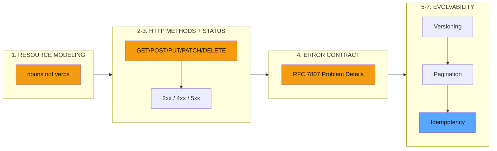
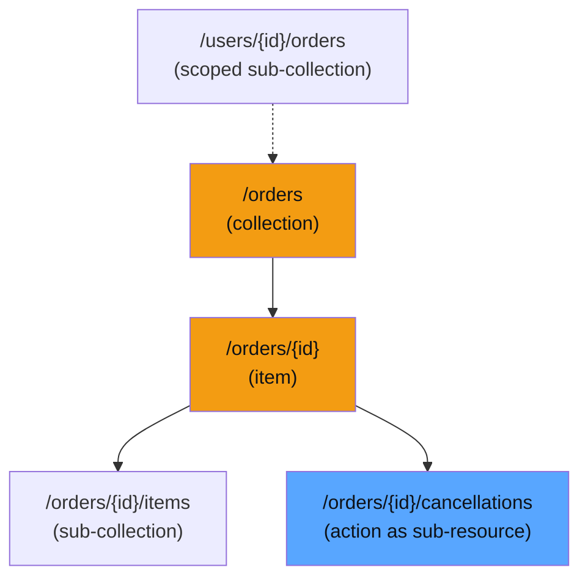
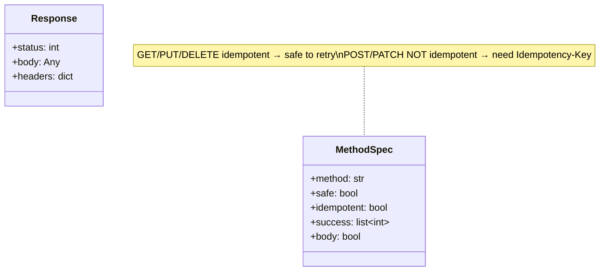
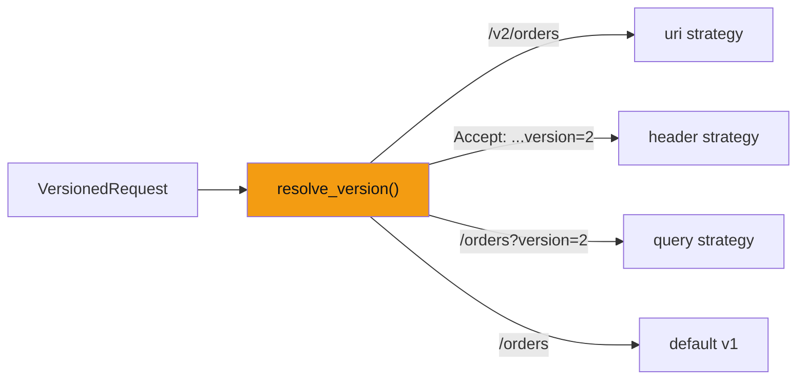
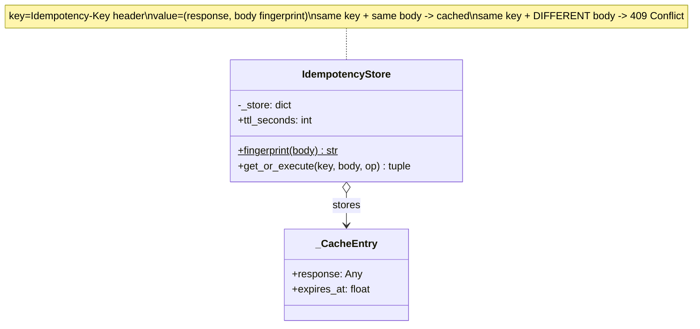

# REST API Design — Resource Modeling, HTTP Semantics & Contracts

> **Companion code:** [`api_design.py`](https://github.com/quanhua92/tutorials/blob/main/lowleveldesign/api_design.py).
> **Captured output:** [`api_design_output.txt`](https://github.com/quanhua92/tutorials/blob/main/lowleveldesign/api_design_output.txt).
> **Live demo:** [`api_design.html`](./api_design.html)

---

## 0. TL;DR — the one idea

> **The analogy:** An API is a **published contract with strangers you'll never meet.** Once you ship
> `/v1/orders`, every observable detail — field names, sort order, error codes, pagination shape, even
> the *presence* of a null field — becomes a dependency clients will build on (Hyrum's Law). So you
> design like a librarian: **nouns on the shelves** (`/orders`, `/users`), **verbs are the card catalog**
> (GET/POST/PUT/PATCH/DELETE), and every interaction is **idempotent by default or carries a receipt**
> (the `Idempotency-Key`). The contract is small, additive-only, and versioned from day one.

This bundle implements **seven pillars** of REST API design, each a runnable scenario in
[`api_design.py`](https://github.com/quanhua92/tutorials/blob/main/lowleveldesign/api_design.py) and
reproduced interactively in [`api_design.html`](./api_design.html).



The three laws that make this hard:
- **Hyrum's Law** — with enough users, *all* observable behaviors are depended on, documented or not.
- **Postel's Law** — be conservative in what you send, liberal in what you accept.
- **Least Astonishment** — every name, field, and code is a permanent commitment.

---

## 1. Resource Modeling — nouns, not verbs

**Rule:** resources are **plural nouns** (`/orders`, `/users`, `/products`). The HTTP method *is* the
verb. **Anti-pattern:** `/createOrder`, `/getUser`, `/deleteProduct` (verbs baked into the URL).
**Exception:** a complex operation that does not map to CRUD becomes its **own sub-resource** —
`POST /orders/{id}/cancellations` models the cancellation as a resource with its own lifecycle
(requested → accepted → rejected → completed), instead of `POST /orders/{id}/cancel` which hides
business rules behind a verb.

From [`api_design.py`](https://github.com/quanhua92/tutorials/blob/main/lowleveldesign/api_design.py):

```python
def is_valid_resource_path(path: str) -> tuple[bool, str]:
    segments = [s for s in path.strip("/").split("/") if s]
    for seg in segments:
        if seg.startswith("{") and seg.endswith("}"):
            continue                              # path param placeholder
        if seg != seg.lower():
            return False, f"segment '{seg}' is not lowercase"
        if seg.lower() in {"create","get","delete","update","list","add","remove"}:
            return False, f"verb '{seg}' must not appear in a resource path"
    return True, "ok"
```

```
/createOrder          -> REJECT (verb + camelCase)     /orders/{id}             -> accept
/orders/createOrder   -> REJECT (verb smuggled in)     /users/{id}/orders       -> accept
/listOrdersForUser    -> REJECT (verb + camelCase)     /orders/{id}/cancellations -> accept
```

### Resource hierarchy



---

## 2. HTTP Method Semantics — safe, idempotent, the right code

Every method carries two independent properties: **safe** (no side effects; cacheable) and
**idempotent** (N calls have the effect of 1 call). GET/PUT/DELETE are idempotent; POST and PATCH are
not. This is *why* a client can safely auto-retry a failed GET/PUT/DELETE but must not blindly retry
a POST without an idempotency key.

| Method | Safe? | Idempotent? | Typical use | Success codes |
|---|---|---|---|---|
| **GET** | yes | yes | read resource/collection | 200 |
| **POST** | no | **no** | create, trigger action | 201 Created, 202 Accepted (async) |
| **PUT** | no | yes | replace entire resource | 200, 204 |
| **PATCH** | no | no* | partial update | 200, 204 |
| **DELETE** | no | yes | remove (2nd DELETE = 404, same outcome) | 204 |
| **HEAD** | yes | yes | existence/headers, no body | 200 |
| **OPTIONS** | yes | yes | allowed methods, CORS preflight | 200 |

> *\*PATCH is "not guaranteed" idempotent — a patch like `{"op":"add"}` is not, while `{"email":"x"}`
> replacing one field happens to be.*

**PUT vs PATCH:** `PUT` replaces the **full** representation (the client must send every field, else
omitted fields reset); `PATCH` updates **only** the supplied fields. For explicit operation semantics,
use **JSON Patch (RFC 6902)**: `[{"op":"replace","path":"/email","value":"x@y.com"}]`.



---

## 3. Status Codes — the families, aligned with error codes

```
2xx success    -> 200 OK, 201 Created, 202 Accepted, 204 No Content
4xx client err -> 400 Bad Request, 401 Unauthorized, 403 Forbidden, 404 Not Found,
                  409 Conflict, 422 Unprocessable Entity, 429 Too Many Requests
5xx server err -> 500 Internal Server Error, 503 Service Unavailable
```

The cardinal sin is **returning HTTP 200 with `{"status":"error"}`** — it breaks standard error
handling, hides failures from monitoring, and breaks retry logic. Always return a real HTTP status,
and pair it with a **machine-readable `error_code`** clients can switch on (not a localized string):

```
VALIDATION_FAILED      -> 400        RESOURCE_NOT_FOUND   -> 404
PAYMENT_DECLINED       -> 422        RATE_LIMIT_EXCEEDED  -> 429
```

---

## 4. Error Contract — RFC 7807 Problem Details

A stable error envelope that survives translation. Clients key on the **`type` URI** (a stable
identifier), never on a `message` string that may change with locale or wording.

From [`api_design.py`](https://github.com/quanhua92/tutorials/blob/main/lowleveldesign/api_design.py):

```python
def make_problem(code: ErrorCode, detail: str, instance: str) -> dict:
    status = ERROR_STATUS[code]
    return {
        "type":     f"https://api.example.com/errors/{code.value.lower()}",
        "title":    code.value.replace("_", " ").title(),
        "status":   status,
        "detail":   detail,        # human-readable, for logs
        "instance": instance,      # request/path identifier -> traces
    }
```

```
HTTP 404 Not Found:
{"type":"https://api.example.com/errors/resource_not_found",
 "title":"Resource Not Found","status":404,
 "detail":"Order ord_123 does not exist.","instance":"/v1/orders/ord_123"}
```

A rate-limit error (429) also carries headers so the client can back off intelligently:

```
HTTP/1.1 429 Too Many Requests
X-RateLimit-Limit: 1000
X-RateLimit-Remaining: 0
X-RateLimit-Reset: 1705334625
Retry-After: 60
```

---

## 5. Versioning — plan before you ship v1

| Strategy | Example | Pros | Cons |
|---|---|---|---|
| **URI** | `/v2/orders` | most visible, easy to route, cached independently | clutters the path |
| **Header** | `Accept: application/vnd.api+json;version=2` | clean URIs | hard to curl/debug, invisible |
| **Query** | `/orders?version=2` | simplest | easily omitted, ambiguous with filters |

**URI versioning is the most practical.** Ship `/v1/` from day one — it costs nothing now and saves a
painful migration later. **Rule: v1 is forever.** Maintain both in parallel through a 6–24 month
deprecation window; add a `Deprecation` header, then remove only after all clients migrate.



---

## 6. Pagination — cursor beats offset on mutable data

**Offset** (`?offset=20&limit=10`) is positional: skip 20 rows. **Cursor** (`?cursor=eyJpZCI6MTIzfQ==`)
is value-based: resume after the last-seen sort key. On a dataset that changes between requests, the
two diverge:

```
dataset = [0,1,2,3,4]    page1 (both) -> ids [0,1]
>> INSERT id=99 at index 1  ->  [0,99,1,2,3,4]
offset page2 (offset=2)  -> ids [1,2]   id=1 DUPLICATED, id=99 MISSED
cursor page2 (after id=1) -> ids [99,2]  stable: no dup, no skip
```

Cursor encodes the last seen id as **Base64(JSON)**; it is opaque to the client. Always add a unique
tiebreaker so ties are deterministic: `ORDER BY created_at DESC, id DESC`.

**Cost model** (the gold check): offset scans past `offset` rows each page → **quadratic** total work;
cursor is `O(limit)` per page → **linear**.

```
pagination_cost_ratio(total=100, limit=10):
  num_pages=10  offset_cost=450  cursor_cost=100  ratio(offset/cursor) = 4.5
```



---

## 7. Idempotency — safe retries on POST

POST is not idempotent — two retries create two orders, charge a card twice. The fix: require clients
to send an **`Idempotency-Key`** header (a UUID). The server stores `(key → response)` on the first
call; on a duplicate retry it returns the stored response **without re-processing**. If the same key
arrives with a **different** request body, return **409 Conflict** — do not silently treat it as the
same operation (the client has a bug or is replaying a stolen key).

**Flow** (from `section_idempotency`):

```
POST /payments  Idempotency-Key=idem_a1b2c3
  1st request   -> paid   charge count=1  (executed)
  retry (same)  -> paid   charge count=1  (cached)      # NO second charge
  retry (diff)  -> 409 Conflict raised? True            # key reused, body drifted
```

For mutating calls, always ask: *"Can the client safely retry if the socket dies after the server
commits?"* If not, add an idempotency key or make the operation naturally idempotent with `PUT` to a
client-chosen resource ID.

---

## 8. Design Principles Analysis

| Principle | How Applied | Violation Risk |
|---|---|---|
| **Hyrum's Law** | Expose only fields you commit to maintain forever; minimal surface. | Dumping the full ORM object — clients depend on every field's nullability. |
| **Postel's Law** | Accept extra/unknown fields on input; return exactly the documented shape. | Rejecting valid requests because they carry an extra optional field. |
| **Least Astonishment** | `/orders` behaves the same everywhere; errors always carry `error_code`. | One endpoint returns `{status:"error"}` with HTTP 200, others use 4xx. |
| **Idempotency** | GET/PUT/DELETE safe to retry; POST guarded by `Idempotency-Key`. | Mobile retry of a payment → double charge (the textbook incident). |
| **Evolvability** | Additive-only changes in a version; breaking changes ship under `/v2`. | Making an optional field required in v1 → breaks old clients overnight. |
| **Stable IDs** | Use opaque IDs (`usr_f47ac10b...`) not auto-increment (`/users/42`). | Sequential IDs leak row counts and enable enumeration attacks. |

---

## 9. Tradeoffs

| Decision | Pros | Cons |
|---|---|---|
| **URI versioning** `/v1/` | visible, routeable, cacheable | path clutter; two code paths during migration |
| **Header versioning** | clean URIs, content-negotiation native | invisible to curl; hard to test from a browser |
| **Cursor pagination** | stable under inserts, O(1)/page, no enumeration | can't jump to an arbitrary page; opaque token |
| **Offset pagination** | simple, random access, `total_count` | O(offset)/page, dups/skips on mutation, exposes size |
| **Idempotency-Key** | safe retries, exactly-once semantics for payments | storage cost (Redis), 409 on key drift, TTL window |
| **PUT (full replace)** | idempotent, unambiguous | client must send every field or lose data |
| **PATCH (partial)** | minimal payload, no clobbering | not guaranteed idempotent; merge semantics ambiguous |
| **RFC 7807 errors** | machine-readable, i18n-safe, traceable | more structure than a bare `{message}` string |

### When NOT to use

- **Cursor pagination** — when you genuinely need random page access (an admin jump-to-page-50 console).
  Use offset there, accepting the cost.
- **Idempotency-Key** — overkill for GET (already idempotent) or for idempotent-by-construction PUTs.
- **Action sub-resources** (`/cancellations`) — only for complex workflows with their own state. A
  simple boolean flip is fine as `PATCH /orders/{id} {"status":"cancelled"}`.

### Killer Gotchas

```
1. Unstable sort order in pagination. ORDER BY created_at fails when two rows
   share a timestamp (ties break non-deterministically, so pages overlap/gap).
   ALWAYS add a unique tiebreaker: ORDER BY created_at DESC, id DESC.

2. POST without an idempotency key. A mobile client retries a payment after a
   timeout -> double charge. Any mutating call exposed to an unreliable network
   (mobile, microservices) needs an Idempotency-Key or a client-chosen PUT id.

3. Making an optional field required in v1. A previously optional field that
   becomes required is a BREAKING change; old clients start failing. Make new
   required fields optional first, require them only in v2.

4. Returning 200 for errors. {"status":"error","code":404} with HTTP 200 hides
   failures from monitoring, breaks retry logic, and defeats HTTP semantics.
   Use the real status code + a machine-readable error_code.

5. Exposing auto-increment IDs. /users/42 reveals your row count and enables
   enumeration. Prefer opaque UUIDs (/users/usr_f47ac10b-...) that also survive
   database migration without changing the external identity.
```

---

## 10. Gold Check (cross-language parity)

Both [`api_design.py`](https://github.com/quanhua92/tutorials/blob/main/lowleveldesign/api_design.py)
and [`api_design.html`](./api_design.html) compute the **pagination cost ratio** — total rows scanned
by offset pagination divided by cursor pagination — over 100 items in pages of 10:

```
num_pages   = ceil(100/10) = 10
offset_cost = limit * (0+1+...+9) = 10 * 45 = 450     (quadratic skip work)
cursor_cost = limit * num_pages   = 10 * 10 = 100      (linear)
ratio       = offset_cost / cursor_cost = 4.5
```

```
pagination_cost_ratio(total=100, limit=10) = 4.5      # api_design.py
paginationCostRatio(100, 10)              = 4.5      # api_design.html (JS)
```

The HTML demo shows a gold `[OK]` badge when the JS recomputation matches the Python value `4.5`.

---

## 11. Quick Reference

| Topic | The one rule | Do | Don't |
|---|---|---|---|
| Naming | nouns, plural | `/orders`, `/orders/{id}` | `/createOrder`, `/getOrder` |
| Methods | method is the verb | `GET /orders/{id}` | `POST /orders/{id}?action=get` |
| Status codes | align with intent | `201 Created`, `404 Not Found` | `200` + `{"status":"error"}` |
| Errors | machine-readable | RFC 7807 + `error_code` | localized prose strings |
| Versioning | ship `/v1` day one | `/v1/orders` → `/v2/orders` | silently change v1's shape |
| Pagination | resume after a value | `?cursor=...&limit=20` | `?offset=20000` on live feeds |
| Idempotency | safe to retry | `Idempotency-Key` on POST | blind retry on network timeout |

---

## 12. Companion files

| File | Role |
|---|---|
| [`api_design.py`](https://github.com/quanhua92/tutorials/blob/main/lowleveldesign/api_design.py) | Ground-truth implementation (pure stdlib, `===` banners, `[check] OK`) |
| [`api_design_output.txt`](https://github.com/quanhua92/tutorials/blob/main/lowleveldesign/api_design_output.txt) | Captured stdout of `python3 api_design.py` |
| [`api_design.html`](./api_design.html) | Interactive endpoint designer + pagination comparator |
| [`./index.html`](./index.html) | Low-Level Design dashboard |
