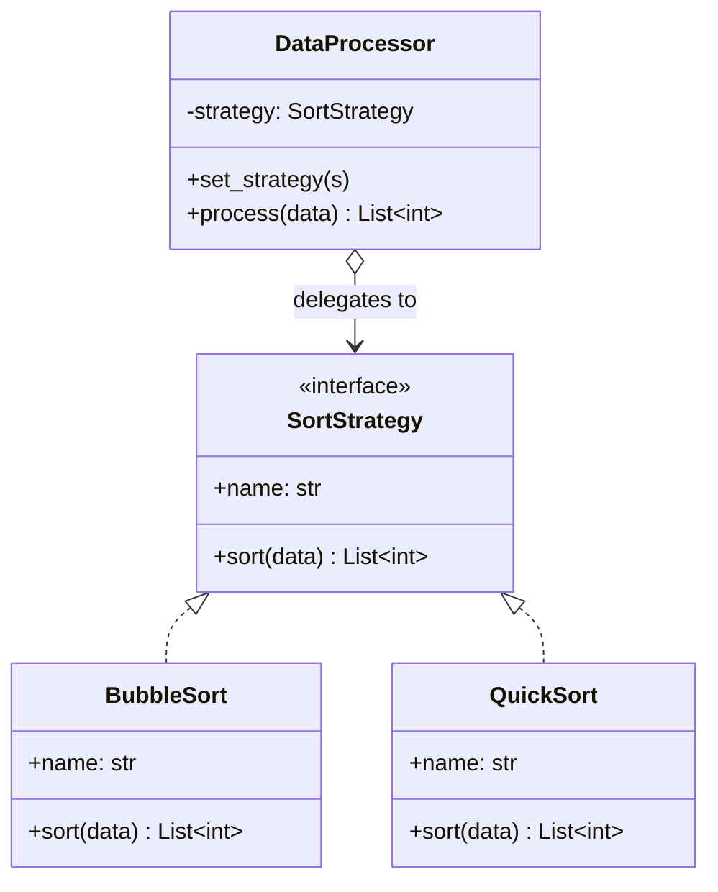
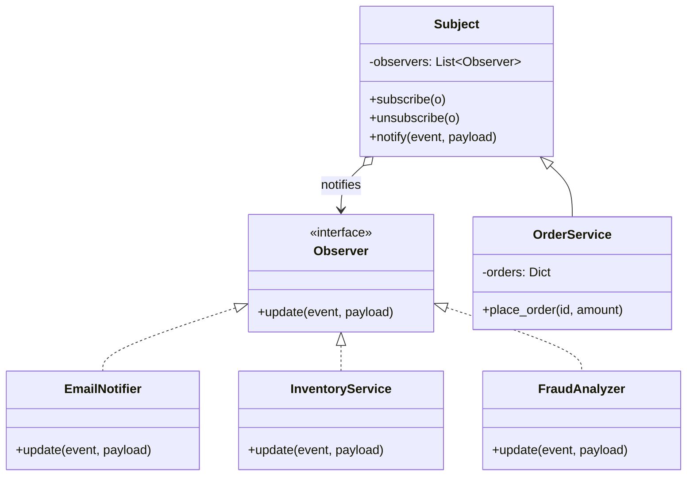
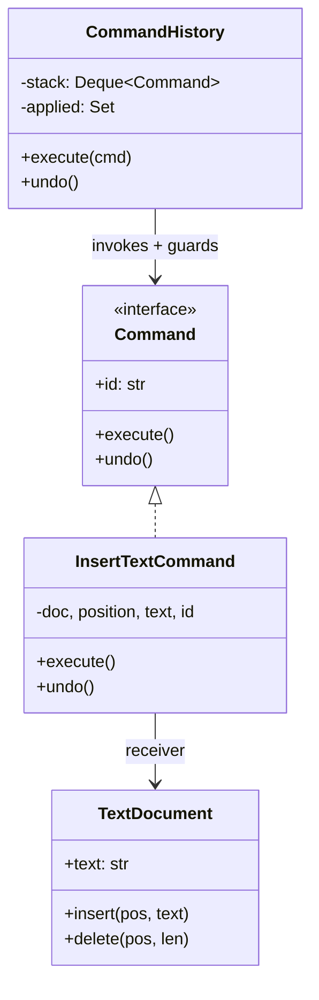
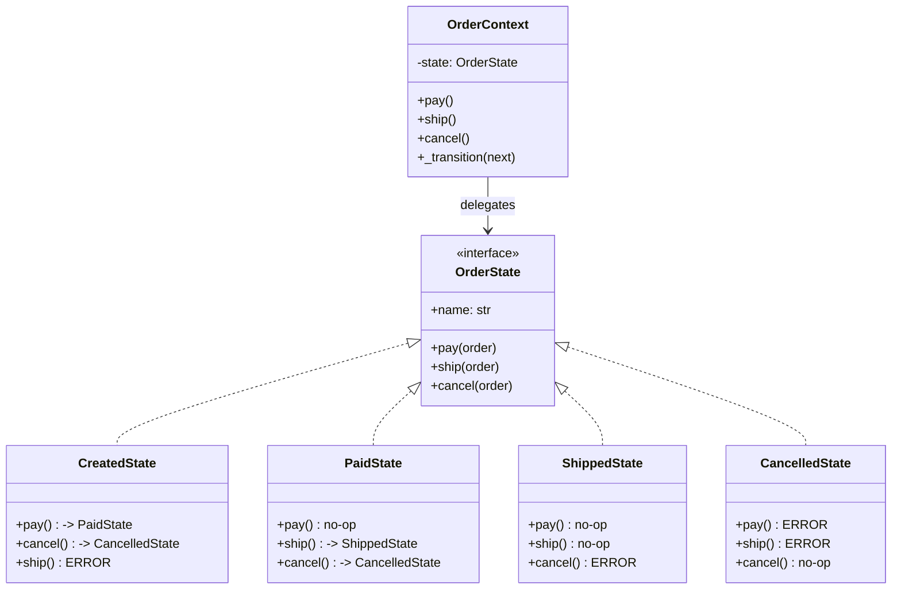
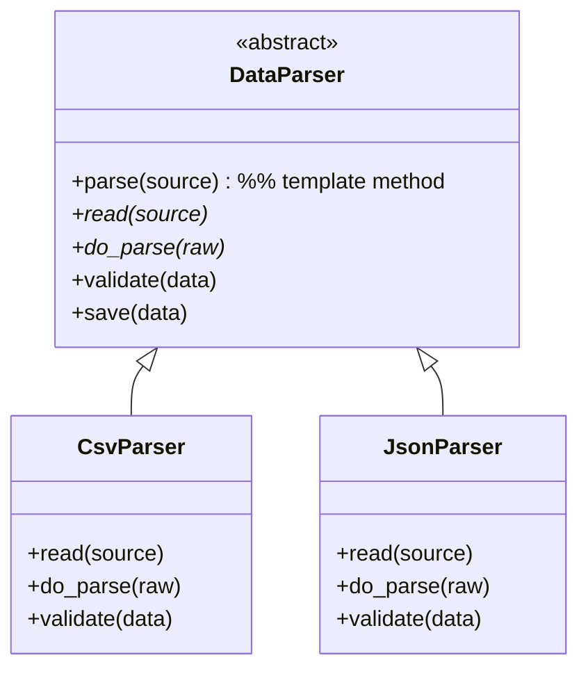
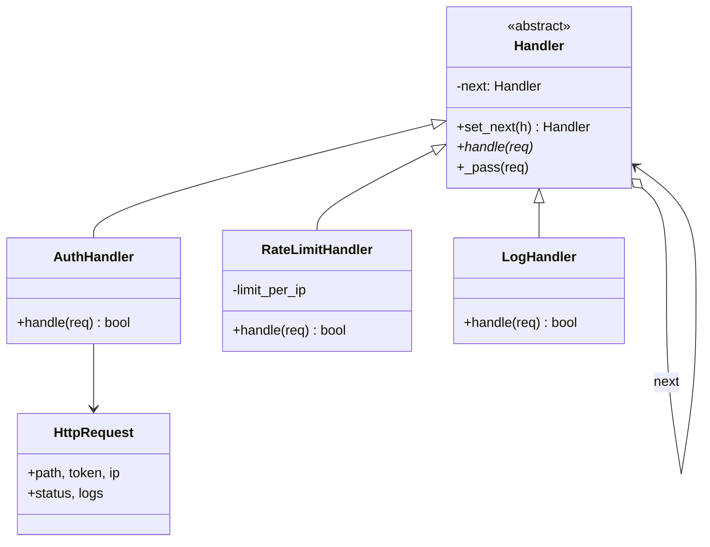

# Behavioral Patterns

> **Companion code:** [`behavioral_patterns.py`](https://github.com/quanhua92/tutorials/blob/main/lowleveldesign/behavioral_patterns.py)
> **Captured output:** [`behavioral_patterns_output.txt`](https://github.com/quanhua92/tutorials/blob/main/lowleveldesign/behavioral_patterns_output.txt)
> **Live demo:** [`behavioral_patterns.html`](./behavioral_patterns.html)

---

## 0. TL;DR — the one idea

> **The analogy:** behavioral patterns are about *who decides what happens next*.
> A direct method call is easy to trace but tightly coupled. Each behavioral pattern
> inserts an indirection that lets one side change without the other — Strategy moves
> the *algorithm choice* out of the caller, Command turns an *action into data* you can
> queue/undo/log, Observer moves *reaction logic* out of the subject, State delegates
> *behavior to the current state*, Template Method fixes the *algorithm skeleton* while
> subclasses fill steps, and Chain of Responsibility routes a *request through a pipeline*.

The recurring challenge they all solve: **how do you decouple the sender of a request
from the receiver, so either side can change without affecting the other?** The shared
insight is **delegation** — the caller knows only an interface, never the concrete
handler. That buys runtime flexibility (swap a strategy, add an observer, reorder the
chain) at the cost of *visibility*: indirect control flow is harder to trace.

Six patterns, one mental model. See it in code:
[`behavioral_patterns.py`](https://github.com/quanhua92/tutorials/blob/main/lowleveldesign/behavioral_patterns.py).

---

## 1. UML Class Diagrams

### Strategy — algorithm family behind one interface (composition)



### Observer — subject fans events to dependents



### Command — request as an object, with undo + replay guard



### State — behavior delegated to current state object



### Template Method — fixed skeleton, overridden steps (inheritance)



### Chain of Responsibility — linked pipeline of handlers



---

## 2. Implementation

The full runnable source is
[`behavioral_patterns.py`](https://github.com/quanhua92/tutorials/blob/main/lowleveldesign/behavioral_patterns.py).
Each pattern has a `demo_*()` scenario guarded by an `===` banner and a `[check] OK`
assertion. Captured stdout:
[`behavioral_patterns_output.txt`](https://github.com/quanhua92/tutorials/blob/main/lowleveldesign/behavioral_patterns_output.txt).

**Strategy — swap algorithm at runtime, no if/else:**

```python
processor = DataProcessor(BubbleSort())
processor.process([5,2,8,1,9,3])      # -> [1, 2, 3, 5, 8, 9]
processor.set_strategy(QuickSort())   # swap at runtime; Open/Closed
processor.process([5,2,8,1,9,3])      # -> [1, 2, 3, 5, 8, 9]
```

**Observer — fan-out on order placement:**

```python
service = OrderService()
service.subscribe(EmailNotifier()); service.subscribe(InventoryService()); service.subscribe(FraudAnalyzer())
service.place_order("ORD-1", amount=99.0)   # all 3 observers fire
service.unsubscribe(InventoryService())
service.place_order("ORD-2", amount=2500.0) # FraudAnalyzer flags REVIEW
```

**Command — undo stack + replay guard:**

```python
history.execute(InsertTextCommand(doc, 0, "Hello", "c1"))
history.execute(InsertTextCommand(doc, 5, ", World", "c2"))
history.execute(InsertTextCommand(doc, 0, "X", "c2"))  # replay-guard: skipped
history.undo(); history.undo()                          # doc back to ""
```

**State — operations behave differently per state:**

```python
order = OrderContext("ORD-42")   # CREATED
order.pay()                       # -> PAID
order.pay()                       # PaidState: graceful no-op
order.ship()                      # -> SHIPPED
order.ship()                      # ShippedState: no-op
```

**Template Method — fixed skeleton, swappable steps:**

```python
CsvParser().parse("users.csv")                                  # read->parse->validate->save
JsonParser().parse("https://api.example.com/users")             # same skeleton, own steps
```

**Chain of Responsibility — short-circuiting pipeline:**

```python
auth.set_next(rate).set_next(log)   # fluent linking
auth.handle(HttpRequest(path="/api/orders"))                     # 401 (no token)
auth.handle(HttpRequest(path="/api", token="abc", ip="1.2.3.4")) # 200, 200, 429
```

---

## 3. SOLID Analysis

| Principle | How Applied | Violation Risk |
|---|---|---|
| **S**ingle Responsibility | Each `Command` knows one operation; each `OrderState` one state's behavior; each chain `Handler` one concern. | A handler that does auth + rate-limit + logging violates it. |
| **O**pen/Closed | Strategy adds algorithms by *adding classes* (`SortStrategy <|.. NewSort`); Observer adds listeners without touching the subject. | A giant `switch(type)` in the caller is the textbook violation Strategy kills. |
| **L**iskov Substitution | Any `SortStrategy`/`Observer`/`OrderState` impl must satisfy the contract — `QuickSort` must sort, `CancelledState.cancel()` must be a no-op (not throw). | A state that throws on a documented-valid op breaks substitution for callers. |
| **I**nterface Segregation | `Command` exposes only `execute/undo/id`; the invoker never sees the receiver. | A "fat" command interface mixing query + command mixes read/write concerns. |
| **D**ependency Inversion | `DataProcessor`, `Subject`, `OrderContext`, and the chain `Handler` all depend on *abstractions* (`SortStrategy`, `Observer`, `OrderState`), never concretes. | `Context` that imports `QuickSort` directly is inverted — you can't swap. |

---

## 4. Tradeoffs

| Pattern | Pros | Cons |
|---|---|---|
| **Strategy** | Kills switch/if-else; algorithms swap at runtime; stateless strategies are shareable singletons. | Adds a class per algorithm; clients must *know* which to pick (often paired with Factory). |
| **Observer** | Subject is fully decoupled from its N dependents; add/remove reactions freely. | Memory leaks from forgotten subscriptions; notification order is not guaranteed; one broken listener can block the rest. |
| **Command** | Enables undo/redo, queuing, logging, retry; replay guard makes re-execution idempotent. | Object per operation; history stack grows unboundedly without a cap. |
| **State** | Eliminates state-conditional logic; transitions are explicit; new states don't touch existing ones. | Class explosion for many states; if only *transitions* differ (not behavior), a table is simpler. |
| **Template Method** | Skeleton is fixed in one place; subclasses override only what varies; Hollywood Principle. | Inheritance-coupled; changing the skeleton edits the base and ripples to every subclass. |
| **Chain of Resp.** | Sender knows nothing about handlers; pipeline reorderable/composable at runtime. | No guaranteed handler; a request can fall off the end silently; ordering is correctness-critical (auth before business). |

### Killer Gotchas

- **Observer memory leak** — a registered observer is never GC'd until it unsubscribes. Use
  `WeakReference` storage, or guarantee `unsubscribe()` in cleanup (classic Android leak).
- **Observer notification order** — never assume registration order = notification order. If order
  matters, it's not Observer; use an explicit sequence.
- **Strategy with mutable shared state** — a stateful `Strategy` shared across contexts leaks data
  between users. Make strategies stateless (shareable) or instance-per-context.
- **Command without idempotency** — a replayed command re-runs side effects. The fix is a `Set` of
  applied command ids (see `CommandHistory._applied` in the `.py`).
- **Chain without a terminal handler** — an unmatched request falls off the end and is silently
  dropped. Always provide a clear 404/default at the tail.
- **Template Method vs Strategy** — *"Template Method when the skeleton is stable; Strategy when the
  algorithm as a whole may swap."* Pick the wrong one and a base-class edit becomes a refactor.
- **State vs transition table** — use State for *polymorphic behavior*; use a table/service for
  *validated transitions* where every state has the same methods. Mixing the two scatters rules.

### When NOT to use

- **Observer** when delivery must be durable, ordered, or retried after a crash → use an outbox + queue.
- **Command** for a simple synchronous call that will never be queued, logged, retried, or undone.
- **Chain of Responsibility** when exactly one known handler always owns the request → direct dispatch.
- **Template Method** when teams need to swap the whole algorithm at runtime → Strategy is cleaner.
- **Strategy** when the only variation is one stable, local `if` → YAGNI.

---

## 5. Real-world anchors

| Pattern | Framework |
|---|---|
| Observer | Java `EventListener`, RxJava `Observable`, Spring `ApplicationEvent`, React `useEffect` deps |
| Strategy | Java `Comparator`, Spring injected dependencies, pricing/discount rules engines |
| Command | editor undo/redo, CQRS command objects, macro recording, task queues |
| Template Method | Spring `JdbcTemplate`, test `setUp`/`tearDown`, Android Activity lifecycle |
| Chain of Responsibility | Express.js middleware, Java Servlet filters, Spring Security filter chain |
| State | workflow engines, TCP/connection state machines, document approval flows |

> **Interactive explorer:** [`behavioral_patterns.html`](./behavioral_patterns.html) —
> swap strategies live, subscribe/unsubscribe observers, and step through the order state machine,
> with a gold-check that recomputes every result in the browser against
> [`behavioral_patterns.py`](https://github.com/quanhua92/tutorials/blob/main/lowleveldesign/behavioral_patterns.py).
