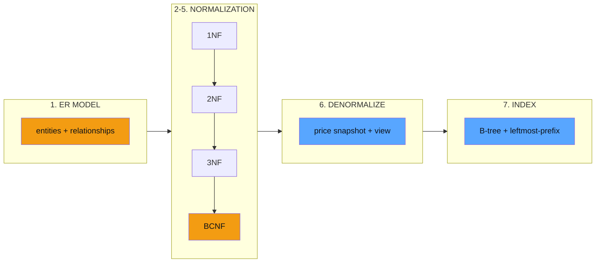
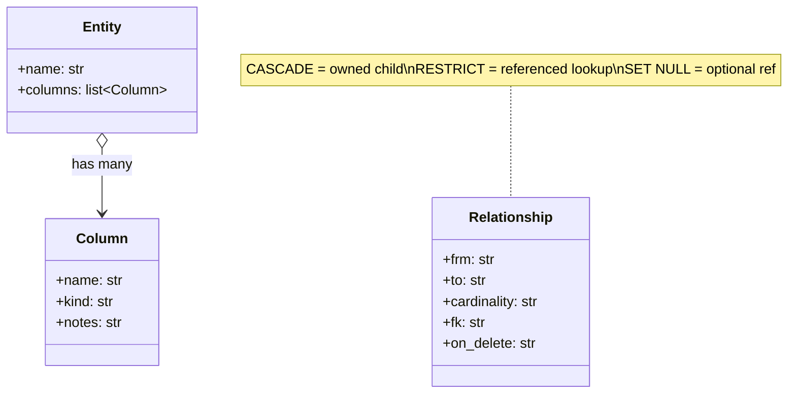
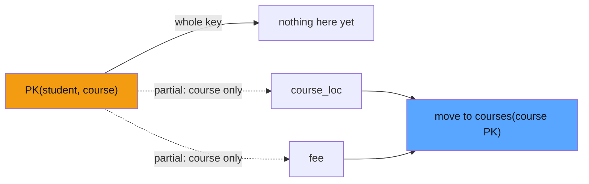
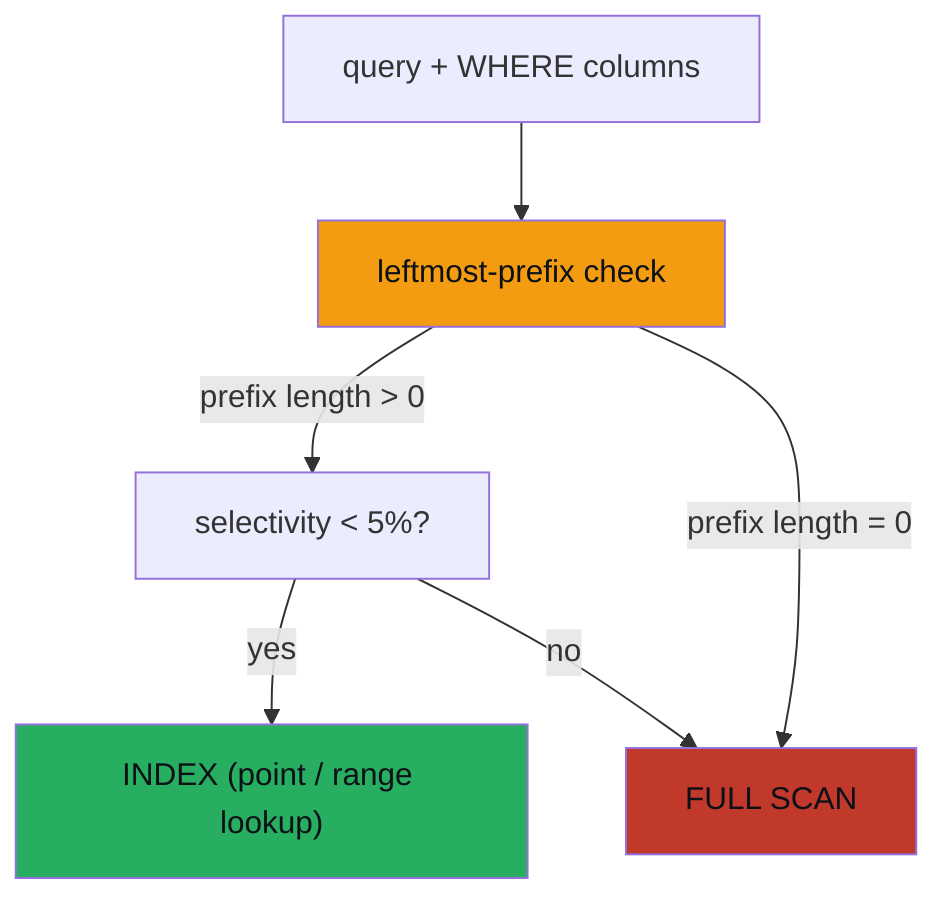

# Database Schema Design — Normalization, ER Modeling & Indexing Strategy

> **Companion code:** [`database_schema_design.py`](https://github.com/quanhua92/tutorials/blob/main/lowleveldesign/database_schema_design.py).
> **Captured output:** [`database_schema_design_output.txt`](https://github.com/quanhua92/tutorials/blob/main/lowleveldesign/database_schema_design_output.txt).
> **Live demo:** [`database_schema_design.html`](./database_schema_design.html)

---

## 0. TL;DR — the one idea

> **The analogy:** Your schema is a **lease on a building you can never fully evict.** A class can be
> refactored in an afternoon; a schema migration on a 10-billion-row table takes weeks of planning, online
> DDL tooling, and its own risk envelope. So you design like an architect: **normalize to remove
> redundancy** (so the same fact lives in exactly one place), **model relationships with foreign keys**
> (so invalid state is structurally unreachable), and **index from the query mix** (so the planner can find
> any row in 3–4 cached seeks). You denormalize *deliberately* — only the 1–3 hot paths — and you document
> the reconciliation job that keeps the cache honest.

This bundle implements **seven pillars** of relational schema design, each a runnable scenario in
[`database_schema_design.py`](https://github.com/quanhua92/tutorials/blob/main/lowleveldesign/database_schema_design.py)
and reproduced interactively in [`database_schema_design.html`](./database_schema_design.html).



The three laws that make this hard:
- **Each form kills a specific anomaly** — 1NF (no repeating groups), 2NF (no partial-key deps), 3NF (no
  transitive deps), BCNF (every determinant is a key). Normalize *until the redundancy is gone*, no further.
- **The schema outlives the code** — every column you ship will need to change; design for
  expand-contract migrations from day one.
- **Indexes are a budget, not a checklist** — each costs ~10–30% write throughput; index from the actual
  query mix and the ~5% selectivity rule, not "WHERE column = index."

---

## 1. ER Modeling — nouns become tables, relationships become keys

**Rule:** circle the **nouns** in the requirements → each strong noun is a table; each relationship becomes
a **foreign key** (1:N), a **junction table** (M:N), or a **FK + UNIQUE** (1:1). Justify *every* FK with a
real query pattern — premature normalization (a `vehicle_colors` lookup table) is as wrong as
denormalization.

| Cardinality | Mechanism | Example |
|---|---|---|
| **1:N** | FK on the N side | `orders.user_id REFERENCES users(id)` |
| **M:N** | junction table (composite PK) | `order_items(order_id, product_id)` |
| **1:1** | FK + UNIQUE | `payments.order_id UNIQUE REFERENCES orders(id)` |

From [`database_schema_design.py`](https://github.com/quanhua92/tutorials/blob/main/lowleveldesign/database_schema_design.py):

```mermaid
erDiagram
  users    ||--o{ orders      : "places (RESTRICT)"
  orders   ||--o{ order_items : "owns (CASCADE)"
  products ||--o{ order_items : "referenced (RESTRICT)"
  orders   ||--|| payments    : "one (UNIQUE)"
  users {
    uuid id PK
    text email UNIQUE
  }
  orders {
    uuid id PK
    uuid user_id FK
    text status
  }
  order_items {
    bigserial id PK
    uuid order_id FK
    uuid product_id FK
    int quantity
  }
  products {
    uuid id PK
    text name
    numeric price_cents
  }
```

**ON DELETE discipline:** `CASCADE` for *owned* children (`orders → order_items`), `RESTRICT` for
*referenced* lookups (`orders → users` — never auto-delete a user because of an order), `SET NULL` for
*optional* references. Default to RESTRICT; cascading is a deliberate decision.



---

## 2. 1NF — atomic values, no repeating groups

**Rule:** every cell holds **one** atomic value. No `"Widget,Gizmo"` comma lists, no parallel arrays. A
multi-valued cell cannot be queried (`who bought a Widget?`) or indexed.

```
BEFORE (unnormalized)                 AFTER 1NF (composite PK = order_id, item)
order_id customer items        total  order_id customer item       total
1001    Acme     Widget,Gizmo 70      1001    Acme     Widget     70
1002    Globex   Widget       25      1001    Acme     Gizmo      70
1003    Initech  Gizmo,Doohickey 45   1002    Globex   Widget     25
                                       1003    Initech  Gizmo      45
                                       1003    Initech  Doohickey  45
```

---

## 3. 2NF — no partial-key dependencies (composite keys only)

**Rule:** every non-key column depends on the **whole** primary key, not a subset. Only relevant with a
**composite** key. If `course_loc` and `fee` depend on `course` alone (half the key), they are duplicated
for every student taking that course → update anomaly (move a course to a new room = touch every row).

```
BEFORE 1NF table, PK = (student, course)        AFTER 2NF
student course course_loc fee                   course course_loc fee        enrollments
s1      DB     Room A     500                   DB     Room A     500        student course
s1      OS     Room B     600     ------>       OS     Room B     600        s1      DB
s2      DB     Room A     500                                                 s1      OS
                                                                       PK(student,course)  s2      DB
```



---

## 4. 3NF — no transitive dependencies

**Rule:** no non-key column depends on **another non-key** column. The classic case: `order_items` carries
`product_name` and `price`, but those depend on `product_id` (a non-key), not on the order. Rename a
product → you must edit every line that ever sold it.

Transitive chain: `(order_id, product_id) → product_id → product_name`. Fix: extract
`products(product_id PK, name, price)`; `order_items` keeps only `product_id`.

```
BEFORE order_items PK=(order_id, product_id)        AFTER 3NF
order_id product_id product_name price qty          products            order_items
o1       p1         Widget       25    2            product_id name price order_id product_id qty
o1       p2         Gizmo        20    1     ------> p1         Widget 25   o1       p1         2
o2       p1         Widget       25    1            p2         Gizmo  20   o1       p2         1
                                                                o2       p1         1
```

---

## 5. BCNF — every determinant is a candidate key

**Rule:** for every non-trivial FD `X → Y`, `X` must be a **superkey**. BCNF is stricter than 3NF; the
textbook case passes 3NF but breaks BCNF.

```
advising(student, course, professor)            AFTER BCNF
FD1: (student, course) -> professor             takes(student, professor)   teaches(professor PK, course)
FD2: professor -> course                        s1 Dijkstra                  Dijkstra   DB
                                                s2 Dijkstra                  Tanenbaum  OS
KEY = (student, course). But professor -> course   s1 Tanenbaum
and 'professor' is NOT a superkey (teaches many   s3 Tanenbaum
students). VIOLATES BCNF. (OK under 3NF: 'course'
is prime — part of a candidate key.)
```

The distinguishing question: **3NF** allows `X → Y` when `Y` is a prime attribute; **BCNF** does not. Split
so the lone determinant (`professor`) becomes its own key.

---

## 6. Denormalization — deliberate redundancy for read latency

**Rule:** default to 3NF. *Then* identify the 1–3 read paths where the join cost is unacceptable and
denormalize *those* explicitly, with a **documented invariant**: "this column is a materialized cache of X,
updated by Y, reconciled by job Z if it drifts." Naive denormalization is technical debt; deliberate
denormalization with reconciliation is engineering.

**Example 1 — price snapshot.** `product.price` changes over time, but a past order's total must NOT
recompute. So `order_items.unit_price_at_order` freezes the price at order time. This is **not** a 3NF
violation: the snapshot is a fact about *this order*, not *this product*.

**Example 2 — materialized view.** The order-detail page renders 50,000×/sec. Joining 4 tables each request
is wasteful → a materialized `order_summary` collapses it to one read.

```
normalized read   = 4 joins × 4ms = 16ms
denormalized read = 1 lookup      =  2ms      -> 8.0× read speedup
write cost: denormalization needs ~4× writes to stay consistent
```

From [`database_schema_design.py`](https://github.com/quanhua92/tutorials/blob/main/lowleveldesign/database_schema_design.py):

```python
joins = 4
per_join_ms = 4
normalized_read_ms = joins * per_join_ms      # 16ms
denorm_read_ms = 2
speedup = normalized_read_ms / denorm_read_ms # 8.0x
```

**Counterintuitive:** modern OLTP engines (PostgreSQL, InnoDB) do 3-table joins on indexed columns in <5ms
warm. *Most* read paths do not need denormalization — measure the join cost before paying the consistency tax.

---

## 7. Indexing Strategy — B-tree, composite, covering, the 5% rule

**Rule:** index from the **query mix**, not the column list. Every index costs ~10–30% write throughput —
it is a budget, not a checklist. Senior engineers *delete* indexes that don't pay rent.

### Composite index + leftmost-prefix rule

An index on `(user_id, status, created_at)` serves any **leftmost prefix**: `WHERE user_id`, `WHERE
user_id AND status`, all three — but **not** `WHERE status` alone (the prefix breaks at the first
unconstrained column). Column order is the most important design choice.

```
INDEX (user_id, status, created_at)
WHERE user_id = ?                              -> usable [user_id]                     INDEX USED
WHERE user_id = ? AND status = ?               -> usable [user_id,status]              INDEX USED
WHERE user_id = ? AND status = ? AND created_at > ?  -> usable [user_id,status,created_at]  INDEX USED
WHERE status = ?                               -> usable []                            FULL SCAN
WHERE user_id = ? AND created_at > ?           -> usable [user_id]   (status skipped)  INDEX USED
```

From [`database_schema_design.py`](https://github.com/quanhua92/tutorials/blob/main/lowleveldesign/database_schema_design.py):

```python
def leftmost_usable(index_cols, filter_cols):
    usable = []
    for ic in index_cols:
        if ic in filter_cols:
            usable.append(ic)
        else:
            break          # first unconstrained column breaks the prefix
    return usable
```

### Covering index (PostgreSQL `INCLUDE`)

Embed the hot SELECT columns in the leaf node so the query never reads the heap row → **index-only scan**
(`Heap Fetches: 0`).

```sql
CREATE INDEX idx_orders_cover ON orders (user_id, created_at)
  INCLUDE (status, total_cents);
```

### Partial index

Index only the hot subset (<1% of rows) → tiny index, fast writes that only fire on state transitions.

```sql
CREATE INDEX idx_tickets_active ON tickets (spot_id) WHERE status = 'active';
```

### The ~5% selectivity rule

The PostgreSQL planner uses the index when the predicate matches **< ~5%** of rows; above that a sequential
scan is faster (cache-friendly, no random heap I/O). Skip indexes on low-cardinality columns (gender,
3-value status) and on tables <10K rows.

```python
def planner_uses_index(rows_matched, total_rows):
    return (rows_matched / total_rows) < 0.05
```

| Predicate | Match | Verdict |
|---|---|---|
| `vehicle_plate = ?` (1 in 1B) | 0.0000001% | INDEX HELPS |
| `status = 'active'` | 1.00% | INDEX HELPS |
| `gender = 'F'` | 50.00% | PLANNER FULL-SCANS |



### Index-type cheat sheet

| Type | Best for | Skip when |
|---|---|---|
| **B-tree** (default) | equality, range, ORDER BY, `LIKE 'pre%'` | predicates matching >5% of rows |
| **Hash** | pure equality | range/sort needs |
| **GIN** | JSONB containment, full-text, arrays | scalar equality |
| **BRIN** | append-only time-series (`paid_at`) | random-access patterns |
| **Partial** | hot subset (`status='active'`) | queries needing the whole table |
| **Covering (`INCLUDE`)** | hot read paths selecting few cols | wide `SELECT *` |
| **Multicolumn (composite)** | multi-predicate, shared leftmost prefix | trailing-column-only filters |

---

## 8. Design Principles Analysis

| Principle | How Applied | Violation Risk |
|---|---|---|
| **Normalization** | Each fact lives in one place; 1NF→BCNF removes redundancy. | Over-normalizing into a 6-join chain for a value never queried alone. |
| **Referential integrity** | FKs make invalid state structurally unreachable. | Dropping FKs "for performance" without measuring the hot-spot write cost. |
| **Surrogate keys** | UUID/BIGSERIAL PKs; natural keys in UNIQUE. | Natural key (email) as PK → cascading update nightmare when it changes. |
| **Money as integers** | `NUMERIC` / integer cents, never FLOAT (`0.1+0.2≠0.3`). | FLOAT column for amounts → rounding drift in financial reports. |
| **Index from the query mix** | Every index motivated by a specific query + selectivity. | Indexing every WHERE column → 80%+ write tax, planner ignores low-selectivity ones. |
| **Schema is a contract** | Additive expand-contract migrations; never lock a billion-row table. | `ADD COLUMN NOT NULL DEFAULT now()` mid-peak → full table rewrite, downtime. |

---

## 9. Tradeoffs

| Decision | Pros | Cons |
|---|---|---|
| **3NF (default)** | no redundancy, anomaly-free, one source of truth | joins on hot paths; many tables |
| **Denormalize hot path** | O(1) read latency; materialized counters/views | write amplification; reconciliation burden; stale risk |
| **Composite index** | one index serves many queries (leftmost prefix) | column order is a commitment; trailing-only queries miss it |
| **Covering index** | index-only scan, no heap fetch | larger leaf pages; same write cost |
| **Partial index** | tiny, fast, only updates on transitions | useless for whole-table queries |
| **Keep FKs** | integrity at the DB layer (~5–10% write cost) | row-level lock on parent → hot-spot at >10k writes/sec |
| **Drop FKs (sharded)** | cross-shard writes feasible; higher throughput | app-layer integrity + daily reconciliation job |

### When NOT to normalize / index

- **Denormalize** only the 1–3 measured hot paths, with a reconciliation plan — never as a default.
- **Index** only when selectivity < ~5% and the table is >10K rows; skip low-cardinality (`gender`,
  3-value `status`) and tiny tables.
- **BCNF** — rare to need explicitly in OLTP; 3NF almost always suffices. Reach for BCNF when a
  non-key determinant exists (the advisor/professor case).

### Killer Gotchas

```
1. FLOAT for money. 0.1 + 0.2 != 0.3 in IEEE 754. Always NUMERIC/DECIMAL or
   integer cents. Stripe/PayPal store integers, never floats.

2. VARCHAR(255) as a default. This length came from MySQL 4's row-format limit
   and means nothing today. Pick meaningful lengths (VARCHAR(64) for emails).

3. Composite index column order. (user_id, status, created_at) serves
   WHERE user_id=? AND status=? but NOT WHERE status=?. Put the highest-
   selectivity, always-present column first.

4. ADD COLUMN NOT NULL DEFAULT <function> on a billion-row table. A constant
   default is metadata-only on PG>=11, but DEFAULT now()/some_fn() rewrites
   the whole table. Use expand-contract.

5. Natural keys (email/SSN) as primary keys. They change -> cascading updates
   through every FK. Use surrogate keys; natural keys go in UNIQUE.

6. Running scan-heavy analytics on the OLTP database during peak. A GROUP BY
   over millions of rows tanks latency for everyone. CDC into a warehouse.

7. Forgetting timezone-aware timestamps. TIMESTAMP (without tz) is a footgun
   across regions. Always TIMESTAMPTZ.
```

---

## 10. Gold Check (cross-language parity)

Both [`database_schema_design.py`](https://github.com/quanhua92/tutorials/blob/main/lowleveldesign/database_schema_design.py)
and [`database_schema_design.html`](./database_schema_design.html) compute the **B-tree height** for a
one-billion-row table — the staff-level "a B-tree point lookup is 3–4 cached disk seeks" fact:

```
height = log_fanout(rows) = log(1,000,000,000) / log(200) = 3.9113
rounded = 3.9   ->  ceil = 4 disk seeks for ANY point lookup in a 1B-row table
```

```
btree_depth(rows=1_000_000_000, fanout=200) = 3.9      # database_schema_design.py
btreeDepth(1e9, 200)                                   = 3.9      # .html (JS)
```

The HTML demo shows a gold `[OK]` badge when the JS recomputation matches the Python value `3.9`.

---

## 11. Quick Reference

| Topic | The one rule | Do | Don't |
|---|---|---|---|
| ER modeling | nouns → tables | `orders.user_id` FK | `vehicle_colors` lookup nobody queries |
| 1NF | atomic cells | one row per item | `"Widget,Gizmo"` comma list |
| 2NF | whole key | move partial deps to own table | duplicate `fee` per student |
| 3NF | no transitive deps | `products(id,name,price)` | `product_name` on `order_items` |
| BCNF | every determinant is a key | split professor → teaches | ignore a non-key determinant |
| Denormalize | hot paths only | price snapshot + reconciliation | fat tables everywhere |
| Indexing | from the query mix | composite leftmost-prefix + 5% rule | index every WHERE column |

---

## 12. Companion files

| File | Role |
|---|---|
| [`database_schema_design.py`](https://github.com/quanhua92/tutorials/blob/main/lowleveldesign/database_schema_design.py) | Ground-truth implementation (pure stdlib, `===` banners, `[check] OK`) |
| [`database_schema_design_output.txt`](https://github.com/quanhua92/tutorials/blob/main/lowleveldesign/database_schema_design_output.txt) | Captured stdout of `python3 database_schema_design.py` |
| [`database_schema_design.html`](./database_schema_design.html) | Normalization stepper + ER builder + index visualizer |
| [`./index.html`](./index.html) | Low-Level Design dashboard |
