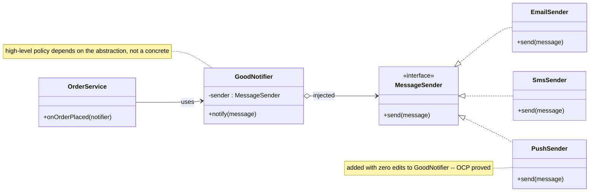

# Design Framework — SOLID Principles, Design Process & Tradeoff Matrix

> **Companion code:** [`design_framework.py`](https://github.com/quanhua92/tutorials/blob/main/lowleveldesign/design_framework.py).
> **Captured output:** [`design_framework_output.txt`](https://github.com/quanhua92/tutorials/blob/main/lowleveldesign/design_framework_output.txt).
> **Live demo:** [`design_framework.html`](https://github.com/quanhua92/tutorials/blob/main/lowleveldesign/design_framework.html) — click a SOLID letter to see the violation + fix, step the 5-phase process, and drag weights in the live tradeoff matrix.
> **Dashboard:** [`./index.html`](./index.html)

---

## 0. TL;DR — the one idea

> **The analogy:** LLD is not "name a pattern fast." It is a **pipeline of artifacts** — you turn a vague prompt into a *boundary*, then into *entities*, then into *relationships*, then into *patterns justified by SOLID*, then into a *tradeoff you can defend*. SOLID is the scoring rubric that tells you when each class decision is sound. The killer move is **narrating the decision at the moment you make it**: *"pricing varies at runtime, that's OCP, so I'll extract a Strategy."*

This bundle is the spine of the whole `lowleveldesign/` folder. Three parts, all in
[`design_framework.py`](https://github.com/quanhua92/tutorials/blob/main/lowleveldesign/design_framework.py):

1. **SOLID before/after** — one BAD smell and one GOOD refactor for each of **S, O, L, I, D**,
   each gated by an `assert` and a green `[check] OK`.
2. **The 5-phase design process** — Understand Requirements → Identify Entities →
   Define Relationships → Apply Patterns → Review Tradeoffs (the SEDIE shape),
   shown as a worked Notification Service.
3. **A weighted tradeoff matrix** — Email vs SMS vs Push scored on cost, latency,
   reliability, reachability, ranked deterministically.

| # | Principle | One-line symptom | Structural fix |
|---|---|---|---|
| **S** | Single Responsibility | One class does payroll + storage + presentation | Split by reason-to-change |
| **O** | Open/Closed | Add a tier = `if/elif` edit in the engine | Strategy: new tier = new class |
| **L** | Liskov Substitution | `Square extends Rectangle` breaks the resize contract | Sibling `Shape` abstraction, no false is-a |
| **I** | Interface Segregation | Fat `Worker` forces `Robot.eat()` to raise | Segregate `Workable` / `Eatable` / `Sleepable` |
| **D** | Dependency Inversion | `Notifier` news up `EmailSender` concrete | Depend on `MessageSender`; inject the concrete |

---

## 1. UML — the GOOD Notification design (DIP / Strategy)



The same `Strategy` shape is reused by `DiscountTier` (OCP) and by the `Shape.area()`
contract (LSP). One abstraction, three justifications — that is the point.

---

## 2. Implementation map (where each lives in `design_framework.py`)

All of PART I lives in
[`design_framework.py`](https://github.com/quanhua92/tutorials/blob/main/lowleveldesign/design_framework.py).
Each section prints an `=== BAD ===` banner, an `=== GOOD ===` banner, the sample
output of both, and a `[check] OK` after asserting the two agree.

```
=== PART I  --  SOLID: five principles, each BAD vs GOOD ===

=== S. SINGLE RESPONSIBILITY (SRP) -- BAD ===
BadEmployee.calculate_pay()  -> 1000.0
=== S. SINGLE RESPONSIBILITY (SRP) -- GOOD ===
PayCalculator.pay(emp)       -> 1000.0
  [check] OK   SRP split preserves pay (40 * 25.0 = 1000.0)

=== O. OPEN/CLOSED (OCP) -- BAD ===
bad_discount(100, 'vip')       -> 90.0
=== O. OPEN/CLOSED (OCP) -- GOOD ===
engine.price(100, StudentTier) -> 85.0
  [check] OK   OCP engine matches if/elif; StudentTier added with zero edits

=== L. LISKOV SUBSTITUTION (LSP) -- BAD ===
resize_to(BadSquare, 5, 10) -> area=100.0   (expected 50! LSP BROKEN)
=== L. LISKOV SUBSTITUTION (LSP) -- GOOD ===
  [check] OK   LSP fix: GoodSquare no longer pretends to be a Rectangle

... (ISP, DIP, then PART II process + PART III matrix) ...

=== ALL CHECKS PASSED -- SOLID + 5-phase process + tradeoff matrix ===
  [check] OK   design_framework.py complete
```

Run it yourself:

```bash
python3 design_framework.py                            # prints all banners + 9 [check] OK lines
python3 design_framework.py > design_framework_output.txt 2>/dev/null   # capture
```

---

## 3. SOLID analysis table

| Principle | How Applied in `design_framework.py` | Violation Risk / probe the interviewer uses |
|---|---|---|
| **S**RP | `BadEmployee` (3 jobs) → `Employee` + `PayCalculator` + `EmployeeRepository` + `PayReporter`. One reason-to-change each. | *"What breaks if the storage backend changes?"* — a SRP violation forces unrelated regressions. |
| **O**CP | `bad_discount` if/elif → `DiscountTier(ABC)` + `DiscountEngine` that only knows the interface. `StudentTier` is added with **zero** edits. | *"Add a tier without touching existing code"* — if you must edit a branch, OCP failed. |
| **L**SP | `BadSquare(BadRectangle)` silently changes height → `Shape(ABC)` with `GoodRectangle`/`GoodSquare` as siblings, not parent/child. | *"Can a subtype replace its parent everywhere?"* — Square-in-Rectangle is the canonical break. |
| **I**SP | Fat `BadWorker` → `Workable` / `Eatable` / `Sleepable`. `GoodRobot(Workable)` has no dead stubs. | *"Does any implementer raise `NotImplementedError`?"* — that smell is ISP violation. |
| **D**IP | `BadNotifier` news up `BadEmailSender` → `MessageSender(ABC)` injected into `GoodNotifier`. Swap Email↔SMS at the root. | *"Unit-test the notifier without a real mailer?"* — if you can't, you depend on a concrete. |

---

## 4. The 5-phase design process (SEDIE)

Each phase must leave a **visible artifact** on the board — a recited checklist scores nothing.

| Phase | Time | Artifact it leaves | Cheap failure mode |
|---|---|---|---|
| **1. Understand Requirements** | 3–5 min | In/out scope, assumptions, actors, archetype | Silent assumptions (the #1 L5+ failure) |
| **2. Identify Entities** | 5 min | Noun→class / verb→method list, with collapses named | Over-modeling: a value object promoted to a class |
| **3. Define Relationships** | 10–15 min | is-a / has-a / uses-a table + class diagram | Inheritance where composition fits (multi-axis variation) |
| **4. Apply Patterns** | (within 3) | requirement signal → SOLID → pattern, named together | Naming a pattern without the SOLID reason it serves |
| **5. Review Tradeoffs** | 5 min | weighted matrix + an extensibility proof (OCP delta) | "It's extensible" with no concrete new-class demonstration |

The worked example in PART II builds a **Notification Service**: Phase 1 fences it
(order events only, no marketing), Phase 2 collapses `Channel` to an enum and keeps
`Notifier` + `MessageSender`, Phase 3 chooses composition (`Notifier has-a
MessageSender`), Phase 4 maps "channel swaps at runtime" → OCP/DIP → Strategy, and
Phase 5 hands off to the weighted matrix in PART III.

---

## 5. Tradeoffs

| Option | Pros | Cons |
|---|---|---|
| **if/elif discount** (OCP-bad) | One function, no ceremony; fine for 2–3 fixed tiers | Every new tier edits the function; merge-conflict magnet; untestable per-tier |
| **Strategy / DiscountTier** | New tier = new class, engine never edits; each tier unit-testable | More files; needs a registry or composition root to pick the tier |
| `Square(Rectangle)` (LSP-bad) | Reuses the setters | Silently breaks `resize`; callers can't trust the contract |
| Sibling `Shape` hierarchy | Each shape honors its own contract; `area()` callers are safe | Can't share mutable setters — but those were the bug |
| Fat interface (ISP-bad) | One type to implement | Forces dead stubs; callers drag methods they never call |
| Segregated interfaces | Implementers depend only on what they use | More interfaces to maintain; balance against premature splitting |
| Hard-wired concrete (DIP-bad) | One-liner constructor | Untestable; channel change = rewrite the class |
| Injected abstraction | Swappable, mockable, open for extension | Needs DI wiring at a composition root (passing args, not a framework) |
| Weighted tradeoff matrix | Turns "gut call" into a defensible, reproducible ranking | Sensitive to weight choices — state the weights out loud so they can be challenged |

### The tradeoff matrix (default weights from PART III)

| option | cost×0.20 | latency×0.30 | reliability×0.30 | reachability×0.20 | **SCORE** |
|---|---|---|---|---|---|
| **Email** | 5 | 2 | 4 | 4 | **3.60** |
| **SMS** | 2 | 5 | 4 | 4 | **3.90** ← pick |
| Push | 5 | 4 | 3 | 2 | **3.50** |

Drag the weights in
[`design_framework.html`](https://github.com/quanhua92/tutorials/blob/main/lowleveldesign/design_framework.html)
to see the ranking flip — e.g. weight `cost` to 0.60 and Email/Push overtake SMS.

### Killer Gotchas

- **SOLID is a scoring rubric, not a goal.** Splitting a 40-line script into 9 classes to "satisfy SRP" is worse than the God Object. Decompose when a class has **≥2 unrelated reasons to change** — the "rule of two", not "more classes = more OOP".
- **LSP is about contracts, not signatures.** `BadSquare` compiles and passes type checks; it breaks the *behavioral contract* that width and height are independent. Subtyping ≠ substitutability.
- **OCP without an extensibility proof is a claim, not a design.** Always close with a concrete delta: *"a `PushSender` subclass needs zero edits to `GoodNotifier`."* Name which class changes and which does not.
- **DIP ≠ a DI framework.** Dependency inversion is *passing arguments to a constructor*. The GOOD examples here are pure function arguments — no Spring, no Guice.
- **ISP's trap is premature segregation.** Don't split an interface until a real implementer is forced into a dead stub. Split on pain, not on speculation.
- **Inheritance is for single-axis specialization; composition is for multi-axis variation.** "vehicle type AND fuel type" → composition, never a 2-D subclass explosion.
- **The matrix only helps if weights are stated.** A ranking with secret weights is a gut call in a spreadsheet. Say the weights out loud so the interviewer can push back.

---

## 6. Interview delivery — name the SOLID letter out loud

Examiners reward the **requirement → SOLID → pattern** linkage on every choice:

- *"Pricing varies at runtime, so that's **OCP** — I'll extract a `DiscountTier` **Strategy**; a new tier is a new class, the engine never edits."*
- *"A `Square` can't honor the `Rectangle` resize contract, so that's an **LSP** break — I'll make them siblings under a `Shape` abstraction and keep `area()` the only shared expectation."*
- *"`Notifier` must not know how the message leaves the building, so that's **DIP** — it depends on a `MessageSender` interface, injected at the root; I can unit-test it with a fake sender."*
- *"For the channel choice I won't guess — I'll score Email/SMS/Push on cost, latency, reliability, reachability in a weighted matrix, then defend the weights."*

Close staff-level: *"I'd wire a `methods-per-class` and a `cycle-detection` check into CI so SOLID drift fails the build, not just gets caught in review."*

---

## 7. Files in this bundle

| File | Role |
|---|---|
| [`design_framework.py`](https://github.com/quanhua92/tutorials/blob/main/lowleveldesign/design_framework.py) | Ground truth — SOLID BAD/GOOD, 5-phase process, weighted tradeoff matrix. Pure stdlib. 9 `[check] OK`. |
| [`design_framework_output.txt`](https://github.com/quanhua92/tutorials/blob/main/lowleveldesign/design_framework_output.txt) | Captured stdout of the run above. |
| [`DESIGN_FRAMEWORK.md`](https://github.com/quanhua92/tutorials/blob/main/lowleveldesign/DESIGN_FRAMEWORK.md) | This guide — UML, SOLID table, process, tradeoffs, gotchas. |
| [`design_framework.html`](https://github.com/quanhua92/tutorials/blob/main/lowleveldesign/design_framework.html) | Interactive SOLID explorer + 5-phase stepper + live tradeoff matrix calculator. Zero deps. |
