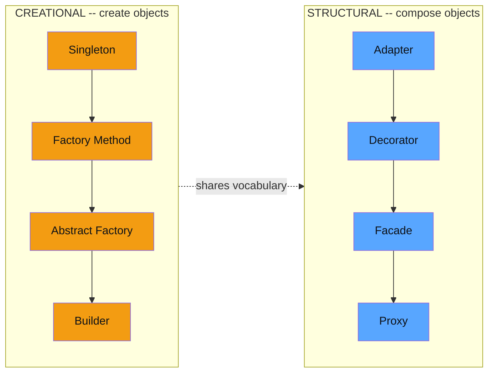
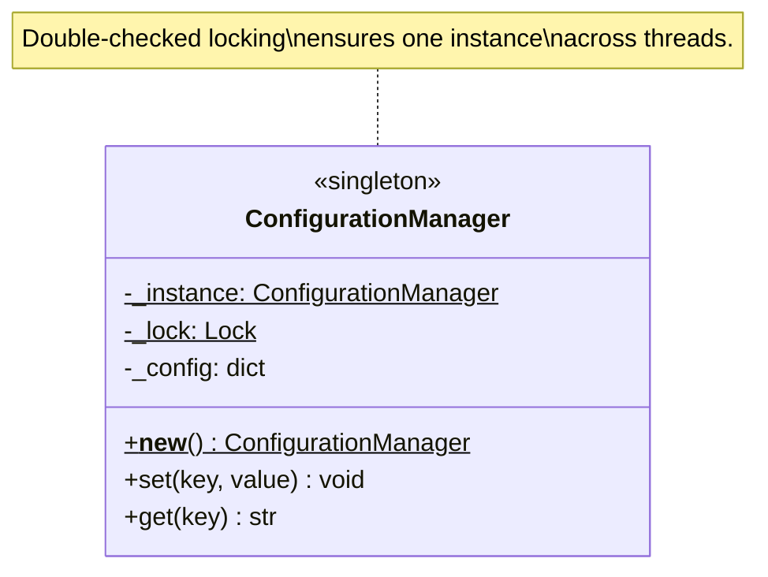
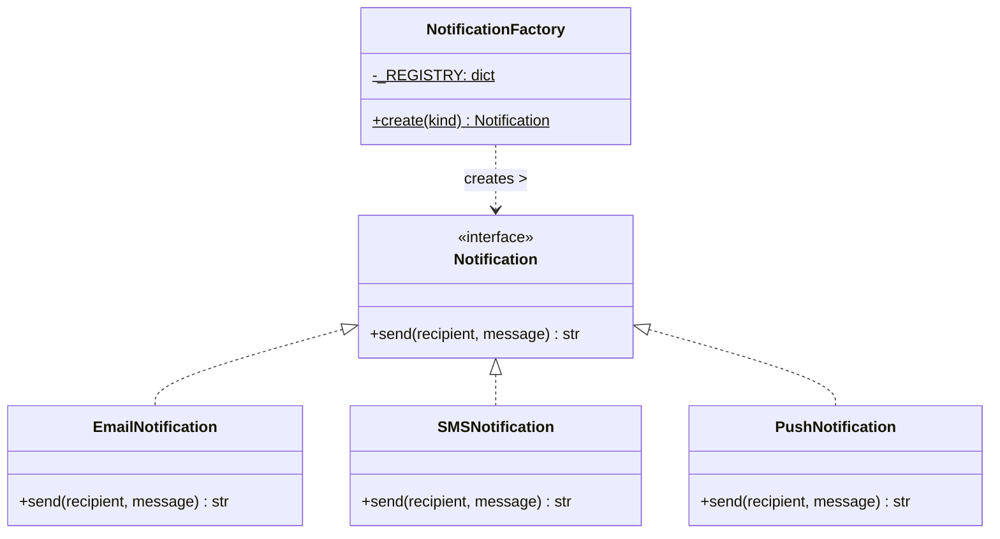
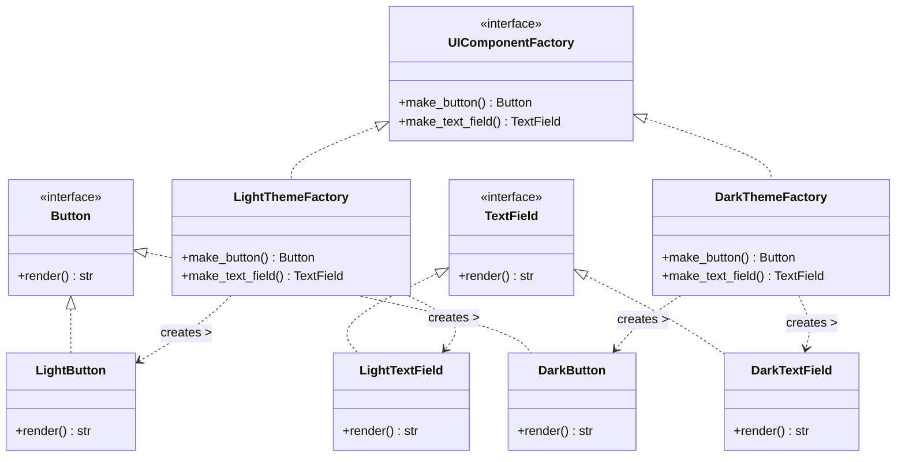
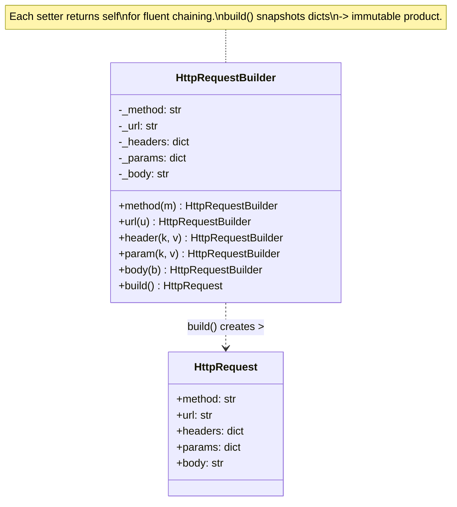
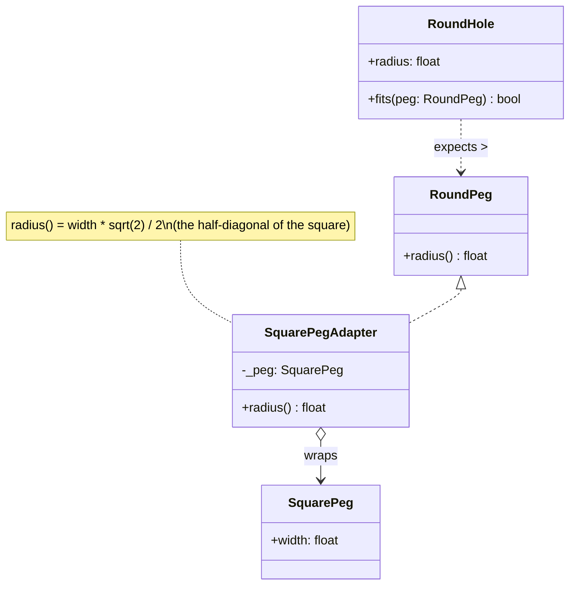
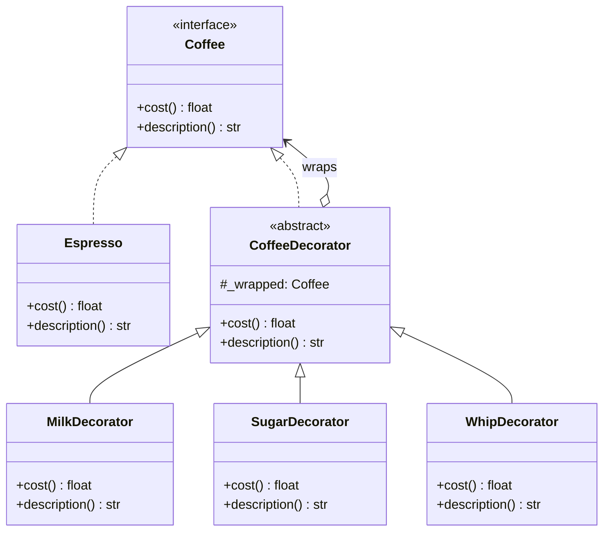
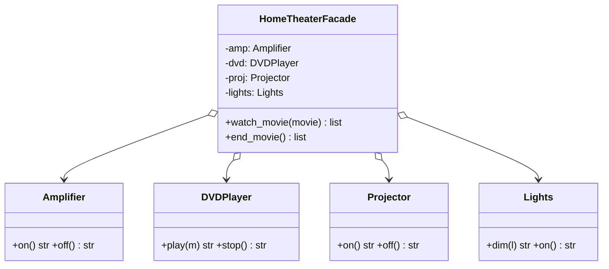
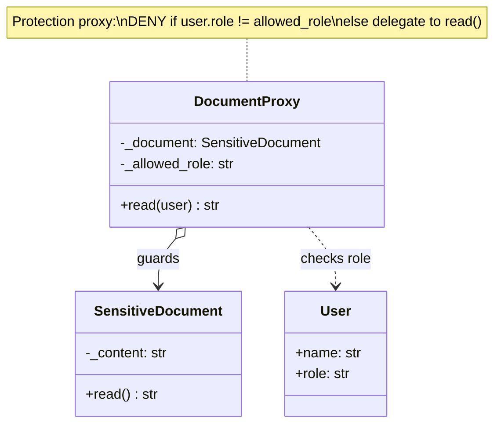

# GoF Design Patterns — Creational & Structural

> **Companion code:** [`design_patterns.py`](https://github.com/quanhua92/tutorials/blob/main/lowleveldesign/design_patterns.py).
> **Captured output:** [`design_patterns_output.txt`](https://github.com/quanhua92/tutorials/blob/main/lowleveldesign/design_patterns_output.txt).
> **Live demo:** [`design_patterns.html`](./design_patterns.html)

---

## 0. TL;DR — the one idea

> **The analogy:** Design patterns are a **shared vocabulary for the axis of change.**
> Before reaching for a pattern you name *what must vary independently* — "pricing varies, parking
> allocation doesn't" → **Strategy**; "create an object based on a type tag" → **Factory**; "wrap an
> object to add behavior without subclassing" → **Decorator**. The pattern is the *shape*; the
> domain (parking lot, elevator, chess) is the *material*.

This bundle implements **8 patterns** — 4 creational (how objects get made) and 4 structural (how
objects compose). Every pattern below is a runnable scenario in
[`design_patterns.py`](https://github.com/quanhua92/tutorials/blob/main/lowleveldesign/design_patterns.py)
and is reproduced interactively in [`design_patterns.html`](./design_patterns.html).



---

## 1. Creational Patterns

### 1.1 Singleton — one instance in the system

**Signal:** "there should only be one X". **Example:** `ConfigurationManager`, `ParkingLot` root,
`Logger`. **Pitfall:** overused; hides dependencies. Prefer dependency injection when you can.



From [`design_patterns.py`](https://github.com/quanhua92/tutorials/blob/main/lowleveldesign/design_patterns.py):

```python
class ConfigurationManager:
    _instance = None
    _lock = threading.Lock()

    def __new__(cls):
        if cls._instance is None:              # 1st check (no lock)
            with cls._lock:
                if cls._instance is None:      # 2nd check (under lock)
                    cls._instance = super().__new__(cls)
                    cls._instance._config = {}
        return cls._instance
```

```
cfg_a is cfg_b  -> True           # same object, every time
cfg_b.get('region') -> 'us-east-1'  # set via cfg_a, visible from cfg_b
```

### 1.2 Factory Method — create objects by a type tag

**Signal:** "create an object based on a type". **Example:** `NotificationFactory.create("email")`,
creating the right `ParkingSpot` subtype, the right `ChessPiece`. Callers depend on the **product
interface**, never the concrete class — adding a channel edits one `_REGISTRY`.



```
EMAIL -> alice@example.com: order shipped
SMS   -> alice@example.com: order shipped
PUSH  -> alice@example.com: order shipped
unknown type raises -> unknown notification type: 'carrier-pigeon'
```

### 1.3 Abstract Factory — a family of related products

**Signal:** "create a *family* that must be consistent together". **Example:** a `UIComponentFactory`
that returns a matching `Button` + `TextField` per theme. Switching one factory swaps the whole
family — light theme or dark theme, never a half-and-half Frankenstein.



### 1.4 Builder — many optional parts → one immutable object

**Signal:** "object needs many optional parameters". **Example:** `HttpRequestBuilder`,
SQL query builder, complex config objects. Beats the **telescoping constructor** anti-pattern
(`Request(method, url, h1, h2, h3, body)`) by chaining fluent setters and freezing in `build()`.



---

## 2. Structural Patterns

### 2.1 Adapter — make an incompatible class fit

**Signal:** "reuse a class whose interface doesn't match". **Example:** `SquarePeg` (exposes
`width`) plugged into a `RoundHole` (expects `radius`). The adapter computes the circumscribed
radius `= width · √2 / 2`.



```
RoundHole(radius=5.0)
RoundPeg(radius=4.0)         fits? True
SquarePeg(width=6.0) -> adapter radius=4.243  fits? True
SquarePeg(width=8.0) -> adapter radius=5.657  fits? False
```

### 2.2 Decorator — add behavior by wrapping

**Signal:** "wrap an object to add behavior without changing its class". **Example:** `Coffee`
+ `Milk` + `Sugar` + `Whip` toppings — each decorator holds the wrapped object and delegates.
No subclass explosion (`MilkEspresso`, `SugarMilkEspresso`, ...). **Order matters** when wrappers
have side effects (e.g. `Retry(Timeout(Client))` vs `Timeout(Retry(Client))`).



```
Espresso                         -> $2.00
Espresso + Milk                  -> $2.50
Espresso + Milk + Sugar          -> $2.75
Espresso + Milk + Sugar + Whip   -> $3.50
```

### 2.3 Facade — one call over many subsystems

**Signal:** "the client shouldn't have to orchestrate N classes". **Example:**
`HomeTheaterFacade.watch_movie()` hides `Amplifier` + `DVDPlayer` + `Projector` + `Lights` behind
one method. The subsystems stay usable directly — the facade is a *convenience* layer, not a gate.



### 2.4 Proxy — a stand-in that controls access

**Signal:** "I need to intercept calls to an object". **Three flavors:**
- **Protection proxy** — access check before delegating (`DocumentProxy` below).
- **Virtual proxy** — lazily create the expensive real subject on first use (image loading).
- **Remote proxy** — forward calls over the network (RPC stubs).



```
guest read -> DENIED: guest_alice (role=guest) cannot read
exec  read -> Q3 revenue = $42M (confidential)
```

---

## 3. SOLID Analysis

| Principle | How Applied | Violation Risk |
|---|---|---|
| **S**RP | `NotificationFactory` only maps type→class; `Notification` only sends. | Singleton that also loads config + logs + caches → god object. |
| **O**CP | Add a `PushNotification` by editing `_REGISTRY` only — no caller changes. | A factory that hard-codes `if kind == "email"` branches everywhere. |
| **L**SP | Any `CoffeeDecorator` subclass can replace `CoffeeDecorator` / `Coffee`. | Decorator that swallows the wrapped call or changes the return type. |
| **I**SP | `Button` and `TextField` are separate interfaces, not one fat `Widget`. | A monolithic `UIComponent` interface forcing every class to stub 10 methods. |
| **D**IP | `render_ui()` depends on `UIComponentFactory` (abstract), not `DarkButton`. | Client code that imports concrete `EmailNotification` directly. |

---

## 4. Tradeoffs

| Pattern | Pros | Cons |
|---|---|---|
| **Singleton** | One source of truth; lazy init; global access | Hidden coupling; hard to unit test; thread-safety tax; often a global in disguise |
| **Factory Method** | Centralized creation; OCP-friendly; callers decoupled | Adds a class + registry; indirection for trivial construction |
| **Abstract Factory** | Whole consistent families swap at once; config-driven | Rigid family — adding a *new product kind* (e.g. `Checkbox`) touches every factory |
| **Builder** | Fluent; readable; immutable product; no telescoping ctor | More boilerplate; easy to forget `build()` / mutate the builder after |
| **Adapter** | Reuse legacy/incompatible code; no edit to either side | Per-conversion overhead; extra layer; can hide mismatched semantics |
| **Decorator** | Compose behavior dynamically; no subclass explosion | Wrapper chain hard to debug; ordering can silently change behavior |
| **Facade** | Simplifies a complex API; decouples client from subsystems | Can become a god object if it grows; risks hiding needed subsystem access |
| **Proxy** | Lazy load, access control, logging without touching subject | Indirection on every call; proxy must forward *every* method faithfully |

### When NOT to use

- **Singleton** — Config can be passed into constructors; a DB pool is owned by a container, not
  fetched via `getInstance()`.
- **Factory** — Not needed when creation is obvious and local: `Notification("email")` directly.
- **Decorator** — Dangerous when wrappers have hidden ordering dependencies — encode order in a
  Builder / pipeline instead.
- **Facade** — Skip if there's only one subsystem client already understands.

### Killer Gotchas

```
1. Singleton + threads: without double-checked locking, two __new__() calls can
   both pass the first check and create two instances. Always lock around the
   second check.

2. Decorator ordering is observable. Retry(Timeout(client)) retries each timed-
   out attempt; Timeout(Retry(client)) gives up after ONE total timeout that
   includes all retries. Document the order you intend.

3. Builder mutating after build(): if build() doesn't snapshot dicts/lists,
   later builder mutations leak into the "immutable" product. Copy on freeze.

4. Adapter != Facade. An adapter makes ONE incompatible object usable; a facade
   simplifies a SUBSYSTEM of many objects. Don't reach for the wrong one.

5. Abstract Factory adds new product kinds painfully. If "add a new Button style"
   is your axis of change (not "add a new product type"), Factory Method is the
   lighter choice.
```

---

## 5. Gold Check (cross-language parity)

Both `design_patterns.py` and `design_patterns.html` compute the **decorator coffee price** for the
topping chain `[milk, sugar, whip]` over an Espresso base. Prices are kept exact in binary float so
both languages agree to one decimal place:

```
Espresso base = 2.0   +   Milk 0.5   +   Sugar 0.25   +   Whip 0.75   =   3.5
```

```
coffee_chain_cost([milk,sugar,whip]) = 3.5      # design_patterns.py
coffee_chain_cost(["milk","sugar","whip"]) = 3.5  # design_patterns.html (JS)
```

The HTML demo shows a gold `[OK]` badge when the JS recomputation matches the Python value `3.5`.

---

## 6. Pattern Quick Reference

| Pattern | Category | Problem Solved | LLD Example |
|---|---|---|---|
| Singleton | Creational | Single shared instance | ConfigurationManager, Logger, ParkingLot root |
| Factory Method | Creational | Create objects by type | Notification, ParkingSpot, ChessPiece |
| Abstract Factory | Creational | Create a consistent family | UI theme (Button + TextField), DB driver family |
| Builder | Creational | Many optional params | HttpRequest, SQL query, config |
| Adapter | Structural | Bridge incompatible interfaces | SquarePeg → RoundHole, legacy library wrap |
| Decorator | Structural | Add behavior by wrapping | Coffee toppings, Logging, Encryption, Retry |
| Facade | Structural | Simplify a subsystem | HomeTheater, Compiler pipeline |
| Proxy | Structural | Control access / lazy load | DocumentProxy (auth), ImageProxy (lazy), RPC stub |

---

## 7. Companion files

| File | Role |
|---|---|
| [`design_patterns.py`](https://github.com/quanhua92/tutorials/blob/main/lowleveldesign/design_patterns.py) | Ground-truth implementation (pure stdlib, `===` banners, `[check] OK`) |
| [`design_patterns_output.txt`](https://github.com/quanhua92/tutorials/blob/main/lowleveldesign/design_patterns_output.txt) | Captured stdout of `python3 design_patterns.py` |
| [`design_patterns.html`](./design_patterns.html) | Interactive pattern selector + class-diagram visualizer |
| [`./index.html`](./index.html) | Low-Level Design dashboard |
