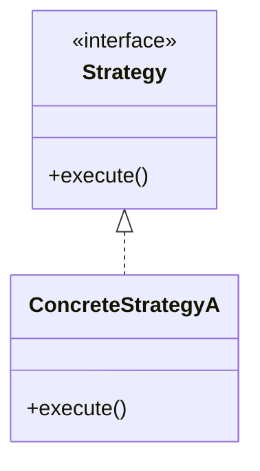

# HOW_TO_RESEARCH — Low-Level Design "Concept-as-a-Bundle" Workflow

> Adapted from `interview/HOW_TO_RESEARCH.md`.

## 0. The one rule

> **Every concept is a bundle of files that cite each other, all deriving from ONE
> ground-truth `.py`. Nothing is ever hand-computed.**

A **concept bundle** = `{name}.py` + `{name}_output.txt` + `{NAME}.md` + `{name}.html`.

## 1. Focus

This folder covers **low-level design (LLD)**: object-oriented design patterns, UML,
API design, schema design, and refactoring. Each bundle teaches ONE design concept
with working code, class diagrams, and interactive explorers.

**12 bundles. Python only.**

## 2. Source material

The interview-prep repo at `/Users/quan/workspace/interview-prep/low_level_design/`:

```
low_level_design/
  ├── design_patterns/         checklist.md, discussion.md
  ├── behavioral_patterns/     checklist.md, discussion.md
  ├── antipatterns/            checklist.md, discussion.md
  ├── uml_class_diagrams/      checklist.md, discussion.md
  ├── lru_cache/               checklist.md, discussion.md
  ├── parking_lot/             checklist.md, discussion.md
  ├── shopping_cart/           checklist.md, discussion.md
  ├── api_design/              checklist.md, discussion.md
  ├── database_schema_design/  checklist.md, discussion.md
  ├── design_framework/        checklist.md, discussion.md
  ├── rate_limiter_lld/        checklist.md, discussion.md
  └── refactoring_patterns/    checklist.md, discussion.md
```

## 3. The four roles of each file

| File | Role | Hard rules |
|---|---|---|
| **`name.py`** | Ground truth. Implements the OOP design with classes, interfaces, relationships. Shows design in action with demo scenarios. | Pure Python stdlib. `if __name__ == "__main__"` with `===` banners. |
| **`name_output.txt`** | Captured stdout. | `python3 name.py > name_output.txt 2>/dev/null` |
| **`NAME}.md`** | Design guide. UML class diagrams, pattern explanation, SOLID analysis, tradeoffs. | Mermaid class diagrams. Code snippets. SOLID analysis table. |
| **`name.html`** | Interactive. UML explorer with clickable classes, object lifecycle viewer, code playground. | Dark palette. Amber accent `#f39c12`. Gold-checked against `.py`. |

## 4. The `.md` structure

```markdown
# [Design Topic]

> **Companion code:** [`name.py`](https://github.com/quanhua92/tutorials/blob/main/lowleveldesign/name.py).
> **Live demo:** [`name.html`](./name.html)

---

## 0. TL;DR — the one idea
> **The analogy:** [plain-English mental model]

## 1. UML Class Diagram



## 2. Implementation
[code with banners showing the design]

## 3. SOLID Analysis
| Principle | How Applied | Violation Risk |
|---|---|---|

## 4. Tradeoffs
| Option | Pros | Cons |
|---|---|---|

### Killer Gotchas
```

## 5. The `.html` style

- **Dark palette:** `--bg:#0d1117; --panel:#161b22; --ink:#e6edf3`
- **Accent:** amber `#f39c12`
- **Interactive UML:** clickable class boxes showing relationships, attributes, methods
- **Object lifecycle:** step through object creation, method calls, destruction
- **`[check: OK]` gold badge** — recompute a known output in JS, compare to `.py`
- **`← all tutorials`** link to `./index.html` (lowleveldesign dashboard, NOT `../index.html`)
- **`.md` and `.py` links** must use full GitHub URLs: `https://github.com/quanhua92/tutorials/blob/main/lowleveldesign/<STEMUP>.md`
- **Zero external dependencies**

## 6. Bundle catalog

| # | Stem | Topic | Key Visualization |
|---|---|---|---|
| 01 | `design_patterns` | GoF Design Patterns | Interactive pattern selector with UML + code |
| 02 | `behavioral_patterns` | Behavioral Patterns | Strategy/Observer/Command interactive demos |
| 03 | `antipatterns` | Antipatterns | Before/after code diff visualizer |
| 04 | `uml_class_diagrams` | UML Class Diagrams | Interactive UML builder with relationship types |
| 05 | `lru_cache` | LRU Cache | Cache with eviction animation (HashMap + DLL) |
| 06 | `parking_lot` | Parking Lot | OOP design with object graph + spot allocation |
| 07 | `shopping_cart` | Shopping Cart | State machine + pricing rules engine |
| 08 | `api_design` | REST API Design | Endpoint designer with HTTP semantics |
| 09 | `database_schema_design` | Database Schema | ER diagram builder with normalization steps |
| 10 | `design_framework` | Design Framework | SOLID principles + design process checklist |
| 11 | `rate_limiter_lld` | Rate Limiter LLD | Token bucket OOP with strategy pattern |
| 12 | `refactoring_patterns` | Refactoring Patterns | Code smell detector + refactoring playbook |

## 7. Verification discipline

```bash
python3 name.py > /dev/null 2>&1 && echo "PY OK"
python3 -c "import re;open('/tmp/_j.js','w').write(re.search(r'<script>(.*)</script>',open('name.html').read(),re.S).group(1))"
node --check /tmp/_j.js && echo "JS OK"
```

## 8. Common bugs to AVOID

- **`const` reassignment:** NEVER `const x = []; x = x.concat(...)`. Use `let` or `.push()`.
- **Array `.join(", ")` spaces:** gold-check needs `.join(",")` without spaces.
- **Relative links:** `.md` and `.py` links MUST be full GitHub URLs.
- **Back-link:** `.html` must link to `./index.html` (lowleveldesign dashboard).
