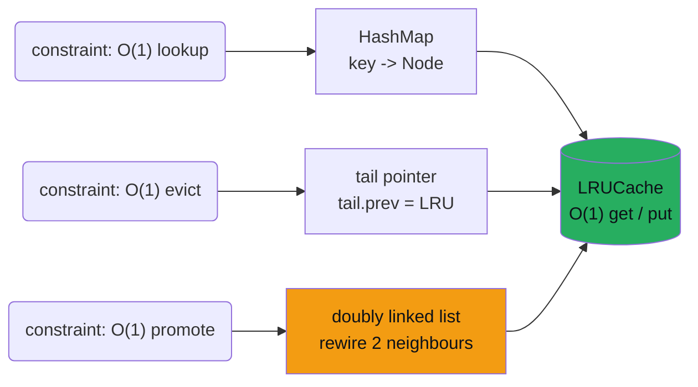
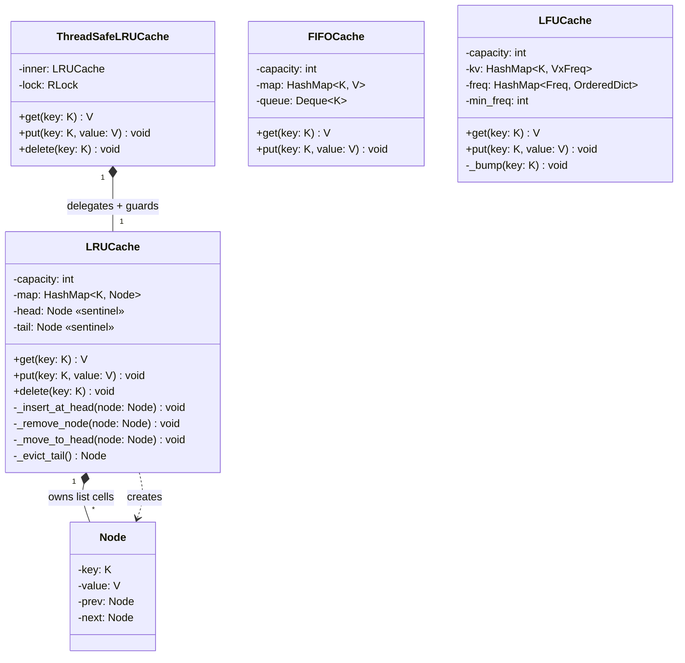

# LRU Cache

> **Companion code:** [`lru_cache.py`](https://github.com/quanhua92/tutorials/blob/main/lowleveldesign/lru_cache.py).
> **Captured output:** [`lru_cache_output.txt`](https://github.com/quanhua92/tutorials/blob/main/lowleveldesign/lru_cache_output.txt).
> **Live demo:** [`lru_cache.html`](./lru_cache.html)

---

## 0. TL;DR — the one idea

> **The analogy:** An LRU cache is a **bouncer at a fixed-capacity club**. The dance floor holds `capacity`
> people. Every time someone dances (`get`), the bouncer walks them to the **front of the line**. When the
> floor is full and a new guest arrives (`put`), the bouncer throws out whoever has been **standing at the
> back the longest without dancing** — never scanning the whole room, just glancing at the back of the line.

The trick that makes this O(1) is that **two data structures share the same nodes**: a HashMap gives you
instant lookup by key, and a doubly-linked list gives you instant pointer surgery to move a node to the
front or chop one off the back. Neither structure alone is enough — the HashMap can't order things, and the
list can't find things. Together they are O(1) for everything.



---

## 1. UML Class Diagram

The core is two classes — `Node` (the list cell) and `LRUCache` (the orchestrator that owns the HashMap,
the sentinels, and the lock). The thread-safe variant **delegates** to a plain `LRUCache` and only adds
locking — note it does *not* subclass, because locking is a *decorator* concern, not an *is-a* concern.



**Layout to memorize** — sentinel nodes bookend the list so no helper ever null-checks:

```
head(sentinel) <-> [MRU] <-> [   ] <-> ... <-> [LRU] <-> tail(sentinel)
   ^                                                    ^
   insert here                                  evict tail.prev here
```

`head.next` is always the Most-Recently-Used; `tail.prev` is always the Least-Recently-Used. The HashMap
stores **Node pointers**, not values, so promoting a hit is four pointer assignments with zero searching.

---

## 2. Implementation

The private helpers (from `lru_cache.py`) are the whole algorithm — four primitives that the public
methods compose. **Every helper assumes the lock is already held** (a precondition, not a guard):

```python
def _insert_at_head(self, node):          # splice between head sentinel and MRU
    node.prev = self._head
    node.next = self._head.next
    self._head.next.prev = node
    self._head.next = node

def _remove_node(self, node):             # unlink by rewiring both neighbours
    node.prev.next = node.next
    node.next.prev = node.prev

def _move_to_head(self, node):            # remove + insert  (refresh recency)
    self._remove_node(node)
    self._insert_at_head(node)

def _evict_tail(self):                    # detach LRU (tail.prev); caller updates map
    lru = self._tail.prev
    self._remove_node(lru)
    return lru
```

The public methods are thin orchestrators over those primitives. Captured in
`lru_cache_output.txt` (Section "Eviction animation trace"), the classic
[LeetCode 146](https://leetcode.com/problems/lru-cache/) scenario at capacity 2:

```
step 1: put(1,1)   head <-> [1:1] <-> tail
step 2: put(2,2)   head <-> [2:2] <-> [1:1] <-> tail          (now full)
step 3: get(1)     head <-> [1:1] <-> [2:2] <-> tail   -> 1   (hit, promote)
step 4: put(3,3)   head <-> [3:3] <-> [1:1] <-> tail          (evict LRU key 2)
step 5: get(2)                                            -> None (miss, just evicted)
step 6: put(4,4)   head <-> [4:4] <-> [3:3] <-> tail          (evict LRU key 1)
step 7: get(1)                                            -> None (miss)
step 8: get(3)     head <-> [3:3] <-> [4:4] <-> tail   -> 3   (hit, promote)
step 9: get(4)     head <-> [4:4] <-> [3:3] <-> tail   -> 4   (hit, promote)
```

---

## 3. The Five Invariants — state them before you code

These are the contract every operation must preserve. The thread-safety invariant is the one interviewers
escalate to E5/E6 (see [discussion](#)).

| # | Invariant | What breaks it |
|---|---|---|
| 1 | **Size** — `len(map) == count of list nodes` | removing from the list but forgetting the map (memory leak) |
| 2 | **Recency** — `head.next` is MRU, `tail.prev` is LRU | forgetting `_move_to_head` on a `get` hit |
| 3 | **Capacity** — `len(map) <= capacity` after every `put` | inserting before checking, or evicting before inserting |
| 4 | **Bidirectionality** — `N.prev.next == N` and `N.next.prev == N` | updating only one of the two neighbour pointers |
| 5 | **Thread safety** — invariants 1–4 hold for every observer | non-atomic check-then-set outside a single lock scope |

---

## 4. SOLID Analysis

| Principle | How the design applies it | Violation smell |
|---|---|---|
| **S**RP | `Node` only stores a cell; `LRUCache` only manages recency; `ThreadSafeLRUCache` only manages locking | one class doing eviction + locking + persistence |
| **O**CP | Swap LRU→LFU→FIFO by instantiating a different class — the caller's `get`/`put` calls are identical | a `policy` boolean flag inside one god-class |
| **L**SP | `ThreadSafeLRUCache` exposes the same contract as `LRUCache` (same method signatures, same semantics) | a wrapper that drops `delete()` or changes `get()` to raise |
| **I**SP | the cache interface is 3 methods (`get`/`put`/`delete`) — no fat interface | forcing callers to implement `stats()` or `snapshot()` they don't need |
| **D**IP | `ThreadSafeLRUCache` depends on the `LRUCache` abstraction, not a concrete storage backend | the wrapper hand-rolling its own map a second time |

---

## 5. Tradeoffs — LRU vs LFU vs FIFO

Run the **same workload** (capacity 2) through all three — captured in `lru_cache_output.txt`
(Section "LRU vs LFU vs FIFO"). The workload warms key 1 three times (hot key), then touches key 2 right
before inserting key 3 to force an eviction:

| Policy | evicted @ `put(3)` | final members | hit rate | why |
|---|---|---|---|---|
| **LRU** | key `1` | `[3, 2]` | 4/6 (66.7%) | the `get(2)` made key 1 the LRU; LRU has no memory of frequency |
| **LFU** | key `2` | `[3, 1]` | 6/6 (100.0%) | key 1 had freq 4 ≫ key 2's freq 2 → protected the hot key |
| **FIFO** | key `1` | `[2, 3]` | 4/6 (66.7%) | key 1 was inserted first; `get` never refreshes position |

| Choice | Pros | Cons |
|---|---|---|
| **LRU** | exploits temporal locality (most real workloads); O(1); simple | thrashes on a one-time scan that flushes the hot set |
| **LFU** | protects frequently-used hot keys against scans | slow to forget — a key popular yesterday starves a new hot key today; O(1) is fiddly |
| **FIFO** | dead-simple; no metadata on access; great when order = staleness (message queues) | ignores access pattern entirely; poor cache hit rate on skewed load |
| **ARC / W-TinyLFU** | hybrid: LRU freshness + LFU frequency counting | significantly more complex; usually only worth it at scale |

> **Rule of thumb:** default to **LRU**. Switch to **LFU** only when you have measured a hot-key/skew
> access pattern and a long tail of cold scans. Reach for **W-TinyLFU** (Caffeine, Ristretto) at production
> scale. Almost never pick plain **FIFO** for a value cache — it's the right call for a *staleness* cache
> (e.g. queued messages) where insertion order is the only thing that matters.

---

## 6. Concurrency & Scaling (the E5/E6 deep dive)

| Strategy | Mechanism | When |
|---|---|---|
| **Global lock** (this bundle) | one `RLock` around every method | correctness floor; serialises all access |
| **ReadWriteLock** | many readers, one writer | read-heavy workloads (≫90% gets) |
| **Segmented locking** | `hash(key) % N` → N independent `(map, dll, lock)` shards | production: ~N× throughput, hot keys still bottleneck their shard |
| **L1 local + L2 shared** | sticky-routing local hot set + Redis/Memcached shared tier | multi-host; invalidation via pub/sub or short TTL |

The `get`/`put` **interface never changes** from local to distributed — abstract storage behind a `Store`
interface on day one. Two production hazards:

- **Thundering herd:** N threads miss the same cold key → N backend calls. Fix with **singleflight**: the
  first miss registers an in-flight `Future` per key; later waiters block on it. *Always release the cache
  lock before calling the external loader, or you deadlock.*
- **Stale TTL:** serve an expired entry. Fix with **lazy eviction** — check `node.is_expired()` inside
  `get()` — optionally plus a background sweep for long-idle entries.

---

## 7. Killer Gotchas

```
1. Using a SINGLY linked list.
   Removing an arbitrary node needs its PREDECESSOR. A singly linked list
   only hands you the successor in O(1); finding the predecessor is O(n).
   That destroys the O(1) put() guarantee. You MUST use a doubly linked list.

2. Storing VALUES in the HashMap instead of NODE POINTERS.
   map: key -> value  forces a list SEARCH to find the node to promote -> O(n).
   map: key -> Node    lets you promote with 4 pointer assignments -> O(1).

3. No sentinel nodes.
   Without dummy head/tail, _insert_at_head and _evict_tail each need special
   cases for an empty list and a single-element list. Sentinels collapse all
   of those into one uniform code path. The #1 source of off-by-one bugs.

4. Removing a node from the list but forgetting the map (or vice versa).
   This is invariant #1 (size). A detached node is a MEMORY LEAK; a map entry
   pointing at a removed node is a USE-AFTER-FREE. Always update both together.

5. Forgetting _move_to_head on a get() hit.
   A hit that doesn't promote silently degrades LRU into FIFO. Invariant #2.

6. Check-then-set OUTSIDE the lock (thread-safety bug).
     if key in map: ...        # thread A reads "absent"
     map[key] = node           # thread B also read "absent" -> double insert
   Every read-modify-write of the shared state must happen inside ONE lock
   acquisition. This is invariant #5.

7. Calling the external loader while holding the cache lock.
   The loader does I/O (network/disk). Holding the lock across it serialises
   the whole cache on the slowest backend call -> deadlock-ish throughput.
   Release the lock, do singleflight, re-acquire to write.
```

---

## 8. The gold check (recomputed in JS)

`lru_cache.html` rebuilds the [LeetCode 146](https://leetcode.com/problems/lru-cache/) trace in JavaScript
and recomputes two signatures, comparing against the Python ground truth in `lru_cache.py`
(`section_gold_check`):

```
lru.gets_signature   = 1,-1,-1,3,4    // get() return values, None -> -1
lru.final_order      = 4,3            // keys MRU -> LRU after the last op
```

Both must match exactly or the gold badge flips to `[FAIL]`.

---

## 9. Companion files

| File | Role |
|---|---|
| [`lru_cache.py`](https://github.com/quanhua92/tutorials/blob/main/lowleveldesign/lru_cache.py) | Ground-truth LRU + thread-safe variant + LFU/FIFO comparison (pure stdlib) |
| [`lru_cache_output.txt`](https://github.com/quanhua92/tutorials/blob/main/lowleveldesign/lru_cache_output.txt) | Captured stdout — eviction animation trace + hit-rate table |
| [`lru_cache.html`](./lru_cache.html) | Interactive cache visualizer (insert/get → watch nodes move, evict when full) |
| [`./index.html`](./index.html) | Low-Level Design dashboard |
