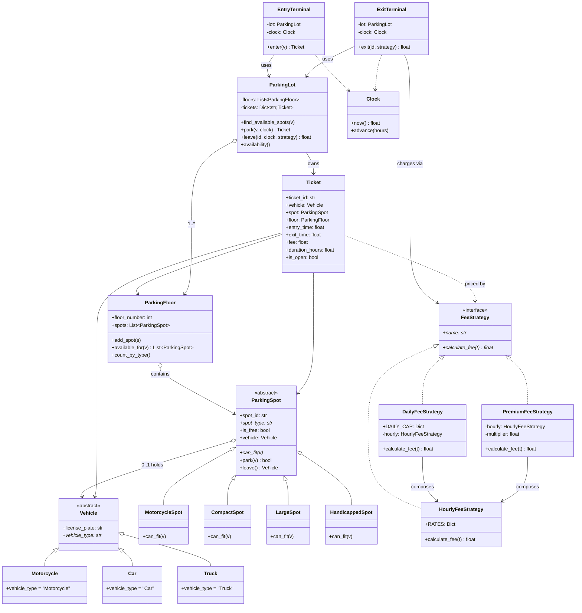

# Parking Lot System

> **Companion code:** [`parking_lot.py`](https://github.com/quanhua92/tutorials/blob/main/lowleveldesign/parking_lot.py)
> **Captured output:** [`parking_lot_output.txt`](https://github.com/quanhua92/tutorials/blob/main/lowleveldesign/parking_lot_output.txt)
> **Live demo:** [`parking_lot.html`](./parking_lot.html)

---

## 0. TL;DR — the one idea

> **The analogy:** a parking lot is a *facade over many small independent resources*.
> Each spot is its own little locked box — it alone decides whether it can take a
> vehicle. The `ParkingLot` never hands a spot out; it *presents candidates* and lets
> each spot's `park()` win or lose the race under its own lock. Fees are a separate
> concern entirely: a `FeeStrategy` reads a finished `Ticket` and returns a number,
> swappable without touching the lot.

The recurring tension this design resolves is **three independent axes of change**:
vehicle types, spot types, and pricing rules. A naive solution entangles them in one
god-class (`if car and compact and peak then …`). The OOD answer is **one hierarchy
per axis**: `Vehicle` knows its type, `ParkingSpot` knows whom it fits, `FeeStrategy`
knows what to charge. They meet only at the `Ticket` — a small, immutable join.

Three patterns, one mental model. See it in code:
[`parking_lot.py`](https://github.com/quanhua92/tutorials/blob/main/lowleveldesign/parking_lot.py).

---

## 1. UML Class Diagram — the full object graph



The four relationships to read off this graph:

- **Inheritance** (`<|--`) — `Vehicle` and `ParkingSpot` hierarchies: a new type is a
  new leaf class, never an edited `switch`.
- **Composition** (`o-->`) — `ParkingLot` owns `ParkingFloor`s owns `ParkingSpot`s;
  `DailyFeeStrategy` *composes* `HourlyFeeStrategy` instead of duplicating its math.
- **Uses** (`-->`) — terminals depend on the `ParkingLot` facade and a `FeeStrategy`;
  they never reach into a spot directly.
- **Dependency** (`..>`) — `Ticket` is priced *by* a strategy and stamped *by* a clock,
  but owns neither.

---

## 2. Implementation

The full runnable source is
[`parking_lot.py`](https://github.com/quanhua92/tutorials/blob/main/lowleveldesign/parking_lot.py).
Each scenario has a `demo_*()` guarded by an `===` banner and a `[check] OK` assertion.
Captured stdout:
[`parking_lot_output.txt`](https://github.com/quanhua92/tutorials/blob/main/lowleveldesign/parking_lot_output.txt).

**Spot compatibility lives on the spot, not the vehicle (`can_fit`):**

```python
class LargeSpot(ParkingSpot):
    def can_fit(self, vehicle: Vehicle) -> bool:
        return vehicle.vehicle_type in ("Motorcycle", "Car", "Truck")
```

**Per-spot lock — granularity matches the contention unit:**

```python
def park(self, vehicle: Vehicle) -> bool:
    with self._lock:                       # only this spot is locked
        if self._vehicle is not None or not self.can_fit(vehicle):
            return False
        self._vehicle = vehicle
        return True
```

**The facade presents candidates, each spot wins or loses its own race:**

```python
def park(self, vehicle: Vehicle, clock: Clock) -> Optional[Ticket]:
    for floor, spot in self.find_available_spots(vehicle):
        if spot.park(vehicle):             # may lose the race -> try next
            ticket = Ticket(self._next_ticket_id(), vehicle, spot, floor, clock.now())
            self._tickets[ticket.ticket_id] = ticket
            return ticket
    return None                            # lot full
```

**Fee strategy is composable and swappable at the exit gate:**

```python
hourly  = HourlyFeeStrategy()                          # $2/hr Car
daily   = DailyFeeStrategy(hourly)                     # capped at $15/day
premium = PremiumFeeStrategy(hourly, multiplier=1.5)   # downtown pricing
exit_terminal.exit(ticket_id, premium)                 # pick at the gate
```

**Entry/Exit terminals are thin services, not domain objects:**

```python
entry.enter(Car("CAR-42"))            # -> Ticket, spot assigned, log printed
clock.advance(2.5)
exit.exit(ticket_id, HourlyFeeStrategy())  # -> $5.00, spot freed
```

---

## 3. SOLID Analysis

| Principle | How Applied | Violation Risk |
|---|---|---|
| **S**ingle Responsibility | `ParkingSpot` only owns its occupancy; `FeeStrategy` only owns pricing; `Ticket` only holds session data. Pricing never leaks into the spot. | A `ParkingSpot.charge_fee()` method fuses two responsibilities; adding a pricing rule forces a spot edit. |
| **O**pen/Closed | New vehicle = new `Vehicle` subclass; new spot = new `ParkingSpot` subclass; new price rule = new `FeeStrategy`. `can_fit` edits are local to the new spot class. | A `switch(vehicle_type)` inside `find_available_spots` is the textbook OCP violation this design kills. |
| **L**iskov Substitution | Any `FeeStrategy` must price *any* `Ticket`; any `ParkingSpot` must answer `can_fit`/`park`/`leave`. `DailyFeeStrategy` returns ≤ hourly, never an incompatible value. | A strategy that throws on `Truck` tickets breaks substitution for the exit terminal. |
| **I**nterface Segregation | `FeeStrategy` exposes only `name` + `calculate_fee`. The lot never sees strategy internals (rates, caps, multipliers). | A fat `Billable` interface mixing `calculate_fee` + `charge_card` + `print_receipt` forces every strategy to implement card I/O. |
| **D**ependency Inversion | `ExitTerminal` depends on the `FeeStrategy` abstraction, injected at the call. `EntryTerminal` depends on the `ParkingLot` facade, not on concrete spots. | An exit terminal that `import`s `HourlyFeeStrategy` directly can't be reused for premium/event pricing. |

---

## 4. Tradeoffs

| Decision | Pros | Cons |
|---|---|---|
| **Per-spot lock** (vs global / per-floor) | Lock granularity = contention unit → near-linear throughput with spot count; no deadlock (single lock, never held across spots). | Losers of the race retry; candidate scan + retry adds a few cycles under heavy contention. |
| **Strategy for fees** (vs method on Ticket) | Pricing rules change independently; new rule = new class; injectable at the gate for testing. | Each rule is a class; clients must choose (often paired with a Factory or config). |
| **Composition for Daily/Premium** (vs subclassing Hourly) | Reuses hourly math without copy-paste; `Daily` and `Premium` can stack. | One extra object; indirection when reading a fee trace. |
| **Facade/Singleton on ParkingLot** | Single shared state all threads see; simple client API. | Singleton is process-global → hard to test in parallel; for a multi-lot network, swap in a Registry/Flyweight. |
| **Ticket separate from Reservation** | A reservation can exist before arrival; a walk-in ticket needs no reservation. Clean lifecycles. | One more entity; the fulfillment step (reservation → ticket) is extra code. |
| **`can_fit` on the spot** (vs on the vehicle) | Each spot owns its rule; spot-upsize is a property of the spot, not a vehicle concern. | Adding a vehicle type touches every spot's `can_fit`. The alternative (vehicle declares `required_spot_size`) inverts this — pick by which axis changes more often. |

### Killer Gotchas

- **Global lock is a trap.** One mutex on `ParkingLot` serializes every `park()`/`leave()`.
  At 500 concurrent arrivals throughput collapses. Per-spot locking is the default answer
  for a single-server deployment.
- **Scan-then-acquire race.** `available_for()` snapshots outside the lock; between the
  scan and `spot.park()` another thread may grab the spot. The fix is *not* to hold a
  lock across the scan — it's to let `park()` return `False` and **retry the next
  candidate** (see `ParkingLot.park` in the `.py`).
- **`Daily`/`Premium` must compose, not subclass, `Hourly`.** Inheriting `Hourly` to make
  `Daily` reuses code but binds the cap to one rate table forever. Composition lets the
  same `Hourly` instance feed both.
- **Singleton is single-process.** A second JVM/container gets a second `ParkingLot`. For
  a distributed/multi-lot deployment use optimistic locking (`UPDATE ... WHERE version=?`)
  or Redis `SETNX` on a spot key, and a Registry instead of Singleton.
- **Reservation ≠ Ticket.** A held spot from a no-show reservation is *not* free. Lazy
  expiry (check on next `park()`) is the minimum; a background sweeper is correct for
  production; Redis TTL is correct for distributed.
- **Money rounding.** `round(..., 2)` at the strategy boundary, never at the rate table.
  Multiplying then rounding inside a loop drifts; round once per fee computation.

### When NOT to use

- **One floor, one spot type, flat fee** → a `Lot` class with a counter is enough; the
  hierarchy is YAGNI.
- **Distributed, multi-region lot network** → drop the in-process Singleton + per-spot
  `threading.Lock`; move state to a DB with optimistic locking or Redis, and model the lot
  as a value object in a Registry.
- **Dynamic, ML-driven pricing** → `FeeStrategy` works, but a rule engine / pricing config
  service is more flexible than a class per rule.

---

## 5. Concurrency — the question that separates mid from senior

The core problem: two threads call `park()` simultaneously for the last available spot.
Without synchronization both read `is_free == True`, both proceed, both park — a double
booking.

| Strategy | Granularity | Throughput | When to use |
|---|---|---|---|
| Global lock on `ParkingLot` | Entire lot | ~100 ops/sec (serialized) | Never — toy only |
| Per-floor lock | One floor | O(floors) × 100 ops/sec | Mostly-idle lots, simple code |
| **Per-spot lock (pessimistic)** | One spot | Near-linear with spot count | **Single-server default (this bundle)** |
| Optimistic locking (version column) | Row in DB | Near-linear, retry on conflict | Multi-server, DB-backed state |
| Redis `SETNX` (distributed) | Spot key in Redis | ~50K ops/sec | Microservice, distributed network |

The bundle's `demo_concurrency` races 20 threads for 5 spots and asserts exactly 5
distinct tickets — proving the per-spot lock holds. For DB-backed production the
equivalent is:

```sql
UPDATE spots SET vehicle_id = ?
WHERE spot_id = ? AND vehicle_id IS NULL AND version = ?;
-- rowcount == 0  ->  retry the next candidate
```

---

## 6. Real-world anchors

| Concept | Framework / System |
|---|---|
| Strategy for pricing | Stripe billing tiers, ride-share surge multipliers, AWS spot pricing |
| Per-resource locking | `synchronized` per row in JDBC, `SELECT ... FOR UPDATE`, Redis Redlock |
| Facade / Singleton | `Logger.getLogger`, Spring `ApplicationContext`, connection pools |
| Composed decorators | Java `InputStream` chains, Python `io` wrappers, Express middleware |
| Ticket / receipt | order receipts, parking RFID tags, hotel key cards (session token → resource) |

> **Interactive explorer:** [`parking_lot.html`](./parking_lot.html) —
> park vehicles into a live spot grid, compute fees across all three strategies, and
> browse the full object graph, with a gold-check that recomputes every result in the
> browser against
> [`parking_lot.py`](https://github.com/quanhua92/tutorials/blob/main/lowleveldesign/parking_lot.py).
