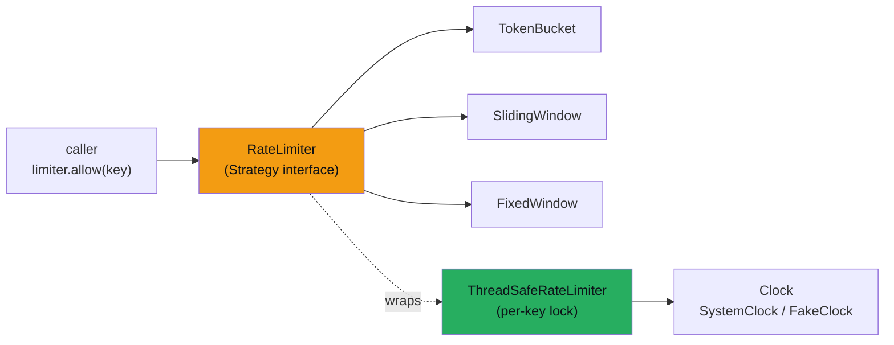
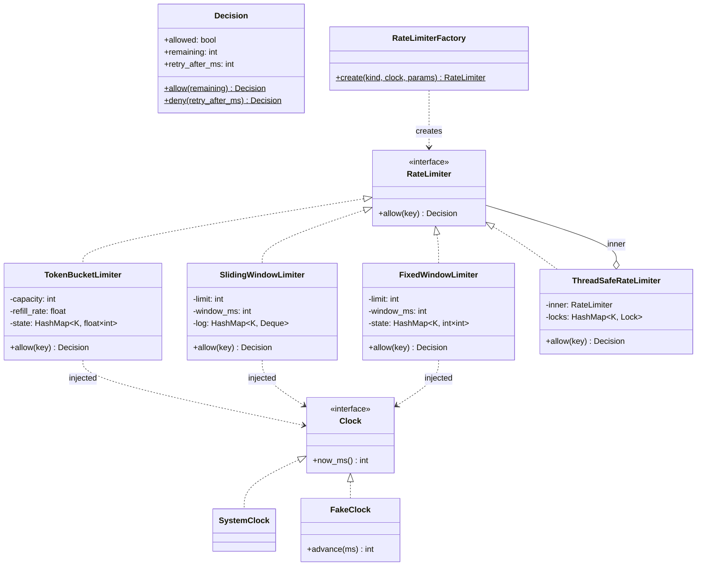

# Rate Limiter (LLD)

> **Companion code:** [`rate_limiter_lld.py`](https://github.com/quanhua92/tutorials/blob/main/lowleveldesign/rate_limiter_lld.py).
> **Captured output:** [`rate_limiter_lld_output.txt`](https://github.com/quanhua92/tutorials/blob/main/lowleveldesign/rate_limiter_lld_output.txt).
> **Live demo:** [`rate_limiter_lld.html`](./rate_limiter_lld.html)

---

## 0. TL;DR — the one idea

> **The analogy:** A rate limiter is a **doorman with three different clipboards**. Every guest hands the
> doorman the same question — "can I go in?" — and the doorman always answers `Decision(allow|deny,
> remaining, retry_after)`. Which clipboard he checks (token bucket, sliding window, fixed window) changes
> the *answer*, never the *question*. Swap clipboards by changing one config line; the guests never notice.

The design hinges on two patterns working together:

- **Strategy** — `RateLimiter` is a one-method interface (`allow(key) -> Decision`). Each algorithm is a
  concrete strategy that plugs in behind that interface. The caller is blind to which one is active.
- **Decorator + Dependency Injection** — `ThreadSafeRateLimiter` *wraps* any `RateLimiter` (it does not
  subclass a specific one) and adds per-key locking. The `Clock` is injected so tests are deterministic
  without `time.sleep()`. Algorithm, storage, and time are three independent axes.



---

## 1. UML Class Diagram

The interface is the anchor. Three algorithms realize it; a decorator wraps *any* of them; a factory
builds them by name. Note the relationships: `ThreadSafeRateLimiter` **aggregates** a `RateLimiter`
(it holds one, Liskov-substitutable), and the concrete limiters **depend on** the injected `Clock`.



**Key relationship to read out loud:**

- The three algorithms each `realize` (`<|..`) the `RateLimiter` interface — that *is* the Strategy pattern.
- `ThreadSafeRateLimiter` also realizes `RateLimiter` (so it is Liskov-substitutable for any of them) **and**
  aggregates one (`o-- inner`). It is a decorator, not a subclass. Locking and algorithm are orthogonal.
- `Clock` is injected into every concrete limiter (`..>` dependency). Swap `SystemClock` for `FakeClock`
  and a flaky, sleep-ridden test suite becomes instant and deterministic.

---

## 2. Implementation

The whole Strategy interface is one method. Every algorithm answers the same question differently. From
[`rate_limiter_lld.py`](https://github.com/quanhua92/tutorials/blob/main/lowleveldesign/rate_limiter_lld.py):

```python
class RateLimiter(ABC):
    @abstractmethod
    def allow(self, key):
        ...

class TokenBucketLimiter(RateLimiter):
    def allow(self, key):
        now = self._clock.now_ms()
        st = self._state.setdefault(key, [float(self.capacity), now])
        elapsed = now - st[1]
        if elapsed > 0:
            st[0] = min(self.capacity, st[0] + elapsed * self.refill_rate / 1000.0)
            st[1] = now
        if st[0] >= 1.0:
            st[0] -= 1.0
            return Decision.allow(int(st[0]))
        return Decision.deny(int((1.0 - st[0]) / self.refill_rate * 1000.0))
```

Captured in [`rate_limiter_lld_output.txt`](https://github.com/quanhua92/tutorials/blob/main/lowleveldesign/rate_limiter_lld_output.txt)
(Section "Token bucket"), the trace at `capacity=3, refill_rate=1/s`:

```
t=0     ms  Decision(allow, remaining=2)      tokens=2.00  (burst #1)
t=0     ms  Decision(allow, remaining=1)      tokens=1.00  (burst #2)
t=0     ms  Decision(allow, remaining=0)      tokens=0.00  (burst #3)
t=0     ms  Decision(DENY, retry_in=1000ms)   tokens=0.00  (burst #4 (bucket empty))
t=500   ms  Decision(DENY, retry_in=500ms)    tokens=0.50  (half a second later)
t=1500  ms  Decision(allow, remaining=0)      tokens=0.50  (one full token refilled)
t=4500  ms  Decision(allow, remaining=2)      tokens=2.00  (long idle -> fully refilled)
```

The same 8-request stream through all three policies (Section "Strategy comparison"):

```
               r1  r2  r3  r4  r5  r6  r7  r8
token_bucket   1   1   1   0   1   1   1   1    7/8
sliding_window 1   1   1   0   0   0   1   1    5/8
fixed_window   1   1   1   0   0   0   1   1    5/8
```

Token bucket is most permissive under spaced load because it refills *continuously*; the window policies
hold the line until the window resets or slides.

---

## 3. SOLID Analysis

| Principle | How the design applies it | Violation smell |
|---|---|---|
| **S**RP | `Decision` only carries a result; each limiter only implements one algorithm; `ThreadSafeRateLimiter` only manages locking; `Clock` only tells time | one class doing algorithm + locking + persistence |
| **O**CP | Add a 4th algorithm (leaky bucket) by writing one class + one factory branch — `RateLimiter`, `Decision`, the decorator, and existing limiters are untouched | a `kind` enum + `if/elif` chain *inside* a god-class `allow()` |
| **L**SP | `ThreadSafeRateLimiter` exposes the exact `allow(key) -> Decision` contract, so it substitutes for any limiter anywhere | a wrapper that changes `allow()` to raise on denial, or drops `remaining` |
| **I**SP | `RateLimiter` is a single-method interface; `Clock` is a single-method interface — no fat interface | forcing every limiter to also implement `peek()`, `reset()`, `stats()` it doesn't need |
| **D**IP | Concrete limiters depend on the `Clock` abstraction, not `time.time()`; the decorator depends on `RateLimiter`, not a concrete bucket | `import time` directly inside `TokenBucketLimiter.allow()` (makes it untestable) |

---

## 4. Tradeoffs — the three algorithms

| Algorithm | Memory / key | Burst behaviour | Exact? | When |
|---|---|---|---|---|
| **Token bucket** | O(1) | configurable burst (`capacity`) + sustained `rate`; idle bucket refills to full | within refill granularity | **default** for API rate limiting (Stripe, AWS API Gateway) |
| **Sliding window log** | O(limit) | exact; no boundary burst | exact | when you must not over-admit, ever, and keys are few |
| **Sliding window counter** | O(1) | interpolated between two fixed windows | ~0.1% error | edge scale (Cloudflare) |
| **Fixed window** | O(1) | **2x burst at the boundary** (see §5) | per-window exact | low-stakes internal metrics only |
| **Leaky bucket** | O(1) | smooths input into a constant output rate | — | protect a *downstream* service, not face clients |

| Choice | Pros | Cons |
|---|---|---|
| **Token bucket** | burst-tolerant; O(1); refills while idle — fits real API traffic | sustained rate is an average, not a hard cap per second |
| **Sliding window log** | provably exact; no boundary exploit | memory grows with limit; expensive at scale |
| **Fixed window** | dead-simple counter; cheapest | the 2x boundary burst is exploitable on security paths |

> **Rule of thumb:** default to **token bucket** for client-facing APIs. Reach for **sliding window**
> (log or counter) on auth/billing paths where over-admission costs money. Reserve **fixed window** for
> cheap internal metrics where a boundary burst is harmless.

---

## 5. The Fixed-Window 2x Boundary Burst

The one experiment every interviewer wants to see. `limit=3, window=5000ms`; `window_id = now // 5000`:

```
window 0 (t=4999): ['allow', 'allow', 'allow']   # counter = 3
window 1 (t=5000): ['allow', 'allow', 'allow']   # counter RESET to 0
total allowed in 1ms straddling the boundary = 6   # 2x the limit!
```

The counter resets the instant `window_id` rolls over, even though the previous window's requests happened
one millisecond ago. An attacker who times the boundary doubles their quota. This is *why* fixed window is
unsafe on security-sensitive endpoints — captured in
[`rate_limiter_lld_output.txt`](https://github.com/quanhua92/tutorials/blob/main/lowleveldesign/rate_limiter_lld_output.txt)
(Section "Fixed window"). Token bucket and sliding window are immune because their budget is continuous.

---

## 6. Concurrency — per-key locking (the E5/E6 deep dive)

| Strategy | Mechanism | When |
|---|---|---|
| **Per-key lock** (this bundle) | one `Lock` per key, created lazily under a registry guard | correctness floor; unrelated keys never contend |
| **Striped locks** | `hash(key) % N` → N locks shared across the key space | production: bounds the lock map at high cardinality |
| **Redis Lua script** | atomic read-modify-write across servers; Redis runs Lua without interleaving | distributed: same correctness across nodes |
| **Global lock** | one `Lock` around `allow()` | never in production — serialises every key, throughput collapse |

The thread-safety section of [`rate_limiter_lld.py`](https://github.com/quanhua92/tutorials/blob/main/lowleveldesign/rate_limiter_lld.py)
runs **200 workers × 5 requests = 1000** against a token bucket of capacity 50 with a frozen clock. Exactly
50 are allowed — the per-key lock makes the read-modify-write atomic, so no over-admission:

```
200 workers x 5 requests = 1000 total
capacity        = 50
allowed (exact) = 50
```

Two production hazards:

- **Read-modify-write race:** thread A reads `tokens=1`, thread B reads `tokens=1`, both decrement, both
  pass — limit bypassed. Fix: the whole read-decide-write must happen inside one lock acquisition (the
  per-key lock). This is the bug the decorator exists to close.
- **Clock skew (distributed):** app-server clocks diverge by 50ms+, so token-bucket refill maths differs
  per node. Mitigation: use Redis `TIME` as the reference clock inside the Lua script, not `time.time()`.

---

## 7. Failure policy — fail-open vs fail-closed

Not deciding *is* a decision: an unhandled store exception produces unpredictable behaviour. Pick
explicitly:

| Policy | On storage error | Use when |
|---|---|---|
| **Fail-open** | `allow` (availability > correctness) | non-critical APIs where a few extra requests are harmless |
| **Fail-closed** | `deny` (correctness > availability) | billing, abuse prevention, auth — an over-admission costs real money |

`RateLimiterFactory.create(...)` throws on an unknown kind rather than silently defaulting — the same
"fail loud, not silent" discipline.

---

## 8. Killer Gotchas

```
1. Hardcoding time.time() inside the algorithm.
   That makes every test flaky and time-dependent, and forces time.sleep() into
   the suite. Inject a Clock (SystemClock in prod, FakeClock in tests). This is
   the single highest-leverage decision in the whole design.

2. A GLOBAL lock around allow().
   Correct, but it serialises EVERY key. Two unrelated API clients block each
   other for no reason. Use PER-KEY locking (or striped locks at scale) so only
   callers hitting the same key contend.

3. Read-modify-write OUTSIDE the lock.
     tokens = state[key]      # thread A reads 1
     ... decide ...           # thread B also reads 1
     state[key] = tokens - 1  # both write 0 -> two requests passed on one token
   The entire read-decide-write must be one atomic unit. That is what
   ThreadSafeRateLimiter's `with self._lock_for(key)` guarantees.

4. Fixed window on a security path.
   The 2x boundary burst (Section 5) is trivially exploitable. Use token bucket
   or sliding window for auth, billing, or abuse endpoints.

5. No failure policy.
   Redis goes down -> unhandled exception -> undefined behaviour. Explicitly
   choose fail-open or fail-closed and wrap the store call.

6. Forgetting retry-after on a DENY.
   The Decision carries retry_after_ms precisely so the client can back off
   intelligently instead of hammering. Compute it; return it; honour it.

7. Subclassing to add locking instead of decorating.
   class ThreadSafeTokenBucket(TokenBucketLimiter) couples the concurrency
   concern to one algorithm. Decorate (hold a RateLimiter) so the lock works
   for ANY present or future algorithm.
```

---

## 9. The gold check (recomputed in JS)

[`rate_limiter_lld.html`](./rate_limiter_lld.html) rebuilds the token-bucket trace in JavaScript —
`capacity=3, refill_rate=1 token/sec` — and recomputes two signatures, comparing against the Python
ground truth in [`rate_limiter_lld.py`](https://github.com/quanhua92/tutorials/blob/main/lowleveldesign/rate_limiter_lld.py)
(`section_gold_check`):

```
tb.allow_flags  = 1,1,1,0,0,1,1    # 1 = allow, 0 = deny, across the 7-step trace
tb.deny_retries = 1000,500         # retry_after_ms for each denial
```

Both must match exactly or the gold badge flips to `[FAIL]`.

---

## 10. Companion files

| File | Role |
|---|---|
| [`rate_limiter_lld.py`](https://github.com/quanhua92/tutorials/blob/main/lowleveldesign/rate_limiter_lld.py) | Ground-truth Strategy + decorator + factory + three algorithms (pure stdlib) |
| [`rate_limiter_lld_output.txt`](https://github.com/quanhua92/tutorials/blob/main/lowleveldesign/rate_limiter_lld_output.txt) | Captured stdout — token-bucket trace, boundary burst, strategy comparison, concurrency |
| [`rate_limiter_lld.html`](./rate_limiter_lld.html) | Interactive playground (send requests → see allow/deny per strategy), strategy comparison, UML |
| [`./index.html`](./index.html) | Low-Level Design dashboard |
