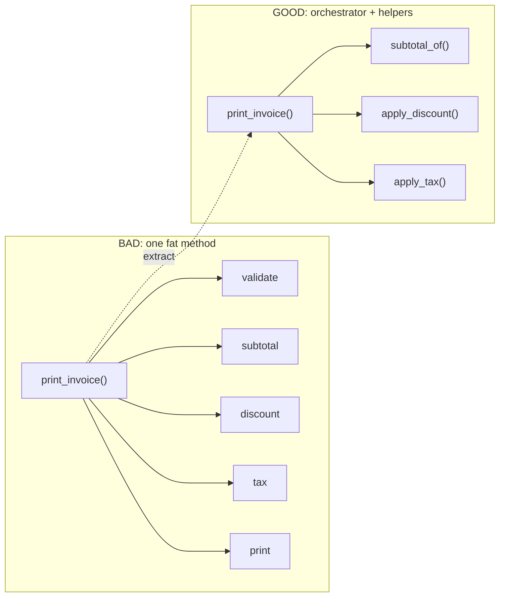
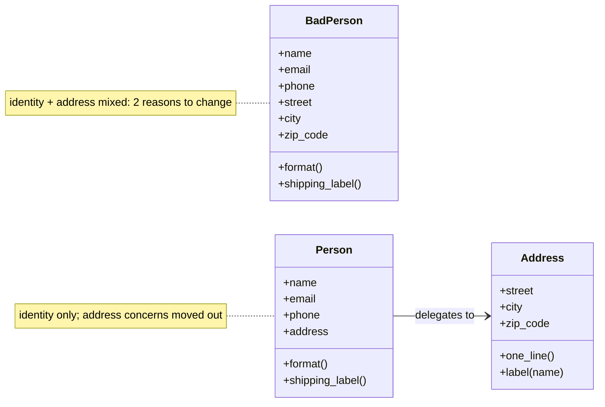
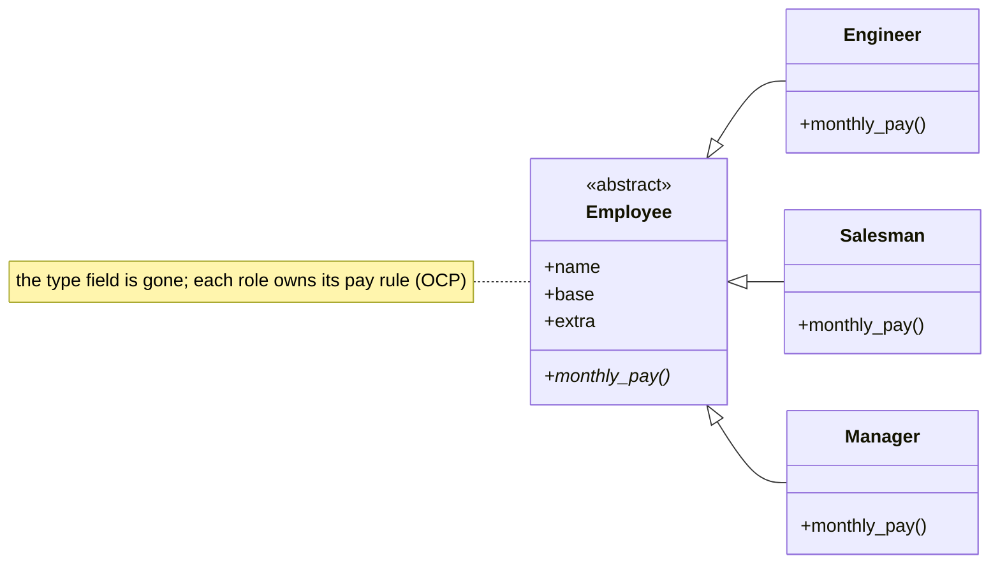

# Refactoring Patterns — Code Smells, Extract Method, Move Method & Polymorphism

> **Companion code:** [`refactoring_patterns.py`](https://github.com/quanhua92/tutorials/blob/main/lowleveldesign/refactoring_patterns.py).
> **Captured output:** [`refactoring_patterns_output.txt`](https://github.com/quanhua92/tutorials/blob/main/lowleveldesign/refactoring_patterns_output.txt).
> **Live demo:** [`refactoring_patterns.html`](https://github.com/quanhua92/tutorials/blob/main/lowleveldesign/refactoring_patterns.html) — paste code into the smell detector, then click a smell to see its before/after diff with a live gold check.
> **Dashboard:** [`./index.html`](./index.html)

---

## 0. TL;DR — the one idea

> **The analogy:** a code smell is a *symptom in the code that something is rotting* — like a
> persistent cough. You don't treat the cough by willpower ("I'll write cleaner code next time");
> you **diagnose the smell, then apply the named refactoring that removes it**. The whole point of
> Fowler's catalog is that refactoring is *mechanical and reversible*: each technique is a small,
> behavior-preserving step with a checklist. **Never refactor without a test that pins behavior
> first** — a refactor that changes output is a bug in a trench coat.

This bundle is the **code-smell → refactoring** map. Every refactor in
[`refactoring_patterns.py`](https://github.com/quanhua92/tutorials/blob/main/lowleveldesign/refactoring_patterns.py)
is **behavior-preserving** — `BAD == GOOD` is asserted for each one, then a green `[check] OK` is
printed, so you can see the smell removed without changing what the code does.

| # | Smell | Refactoring | One-line symptom |
|---|---|---|---|
| 01 | **Long Method** | Extract Method | one 20-line method with comments narrating each block |
| 02 | **Divergent Change / Feature Envy** | Move Method | a method reads 3 fields of another class, 0 of its own |
| 03 | **Switch Statements** | Replace Conditional with Polymorphism | the same `if type == '...'` switch duplicated per method |
| 04 | **Large Class** | Extract Class | one class owns two unrelated responsibilities |
| 05 | **Long Parameter List** | Introduce Parameter Object | 4+ args; callers can't remember which slot is which |

---

## 1. The smell → refactoring map, visualized

### Long Method → Extract Method



### Large Class → Extract Class



### Switch Statements → Replace Conditional with Polymorphism



---

## 2. Implementation map (where each lives in `refactoring_patterns.py`)

All five live in [`refactoring_patterns.py`](https://github.com/quanhua92/tutorials/blob/main/lowleveldesign/refactoring_patterns.py).
Each section prints an `=== ... BAD ===` banner, an `=== ... GOOD ===` banner, the
sample output of both, and finally a `[check] OK` after asserting the two agree.

```
=== 00. CODE SMELLS CATALOG -- the diagnostic table (Fowler) ===
  Long Method          Extract Method                 method > ~20 lines; ...
  ... (8 rows) ...
  [check] OK   catalog: 8 smells mapped to their refactoring technique

=== 01. LONG METHOD -- BAD ===
    SUBTOTAL     500.00
    ...
    TOTAL        486.00
=== 01. LONG METHOD -- GOOD: Extract Method ===
    TOTAL        486.00
  [check] OK   Extract Method preserves total (500 * 0.9 * 1.08 = 486.0)

... (Move Method, Polymorphism, Extract Class, Parameter Object) ...

=== ALL FIVE REFACTORINGS: BAD == GOOD (behavior preserved), refactor safe ===
  [check] OK   refactoring_patterns.py complete
```

Run it yourself:

```bash
python3 refactoring_patterns.py                          # prints all banners + 7 [check] OK lines
python3 refactoring_patterns.py > refactoring_patterns_output.txt 2>/dev/null   # capture
```

---

## 3. The fix for each, in one snippet

### 01 Long Method — Extract Method
```python
def subtotal_of(items):  return sum(i["price"]*i["qty"] for i in items)
def apply_discount(a,d): return a * (1 - d)
def apply_tax(a,t):      return a + a * t

def print_invoice(items, discount, tax_rate):       # orchestrator, reads top-to-bottom
    sub = subtotal_of(items)
    after = apply_discount(sub, discount)
    total = apply_tax(after, tax_rate)
    ...
```

### 02 Divergent Change / Feature Envy — Move Method
```python
# BEFORE: Customer.early_termination_fee(contract) reads 3 fields of contract, 0 of self
# AFTER:  the method moves onto the class it envies; old class delegates
class Contract:
    def early_termination_fee(self):
        return self.months_remaining * self.monthly_fee * (1 - self.discount_rate)

class Customer:
    def early_termination_fee(self, contract): return contract.early_termination_fee()
```

### 03 Switch Statements — Replace Conditional with Polymorphism
```python
class Employee(ABC):
    @abstractmethod
    def monthly_pay(self): ...

class Engineer(Employee):  def monthly_pay(self): return self.base
class Salesman(Employee):  def monthly_pay(self): return self.base + self.extra
class Manager(Employee):   def monthly_pay(self): return self.base + self.extra * 2
# adding a role = a new subclass; the switch is never edited again (Open/Closed)
```

### 04 Large Class — Extract Class
```python
class Address:                       # the extracted class owns address concerns
    def one_line(self): return f"{self.street}, {self.city} {self.zip_code}"
    def label(self, name): ...

class Person:                        # identity only; address delegated
    def format(self):        return f"{self.name} <{self.email}> | {self.address.one_line()}"
    def shipping_label(self):return self.address.label(self.name)
```

### 05 Long Parameter List — Introduce Parameter Object
```python
@dataclass(frozen=True)
class ShippingAddress:  street: str; city: str; zip_code: str   # the 3 address args, grouped

@dataclass(frozen=True)
class OrderRequest:     # 9 positional args collapse to one cohesive value
    user_id: str; cart_id: str; coupon: Optional[str]
    ship_to: ShippingAddress; payment_token: str
    currency: str = "USD"; express: bool = False

def place_order(req: OrderRequest) -> dict: ...    # one arg, named fields, defaults
```

---

## 4. SOLID / principle analysis

| Principle | Smell that violates it | How the refactoring restores it |
|---|---|---|
| **S**RP | Large Class (Person = identity + address) | Extract Class: `Person` for identity, `Address` for postal rules — one reason-to-change each |
| **O**CP | Switch Statements (new role edits the switch) | Polymorphism: a new role is a new subclass, the pay function is never touched |
| **L**SP | Switch Statements (`emp_type` strings) | `Engineer`/`Salesman`/`Manager` are all substitutable for `Employee`; callers don't branch on type |
| **I**SP | Large Class (fat surface) | Each extracted class exposes only the methods its role needs |
| **D**IP | Divergent Change (fee rule wired into Customer) | After Move Method, `Customer` depends on `Contract`'s behavior, not its private fields |
| **DRY** | Switch Statements (same switch per method) | One branch lives in one subclass — the type dispatch is deleted, not duplicated |
| **PIE** / clarity | Long Method, Long Parameter List | Short named methods read as English; a value object names the concept ("OrderRequest") |

---

## 5. Tradeoffs

| Option | Pros | Cons |
|---|---|---|
| Long Method | Everything in one place to read top-to-bottom; no jumps | Hard to name, hard to test a piece, comments paper over missing abstraction |
| Extract Method | Each step named + individually testable; intent surfaces | More functions to navigate; over-extraction fragments a trivial flow |
| Switch on type | Trivial to write for 2 roles; one function to read | Every new role edits N switches; duplicated dispatch is a bug farm |
| Polymorphism | New role = new class (OCP); no duplicated dispatch | Needs a class hierarchy; over-use for 2 cases is enterprise theater |
| Fat class | One object to pass around; no wiring | Merge-conflict magnet; every change risks unrelated regressions |
| Extract Class | Cohesive units; small change radius | Composition root must wire `Person(..., Address(...))`; more types |
| 9-arg function | No extra type to define | Callers guess slot order; adding a param breaks every call site |
| Parameter Object | Named fields, defaults, one arg; add fields freely | A "bag" with no behavior is the same smell in a new container — give it methods |

### Killer Gotchas

- **Tests first, always.** Every refactor above is gated by `assert BAD == GOOD`. If there's no characterization test, write one before touching the code — you cannot safely refactor code whose behavior you can't verify.
- **One refactoring per commit.** Refactoring changes *structure*, not *behavior*. If you rename a method AND fix a bug in the same commit, a regression is unattributable. Rule: structural change and semantic change never share a commit.
- **Extract Method threshold.** Don't extract a 3-line method just to hit a metric. Extract when a block has a *name* (a single intent you can verbalize) — "compute subtotal", "apply discount". If the only name is "do the next 5 lines", leave it.
- **Move Method's tell.** The signal for Move Method is *Feature Envy*: count `other.X` references vs `self.X` in the method. If it mostly talks to another class, it belongs there. But move it *behind a delegating method on the old class* first, so callers don't break — then migrate callers, then drop the delegate.
- **Polymorphism needs a real type axis.** Only replace a switch with subclasses when the type is *stable from the caller's view* (a role, a kind). If the "type" changes every request (a transient flag), polymorphism is the wrong tool — keep the conditional, or use a Strategy object.
- **Extract Class keeps the old API.** The first commit extracts `Address` but `Person` still exposes `street`/`city` as delegating properties. Callers migrate incrementally; only then do you remove the delegates. Big-bang removal breaks everyone at once.
- **Parameter Object must have meaning.** Grouping 4 unrelated args into a `Context` object is the same smell in a new box. The object must name a real concept (`OrderRequest`, `ShippingAddress`) and earn a method or two. A pure field-bag is a smell, not a fix.
- **Behavior preservation is the whole game.** A "cleanup" that changes output is a bug. The `assert BAD == GOOD` lines in the `.py` are the characterization tests — keep them green at every step.

---

## 6. The full smell catalog (Fowler, condensed)

| Smell | Most common fix | Cheap detector |
|---|---|---|
| Long Method | Extract Method | LOC per method > ~20; comments narrate blocks |
| Large Class | Extract Class | methods-per-class > ~7; fields span > 1 responsibility |
| Long Parameter List | Introduce Parameter Object | param count > 3; callers pass the same 3 together |
| Divergent Change | Extract Class / Move Method | one class edited for many unrelated reasons |
| Shotgun Surgery | Move Field / Inline Class | one feature change touches many classes |
| Switch Statements | Replace Conditional w/ Polymorphism | repeated `if type ==` / `switch` across methods |
| Feature Envy | Move Method | method uses another class more than its own |
| Data Clumps | Extract Class / Parameter Object | same N args clumped in many signatures |

Wire the detectors into CI: `pylint --disable=all --enable=too-many-arguments,too-many-locals`,
`radon cc` (cyclomatic complexity), `ruff` `PLR0913` (too-many-arguments), `flake8` `C901`.
The interactive detector in [`refactoring_patterns.html`](https://github.com/quanhua92/tutorials/blob/main/lowleveldesign/refactoring_patterns.html)
applies these heuristics live in your browser.

---

## 7. Interview delivery — name the smell, then the technique

Examiners reward exact vocabulary. When you spot one in your own draft, say so out loud:

- *"That `print_invoice` is a **Long Method** — I'll **Extract Method** into `subtotal_of`, `apply_discount`, `apply_tax`, leaving a one-screen orchestrator."*
- *"This fee method has **Feature Envy** — it reads three `Contract` fields and none of its own. I'll **Move Method** onto `Contract` and have `Customer` delegate, so fee-rule changes stop touching `Customer`."*
- *"This `if emp_type ==` switch is duplicated and will only grow — **Replace Conditional with Polymorphism**: an `Employee` base with `Engineer`/`Salesman`/`Manager` subclasses, each owning its `monthly_pay`. A new role is a new class, never an edit to the switch."*
- *"`Person` mixes identity and address — a **Large Class**. **Extract Class** `Address` for postal concerns; `Person` keeps a reference and delegates `shipping_label`."*
- *"Nine positional args is a **Long Parameter List** — I'll **Introduce Parameter Object** `OrderRequest` (with a nested `ShippingAddress`), so adding a field never breaks a call site."*

End with the staff-level discipline: *"Before any of this, I'd add a characterization test pinning the current output. Every refactoring step is one commit, behavior-preserving, with `assert old == new` green. If a step can't be gated by a test, I won't take it."*

---

## 8. Files in this bundle

| File | Role |
|---|---|
| [`refactoring_patterns.py`](https://github.com/quanhua92/tutorials/blob/main/lowleveldesign/refactoring_patterns.py) | Ground truth — code smells catalog + 5 refactorings, BAD + GOOD, asserted behavior-preserving. Pure stdlib. |
| [`refactoring_patterns_output.txt`](https://github.com/quanhua92/tutorials/blob/main/lowleveldesign/refactoring_patterns_output.txt) | Captured stdout of the run above. |
| [`REFACTORING_PATTERNS.md`](https://github.com/quanhua92/tutorials/blob/main/lowleveldesign/REFACTORING_PATTERNS.md) | This guide — smell catalog, diagrams, SOLID table, tradeoffs, gotchas. |
| [`refactoring_patterns.html`](https://github.com/quanhua92/tutorials/blob/main/lowleveldesign/refactoring_patterns.html) | Interactive smell detector + refactoring playbook with live gold check. Zero deps. |
