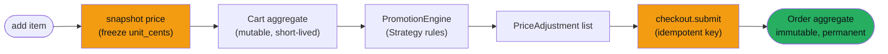
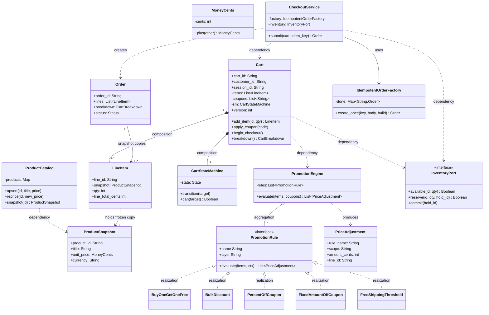
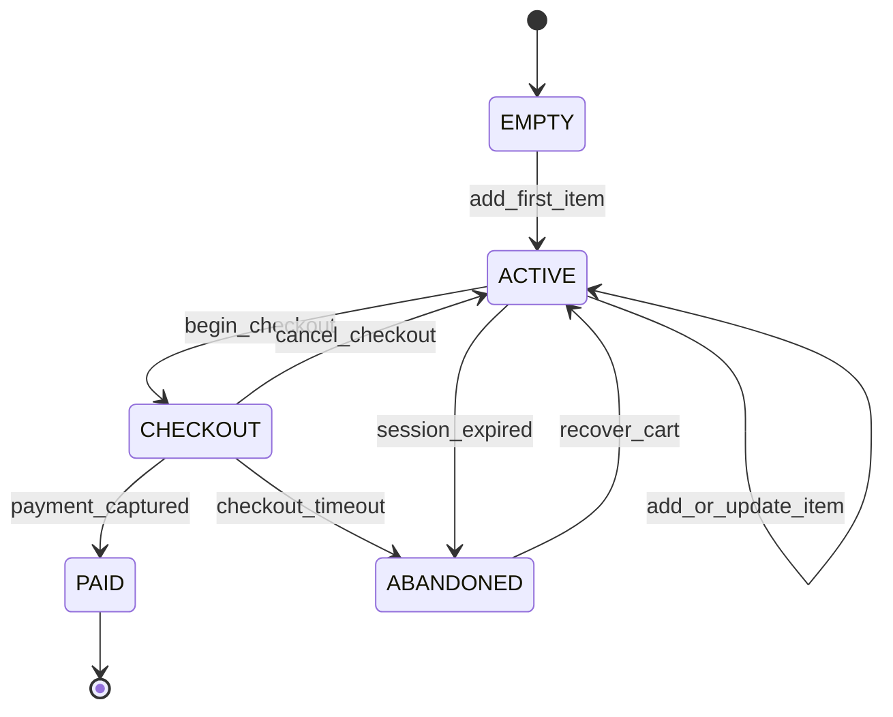
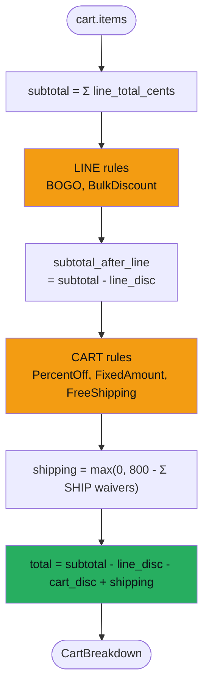
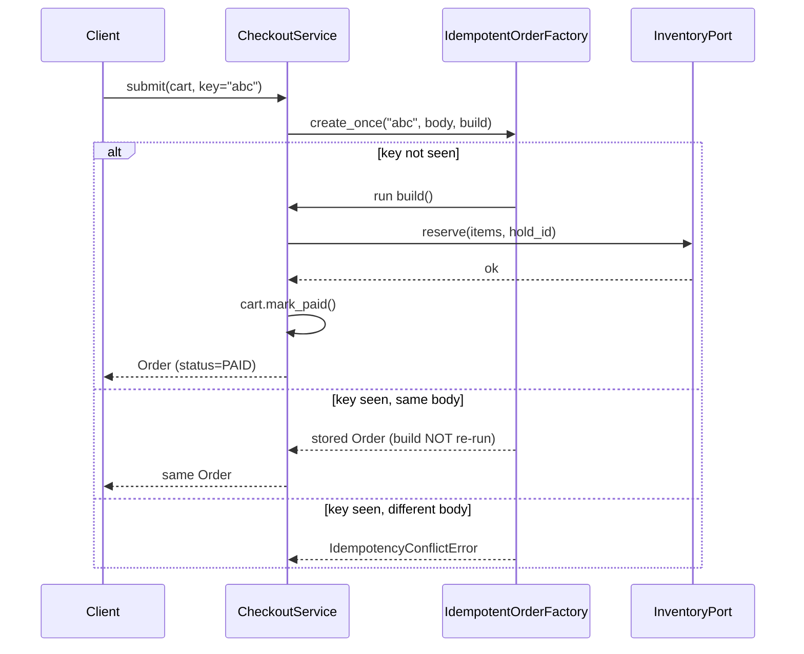

# Shopping Cart & Checkout

> **Companion code:** [`shopping_cart.py`](https://github.com/quanhua92/tutorials/blob/main/lowleveldesign/shopping_cart.py).
> **Captured output:** [`shopping_cart_output.txt`](https://github.com/quanhua92/tutorials/blob/main/lowleveldesign/shopping_cart_output.txt).
> **Live demo:** [`shopping_cart.html`](./shopping_cart.html)

---

## 0. TL;DR — the one idea

> **The analogy:** A shopping cart is a **scratch pad**, an order is a **notarized receipt**. The cart is
> something you doodle on, erase, abandon, and come back to; the order is something your accountant keeps
> forever and never edits. Conflating the two — *"we just mark the cart paid"* — is the single most common
> not-hire answer, because it makes pricing, audits, and retries impossible to reason about.

The second idea, almost as important: **freeze the price when the item enters the cart.** A `LineItem` that
re-fetches the live catalog price at checkout shows the customer a different total than the shelf price they
saw. The `ProductSnapshot` value object captures `unit_price` at add time, so a catalog reprice at 11:59 cannot
retroactively alter a cart built at 11:00 — or rewrite a charge from yesterday.



---

## 1. UML Class Diagram

The design separates **two aggregates** (Cart, Order) and one **rules engine** that the Cart delegates to but
never inspects. Built and priced by `shopping_cart.py` (`build_demo_engine`, `Cart.breakdown`).



### Relationship decisions, verbalized

```
Cart            *--   LineItem        COMPOSITION   a line cannot outlive its cart
LineItem        -->   ProductSnapshot holds a FROZEN price copy (not a live Product ref)
Cart            *--   CartStateMachine the state machine has no meaning outside the cart
Cart            ..>   PromotionEngine  Cart delegates pricing; it knows zero rule mechanics
Engine          o--   PromotionRule    rules are pluggable strategies (Open/Closed)
CheckoutService ..>   InventoryPort    port (interface); swappable adapter for SQL/Redis
CheckoutService ..>   Order            produces an immutable snapshot, never the Cart itself
```

---

## 2. Cart State Machine

The cart owns a small table-driven state machine. Illegal transitions raise
`IllegalTransitionError` (e.g. you cannot add items once checkout has begun, and you cannot pay an empty cart).



| From | Event | To | Guard |
|---|---|---|---|
| `EMPTY` | `add_first_item` | `ACTIVE` | — |
| `ACTIVE` | `add_or_update_item` | `ACTIVE` | inventory advisory passes |
| `ACTIVE` | `begin_checkout` | `CHECKOUT` | cart non-empty |
| `CHECKOUT` | `payment_captured` | `PAID` | reserve + charge succeeded |
| `CHECKOUT` | `cancel_checkout` | `ACTIVE` | — |
| `CHECKOUT` | `checkout_timeout` | `ABANDONED` | TTL elapsed |
| `ACTIVE` | `session_expired` | `ABANDONED` | session TTL elapsed |
| `ABANDONED` | `recover_cart` | `ACTIVE` | user returns |

> Transitions are encoded in `STATE_TRANSITIONS` in `shopping_cart.py`; `CartStateMachine.transition()` is the
> single chokepoint that enforces them.

---

## 3. Pricing Rules Engine — the Strategy family

The engine runs **two layers**, deterministically:

1. **LINE rules** (BOGO, BulkDiscount) — operate on individual lines, independent of each other.
2. **CART rules** (PercentOffCoupon, FixedAmountOffCoupon, FreeShippingThreshold) — operate on the subtotal
   **after** line discounts; every CART rule sees the *same* post-line base (parallel stacking, no cascading).



| Rule | Layer | Scope | Example |
|---|---|---|---|
| `BuyOneGetOneFree` | LINE | one line | USB-CABLE buy1 get1: 4 cables → 2 free → −$20 |
| `BulkDiscount` | LINE | one line | MOUSE ≥2 → 10% off that line |
| `PercentOffCoupon` | CART | whole cart | `SAVE15` → 15% off post-line subtotal |
| `FixedAmountOffCoupon` | CART | whole cart | `WELCOME5` → $5 off (clamped at 0) |
| `FreeShippingThreshold` | CART | shipping | post-line ≥ $150 → waive $8 shipping |

Adding a new rule (e.g. *category percent off*, *bundle deal*) means writing one class that implements
`PromotionRule` and registering it — `Cart` and `PromotionEngine` are untouched. **Open/Closed satisfied.**

### Worked price breakdown (the gold scenario)

From `section_full_scenario` in `shopping_cart.py` — 4 lines, 2 coupons, recomputed identically in
`shopping_cart.html`:

```
MOUSE      x2   = 10000
KEYBOARD   x1   =  7500
USB-CABLE  x4   =  4000
HEADPHONES x1   = 12000
subtotal         = 33500

BOGO(USB-CABLE)        LINE  -2000    (4//2 sets × 1 free × 1000)
BulkDiscount(MOUSE)    LINE  -1000    (10000 × 10%)
                             ──────
after-line             = 30500

Coupon(SAVE15)         CART  -4575    (30500 × 15%)
Coupon(WELCOME5)       CART   -500    (flat, clamped)
FreeShipping(≥150)     SHIP  waive 800 (30500 ≥ 15000)
                             ──────
shipping               =     0
TOTAL                  = 25425   ($254.25)
```

---

## 4. Idempotent Checkout

Mobile clients double-tap. Networks retry. Without an idempotency guard, a single user intent can spawn two
`Order`s and double-charge the card. `IdempotentOrderFactory.create_once(key, body, build)` enforces
**exactly-once** Order creation with **Stripe-style** semantics:

| Call | Result |
|---|---|
| first call with key `K` + body `B` | runs `build()`, stores `K → (B, Order)` |
| repeat call with key `K` + body `B` | returns stored Order (build **not** re-run → no double-reserve, no double-charge) |
| repeat call with key `K` + body `B'` | raises `IdempotencyConflictError` |

The **body** is a fingerprint of the *requested* contents — `(cart_id, items, coupons)` — deliberately
excluding `cart.version`, because `begin_checkout` and `mark_paid` bump the version during the first build and
a genuine retry must hash to the same body to be recognized as a replay. (Optimistic-concurrency versioning is
an *orthogonal* concern, handled by a separate `expected_version` parameter in production.)



---

## 5. SOLID Analysis

| Principle | How the design applies it | Violation smell |
|---|---|---|
| **S**RP | `Cart` aggregates lines; `PromotionEngine` prices; `CheckoutService` orchestrates; `CartStateMachine` guards transitions. Each has one reason to change. | a `Cart.computeDiscounts()` method that hardcodes `if code == 'SAVE15'` |
| **O**CP | New promotion = new `PromotionRule` subclass + register. `Cart`, `Engine`, `CheckoutService` untouched. | a `switch (ruleType)` inside the engine |
| **L**SP | Every `PromotionRule` honours `evaluate(items, ctx) → List[PriceAdjustment]`; every `InventoryPort` honours `available/reserve/commit`. | a rule that returns `None` instead of `[]` |
| **I**SP | `PromotionRule` is a single-method interface; `InventoryPort` exposes only reserve/commit/available — no fat interface. | one `Service` interface mixing pricing + payment + tax + shipping |
| **D**IP | `Cart ..> PromotionEngine` (abstraction), `CheckoutService ..> InventoryPort` (port). Domain depends on interfaces, not concrete adapters. | `Cart` directly constructing `StripePayment` |

---

## 6. Tradeoffs

| Choice | Pros | Cons |
|---|---|---|
| **Cart vs Order as separate aggregates** | auditable; Order is an immutable financial fact; cart edits never rewrite history | two aggregates to persist; checkout must copy line snapshots |
| **ProductSnapshot at add time** | catalog reprices cannot shock the customer; past charges are stable | snapshot can go stale vs catalog; merge-on-login must resolve price conflicts |
| **Integer cents (never float)** | exact arithmetic; no ledger drift; trivial to serialize | must remember to format for display (`fmt()`); no fractional-cent precision |
| **Two-layer engine (LINE then CART)** | deterministic order; every CART rule sees the same base; easy to test | no cascading discounts (a "stacking" promo needs a third layer) |
| **Advisory inventory on add; hard reserve at checkout** | simple; no orphaned holds for most goods; checkout is the single oversell point | rare oversell on flash sales unless checkout holds a row lock |
| **Idempotency by key + body** | exactly-once Order creation; safe under client retries | body must be stable and hashable; key namespace must be unique per tenant |

---

## 7. Killer Gotchas

```
1. "We just mark the cart paid."
   Cart is mutable and short-lived; Order is immutable and permanent.
   Marking a Cart "paid" conflates two aggregates -- not auditable, and
   catalog reprices will rewrite historical charges. Checkout COPIES line
   snapshots into a new Order; the Cart is then discarded.

2. Storing money as float.
   0.10 + 0.20 == 0.30000000000000004 in IEEE-754. Always integer minor
   units (MoneyCents). A BigDecimal or Decimal works too; float never does.

3. Re-fetching live price at checkout.
   LineItem must hold a ProductSnapshot (frozen unit_cents), not a
   product_id that re-queries the catalog. Otherwise the customer sees a
   different total than the shelf price -- disputes and chargebacks.

4. Hardcoding coupon logic inside Cart.
   if coupon_code == 'SAVE15' inside Cart.addCoupon() violates SRP and OCP.
   Each coupon is a PromotionRule strategy; Cart only stores the code and
   delegates pricing to the engine.

5. Forgetting idempotency on submit.
   Mobile double-tap + network retry = two Orders, one double-charged card.
   submit(cart, idempotency_key) must check the key BEFORE any reserve or
   charge. Same key + different body must ERROR (Stripe semantics), not
   silently reuse.

6. Including cart.version in the idempotency body.
   begin_checkout() and mark_paid() bump the version during the first
   build(); a genuine retry then hashes to a different body and is rejected
   as a conflict. The body must capture REQUESTED contents (items + coupons),
   which do not mutate during checkout.

7. No state machine on the cart.
   Without EMPTY -> ACTIVE -> CHECKOUT -> {PAID, ABANDONED} you can "pay"
   an empty cart, add items mid-checkout, or never model abandonment. Every
   mutating method must guard on the current state.

8. Storing PAN/CVV on the Cart.
   PCI violation. The cart holds a PSP token at most; the card never
   touches your domain aggregate.
```

---

## 8. The gold check (recomputed in JS)

`shopping_cart.html` rebuilds the gold scenario in JavaScript and recomputes the breakdown signature and total,
comparing against the Python ground truth:

```
breakdown.signature() = 33500,3000,5075,0,25425   // subtotal,line,cart,ship,total
breakdown.total       = 25425                     // $254.25
```

---

## 9. Companion files

| File | Role |
|---|---|
| [`shopping_cart.py`](https://github.com/quanhua92/tutorials/blob/main/lowleveldesign/shopping_cart.py) | Ground-truth model: Cart aggregate, pricing engine, state machine, idempotent checkout (pure stdlib) |
| [`shopping_cart_output.txt`](https://github.com/quanhua92/tutorials/blob/main/lowleveldesign/shopping_cart_output.txt) | Captured stdout |
| [`shopping_cart.html`](./shopping_cart.html) | Interactive cart simulator + state-machine visualizer + price breakdown |
| [`./index.html`](./index.html) | Low-Level Design dashboard |
