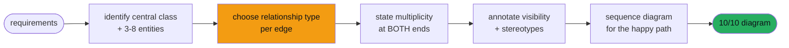
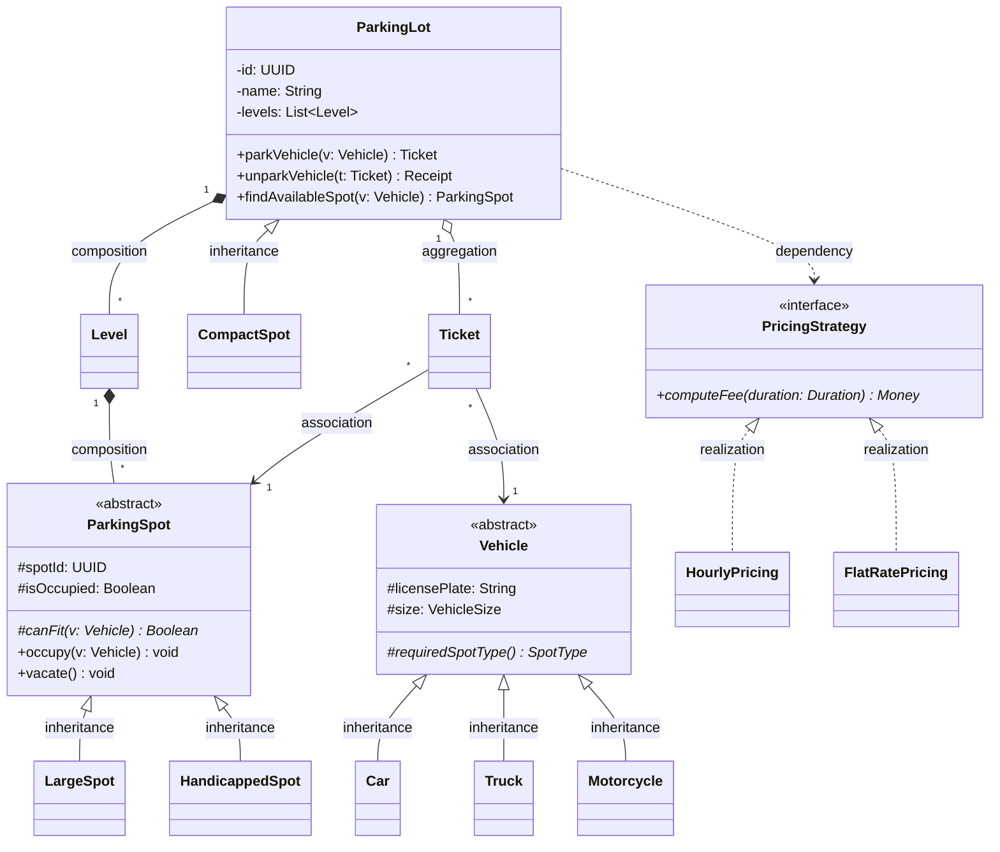
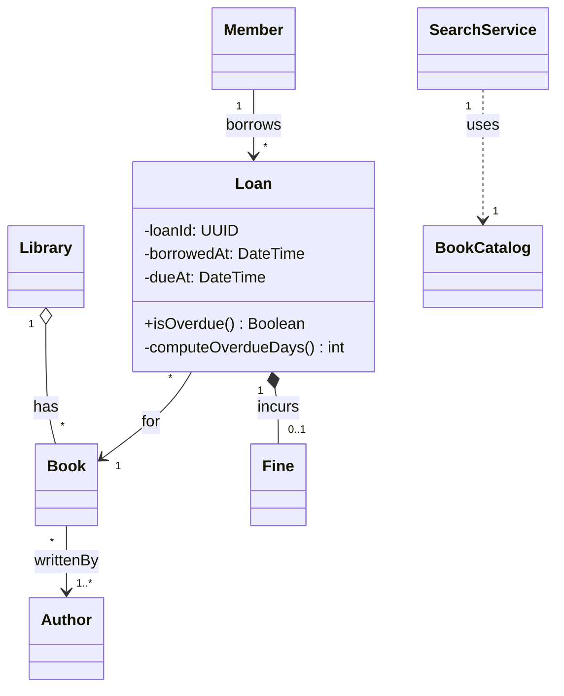

# UML Class Diagrams

> **Companion code:** [`uml_class_diagrams.py`](https://github.com/quanhua92/tutorials/blob/main/lowleveldesign/uml_class_diagrams.py).
> **Captured output:** [`uml_class_diagrams_output.txt`](https://github.com/quanhua92/tutorials/blob/main/lowleveldesign/uml_class_diagrams_output.txt).
> **Live demo:** [`uml_class_diagrams.html`](./uml_class_diagrams.html)

---

## 0. TL;DR — the one idea

> **The analogy:** A class diagram is a **blueprint a staff engineer could build from without asking
> follow-up questions.** It is not art — it is a *contract*. In 30 seconds it tells the reader three
> things words cannot: **who owns whom** (composition vs aggregation), **who knows whom** (dependency
> direction), and **how many of each** (multiplicity). Pick the wrong arrow and you have changed the
> contract by years.

Verbal descriptions break down at the second relationship. By the time you have explained that
*Library* has *Books*, *Members* borrow *Books*, and *Loans* link *Members* to *Books*, the
interviewer has lost the topology. The diagram makes the topology immediate.



---

## 1. Class Anatomy — the Three-Compartment Box

Every class is drawn with three stacked compartments: **name** (centered, bold), **attributes**
(fields), and **operations** (methods). From `uml_class_diagrams.py` (Section "Class anatomy"):

```
+--------------------------------------------+
|                BankAccount                 |   <- name compartment
+--------------------------------------------+
| - accountId: UUID                          |   <- attributes (- private)
| # balance: Decimal                         |      (# protected)
| ~ tag: String                              |      (~ package)
| + routingCode: String {static}             |      (+ public, static)
+--------------------------------------------+
| + deposit(amount: Decimal): void           |   <- methods
| + withdraw(amount: Decimal): Boolean       |
| - reconcile(): void                        |
| + formatIban(raw: String): String {static} |
+--------------------------------------------+
```

### Visibility modifiers

| Symbol | Meaning | Default for |
|---|---|---|
| `+` | public — any class can access | methods you expose |
| `-` | private — only this class | fields |
| `#` | protected — this class + subclasses | shared state |
| `~` | package — same package only | internal collaborators |

A field or method **without** a visibility symbol defaults to package-private in UML, but
interviewers read it as *"candidate didn't bother."* Always annotate.

### Stereotypes: interface vs abstract class

```
+-----------------------------------+        +------------------------+
|           <<interface>>           |        |      <<abstract>>      |
|         PaymentProcessor          |        |        Vehicle         |
+-----------------------------------+        +------------------------+
|                                   |        | # licensePlate: String |
+-----------------------------------+        | # size: VehicleSize    |
| + charge(amount: Money): Boolean* |        +------------------------+
+-----------------------------------+        | + requiredSpotType(): SpotType* |
                                             | + stop(): void                  |
  pure contract — no fields, all              +---------------------------------+
  methods implicitly abstract (*)             shared state + at least one
                                              abstract method (*)
```

- **Interface** (`<<interface>>`) — a pure contract. No fields, no constructors, all methods public
  & abstract. Use when you only have a behavior contract.
- **Abstract class** (`<<abstract>>`) — may hold fields, constructors, and concrete methods, plus
  at least one abstract method (`*`). Use when you have **shared state + partial behavior**.
- **Static** members are underlined on a whiteboard; Mermaid uses the `$` suffix (`+nextId$ int`).

---

## 2. The Six Relationship Types

UML defines exactly six. Picking *composition* when you mean *aggregation* changes the contract by
years — the interviewer is grading this choice directly.

| Relationship | Glyph | Mermaid | Arrow points | When to use | Example |
|---|---|---|---|---|---|
| **Inheritance** | `──◁` | `Parent <\|-- Child` | child → parent | child IS-A parent; reuse fields/methods. Favor composition over inheritance. | `Vehicle <\|-- Car` |
| **Realization** | `┄┄◁` | `Interface <\|.. Class` | implementor → interface | class fulfills an `<<interface>>` contract | `PricingStrategy <\|.. HourlyPricing` |
| **Composition** | `◆──` | `Owner *-- Part` | owner owns part | part **cannot exist** without owner; delete owner → part deleted | `Order *-- OrderItem` |
| **Aggregation** | `◇──` | `Owner o-- Part` | owner has part | part has **independent lifetime**; can move between owners | `Library o-- Book` |
| **Association** | `──▶` | `A --> B` | caller → peer | persistent reference between independent peers; neither owns | `Order --> Customer` |
| **Dependency** | `┄┄▶` | `A ..> B` | caller → callee | **transient** use: parameter, local var, return type. Not stored. | `OrderService ..> Logger` |

### The composition-vs-aggregation test (most-asked question)

> **"If I delete the parent, must the child also be deleted?"**
> **YES → composition** (filled diamond `*--`). **NO → aggregation** (hollow diamond `o--`).

| Whole | Part | Verdict | Why |
|---|---|---|---|
| `Order` | `OrderItem` | **composition** | line items are meaningless once the order is gone |
| `House` | `Room` | **composition** | demolish the house, the rooms cease to exist |
| `Library` | `Book` | **aggregation** | close the library, the books still exist & can move |
| `Team` | `Player` | **aggregation** | a player can transfer to another team |

### Dependency vs association

The test: *would the relationship survive removing all storage of B in A?*
- **Holds B as a field** → association (solid line).
- **Only uses B in one method's parameter / local variable** → dependency (dashed line).

### Arrow-direction gotcha

Inheritance and realization point **child → parent** (the *is-a* direction). In Mermaid the hollow
triangle sits on the parent side, so the **parent is written first**:

```
Parent <|-- Child      // CORRECT  (triangle on Parent)
Child  <|-- Parent     // WRONG    (says "Parent is-a Child" — nonsense)
```

---

## 3. Multiplicity — state it at BOTH ends

Multiplicity tells the reader *how many* objects participate. Without it the diagram is ambiguous
— *"is an empty cart allowed?"*

| Notation | Meaning | Example |
|---|---|---|
| `1` | exactly one (mandatory) | `Order "1" --> "1" Customer` |
| `0..1` | zero or one (optional) | `User "1" --> "0..1" PremiumSubscription` |
| `*` | zero or more | `Customer "1" --> "*" Order` |
| `1..*` | one or more (at least one) | `Order "1" *-- "1..*" OrderItem` |
| `n..m` | between n and m | `Team "1" --> "5..15" Player` |

Read `Customer "1" --> "*" Order` as *"one customer has many orders; each order belongs to exactly
one customer."* Multiplicity goes in quotes adjacent to the line at **both** ends.

---

## 4. Worked Example — Parking Lot System

A complete 14-class diagram mixing all six relationship types. Built and rendered by
`uml_class_diagrams.py` (`build_parking_lot`); coupling score **56**, density **4.0**.



**Relationship decisions, verbalized:**

```
ParkingLot  *--  Level          COMPOSITION   levels cannot exist without the lot
Level       *--  ParkingSpot    COMPOSITION   spots are built into the level
xSpot       --<  ParkingSpot    INHERITANCE   each subtype overrides canFit()
Car         --<  Vehicle        INHERITANCE   vehicles share plate + size
ParkingLot  o--  Ticket         AGGREGATION   tickets outlive a restart / are archived
Ticket      -->  Vehicle        ASSOCIATION   ticket holds a persistent vehicle ref
ParkingLot  ..>  PricingStrategy DEPENDENCY   strategy injected per call, not stored
HourlyPricing ..< PricingStrategy REALIZATION implements the fee contract
```

> Full Mermaid source (75 lines) is generated by `uml_class_diagrams.py` → `diagram.mermaid()`;
> see `uml_class_diagrams_output.txt`.

---

## 5. Worked Example — Library (composition vs aggregation in focus)

The library system isolates the single most-tested distinction. Built by `build_library`;
coupling score **15**, density **1.9** (looser than parking lot — mostly associations).



**The lifetime arguments (say these OUT LOUD):**

- `Library o-- Book` → **aggregation** — *"closing the library does not burn the books; they can
  move to another branch."*
- `Loan *-- Fine` → **composition** — *"a Fine cannot exist without the Loan that created it;
  delete the loan, the fine is meaningless."*
- `SearchService ..> BookCatalog` → **dependency** — *"the catalog is passed in as a method
  parameter; it is not stored as a field."*

---

## 6. SOLID Analysis

| Principle | How the diagram applies it | Violation smell in the diagram |
|---|---|---|
| **S**RP | Each class owns one responsibility ( ParkingLot orchestrates, Ticket records, PricingStrategy prices) | A god-class with 15+ methods spanning concerns |
| **O**CP | New spot/vehicle types added via inheritance without touching `ParkingLot` | switches on `instanceof` instead of polymorphism |
| **L**SP | Every `ParkingSpot` subtype honors `canFit()`; `Car`/`Truck` honor `requiredSpotType()` | a subtype throws `NotSupported` for an inherited method |
| **I**SP | `PricingStrategy` is a single-method interface; no fat interface | one interface mixing `charge` + `refund` + `report` |
| **D**IP | `ParkingLot ..> PricingStrategy` (depends on abstraction, not `HourlyPricing`) | `ParkingLot` directly composing a concrete pricing class |

---

## 7. Tradeoffs

| Choice | Pros | Cons |
|---|---|---|
| **Inheritance** | reuse fields + methods; polymorphism for free | tightest coupling (5/5); breaks if parent changes; favor composition |
| **Composition over inheritance** | looser coupling; swap parts at runtime; no fragile-base-class | more boilerplate (delegate calls) |
| **Interface + realization** | pure contract; multiple realization; mockable | no shared code (use an abstract class if state is shared) |
| **Aggregation over composition** | parts are reusable/transferable across owners | owner cannot guarantee part lifecycle |
| **Dependency over association** | weakest link; easy to test (inject anything) | caller must obtain the callee each call |

---

## 8. Killer Gotchas

```
1. Drawing inheritance arrows BACKWARDS.
   The arrow points CHILD -> PARENT (the is-a direction). Mermaid puts the
   parent first because the triangle is on its side:  Parent <|-- Child.
   Reversing it says "Animal is-a Dog" -- nonsense.

2. Confusing composition with aggregation.
   Filled diamond (*--) => part dies with the whole.
   Hollow diamond (o--) => part survives. The verbal test: "if I delete the
   parent, must the child also be deleted?" Library/Book = aggregation.

3. Diamond on the WRONG end.
   The diamond sits on the OWNER's side, not the part's side.
   Order *-- OrderItem  => diamond on Order. Put it on Item and you have
   said "the item owns the order."

4. Forgetting visibility modifiers.
   A bare field defaults to package-private, but interviewers read it as
   "didn't bother." Default fields to '-' private, methods to '+' public.

5. Omitting multiplicity.
   Order *-- OrderItem  is ambiguous (empty cart allowed?). State it:
   Order "1" *-- "1..*" OrderItem  => an order MUST have >= 1 item.

6. Treating interfaces like classes.
   Without <<interface>> (and the dashed <|.. realization arrow) an
   interface looks identical to a concrete class. Always add the stereotype.

7. Mixing up dependency and association.
   Stored as a field => association (solid). Used only in one method's
   parameter / local var => dependency (dashed). Removing all storage of B
   in A and the link survives => dependency.
```

---

## 9. The gold check (recomputed in JS)

`uml_class_diagrams.html` rebuilds the parking-lot diagram in JavaScript and recomputes the
relationship-type-count signature and coupling density, comparing against the Python ground truth:

```
parking_lot.signature()         = 6,2,2,1,2,1   // [inheritance,realization,
                                                 //  composition,aggregation,
                                                 //  association,dependency]
parking_lot.coupling_density()  = 4.0            // score 56 / classes 14
```

---

## 10. Companion files

| File | Role |
|---|---|
| [`uml_class_diagrams.py`](https://github.com/quanhua92/tutorials/blob/main/lowleveldesign/uml_class_diagrams.py) | Ground-truth UML model + ASCII/Mermaid renderer (pure stdlib) |
| [`uml_class_diagrams_output.txt`](https://github.com/quanhua92/tutorials/blob/main/lowleveldesign/uml_class_diagrams_output.txt) | Captured stdout |
| [`uml_class_diagrams.html`](./uml_class_diagrams.html) | Interactive UML builder + relationship explainer |
| [`./index.html`](./index.html) | Low-Level Design dashboard |
