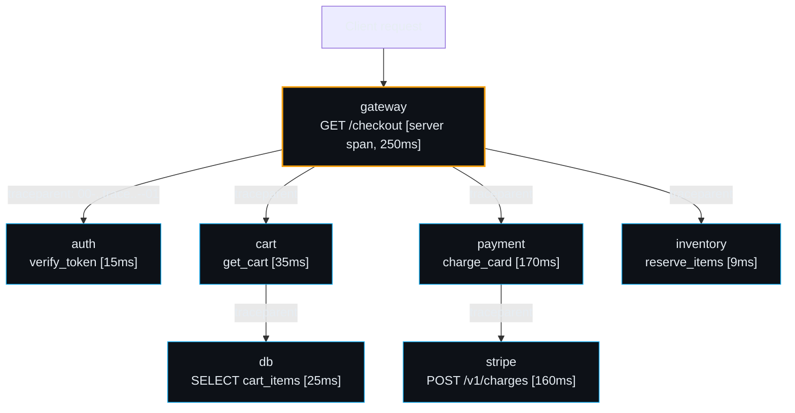
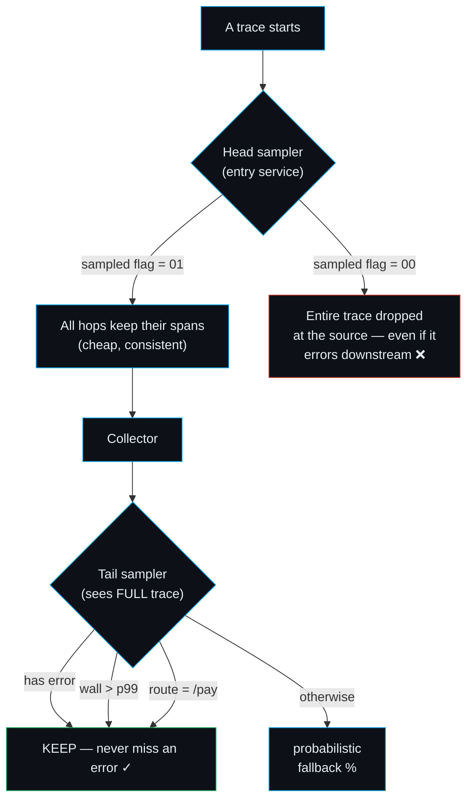
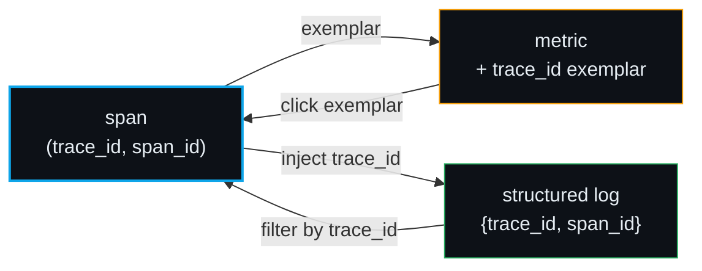

# Distributed Tracing — Day 0 to Production

> **Companion:** [distributed_tracing.py](https://github.com/quanhua92/tutorials/blob/main/observability/distributed_tracing.py) ·
> **Live:** [distributed_tracing.html](./distributed_tracing.html) ·
> **Bundle #03** of the [observability](./index.html) suite
>
> **Run it:** `python3 distributed_tracing.py` — pure stdlib, seeded RNG, 26 `[check] OK`.

## 0. TL;DR

A **trace** is a tree of **spans**. Each span is one unit of work in one service.
Spans are stitched into a tree with `parent_span_id`, and the whole tree is tied
together by one shared `trace_id`. To keep that id flowing across service
boundaries you **propagate context** in HTTP/gRPC headers — W3C `traceparent` is
the modern standard. You can't store 100% of traces, so you **sample**:
**head-based** decides cheaply at the entry point (blind to the outcome);
**tail-based** decides at the collector after seeing the full trace (can rescue
every error). The payoff is **trace-to-log correlation**: inject `trace_id` into
structured logs so one click takes you from a slow span to every log line that
request produced.

> **PINNED gold value** (recomputed identically in `.py`, `.md`, and `.html`):
> `P(capture ≥1 error in 100 occurrences at 1% sampling) = 0.6339676587` — i.e.
> at 1% head sampling you only have a **63.4%** chance of ever seeing a given
> error that recurs 100 times. That single number is why tail sampling exists.

---

## 1. Architecture — the trace tree, end to end



Every arrow carries the **same `trace_id`** and a **fresh `span_id`** (the id of
the *child's* span). The `parent_span_id` on the child points back at the
parent's span, which is what lets the collector rebuild this exact tree no matter
what order the spans arrive.

---

## 2. The span / trace data model

A span is the atomic unit. A trace is the tree.

| Field | What it is | Example |
|---|---|---|
| `trace_id` | 16 bytes / 32 hex; **identical** for every span in a trace | `ff778740f88ddcf102aeb81daee289c0` |
| `span_id` | 8 bytes / 16 hex; unique per span | `7400f4b8e0b843f8` |
| `parent_span_id` | the span that called this one; `None` for the root | `44c4a4571c4b6f28` |
| `operation` / `service` | what + where | `verify_token` / `auth` |
| `start_ms` / `duration_ms` | timing (start relative to root) | `5` / `15` |
| `status` | `OK` or `ERROR` | `ERROR` |
| `kind` | `server` / `client` / `internal` | `server` |
| `attributes` | free-form key/value (http, db, error…) | `{"db.system":"postgres"}` |

> From `distributed_tracing.py` Section A — the seeded checkout trace:
> ```
>   trace_id = ff778740f88ddcf102aeb81daee289c0  (32 hex chars = 16 bytes)
>   7 spans across services: auth,cart,db,gateway,inventory,payment,stripe
> 
>   service    operation          span      parent    start  dur   end status
>   -------------------------------------------------------------------------
>   gateway    GET /checkout      44c4a457  (root)        0  250   250 OK    
>   auth       verify_token       7400f4b8  44c4a457      5   15    20 OK    
>   cart       get_cart           80c32d81  44c4a457     25   35    60 OK    
>   db         SELECT cart_items  4cd7a381  80c32d81     30   25    55 OK    
>   payment    charge_card        c3298af4  44c4a457     65  170   235 OK    
>   stripe     POST /v1/charges   0099527d  c3298af4     70  160   230 OK    
>   inventory  reserve_items      e0fcd4ce  44c4a457    236    9   245 OK    
> [check] trace_id is 32 hex chars: OK
> [check] all spans share the trace_id: OK
> [check] exactly one root span (parent_span_id is None): OK
> ```

**Reconstruction is order-independent:** the collector groups spans by
`trace_id`, then builds the tree purely from `parent_span_id` links — arriving
spans can come in any order, from any service, over any time window.

> From Section C — the rebuilt tree:
> ```
>   gateway.GET /checkout  [250ms, OK]  span=44c4a457
>       ├─ auth.verify_token  [15ms, OK]  span=7400f4b8
>       ├─ cart.get_cart  [35ms, OK]  span=80c32d81
>       │   └─ db.SELECT cart_items  [25ms, OK]  span=4cd7a381
>       ├─ payment.charge_card  [170ms, OK]  span=c3298af4
>       │   └─ stripe.POST /v1/charges  [160ms, OK]  span=0099527d
>       └─ inventory.reserve_items  [9ms, OK]  span=e0fcd4ce
> [check] reconstruction is order-independent: OK
> [check] tree has a single root: OK
> [check] parent_span_id edges == 6: OK
> ```

---

## 3. Day 0 — Context propagation: keep the `trace_id` alive

Without propagation a trace shatters into disconnected spans the moment it
crosses a process boundary. Propagation = **inject** the context into outgoing
headers on the sender, **extract** it on the receiver. The format you pick must
match on both ends.

### The three formats

| Format | Header shape | Sampled bit | Status |
|---|---|---|---|
| **W3C Trace Context** | `traceparent: 00-<trace-id:32>-<span-id:16>-<flags:2>` | `flags` LSB (`01`/`00`) | **Default in OpenTelemetry; the standard.** |
| **B3 (Zipkin)** | `X-B3-TraceId` / `X-B3-SpanId` / `X-B3-ParentSpanId` / `X-B3-Sampled` (or single `b3:` header) | `X-B3-Sampled: 1\|0` | Legacy; still common in Istio/Envoy. |
| **Jaeger** | `uber-trace-id: <trace-id>:<span-id>:<parent-span-id>:<flags>` | `flags` bit 0 | Native to Jaeger clients. |

### W3C `traceparent`, field by field

```
traceparent: 00-4bf92f3577b34da6a3ce929d0e0e4736-00f067aa0ba902b7-01
             ^^ ^^^^^^^^^^^^^^^^^^^^^^^^^^^^^^^^ ^^^^^^^^^^^^^^^^^ ^^
             |  trace-id (16 bytes / 32 hex)    parent-id/span-id  trace-flags
             version=00                                             (LSB = sampled)
```

- **version** `00` — current spec; `ff` reserved as invalid.
- **trace-id** — 32 lowercase hex; **constant** for the whole trace, globally
  unique, randomly generated.
- **parent-id** (a.k.a. current span-id on this hop) — 16 hex; **regenerated at
  every service boundary**; the trace-id stays put.
- **trace-flags** — 8-bit; only bit 0 is defined today: `01` = sampled, `00` =
  not sampled.

> From Section B — decode of the documented example + a real gateway→auth hop:
> ```
>   Gateway -> Auth hop (sampled=True):
>     outgoing W3C traceparent:
>       00-ff778740f88ddcf102aeb81daee289c0-7400f4b8e0b843f8-01
>     outgoing B3 headers:
>       X-B3-TraceId: ff778740f88ddcf102aeb81daee289c0
>       X-B3-SpanId: 7400f4b8e0b843f8
>       X-B3-Sampled: 1
>       X-B3-ParentSpanId: 44c4a4571c4b6f28
>     outgoing B3 single-header:
>       b3: ff778740f88ddcf102aeb81daee289c0-7400f4b8e0b843f8-1
>     outgoing Jaeger uber-trace-id:
>       uber-trace-id: ff778740f88ddcf102aeb81daee289c0:7400f4b8e0b843f8:44c4a4571c4b6f28:03
> 
>   W3C decode of the documented example:
>     00-4bf92f3577b34da6a3ce929d0e0e4736-00f067aa0ba902b7-01
>       version   = 00
>       trace_id  = 4bf92f3577b34da6a3ce929d0e0e4736
>       span_id   = 00f067aa0ba902b7
>       sampled   = True
> [check] W3C encode->decode round-trips trace_id: OK
> [check] W3C decode sampled bit (01 -> True): OK
> [check] B3 single-header carries trace-id: OK
> [check] Jaeger round-trips trace_id: OK
> [check] Jaeger sampled bit (flags & 1): OK
> [check] W3C trace_id field == 32 hex: OK
> [check] W3C span_id field == 16 hex: OK
> ```

**Rule of thumb:** default to W3C everywhere. Only enable B3/Jaeger propagation
when you must talk to a legacy hop (old Istio, Zipkin-only service, etc.). Mixing
propagators blindly is the #1 cause of broken traces.

---

## 4. Day 1 — Sampling: you can't (and shouldn't) keep everything

A 20-service system at 10k req/s produces ~200k spans/s ≈ 17 TB/day uncompressed.
Sampling decides what survives. The **where** you decide matters more than the
**rate**.

### Head-based vs tail-based — the decision tree



| | **Head-based** | **Tail-based** |
|---|---|---|
| Decides | at the entry service, **before** spans exist | at the collector, **after** the full trace is assembled |
| Cost | ~free; one RNG/hash lookup | buffers spans; needs memory + a wait window |
| Sees the outcome? | **No** — blind to errors/latency | **Yes** — can keep every error/slow trace |
| Consistency | whole trace kept or dropped as a unit (decision in the header) | needs **trace-id-hash load balancing** so all spans hit the same collector |
| OTel default | `parentbased_traceidratio` (yes) | `tailsamplingprocessor` in the collector |
| Best for | baseline cost control | rescuing the rare-but-important traces |

> From Section D — head sampling is deterministic by trace-id and propagates:
> ```
>   Decision made ONCE at the entry service using TraceIdRatio.
>   Encoded into trace-flags; every downstream service obeys it, so a
>   trace is kept or dropped as a whole unit.
> 
>   rate=100.0%  -> kept 12/12 of demo trace-ids
>   rate= 10.0%  -> kept 1/12 of demo trace-ids
>   rate=  1.0%  -> kept 0/12 of demo trace-ids
> [check] same trace-id yields identical decision at every hop: OK
> [check] rate=100% keeps everything: OK
> [check] rate=0% keeps nothing: OK
> ```

> From Section E — tail sampling rescues what head sampling can't:
> ```
>   The collector buffers ALL spans, groups by trace_id, rebuilds the
>   trace, THEN decides. It can keep every trace that errored or was
>   slow -- exactly what head sampling CANNOT do.
> 
>   OK   trace: wall=250ms error=False -> keep=True
>   ERROR trace: wall=250ms error=True -> keep=True
> [check] tail keeps the error trace: OK
> [check] tail may drop a fast clean trace (slow_ms=9999): OK
> ```

**Production recipe:** head-sample at ~10–20% in the SDK to cut noise at the
source, then tail-sample at the collector with always-keep rules for errors,
p99+ latency, and critical routes. Get the best of both.

---

## 5. Day 1 — Sampling rate math (the part that bites)

At sampling rate `p`, an event that occurs `K` times is captured **at least
once** with probability:

```
P(capture ≥ 1) = 1 − (1 − p)^K
```

> From Section F — empirical + closed-form:
> ```
>   Empirical batch: 2000 traces, 4 with errors
> 
>      rate   kept  err_kept  err_lost
>    100.0%   2000         4         0
>     10.0%    185         0         4
>      1.0%     12         0         4
> 
>   Closed form: P(capture >=1 in K occurrences) = 1 - (1-rate)^K
>     rate=1%  K=  1  ->  P=  1.000%
>     rate=1%  K= 10  ->  P=  9.562%
>     rate=1%  K= 50  ->  P= 39.499%
>     rate=1%  K=100  ->  P= 63.397%
>     rate=1%  K=459  ->  P= 99.008%
> 
>   PINNED gold value: P(1%, K=100) = 0.6339676587
>   Occurrences needed for 99% capture at 1% rate: K = 459
> [check] P(1%,100) == 1 - 0.99**100: OK
> [check] at 1% you need >=458 occurrences for 99% capture: OK
> [check] 1% sampling drops ~99% of traces: OK
> ```

**Read this twice:** at **1%** head sampling, an error that happens **100 times**
is seen only **63.4%** of the time. You need the error to recur **459 times**
before you're 99% sure head sampling ever caught it. This is *the* reason
tail-based sampling exists for errors.

---

## 6. Day 1 — Trace ↔ log ↔ metric correlation

The three pillars are useless in isolation. The glue is the **`trace_id`** (and
`span_id`) stamped onto every signal:



Inject `trace_id`/`span_id` into every structured (JSON) log line. Then a single
`WHERE trace_id = '…'` query returns every log the request produced — the bridge
from "this span was slow" to "here's the error text that caused it".

> From Section G — structured JSON logs carrying the trace context:
> ```
>   {"level": "INFO", "msg": "handling GET /checkout", "service": "gateway", "span_id": "44c4a4571c4b6f28", "trace_id": "ff778740f88ddcf102aeb81daee289c0", "ts_ms": 0}
>   {"level": "INFO", "msg": "handling verify_token", "service": "auth", "span_id": "7400f4b8e0b843f8", "trace_id": "ff778740f88ddcf102aeb81daee289c0", "ts_ms": 5}
>   {"level": "INFO", "msg": "handling get_cart", "service": "cart", "span_id": "80c32d81e91bdea0", "trace_id": "ff778740f88ddcf102aeb81daee289c0", "ts_ms": 25}
>   {"level": "INFO", "msg": "handling SELECT cart_items", "service": "db", "span_id": "4cd7a3819b32275f", "trace_id": "ff778740f88ddcf102aeb81daee289c0", "ts_ms": 30}
>   {"level": "INFO", "msg": "handling charge_card", "service": "payment", "span_id": "c3298af4c7ec87eb", "trace_id": "ff778740f88ddcf102aeb81daee289c0", "ts_ms": 65}
>   {"level": "INFO", "msg": "handling POST /v1/charges", "service": "stripe", "span_id": "0099527d041ced5c", "trace_id": "ff778740f88ddcf102aeb81daee289c0", "ts_ms": 70}
>   {"level": "INFO", "msg": "handling reserve_items", "service": "inventory", "span_id": "e0fcd4ce4e3d0e3d", "trace_id": "ff778740f88ddcf102aeb81daee289c0", "ts_ms": 236}
> 
>   Query: pull every log for THIS request by trace_id:
>     -> 7/7 logs matched
> [check] every log carries the trace_id: OK
> ```

---

## 7. Day 2 — Critical path analysis

End-to-end latency is set by the **critical path**: the chain of spans whose
sequential duration the root actually waited on. Heuristic used here: from the
root, descend into the **child with the largest duration** at each step (the
bottleneck call). That's where you optimize first.

> From Section H — the checkout trace's critical path:
> ```
>         gateway.GET /checkout  [250ms]  44c4a457
>     -> payment.charge_card  [170ms]  c3298af4
>     -> stripe.POST /v1/charges  [160ms]  0099527d
> 
>   chain length: 3 spans
>   sum of durations on path: 580ms
>   root span wall-clock:      250ms
>   (sum >= wall because the path's spans are nested, not additive;
>    the leaf duration is what the root actually waited on.)
> [check] critical path starts at the root: OK
> [check] critical path reaches a leaf (no children): OK
> [check] bottleneck chain is gateway->payment->stripe: OK
> ```

The gateway's 250 ms is dominated by the `payment → stripe` chain (160 ms of it
is the external Stripe call). Cutting that one hop is the highest-leverage fix.

---

## 8. Killer Gotchas

| Trap | Symptom | Fix |
|---|---|---|
| **Propagation broken at one hop** | Trace splits into 2+ disconnected fragments; "missing" spans | Default to W3C `traceparent` everywhere; explicitly inject on async/message-queue hops (carry context in the payload). |
| **Mismatched propagators** | Works A→B but breaks B→C; `traceparent` and `X-B3-*` disagree | Configure **one** propagator (or `TraceContext+Baggage+B3` multi-extract); never mix blindly across the call chain. |
| **Head sampling at low rates** | Errors and p99 latency traces silently dropped — "we never caught it" | Keep head at ≥10%, **always** add a tail sampler with `status_code=ERROR` + latency rules. |
| **Tail sampler without trace-id routing** | A trace's spans land on different collectors; never assembled → dropped | Put a **hash-on-trace-id** load balancer in front of the collector pool. |
| **Clock skew across hosts** | Child span "starts before" parent; waterfall looks broken / negative gaps | Use `start_ms` relative to root span start (as here); sync clocks (NTP/PTP); trust span durations, not absolute timestamps. |
| **No `trace_id` in logs** | Can't pivot from a slow span to the error log line | Inject `trace_id`/`span_id` into structured logs (JSON) via the logging MDC/context. |
| **High-cardinality span attributes** | Trace index explodes; storage/query cost balloons | Keep span attributes low-cardinality (service, operation, status); push detail into events/logs, not indexed tags. |
| **Sampling `tracestate` ignored** | Vendor migration loses traces; debug flag dropped | Forward `tracestate` unchanged; only mutate your own entry, move it to the front. |
| **`decision_wait` too short** | Tail sampler drops incomplete long traces (slow upstream calls) | Raise `decision_wait` above your p99 trace duration; monitor dropped/incomplete counts. |

---

## 9. Cheat Sheet

```python
# W3C traceparent — encode / decode
def encode_w3c(trace_id, span_id, sampled):
    return f"00-{trace_id}-{span_id}-{'01' if sampled else '00'}"

def decode_w3c(tp):
    ver, trace_id, span_id, flags = tp.split("-")
    return trace_id, span_id, (int(flags,16) & 1) == 1

# Head sampling (deterministic by trace-id; same decision everywhere)
def head_sample(trace_id, rate):
    return int(trace_id,16) < rate * (1 << 128)

# Tail sampling (decided at the collector after the full trace)
def tail_sample(spans, slow_ms=150):
    wall = max(s.end_ms() for s in spans) - min(s.start_ms for s in spans)
    return any(s.status == "ERROR" for s in spans) or wall >= slow_ms

# Capture probability math
def P(rate, k):            # P(capture >= 1 in k occurrences)
    return 1 - (1 - rate) ** k
# P(0.01, 100) == 0.6339676587   (the gold value)

# Critical path: descend into the heaviest child each step
def critical_path(root, children):
    path, node = [root], root
    while children.get(node.span_id):
        node = max(children[node.span_id], key=lambda c: c.duration_ms)
        path.append(node)
    return path
```

**Pinned anchors to remember:**
- W3C example: `00-4bf92f3577b34da6a3ce929d0e0e4736-00f067aa0ba902b7-01`
- Gold math: `P(1%, 100) = 0.6339676587`; need **459** occurrences for 99% capture.
- Trace = one `trace_id`; spans linked by `parent_span_id`; exactly one root.

---

🔗 [OPENTELEMETRY](./OPENTELEMETRY.md) — OTel is *how* you produce these spans
and propagate W3C context in real code (API/SDK/Collector, OTLP). This bundle is
the *model*; that one is the *machinery*.

🔗 [OBSERVABILITY_FUNDAMENTALS](./OBSERVABILITY_FUNDAMENTALS.md) — traces are one
of the three pillars; trace-to-log correlation here is the concrete instance of
"the pillars must cross-reference" from that bundle.

## Sources

- W3C Trace Context (spec): https://www.w3.org/TR/trace-context/
- OpenTelemetry — Context Propagation: https://opentelemetry.io/docs/concepts/context-propagation/
- OpenTelemetry — Sampling: https://opentelemetry.io/docs/concepts/sampling/
- Dash0 — W3C Trace Context Explained (traceparent & tracestate field breakdown): https://www.dash0.com/knowledge/w3c-trace-context-traceparent-tracestate
- Datadog — Trace Context Propagation (Datadog/B3/W3C extraction & injection): https://docs.datadoghq.com/tracing/trace_collection/trace_context_propagation/
- Codelit — Distributed Tracing Sampling Strategies (head vs tail vs adaptive): https://codelit.io/blog/distributed-tracing-sampling
- OpenTelemetry Collector — Tail Sampling Processor: https://github.com/open-telemetry/opentelemetry-collector-contrib/tree/main/processor/tailsamplingprocessor
