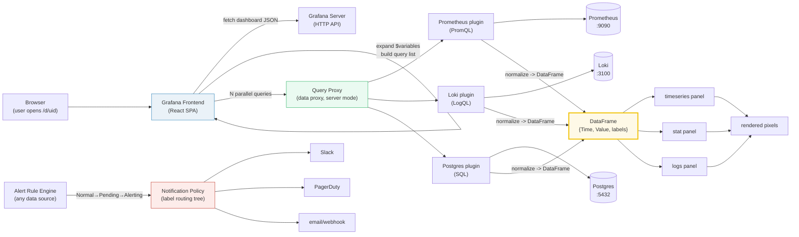

# Grafana — Day 0 to Production

> Companion (ground truth): [grafana.py](https://github.com/quanhua92/tutorials/blob/main/observability/grafana.py)
> Live interactive: [grafana.html](./grafana.html)
> Output: [grafana_output.txt](https://github.com/quanhua92/tutorials/blob/main/observability/grafana_output.txt)

Grafana is the **visualization and alerting layer** over your observability
stack. A **dashboard** is a JSON document; each **panel** in it carries a query
aimed at a **data source**. On every refresh the browser fans the panel queries
out to the Grafana backend, which proxies each to its source (Prometheus, Loki,
Postgres, …), gets back a **data frame** (a columnar table with `Time`/`Value`
fields), and hands it to the panel plugin (time series, stat, gauge, …) to draw.
**Multi-source** is the point: one dashboard can mix PromQL, LogQL, SQL, and
traces. **Provisioning** makes dashboards + datasources GitOps-able; the
**refresh slider is a cost dial**.

## 0. TL;DR

- **A dashboard is JSON.** `title`, `uid`, `schemaVersion`, `time`, `refresh`,
  `templating`, `panels[]`. Export, import, commit to git — same document.
- **The data frame is the universal contract.** Every source dialect
  (PromQL/LogQL/SQL) normalizes into `{Time, Value}` frames; any panel can draw
  any frame. That decoupling is the whole multi-source value proposition.
- **Variables parameterize dashboards.** `$job` / `[[job]]` / `${job}`. Multi-
  value variables become **regexes** (`api|web`) for PromQL's `=~`. *Repeat by
  variable* clones a panel once per value (the "one graph per instance" pattern).
- **Unified alerting = rules → 3 states → policy → contact point.** Normal →
  Pending → Alerting, gated by `for:`. A **notification policy** tree routes
  firing instances by label (first-match-wins) to Slack/PagerDuty/email.
- **Provisioning = dashboards-as-code.** YAML under
  `/etc/grafana/provisioning/`; a file provider polls the dashboard dir every
  30s so a merged PR is live with zero UI clicks.
- **Rendering cost = panels × queries ÷ refresh × viewers.** A 24-panel wall
  dashboard at 5s with 100 war-room onlookers = **480 qps** against your
  backends. Slow the refresh first.

---

## 1. Architecture



**The data path:** browser opens `/d/<uid>` → frontend fetches the dashboard
JSON → expands `$variables` → fans N panel queries to the **query proxy** → each
query is routed to its **data-source plugin**, which translates to the native
dialect (PromQL/LogQL/SQL) and calls the backend → the response is normalized
into a **DataFrame** → the **panel plugin** (time series/stat/…) draws it. In
parallel, the **alert rule engine** evaluates rules against any source, drives
them through Normal → Pending → Alerting, and routes firing instances through a
**notification policy** tree to a **contact point**.

> From grafana.py Section A:
> ```
>   browser          60 ms   user opens /d/<uid>; SPA boots; dashboard JSON fetched
>   frontend          8 ms   React parses JSON; expands $variables; builds query list
>   query_proxy       5 ms   Grafana server routes each query to its data-source plugin
>   ds_plugin         3 ms   plugin translates Grafana query -> native (PromQL/LogQL/SQL)
>   backend         120 ms   the actual store (Prometheus/Loki/Postgres) executes
>   to_dataframe      6 ms   plugin converts native response -> Grafana data frame
>   panel_render     18 ms   browser panel plugin (time series/stat/...) draws pixels
>   TOTAL           220 ms   (one panel, one query, warm view)
> [check] per-panel render budget = sum of 7 layer latencies: OK
> ```

**Why "server" access mode (`access: proxy`):** Grafana's backend makes the
data-source call itself. This avoids CORS and keeps **secrets server-side**
(API keys never reach the browser). "browser" access mode is rare and can't use
secret credentials safely.

---

## 2. Day 0 — Deploy & Configure

### 2.1 Run Grafana (docker)

```bash
docker run -d --name grafana \
  -p 3000:3000 \
  -v grafana-data:/var/lib/grafana \
  -v $(pwd)/provisioning:/etc/grafana/provisioning \
  -e GF_SECURITY_ADMIN_PASSWORD=admin \
  grafana/grafana-oss:11.1.0
```

Open `http://localhost:3000`, log in (`admin` / `admin`, then change it). The
mounted `provisioning/` dir auto-loads datasources + dashboards at startup
(Section 4).

### 2.2 Add data sources (UI or provisioning)

In the UI: **Connections → Data sources → Add data source**. Or provision them
as code (Section 4). The three core sources for a metrics+logs stack:

| Source | Type | URL | Query language |
|---|---|---|---|
| **Prometheus** | `prometheus` | `http://prometheus:9090` | PromQL |
| **Loki** | `loki` | `http://loki:3100` | LogQL |
| **Postgres** | `postgres` | `postgres:5432` | SQL |

> From grafana.py Section C:
> ```
>   source        type          language      example query
>   ----------------------------------------------------------------------------------------------
>   Prometheus    prometheus    PromQL        histogram_quantile(0.95, sum by (le)(rate(http_req_duration_seconds_bucket[5m])))
>   Loki          loki          LogQL         {job="api"} |= "error" | json | line_format "{{.msg}}"
>   PostgreSQL    postgres      SQL           SELECT time, cpu FROM host_metrics WHERE host=$host AND $__timeFilter(time)
>   MySQL         mysql         SQL           SELECT $__timeGroup(created_at,'5m'), count(*) FROM events GROUP BY 1
>   Elasticsearch elasticsearch Lucene/KQL    status:5xx AND service:api
>   InfluxDB      influxdb      InfluxQL/Flux from(bucket:"metrics") |> range(start: v.timeRangeStart) |> filter(fn:(r)=> r._measurement=="cpu")
>   Tempo         tempo         TraceQL       { span.http.status_code >= 500 }
> [check] 7 data-source dialects modeled: OK
> [check] metric (Prom) + log (Loki) + trace (Tempo) dialects all present: OK
> ```

**SQL macros** (Postgres/MySQL) — Grafana rewrites these at query time:
`$__timeFilter(col)` → `col BETWEEN '<from>' AND '<to>'`;
`$__timeGroup(col,'5m')` buckets rows by interval; `$__interval` is a bucket
width derived from the time range. These are why SQL dashboards auto-scale
bucketing to the zoom level.

### 2.3 Verify

```bash
curl -s localhost:3000/api/health        # {"database":"ok","version":"11.1.0"}
curl -s -u admin:admin localhost:3000/api/datasources | jq '.[].name'
```

---

## 3. Day 1 — First Dashboard, Variables, Alerting

### 3.1 The dashboard JSON model

A dashboard **is** a JSON object — the same document you edit in the UI, export,
import, and commit. Knowing the shape is what makes dashboards-as-code possible.

> From grafana.py Section B:
> ```
> {
>   "title": "API latency overview",
>   "uid": "api-latency",
>   "schemaVersion": 39,
>   "version": 1,
>   "timezone": "browser",
>   "time": { "from": "now-6h", "to": "now" },
>   "refresh": "30s",
>   "templating": { "list": [
>     { "name": "datasource", "type": "datasource", "query": "prometheus", ... },
>     { "name": "job", "type": "query", "query": "label_values(http_requests_total, job)", "includeAll": true },
>     { "name": "interval", "type": "interval", ... }
>   ]},
>   "panels": [
>     { "id": 1, "type": "timeseries", "gridPos": {"x":0,"y":0,"w":12,"h":8},
>       "datasource": {"type":"prometheus","uid":"$datasource"},
>       "targets": [{"expr":"histogram_quantile(0.95, ... {job=~\"$job\"} [$interval])","refId":"A"}] },
>     { "id": 2, "type": "stat", ... },
>     { "id": 3, "type": "logs", "datasource": {"type":"loki","uid":"loki"}, ... }
>   ]
> }
> [check] dashboard has 3 panels: OK
> [check] panel ids are unique: OK
> [check] every panel has a gridPos (x,y,w,h): OK
> [check] schemaVersion is an int (versioned JSON shape): OK
> [check] grid is 24 columns wide (w max = 24): OK
> [check] datasource uid can itself be a $variable (swap source per dashboard): OK
> ```

**Key fields:** `uid` (stable, URL-safe, rename-safe) · `schemaVersion` (drives
migrations on import) · `time.from/to` (default window) · `refresh`
(auto-refresh; `""` = off) · `templating.list` (the variables) ·
`panels[].gridPos` (`x/y/w/h` on a **24-column** grid) · `panels[].targets`
(query list with `expr` + `refId` A/B/C…) · `panels[].datasource` `{type, uid}`
(the `uid` can itself be a `$variable`).

### 3.2 Templating variables — the `$var` system

A variable is a named placeholder resolved at render time. It turns a static
dashboard into a parameterized template. Substitute as `$name`, `[[name]]`, or
`${name}`.

| Type | What it resolves to |
|---|---|
| `query` | values from a data-source query (e.g. `label_values`) |
| `interval` | a time bucket (1m, 5m, 1h) — often drives `$__interval` |
| `custom` | a hardcoded list you define (env: dev/stage/prod) |
| `datasource` | pick WHICH data source the dashboard queries |
| `textbox` | free text the user types |
| `constant` | a fixed value hidden from the user |
| `adhoc` | auto-discovered key=value filters (Prometheus label pairs) |

> From grafana.py Section D:
> ```
>   template : rate(http_requests_total{job="$job",env="$env"}[$interval])
>   bindings : {'job': 'api', 'env': 'prod', 'interval': '5m'}
>   resolved : rate(http_requests_total{job="api",env="prod"}[5m])
> [check] $job, $env, $interval all interpolated: OK
>
>   MULTI-VALUE: ['api','web'] becomes the regex 'api|web' for PromQL's =~
>   $job values = ['api', 'web', 'batch']  ->  regex = 'api|web|batch'
> [check] multi-value joins with | into a regex (no spaces): OK
> ```

**Multi-value + `includeAll`:** a multi-selected variable becomes a **regex
alternation** (`api|web|batch`) for PromQL's `=~` operator:
`{job=~"$job"}` → `{job=~"api|web|batch"}`. `includeAll` sets the value to `.*`.
**Repeat by variable** clones a panel once per value (auto-layouting on the
grid) — the "one graph per instance" overview pattern.

### 3.3 Panel types — when to use which

| Panel | Question it answers |
|---|---|
| **timeseries** | How does this move over time? (QPS, latency, CPU) |
| **stat** | What is the current single value? (current p95, error %) |
| **gauge** | Is a bounded value in a safe range? (CPU/disk 0–100%) |
| **bargauge** | Compare a few values at a glance? (top-10 hosts) |
| **table** | Show many columns of raw/aggregated data? |
| **heatmap** | Where is the density over time? (latency distribution) |
| **nodegraph** | What does a graph of nodes/edges look like? (traces, deps) |
| **logs** | Show log lines with metadata? (Loki errors) |
| **statetimeline** | When was each state active? (up/down over a day) |

> From grafana.py Section E:
> ```
>   panel types modeled: 12
> [check] 12 panel types in the matrix: OK
> [check] heatmap shows distribution; a single stat hides the tail: OK
> ```

**Rule of thumb:** trend → `timeseries`; single current value → `stat`; bounded
0–100% watch → `gauge`; distribution/tail → `heatmap`; trace/dependency →
`nodegraph`; raw rows → `table`. **A heatmap beats a stat for latency** — a
single p95 hides the tail; a heatmap shows the whole distribution shifting over
time.

### 3.4 Alerting — rules, states, policies, contact points

Grafana's **unified alerting** runs rules against **any** data source, drives
each through Normal → Pending → Alerting (gated by `for:`), then routes firing
instances through a label-matched **notification policy** tree to a **contact
point** (Slack / PagerDuty / email / webhook).

> From grafana.py Section F:
> ```
>   STATE MACHINE  (threshold=0.05, for=120s, eval=30s)
>   t(s)  error_rate  condition   state       note
>   0     0.012       False       Normal      
>   30    0.061       True        Pending     
>   60    0.072       True        Pending     
>   90    0.058       True        Pending     
>   120   0.070       True        Pending     
>   150   0.066       True        Alerting    <-- FIRES (notification sent)
>   180   0.011       False       Normal      <-- RESOLVED
> [check] fires at t=150 (for:2m satisfied: first true t=30 + 120s): OK
> [check] resolves at t=180 (condition false again): OK
> ```

**The `for:` gate:** a rule is **Pending** the moment the condition is true, but
only becomes **Alerting** once it has stayed true for `for:` duration. With
`for: 2m` and the condition first true at `t=30s`, the rule fires at `t=150s`
(eval cadence is 30s). The notification is sent on the Normal→Alerting
transition, and a "resolved" notice when it flips back.

A rule's **labels** drive routing. The notification policy is a **tree**,
**first-match-wins**, with the root as the default receiver:

```yaml
# routes: severity=critical -> PagerDuty, severity=warning -> Slack, team=db -> DBA
contactPoints:
  - name: pagerduty
    type: pagerduty
    settings: { routingKey: "${PD_KEY}" }
  - name: slack-warnings
    type: slack
    settings: { url: "${SLACK_WEBHOOK}", channel: "#alerts" }
policies:
  - receiver: default-slack          # root = default
    children:
      - receiver: pagerduty
        matchers: ['severity="critical"']
      - receiver: slack-warnings
        matchers: ['severity="warning"']
      - receiver: dba-oncall
        matchers: ['team="db"']
```

> ```
>   ROUTING EXAMPLES (first-match-wins):
>     {severity="critical", team="app"} -> pagerduty   [OK]
>     {severity="warning", team="app"}  -> slack-warnings   [OK]
>     {severity="warning", team="db"}   -> slack-warnings   [OK]
>     {team="db"}                       -> dba-oncall   [OK]
>     {severity="info"}                 -> default-slack   [OK]
> [check] critical -> pagerduty: OK
> [check] warning+db -> slack-warnings (severity checked before team): OK
> [check] only team=db -> dba-oncall: OK
> [check] no match -> default-slack (root fallback): OK
> ```

**Order matters:** `severity="warning"` is checked *before* `team="db"`, so
`{severity="warning", team="db"}` goes to Slack, not DBA. Put your most specific
routes at the top.

---

## 4. Day 2 — Provisioning, Teams, Rendering Cost

### 4.1 Provisioning — dashboards & datasources as code

Provisioning loads datasources + dashboards from YAML at startup. Files live
under `/etc/grafana/provisioning/{datasources,dashboards}/`. Provisioned objects
are **read-only in the UI** — git is the source of truth.

> From grafana.py Section G:
> ```
>   provisioning/datasources/datasources.yml:
>     apiVersion: 1
>     datasources:
>       - name: Prometheus
>         type: prometheus
>         access: proxy
>         url: http://prometheus:9090
>         isDefault: true
>         editable: false
>       - name: Loki
>         type: loki
>         access: proxy
>         url: http://loki:3100
>       - name: Postgres
>         type: postgres
>         url: postgres:5432
>         user: readonly
>         secureJsonData:
>           password: ${PG_PASSWORD}
>         jsonData:
>           sslmode: disable
>           postgresVersion: 1500
> [check] 3 datasources provisioned (Prom, Loki, Postgres): OK
> [check] secrets use secureJsonData (never plain jsonData): OK
> ```

**Secrets go in `secureJsonData`** (encrypted at rest, never returned by the
API), never plain `jsonData`. Reference env vars with `${PG_PASSWORD}`.

```yaml
# provisioning/dashboards/dashboards.yml
apiVersion: 1
providers:
  - name: 'dashboards-from-git'
    orgId: 1
    folder: 'Services'
    type: file
    updateIntervalSeconds: 30
    allowUiUpdates: false
    options:
      path: /var/lib/grafana/dashboards
      foldersFromFilesStructure: true
```

> ```
> [check] provider type is 'file' (reads JSON from disk): OK
> [check] allowUiUpdates false keeps dashboards git-controlled: OK
> ```

**The GitOps loop:** author dashboard JSON (or generate with
[grafonnet](https://grafana.github.io/grafonnet/) / Terraform) → commit → CI
lints against the dashboard jsonschema → CD (ArgoCD/Flux) syncs the repo onto
the Grafana container's dashboard volume → the **file provider polls that dir
every `updateIntervalSeconds`** (30s) and reloads changed dashboards with **no
API call**. A merged PR is live within 30s, zero UI clicks.

### 4.2 Organization & team management

- **Orgs** isolate tenants (separate users, datasources, dashboards). Switch via
  the top-left org picker. Most teams use **one org** with folders + RBAC.
- **Folders** group dashboards and carry permissions (`Admin` / `Edit` / `View`).
  Pair with `foldersFromFilesStructure: true` so the git dir tree becomes the
  folder tree.
- **RBAC** (Grafana 9+) gives fine-grained roles (`dashboards:write`,
  `datasources:query`) beyond the legacy Viewer/Editor/Admin.
- **Service accounts** (tokens) replace personal API tokens for CI/CD — scoped
  to a role, rotatable, auditable.

### 4.3 Plugins

```bash
# install a panel/data-source plugin (signed, from the catalog)
grafana-cli plugins install yesoreyeram-infinity-datasource
# restart to load
docker restart grafana
```

Plugins are either **data source** (adds a dialect — Infinity for JSON/REST,
Zipkin for traces) or **panel** (adds a visualization). Unsigned plugins need
`GF_PLUGINS_ALLOW_LOADING_UNSIGNED_PLUGINS=true` (dev only). In air-gapped
envs, set `GF_PLUGINS_ENABLE_FRONTEND_IMAGE_RENDERER` or bundle plugins in a
custom image.

### 4.4 Rendering cost — the refresh slider is a cost dial

Every refresh fires `panels × queries-per-panel` against the backends. The load
on Prometheus/Loki/Postgres is the **product** of panel count, refresh rate, and
concurrent viewers. This is **the** Grafana overload pattern.

> From grafana.py Section H:
> ```
>   scenario                            P   Q   R(s)   U    q/u   qps/u   total qps
>   ----------------------------------------------------------------------------------------
>   laptop dev (1 viewer)               6   1   30     1    6     0.20    0.2
>   team overview (10 viewers)          12  1   30     10   12    0.40    4.0
>   wall display (1 viewer, fast)       24  1   5      1    24    4.80    4.8
>   incident war room (100 viewers)     24  1   5      100  24    4.80    480.0
>
>   REFERENCE: 12 panels x 1 query @ 30s x 10 viewers
>     = 12 q/u = 0.4 qps/u = 4.0 total qps
> [check] reference = 4.0 total qps (12*1/30*10): OK
>   WAR ROOM : 24 panels @ 5s x 100 viewers
>     = 480.0 total qps  (120x the reference load)
> [check] war room = 480.0 total qps (24*1/5*100): OK
> [check] war room is 120x the reference load: OK
> ```

**Levers (in order of impact):** (1) **slow the refresh** — 30s → 1m halves the
load; wall displays can be 1m. (2) query **recording-rule** outputs, not raw
`rate()` (offload to Prometheus). (3) **shared queries** — one query feeds
multiple panels. (4) reduce panels (split by audience). (5) query caching
(Grafana Enterprise/Cloud). (6) scope the time range (`now-1h` << `now-7d`).

---

## 5. Killer Gotchas

| Trap | Symptom | Fix |
|---|---|---|
| **Secrets in `jsonData`** | Password visible in the API/UI export | Use `secureJsonData` (encrypted at rest, never returned). |
| **`access: browser` mode** | CORS errors; secrets can't be used | Use `access: proxy` (server mode) — backend proxies the call, keeps secrets server-side. |
| **`for:` too short** | Alert flaps on every blip → noise | Set `for: 2m+` so a rule needs sustained breach before firing. |
| **Policy route order** | `{warning,team=db}` pages DBA instead of Slack | First-match-wins — put specific routes above general ones. |
| **Multi-value as literal** | `{job="$job"}` matches nothing for `["api","web"]` | Use `=~`: `{job=~"$job"}`; the value is a regex `api|web`. |
| **`allowUiUpdates: true` on provisioned dashboards** | UI edits silently overwritten on next sync (or drift) | Keep `false`; edit in git and let the file provider reload. |
| **5s refresh + many viewers** | Backend (Prometheus/Loki) overloaded; dashboards time out | Slow the refresh (30s+); the slider is a cost dial. |
| **stat panel for latency** | Tail (p99) hidden behind a single number | Use a **heatmap** to see the distribution shift over time. |
| **`gridPos` collisions** | Panels overlap or render off-grid | Every panel needs unique `x/y/w/h`; `w` ≤ 24 (24-col grid). |
| **Hardcoded datasource UID** | Dashboard breaks across envs (prod vs dev UIDs differ) | Use a `$datasource` variable so the dashboard is source-agnostic. |
| **Un-scoped time range** | `now-7d` queries are 168× heavier than `now-1h` | Default the dashboard to a narrow window; widen on demand. |
| **Personal API token in CI** | Breaks when the person leaves; no audit | Use a **service account** token scoped to a role. |

---

## 6. Cheat Sheet

```bash
# health + datasource check
curl -s localhost:3000/api/health
curl -s -u admin:$PW localhost:3000/api/datasources | jq '.[].name'

# import a dashboard JSON via the API
curl -s -u admin:$PW -H "Content-Type: application/json" \
  -d @dashboard.json localhost:3000/api/dashboards/db
```

**Dashboard JSON essentials:** `uid` · `schemaVersion` · `time.{from,to}` ·
`refresh` · `templating.list` · `panels[].{type, gridPos, datasource, targets}`.

**Variable substitution:** `$name` / `[[name]]` / `${name}`; multi-value → regex
for `=~`; `includeAll` → `.*`; **repeat by variable** → N panels.

**Alerting flow:** rule (query + condition + `for:`) → Normal/Pending/Alerting →
notification policy (label tree, first-match-wins) → contact point
(Slack/PagerDuty/email/webhook).

**Provisioning dirs:** `/etc/grafana/provisioning/datasources/` (YAML) ·
`/etc/grafana/provisioning/dashboards/` (YAML provider + JSON files).

**Rendering cost:** `qps = panels × queries ÷ refresh_s × viewers`. Slow the
refresh first.

---

## Cross-references

- 🔗 [PROMETHEUS](./PROMETHEUS.md) — Grafana's most common data source. Recording
  rules cache the heavy `histogram_quantile`/`rate()` so panels query cheap
  pre-computed series instead of re-running them on every render.
- 🔗 [LOKI](./LOKI.md) — the log source Grafana's `logs` panel renders natively.
  Same label model as Prometheus, so the same `$job` variable filters both.
- 🔗 [OPENTELEMETRY](./OPENTELEMETRY.md) — OTel Collector can ship to Prometheus
  + Loki + Tempo, which Grafana then federates into one correlated view
  (metrics → logs → traces).
- 🔗 [DISTRIBUTED_TRACING](./DISTRIBUTED_TRACING.md) — traces render in Grafana's
  `nodegraph` panel; trace-to-log correlation links a span to the exact Loki
  log lines that produced it.
- 🔗 [OBSERVABILITY_FUNDAMENTALS](./OBSERVABILITY_FUNDAMENTALS.md) — SLI/SLO/error
  budgets; the `5xx/total` rate panel + the `for:`-gated alert implement the SLO
  burn-rate alert pattern.

---

## Sources

- Grafana — dashboard JSON model:
  https://grafana.com/docs/grafana/latest/dashboards/build-dashboards/view-dashboard-json-model/
- Grafana — variables / templating:
  https://grafana.com/docs/grafana/latest/dashboards/variables/
- Grafana — data sources overview:
  https://grafana.com/docs/grafana/latest/datasources/
- Grafana — Prometheus data source:
  https://grafana.com/docs/grafana/latest/datasources/prometheus/
- Grafana — Loki data source:
  https://grafana.com/docs/grafana/latest/datasources/loki/
- Grafana — PostgreSQL data source (SQL macros):
  https://grafana.com/docs/grafana/latest/datasources/postgres/
- Grafana — alerting fundamentals:
  https://grafana.com/docs/grafana/latest/alerting/fundamentals/
- Grafana — notification policies:
  https://grafana.com/docs/grafana/latest/alerting/fundamentals/notifications/notification-policies/
- Grafana — contact points:
  https://grafana.com/docs/grafana/latest/alerting/configure-notifications/manage-contact-points/
- Grafana — provisioning (datasources & dashboards as code):
  https://grafana.com/docs/grafana/latest/administration/provisioning/
- Grafana — manage dashboards with GitOps (ArgoCD):
  https://grafana.com/docs/grafana/latest/administration/provisioning/#dashboards
- Grafana — data proxy (server vs browser access):
  https://grafana.com/developers/plugin-tools/how-to-guides/data-source-plugins/fetch-data-from-frontend/
- Grafana — data source plugins (frontend vs backend):
  https://grafana.com/developers/plugin-tools/how-to-guides/data-source-plugins/convert-a-frontend-datasource-to-backend/
- Grafana — panel visualizations (time series, stat, gauge, table, heatmap, node graph):
  https://grafana.com/docs/grafana/latest/panels-visualizations/visualizations/
- Grafana — time range & refresh interval:
  https://grafana.com/docs/learning-paths/visualization-metrics/time-range-refresh/
- Grafana — organizations, users, teams & permissions:
  https://grafana.com/docs/grafana/latest/administration/organization-management/
- Grafana — RBAC:
  https://grafana.com/docs/grafana/latest/administration/roles-and-permissions/access-control/
- Grafana — plugins:
  https://grafana.com/docs/grafana/latest/administration/plugin-management/
- grafonnet (dashboards-as-code, Jsonnet):
  https://grafana.github.io/grafonnet/
