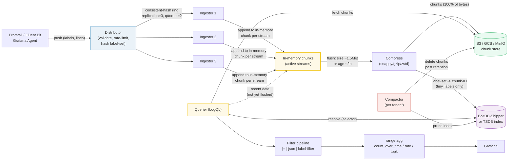

# Loki — Day 0 to Production

> Companion (ground truth): [loki.py](https://github.com/quanhua92/tutorials/blob/main/observability/loki.py)
> Live interactive: [loki.html](./loki.html)
> Output: [loki_output.txt](https://github.com/quanhua92/tutorials/blob/main/observability/loki_output.txt)

Loki is **"Prometheus-for-logs."** It indexes **only the labels** (metadata),
never the log content, and ships the raw log lines as compressed **chunks** into
cheap object storage (S3 / GCS / MinIO). Because there is no full-text index,
ingestion is cheap and storage is tiny — but a substring search (`|= "error"`)
must **scan** the compressed chunks at query time instead of looking up a posting
list. You query it with **LogQL**, a `{selector} | filter | parse | aggregate`
pipeline that mirrors PromQL's grammar. Day 2 is about retention, compaction,
multi-tenancy, and Bloom filters (3.0+) that recover Elasticsearch's needle-in-
haystack speed without an inverted index.

## 0. TL;DR

- **Labels only, never content.** One distinct label-set = one **stream**. The
  index is tiny (~1–2 KiB/stream) because it stores *only* the label-set →
  chunk-ID map. Log content lives in compressed chunks on S3, unindexed.
- **Write path:** client → **distributor** (validate, rate-limit, hash) →
  **ingester** (consistent-hash ring, 3 replicas, quorum 2) → in-memory chunk →
  flush (compress → S3, index entry → BoltDB/TSDB).
- **Read path:** **querier** resolves `{selector}` against the index → fetches
  chunks from S3 (+ recent ones from ingesters) → runs the **filter pipeline**
  (`|=`, `| json`, `| status >= 500`) → optional range aggregation
  (`count_over_time`, `rate`, `topk`).
- **Chunk = ~1.5 MiB raw / ~2h, gzip ~6x.** You pay S3 for **compressed** bytes.
- **The cardinality trap (worse than Prometheus):** putting `user_id` /
  `trace_id` / `request_id` in a label fragments logs into millions of streams →
  ingester OOM + index bloat. Keep high-cardinality data **in the line**, filter
  at query time; or use **structured metadata** (3.0+) / **Bloom filters** (3.0+).
- **vs Elasticsearch:** ES inverts every token at ingest (fast search, fat
  storage ~18x Loki). Loki is ~3–5x cheaper but loses on ad-hoc full-text search.

---

## 1. Architecture



**The data path:** client pushes `(labels, lines)` → **distributor** validates
the labels, rate-limits per tenant, hashes the label-set to a ring slot, and
fans out to **3 ingesters** (quorum 2) → each ingester appends to an in-memory
chunk for that stream → when the chunk hits **~1.5 MiB** or **~2h**, it is
flushed: **compressed** and shipped to the **chunk store (S3)**, with a tiny
index entry (label-set → chunk-ID) written to **BoltDB-Shipper** (or **TSDB** in
newer Loki). At query time the **querier** resolves the `{selector}` against the
index, fetches matching chunks from S3 (recent ones straight from ingesters),
and runs the LogQL filter pipeline in parallel.

---

## 2. Day 0 — Deploy & Configure

### 2.1 Run Loki + MinIO (docker-compose)

A single-node Loki with an S3-compatible **MinIO** backend — the simplest
production-shaped deploy.

```yaml
# docker-compose.yml
version: "3"
services:
  minio:
    image: minio/minio:RELEASE.2024-06-13T22-26-57Z
    command: server /data --console-address ":9001"
    environment:
      MINIO_ROOT_USER: loki
      MINIO_ROOT_PASSWORD: supersecret
    ports: ["9000:9000", "9001:9001"]
    volumes: [minio-data:/data]

  loki:
    image: grafana/loki:3.0.0
    command: -config.file=/etc/loki/loki-config.yml
    ports: ["3100:3100"]
    volumes: [./loki-config.yml:/etc/loki/loki-config.yml:ro]

  grafana:
    image: grafana/grafana:11.0.0
    ports: ["3000:3000"]

volumes: { minio-data: {} }
```

### 2.2 The config file — `loki-config.yml` (S3 backend)

```yaml
auth_enabled: false   # single-tenant; set true + X-Scope-OrgID for multi-tenant

server:
  http_listen_port: 3100

common:
  path_prefix: /tmp/loki
  storage:
    filesystem:
      chunks_directory: /tmp/loki/chunks
      rules_directory: /tmp/loki/rules
  replication_factor: 1     # bump to 3 for HA (simple-scalable mode)

schema_config:
  configs:
    - from: 2024-01-01
      store: tsdb           # recommended (boltdb-shipper is legacy)
      object_store: s3      # chunks + index both in S3
      schema: v13
      index: { prefix: index_, period: 24h }

storage_config:
  tsdb_shipper:
    active_index_directory: /tmp/loki/tsdb-index
    cache_location: /tmp/loki/tsdb-cache
  aws:
    s3: http://minio:9000
    bucketnames: loki-chunks
    access_key_id: loki
    secret_access_key: supersecret
    s3forcepathstyle: true  # REQUIRED for MinIO

limits_config:
  retention_period: 720h    # 30d -- enforced by the compactor
  reject_old_samples: true
  reject_old_samples_max_age: 168h

compactor:
  working_directory: /tmp/loki/compactor
  retention_enabled: true
```

> From loki.py Section A:
> ```
>   ring: 3 ingesters, replication_factor=3, write quorum=2
>
>   distributor: hash(label-set) -> pick REPLICATION ingesters on the ring
>     {env="prod",job="api"}  -> stream=0x86ca6afa  ingesters=[2, 0, 1]
>     {env="staging",job="api"}  -> stream=0xabe9156c  ingesters=[2, 0, 1]
>     {env="prod",job="worker"}  -> stream=0xa12d8278  ingesters=[0, 1, 2]
>     {env="prod",job="api"}  -> stream=0x86ca6afa  ingesters=[2, 0, 1]
> [check] identical label-set -> identical stream id (stable hashing): OK
> [check] write quorum 2 <= replication 3: OK
>
>   write quorum: distributor waits for WRITE_QUORUM acks before
>   replying 204 to the client. The 3rd replica converges in the background.
> [check] 3 acks >= quorum 2 -> batch committed: OK
> ```

**The label-set IS the sharding key.** The distributor hashes the sorted,
serialized label-set to a fixed slot on a consistent-hash ring; that slot
decides which ingester(s) own the stream. Same labels in any order → same
stream id → same ingester. Writes go to `replication_factor` ingesters (default
3) and commit on quorum (2 of 3).

### 2.3 Verify Loki is up

```bash
curl -s http://localhost:3100/ready        # "ready" once ingesters join the ring
curl -s http://localhost:3100/metrics | grep loki_distributor_lines_received_total
```

---

## 3. Day 1 — Ingest Logs, Write LogQL, Dashboard

### 3.1 Ingest with Promtail

Promtail tails files / journald / Docker logs, attaches labels, and pushes to
Loki. **Choose labels like Prometheus, but even fewer** — describe infrastructure
(job, env, namespace), never request IDs.

```yaml
# prometheus.yml... promtail-config.yml
server:
  http_listen_port: 9080
positions: { filename: /tmp/positions.yaml }

clients:
  - url: http://loki:3100/loki/api/v1/push

scrape_configs:
  - job_name: app
    static_configs:
      - targets: [localhost]
        labels:
          job: api
          env: prod
          __path__: /var/log/app/*.log
    # pipeline_stages: extract fields WITHOUT putting them in a label
    pipeline_stages:
      - json:
          expressions: { level: level, status: status, latency: lat_ms }
      - labels: { level: level }     # only `level` (5 values) -> safe as a label
      # status / latency stay as STRUCTURED METADATA (3.0+), not indexed labels
```

### 3.2 The chunk format

> From loki.py Section B:
> ```
>   chunk_target_size = 1572864 bytes (1.5 MiB)
>   max_chunk_age     = 7200s (2h)
>   codecs & compression ratios (log text): none=1.0x, snappy=4.0x, gzip=6.0x, zstd=5.5x
>
>   synthesized 12338 lines (1572888 raw bytes) to fill ONE chunk
> [check] chunk filled past target size: OK
>
>   compressed chunk size by codec (raw_bytes / ratio):
>     none    ratio=1.0 x  chunk=  1572888 bytes (1536.0 KiB)
>     snappy  ratio=4.0 x  chunk=   393222 bytes (384.0 KiB)
>     gzip    ratio=6.0 x  chunk=   262148 bytes (256.0 KiB)
>     zstd    ratio=5.5 x  chunk=   285979 bytes (279.3 KiB)
> [check] gzip ~6x ratio applied to raw bytes: OK
>
>   chunks/day at a fixed raw ingest rate (gzip):
>     ingest=1.0 MiB/s raw  -> 90.6 GB raw/day
>     chunks/day   = 57,600   (90.6 GB / 1.5 MiB per chunk)
>     stored/day   = 15.1 GB (gzip 6x of raw)
> [check] 1 MiB/s raw @ gzip 6x -> 90.6/6 = 15.1 GB stored/day: OK
> ```

A chunk is a batch of consecutive lines from **one** stream, compressed
(snappy/gzip/zstd) and flushed at **~1.5 MiB raw** or **~2h**. You pay S3 for
**compressed** bytes: 1 MiB/s raw ingests to ~15.1 GB stored/day at gzip.

### 3.3 LogQL — the filter pipeline

```logql
# stream selector + substring line filter (FASTEST content stage)
{job="api", env="prod"} |= "level=ERROR"

# selector + regex + extracted-label filter
{job="api"} |~ "status=5.." | json | status >= 500

# metric query: error rate over the last hour
sum(count_over_time({job="api"} |= "level=ERROR" [1h]))
  / sum(count_over_time({job="api"} [1h]))

# top 10 slowest requests by extracted latency
topk(10, {job="api"} | json | unwrap latency [5m])
```

> From loki.py Section D:
> ```
>   Q1  {job="api"}                     # selector: match streams
>       -> 80 lines (2 of 3 streams match: api/prod + api/staging)
> [check] Q1 selector {job=api} -> 80 lines (2 streams * 40): OK
>
>   Q2  {job="api"} |= "level=ERROR"      # selector + line contains
>       -> 14 ERROR lines from job=api
> [check] Q2 narrows to ERROR lines in job=api: OK
>
>   Q3  {job="api"} |~ "status=5.."        # selector + regex
>       -> 14 lines matching status=5.., of which 14 are status=500
> [check] Q3 regex matches status=500 lines: OK
>
>   Q4  count_over_time({job="api"} |= "level=ERROR" [1h])
>       -> 14  (number of ERROR lines from job=api in the window)
> [check] count_over_time == len of filtered lines: OK
> ```

**Filter ordering is the LogQL performance lever.** The stream selector narrows
to a stream *set* (cheap index lookup). Then line filters / parsers run over the
**decompressed chunk bytes** in order, so put the cheapest, most-selective stage
first:

1. narrow the `{selector}` as much as possible (index lookup)
2. `|=` substring (fastest content stage)
3. `| json` / `| regexp` extract
4. `| label-filter` (`>=`, `=~`) on extracted fields
5. the range aggregation (`rate`, `count_over_time`, `topk`)

A broad `{env="prod"} |= "abc"` over weeks of data is a **full chunk scan** —
fast in parallel (~0.5 TB/s in Grafana Cloud) but still proportional to bytes
touched.

### 3.4 Grafana datasource

Add Loki as a datasource: URL `http://loki:3100`. Explore with the LogQL above;
the `{job="api"} |= "error"` query streams matching lines, and metric queries
(`count_over_time`) render as time-series panels. Link logs↔metrics with the
**trace ID** left *in the log line* (`|= "trace=abc"`), never as a label.

---

## 4. Day 2 — Scale, Retention, Compaction, Multi-Tenant

### 4.1 The cardinality budget (the #1 Loki trap)

One distinct label-set = one stream. Each new stream opens a new in-memory chunk
on an ingester AND a new index entry. High-cardinality labels fragment logs into
millions of short streams → ingester OOM + index bloat.

> From loki.py Section C:
> ```
>   Scenario A (sane, infrastructure labels):
>     env         cardinality=3     running streams=3
>     job         cardinality=6     running streams=18
>     namespace   cardinality=12    running streams=216
> [check] sane streams = 6*3*12 = 216: OK
>
>   Scenario B (add trace_id=1,000,000):
>     product = 3*6*12*1000000 = 216,000,000
> [check] toxic streams = 216 * 1,000,000 = 216,000,000: OK
>
>   Cost @ index entry + live head per ACTIVE stream:
>     sane              216 streams -> index          0.3 MB, ingester head         13.5 MB
>     toxic     216,000,000 streams -> index    308,990.5 MB, ingester head 13,500,000.0 MB
> [check] toxic head = 216M * 64KiB = ~13.5 TB of ingester RAM (impossible): OK
> ```

**Rules of thumb (from Grafana):** keep any single tenant to **<100,000 active
streams** and **<1,000,000 streams in 24h**. Good labels: describe infrastructure
(regions, clusters, namespaces, envs, app names), are **long-lived** (hours+),
and are **intuitive for querying**. Only extract content into a label if it has
~tens of values, is long-lived, and users will filter on it. Use **structured
metadata** (Loki 3.0+, GA) for the rest — kv pairs stored *alongside* the line,
not indexed.

### 4.2 S3 chunk store + BoltDB index — the cost model

> From loki.py Section E:
> ```
>   raw ingest      = 200 GB/day
>   codec           = gzip (6.0x)
>   stored ingest   = 33.33 GB/day (raw / ratio)
>   retention       = 30d
>   steady-state    = 1000.0 GB compressed chunks on S3
> [check] 200 GB/day gzip 6x -> ~33.3 GB/day stored: OK
>
>   index (BoltDB)  = 10,000 streams * 1500 B = 14.3 MB total
>                   = 0.0014% of chunk storage (a rounding error)
> [check] index is < 0.01% of chunk storage (labels only, no content): OK
>
>   S3 cost @ $0.023/GB-month:
>     monthly = 1000.0 GB * $0.023 = $23.00
>     yearly  = $276.00
> [check] 1000 GB * $0.023 = $23/mo: OK
> ```

Object storage **is** the long-term store — there is no local disk to fill; you
just keep paying ~$0.023/GB-month for compressed chunks. The index is so small
(0.0014% of chunk bytes) you can cache it entirely in a querier's RAM.

### 4.3 Retention & compaction

```yaml
limits_config:
  retention_period: 720h    # 30d; 0 = infinite (default)
compactor:
  retention_enabled: true   # REQUIRED for retention to actually delete
  delete_request_store: filesystem  # or s3 for multi-instance compactor
```

> From loki.py Section G:
> ```
>   RETENTION -- delete chunks older than the window (compactor or table manager):
>       7d ->     233.3 GB (  0.23 TB) compressed on S3
>      30d ->   1,000.0 GB (  0.98 TB) compressed on S3
>      90d ->   3,000.0 GB (  2.93 TB) compressed on S3
>     365d ->  12,166.7 GB ( 11.88 TB) compressed on S3
> [check] 365d retention of 33.3 GB/day = ~12.2 TB: OK
> ```

**Retention is your cost dial:** halve the window, halve the S3 bill. The
**compactor** (single elected instance per tenant) deletes chunks past
retention AND prunes the index references to them. TSDB period = 24h blocks,
compacted 1→2→… like Prometheus.

### 4.4 Multi-tenant (free — just a header)

Set `auth_enabled: true`. Every push/query carries `X-Scope-OrgID: <tenant>`;
Loki namespaces streams, chunks, and index by tenant with no cross-tenant
leakage. Promtail sets it per-tenant via a separate `clients` entry.

> ```
>   MULTI-TENANT -- X-Scope-OrgID header on every request:
>     tenant=acme     -> ring slot 15 (namespaced; no cross-tenant leaks)
>     tenant=globex   -> ring slot 14 (namespaced; no cross-tenant leaks)
>     tenant=initech  -> ring slot  1 (namespaced; no cross-tenant leaks)
> [check] each tenant has its own ring slot: OK
> ```

### 4.5 Bloom filters (3.0+) — needle-in-haystack without an inverted index

> From loki.py Section G:
> ```
>   BLOOM FILTERS (Loki 3.0+) -- skip chunks that DEFINITELY don't contain a token:
>     10,000 chunks, only 100 contain the token
>     scan without bloom : 10,000 chunks
>     scan with    bloom : 199 chunks (100 true + false positives)
>     speedup            : 50.3x
> [check] bloom @ 1% FPR -> ~50x fewer chunks scanned for a rare token: OK
> ```

A **Bloom filter** is a probabilistic "definitely not here" structure built over
n-grams of the chunk content. A `{env="prod"} |= "trace=abc"` query can skip any
chunk whose Bloom filter says the token is absent — ~50x fewer chunks scanned for
a rare token at a 1% false-positive rate. This recovers most of Elasticsearch's
needle-in-haystack speed **without** an inverted index, preserving Loki's
cheap-ingest / small-index design.

---

## 5. Cost Analysis

| Lever | Effect |
|---|---|
| **Compression codec** | gzip 6x / zstd 5.5x / snappy 4x — you pay S3 for *compressed* bytes |
| **Retention window** | Linear in days. 30d→365d is a 12x storage increase |
| **Replication factor** | 3 replicas = 3x chunk bytes on S3 (Loki HA) |
| **Index size** | Negligible (~0.001% of chunks) — labels only |
| **S3 tiering** | Move old chunks to S3 Glacier for ~10x cheaper cold storage |

At 200 GB/day raw, gzip, 30d: ~1000 GB on S3 = **$23/month / $276/year**. The
ingester/querier compute is the real cost, not storage.

---

## 6. Comparison — Loki vs Elasticsearch

> From loki.py Section F:
> ```
>   Elasticsearch disk/day = raw * 1.5 (index) * 2 (replica)
>                           = 200.0 * 1.5 * 2 = 600 GB/day
>   Loki S3/day            = raw / 6.0 (gzip) = 33.33 GB/day
>
>   storage ratio ES / Loki = 600 / 33.33 = 18.0x
> [check] ES uses ~18x more storage than Loki (600 / 33.33): OK
>
>   ingest RAM profile (index in memory):
>     ES   : ~100 GB RAM/day of ingest (heap + segment caches)
>     Loki : ~10.0 GB RAM/day of ingest (just stream heads)
> [check] Loki uses ~10x less ingest RAM than ES: OK
>
>   query latency profile (same 1 TB of logs):
>     ES   : term lookup = O(1) posting list. Needle-in-haystack in ~ms.
>     Loki : {env="prod"} |= "abc" = a CHUNK SCAN. ~0.5 TB/s parallel ->
>            1 TB / 0.5 TB/s = 2s end-to-end for a full scan. Bloom filters
>            (3.0+) skip chunks that definitely don't contain 'abc'.
> [check] 1 TB chunk scan @ 0.5 TB/s = 2s: OK
> ```

| Dimension | Loki | Elasticsearch |
|---|---|---|
| **Index model** | Label-only (metadata) | Inverted index (every token) |
| **Storage/day** (200 GB raw) | 33.3 GB (gzip 6x) | 600 GB (1.5x index × 2 replica) |
| **Ingest RAM** | ~10 GB/day (stream heads) | ~100 GB/day (heap + segments) |
| **Term lookup** | Chunk scan (~0.5 TB/s) | O(1) posting list (~ms) |
| **Needle-in-haystack** | Slow; Bloom filters (3.0+) help | Fast (native) |
| **Label-filtered queries** | Fast (index narrows streams) | Fast |
| **Cost** | ~3–5x cheaper | ~18x more storage |
| **Best for** | K8s/container logs, ops dashboards, label-rich | Ad-hoc full-text, faceted search, relevance scoring |

**Pick Loki** for label-filtered ops queries at high volume on a budget. **Pick
Elasticsearch** for ad-hoc full-text search, relevance ranking, and complex
aggregations over log *content*. A common hybrid: Loki for ops + a sampled slice
to ES for product analytics.

---

## Killer Gotchas

| Trap | Symptom | Fix |
|---|---|---|
| **High-cardinality label** (`user_id`, `trace_id`, `request_id`) | Millions of short streams; ingester OOM; index bloat | Leave it IN the log line; filter with `\|= "trace=abc"`. Use structured metadata (3.0+) for kv pairs you want queryable but not indexed. |
| **Too many labels** (the opposite reflex from Prometheus) | Stream fragmentation; tiny chunks; slow flushes | Aim for 5–10 infrastructure labels. Loki wants *fewer* labels than Prometheus, not more. |
| **Broad selector + content filter** (`{env="prod"} |= "abc"` over 30d) | Query times out / scans terabytes | Narrow the selector first; add `|=` before `|~` regex; reduce the time range; enable Bloom filters (3.0+). |
| **`chunk_target_size` / `max_chunk_age` too small** | Millions of tiny chunks on S3; index explosion | Keep defaults (~1.5 MiB / 2h). Tune up only if you have very low-volume streams. |
| **Retention not actually deleting** | S3 bill keeps growing | Set BOTH `limits_config.retention_period` AND `compactor.retention_enabled: true`. |
| **`boltdb-shipper` on new deploys** | Legacy index store, worse compaction | Use `store: tsdb` with `schema: v13` for new deploys (boltdb-shipper is legacy). |
| **MinIO without `s3forcepathstyle`** | S3 errors on chunk flush | MinIO uses path-style addressing; set `s3forcepathstyle: true` in `storage_config.aws`. |
| **Single ingester, no replication** | Data loss on ingester restart | Set `replication_factor: 3` (simple-scalable / microservices mode) and quorum writes. |
| **Out-of-order writes rejected** (Lambda / async) | `entry out of order` errors | Loki 2.4+ allows bounded out-of-order writes (`limits_configunordered_writes: true`); or include an invocation id to force stream separation. |
| **`count_over_time` without a `[window]`** | Parse error | Range aggregations REQUIRE a window: `count_over_time({...}[5m])`. |
| **Forgetting `unwrap` for metric extraction** | `topk` on log lines makes no sense | Use `| unwrap latency [5m]` to turn a numeric field into a metric for `topk`/`quantile_over_time`. |

---

## Cheat Sheet

```logql
# selector + line filter (substring is FASTEST)
{job="api", env="prod"} |= "level=ERROR"

# regex + JSON parse + label filter
{job="api"} |~ "status=5.." | json | status >= 500

# error rate (the SLI classic)
sum(count_over_time({job="api"} |= "level=ERROR" [5m]))
  / sum(count_over_time({job="api"} [5m]))

# top-10 slowest by extracted numeric field
topk(10, {job="api"} | json | unwrap latency [5m])

# count by extracted label (line_format / sum by)
sum by (status) (count_over_time({job="api"} | json [5m]))
```

**Config knobs:** `chunk_target_size` (~1.5 MiB), `max_chunk_age` (~2h),
`limits_config.retention_period` (720h = 30d), `common.replication_factor` (3),
`compactor.retention_enabled` (true), `auth_enabled` (multi-tenant).

**The pipeline order:** `{selector}` → `|=` → `| json` → `| label-filter` →
range agg.

---

## Cross-references

- 🔗 [PROMETHEUS](./PROMETHEUS.md) — Loki is "Prometheus-for-logs." Same label
  model, same consistent-hash ring, same cardinality trap — but Loki wants even
  *fewer* labels because each stream opens an in-memory chunk.
- 🔗 [GRAFANA](./GRAFANA.md) — the visualization layer; Loki is a first-class
  datasource, and LogQL's metric queries render exactly like PromQL panels.
- 🔗 [OPENTELEMETRY](./OPENTELEMETRY.md) — OTel Collector / Fluent Bit can ship
  logs to Loki; the trace ID stays in the log line for trace-to-log correlation.
- 🔗 [OBSERVABILITY_FUNDAMENTALS](./OBSERVABILITY_FUNDAMENTALS.md) — the three
  pillars; Loki is the "logs" pillar to Prometheus's "metrics."

---

## Sources

- Loki — storage / chunks / index: https://grafana.com/docs/loki/latest/storage/
- Loki — LogQL log queries (selectors, line filters, parsers):
  https://grafana.com/docs/loki/latest/query/log_queries/
- Loki — LogQL metric queries (count_over_time, rate, topk, unwrap):
  https://grafana.com/docs/loki/latest/query/metric_queries/
- Loki — BoltDB-Shipper index store:
  https://grafana.com/docs/loki/latest/operations/storage/boltdb-shipper/
- Loki — TSDB index (recommended): https://grafana.com/docs/loki/latest/storage/tsdb/
- Loki — retention & compaction:
  https://grafana.com/docs/loki/latest/operations/storage/retention/
- Loki — multi-tenancy (X-Scope-OrgID):
  https://grafana.com/docs/loki/latest/operations/multi-tenancy/
- Loki — configuration reference: https://grafana.com/docs/loki/latest/configuration/
- The concise guide to Loki — labels & cardinality (best practices):
  https://grafana.com/blog/the-concise-guide-to-grafana-loki-everything-you-need-to-know-about-labels/
- Loki — structured metadata (3.0+): https://grafana.com/docs/loki/latest/get-started/labels/structured-metadata/
- Loki — Bloom filters (3.0+):
  https://grafana.com/docs/loki/latest/query/filter-log-lines-with-bloom-filters/
- Promtail — configuration & pipeline stages:
  https://grafana.com/docs/loki/latest/send-data/promtail/configuration/
- Loki vs Elasticsearch (cost + index model comparison):
  https://www.plural.sh/blog/loki-vs-elk-kubernetes/
- Loki vs Elasticsearch 2026 (cost + perf):
  https://lucaberton.com/blog/loki-vs-elasticsearch-2026/
- Grafana — Loki datasource: https://grafana.com/docs/grafana/latest/datasources/loki/
