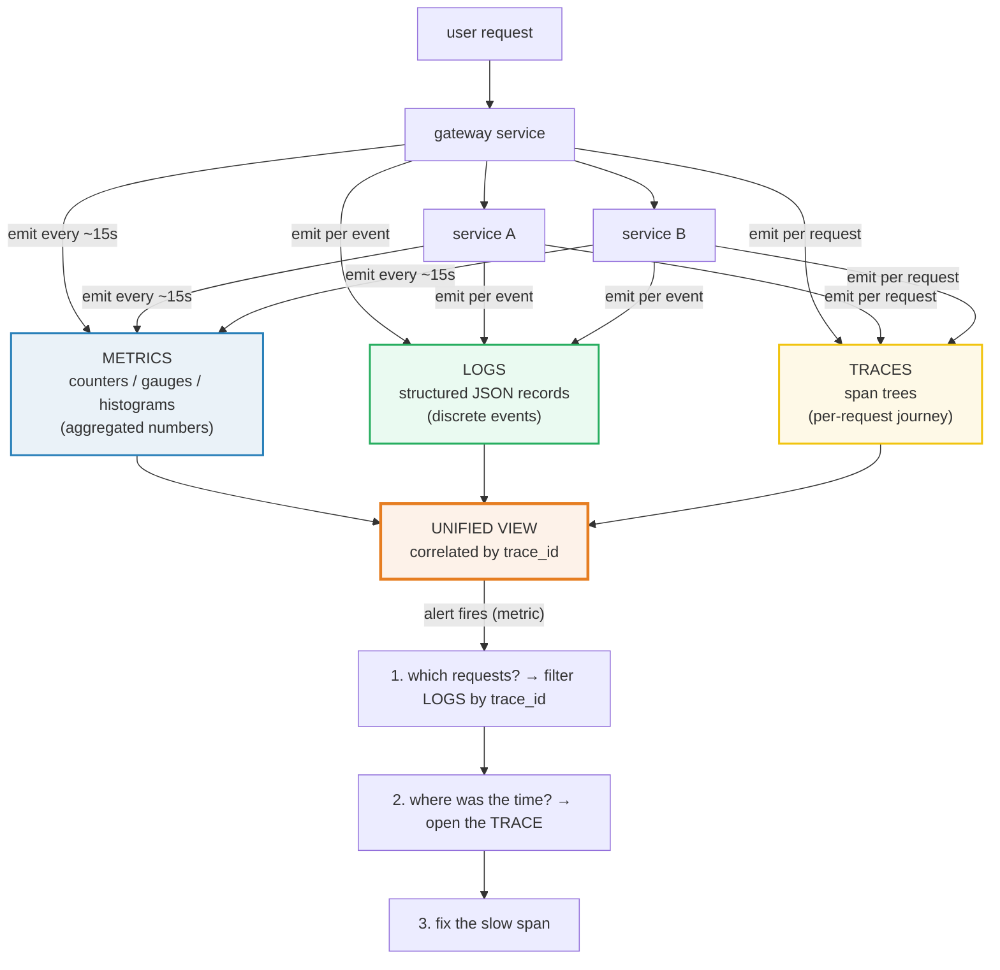

# Observability Fundamentals — Day 0 to Production

> Companion: [observability_fundamentals.py](https://github.com/quanhua92/tutorials/blob/main/observability/observability_fundamentals.py)
> Live: [observability_fundamentals.html](./observability_fundamentals.html)
> Output: [observability_fundamentals_output.txt](https://github.com/quanhua92/tutorials/blob/main/observability/observability_fundamentals_output.txt)

## 0. TL;DR

**Observability** is the ability to answer "is the system working, and if not,
*why*?" — from the outside, without shipping new code. **Monitoring** just
collects the numbers; observability is what lets you *triage*.

There are three pillars, and the thing that turns them from three tools into one
system is a **correlation key** (`trace_id`) stamped into every metric label,
every log line, and every trace span:

| Pillar | Answers | Unit | Cheap to keep? | Canonical tool |
|---|---|---|---|---|
| **Metrics** | "how much / how fast / how long" | `(name, labels) → value @ time` | yes (aggregated) | Prometheus |
| **Logs** | "what happened to THIS event" | one timestamped JSON record | no (discrete) | Loki / ELK |
| **Traces** | "where did the time go" | a tree of spans sharing a `trace_id` | no (per-request) | Jaeger / Tempo |

On top of the pillars sit the **methods** that make them actionable:

- **SLI/SLO/SLA + error budget** — turn raw metrics into a reliability contract.
- **USE** (Utilization / Saturation / Errors) — for *resources* (CPU, disk, net).
- **RED** (Rate / Errors / Duration) — for *services* (request-driven).

And the one silent killer that gets every Prometheus operator eventually:
**high-cardinality label explosion** — one `user_id` label and you OOM the TSDB.

---

## 1. Architecture — the three pillars feed one unified view



The arrows from the unified view back down are the whole point: a metric alert
tells you *something* is wrong; the shared `trace_id` lets you jump straight to
the offending log lines and then to the exact slow span. Without that
correlation key you have three tools; with it you have **observability**.

---

## 2. Day 0 — Understand & Instrument

### 2.1 The three metric primitives

You only ever need three metric types. Know which question each answers:

| Type | Goes | Question | Example | Query |
|---|---|---|---|---|
| **counter** | only UP | "how many so far" | `http_requests_total` | `rate(...[5m])` |
| **gauge** | up & down | "what is it right now" | `queue_depth` | `avg_over_time(...)` |
| **histogram** | bucketed | "what's the p95" | `http_request_duration_seconds` | `histogram_quantile(0.95, ...)` |

> From observability_fundamentals.py Section A:
> ```
>   http_requests_total @ t=11min          1171
>   rate(http_requests_total[11m])         1.5924 req/s
> [check] counter monotonically non-decreasing: OK
> ```
> ```
>       http_request_duration_seconds_bucket (CUMULATIVE):
>   0.005                                  7
>   0.01                                   140
>   0.025                                  691
>   0.05                                   948
>   0.1                                    997
>   0.25                                   1000
>   +Inf                                   1000
>   _count                                 1000
>   histogram_quantile(..., 0.95) p95      0.0520s
> ```

> **Histogram buckets are CUMULATIVE.** `le="0.05"` counts *everything* ≤ 0.05s,
> not just the observations in `(0.025, 0.05]`. The `+Inf` bucket always equals
> `_count`. `histogram_quantile()` does linear interpolation between the two
> bucket bounds that bracket the target rank.

### 2.2 Structured logs carry the correlation key

A log line is one event. Make it **structured JSON** (not grep-able prose) and
**always** include the `trace_id`, the `user_id`, and the service name. That
single field is what lets you pivot from a metric alert to the exact failing
requests.

> From observability_fundamentals.py Section B:
> ```
>   {"code": "AUTH_EXPIRED", "level": "ERROR", "msg": "token expired", "svc": "payment", "trace_id": "4a3b2c1d-trace-0001", "ts": "12:01:03.901", "user_id": 8842}
> ```
> ```
>   correlated metric series            http_requests_total{trace_id="4a3b2c1d-trace-0001",status="502"}
>   logs sharing trace_id                  4
> [check] trace_id ties log lines together: OK
> ```

### 2.3 Distributed traces record the journey

A **trace** is a tree of **spans**. Every span has a parent pointer; the root
span's duration *is* the request's wall-clock duration. The single most useful
derived number is **self-time** = span duration − (time its children covered).
Self-time tells you which span was *actually* working vs. just waiting on a
child. Follow the chain of largest self-times and you get the **critical path**
— the only spans worth optimizing.

> From observability_fundamentals.py Section C:
> ```
>   s0 gateway.GET /checkout               dur=890ms self=25ms parent=None
>   s1 checkout.validate_cart              dur=50ms self=50ms parent=s0
>   s2 payment.charge_card                 dur=815ms self=10ms parent=s0
>   s3 payment.stripe_api                  dur=805ms self=805ms parent=s2
>   
>   critical path                       gateway.GET /checkout -> payment.charge_card -> payment.stripe_api
>   trace duration (root span)             890ms
> ```

In this trace the gateway itself only did 25ms of work (`self=25ms`); 805ms was
burned waiting on the Stripe API. Optimizing the gateway's own code is useless
— the critical path is the `stripe_api` call.

---

## 3. Day 1 — First SLOs & Analysis Methods

### 3.1 SLI / SLO / SLA + the error budget

| Term | Is the… | Example |
|---|---|---|
| **SLI** | measurement | `good_events / total_events` |
| **SLO** | target | "99.9% of requests succeed over 30 days" |
| **SLA** | contract | "miss the SLO → refund 10% of the bill" |
| **error budget** | allowed failure | `1 − SLO` |

The **error budget** is the most powerful idea here. It reframes reliability
from "never fail" (impossible) to "you may fail *this much*; spend it wisely."
A 99.9% SLO gives you 43.2 minutes of allowed downtime per 30-day month — and
your job is to *budget* that, not hoard it (shipping velocity *spends* budget;
that's the point).

> From observability_fundamentals.py Section D:
> ```
>   Error budget per 30-day window by SLO target:
>   SLO            budget %     min/30d      sec/30d     
>   99%            1.0000       432.00       25920.0     
>   99.9%          0.1000       43.20        2592.0      
>   99.99%         0.0100       4.32         259.2       
>   99.999%        0.0010       0.43         25.9        
>   99.9999%       0.0001       0.04         2.6         
>   
>   PINNED: 99.9% SLO error budget      43.2 min / 30 days
> [check] 99.9% SLO -> 43.2 min / 30 days: OK
> ```

Each "nine" you add costs roughly **10×** the engineering effort. Going from
99.9% (43 min) to 99.99% (4.3 min) means your *single biggest* allowed outage
in a month is under five minutes — you can no longer tolerate a normal deploy
blip. Pick the SLO from the *user-visible* pain, not from what looks
impressive.

### 3.2 Burn rate — "how fast are we spending the budget?"

`burn_rate = observed_error_rate / error_budget_fraction`. A burn rate of 1
means you'll exhaust exactly the whole budget over the window. **>1 means
you're busting the SLO.** The Google SRE multi-window pattern alerts on a *fast*
(short window) burn rate confirmed by a *slower* (long window) one — this
catches real outages fast without paging on a single noisy minute.

> From observability_fundamentals.py Section E:
> ```
>   action   budget    long win   short win    burn_rate 
>   PAGE     2.0     % 1          5            14.4      
>   PAGE     5.0     % 6          30           6.0       
>   TICKET   10.0    % 24         120          3.0       
>   TICKET   10.0    % 72         360          1.0       
>   
>   PINNED: 2% budget / 1h              14.4
>   PINNED: 5% budget / 6h                 6.0
>   PINNED: 10% budget / 3d                1.0
> ```
> ```
>   observed error rate                 0.50%
>   error budget fraction                  0.10%
>   burn rate                              5.00  (>1 => busting SLO)
> [check] 0.5% error vs 99.9% SLO -> burn 5.0: OK
> ```

### 3.3 USE method — for resources

Brendan Gregg's **USE**: for every *resource* (CPU, memory, disk, NIC) check
all three — **U**tilization (% busy), **S**aturation (queue depth), **E**rrors
(hardware/transfer). It's a checklist, not a dashboard.

> From observability_fundamentals.py Section F:
> ```
>   CPU (8 cores):
>   t=3 busy=8 runq=1                      U=100.0%  S=1  E=0
>   avg utilization U                      56.2%
>   avg saturation S (runq len)            2.00
>   memory util (14.2/16 GB)            88.8%
> [check] memory util > 0.8 => near saturation: OK
> ```

Note the CPU here is *utilized* 56% on average but hit **100% utilization** at
t=3 with a run-queue — that's the saturation signal USE exists to surface. High
average utilization is fine; **saturation** (things waiting) is what hurts.

### 3.4 RED method — for services

Tom Wilkie's **RED**: for every *request-driven service* check **R**ate,
**E**rrors, **D**uration. RED is to services what USE is to resources.

> From observability_fundamentals.py Section G:
> ```
>   Rate     (req/s)                    1002.1
>   Errors    (err/s)                      3.75
>   Errors    (err %)                      0.37%
>   Duration  p95                          64.9 ms
>   Duration  p99                          83.0 ms
> [check] RED p95 <= p99: OK
> ```

---

## 4. Day 2 — Scale & Survive

### 4.1 The cardinality bomb

Every **unique combination** of label values is one time series in the TSDB.
Series count is the **cartesian product** of every label's cardinality.
Low-cardinality labels (`method`, `status`, `instance`) are cheap.
**High-cardinality labels** (`user_id`, `email`, `ip`, `trace_id`,
`session_id`) multiply the series count by thousands and OOM the TSDB. This is
the #1 Prometheus operational failure.

> From observability_fundamentals.py Section H:
> ```
>   label added                  cardinality    series      
>   baseline: no labels                    1
>   + method      (4)                      4
>   + status      (6)                      24
>   + instance    (20)                     480
>   + user_id     (1000)                   480,000
>   
>   final series count                  480,000
>   est. memory @ 1.5KB/series             703 MB (0.69 GB)
> [check] cartesian product == 4*6*20*1000 = 480000: OK
> [check] est. memory > 500 MB (this is why TSDBs OOM): OK
> ```

One metric, one `user_id` label, and you're at **480k series / ~700 MB** for a
*single* metric family. Multiply by your actual metric count and the TSDB is
dead. The fix is never to put unbounded values in labels — keep `user_id` in
the **logs** (and exemplars), not in metric labels.

### 4.2 The Day-2 decision checklist

- **Sample at the edge.** Don't ship every span; use **tail sampling** to keep
  the interesting (errored / slow) traces and drop 99% of the healthy ones.
- **Pre-aggregate metrics.** Recording rules + `rate()` over a window beats
  storing every increment.
- **Log levels are a budget.** `DEBUG` in production is a storage cost and a
  signal-to-noise cost. Default to `INFO`, sample `DEBUG`.
- **Re-baseline your SLOs.** A 99.9% SLO that's been at 99.99% for a quarter is
  too lax (you're leaving shipping velocity on the table); one at 99.8% is too
  tight. Re-evaluate quarterly from user-visible pain.

---

## 5. Killer Gotchas

| Trap | Symptom | Fix |
|---|---|---|
| **`user_id` / `email` / `ip` in a metric label** | TSDB memory climbs until OOM; Prometheus restart "fixes" it temporarily | Never put unbounded values in labels — keep them in logs/exemplars only |
| **Non-cumulative histogram buckets** | `histogram_quantile()` returns garbage (the first bucket bound for every percentile) | Buckets must be *cumulative*; `+Inf` bucket must equal `_count` |
| **Alerting on raw error count, not burn rate** | You get paged at 3am for a 1-minute blip, or miss a slow bleed | Use **multi-window burn-rate** alerts (short window to fire, long window to confirm) |
| **Picking the SLO from what looks good** | 99.99% SLO that no one can hit, or 99% SLO that hides real user pain | Derive the SLO from **user-visible** behavior (login success, checkout latency), re-baseline quarterly |
| **`rate()` over < scrape interval** | `rate(...[1m])` with a 60s scrape returns 0 / NaN | Window must be ≥ 4× the scrape interval (e.g. ≥ 1m for a 15s scrape, use `[5m]`) |
| **Gauge treated as a counter** | `increase()` on a gauge gives nonsense (gauges go down) | `increase()`/`rate()` are for **counters only**; use `avg_over_time`/`max_over_time` for gauges |
| **Traces without `trace_id` in logs** | You see a slow request in the trace UI but can't find its logs | Propagate `trace_id` (W3C `traceparent`) into *every* log line and metric label — that's the whole correlation model |
| **Only tracking average latency** | Averages hide the tail; users live in the p99 | Track **p95 and p99**, never just `avg`; alert on tail percentiles |
| **USE without saturation** | CPU at 60% avg "looks fine" while requests queue | Always check **saturation** (run-queue, pool exhaustion), not just utilization |
| **Missing the root span** | Traces show fragments, no end-to-end duration | Ensure the **entry service** creates the root span and propagates context downstream |

---

## 6. Cheat Sheet

```
PILLARS         metrics (cheap, aggregated) · logs (discrete, the WHY) · traces (the journey)
METRIC TYPES    counter=up only · gauge=up&down · histogram=buckets→percentiles
CORRELATION     trace_id in every metric label + log line + trace span
SLI/SLO/SLA     measurement / target / contract ;  error_budget = 1 − SLO
BURN RATE       observed_err / budget_frac ;  >1 = busting SLO
USE             resources:  Utilization · Saturation · Errors
RED             services:   Rate · Errors · Duration
CARDINALITY     series = ∏ label cardinalities ;  NEVER label user_id/email/ip
NINES (30d)     99%→432min  99.9%→43.2min  99.99%→4.32min  99.999%→25.9s
```

🔗 [opentelemetry](./OPENTELEMETRY.md) — the standard API/SDK that instruments
all three pillars and propagates the `trace_id` this bundle relies on.
🔗 [prometheus](./PROMETHEUS.md) — the TSDB whose cardinality limits this bundle
warns about; where `histogram_quantile` and `rate()` actually live.

---

## Sources

- Google SRE Book, ch.6 "Monitoring Distributed Systems" (Four Golden Signals): https://sre.google/sre-book/monitoring-distributed-systems/
- Google SRE Workbook, ch.5 "Alerting on SLOs" (multi-window burn rate): https://sre.google/workbook/alerting-on-slos/
- Google Cloud — alerting on budget burn rate: https://docs.cloud.google.com/stackdriver/docs/solutions/slo-monitoring/alerting-on-budget-burn-rate
- Grafana SLO introduction (burn rate): https://grafana.com/docs/grafana-cloud/alerting-and-irm/slo/introduction/
- Tom Wilkie, "The RED Method" (GrafanaCon EU 2018): https://grafana.com/files/grafanacon_eu_2018/Tom_Wilkie_GrafanaCon_EU_2018.pdf
- Brendan Gregg, "The Utilization Saturation and Errors (USE) Method": https://brendangregg.com/usemethod.html
- Prometheus — metric types & histograms: https://prometheus.io/docs/concepts/metric_types/
- OpenTelemetry — concepts (traces, spans, context): https://opentelemetry.io/docs/concepts/observability-primer/
