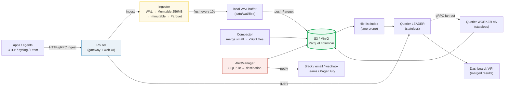

# OpenObserve — S3-Native Observability: Day 0 to Production

> Companion (ground truth): [openobserve.py](https://github.com/quanhua92/tutorials/blob/main/observability/openobserve.py)
> Live interactive: [openobserve.html](./openobserve.html)
> Output: [openobserve_output.txt](https://github.com/quanhua92/tutorials/blob/main/observability/openobserve_output.txt)

OpenObserve (O2) is a **single Rust binary** that stores logs, metrics, and
traces as **Parquet columnar files on S3** (or any object store) and queries
them directly off object storage. It needs no local disk for data — only a small
write-ahead-log buffer on the ingester. This makes it the inverse of
Elasticsearch (which ties data to local disk + JVM heap) and cheaper than Loki
at equivalent cardinality (columnar Parquet beats gzip chunks).

## 0. TL;DR

> OpenObserve is to Elasticsearch what SQLite is to PostgreSQL — simpler,
> cheaper, S3-backed, and surprisingly capable for most workloads.

- **One Rust binary**, five roles (Router / Ingester / Compactor / Querier /
  AlertManager) that collapse into one process in single-node mode.
- **Storage is S3.** All telemetry is Parquet on object storage; queriers scan
  it directly. Local disk is only a WAL buffer — losing a node loses no history.
- **Schema is auto-detected** from the JSON you ingest and **auto-evolves** when
  new fields appear (no reindex, no downtime).
- **Queries are SQL** (`SELECT * FROM logs WHERE level='error'`) with a Tantivy
  full-text index for `match_all(...)` and Parquet predicate/column pushdown.
- **Cost:** ~15× log compression on S3. At 100 GB/day × 30d, storage is **$4.60/mo**
  vs **$480/mo** for Elasticsearch on EBS — a ~104× storage gap that widens with
  volume (O2's headline claim is "140× lower storage cost").
- **Day 2 is easy:** queriers are stateless (scale by adding pods), compaction
  merges small files (1200 → 2, a 600× file-count drop), and alerts fire to
  Slack/email/webhook.

🔗 [PROMETHEUS](./PROMETHEUS.md) — O2 ingests metrics via Prometheus
`remote_write`, so the PromQL/TSDB model carries over directly.
🔗 [OPENTELEMETRY](./OPENTELEMETRY.md) — O2 is an OTLP-native backend for logs,
metrics, and traces; OTel Collector is the recommended ingest path.

---

## 1. Architecture



> From openobserve.py Section A:

```
  Router        Client-facing HTTP/gRPC gateway + serves the web UI. A thin
                proxy: routes ingest -> Ingester, query -> Querier.
  Ingester      Receives ingest, parses, schema-evolves, writes WAL -> Memtable
                (256MB) -> Immutable -> local Parquet -> flush to S3. 3 buffers:
                Memtable, Immutable, wal Parquet not-yet-on-S3.
  Compactor     Merges small S3 Parquet files into big ones (<= 2 GB) so
                queries scan fewer files. Also enforces retention + deletions.
  Querier       FULLY STATELESS. Scans S3 Parquet. A LEADER partitions the file
                list across WORKER queriers over gRPC, then merges results.
                Caches Parquet in RAM (default 50% of free memory).
  AlertManager  Runs scheduled alert queries + report jobs; fires notifications
                to destinations (Slack/email/webhook/Teams/PagerDuty).
```

**The data path:** ingest → Router → Ingester parses + schema-evolves → WAL →
Memtable (in RAM, 256 MB cap) → Immutable → local Parquet → every 10 s the
Ingester merges small files and pushes Parquet to S3. Queries hit the Querier,
which uses the **file-list index** (Postgres/SQLite) to time-prune, then a LEADER
partitions the remaining files across stateless WORKER queriers over gRPC; each
WORKER scans its Parquet from S3 (or RAM cache) and the LEADER merges results.

**Why this is cheap:** storage is S3-priced object storage, not EBS tied to a
node. Compute is a handful of stateless nodes that do **not** grow with history.
The Compactor keeps the S3 Parquet in a query-friendly shape (few, large files).

### O2 vs Elasticsearch vs Loki

| Aspect | **OpenObserve** | Elasticsearch | Loki |
|---|---|---|---|
| Language | **Rust** | Java (JVM heap) | Go |
| Storage | **S3 (object)** | local EBS/disk | S3 (chunks) |
| Format | **Parquet (columnar)** | inverted index (Lucene) | gzip chunks |
| Index | Tantivy full-text + schema | Lucene inverted index | **labels only** (no FTS) |
| Local data? | **No** (WAL buffer only) | Yes (data on disk) | No |
| Stateless query tier? | **Yes** | No (data nodes) | Mostly |
| Resource use | **~50% lower than ES** at equal ingest (O2 claim) | High (heap + disk) | Low |
| Best at | High-volume logs + unified signals | Relevance-ranked search | Label-filtered log streams |

> From openobserve.py Section A (ingest throughput):

```
Single-node ingest (pinned, official, Apple M2): 31 MB/s
  = 2,678 GB/day  (31 x 86400 / 1000)
  ~ 3.9 MB/s per vCPU (M2 ~8 cores)
```

---

## 2. Day 0 — Deploy with S3 (15 min)

Goal: one OpenObserve container, data on S3/MinIO, ready to ingest. Single-node
**with S3** uses SQLite for metadata (no Postgres/NATS) but stores all telemetry
on object storage — durable and cheap from day one.

### docker-compose.yml

> From openobserve.py Section B:

```yaml
version: "3.8"

services:
  openobserve:
    image: openobserve/openobserve:latest
    container_name: openobserve
    ports:
      - "5080:5080"          # Web UI + HTTP ingest API
    environment:
      ZO_ROOT_USER_EMAIL: "admin@openobserve.dev"
      ZO_ROOT_USER_PASSWORD: "admin123Complex#"
      ZO_S3_PROVIDER: "minio"           # aws | minio | gcs | azure
      ZO_S3_SERVER_URL: "http://minio:9000"
      ZO_S3_REGION: "us-east-1"
      ZO_S3_BUCKET: "openobserve"
      ZO_S3_ACCESS_KEY: "minioadmin"
      ZO_S3_SECRET_KEY: "minioadmin"
      ZO_MAX_FILE_SIZE_IN_MEMORY: "256"  # MB -> Memtable -> Immutable
      ZO_MAX_FILE_SIZE_ON_DISK: "128"    # MB -> WAL cap
      ZO_FILE_PUSH_INTERVAL: "10"        # s -> merge + push to S3
      ZO_COMPACT_MAX_FILE_SIZE: "2048"   # MB (2 GB) merged file ceiling
    volumes:
      - o2-data:/data                   # local WAL buffer only (data lives on S3)
    depends_on:
      - minio

  minio:
    image: minio/minio:latest
    command: server /data --console-address ":9001"
    ports:
      - "9000:9000"
      - "9001:9001"
    environment:
      MINIO_ROOT_USER: "minioadmin"
      MINIO_ROOT_PASSWORD: "minioadmin"
    volumes:
      - minio-data:/data

volumes:
  o2-data:
  minio-data:
```

### S3 configuration (key environment variables)

| Variable | Purpose |
|---|---|
| `ZO_ROOT_USER_EMAIL` / `ZO_ROOT_USER_PASSWORD` | Root admin created on first boot |
| `ZO_S3_PROVIDER` | `aws` \| `minio` \| `gcs` \| `azure` |
| `ZO_S3_SERVER_URL` | Endpoint (MinIO only; AWS uses region) |
| `ZO_S3_BUCKET` / `ZO_S3_REGION` | Bucket name + region |
| `ZO_S3_ACCESS_KEY` / `ZO_S3_SECRET_KEY` | Credentials |
| `ZO_MAX_FILE_SIZE_IN_MEMORY` (256 MB) | Memtable → Immutable threshold |
| `ZO_MAX_FILE_SIZE_ON_DISK` (128 MB) | WAL file cap |
| `ZO_FILE_PUSH_INTERVAL` (10 s) | Merge small files + push to S3 |
| `ZO_COMPACT_MAX_FILE_SIZE` (2048 MB) | Compactor merged-file ceiling |

> For HA: set `ZO_NODE_ROLE` per node and add **NATS** (coordinator) +
> **PostgreSQL** (metadata). All five node types scale horizontally.

### Verify

```bash
# list streams (Basic auth; also returns a token)
curl -s http://localhost:5080/api/default/streams \
     -u 'admin@openobserve.dev:admin123Complex#' | head

# first ingest -> creates the stream + auto-detects schema
curl -s http://localhost:5080/api/default/quickstart1/_json \
     -u 'admin@openobserve.dev:admin123Complex#' \
     -d '[{"level":"info","service":"api","log":"O2 is up"}]'
```

> From openobserve.py Section B (resources + throughput):

```
  OpenObserve single node : min 1 vCPU, 2 GB RAM, ~no local disk for data
  Elasticsearch (3 nodes) : min 3 x 4 vCPU, 8-16 GB RAM each, EBS per node

Expected ingestion throughput:
  ~31 MB/s on an 8-core node (pinned, official)
  ~3.9 MB/s per vCPU  ->  ~334.8 GB/day per vCPU
  A 2-vCPU t3.medium can reasonably ingest ~8 MB/s (~670 GB/day) for logs
```

---

## 3. Day 1 — Ingest & Search

A **stream** is a named table, auto-created on first ingest. O2 detects the
schema from the JSON you send and evolves it as new fields appear. `_timestamp`
is added automatically (microseconds) if absent.

### Ingest

```bash
POST /api/{org}/{stream}/_json    # JSON array; also: _bulk, _multi, OTLP, syslog
# Basic auth: root@example.com:Complexpass#123
```

> From openobserve.py Section C (simulated round-trip):

**STEP 1 — ingest 5 records** →
`{"code":200,"status":[{"name":"logs","successful":5,"failed":0}]}`,
schema auto-detected: `_timestamp: Int64, service/level/log: Utf8, latency_ms: Int64`.

**STEP 2 — SQL filter + sort:**
```sql
SELECT * FROM logs WHERE level = 'error' ORDER BY _timestamp DESC LIMIT 20
```
```
  hits: 2
    [1716950404000000]  payment  error  card declined code=do_not_honor
    [1716950402000000]     cart  error  db connection refused host=db-2
  took: 47 ms   scanned: 1 file (256 KB)   cached: no
```

**STEP 3 — full-text search** (Tantivy index on `log`):
```sql
SELECT * FROM logs WHERE match_all('declined') AND service = 'payment'
```
```
  hits: 1
    [1716950404000000]  payment  card declined code=do_not_honor
  took: 9 ms   (match_all uses the Tantivy full-text index, not a scan)
```

**STEP 4 — aggregation:**
```sql
SELECT service, count(*) AS cnt FROM logs GROUP BY service ORDER BY cnt DESC
```
```
     payment  2
        auth  1
        cart  1
      search  1
```

**STEP 5 — query performance** (columnar pushdown vs full scan):
```
  full S3 scan   : 12 files x 256 MB = 3072 MB
  pushdown (3/5 cols): 3072 MB x 3/5 = 1843 MB read
  cached (in RAM): 0 MB from S3 -> served from ZO_MEMORY_CACHE_MAX_SIZE
  -> columnar Parquet reads ~1843/3072 = 60% of a row-store scan
```

**Full-text functions:** `match_all('term')` (across FTS-configured fields:
`log`, `message`, `msg`, `content`, `data`), `match_all('term', 'field')`,
`str_match(field, 'value')`, plus standard SQL `WHERE`/`GROUP BY`/`ORDER BY`.

---

## 4. Day 2 — Scale, Alerts, Dashboards

### Scale (stateless queriers)

Queriers are **fully stateless** — they only scan S3 and cache Parquet in RAM.
Double query throughput by doubling querier pods; no rebalancing, no sharding. A
LEADER partitions the file list across WORKERs over gRPC and merges results.

```
  1 querier(s): 100 files -> 100 files/querier
  2 querier(s): 100 files -> 50 files/querier
  5 querier(s): 100 files -> 20 files/querier
```

### Compaction

The Compactor merges small S3 Parquet files into big ones (≤ 2 GB ceiling) so
queries scan fewer files. It also enforces retention and stream deletions.

> From openobserve.py Section D:

```
  before: 1200 files x 2 MB = 2,400 MB (avg 2 MB/file)
  compactor target ceiling: ZO_COMPACT_MAX_FILE_SIZE = 2048 MB (2 GB)
  after : 2 files x up to 2048 MB = 2,400 MB
  file-count reduction: 1200 -> 2 (600x fewer files to plan/scan)
  exact merged sizes (MB): [2048, 352]
```

### Alerting (rule → evaluate → destination)

```jsonc
// scheduled alert (runs a SQL query on a cadence)
{
  "name": "high_error_rate",
  "stream": "logs",
  "query": "SELECT count(*) AS c FROM logs WHERE level='error' AND _timestamp > now() - 10m",
  "condition": "c >= 10",
  "frequency": "60s",
  "destination": "slack-oncall"
}
```
Destinations: `slack`, `email`, `webhook (custom)`, `teams`, `pagerduty`,
`alertmanager`. **Real-time alerts** also exist — evaluated inline at ingest
(sub-second latency). When the condition fires, O2 renders a template and POSTs
to the configured destination.

### Dashboards

A dashboard is a set of panels; each panel runs a SQL or PromQL query against a
stream. Variables let one dashboard filter across services/environments.

### Cold storage (tier to S3 Infrequent Access)

Move old Parquet to S3 IA to cut cost on stale data:

> From openobserve.py Section D (100 GB/day, 30-day retention):

```
    all on S3 Standard : 200 GB -> $4.60/mo
    tier: 7d Standard + 23d IA:
      Standard (47 GB): $1.07/mo
      IA      (153 GB): $1.92/mo
      total tiered                              : $2.99/mo
    saving: $4.60 -> $2.99 (35% cheaper)
```

---

## 5. Cost Analysis

Parquet is columnar + dictionary/RLE/zstd encoded. For repetitive log fields
(`level`, `service`, `host`) it crushes redundancy. Representative compression:
O2 ~15×, Loki ~8× (gzip chunks). ES keeps an inverted index + replicas on EBS.

**Assumptions (transparent, AWS us-east-1 2025):** 30-day retention; O2 =
1/15× raw on S3 ($0.023/GB-mo); Loki = 1/8× raw on S3; ES = 2× raw
(primary+replica) on EBS gp3 ($0.080/GB-mo). *Storage only* — ES also needs
compute that scales with data volume.

> From openobserve.py Section E:

```
  ingest/day  O2 (S3)       Loki (S3)     ES (EBS)      O2 vs ES
  ----------------------------------------------------------------
  1 GB/day    $0.046        $0.086        $4.80            104x
  10 GB/day   $0.460        $0.862        $48.00           104x
  100 GB/day  $4.60         $8.62         $480.00          104x
  1 TB/day    $46.00        $86.25        $4,800           104x
```

**ROI — when O2 wins massively:** the gap widens with volume and retention. ES
cost grows with data (more EBS + more data nodes holding indices in RAM); O2
storage is ~flat (S3 price) and compute is a handful of stateless nodes that do
**not** grow with history. At 10 GB/day × 30d, ES storage already costs ~104× O2.
O2's official headline is "140× lower storage cost" vs ES (specific
configurations); this transparent model shows ~100×+ on storage at 1 TB/day —
the right order of magnitude. **O2 does NOT win** on tiny volumes (<1 GB/day,
where a single ES node is fine) or queries needing ES's mature Lucene relevance
ranking.

```
GOLD (pinned for HTML gold-check):
  O2 S3 cost at 100 GB/day, 30d retention = 200 GB x $0.023 = $4.60/mo
```

---

## 6. Data Pipeline & Schema

- **Schema detection:** no schema declared up front. On first ingest O2 infers
  Arrow types and registers the stream schema (Postgres in HA / SQLite
  single-node).
- **Schema evolution:** new fields appear → auto-added. Old Parquet files simply
  lack the new column; queries return NULL for it on those files. No reindex, no
  downtime.
- **Multi-format:** Logs (JSON `/api/{org}/{stream}/_json`, OTLP, syslog),
  Metrics (Prometheus `remote_write`, OTLP), Traces (OTLP over HTTP/gRPC).
- **Partitioning:** time-based folders in S3
  (`files/logs/default/2024/05/29/00/<uuid>.parquet`). A time-range query lists
  only the partitions it overlaps → the file-list index prunes the rest **before**
  any S3 scan.

> From openobserve.py Section F (schema evolution):

```
  day 1: 4 fields  + new: ['_timestamp', 'level', 'log', 'service']
  day 2: 5 fields  + new: ['latency_ms']
  day 3: 6 fields  + new: ['user_id']
```

---

### Killer Gotchas

| Trap | Symptom | Fix |
|---|---|---|
| **S3 misconfigured** | Ingest returns 200 but no data is queryable; files never land | Verify `ZO_S3_*` + bucket region; O2 docs have a dedicated "ensure S3 is correct" page |
| **Tiny Parquet files** | Queries slow; many files scanned | Compactor merges to ≤2 GB — confirm `ZO_COMPACT_MAX_FILE_SIZE` and that compaction is running |
| **Field explosion / flattening** | >200 fields/record (cloud) dropped, or deep JSON becomes a string blob | Cap `ZO_INGEST_FLATTEN_LEVEL` (default 3); avoid embedding unbounded JSON |
| **High-cardinality fields** | `GROUP BY user_id`-style columns bloat Parquet + slow scans | Don't index/FTS high-cardinality fields; route them to a separate stream |
| **One in-flight copy** | Brief ingest buffer (Memtable/WAL) is single-copy before S3 flush | Accept it (modern storage is durable); or run ≥2 ingesters in HA if you need it |
| **Label-only expectations** (from Loki) | Users expect `match_all` to "just work" | Configure fields for full-text (`log`/`message`/`msg`/`content`/`data`) — Tantivy only indexes those |
| **Query scans all time** | Slow query, full S3 scan | Always bound `_timestamp`; the file-list index prunes by time range first |

### Cheat Sheet

```bash
# ingest (JSON)
curl http://localhost:5080/api/default/logs/_json \
     -u 'admin@openobserve.dev:admin123Complex#' \
     -d '[{"level":"error","service":"api","log":"boom"}]'

# search (SQL via API)
curl -G http://localhost:5080/api/default/_search \
     -u 'admin@openobserve.dev:admin123Complex#' \
     --data-urlencode 'query=SELECT * FROM logs WHERE level="error" ORDER BY _timestamp DESC LIMIT 20'

# full-text
#   SELECT * FROM logs WHERE match_all('boom') AND service='api'
# aggregation
#   SELECT service, count(*) AS cnt FROM logs GROUP BY service ORDER BY cnt DESC
```

| Need | Command / value |
|---|---|
| Single-node ingest (M2) | 31 MB/s ≈ 2,678 GB/day (~3.9 MB/s per vCPU) |
| Min resources | 1 vCPU, 2 GB RAM (single node) |
| Memtable → Immutable | 256 MB (`ZO_MAX_FILE_SIZE_IN_MEMORY`) |
| WAL cap | 128 MB (`ZO_MAX_FILE_SIZE_ON_DISK`) |
| Push to S3 | every 10 s (`ZO_FILE_PUSH_INTERVAL`) |
| Compactor ceiling | 2048 MB / 2 GB (`ZO_COMPACT_MAX_FILE_SIZE`) |
| Querier RAM cache | 50% of free memory (`ZO_MEMORY_CACHE_MAX_SIZE`) |
| HA deps | NATS (coordinator) + PostgreSQL (metadata) + S3 (data) |

## Sources

- OpenObserve — Architecture & Deployment Modes: https://openobserve.ai/docs/architecture/
- OpenObserve — Getting Started: https://openobserve.ai/docs/getting-started/
- OpenObserve — Environment Variables Reference: https://openobserve.ai/docs/administration/configuration/environment-variables/
- OpenObserve — Logs Ingestion (JSON API): https://openobserve.ai/docs/reference/api/ingestion/logs/json/
- OpenObserve — Curl Log Ingestion (HTTP API): https://openobserve.ai/docs/ingestion/logs/curl/
- OpenObserve — Data Ingestion Overview: https://openobserve.ai/docs/ingestion/
- OpenObserve — OTLP/OTel Collector Ingestion: https://openobserve.ai/docs/ingestion/logs/otlp/
- OpenObserve — SQL Reference: https://openobserve.ai/docs/reference/sql-reference/
- OpenObserve — Full-Text Search Functions: https://openobserve.ai/docs/reference/sql-functions/full-text-search/
- OpenObserve — Query Examples: https://openobserve.ai/docs/user-guide/data-exploration/example-queries/
- OpenObserve — Alerts Overview: https://openobserve.ai/docs/user-guide/analytics/alerts/
- OpenObserve — Alert Destinations: https://openobserve.ai/docs/user-guide/account-administration/management/alert-destinations/
- OpenObserve — Dashboards: https://openobserve.ai/docs/user-guide/analytics/dashboards/
- OpenObserve — HA Deployment Guide: https://openobserve.ai/docs/administration/deployment/ha-deployment/
- OpenObserve — Query Tuning / Tantivy Index: https://openobserve.ai/docs/advanced/query-tuning/tantivy-index/
- OpenObserve — Why Rust for Observability: https://openobserve.ai/blog/rust-observability-platform/
- OpenObserve — "140× lower storage cost" homepage claim: https://openobserve.ai/
- OpenObserve GitHub repo (Rust + Vue, S3-native): https://github.com/openobserve/openobserve
- OpenObserve — "15,000 GitHub Stars" (stateless/cloud-native architecture): https://openobserve.ai/blog/openobserve-reaches-15000-github-stars/
- Show HN: OpenObserve – Elasticsearch/Datadog alternative (HN discussion): https://news.ycombinator.com/item?id=36280028
- OpenObserve vs Elasticsearch vs Grafana (ingestion comparison): https://openobserve.ai/docs/overview/comparison-with-alternatives/comparison/
- Document comparison to Elasticsearch and Grafana Loki (storage numbers): https://github.com/openobserve/openobserve/discussions/1452
- Cost-effective alternative to OpenSearch for log analysis (Dev Genius): https://blog.devgenius.io/cost-effective-alternative-to-opensearch-for-logs-76dc26eeb01e
- Loki vs Elasticsearch: Log Management Comparison (OneUptime, storage/compute): https://oneuptime.com/blog/post/2026-01-21-loki-vs-elasticsearch/view
- AWS S3 pricing (us-east-1): https://aws.amazon.com/s3/pricing/
- AWS EC2 / EBS pricing (us-east-1): https://aws.amazon.com/ec2/pricing/
