# OpenObserve Dashboards & Alerts — Day 0 to Production

> Companion: [openobserve_dashboards.py](https://github.com/quanhua92/tutorials/blob/main/observability/openobserve_dashboards.py) ·
> Live: [openobserve_dashboards.html](./openobserve_dashboards.html) ·
> Prereq: [OPENOBSERVE.md](https://github.com/quanhua92/tutorials/blob/main/observability/OPENOBSERVE.md) (the backend: Rust/S3/Parquet, ingest path)

## 0. TL;DR

OpenObserve's user-facing layer is **six UI modules** — Dashboards, Alerts, Reports, RUM, Traces, Functions — all reading the **same streams** over the **same Parquet/S3 backend**. A panel, an alert, and a report all start life as the **same thing**: a SQL query against a stream. The difference is what happens to the result set:

- **Draw it** → a dashboard panel (line / bar / gauge / table / pie / scatter / geomap / ...)
- **Test it against a threshold** → an alert (evaluate → fire → notify → resolve)
- **Screenshot it to a PDF** → a scheduled report

Because everything shares one backend, a trace span joins to a log line drives a dashboard gauge fires an alert — **without moving data between systems**. That is the whole pitch.

> **The one mental model:** pick a stream → write SQL → decide the *lens* (panel / alert / report). The six modules are six lenses over data you already have.

---

## 1. Architecture — six modules, one backend

```mermaid
flowchart TD
    SRC["sources<br/>apps · OTel collector · RUM SDK"] --> ING["ingest<br/>Router → Ingester"]
    ING --> STR["streams<br/>logs · metrics · traces · rum"]
    STR --> PQ[("Parquet on S3")]
    PQ --> DASH["① Dashboards<br/>SQL → panel → render"]
    PQ --> ALERT["② Alerts<br/>SQL condition → threshold"]
    PQ --> REP["③ Reports<br/>render dashboard → PDF/CSV"]
    PQ --> RUM["④ RUM<br/>web vitals · sessions · replay"]
    PQ --> TRC["⑤ Traces<br/>OTLP → span waterfall"]
    STR -.->|mutate rows| FN["⑥ Functions<br/>VRL · Python Actions"]
    ALERT --> DEST["destinations<br/>Slack · email · PagerDuty · webhook · Teams · Actions"]
    REP --> MAIL["email recipients"]
    DASH --> UI["O2 Web UI :5080"]
    TRC --> UI
    RUM --> UI
    style PQ fill:#0e2433,stroke:#0ea5e9,color:#e6edf3
    style DASH fill:#161b22,stroke:#0ea5e9
    style ALERT fill:#3a1414,stroke:#c0392b
    style FN fill:#3a2a14,stroke:#e67e22
```



| Module | Starts from | Outputs |
|---|---|---|
| **Dashboards** | stream → SQL → panel type | a JSON grid of panels |
| **Alerts** | stream → SQL condition → threshold | notification to a destination |
| **Reports** | a dashboard | PDF screenshot / CSV, emailed on cron |
| **RUM** | browser SDK → `rum` stream | web vitals, sessions, replay, errors |
| **Traces** | OTLP → `traces` stream | span Gantt waterfall, service graph |
| **Functions** | rows in flight | VRL/Python-transformed rows |

---

## 2. Day 0 — Your first dashboard (15-minute win)

A dashboard is a JSON document of panels. Each panel carries **one** SQL (or PromQL) query against **one** stream. The build is always four steps:

```
1. PICK STREAM        → the data source (logs/metrics/traces/rum)
2. WRITE SQL          → SELECT ... FROM <stream> WHERE ... GROUP BY ...
3. CHOOSE PANEL TYPE  → line/bar/gauge/table/... maps the result to pixels
4. SAVE TO DASHBOARD  → gridPos {x,y,w,h}, title, folder, tab
```

**Worked example** — a latency-over-time panel on the `default` logs stream:

```sql
SELECT
  histogram(_timestamp) AS bucket,
  avg(cast(duration as float)) AS p50_ms,
  approx_quantile(cast(duration as float), 0.95) AS p95_ms
FROM "default"
WHERE service = 'checkout'
  AND level = 'INFO'
GROUP BY bucket
ORDER BY bucket
```

→ panel type **line** (x = bucket/time, y = `p50_ms` + `p95_ms` series) → save to dashboard **SLO Overview**, tab `Latency`, `gridPos {x:0,y:0,w:12,h:8}`.

The panel JSON shape (what gets exported / committed to git):

```json
{
  "title": "Checkout latency (p50/p95)",
  "type": "line",
  "stream": "default",
  "query": "SELECT histogram(_timestamp) AS bucket, ...",
  "queryType": "sql",
  "gridPos": {"x": 0, "y": 0, "w": 12, "h": 8},
  "config": {"y_axis_unit": "ms", "legend": true},
  "variables": ["$service", "$env"]
}
```

**Variables** (`$service`, `$env`) parameterize the dashboard — a variable is a saved query whose result becomes a dropdown. **Repeat by variable** clones a panel once per value (the one-graph-per-instance overview pattern).

> **Verify Day 0:** open the dashboard in another browser tab, hit refresh → the panel redraws with fresh data. If it's blank, check the stream has data and the SQL runs in the Data Exploration → Logs view first.

---

### Panel type catalogue (the 8 core types)

The rule: **the panel type is dictated by the question, not the data.**

| type | best for | axes |
|---|---|---|
| `line` | time series: latency, QPS, error rate | y=metric, x=time |
| `area` | stacked volume: ingest GB/day by stream | cumulative over time |
| `bar` | discrete buckets: logs/min by level | categorical or histogram |
| `gauge` | single KPI: SLO attainment, CPU % | one number + threshold |
| `table` | raw rows: top slow queries, log samples | columns from SQL SELECT |
| `pie` | share of total: traffic by status code | proportion of a whole |
| `scatter` | correlation: latency vs request size | x,y point cloud |
| `geomap` | geo distribution: requests by region | lat/long → bubble |

> Beyond the 8: stacked-bar, area-stacked, h-bar, heatmap, sankey, treemap, markdown, and **custom-chart** (paste raw ECharts JSON — an escape hatch for anything the built-ins can't draw). O2 ships **19+ chart types** total.

**Decision shortcut:** *"how does X change over time?"* → line/area · *"what is X right now vs threshold?"* → gauge · *"what are the actual rows?"* → table · *"how is the total split up?"* → pie/bar · *"do X and Y correlate?"* → scatter · *"where geographically?"* → geomap.

---

## 3. Day 1 — Set up alerts (threshold → Slack)

An alert is a **SQL (or PromQL) condition tested on a schedule**. The parts:

| Part | Meaning | Example |
|---|---|---|
| **stream** | the data source | `default` (logs) |
| **condition** | the test | `avg(error_rate) >= 5` |
| **frequency** | how often to evaluate | every 5 min, or cron |
| **period** | look-back window per eval | last 5 min |
| **for / duration** | consecutive true evals before FIRING | 2 (noise gate) |
| **cooldown** | min gap between re-notifications | 10 min (anti-storm) |
| **destination** | where it goes | Slack / email / PagerDuty / webhook |

**Three alert types:**
- **Scheduled** — runs at a fixed interval. Best for aggregates/trends (`every 10 min, if avg latency > 500ms over 30 min`).
- **Real-time** — evaluates **on ingest**, fires within seconds. For "needle in the haystack" patterns (a specific error string appears).
- **Anomaly** *(Enterprise)* — ML, no manual threshold; learns the baseline.

### The alert lifecycle (evaluate → fire → notify → resolve)

This is the key diagram. From `openobserve_dashboards.py` Section D — a 40-tick simulation, threshold `error_rate >= 5%`, `for=2`, `cooldown=5`:

```
tick  error%  state      event
----  ------  ---------  -----------------------------
  10    8.67  Normal
  11    7.62  Firing     FIRE -> notify destination  <<<
  12-15 ...   Firing       (cooldown active, dedup)
  16    7.37  Firing     re-notify (dedup within cooldown)  <<<
  17-20 ...   Firing
  21    7.09  Firing     re-notify (dedup within cooldown)  <<<
  22    7.13  Firing       (incident window closes)
  23    1.57  Normal     RESOLVE -> notify destination

first above-threshold tick : 10
FIRE tick (for=2 satisfied): 11
resolve tick               : 23
firing notifications sent  : 3   (cooldown dedup applied)
resolve notification sent  : 1
```

> **Why `for` + `cooldown` exist:** without them a flapping metric spams Slack. `for=2` needs two confirmations; `cooldown=5` caps re-notifications to one every 5 evals during a sustained incident. These two knobs are the difference between a useful alert and a noise machine.

### Alert destinations + templates

Pick by **urgency + toolchain**:

| destination | transport | use case |
|---|---|---|
| **Slack** | incoming webhook POST | team channel, low-noise acks |
| **email** | SMTP (TLS) | distribution lists, audit trail |
| **webhook** | HTTP POST to your endpoint | Jira / ServiceNow / automation |
| **PagerDuty** | Events API v2 | on-call, escalation policy |
| **Teams** | Office 365 connector webhook | MS-shop chat |
| **Actions** | Python script (server-side) | fan-out: Slack + write back to stream |

**Slack destination setup:** Slack app → Incoming Webhooks → create hook for `#alerts` → O2 UI: *Management → Alert Destinations → + Add → Slack* → paste the webhook URL → (optional) attach a template.

**Notification template** (Go templating, variables injected):

```
Alert: {{.AlertName}}  [{{.OrgName}}]
Stream: {{.StreamName}}  Triggered: {{.TriggerTime}}
Value: {{.Results.[0].value}}  (threshold: 5)
View: http://o2:5080/web/alerts/history?alert_id={{.AlertId}}
```

> **Actions (Python)** is the most powerful destination: a server-side script that can hit **multiple** endpoints **and** write back to a stream — e.g. page PagerDuty + post to Slack + write an incident row to an `incidents` stream, all from one firing. This is the stateful-routing escape hatch (see Functions, §4).

> **Verify Day 1:** deliberately push an error log that matches the condition → watch Slack light up within one frequency interval → push a below-threshold value → watch the **RESOLVE** notification arrive.

---

## 4. Day 2 — Reports, RUM, Traces, Functions

### 4a. Scheduled reports (PDF / CSV via cron)

A report snapshots a dashboard on a schedule and emails it:

```
name      : Weekly SLO Report
dashboard : SLO Overview  (uid: d8f3...)
format    : pdf                    # or csv (raw panel result set)
schedule  : cron  '0 9 * * 1'      # every Monday 09:00
recipients: ['sre-team@corp.com', 'eng-leads@corp.com']
time_range: last 7 days
```

- **PDF** — the **report server** renders the dashboard in a headless browser, screenshots each panel, stitches into a PDF.
- **CSV** — exports the raw result set of a chosen panel's SQL (good for spreadsheets / warehouse loading).

The report server is a separate process (`openobserve/reporter` image) that polls O2 for due reports, renders, and sends. In single-node deploys it runs in the same container; in HA it's its own pod so heavy rendering doesn't compete with ingest.

**Report-run math** (30-day window, from `openobserve_dashboards.py` Section F):

```
daily  report ('0 9 * * *')  : 30 runs over 30 days
weekly report ('0 9 * * 1')  :  5 runs (Mondays in window)
PDF  storage : 30 x 820 KB = 24.0 MB
CSV  storage :  5 x 120 KB =  0.59 MB
total report runs : 35
```

> **Gotcha:** report rendering is **expensive** (headless browser). A dashboard with 20 panels rendered hourly for 50 recipients is `20*24*50 = 24,000` panel renders/day. Keep schedules coarse (daily/weekly) and recipient lists tight.

### 4b. RUM — real user monitoring

RUM is the **browser** side of observability. A tiny JS SDK (the O2 RUM SDK, built on OpenTelemetry) runs in your web app and ships events to a `rum` stream over HTTP. Four event types: **page views**, **web vitals**, **errors**, **resources** (XHR/fetch timing, long tasks).

**Core Web Vitals** (the 3 numbers Google ranks you on):

| Vital | good ≤ | poor ≥ |
|---|---|---|
| **LCP** (Largest Contentful Paint) | 2500 ms | 4000 ms |
| **INP** (Interaction to Next Paint) | 200 ms | 500 ms |
| **CLS** (Cumulative Layout Shift) | 0.10 | 0.25 |

**Performance score** (bucket: good=100, needs=50, poor=0; weighted 0.35 / 0.35 / 0.30), for a sample session with p75 `LCP=2100ms INP=240ms CLS=0.08`:

```
buckets : LCP=100  INP=50  CLS=100
score   : 0.35*100 + 0.35*50 + 0.30*100 = 82.5 / 100
```

- **Session replay** — O2 records DOM mutations + interactions as a compact event stream, then reconstructs the pixel-perfect session in the player. PII redaction via CSS selectors (mask `.credit-card`). Replay is the difference between *"INP was 480ms"* and **seeing** the frozen screen that caused it.
- **Error tracking** — uncaught exceptions grouped by stack-trace fingerprint; first/last seen, affected sessions, exact browser/OS/version, one-click jump to the replay at the moment the error threw.

> **Verify RUM:** drop the SDK in a staging page, click around, open O2 → RUM → Sessions → your session appears within seconds with vitals + a replay button.

### 4c. Traces UI — span waterfall from OTLP

Traces arrive via **OTLP** → ingested into a `traces` stream. Each span is a row: `trace_id, span_id, parent_span_id, service, operation, start_time, duration_ms, status, attributes{...}`.

The UI renders spans as a **Gantt waterfall**: parent spans on top, children indented below, bars positioned by start/duration. The **critical path** (longest parent→child chain) is what latency optimization targets.

**Checkout trace** (6 spans, from `openobserve_dashboards.py` Section H):

```
span  service   operation          start  dur   parent
----  -------   ---------          -----  ---   ------
s1    gateway   GET /checkout        0    120   -
s2    auth      verify_token         2     23   s1
s3    cart      load_cart           25     30   s1
s4    db        SELECT cart_items   27     23   s3
s5    payment   charge_card         55     60   s1
s6    notify    send_receipt       116      4   s1

total trace duration : 120 ms
span count           : 6
slowest non-root     : 60 ms  (payment.charge_card)
```

```
s1 gateway  ########################################  GET /checkout (120ms)
  s2 auth      #######                                  verify_token (23ms)
  s3 cart             ##########                        load_cart (30ms)
    s4 db                ########                         SELECT cart_items (23ms)
  s5 payment                    ####################    charge_card (60ms)
  s6 notify                                          #  send_receipt (4ms)
0         30        60        90        120ms
```

The UI also has a **service graph** (nodes=services, edges=calls, edge width=traffic, edge color=error rate) and a **flame-graph** breakdown of a span's self-time vs child-time. Click any span → jump to the matching logs (**trace_id correlation**) — the three-pillar join.

### 4d. Functions — VRL + Python Actions (UDFs)

Functions let you **transform** data. Two flavours:

| Flavour | Runs | Best for |
|---|---|---|
| **VRL** (Vector Remap Language) | ingest-time **or** query-time | structured-field extraction on every row (done once, cheaper than parsing at read) |
| **Python Actions** | real-time (on ingest) **or** scheduled (cron) | network/pip/stateful side effects; the most powerful *destination* |

**VRL ingest transform** — parse a nginx log line into fields:

```ruby
.service = "nginx"
.remote_addr = parse_regex!(.message, r'^(?P<ip>\d+\.\d+\.\d+\.\d+)').ip
.status = to_int!(parse_regex!(.message, r' (?P<code>\d{3}) ').code)
.level = if .status >= 500 { "ERROR" } else if .status >= 400 { "WARN" } else { "INFO" }
del(.message)
```

→ every nginx row now has `service`/`status`/`level` columns, queryable + indexable.

**Python Action** — enrich + alert + write-back:

```python
def run(context, rows):
    for r in rows:
        r['severity'] = 'HIGH' if r['error_rate'] > 10 else 'MED'
        r['oncall'] = lookup_oncall(r['service'])   # enrichment table
    pagerduty.trigger(rows)
    openobserve.ingest('incidents', rows)           # write-back
    return rows
```

> **Pipelines** (the ingest-time UI) chain VRL transforms + routing + remote-destination at ingest — see [OPENOBSERVE_INGEST.md](https://github.com/quanhua92/tutorials/blob/main/observability/OPENOBSERVE_INGEST.md) for the full pipeline bundle.

---

## 5. Killer Gotchas

| # | Gotcha | Impact | Fix |
|---|---|---|---|
| 1 | **No `for`/`cooldown` on alerts** | a flapping metric spams Slack every eval | set `for≥2` (confirm) + `cooldown≥10min` (anti-storm) |
| 2 | **Report rendering is expensive** | headless browser competes with ingest for CPU | keep schedules daily/weekly; tight recipient lists; separate reporter pod in HA |
| 3 | **Parsing at query time instead of ingest** | every search re-parses every row → slow + costly | use a **VRL ingest transform** once; query the structured fields |
| 4 | **Dashboard refresh too aggressive + many viewers** | N panels × queries/panel × viewers hits the backend hard | prefer `1m`/`5m` refresh; use cached data; off-peak heavy panels |
| 5 | **RUM SDK ships too much** | high-cardinality `rum` stream bloats storage | sample; redact PII via CSS selectors; disable `resources` capture if unused |
| 6 | **Alert frequency not aligned to clock** | alert fires at odd times; hard to correlate | O2 aligns next-run to the nearest upcoming time divisible by frequency from top-of-hour (TZ-aware); use cron for precise control |
| 7 | **Trace-to-log correlation broken** | can't jump from a slow span to its logs | ensure logs carry the `trace_id` (inject from OTel context) |
| 8 | **One Slack destination for everything** | on-call can't tell severity at a glance | use templates + multiple destinations; route by severity to different channels |

---

## 6. Cheat Sheet

```
# create a panel (the whole dashboard story)
1. stream  2. SQL  3. panel type  4. save to dashboard (gridPos)

# alert anatomy
stream → SQL condition → threshold → frequency → period → for → cooldown → destination

# alert lifecycle
evaluate (every frequency) → FIRE (after `for`) → notify (respecting cooldown)
                          → RESOLVE (condition false) → notify resolution

# report
dashboard → format (pdf|csv) → cron schedule → recipients → email

# RUM
browser SDK → rum stream → {web vitals, sessions, replay, errors}
score = 0.35·bucket(LCP) + 0.35·bucket(INP) + 0.30·bucket(CLS)   # good=100 needs=50 poor=0

# traces
OTLP → traces stream → span row {trace_id, span_id, parent_span_id, service, operation, start, dur}
                         → Gantt waterfall + service graph + flame view

# functions
VRL          : ingest-time (one-time parse) OR query-time (ad-hoc)
Python Action: real-time (on ingest) OR scheduled (cron); network + pip + write-back
```

**Decision tree:** want to *see* data? → **Dashboards**. want to *be told* when it's bad? → **Alerts**. want it *emailed* on a schedule? → **Reports**. care about *real users*? → **RUM**. care about *request paths*? → **Traces**. need to *change* the data? → **Functions**. All six read the same streams.

---

## Sources

- OpenObserve docs — Dashboards: https://openobserve.ai/docs/user-guide/analytics/dashboards/dashboards-in-openobserve/
- OpenObserve docs — Panels / Manage Panels: https://openobserve.ai/docs/user-guide/analytics/dashboards/panels/panel-management/
- OpenObserve docs — Alerts Overview: https://openobserve.ai/docs/user-guide/analytics/alerts/
- OpenObserve docs — Scheduled Alerts: https://openobserve.ai/docs/user-guide/analytics/alerts/scheduled-alerts/
- OpenObserve docs — Real-time Alerts: https://openobserve.ai/docs/user-guide/analytics/alerts/real-time-alerts/
- OpenObserve docs — Alert Conditions and Filters: https://openobserve.ai/docs/user-guide/analytics/alerts/alert-conditions-and-filters/
- OpenObserve docs — Alert Destinations: https://openobserve.ai/docs/user-guide/management/alert-destinations/
- OpenObserve docs — Templates: https://openobserve.ai/docs/user-guide/management/templates/
- OpenObserve docs — Reports Overview: https://openobserve.ai/docs/user-guide/analytics/reports/
- OpenObserve docs — RUM Overview: https://openobserve.ai/docs/user-guide/data-insights/rum/overview/
- OpenObserve docs — RUM Performance Monitoring: https://openobserve.ai/docs/user-guide/data-insights/rum/core-features/performance-monitoring/
- OpenObserve docs — RUM Session Replay: https://openobserve.ai/docs/user-guide/data-insights/rum/core-features/session-replay/
- OpenObserve docs — Traces Overview: https://openobserve.ai/docs/user-guide/data-insights/traces/traces-overview/
- OpenObserve docs — Traces in OpenObserve: https://openobserve.ai/docs/user-guide/data-insights/traces/traces-in-openobserve/
- OpenObserve docs — Service Graph: https://openobserve.ai/docs/user-guide/data-insights/traces/service-graph/
- OpenObserve docs — Functions Overview: https://openobserve.ai/docs/user-guide/data-processing/functions/functions-overview/
- OpenObserve docs — Actions Overview: https://openobserve.ai/docs/user-guide/data-processing/actions/actions-overview/
- OpenObserve docs — Pipelines Overview: https://openobserve.ai/docs/user-guide/data-processing/pipelines/pipelines-overview/
- OpenObserve docs — Variables: https://openobserve.ai/docs/user-guide/analytics/dashboards/variables/variables-in-openobserve/
- OpenObserve blog — Alerting 101: https://openobserve.ai/blog/alerting-101-from-concept-to-demo/
- OpenObserve blog — Report Server Setup: https://openobserve.ai/blog/openobserve-report-server-set-up/
- OpenObserve blog — Configure PagerDuty: https://openobserve.ai/blog/configure-pagerduty-with-openobserve-alerts/
- OpenObserve — Community dashboards (JSON imports): https://github.com/openobserve/dashboards
- Core Web Vitals (web.dev): https://web.dev/articles/vitals
- Vector Remap Language (VRL) reference: https://vector.dev/docs/reference/vrl/functions/
- Bundle source: https://github.com/quanhua92/tutorials/blob/main/observability/openobserve_dashboards.py
- This guide: https://github.com/quanhua92/tutorials/blob/main/observability/OPENOBSERVE_DASHBOARDS.md
