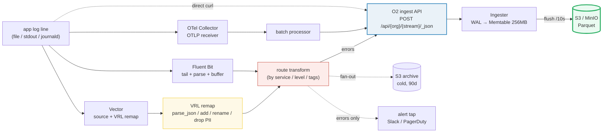

# OpenObserve Ingest Pipelines — Day 0 to Production

> Companion (ground truth): [openobserve_ingest.py](https://github.com/quanhua92/tutorials/blob/main/observability/openobserve_ingest.py)
> Live interactive: [openobserve_ingest.html](./openobserve_ingest.html)
> Output: [openobserve_ingest_output.txt](https://github.com/quanhua92/tutorials/blob/main/observability/openobserve_ingest_output.txt)
> Storage/query side: [OPENOBSERVE.md](./OPENOBSERVE.md)

How telemetry **gets into** OpenObserve. The full path: an app emits a log line
→ a collection agent (Fluent Bit / Vector / OTel Collector) tails it → an
optional transform (VRL) shapes it → a routing rule sends it to the right
stream → the agent POSTs a JSON batch to O2's ingest API → the Ingester writes
WAL → Memtable (256 MB) → Parquet → S3. This guide is the **ingest half**;
[OPENOBSERVE.md](./OPENOBSERVE.md) covers storage, query, and compaction.

## 0. TL;DR

- **Four ingestion sources** converge on one path: Fluent Bit (lightweight
  tail), Vector (Rust router + VRL), OTel Collector (the standard, OTLP), or a
  direct HTTP POST. All hit `POST /api/{org}/{stream}/_json` with Basic auth.
- **Day 0 = Fluent Bit → O2.** One `tail` INPUT + one `http` OUTPUT, ~15 min to
  first queryable log. Filesystem buffer survives restarts.
- **Day 1 = add Vector + VRL.** Parse embedded JSON, add fields, flatten/rename,
  drop PII (~9 µs/event), then route to per-domain streams (`errors`,
  `payment`, `default`).
- **Day 2 = multi-sink + schema evolution + backpressure tuning.** Fan-out to
  O2 + S3 archive + alert tap; auto-detect new fields (no reindex); size disk
  buffers for outage tolerance.
- **Routing is cheap:** O2 streams are one Parquet schema each — split by
  service/level so each has a tight schema + retention.
- **Backpressure is per-sink:** a slow S3 archive can't block O2; the agent
  buffers per destination and spills to disk before dropping.
- **Gold-check (end-to-end):** 6 sources × 833 eps × 480 B → **4997 eps**
  delivered to S3 (0.02% loss), 2.40 MB/s raw — well under the 31 MB/s
  single-node O2 ceiling.

🔗 [OPENOBSERVE](./OPENOBSERVE.md) — the storage/query side this ingests into.
🔗 [OPENTELEMETRY](./OPENTELEMETRY.md) — OTel Collector is the OTLP path here.

---

## 1. Architecture



> From `openobserve_ingest.py` Section A — the four sources:

```
  Fluent Bit      lightweight C agent. Tails files / Docker / journald,
                  -> parses, buffers (filesystem-backed), POSTs JSON to _json
  Vector          Rust agent/router. Rich source+sink catalog + VRL
                  -> transforms + conditional routing. HTTP/ES sink to O2.
  OTel Collector  the vendor-neutral standard. OTLP in, batch processor,
                  -> exporter to O2's OTLP endpoint. Logs+metrics+traces.
  direct API      any HTTP client. curl / SDK / app writes JSON arrays
                  -> straight to _json with Basic auth. Simplest path.
```

**Endpoints** (all converge on the Ingester):

| Signal | Endpoint | Body |
|---|---|---|
| Logs — JSON | `POST /api/{org}/{stream}/_json` | `[{...},{...}]` JSON array |
| Logs — `_bulk` | `POST /api/{org}/{stream}/_bulk` | Elasticsearch `_bulk` wire format |
| Logs — `_multi` | `POST /api/{org}/{stream}/_multi` | NDJSON (one object per line) |
| Logs/Traces — OTLP | `POST /otlp/v1/traces` | OTLP/HTTP (OTel Collector exporter) |
| Metrics | `POST /api/{org}/prometheus/api/v1/write` | Prometheus `remote_write` (Snappy+protobuf) |

---

## 2. Day 0 — Deploy & Configure (Fluent Bit → O2)

**Goal:** tail a log file, parse it, buffer to disk, flush as a JSON batch to
O2. Fastest path to first queryable log.

### 2.1 Prerequisites

- OpenObserve running (see [OPENOBSERVE.md §2](./OPENOBSERVE.md) Day 0):
  `http://localhost:5080`, root credentials.
- A stream exists (or let O2 auto-create on first ingest).

### 2.2 Fluent Bit config

```ini
[SERVICE]
    Flush             1              # seconds between flush attempts
    storage.path      /var/log/flb   # filesystem-backed buffer (survives restart)
    storage.sync      normal

[INPUT]
    Name              tail
    Path              /var/log/app/*.log
    Tag               app.*
    Mem_Buf_Limit     10MB           # in-RAM cap before spilling to disk
    Skip_Long_Lines   On
    DB                /var/log/flb/pos.db   # tail position (resume on restart)

[OUTPUT]
    Name              http
    Match             app.*
    Host              localhost
    Port              5080
    URI               /api/default/app_logs/_json
    Format            json           # JSON array body
    HTTP_User         admin@openobserve.dev
    HTTP_Passwd       ********       # O2 Basic auth token
    tls               Off
    Retry_Limit       5
```

> From `openobserve_ingest.py` Section B (Fluent Bit → O2 config).

### 2.3 Verify

```bash
# tail the Fluent Bit log — look for [output:http]
fluent-bit -c fluent-bit.conf

# in O2 UI: Data -> Logs -> stream "app_logs" should show events within ~1s
# or via API:
curl -G http://localhost:5080/api/default/_search \
     -u 'admin@openobserve.dev:********' \
     --data-urlencode 'query=SELECT * FROM app_logs ORDER BY _timestamp DESC LIMIT 5'
```

### 2.4 Day-0 throughput sanity

> From `openobserve_ingest.py` Section B (one second of ingest):

```
  events in   : 4,998
  raw bytes   : 2,544,645  (2.54 MB/s)
  buffer cap  : Mem_Buf_Limit = 10 MB (3.9s of headroom in RAM)
  flush       : every 1s, up to 2000 events/request
  -> 3 HTTP POSTs/sec to O2 (1,666 events each)
```

At 2.5 MB/s you're far under the 31 MB/s single-node ceiling — headroom to grow
~12× before needing to think about scaling.

---

## 3. Day 1 — First Transforms & Routing (Vector + VRL)

**Goal:** add a Vector stage to shape logs (VRL) and route them to per-domain
streams. This is where ingestion gets interesting.

### 3.1 Why Vector?

Fluent Bit is a great *shipper* (tail + forward). Vector adds a real
**transform layer**: the [Vector Remap Language](https://vector.dev/docs/reference/vrl/)
(VRL) — an expression-oriented, type-checked language that runs ~µs/event. One
`remap` transform + one `route` transform replaces a pile of ad-hoc filters.

### 3.2 VRL transforms (the four recipes)

> From `openobserve_ingest.py` Section C — applied to a payment log with an
> embedded JSON payload and a credit-card number:

```vrl
# 1. parse embedded JSON in .message
.message = parse_json(.message) ?? {"raw": .message}

# 2. add derived fields
.env = "prod"
.source_type = "fluentbit"
.ingested_at = now()

# 3. flatten + rename
.txn_id  = .message.txn
.amount  = to_int(.message.amount) ?? 0
del(.message)

# 4. drop PII
.cc_redacted = true
del(.message.cc)        # or use redact() for pattern-based scrubbing
```

**Final event** (clean, queryable, PII-free):

```json
{"_timestamp":1716950400000000,"amount":4200,"cc_redacted":true,"env":"prod",
 "host":"ip-10-0-0-9","level":"info","service":"payment","txn_id":"txn_8821"}
```

> VRL cost: **9 µs/event × 4,998 events = 0.045 s CPU/s** — a single Vector
> core handles ~80k eps before CPU-bound (openobserve_ingest.py Section C).

### 3.3 Routing — route transform → per-stream sinks

O2 streams are cheap (one Parquet schema each). Route so each stream has a
tight schema + its own retention:

| Condition | Stream | Purpose |
|---|---|---|
| `level == 'error'` | `errors` | all ERROR across services |
| `service == 'payment'` | `payment` | payment domain (PII-redacted) |
| `service == 'auth'` | `auth` | login events, 90d retention |
| `match_all('declined')` | `fraud` | FTS match → investigation |
| `(default)` | `default` | everything else |

```toml
# vector.toml — route transform -> per-stream sinks
[transforms.route]
  type = "route"
  inputs = ["remap_out"]
  route.errors   = '.level == "error"'
  route.payment  = '.service == "payment"'
  route.fraud    = 'match(match_all("declined"), .message) ?? false'

[sinks.o2_errors]
  type   = "http"
  inputs = ["route.errors"]
  uri    = "http://localhost:5080/api/default/errors/_json"
  encoding.codec = "json"
  auth.strategy = "basic"
  auth.user     = "admin@openobserve.dev"
  auth.password = "${O2_PASS}"

[sinks.o2_default]
  type   = "http"
  inputs = ["route._unmatched"]      # everything not matched above
  uri    = "http://localhost:5080/api/default/default/_json"
  encoding.codec = "json"
  auth.strategy = "basic"
  auth.user     = "admin@openobserve.dev"
  auth.password = "${O2_PASS}"
```

> From `openobserve_ingest.py` Section D (routing simulation, 4,998 eps):

```
  stream payment    1,624 events/s  (32.5%)
  stream prod       2,147 events/s  (43.0%)
  stream fraud        163 events/s  ( 3.3%)
  stream default    1,064 events/s  (21.3%)
```

**Test VRL live** in the [interactive tester](./openobserve_ingest.html) or the
official [VRL playground](https://playground.vrl.dev/).

---

## 4. Day 2 — Scale, Multi-Sink, Schema Evolution, Backpressure

### 4.1 Multi-sink fan-out (O2 + S3 archive + alert)

A pipeline rarely has one destination. Vector feeds N sinks from one transform;
each is **independent and backpressured separately** — a slow archive can't
block O2.

| Sink | Target | Role | Kind |
|---|---|---|---|
| `o2_ingest` | `http → /api/default/logs/_json` | live search + alerts | primary |
| `s3_archive` | `aws_s3` sink (raw gzip) | 90d cold archive, S3 IA $0.0125/GB | secondary |
| `alert_tap` | webhook (errors only) | PagerDuty/Slack < 5s | conditional |

> From `openobserve_ingest.py` Section E (fan-out latencies):

```
  sink         latency_ms delivered_eps     loss
  ------------------------------------------------
  o2_ingest           12          4,998        0
  s3_archive         340          4,998        0
  alert_tap            4          4,998        0
```

A 340 ms S3 archive latency does **not** slow the 12 ms O2 sink — Vector
buffers per-sink.

### 4.2 Schema evolution — new fields, no reindex

O2 has no declared schema. On ingest it infers Arrow types from JSON and
registers the stream schema. When a new field appears later, it's auto-added;
old Parquet files return NULL for it.

> From `openobserve_ingest.py` Section F:

```
  day 1: 4 fields  + new: ['_timestamp', 'level', 'log', 'service']
  day 2: 5 fields  + new: ['latency_ms']
  day 3: 6 fields  + new: ['user_id']
  day 4: 7 fields  + new: ['trace_id']
  day 5: 8 fields  + new: ['region']
```

| Field | Cardinality | Cost/file | Cost/day (250 files) |
|---|---|---|---|
| `env`, `level`, `region` | low | ~3 KB (dictionary/RLE) | ~0.75 MB |
| `user_id`, `trace_id` | high | ~800 KB | ~200 MB |

Schema growth is **cheap** because Parquet is columnar: a new column only adds
a column chunk per file. 4 new columns ≈ 0.6 GB/month — trivial vs base ingest.

### 4.3 Backpressure & buffer sizing

Every stage has a buffer (RAM or disk) + a batch policy. When downstream can't
keep up, the upstream buffer fills; once full, the agent spills to disk then
drops.

**Batch size vs memory** (Vector http sink):

```
  sink.batch.max_events = 1000
  sink.batch.max_bytes  = 4,000,000 (4 MB)
  effective batch = min(1000, 8333) = 1,000 events
  in-flight memory per sink = 1000 x 480 B = 0.48 MB
```

**Outage tolerance** — the key Day-2 number:

> From `openobserve_ingest.py` Section G (O2 down 30s scenario):

```
  incoming       : 4,998 eps x 480 B = 2.40 MB/s
  disk buffer    : 10 GB (10,000,000,000 B)
  time to fill   : 10,000,000,000 / 2,399,040 = 4168s (69.5 min)
  => 10 GB disk buffer buys ~69 minutes of O2 outage tolerance
```

**Backpressure actions (in order):**

1. RAM buffer fills (1000 events) → spill to disk buffer
2. disk buffer fills → DROP oldest (default) or BLOCK (lossless)
3. set `when = 'max_size'` on disk buffer to cap + warn

Fluent Bit mirrors this with `storage.type = filesystem`: `Mem_Buf_Limit`
(10 MB) in RAM, then `storage.path` disk chunks absorb the rest.

### 4.4 End-to-end throughput (gold-check)

> From `openobserve_ingest.py` Section H:

| Stage | events/s | MB/s | RAM MB | CPU s/s | Role |
|---|---|---|---|---|---|
| 1 source (app) | 4,998 | 2.40 | 0 | 0.000 | producer |
| 2 Fluent Bit | 4,998 | 2.40 | 10 | 0.010 | parse+buffer |
| 3 Vector VRL | 4,997 | 2.40 | 0.48 | 0.045 | transform+route |
| 4 O2 ingest API | 4,997 | 2.40 | 0 | 0.000 | HTTP receive |
| 5 O2 Ingester→S3 | 4,997 | 2.40 | 256 | 0.000 | WAL→Parquet |

```
  END-TO-END: 4,997/4,998 eps delivered (loss 1 = 0.02%)
  bottleneck : O2 Ingester ceiling = 31 MB/s; here 2.40 MB/s << OK
  GOLD: effective throughput = 4997 eps, loss = 0.02%, raw = 2.40 MB/s
```

This value is recomputed in JS by
[openobserve_ingest.html](./openobserve_ingest.html) and gold-checked against
`openobserve_ingest_output.txt`.

---

## 5. Choosing a source

| Need | Pick | Why |
|---|---|---|
| Cheapest footprint + file tail | **Fluent Bit** | ~450 KB C binary, tiny RAM |
| Transform + route + multi-sink | **Vector** | Rust + VRL, rich sink catalog |
| Unified logs+metrics+traces | **OTel Collector** | the vendor-neutral standard |
| Quick test / app SDK | **direct API** | one `curl` to `_json` |

---

### Killer Gotchas

| Trap | Symptom | Fix |
|---|---|---|
| **Auth wrong / token in plaintext** | 401 on every POST, nothing ingested | Use `${O2_PASS}` env var, not a literal in config; verify Basic auth header |
| **Stream name mismatch** | Data lands in `default` not your stream | URI must be `/api/{org}/{stream}/_json` — the stream in the URI wins |
| **No disk buffer** | Agent OOMs or drops on burst; data loss on O2 blip | Set `storage.type filesystem` (FB) / disk buffer (Vector); size for outage tolerance |
| **VRL parse errors silent** | Events vanish (routed to `_unmatched` or dropped) | Use `?? {}` fallback; add a DLQ sink for `route._unmatched` |
| **High-cardinality field explosion** | Schema bloats; `user_id`/`trace_id` columns slow scans | Don't flatten unbounded JSON; cap `ZO_INGEST_FLATTEN_LEVEL`; route hot fields to a separate stream |
| **Backpressure misconfigured** | Slow archive blocks O2 (shared queue) | Use per-sink buffers; Vector isolates backpressure per destination |
| **Big batches → latency** | Sub-second alert tap delayed by batching | Split alert tap to its own sink with small `max_events` / timeout |
| **Tail DB lost** | Re-ingests whole file on restart (duplicates) | Persist Fluent Bit `DB` pos file on a volume that survives restart |
| **OTLP vs JSON mismatch** | OTel Collector sends OTLP, stream expects JSON | Match exporter to endpoint: OTLP → `/otlp/v1/traces`, JSON → `/_json` |

### Cheat Sheet

```bash
# direct ingest (JSON) — simplest test
curl http://localhost:5080/api/default/logs/_json \
     -u 'admin@openobserve.dev:********' \
     -H 'Content-Type: application/json' \
     -d '[{"level":"error","service":"api","log":"boom","_timestamp":1716950400000000}]'

# verify in O2
curl -G http://localhost:5080/api/default/_search \
     -u 'admin@openobserve.dev:********' \
     --data-urlencode 'query=SELECT * FROM logs WHERE level="error" ORDER BY _timestamp DESC LIMIT 20'
```

| Need | Value / command |
|---|---|
| JSON ingest endpoint | `POST /api/{org}/{stream}/_json` (Basic auth) |
| OTLP endpoint | `POST /otlp/v1/traces` (OTel Collector) |
| Metrics endpoint | `POST /api/{org}/prometheus/api/v1/write` |
| Fluent Bit buffer cap | `Mem_Buf_Limit` 10 MB → then `storage.path` disk |
| Vector batch | `max_events` 1000 / `max_bytes` 4 MB |
| VRL cost | ~9 µs/event (~80k eps/core) |
| O2 Memtable | 256 MB (`ZO_MAX_FILE_SIZE_IN_MEMORY`) |
| O2 single-node ceiling | 31 MB/s (~3.9 MB/s per vCPU) |
| Outage tolerance | 10 GB disk buffer ≈ 70 min @ 2.4 MB/s |
| Schema evolution | auto-detect on ingest, no reindex |

---

## Sources

- OpenObserve — Data Ingestion Overview: https://openobserve.ai/docs/ingestion/
- OpenObserve — Log Ingestion Methods (JSON/OTLP/_bulk/_multi): https://openobserve.ai/docs/ingestion/logs/
- OpenObserve — Fluent Bit Log Ingestion: https://openobserve.ai/docs/ingestion/logs/fluent-bit/
- OpenObserve — Vector Log Aggregation & Routing: https://openobserve.ai/docs/ingestion/logs/vector/
- OpenObserve — OTLP / OTel Collector Ingestion: https://openobserve.ai/docs/ingestion/logs/otlp/
- OpenObserve — Curl Log Ingestion (HTTP API): https://openobserve.ai/docs/ingestion/logs/curl/
- OpenObserve — Ingestion API Reference: https://openobserve.ai/docs/reference/api/ingestion/logs/json/
- OpenObserve — Streams & Schema Settings: https://openobserve.ai/docs/user-guide/data-processing/streams/schema-settings/
- OpenObserve — Field & Index Types in Streams: https://openobserve.ai/docs/user-guide/data-processing/streams/data-type-and-index-type-in-streams/
- OpenObserve — Pipelines (parse/enrich/route at ingest): https://openobserve.ai/docs/user-guide/data-processing/pipelines/pipelines/
- OpenObserve — Environment Variables (ingest tuning): https://openobserve.ai/docs/administration/configuration/environment-variables/
- OpenObserve — Sensitive Data Redaction: https://openobserve.ai/docs/user-guide/account-administration/management/sensitive-data-redaction/
- Fluent Bit — OpenObserve Output Plugin: https://docs.fluentbit.io/manual/pipeline/outputs/openobserve
- Fluent Bit — HTTP Output Plugin: https://docs.fluentbit.io/manual/pipeline/outputs/http
- Fluent Bit — Storage / Buffer (filesystem type): https://docs.fluentbit.io/manual/administration/buffering-and-storage/
- Vector — Remap Transform (VRL): https://vector.dev/docs/reference/configuration/transforms/remap/
- Vector — Vector Remap Language (VRL) Reference: https://vector.dev/docs/reference/vrl/
- Vector — Route Transform: https://vector.dev/docs/reference/configuration/transforms/route/
- Vector — HTTP Sink: https://vector.dev/docs/reference/configuration/sinks/http/
- Vector — AWS S3 Sink: https://vector.dev/docs/reference/configuration/sinks/aws_s3/
- VRL Playground (interactive): https://playground.vrl.dev/
- Vector GitHub repo (Rust, VRL): https://github.com/vectordotdev/vector
- Fluent Bit GitHub repo (C): https://github.com/fluent/fluent-bit
- OpenTelemetry Collector docs (OTLP, batch processor): https://opentelemetry.io/docs/collector/
- OpenObserve GitHub repo (Rust + Vue, S3-native): https://github.com/openobserve/openobserve
- OpenObserve ingestion rate-limiting discussion (backpressure): https://github.com/openobserve/openobserve/discussions/4838
