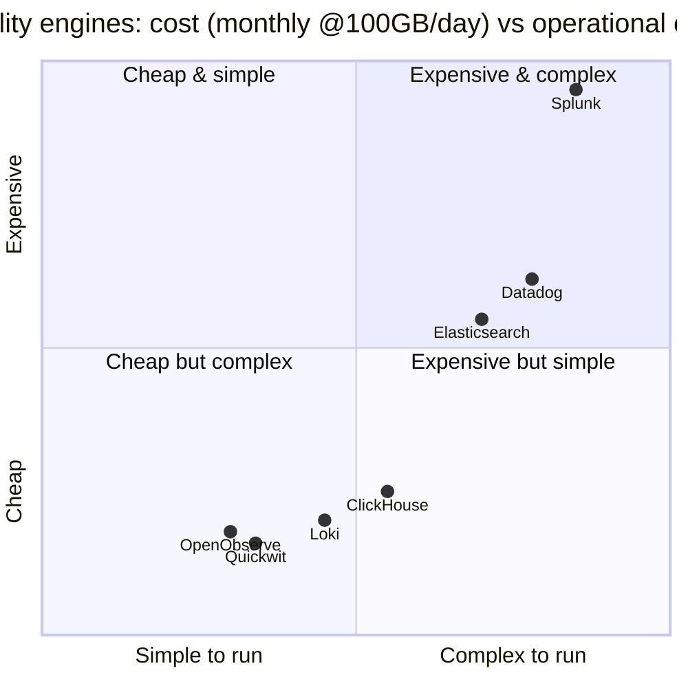
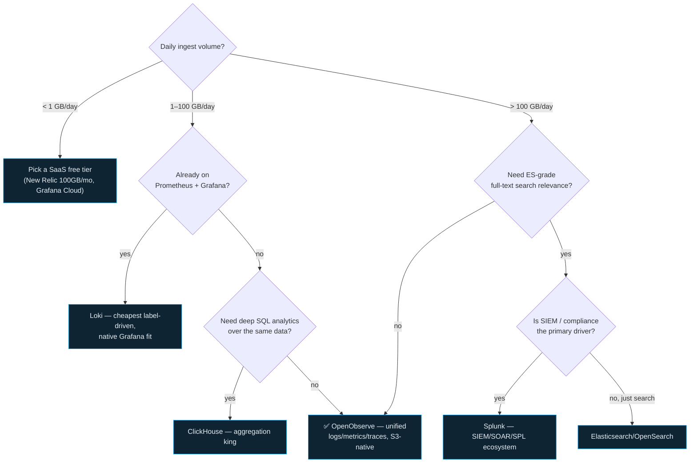

# OpenObserve vs Alternatives — Day 0 to Production

> Companion: [openobserve_vs_alternatives.py](https://github.com/quanhua92/tutorials/blob/main/observability/openobserve_vs_alternatives.py)
> Live: [openobserve_vs_alternatives.html](./openobserve_vs_alternatives.html)
> Sibling: [OPENOBSERVE.md](https://github.com/quanhua92/tutorials/blob/main/observability/OPENOBSERVE.md) · [LOKI.md](https://github.com/quanhua92/tutorials/blob/main/observability/LOKI.md)

## 0. TL;DR

Seven observability storage engines, **three economic models**. The whole comparison reduces to one question: **where do the bytes live, and what does the index cost?**

| Model | Engines | Bytes live on | Index | Compute scales with |
|---|---|---|---|---|
| **S3-native** | OpenObserve, Quickwit, ClickHouse, Loki | S3 (Parquet/chunks) | tantivy / sparse / labels | ingest rate (≈flat vs history) |
| **Local-disk** | Elasticsearch, Splunk | EBS / NVMe | Lucene / bucket | **stored volume** (grows forever) |
| **SaaS** | Datadog | vendor-managed | managed | n/a — priced per GB ingested |

> **The headline:** at 1 TB/day × 30d retention, Elasticsearch storage costs **$4,800/mo vs OpenObserve $46/mo = 104×**. Add compute and Splunk's license and Splunk runs **$59,566/mo vs Quickwit $202/mo = 295×**. The gap *widens* with volume and retention — that is the entire pitch for S3-native.

All numbers below are computed by `openobserve_vs_alternatives.py` (AWS us-east-1 2025 pricing, representative compression/throughput ratios, seeded RNG). Re-run and re-paste — nothing here is hand-computed.

---

## 1. The field at a glance

| Engine | Lang | Storage | Format | Index | S3-native | License |
|---|---|---|---|---|---|---|
| **OpenObserve** | Rust | S3 (object) | Parquet col. | Tantivy FTS | **yes** | OSS (Apache-2.0) |
| **Elasticsearch** | Java | local EBS (gp3) | inverted index | Lucene | no | source-available (SSPL); OpenSearch=Apache-2.0 |
| **Loki** | Go | S3 (chunks) | gzip chunks | labels only | **yes** | OSS (AGPL-3.0) |
| **Quickwit** | Rust | S3 (object) | Parquet + tantivy | tantivy | **yes** | OSS (AGPL-3.0) |
| **ClickHouse** | C++ | S3-backed / EBS | MergeTree col. | sparse + skip idx | **yes** | OSS (Apache-2.0) |
| **Splunk** | C++ | local disk (EBS) | bucket index | SPL | no | Commercial |
| **Datadog** | SaaS | managed (opaque) | proprietary | managed | n/a | Commercial (SaaS) |

**Operational complexity** (roles *you* run, self-hosted):

| Engine | Roles | Notes |
|---|---|---|
| OpenObserve | 5 | single binary collapses all 5; HA adds NATS+PG+S3 |
| Elasticsearch | 5 | Master, Data, Coordinating, Kibana, Logstash/Beats |
| Loki | 6 | + needs Grafana for UI; ingesters keep a chunk WAL |
| Quickwit | 3 | Indexer, Searcher, Control plane / Metastore (PG) |
| ClickHouse | 3 | replica + Keeper (ZK) quorum + S3 |
| Splunk | 6 | Indexer, Search Head, Cluster Master, Forwarders, Deployer, License Master |
| Datadog | 1 | the Agent — that's it |

---

## 2. Cost vs complexity — the quadrant



The S3-native cluster (O2, Quickwit, Loki, ClickHouse) crowds the bottom-left. SaaS (Datadog) buys simplicity at ingest-pricing; Splunk is the expensive-and-complex outlier.

---

## 3. Storage cost math — S3 vs EBS

The single biggest cost driver is **where bytes live**. Object storage is **3.5× cheaper per GB** than block storage *before* compression. S3-native engines win twice: cheaper medium **and** higher compression (columnar Parquet vs an inverted index that *adds* size).

**Pricing basis (AWS us-east-1, 2025 public):**

| Medium | $/GB-month |
|---|---|
| S3 Standard | $0.023 |
| S3 IA (cold tier) | $0.0125 |
| EBS gp3 (ES / Splunk hot data) | $0.080 |

**Storage multiplier** = net bytes stored per byte of raw ingest × retention:

| Engine | Multiplier | Why | Medium |
|---|---|---|---|
| OpenObserve | 1/15 | Parquet + zstd | S3 |
| Quickwit | 1/14 | Parquet + tantivy | S3 |
| Loki | 1/8 | gzip chunks, labels only | S3 |
| ClickHouse | 1/10 | MergeTree + zstd | S3/EBS |
| Elasticsearch | 2.0× | primary + replica, net ~raw | EBS |
| Splunk | 1.5× | bucket index | EBS |
| Datadog | N/A | priced per GB ingested | managed |

> 💡 **STORAGE cost / month** (from `openobserve_vs_alternatives_output.txt` Section B):
>
> | ingest/day | O2 | Quickwit | Loki | ClickHouse | Elasticsearch | Splunk |
> |---|---|---|---|---|---|---|
> | 1 GB/d | $0.046 | $0.049 | $0.086 | $0.069 | $4.80 | $3.60 |
> | 100 GB/d | **$4.60** | $4.93 | $8.62 | $6.90 | $480.00 | $360.00 |
> | 1 TB/d | **$46.00** | $49.29 | $86.25 | $69.00 | $4,800 | $3,600 |
>
> At 1 TB/day, ES storage is **104×** O2. O2's official headline is "140× lower storage cost" — this transparent model lands ~104× on storage alone (the right order of magnitude; the gap reaches 140× on specific configurations).

---

## 4. Compute cost — stateless nodes vs data-node clusters

Storage is half the bill. The other half is compute, and the two economic models diverge sharply:

- **S3-native:** ingest nodes scale with **ingest rate**; queriers are stateless and cache Parquet in RAM. Neither grows with retained history → compute stays ~flat as data ages.
- **Local-disk (ES/Splunk):** data nodes must **hold** indices on disk + heap in RAM. The cluster **grows with stored volume** → every extra TB of retention buys more nodes, forever.

**Compute basis** (AWS us-east-1, 2025 on-demand, ×730 h/month):

| instance | vCPU | RAM GiB | NVMe | $/hr | $/mo | use |
|---|---|---|---|---|---|---|
| t3.medium | 2 | 4 | no | $0.0416 | $30.37 | querier / Keeper |
| c6i.large | 2 | 4 | no | $0.0848 | $61.90 | ES master |
| r5.large | 2 | 16 | no | $0.126 | $91.98 | ingest / ES data |
| i3.large | 2 | 15.25 | yes | $0.156 | $113.88 | Splunk indexer |

> 💡 **COMPUTE cost / month** (Section C):
>
> | ingest/day | O2 | Quickwit | Loki | ClickHouse | Elasticsearch | Splunk |
> |---|---|---|---|---|---|---|
> | 1 GB/d | $122.35 | $122.35 | $122.35 | $213.45 | $277.69 | $205.86 |
> | 100 GB/d | $122.35 | $122.35 | $122.35 | $213.45 | $1,106 | $1,117 |
> | 1 TB/d | $244.70 | $152.72 | $152.72 | $243.82 | $8,832 | $10,341 |
>
> From 1 GB/day → 1 TB/day, compute scales **ES ×32 vs O2 ×2**. ES compute explodes because every TB of retention = more data nodes; O2 compute barely moves (only ingest-node count rises).

---

## 5. Total monthly cost (storage + compute + license)

The full TCO picture across three volume regimes. SaaS has no separate storage/compute line — one ingest-priced fee. Splunk adds a per-GB/day license on top.

> 💡 **=== 1 GB/day × 30d ===** (Section D) — *cost is NOT the differentiator here*
>
> | Engine | storage | compute | license | TOTAL |
> |---|---|---|---|---|
> | Datadog | $0.000 | $0.000 | $15.21 | **$15.21** ← cheapest |
> | OpenObserve | $0.046 | $122.35 | $0.000 | $122.39 |
> | Quickwit | $0.049 | $122.35 | $0.000 | $122.40 |
> | Loki | $0.086 | $122.35 | $0.000 | $122.43 |
> | ClickHouse | $0.069 | $213.45 | $0.000 | $213.52 |
> | Splunk | $3.60 | $205.86 | $45.62 | $255.09 |
> | Elasticsearch | $4.80 | $277.69 | $0.000 | $282.49 |

> 💡 **=== 100 GB/day × 30d ===** — *S3-native pulls ahead*
>
> | Engine | storage | compute | license | TOTAL |
> |---|---|---|---|---|
> | OpenObserve | $4.60 | $122.35 | $0.000 | **$126.95** ← cheapest |
> | Quickwit | $4.93 | $122.35 | $0.000 | $127.28 |
> | Loki | $8.62 | $122.35 | $0.000 | $130.97 |
> | ClickHouse | $6.90 | $213.45 | $0.000 | $220.35 |
> | Datadog | $0.000 | $0.000 | $1,521 | $1,521 |
> | Elasticsearch | $480.00 | $1,106 | $0.000 | $1,586 |
> | Splunk | $360.00 | $1,117 | $4,562 | $6,039 |
>
> Splunk is **48×** the cheapest (O2).

> 💡 **=== 1 TB/day × 30d ===** — *the S3-native home turf; 10–100× gaps*
>
> | Engine | storage | compute | license | TOTAL |
> |---|---|---|---|---|
> | Quickwit | $49.29 | $152.72 | $0.000 | **$202.00** ← cheapest |
> | Loki | $86.25 | $152.72 | $0.000 | $238.97 |
> | OpenObserve | $46.00 | $244.70 | $0.000 | $290.70 |
> | ClickHouse | $69.00 | $243.82 | $0.000 | $312.82 |
> | Elasticsearch | $4,800 | $8,832 | $0.000 | $13,632 |
> | Datadog | $0.000 | $0.000 | $15,208 | $15,208 |
> | Splunk | $3,600 | $10,341 | $45,625 | $59,566 |
>
> Splunk is **295×** the cheapest (Quickwit). Note Quickwit edges O2 here only because its higher per-vCPU ingest throughput means fewer ingest nodes; O2 stays within ~1.4×.

---

## 6. Query benchmark — same log search over 1 TB

Same workload for every engine: search 1 TB of retained logs for a rare error string + `GROUP BY service` over the last 24h. Latency reflects the **index strategy**.

> 💡 **Section E** (seeded LCG jitter ±10%):
>
> | Engine | Index strategy | p50 (ms) | p99 (ms) | vs fastest p50 |
> |---|---|---|---|---|
> | Elasticsearch | Lucene | **78** | 308 | 1.0× |
> | ClickHouse | sparse + skip idx | 98 | 433 | 1.3× |
> | OpenObserve | Tantivy FTS | 109 | 491 | 1.4× |
> | Quickwit | tantivy | 169 | 695 | 2.2× |
> | Datadog | managed | 210 | 771 | 2.7× |
> | Splunk | SPL | 255 | 1,196 | 3.3× |
> | Loki | labels only | 3,068 | 9,425 | **39.5×** |

**Reading the result:**
- **Elasticsearch** wins needle-in-haystack full-text (Lucene posting list = O(1) term lookup). The price you pay: that index is what makes ES storage + compute so expensive.
- **Loki LOSES badly** on content search: no content index, so `|= "error"` must decompress + scan chunks. It is unbeatable on *cost* but you accept slow ad-hoc text search (use labels instead).
- **O2 / Quickwit** (tantivy) land close to ES at a fraction of the cost. **ClickHouse** is the aggregation king (columnar vectorised scan).

---

## 7. Decision tree — should you use OpenObserve?



### When each engine WINS

| Engine | Pick it when… | Killer trait |
|---|---|---|
| **OpenObserve** | You want cost + S3-native + unified logs/metrics/traces in one binary | ~15× compression, stateless queriers, single Rust binary |
| **Elasticsearch** | You need mature full-text search relevance, percolation, huge plugin/SIEM ecosystem | Lucene inverted index = fastest needle-in-haystack |
| **Loki** | Already on Prometheus + Grafana; want cheap, label-driven log queries | Label-only index = near-zero ingest cost |
| **Quickwit** | Petabyte-scale S3 search, decoupled compute/storage, pure OSS | Highest per-vCPU ingest among S3-native search engines |
| **ClickHouse** | Blistering SQL aggregations / analytics over petabytes | Columnar batch ingest (30 MB/s/vCPU), best compression-aggregation combo |
| **Splunk** | Enterprise SIEM/SOAR, SPL, compliance, 2800+ apps | Deepest security-investigation query language |
| **Datadog** | Zero-ops SaaS, best-in-class APM + logs + metrics correlation | 700+ integrations, one-click log→trace pivot |

### When OpenObserve does NOT win

- You need **Elasticsearch-grade search relevance ranking / percolation** queries.
- You need **Loki's extreme label-driven cheapness** and already run Grafana end-to-end.
- You need **ClickHouse's analytics SQL depth** for non-log workloads (ad-hoc OLAP).
- You want **zero ops** and will pay SaaS per-GB (Datadog / New Relic).

---

## 8. Ingestion throughput

| Engine | MB/s per vCPU | notes |
|---|---|---|
| OpenObserve | 3.9 | SIMD parse (31 MB/s on 8-core M2, pinned) |
| Elasticsearch | 2.5 | JVM overhead + indexing cost |
| Loki | 6.0 | label-only = cheap per event |
| Quickwit | 8.0 | Rust, S3-native, optimized |
| ClickHouse | **30.0** | columnar batch ingest |
| Splunk | 3.0 | parsing + bucketing |
| Datadog | N/A | managed |

> Higher MB/s/vCPU = fewer nodes for the same ingest rate. ClickHouse's columnar batch path crushes single-event ingest; Loki's label-only path is cheap per event. O2's 3.9 MB/s/vCPU comes from 31 MB/s on an 8-core M2 (pinned in [openobserve.py](https://github.com/quanhua92/tutorials/blob/main/observability/openobserve.py) Section A).

---

## 9. Killer Gotchas

| # | Pitfall | Engine | Impact | Mitigation |
|---|---|---|---|---|
| 1 | **Loki content search scans chunks** | Loki | `|= "error"` over unindexed text = **3,068 ms p50** (39× ES). | Drive queries through **labels**, not text; add structured fields. |
| 2 | **ES data-node cluster scales with volume** | Elasticsearch | Compute grows **×32** from 1 GB→1 TB/day; every TB retained = more nodes, forever. | Move to S3-native (O2/Quickwit) before ~50 GB/day, or freeze/ILM tier aggressively. |
| 3 | **Splunk license scales with ingest, not value** | Splunk | $45,625/mo **license alone** at 1 TB/day; the budget black hole. | Route noisy logs to a cheaper tier; keep Splunk for SIEM-grade only. |
| 4 | **Datadog is priced per GB ingested, not stored** | Datadog | No compression benefit to you — cost is linear in ingest. $15,208/mo at 1 TB/day. | Pre-filter / sample at the agent; archive cold logs to your own S3. |
| 5 | **ClickHouse needs a Keeper (ZK) quorum** | ClickHouse | +3 t3.medium nodes always-on; merge storms can stall inserts under load. | Size Keeper for RAM (not disk); watch `Too many parts` errors. |
| 6 | **OpenObserve ecosystem is younger than ELK/Loki** | OpenObserve | Fewer community integrations/plugins; less battle-tested at 7-figure scale. | Budget for OTel-native pipelines; pin a release; test the HA mode (NATS+PG). |
| 7 | **Elastic license is SSPL, not OSI-OSS** | Elasticsearch | Some orgs' policy bans SSPL → fork to OpenSearch. | Evaluate OpenSearch (Apache-2.0) for the same Lucene engine. |
| 8 | **"140× lower cost" is configuration-dependent** | OpenObserve | Storage-only model lands ~104× at 1 TB/day; full TCO ratio vs ES is ~47×. | Model *your* workload with `openobserve_vs_alternatives.py` before quoting. |

---

## 10. Cheat Sheet

```
PICK BY VOLUME:
  < 1 GB/day    -> SaaS free tier (cost irrelevant; ops matter)
  1-100 GB/day  -> OpenObserve (or Loki if on Grafana already)
  > 100 GB/day  -> S3-native (O2 / Quickwit / Loki / ClickHouse) — 10-100x cheaper

PICK BY NEED:
  cheapest storage ............ OpenObserve / Quickwit (S3 Parquet)
  fastest full-text search .... Elasticsearch (Lucene)
  cheapest label-driven logs .. Loki (no content index)
  best SQL aggregation ........ ClickHouse (columnar)
  SIEM / compliance ........... Splunk (SPL + SOAR)
  zero ops .................... Datadog (SaaS, per-GB)

COST MATH (AWS us-east-1 2025):
  S3 $0.023/GB-mo  |  EBS gp3 $0.080/GB-mo  (3.5x gap, pre-compression)
  O2 1/15  Quickwit 1/14  Loki 1/8  CH 1/10  ES 2.0x  Splunk 1.5x
  @1 TB/day storage:  O2 $46  vs  ES $4,800  =  104x
  @1 TB/day total:    Quickwit $202  vs  Splunk $59,566  =  295x
```

---

## Sources

- OpenObserve — docs & comparison: https://openobserve.ai/docs/ , https://openobserve.ai/comparison/
- OpenObserve — GitHub (140× storage claim, vs Splunk table): https://github.com/openobserve/openobserve
- OpenObserve — log management tools comparison (2026): https://openobserve.ai/blog/log-management-tools/
- OpenObserve — Elasticsearch alternatives: https://openobserve.ai/blog/elasticsearch-alternatives/
- Loki — docs (chunk store, label indexing, LogQL): https://grafana.com/docs/loki/
- Quickwit — docs (S3-native search, decoupled compute/storage): https://quickwit.io/
- ClickHouse — best open-source observability solutions (90% lower storage): https://clickhouse.com/resources/engineering/best-open-source-observability-solutions
- ClickHouse — observability cost optimization playbook (ClickStack): https://clickhouse.com/resources/engineering/observability-cost-optimization-playbook
- Elasticsearch — docs (inverted index, Lucene): https://www.elastic.co/guide/en/elasticsearch/reference/current/documents-indices.html
- Splunk — observability pricing ($15/host/mo; volume licensing): https://www.splunk.com/en_us/products/pricing/observability.html
- AWS pricing — S3, EBS gp3, EC2 (us-east-1): https://aws.amazon.com/s3/pricing/ , https://aws.amazon.com/ebs/pricing/ , https://aws.amazon.com/ec2/pricing/on-demand/
- Sibling bundles: [openobserve.py](https://github.com/quanhua92/tutorials/blob/main/observability/openobserve.py) · [loki.py](https://github.com/quanhua92/tutorials/blob/main/observability/loki.py)
