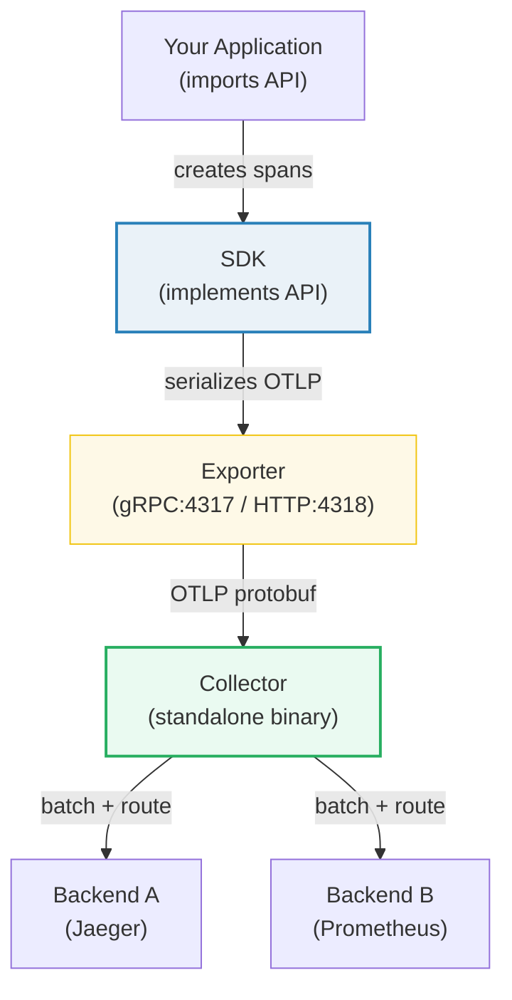
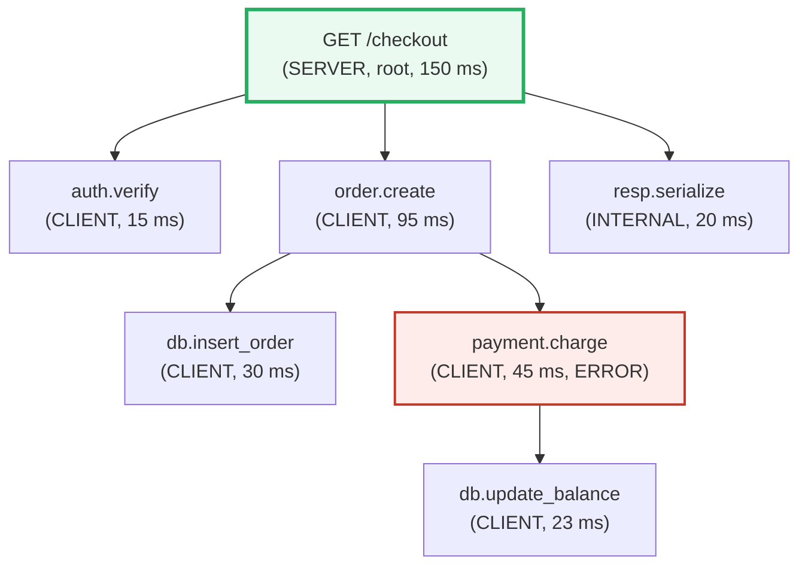
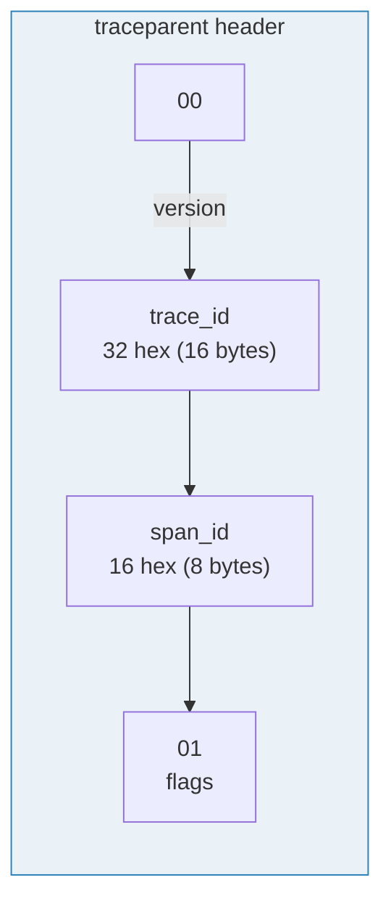
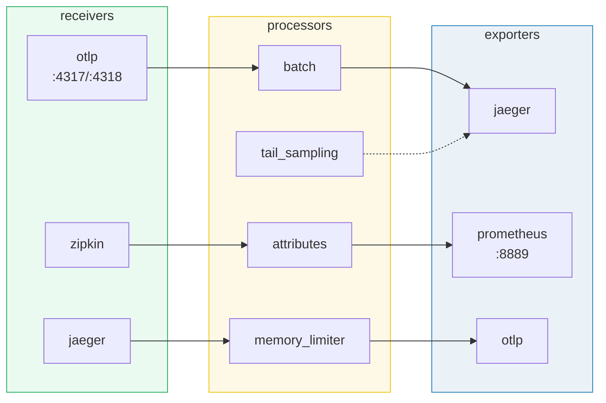

# OpenTelemetry — Day 0 to Production

> **Companion code:** [`opentelemetry.py`](https://github.com/quanhua92/tutorials/blob/main/observability/opentelemetry.py).
> **Live demo:** [`opentelemetry.html`](./opentelemetry.html) — open in a browser.
> Every number in this guide is printed by `python3 opentelemetry.py` — nothing hand-computed.

---

## 0. TL;DR — the one idea

> **The analogy:** OpenTelemetry is a **universal plug**. Your application is
> the appliance; the Collector is the wall outlet; Jaeger/Datadog/Honeycomb
> are the power plant. You instrument your code ONCE (the plug) and swap
> backends (the plant) by changing a config file — never touching application
> code. Before OTel, every vendor had its own library; switching meant
> rewriting every `tracer.start_span(...)`.

The five layers, top to bottom:



| Layer | Role | Configured by |
|---|---|---|
| **API** | Interfaces only (Tracer, Span, Meter). Zero behavior. | Library author (fixed) |
| **SDK** | Creates real spans, runs sampler, batches, exports. | Application (env vars / code) |
| **Exporter** | OTLP protobuf over gRPC or HTTP. | Application (env vars) |
| **Collector** | Receives, processes, exports. Decouples apps from backends. | Ops (YAML config) |
| **Backend** | Storage + UI (Jaeger, Tempo, Datadog). | Ops (docker / hosted) |

> **The key separation:** Libraries import the API (never the SDK). The
> application installs exactly ONE SDK at startup. Swap backends = change the
> Collector config, never the application code.

---

## 1. Architecture

### Request → trace → spans

A single user request fans out into a **trace** — a tree of **spans**, one
per unit of work. Each span has a parent; the root span has none. Context
(the `traceparent` header) is injected into every outgoing HTTP/gRPC call and
extracted on the other side — that is how the tree is stitched across
process boundaries.



> From `opentelemetry.py` Section B:

```
  Trace ID: 1bb891f6f764cd8293d0c9ceeffc85da
  Spans: 7    Max depth: 4
  Root duration: 150 ms
```

### Span lifecycle

```
1. start_span(name, kind)    -> assign span_id, parent_id
2. set_attribute(k, v)        -> key-value metadata
3. add_event(name, attrs)     -> timestamped log IN the span
4. add_link(span_ctx)         -> cross-trace reference
5. set_status(OK / ERROR)     -> outcome
6. end_span()                 -> fix end_time, enqueue export
```

### W3C Trace Context (`traceparent`)



The header `00-<traceId>-<spanId>-<flags>` is injected into every outgoing
request. The receiving service extracts it, creates a child span (its own
`span_id`), and re-injects. The `trace_id` stays constant for the entire
trace; the `span_id` changes at each hop.

> From `opentelemetry.py` Section C — request crossing Gateway → Auth → Order:

```
[Gateway]  traceparent: 00-6019debf...-90898eafbc459acb-01
[Auth]     traceparent: 00-6019debf...-a8c166a754fdf243-01
[Order]    traceparent: 00-6019debf...-c0f93e9fecb54abb-01
```

> Same `trace_id` (stitches the trace), different `span_id` at each hop.

### Collector pipeline



---

## 2. Day 0 — Deploy & Configure

### 2a. Start the Collector + Jaeger + Prometheus (docker-compose)

```yaml
# docker-compose.yaml
services:
  # ---- OpenTelemetry Collector ----
  otel-collector:
    image: otel/opentelemetry-collector-contrib:latest
    command: ["--config=/etc/otelcol/config.yaml"]
    volumes:
      - ./otelcol-config.yaml:/etc/otelcol/config.yaml
    ports:
      - "4317:4317"   # OTLP gRPC
      - "4318:4318"   # OTLP HTTP
    depends_on: [jaeger, prometheus]

  # ---- Jaeger (trace storage + UI) ----
  jaeger:
    image: jaegertracing/all-in-one:1.60
    environment:
      COLLECTOR_OTLP_ENABLED: "true"
    ports:
      - "16686:16686"  # Jaeger UI

  # ---- Prometheus (metrics) ----
  prometheus:
    image: prom/prometheus:latest
    volumes:
      - ./prometheus.yaml:/etc/prometheus/prometheus.yml
    ports:
      - "9090:9090"
```

### 2b. Collector config (receivers → processors → exporters)

```yaml
# otelcol-config.yaml
receivers:
  otlp:
    protocols:
      grpc: { endpoint: 0.0.0.0:4317 }
      http: { endpoint: 0.0.0.0:4318 }

processors:
  batch:                          # accumulate, flush at size OR timeout
    timeout: 5s
    send_batch_size: 512
  memory_limiter:                 # protect the Collector from OOM
    check_interval: 1s
    limit_percentage: 80
    spike_limit_percentage: 25

exporters:
  otlp/jaeger:                    # send traces to Jaeger
    endpoint: jaeger:4317
    tls: { insecure: true }
  prometheus:                     # expose metrics for scrape
    endpoint: 0.0.0.0:8889

service:
  pipelines:
    traces:
      receivers: [otlp]
      processors: [memory_limiter, batch]
      exporters: [otlp/jaeger]
    metrics:
      receivers: [otlp]
      processors: [memory_limiter, batch]
      exporters: [prometheus]
```

### 2c. Verify

```bash
docker compose up -d
# health check
curl -s localhost:4318/   # OTLP HTTP receiver responds
# open Jaeger UI
open http://localhost:16686
# open Prometheus
open http://localhost:9090
```

> **Verify checklist:** Collector logs show "Everything is ready" → port 4317
> and 4318 accept connections → Jaeger UI loads at :16686 → Prometheus
> targets are UP at :9090.

---

## 3. Day 1 — Instrument & See Traces

### 3a. Auto-instrumentation (zero code changes)

```bash
pip install opentelemetry-distro opentelemetry-exporter-otlp
opentelemetry-bootstrap -a install    # auto-install instrumentations

OTEL_EXPORTER_OTLP_ENDPOINT=http://localhost:4317 \
OTEL_SERVICE_NAME=my-flask-app \
opentelemetry-instrument flask run --port 5000
```

Auto-instrumentation wraps Flask, requests, psycopg2, etc. automatically.
You get traces for HTTP calls, DB queries, and messaging **without touching
your code**.

> From `opentelemetry.py` Section A:

```
  AUTO-INSTRUMENTATION vs MANUAL spans:

    Library (auto-instrumented)Examples
    -------------------------------------------------------
    HTTP server         Flask, Django, Express, Spring
    HTTP client         requests, urllib3, okhttp
    DB drivers          psycopg2, pymysql, mongodb-driver
    Messaging           Kafka, RabbitMQ, NATS
```

### 3b. Manual spans (business logic)

```python
from opentelemetry import trace

tracer = trace.get_tracer(__name__)

def calculate_total(cart):
    with tracer.start_as_current_span("checkout.calc_total"):
        # auto-instrumentation covers the DB call inside here;
        # this span wraps your business logic specifically.
        return sum(item.price for item in cart)
```

### 3c. See traces in Jaeger

1. Send a request: `curl http://localhost:5000/checkout`
2. Open Jaeger UI → select service `my-flask-app` → Find Traces
3. You should see a waterfall with the root span + child spans (DB, HTTP
   client, your manual `checkout.calc_total`).

### 3d. Context propagation in action

When your app calls another service, the SDK **automatically** injects the
`traceparent` header:

> From `opentelemetry.py` Section C — the `traceparent` at each hop:

```
traceparent: 00-<traceId 32hex>-<spanId 16hex>-<flags 2hex>
              |       |               |             |
           version  trace_id       span_id      sampled bit
            (00)   (16 bytes)     (8 bytes)    (01=yes, 00=no)
```

### 3e. Baggage (cross-cutting context)

```python
from opentelemetry import baggage

# set baggage at the edge (API gateway)
ctx = baggage.set_baggage("user.tier", "gold")
ctx = baggage.set_baggage("request.region", "us-east-1", context=ctx)

# read it anywhere downstream — no DB lookup needed
tier = baggage.get_baggage("user.tier")  # "gold"
```

> From `opentelemetry.py` Section C:

```
baggage: user.id=42,user.tier=gold,request.region=us-east-1
(comma-separated key=value; readable in ANY service without DB lookup)
```

---

## 4. Day 2 — Sampling, Scale & Ops

### 4a. Head-based sampling

Head sampling decides at the **root span** whether to record a trace. No
work is wasted on unsampled traces — they are never created.

> From `opentelemetry.py` Section D:

| Ratio | Sampled (of 2000) | Actual % |
|---|---|---|
| 10% | 250 | 12.5% |
| **25%** | **500** | **25.0%** |
| 50% | 1000 | 50.0% |
| 75% | 1500 | 75.0% |
| 100% | 2000 | 100.0% |

```python
from opentelemetry.sdk.trace import TracerProvider
from opentelemetry.sdk.trace.sampling import (
    ParentBased, TraceIdRatioBased)

# ParentBased: root uses TraceIDRatioBased; children inherit root's decision
provider = TracerProvider(
    sampler=ParentBased(root=TraceIdRatioBased(0.25)))
```

> **ParentBased is the default.** Children always inherit the parent's
> decision — a partial trace (parent sampled, child dropped) is useless.

### 4b. Tail-based sampling (Collector)

Head sampling can't look at the trace's outcome. Tail sampling (a Collector
processor) decides AFTER the trace completes — so you can keep 100% of
errors and 1% of healthy traces:

```yaml
# otelcol-config.yaml (add to processors)
processors:
  tail_sampling:
    decision_wait: 10s
    policies:
      - { name: errors, type: status_code, status_code: { status_codes: [ERROR] } }
      - { name: slow, type: latency, latency: { threshold_ms: 1000 } }
      - { name: baseline, type: probabilistic, probabilistic: { sampling_percentage: 5 } }
```

> **Trade-off:** tail sampling holds the entire trace in Collector memory
> for `decision_wait` seconds (default 30s). At high throughput this needs
> significant RAM. Use `memory_limiter` before tail_sampling in the pipeline.

### 4c. Batch processor tuning

The batch processor is the main throughput lever. It flushes when
accumulated spans ≥ `send_batch_size` OR `timeout` elapses.

> From `opentelemetry.py` Section F — 2000 spans, one per 4 ms:

```
  flush #   spans   trigger
  -----------------------------------
         1     512   size (>= 512)
         2     512   size (>= 512)
         3     512   size (>= 512)
         4     464   timeout/end
     total    2000
```

| Batch size | Timeout | Effect |
|---|---|---|
| 512 (default) | 5s | Balanced. ~127 KB per batch. |
| 8192 | 1s | Higher throughput, more memory, more data lost on crash. |
| 128 | 200ms | Lower latency, more network round-trips. |

### 4d. Collector processors for production

| Processor | What it does | When to use |
|---|---|---|
| `batch` | Accumulate spans, flush at size/timeout | Always (default in pipeline) |
| `memory_limiter` | Drop data if heap exceeds soft limit | Always (first processor) |
| `attributes` | Insert/update/delete/redact span attributes | PII redaction, add env tags |
| `tail_sampling` | Sample after trace completes (keep all errors) | High-volume, need error visibility |
| `resource` | Add fixed resource attributes (cluster, region) | Multi-tenant / multi-cluster |

### 4e. Multi-tenant Collector

Run multiple pipelines with different exporters, route by tenant:

```yaml
processors:
  attributes/tenant-a:
    actions: [{ key: tenant, value: "tenant-a", action: upsert }]
exporters:
  otlp/tenant-a: { endpoint: tenant-a-collector:4317 }
  otlp/tenant-b: { endpoint: tenant-b-collector:4317 }
service:
  pipelines:
    traces/a:
      receivers: [otlp]
      processors: [memory_limiter, attributes/tenant-a, batch]
      exporters: [otlp/tenant-a]
```

---

## 5. Overhead & Cost

> From `opentelemetry.py` Section G — span byte budget:

| Component | Bytes |
|---|---|
| trace_id | 18 |
| span_id | 10 |
| parent_span_id | 10 |
| name | 22 |
| kind | 2 |
| start/end timestamps | 18 |
| status | 5 |
| **base fields** | **85** |
| 4 attributes (×30 B) | 120 |
| OTLP wrap overhead | 50 |
| **TOTAL per span** | **255 B** |

> From `opentelemetry.py` Section G — batch bandwidth:

| Throughput | Bandwidth | Batches/s |
|---|---|---|
| 500 spans/s | 124.5 KB/s | 1.0 |
| 2 000 spans/s | 498.0 KB/s | 3.9 |
| 10 000 spans/s | 2 490.2 KB/s | 19.5 |
| 50 000 spans/s | 12 451.2 KB/s | 97.7 |

> **Rule of thumb:** OTel SDK overhead < 1% CPU at 10K spans/s/node. The
> Collector's batch processor is the main memory consumer.

---

## Killer Gotchas

| # | Trap | Symptom | Fix |
|---|---|---|---|
| 1 | **Context not propagated** (missing propagator) | Trace breaks into disconnected fragments in Jaeger; each service shows its own trace | Set `OTEL_PROPAGATORS=tracecontext,baggage` (W3C is default in most SDKs, but verify). Ensure HTTP client carries headers. |
| 2 | **SDK not installed** | API calls are no-ops; zero spans exported despite correct instrumentation code | Install `opentelemetry-distro` + run `opentelemetry-bootstrap -a install`. The API alone does nothing. |
| 3 | **Sampling too aggressive** | Can't find any traces in Jaeger; rare errors invisible | Start at `TraceIDRatioBased(1.0)` in dev; use tail-based sampling in prod to keep all errors. |
| 4 | **Collector OOM** | Collector crashes under load; `memory_limiter` too late in pipeline | Put `memory_limiter` FIRST in the processor list (before `batch`). It drops data gracefully; OOM kills the process. |
| 5 | **High-cardinality attributes** | Backend storage explodes; queries slow; cost spikes | Never put `user.id`, `request.id`, or raw URLs in span attributes. Use low-cardinality values (route templates, status codes). |
| 6 | **Clock skew across services** | Child span appears to start BEFORE parent; waterfall is nonsensical | Use NTP/chrony. OTel timestamps are nanosecond wall-clock; even 50 ms skew breaks the waterfall. |
| 7 | **Exporter blocking the request** | App latency spikes when backend is slow or down | Use async/batched exporter (default). Set `OTEL_EXPORTER_OTLP_TIMEOUT`. Never export synchronously in the request path. |
| 8 | **tail_sampling decision_wait too high** | Collector RAM balloons; traces delayed by minutes | Start at 10s, monitor `otelcol_processor_tail_sampling_*`. Lower for high-volume services. |
| 9 | **Dual-write to two backends** | Double the export cost; Collector pipeline misconfigured | Use one Collector pipeline with fan-out exporters, not two SDK exporters in the app. |
| 10 | **Baggage leaking secrets** | PII or tokens visible to every downstream service | Never put secrets in baggage — it propagates to ALL services in the trace. Use encrypted or hashed values. |

---

## Cheat Sheet

```bash
# Day 0: deploy Collector + Jaeger
docker compose up -d

# Day 1: instrument Python app (auto)
pip install opentelemetry-distro opentelemetry-exporter-otlp
opentelemetry-bootstrap -a install
OTEL_EXPORTER_OTLP_ENDPOINT=http://localhost:4317 \
OTEL_SERVICE_NAME=my-app \
opentelemetry-instrument python app.py

# env vars cheat sheet
OTEL_EXPORTER_OTLP_ENDPOINT=http://collector:4317
OTEL_EXPORTER_OTLP_PROTOCOL=grpc|http/protobuf
OTEL_SERVICE_NAME=my-service
OTEL_TRACES_SAMPLER=parentbased_traceidratio
OTEL_TRACES_SAMPLER_ARG=0.25
OTEL_PROPAGATORS=tracecontext,baggage
OTEL_RESOURCE_ATTRIBUTES=deployment.environment=prod
```

| Component | Default port | Protocol |
|---|---|---|
| OTLP gRPC receiver | 4317 | protobuf over HTTP/2 |
| OTLP HTTP receiver | 4318 | protobuf body |
| Jaeger UI | 16686 | HTTP |
| Prometheus | 9090 | HTTP |
| Collector metrics | 8888 | HTTP (internal telemetry) |
| Collector zPages | 55679 | HTTP (debug) |

---

## 🔗 Related bundles

- 🔗 [OBSERVABILITY_FUNDAMENTALS](./OBSERVABILITY_FUNDAMENTALS.md) — the
  three pillars (metrics/logs/traces) that OTel emits; SLI/SLO/SLA and error
  budgets that the traces feed into.
- 🔗 [DISTRIBUTED_TRACING](./DISTRIBUTED_TRACING.md) — deep dive into the
  span/trace model, head vs tail sampling trade-offs, and trace-to-log
  correlation. OTel is the implementation; this is the theory.
- 🔗 [PROMETHEUS](./PROMETHEUS.md) — where OTel metrics (via the Collector's
  Prometheus exporter) land. Understanding PromQL makes OTel metrics useful.

---

## Sources

- W3C Trace Context specification — `https://www.w3.org/TR/trace-context/`
- W3C traceparent header format — `https://github.com/w3c/trace-context/blob/main/spec/20-http_request_header_format.md`
- OpenTelemetry specification (overview) — `https://opentelemetry.io/docs/specs/otel/overview/`
- OTLP protocol specification — `https://opentelemetry.io/docs/specs/otlp/`
- OpenTelemetry Collector architecture — `https://opentelemetry.io/docs/collector/architecture/`
- Collector configuration (receivers/processors/exporters) — `https://opentelemetry.io/docs/collector/configuration/`
- Collector processors reference — `https://opentelemetry.io/docs/collector/components/processor/`
- OpenTelemetry instrumentation concepts — `https://opentelemetry.io/docs/concepts/instrumentation/`
- Language APIs & SDKs — `https://opentelemetry.io/docs/languages/`
- W3C Baggage specification — `https://www.w3.org/TR/baggage/`
