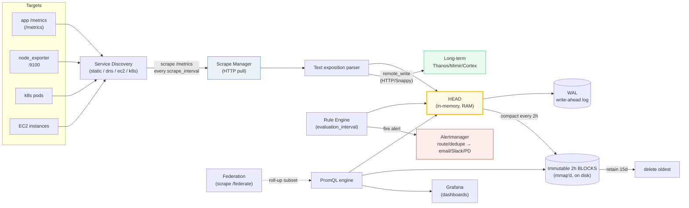

# Prometheus — Day 0 to Production

> Companion (ground truth): [prometheus.py](https://github.com/quanhua92/tutorials/blob/main/observability/prometheus.py)
> Live interactive: [prometheus.html](./prometheus.html)
> Output: [prometheus_output.txt](https://github.com/quanhua92/tutorials/blob/main/observability/prometheus_output.txt)

Prometheus is a **pull-based metrics database**. On a fixed clock it walks a
list of targets, HTTP-GETs a tiny `/metrics` text page from each, and files the
numbers into a local time-series database (**TSDB**). You then query it with
**PromQL** to build dashboards and fire alerts. It is single-node by design:
one process, one local disk, ~15 days of retention. Day 2 is about escaping
that limit (remote write, Thanos/Mimir, federation) without losing the pull
model.

## 0. TL;DR

- **Pull, not push.** Prometheus scrapes `/metrics`; apps do not register.
- **One time series per unique label set.** A metric + its labels IS the
  series. Adding a high-cardinality label (`user_id`) multiplies the series
  count — and RAM, and ingest CPU. This is THE failure mode (Section C).
- **TSDB = Head (RAM) → WAL → 2h blocks (mmap'd) → compact.** ~120 samples per
  ~1 KB chunk; ~1.5 KB per active series in RAM.
- **PromQL's two expert primitives:** `rate()` (counter slope + reset
  correction) and `histogram_quantile()` (interpolate a quantile out of
  cumulative buckets).
- **Two independent clocks:** `scrape_interval` (pull targets) and
  `evaluation_interval` (run recording/alert rules).
- **Day 2 escape hatch:** `remote_write` streams samples to long-term storage
  (Thanos / Mimir / Cortex / VictoriaMetrics) for >15d retention + global view.

---

## 1. Architecture



**The data path:** targets expose `/metrics` → SD expands them to `ip:port`
→ scrape manager pulls on `scrape_interval` → parser → **Head** (RAM, recent)
→ WAL (durability) → every 2h the Head is cut into an immutable, mmap-able
**block** → after 15d the oldest block is deleted. In parallel, the **rule
engine** runs recording/alert rules every `evaluation_interval`; firing alerts
push to **Alertmanager**, which routes/dedupes to humans.

---

## 2. Day 0 — Deploy & Configure

### 2.1 Run Prometheus (docker)

```bash
# Minimal single-container Prometheus with a 15d retention.
docker run -d --name prom \
  -p 9090:9090 \
  -v $(pwd)/prometheus.yml:/etc/prometheus/prometheus.yml \
  -v prom-data:/prometheus \
  prom/prometheus:v2.54.0 \
  --config.file=/etc/prometheus/prometheus.yml \
  --storage.tsdb.path=/prometheus \
  --storage.tsdb.retention.time=15d \
  --web.enable-lifecycle
```

`--web.enable-lifecycle` lets you `POST /-/reload` to pick up config changes
without restarting.

### 2.2 The config file — `prometheus.yml`

```yaml
global:
  scrape_interval: 15s       # how often to pull each target
  evaluation_interval: 15s   # how often to run recording/alert rules

# ONE rule for recording + alerting lives in a file list:
rule_files:
  - "rules/*.yml"

# Alertmanager is a SEPARATE process; Prom just pushes firing alerts to it.
alerting:
  alertmanagers:
    - static_configs:
        - targets: ["alertmanager:9093"]

scrape_configs:
  # self-instrumentation (Prom scrapes itself)
  - job_name: prometheus
    static_configs:
      - targets: ["localhost:9090"]

  # static targets (bare-metal / tiny deployments)
  - job_name: node
    static_configs:
      - targets: ["10.0.0.1:9100", "10.0.0.2:9100", "10.0.0.3:9100"]

  # DNS-based discovery
  - job_name: nodes-dns
    dns_sd_configs:
      - names: ["node.internal"]
        type: A
        port: 9100

  # Kubernetes pod discovery
  - job_name: k8s-pods
    kubernetes_sd_configs:
      - role: pod
    relabel_configs:
      - source_labels: [__meta_kubernetes_pod_annotation_prometheus_io_scrape]
        action: keep
        regex: "true"

  # EC2 discovery
  - job_name: ec2
    ec2_sd_configs:
      - region: us-east-1
        port: 9100
```

> From prometheus.py Section E:
> ```
> static_configs  (hardcoded list -- good for tiny fixed deployments)
>   targets: 10.0.0.1:9100, 10.0.0.2:9100, 10.0.0.3:9100
> [check] static SD = fixed list: OK
>
> dns_sd_configs  (resolve a name -> N A records; SRV gives port too)
>   node.internal -> 4 A records
>   targets: 10.0.0.11:9100, 10.0.0.12:9100, 10.0.0.13:9100, 10.0.0.14:9100
> [check] DNS SD resolved 4 endpoints: OK
>
> ec2_sd_configs  (DescribeInstances API -> private/public IPs)
>   DescribeInstances returned 4 instances
>   running -> scraped: 10.0.1.5:9100, 10.0.1.6:9100, 10.0.1.8:9100
>   skipped (not running): i-0ccc
> [check] EC2 SD scrapes running instances only (3 of 4): OK
>
> kubernetes_sd_configs (role=pod -> every Pod IP matching selectors)
>   pod watch returned 4 pods for app=api
>   Running -> scraped: 172.16.0.5:8080, 172.16.0.6:8080, 172.16.0.8:8080
>   skipped (Pending): api-7f9-ccc
> [check] k8s SD scrapes Running pods (3 of 4): OK
>
>   total active targets across all SD jobs: 13
> [check] total targets = 3+4+3+3 = 13: OK
> ```

### 2.3 Verify targets are UP

Open `http://localhost:9090/targets`. Every target should show **UP (health=up,
last_error=)**. From the console:

```bash
curl -s localhost:9090/api/v1/targets | jq '.data.activeTargets[] | {job:.labels.job, health}'
```

The built-in series `up{job="..."}` is `1` for a successful scrape, `0` for a
failure. **Alert on `up == 0 for 1m`** — this is your scrape-liveness signal.

---

## 3. Day 1 — First Data, PromQL, Recording Rules, Grafana

### 3.1 The four metric types

> From prometheus.py Section A:
> ```
> COUNTER http_requests_total  (only goes UP; reset on restart)
>   samples : 11, 19, 35, 50, 65, 77, 11, 36, 46, 67
> [check] counter sample[5] > sample[0] before reset (monotonic): OK
> [check] counter reset detected (sample[6] < sample[5]): OK
>
> GAUGE node_memory_active_bytes  (any value, any direction)
>   samples : 475.2, 444.5, 427.8, 448.0, 464.1, 495.7, 525.9, 527.8
> [check] gauge can decrease (not monotonic): OK
>
> HISTOGRAM http_request_duration_seconds_bucket  (cumulative)
>   Default buckets: .005 .01 .025 .05 .1 .25 .5 1 2.5 5 10  (+Inf)
>   count 0  0  2  5  12  25  40  48  50  50  50  50
>   _count = 50    _sum = 18.84
> [check] histogram = 12 bucket series + _sum + _count = 14 series: OK
> [check] last (+Inf) bucket equals total count: OK
> ```

| Type | Behavior | PromQL | When to use |
|---|---|---|---|
| **Counter** | Only ↑; resets to 0 on restart | `rate()`, `increase()` | requests, errors, bytes sent |
| **Gauge** | Any value, any direction | direct, `avg_over_time()` | temp, memory, queue depth, replicas |
| **Histogram** | Cumulative buckets + `_sum` + `_count` | `histogram_quantile()` | latencies you want to aggregate |
| **Summary** | Precomputed quantiles (client-side) | direct (no buckets) | latencies fixed per instance |

**Why histograms usually beat summaries:** a summary computes the quantile
*on the client*, so you **cannot average the 0.95s across instances**. A
histogram stores buckets, which you *can* aggregate (`histogram_quantile` over
`sum(rate(bucket))`). One histogram metric = **14 series** per label combo
(12 default buckets incl. +Inf, plus `_sum` and `_count`).

### 3.2 PromQL — `rate()` and `histogram_quantile()`

```promql
# QPS over the last 5 minutes (rate = per-second slope of a counter)
sum(rate(http_requests_total[5m]))

# Total requests added over the last hour (rate * window)
increase(http_requests_total[1h])

# p95 latency from a histogram (MUST wrap buckets in rate())
histogram_quantile(0.95, sum by (le)(rate(http_req_duration_seconds_bucket[5m])))
```

> From prometheus.py Section D:
> ```
> rate(http_requests_total[1m]) -- clean monotonic counter
>   samples (t, v): (0,1000) (15,1030) (30,1060) (45,1090) (60,1120)
>   increase = last - first = 120.0    rate = increase/60s = 2.0000/s
> [check] clean rate = 120/60 = 2.0/s: OK
> [check] clean increase = 120: OK
>
> rate(http_requests_total[1m]) -- with a mid-window RESET (restart)
>   samples (t, v): (0,1000) (15,1030) (30,1060) (45,20) (60,50)
>   raw delta = 50 - 1000 = -950  (WRONG, negative)
>   correction = pre-reset value = 1060  -> increase = 50 + 1060 - 1000 = 110.0
>   rate = 1.8333/s
> [check] reset-corrected increase = 110: OK
> [check] reset-corrected rate = 110/60 = 1.8333/s: OK
> ```

**Why the reset correction matters:** counters go back to 0 on process
restart. A naive `(last - first)` gives a **negative** rate. Prometheus
detects any decrease as a reset and adds the pre-reset value to reconstruct
the lost delta. Without this, every deploy poisons your QPS graph.

> ```
> histogram_quantile(phi, rate(http_req_duration_seconds_bucket[5m]))
>   cumulative buckets:
>     le=0.0050  count=0
>     le=0.0100  count=0
>     le=0.0250  count=2
>     le=0.0500  count=5
>     le=0.1000  count=12
>     le=0.2500  count=25
>     le=0.5000  count=40
>     le=1.0000  count=48
>     le=2.5000  count=50
>     le=5.0000  count=50
>     le=10.0000 count=50
>     le=+Inf    count=50
>   phi=0.5   -> quantile = 0.2500
>   phi=0.95  -> quantile = 0.9688
>   phi=0.99  -> quantile = 2.1250
> [check] p50 = 0.25 (interpolated in le=0.25 bucket, rank 25 hits its boundary): OK
> [check] p95 = 0.9688 (0.5 + 0.5*(47.5-40)/8): OK
> [check] p99 = 2.125 (1.0 + 1.5*(49.5-48)/2): OK
> ```

**The interpolation algorithm** (from `promql/quantile.go`):
1. `rank = phi * total_observations` (e.g. `0.95 * 50 = 47.5`).
2. Find the first bucket whose **cumulative** count `>= rank` (here `le=1.0`
   with cumulative count 48).
3. Linearly interpolate inside that bucket:
   `quantile = bucket_start + (bucket_end - bucket_start) * (rank - cum_before) / count_in_bucket`
   = `0.5 + (1.0 - 0.5) * (47.5 - 40) / (48 - 40)` = `0.5 + 0.5 * 7.5/8` =
   **0.9688**.

You **must** wrap buckets in `rate()` (or `sum(rate(...))` to aggregate across
instances) before `histogram_quantile` — buckets are counters too.

### 3.3 Recording rules — cache slow queries

```yaml
# rules/latency.yml
groups:
  - name: latency
    rules:
      - record: job:http_req_duration_seconds:p95
        expr: histogram_quantile(0.95, sum by (le, job)(rate(http_req_duration_seconds_bucket[5m])))
      - record: job:http_requests:rate5m
        expr: sum by (job)(rate(http_requests_total[5m]))
```

A recording rule **pre-evaluates** a slow expression into a new time series
every `evaluation_interval`. Grafana then queries the cheap rule output
(`job:http_req_duration_seconds:p95`) instead of re-running the heavy
`histogram_quantile` on each dashboard render. This is the #1 query-perf lever.

> From prometheus.py Section F:
> ```
>   scrape_interval=15s  evaluation_interval=30s  horizon=120s
>   scrapes @ [0, 15, 30, 45, 60, 75, 90, 105]
>   evals   @ [0, 30, 60, 90]
>   scrapes that coincide with a rule eval: [0, 30, 60, 90]
> [check] 8 scrapes in 120s @ 15s: OK
> [check] 4 evals in 120s @ 30s: OK
> [check] scrapes coincide with evals at 0,30,60,90 (range(0,120,30)): OK
>
>   recording rule example (runs every evaluation_interval=30s):
>     record: job:http_requests:rate5m
>     expr:   sum by (job)(rate(http_requests_total[5m]))
>   -> produces a NEW pre-computed series. Dashboards/Grafana query the
>      rule output (cheap) instead of re-running rate() each render.
>   -> ALERT rules also fire here. Firing -> pushed to Alertmanager.
> [check] recording rules run on evaluation_interval, NOT scrape_interval: OK
> ```

**Two independent clocks.** `scrape_interval` pulls targets; `evaluation_interval`
runs rules. They are decoupled — a rule at `t=30` sees whatever samples exist
then. **Recording/alert rules run on `evaluation_interval`, NOT `scrape_interval`.**

### 3.4 Grafana datasource

Add Prometheus as a datasource: URL `http://prometheus:9090`, leave "Scrape
interval" as the default. Then a panel query like
`job:http_req_duration_seconds:p95{job="api"}` renders instantly (it's a rule
output). For explore-mode, query `/api/v1/query` or `/api/v1/query_range`.

---

## 4. Day 2 — Scale, Long-Term, Federation, Alertmanager

### 4.1 The cardinality budget (read this twice)

Active series count = the **product** of each label's cardinality. There is no
deduplication. One toxic label multiplies *everything*.

> From prometheus.py Section C:
> ```
>   Scenario A (sane):
>     endpoint   cardinality=50    running series=50
>     method     cardinality=4     running series=200
>     status     cardinality=5     running series=1000
> [check] sane series = 4*5*50 = 1000: OK
>
>   Scenario B (add user_id=10000):
>     product = 4*5*50*10000 = 10,000,000
> [check] toxic series = 1000 * 10000 = 10,000,000: OK
>
>   Memory cost @ ~1.5 KB per active series (index + head + labels):
>     sane          1,000 series ->        1.5 MB =   0.00 GB
>     toxic    10,000,000 series ->    14648.4 MB =  14.31 GB
> [check] 10M series * 1.5KB = ~14.3 GB (OOM for a typical 8-16GB Prometheus): OK
>
>   Histogram amplifier: 1 histogram metric = 14 series per combo.
>     toxic * 14 = 140,000,000 series from a SINGLE histogram metric
> [check] toxic * 14 = 140,000,000: OK
> ```

**Never** put `user_id`, `email`, `request_id`, `session_id`, or any unbounded
label on a metric. Log them (see 🔗 [LOKI](./LOKI.md)) or attach a single trace
id as an **exemplar** (stored out-of-band, not as a series). Detect bombs with:

```bash
# top series by metric name
curl -s localhost:9090/api/v1/series | jq '[.data[] | .__name__] | group_by(.) | map({name:.[0], n:length}) | sort_by(-.n) | .[:10]'
```

### 4.2 TSDB storage internals

> From prometheus.py Section B:
> ```
>   scrape_interval   = 15s
>   block window      = 2h = 7200s
>   samples/series    = 480  (block_window / scrape_interval)
>   chunks/series     = 4  (ceil(samples/120))
> [check] 480 samples / 120 = 4 chunks per series per 2h block: OK
>
>   HEAD memory = N_series * chunks_per_series * chunk_size (approx)
>     N=    1,000 series ->      4.1 MB head chunks
>     N=  100,000 series ->    409.6 MB head chunks
>     N=1,000,000 series ->   4096.0 MB head chunks
> [check] 1M series * 4 chunks * 1KB = 4096 MB head: OK
>
>   WAL write amplification (every scrape appended to WAL first)
>     1M series @ 15s -> 240000000 samples/h -> 1920.0 MB WAL/h
> [check] 1M series @ 15s produces 240,000,000 samples/h (1M * 3600/15): OK
>
>   retention = 15d -> 180 blocks of 2h on disk
> [check] 15d / 2h = 180 blocks: OK
>
>   mmap: chunks in blocks are mmap-able. The OS page cache -- not the
>   Go heap -- holds them. This is why Prometheus can query years of
>   history without loading it all into the process address space, and
>   why RSS undercounts real cache use (look at page cache instead).
> [check] TSDB tiers: Head (RAM) -> WAL -> 2h blocks (mmap'd) -> compact: OK
> ```

Tiers: **Head** (RAM, recent samples) → **WAL** (durability, append-everything)
→ immutable **2h blocks** (mmap'd, on disk) → compaction merges small blocks
into larger ones → after 15d the oldest is deleted. **RSS undercounts cache**
because blocks are mmap'd into the OS page cache, not the Go heap — watch the
page cache instead.

### 4.3 Long-term storage via `remote_write`

```yaml
# prometheus.yml — stream samples out to long-term storage
remote_write:
  - url: http://thanos-receive:19291/api/v1/receive
    queue_config:
      max_samples_per_send: 1000
      max_shards: 200
```

> From prometheus.py Section G:
> ```
>   local retention = 15d (default)
>   ingest ~ 8.0 GB/day -> 120 GB on disk at steady state
> [check] 15d * 8GB = 120 GB: OK
>
>   remote_write -> long-term storage (choose one):
>     Thanos   : sidecar adds S3 to each Prom; queries federate via Store Gateway.
>     Mimir    : multi-tenant, horizontally scalable, S3-backed (Grafana Labs).
>     Cortex   : predecessor of Mimir, same idea.
>     VictoriaMetrics : drop-in remote_write target, very cost-efficient.
>   All use the SAME remote_write protocol -> swap by changing one URL.
> [check] remote_write is the standard escape hatch for >15d retention: OK
> ```

| Store | Model | Notes |
|---|---|---|
| **Thanos** | Sidecar per Prom + S3 + Store Gateway | Object storage is the long-term store; queries fan out across shards. |
| **Mimir** | Multi-tenant, horizontally scalable (Grafana Labs) | S3-backed; the successor to Cortex. |
| **Cortex** | Predecessor of Mimir | Same idea; superseded. |
| **VictoriaMetrics** | Drop-in remote_write target | Very cost-efficient single-binary option. |

All speak the **same `remote_write` protocol** — swap by changing one URL.

### 4.4 Federation (hierarchical roll-up)

```yaml
# global prometheus.yml — scrape a SUBSET from each shard
scrape_configs:
  - job_name: federate
    honor_labels: true
    metrics_path: /federate
    params:
      'match[]':
        - '{__name__=~"job:.*"}'   # only pre-aggregated rule outputs
    static_configs:
      - targets: ["prom-shard-a:9090", "prom-shard-b:9090"]
```

> ```
>   federation:
>     global Prom --(scrape /federate)--> shard-A Prom (region us-east)
>                                        --> shard-B Prom (region eu-west)
>     Used for ROLL-UP (a few aggregate series up to a global view).
>     NOT for mirroring every raw series -- that does not scale.
> [check] federation = hierarchical scrape of /federate (subset only): OK
> ```

Federation is for **rolling up a few aggregate series** to a global view (match
`{__name__=~"job:.*"}` — only recording-rule outputs). **Do not** federate every
raw series; it does not scale.

### 4.5 Alertmanager — route, dedupe, silence

```yaml
# alertmanager.yml
route:
  receiver: default
  group_by: ["alertname", "job"]
  group_wait: 30s
  group_interval: 5m
  repeat_interval: 4h
  routes:
    - matchers: ['severity="critical"']
      receiver: pagerduty
    - matchers: ['severity="warning"']
      receiver: slack
receivers:
  - name: pagerduty
    pagerduty_configs: [{ routing_key: "${PD_KEY}" }]
  - name: slack
    slack_configs: [{ api_url: "${SLACK_WEBHOOK}", channel: "#oncall" }]
```

> ```
>   Alertmanager (decoupled from Prom):
>     Prom fires an alert -> pushes to Alertmanager -> AM groups, inhibits,
>     and ROUTES (email / PagerDuty / Slack) based on severity & labels.
>     Dedup: 1000 pods firing 'NodeDown' -> 1 notification.
> ```

Prometheus only **fires** alerts; **Alertmanager** is a separate process that
groups, dedupes (1000 pods firing `NodeDown` → 1 notification), inhibutes
(don't page for a child if the parent is down), routes by label, and silences.

### 4.6 Capacity planning rules of thumb

- Keep **active series < ~1M per Prometheus shard** (RAM-bound).
- **Shard by a stable label** (`job`, `tenant`) and run N Prometheus instances.
- `remote_write` + Thanos/Mimir for global view + long retention.
- Watch `prometheus_tsdb_head_series` (active series) and
  `prometheus_tsdb_head_samples_appended_total` (ingest rate).

---

## 5. Killer Gotchas

| Trap | Symptom | Fix |
|---|---|---|
| **High-cardinality label** (`user_id`, `request_id`) | Active series explode; Prometheus OOMs / restarts loop | Drop the label; log it instead; or use exemplars. Never put unbounded values on a metric. |
| **`rate()` on a gauge** | Useless / wrong numbers | Use `avg_over_time()` / `max_over_time()` on gauges; `rate()` only on counters. |
| **`histogram_quantile` without `rate()`** | Quantile is wrong (raw cumulative counts, not rates) | Always wrap buckets: `histogram_quantile(0.95, sum by (le)(rate(bucket[5m])))`. |
| **Counter reset misread as negative rate** | QPS graph dips negative on every deploy | Use `rate()`/`increase()` (they reset-correct). Never `(last - first)`. |
| **Forgetting to aggregate `le` in `histogram_quantile`** | Single-instance result; cross-instance wrong | `sum by (le)` (keep `le`!), then `histogram_quantile`. |
| **Federating raw series** | Global Prom OOMs; duplicates | Federate only recording-rule outputs (`match[]={__name__=~"job:.*"}`). |
| **Stale data after target down** | Dashboard flatlines on old value | Wait for the 5-min staleness marker, or alert on `absent()`. |
| **RSS looks fine, node OOMs** | "Why did Prom die, RSS was low?" | mmap'd blocks live in the OS page cache, not RSS. Watch page cache + `head_series`. |
| **No recording rule for p99** | Dashboard slow / times out | Pre-compute heavy `histogram_quantile` into a recording rule. |
| **`scrape_interval` = `evaluation_interval` confusion** | Recording rule staleness, double-eval cost | Treat them as two independent clocks; 15s/15s or 15s/30s are common. |
| **`up == 0` not alerted** | You lose data silently when a target dies | Alert `up{job="..."} == 0 for 1m`. |

---

## 6. Cheat Sheet

```promql
# rate & increase
sum(rate(http_requests_total[5m])) by (job)         # QPS by job
increase(http_requests_total[1h])                   # total over 1h

# error ratio (the SLI classic)
sum(rate(http_requests_total{status=~"5.."}[5m]))
  / sum(rate(http_requests_total[5m]))

# p95 / p99 latency (buckets MUST be in rate())
histogram_quantile(0.95, sum by (le)(rate(http_req_duration_seconds_bucket[5m])))

# gauge helpers
avg_over_time(node_memory_active_bytes[5m])
max_over_time(queue_depth[10m])

# cardinality triage
count by (__name__)({__name__=~".+"})               # series per metric
topk(10, count by (job)({...}))                     # top label bombs

# alert on absence
absent(up{job="api"})                                # no series at all -> 1
```

**Config knobs:** `--storage.tsdb.retention.time=15d`,
`--storage.tsdb.retention.size=50GB` (size wins if both set),
`--query.max-samples=50000000`, `--scrape.config.reload`.

**Two clocks:** `scrape_interval` (pull targets) · `evaluation_interval` (run
recording + alert rules).

---

## Cross-references

- 🔗 [LOKI](./LOKI.md) — Prometheus-for-logs. Same label model, same cardinality
  trap, but for logs. Log the `user_id` you can't put on a metric here.
- 🔗 [GRAFANA](./GRAFANA.md) — the visualization layer; consumes Prom (and Loki)
  as a datasource, renders the recording-rule outputs you build here.
- 🔗 [OPENTELEMETRY](./OPENTELEMETRY.md) — OTel Collector can expose
  `/metrics` for Prom to scrape, or remote_write directly; bridges the OTLP and
  exposition worlds.
- 🔗 [OBSERVABILITY_FUNDAMENTALS](./OBSERVABILITY_FUNDAMENTALS.md) — SLI/SLO/error
  budgets; `rate(5xx)/rate(total)` is the canonical SLI built from these counters.

---

## Sources

- Prometheus — storage / TSDB: https://prometheus.io/docs/prometheus/latest/storage/
- Prometheus — metric types: https://prometheus.io/docs/concepts/metric_types/
- Prometheus — histograms & summaries (interpolation, when to use which):
  https://prometheus.io/docs/practices/histograms/
- Prometheus — `histogram_quantile` / `rate` functions:
  https://prometheus.io/docs/prometheus/latest/querying/functions/
- Prometheus — service discovery: https://prometheus.io/docs/prometheus/latest/configuration/configuration/
- Prometheus — federation: https://prometheus.io/docs/prometheus/latest/federation/
- Prometheus — recording rules: https://prometheus.io/docs/prometheus/latest/configuration/recording_rules/
- Prometheus — `remote_write` / remote storage: https://prometheus.io/docs/prometheus/latest/storage/#remote-storage-integrations
- Alertmanager — configuration & routing: https://prometheus.io/docs/alerting/latest/configuration/
- Grafana — Prometheus datasource: https://grafana.com/docs/grafana/latest/datasources/prometheus/
- Thanos architecture: https://thanos.io/tip/thanos/design.md/
- Grafana Mimir: https://grafana.com/docs/mimir/latest/
- Prometheus cardinality bomb (OpenObserve): https://openobserve.ai/blog/prometheus-data-cardinality/
- High-cardinality management (Grafana): https://grafana.com/blog/how-to-manage-high-cardinality-metrics-in-prometheus-and-kubernetes/
