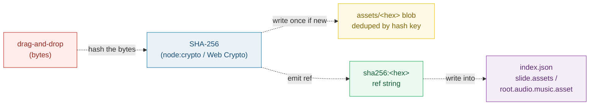

# ASSET_LIBRARY — SHA-256 content addressing & the Asset library surface

> **Goal:** understand how binary assets (images, audio, fonts) live *outside*
> the JSON/HTML document model, addressed by the **content** of the bytes rather
> than by a name — and how the editor's Asset library turns a drag-and-drop into
> a `sha256:<hex>` ref inside `index.json`.
>
> **Run:** `pnpm exec tsx bundles/asset_library.ts`
> **Prerequisites:** [UNIT_MODEL](./UNIT_MODEL.md) (assets/ is **not** a unit —
> it is a sibling bag of content-addressed blobs).
> **RFC:** §5.1 (assets/ content-addressed by SHA-256), §7 (Asset library
> surface), §13 (cloud stores opaque content).

---

## Lineage — why this exists

The prior app stored uploaded images by **name** under `assets/` and inlined
those names into the stamped HTML. Two problems: (1) dropping the same file
twice duplicated the bytes; (2) renaming a file on disk silently broke the
project. RFC 0001 §5.1 replaces name-addressing with **content-addressing**:

> `assets/  ← images, audio, fonts (content-addressed by SHA-256)` — RFC 0001 §5.1

The asset is named by a hash of **its own bytes**. Same bytes ⇒ same hash ⇒ one
stored blob. Rename a file, re-encode it, drop it on another device — the hash
is stable so long as the bytes are. The editor's **Asset library** (RFC §7) is
the surface that performs the hash → store → write-ref dance:

> `Asset library (left) | browse/drop assets → SHA ref lands in index.json` — RFC 0001 §7



The dotted arrows are the **drop pipeline**: every drop produces exactly one
ref; the blob lands in `assets/` only if its hash is new.

## What the runnable proves

> From `asset_library.ts` Section A (the ref format):
> ```
>   RFC 0001 §5.1 — assets/ holds blobs "content-addressed by SHA-256".
>
>   bytes (PNG_A, 16B) → sha256:75265d7b25eacdeee5c0f419f688896fa9b32ad629c4728211057c952ea1971a
>   → the REF is what index.json stores. The blob sits in assets/. JSON never embeds bytes.
> [check] ref format is `sha256:<64 lowercase hex>`: OK
>   PINNED: ref = sha256:75265d7b25eacdeee5c0f419f688896fa9b32ad629c4728211057c952ea1971a
> ```

> From `asset_library.ts` Section B (determinism + avalanche):
> ```
>   sha256("hello") = 2cf24dba5fb0a30e26e83b2ac5b9e29e1b161e5c1fa7425e73043362938b9824
>   sha256("hellp") = fdd7585e08c4e2afd71dcabdb4636c89d557a3f42db9e2040c8bbd1708aa4ce7
> [check] sha256("hello") is the pinned gold value: OK
> [check] determinism: same input recomputed ⇒ same hash: OK
>   1-char input change → 131/256 output bits differ (51.2%), 0 shared leading-hex chars.
> [check] avalanche: ~50% of output bits flip on a 1-char input change: OK
> ```

> From `asset_library.ts` Section C (dedup is free):
> ```
>   drop #1 (PNG_A)       → sha256:75265d7b25eacdeee5c0f419f688896fa9b32ad629c4728211057c952ea1971a
>   drop #2 (PNG_A_DUP)   → sha256:75265d7b25eacdeee5c0f419f688896fa9b32ad629c4728211057c952ea1971a   ← same ref, store() was a no-op
>   drop #3 (PNG_B)       → sha256:bf1da50dd71b632558f53d8bb17f69fdbbd3569f40d857f7262bd31ff89242dc
>   3 drop() calls, 2 unique blobs stored.
> [check] dedup: 2 identical blobs collapse to 1 stored file (3 inputs → 2 stored): OK
> [check] dedup: both drops of the same bytes return the SAME ref: OK
>   PINNED: storedCount = 2 for 3 inputs (2 are byte-identical).
> ```

> From `asset_library.ts` Section D (the ref lands in index.json):
> ```
>   slide-0/index.json:
>     "assets": {"img":"sha256:75265d7b25eacdeee5c0f419f688896fa9b32ad629c4728211057c952ea1971a"}
>   root/index.json:
>     "audio.music": {"asset":"sha256:bf1da50dd71b632558f53d8bb17f69fdbbd3569f40d857f7262bd31ff89242dc","volume":0.08,"loop":true}
> [check] slide `assets` value is a `sha256:` ref (no embedded bytes): OK
> [check] root `audio.music.asset` is a `sha256:` ref (not a base64 blob): OK
> ```

> From `asset_library.ts` Section E (the drop → hash → store → write-ref flow):
> ```
>   drop PNG_A (16B)
>     1) hash + store   → sha256:75265d7b25eacdeee5c0f419f688896fa9b32ad629c4728211057c952ea1971a
>     2) blob on disk   → assets/75265d7b2.png
>     3) __IMAGE__ swap → 
> [check] drop produced a `sha256:` ref AND a path under assets/: OK
> [check] store holds exactly one blob after one drop: OK
> ```

> From `asset_library.ts` Section F (cloud sync is opaque, §13):
> ```
>   RFC 0001 §13 — the control plane stores the project document as "opaque
>   content" during sync. It NEVER interprets, renders, or runs inference on it.
> [check] cloud never interprets blob content (§13: no inference in the cloud): OK
> [check] sync payload keys blobs by SHA ref (content-addressed even in transit): OK
> ```

## Why / internals

### Why content-addressing (hash the bytes), not name-addressing

A name is an external label a human picks; it can collide, drift, or lie about
the contents. A **SHA-256 digest is a property of the bytes themselves** — it is
a 256-bit fingerprint computed by a deterministic, collision-resistant function
([Wikipedia: SHA-2](https://en.wikipedia.org/wiki/SHA-2)). Two consequences we
exploit:

1. **Dedup is free.** The blob's filename *is* its hash, so a second store of
   identical bytes maps to the same key — the write is a no-op (Section C).
   This is the defining property of
   [content-addressable storage](https://en.wikipedia.org/wiki/Content-addressable_storage).
2. **Integrity is free.** A reader can re-hash the bytes and compare to the ref.
   Any mutation (re-encoding, truncation, bit-flip) produces a different hash
   (Section B's avalanche: 131/256 bits differ for a 1-char input change) — the
   ref simply will not resolve. There is no separate checksum to maintain.

### Why the ref, not the bytes, lives in `index.json`

`index.json` is **data** — small, stable, ideal for editor binding and small-
model AI edits (RFC 0002 Tier-1). Embedding multi-megabyte binary blobs as
base64 would bloat the JSON, break `git diff`, and make every Tier-1 prompt
expensive. So RFC §5.2/§5.3 store a **ref string** (`sha256:<hex>`) and leave
the bytes in `assets/`. The ref is 71 ASCII chars regardless of blob size.

### Why the cloud stores blobs as **opaque** content (§13)

RFC §13 is explicit: the control plane "stores the project document … as
**opaque content** during sync. It never interprets, renders, or runs inference
on it. **No inference runs in the cloud.**" This keeps the cloud trivially
cheap (S3 + a manifest of SHA refs — see §13.1's `GET
/projects/{id}/manifest` and `POST /projects/{id}/assets/presign`) and keeps
every render/AI call local-first. The same content-addressing that dedups on
disk dedups across devices: two clients syncing the same image upload one blob.

### Why SHA-256 specifically (and where it is computed)

SHA-256 is the smallest member of the SHA-2 family with a 256-bit output —
small enough to be a tidy ref, large enough that a accidental collision is
physically infeasible. In the editor it is computed with **Web Crypto**
(`crypto.subtle.digest('SHA-256', bytes)`,
[MDN: SubtleCrypto.digest](https://developer.mozilla.org/en-US/docs/Web/API/SubtleCrypto/digest));
in `asset_library.ts` it is computed with `node:crypto` over fixed in-source
bytes — same algorithm, same output, byte-identical re-runs.

## 🔗 Cross-references

- 🔗 [UNIT_MODEL](./UNIT_MODEL.md) — assets/ is **not** a unit; it is a sibling
  bag of content-addressed blobs, referenced by SHA from index.json.
- 🔗 [ROOT_INDEX_JSON](./ROOT_INDEX_JSON.md) — `audio.music.asset` is a
  `sha256:<hex>` ref; the root data file points into assets/, never embeds it.
- 🔗 [SLIDE_INDEX_JSON](./SLIDE_INDEX_JSON.md) — `slide.assets` is a map of
  `{field_id: "sha256:..."}` refs; this is where dropped assets land.
- 🔗 [DATA_BINDING](./DATA_BINDING.md) — image fields do the byte-swap to
  `assets/` + `__FIELD_ID__` **path** replacement (AGENTS.md) once the ref
  exists.

## Pitfalls

| Trap | Symptom | Fix |
|---|---|---|
| Embedding the blob (base64) in `index.json` | JSON bloats to MBs; `git diff` dies; Tier-1 AI edits get expensive | Store only the `sha256:<hex>` ref; bytes live in `assets/` (Section D) |
| Addressing assets by **name** instead of by hash | Dropping the same file twice duplicates bytes; renaming breaks the project | Filename = the hash; content-addressing dedups for free (Section C) |
| Truncating/normalizing the hash (storing only a prefix) | Two distinct blobs collide once enough assets accumulate; refs resolve to the wrong bytes | Store the full 64-hex digest in `index.json`; a short prefix is fine only for the on-disk *filename* |
| Re-encoding/re-saving an image on import | The bytes change → the SHA changes → it looks like a brand-new asset (dedup silently fails) | Store the **original** bytes verbatim; if you must normalize, do it once and hash the normalized result consistently |
| Trusting the ref without verifying the bytes | A mutated blob resolves under the old hash; the project renders wrong with no error | Re-hash on read and compare; a mismatch means the asset is corrupt — refuse to render |
| Assuming the cloud will optimize/preview/render blobs | Adds inference to the cloud — violates RFC §13 and the local-first v1 contract | Cloud treats blobs as **opaque content**; it stores + indexes refs, nothing more (Section F) |
| Mixing `sha256:` ref strings and bare filenames in the same `assets` map | Readers can't tell which entries are content-addressed vs. legacy | Use `sha256:<hex>` exclusively; migrate any legacy names to refs on first load |

## Cheat sheet

```
asset         = a binary blob in assets/, named by its own SHA-256
ref           = "sha256:" + 64 lowercase hex chars  (71 ASCII bytes total)
determinism   = same bytes ⇒ same hash (recompute any time; no stored checksum)
avalanche     = 1-byte input change ⇒ ~50% of output bits flip (no shared prefix)
dedup         = identical bytes ⇒ same hash ⇒ same key ⇒ one stored blob
drop flow     = hash → store-if-new → emit ref → write ref into index.json
slide ref     = slide index.json  → "assets": { "img": "sha256:..." }   (§5.3)
root ref      = root  index.json  → "audio.music.asset": "sha256:..."   (§5.2)
image field   = byte swap to assets/ + __FIELD_ID__ PATH replacement     (AGENTS.md)
cloud sync    = blobs are OPAQUE; cloud stores + indexes refs, never interprets (§13)
```

## Sources

- RFC 0001 §5.1, §5.2, §5.3, §7, §13: `docs/rfc-0001.md` (in-repo)
- `docs/AGENTS.md` — image field: "Byte swap to assets/, `__FIELD_ID__` path replacement" (in-repo)
- SHA-2 (256-bit output, determinism, avalanche): https://en.wikipedia.org/wiki/SHA-2
- Web Crypto `SubtleCrypto.digest('SHA-256', ...)`: https://developer.mozilla.org/en-US/docs/Web/API/SubtleCrypto/digest
- Content-addressable storage (dedup-by-hash): https://en.wikipedia.org/wiki/Content-addressable_storage
