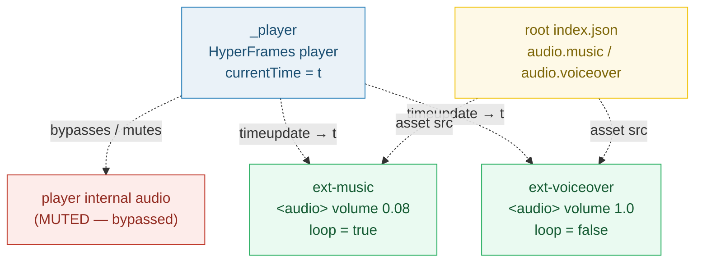
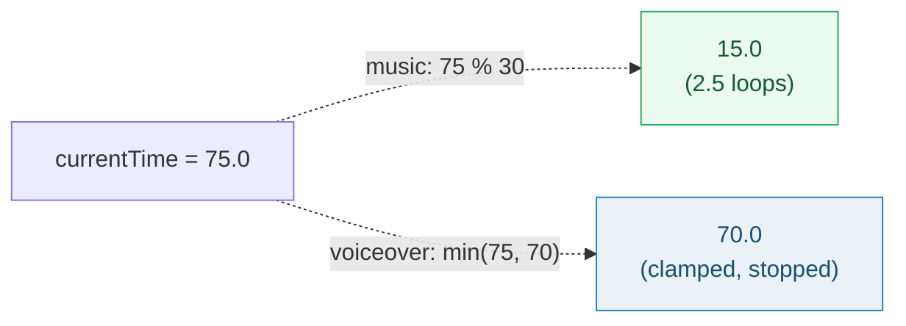

# AUDIO_SYNC — the external-`<audio>` pattern: bypass the player, drive two tracks from the playhead

> **Goal:** understand how the OpenVideoKit preview plays sound. The preview page
> does NOT use the HyperFrames player's internal audio — it spawns two EXTERNAL
> `<audio>` elements (`ext-music`, `ext-voiceover`) and re-seeks them from the
> player's playhead on every `timeupdate` event, bypassing the player's internal
> muting. The music track LOOPS (modulo math); the voiceover does NOT (clamp
> math).
>
> **Run:** `pnpm exec tsx bundles/audio_sync.ts`
> **Prerequisites:** [UNIT_MODEL](./UNIT_MODEL.md) (the symmetric unit),
> [ROOT_INDEX_JSON](./ROOT_INDEX_JSON.md) (where `audio.*` refs live).
> **Sources:** RFC §8 + AGENTS.md "Preview audio".

---

## Lineage — why this exists

The HyperFrames `<hyperframes-player>` is great at sequencing slide visuals, but
in the preview context it **mutes its own audio** (the player is a preview
playhead, not a media player the user listens through). RFC 0001 §8 makes the
preview **app-owned** and explicitly delegates audio to the external-`<audio>`
pattern already documented in [`AGENTS.md`](../docs/AGENTS.md):

> **RFC 0001 §8 (verbatim):** "Syncs audio via the external-`<audio>` pattern
> documented in `AGENTS.md` ('Preview audio')."

> **AGENTS.md "Preview audio" (verbatim):** "The preview page
> (`render_player_page()`) uses external `<audio>` elements synced to the
> HyperFrames player via event listeners. **This bypasses the player's internal
> muting.** — `ext-music`: music-bed, looped, volume 0.08 — `ext-voiceover`:
> voiceover track (if `assets/voiceover.mp3` exists), volume 1.0, not looped —
> Both sync to `_player.currentTime` via `timeupdate` events."

The payoff: audio is **decoupled from the engine**. The editor owns two plain
`HTMLMediaElement` nodes it can volume, loop, and seek independently — and the
player cannot mute them. When the engine is later swapped (RFC §9.3, our own
renderer), the audio path is unchanged because it never depended on the engine's
internals.



## What the runnable proves

> From `audio_sync.ts` Section A (why external `<audio>`):
> ```
>   AGENTS.md "Preview audio" (verbatim):
>     "The preview page (render_player_page()) uses external <audio>
>      elements synced to the HyperFrames player via event listeners.
>      This bypasses the player's internal muting."
> 
>   RFC 0001 §8 (verbatim):
>     "Syncs audio via the external-<audio> pattern documented in
>      AGENTS.md ('Preview audio')."
> 
>   → external <audio> is NOT the player's internal audio. It is a
>     separate HTMLMediaElement the editor controls directly, so the
>     player cannot mute it.
> [check] external <audio> bypasses player muting (AGENTS.md + RFC §8): OK
> ```

> From `audio_sync.ts` Section B (the two tracks, config from AGENTS.md):
> ```
>   ┌──────────────┬────────┬──────┬──────────┬──────────────────────┐
>   │ id           │ volume │ loop │ duration │ role                 │
>   ├──────────────┼────────┼──────┼──────────┼──────────────────────┤
>   │ ext-music    │ 0.08   │ true │ 30.000000 │ music bed (ducked)   │
>   │ ext-voiceover │ 1      │ false │ 70.000000 │ voiceover (primary)  │
>   └──────────────┴────────┴──────┴──────────┴──────────────────────┘
> [check] ext-music volume === 0.08 (ducked bed): OK
> [check] ext-voiceover volume === 1.0 (primary): OK
> [check] ext-music loop === true: OK
> [check] ext-voiceover loop === false: OK
> ```

> From `audio_sync.ts` Section C (the sync mechanism):
> ```
>   AGENTS.md "Preview audio" (verbatim):
>     "Both sync to _player.currentTime via timeupdate events."
> 
>   MDN HTMLMediaElement/timeupdate_event (verbatim):
>     "The timeupdate event is fired when the time indicated by the
>      currentTime attribute has been updated."
>     Frequency: ~4Hz–66Hz (system-load dependent).
> 
>   handler (sketch):
>     _player.addEventListener('timeupdate', () => {
>       const t = _player.currentTime;
>       ext_music.currentTime     = syncPos(t, MUSIC);     // % duration
>       ext_voiceover.currentTime = syncPos(t, VOICEOVER);  // min(t, dur)
>     });
> [check] sync source = _player.currentTime; trigger = timeupdate event: OK
> [check] syncPos dispatches by loop flag (modulo for music, clamp for voice): OK
> ```

> From `audio_sync.ts` Section D (the pinned values — loop math):
> ```
>   MUSIC (looped):    pos = currentTime % duration
>   VOICEOVER (clamp): pos = min(currentTime, duration)  [stops at end]
> 
>   ┌────────────┬───────────────────┬───────────────────────┬──────────────────────────────────────┐
>   │ playhead   │ ext-music pos     │ ext-voiceover pos     │ note                                 │
>   ├────────────┼───────────────────┼───────────────────────┼──────────────────────────────────────┤
>   │ 0.000000   │ 0.000000          │ 0.000000              │ music loop × 0.000000; voice in range │
>   │ 12.000000  │ 12.000000         │ 12.000000             │ music loop × 0.400000; voice in range │
>   │ 30.000000  │ 0.000000          │ 30.000000             │ music loop × 1.000000; voice in range │
>   │ 75.000000  │ 15.000000         │ 70.000000             │ music loop × 2.500000; voice clamped │
>   │ 90.000000  │ 0.000000          │ 70.000000             │ music loop × 3.000000; voice clamped │
>   └────────────┴───────────────────┴───────────────────────┴──────────────────────────────────────┘
> [check] at currentTime=75.0 → music pos = 75 % 30 = 15.0: OK
> [check] at currentTime=75.0 → voiceover pos = min(75, 70) = 70.0 (clamped): OK
> [check] at currentTime=12.0 → music pos = 12.0 (first loop): OK
> [check] at currentTime=12.0 → voiceover pos = 12.0 (within range): OK
>   PINNED: currentTime=75.0 → musicPos=15.000000, voicePos=70.000000
>   PINNED: currentTime=12.0 → musicPos=12.000000, voicePos=12.000000
> ```

> From `audio_sync.ts` Section E (audio refs in root index.json):
> ```
>   RFC 0001 §5.2 (verbatim schema):
>     "audio": {
>       "music":     { "asset": "sha256:...", "volume": 0.08, "loop": true },
>       "voiceover": { "asset": "voiceover.mp3", "auto_generated": true }
>     }
> 
>   → the editor edits audio.music.asset / audio.voiceover.asset here;
>     render_player_page() reads them to wire <audio src> for preview.
> [check] audio refs (music + voiceover) are root-level in index.json (§5.2): OK
> ```

## Why / internals

### Why external `<audio>` (not the player's audio)

`<hyperframes-player>` is a **preview playhead** — it advances `currentTime` and
drives slide GSAP timelines (RFC §8). Its own audio pipeline is muted in the
preview context. Rather than fight the player, the editor spawns two
**independent** `HTMLMediaElement` nodes (plain `<audio>` tags) that the player
has no authority over. Setting `.volume` / `.loop` / `.currentTime` on these
nodes always sticks, because they are not the player's elements. This is the
"bypass" AGENTS.md names.

### Why two different position formulas (modulo vs clamp)

The two tracks have opposite end-of-media behavior, so the sync handler
branches on the `loop` flag:

| Track | `loop` | End-of-media behavior | Sync formula | Why |
|---|---|---|---|---|
| `ext-music` | `true` | Restarts at 0 automatically (MDN: "start over when it reaches the end") | `t % duration` | The bed is short (e.g. 30s) but the video is long (e.g. 75s). We want the bed to loop **in phase with the playhead**: at t=75 the listener must hear the bed's 15s mark, not whatever loop count the element drifted to. Forcing `t % duration` re-seeks the element to the correct phase every tick. |
| `ext-voiceover` | `false` | Stops at the end (does not restart) | `min(t, duration)` | The voiceover is as long as the narration (e.g. 70s). Past it, the track must fall silent, not wrap. Clamping to `duration` parks the element at its last sample so subsequent ticks are no-ops (no seeking past duration, which would throw on some engines). |

The worked example (Section D) makes the divergence concrete: at `currentTime
= 75.0` with a 30s bed and a 70s voiceover, music sits at **15.0** (2.5 loops in)
while voiceover sits at **70.0** (clamped, silent):



### Why `timeupdate` and not `requestAnimationFrame`

`timeupdate` is the spec-defined "the playhead moved" signal for HTMLMediaElement
— MDN: "fired when the time indicated by the `currentTime` attribute has been
updated," at roughly **4–66 Hz** depending on system load. That cadence is
coarse enough to be cheap and fine enough that a 30s+ preview sounds locked.
Driving off `requestAnimationFrame` would re-seek the audio 60×/sec — more
expensive and no better perceptually, since the ear tolerates tens of ms of
audio skew. This also matches RFC §8's stance that the preview is **real-time,
not frame-accurate** (frame-accurate sync is the export path's job, §10).

### Why the music volume is ducked to 0.08

The music bed is **atmosphere**, the voiceover is the **message**. 0.08 keeps the
bed present under the narration without competing with it (standard ducking
practice). The voiceover sits at 1.0 so every word is intelligible. These are
not runtime-computed — they are pinned in AGENTS.md and surfaced as
`audio.music.volume` in root `index.json` (Section E), so the editor can expose
them as plain sliders.

## 🔗 Cross-references

- 🔗 [PREVIEW_ENGINE](./PREVIEW_ENGINE.md) — the engine whose playhead
  (`_player.currentTime`) is the single source of truth both ext-audio elements
  follow on every `timeupdate`.
- 🔗 [ROOT_INDEX_JSON](./ROOT_INDEX_JSON.md) — `audio.music` / `audio.voiceover`
  are the track refs; their `asset` fields are what `render_player_page()` wires
  into each `<audio src>`.
- 🔗 [SLIDE_INDEX_JSON](./SLIDE_INDEX_JSON.md) — each slide's `voiceover.text` +
  `voiceover.voice` feed the edge-tts pipeline that produces `assets/voiceover.mp3`
  (the file `ext-voiceover` plays).
- 🔗 [STAGE_CANVAS](./STAGE_CANVAS.md) — the surface whose playhead
  `currentTime` mirrors `_player.currentTime`; the same playhead drives both the
  visuals and these two audio tracks.

## Pitfalls

| Trap | Symptom | Fix |
|---|---|---|
| Driving the player's **internal** audio instead of spawning external `<audio>` | Preview is **silent** — the player mutes its own audio in preview mode | Spawn `<audio id="ext-music">` / `<audio id="ext-voiceover">`; the player has no authority over them (AGENTS.md "bypasses the player's internal muting") |
| Forgetting the **modulo** for looped music | Music drifts out of phase or ends early; loop count diverges from playhead | `ext_music.currentTime = t % musicDuration` — re-seeks to the correct phase every tick, regardless of how many times the bed has looped |
| Forgetting the **clamp** for non-looped voiceover | Seeking past `duration` throws / produces glitches on some engines; voice "wraps" | `ext_voiceover.currentTime = Math.min(t, voiceDuration)` — parks at the last sample past the end |
| Driving sync off `setInterval` / `requestAnimationFrame` instead of `timeupdate` | Audio skews from the actual playhead under load; double bookkeeping | Listen to the player's `timeupdate` event — it is the spec-defined "playhead moved" signal (4–66 Hz) |
| Setting `volume` on the player instead of the external element | Volume change has no effect (player is muted) | Set `.volume` / `.loop` on the `ext-*` element directly |
| Expecting **frame-accurate** audio sync in preview | Sub-frame drift is audible to golden ears | RFC §8: preview is real-time, not frame-accurate. Frame-accurate sync is the export path's job (§10) |
| Treating `ext-voiceover` as always-present | Voiceover slot empty → broken `<audio src>` / 404 | AGENTS.md: ext-voiceover exists only "if `assets/voiceover.mp3` exists"; guard the wiring |

## Cheat sheet

```
pattern        = external <audio> elements, NOT the player's internal audio
why            = bypasses the player's internal muting (AGENTS.md)
ext-music      = volume 0.08, loop = true   → pos = currentTime % musicDuration
ext-voiceover  = volume 1.0,  loop = false  → pos = min(currentTime, voiceDuration)
trigger        = player 'timeupdate' event (4–66 Hz, MDN)
source         = _player.currentTime (the single playhead)
example        = t=75, music 30s → 15.0; voice 70s → 70.0 (clamped)
audio refs     = root index.json: audio.music / audio.voiceover (RFC §5.2)
preview        = real-time, NOT frame-accurate (RFC §8); export is rigorous (§10)
```

## Sources

- RFC 0001 §8 "App-Owned Preview Engine": `docs/rfc-0001.md` (in-repo) — the external-`<audio>` pattern is the RFC-mandated audio path.
- RFC 0001 §5.2 "Root index.json": `docs/rfc-0001.md` (in-repo) — where `audio.music` / `audio.voiceover` refs live.
- `docs/AGENTS.md` "Preview audio" (in-repo) — the export-target spec quoted verbatim: ext-music 0.08 looped, ext-voiceover 1.0 not looped, both sync to `_player.currentTime` via `timeupdate`.
- MDN `HTMLMediaElement.currentTime`: https://developer.mozilla.org/en-US/docs/Web/API/HTMLMediaElement/currentTime — the sync primitive (read + write the playback position).
- MDN `HTMLMediaElement: timeupdate event`: https://developer.mozilla.org/en-US/docs/Web/API/HTMLMediaElement/timeupdate_event — the sync trigger; 4–66 Hz.
- MDN `HTMLMediaElement.loop`: https://developer.mozilla.org/en-US/docs/Web/API/HTMLMediaElement/loop — "start over when it reaches the end"; justifies the modulo math for the looped bed.
- MDN `HTMLMediaElement`: https://developer.mozilla.org/en-US/docs/Web/API/HTMLMediaElement — the interface both external elements implement (distinct from the player).
