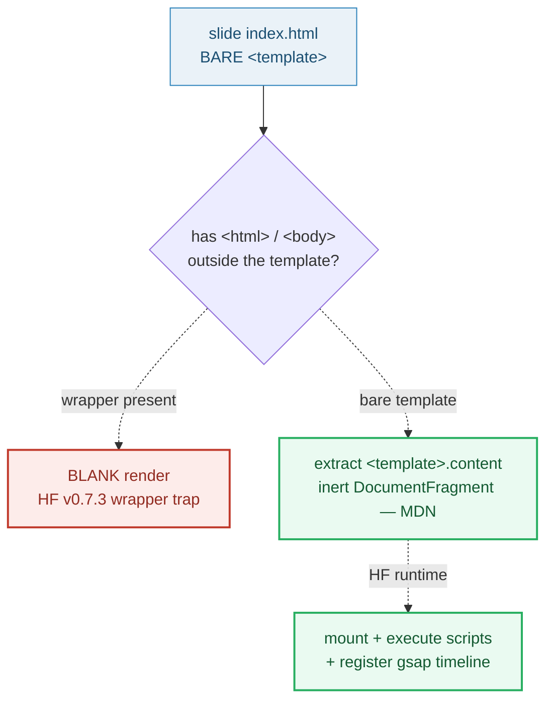

# BARE_TEMPLATE — the slide `index.html` is a bare `<template>`

> **Goal:** understand the single most load-bearing rule about slide HTML in
> RFC 0001 — that a slide's `index.html` is a **bare `<template>` element** with
> no `<html>`/`<head>`/`<body>` wrapper and no `data-composition-variables` — and
> *why* an `<html>` wrapper silently breaks HyperFrames and renders the slide
> blank.
>
> **Run:** `pnpm exec tsx bundles/bare_template.ts`
> **Prerequisites:** [UNIT_MODEL](./UNIT_MODEL.md) (a slide unit is a folder with
> `index.html` + `index.json`; this file *is* that slide's `index.html`).
> **RFC:** §5.4 (the bare `<template>` example), §5.5 ("Why bare `<template>`
> compositions"), §10 (export copies it verbatim — zero translation)

---

## Lineage — why this exists

The prior app stamped values into template files and rendered them; the slide
HTML format was an implementation detail. RFC 0001 promotes it to a **first-class
contract**: the slide `index.html` is a **bare `<template>` sub-composition**.
This is not an arbitrary choice — it is **HyperFrames' native sub-composition
format**. HF's runtime *"automatically fetches the file, extracts the `<template>`
content, mounts it, executes scripts, and registers the timeline"* (HF docs,
*Compositions*); *"each external composition file wraps its content in a
`<template>` tag."* Using that exact format as the editable source means **export
is "arrange + stamp data + render" with zero format translation** (RFC §10).

The trap is one wrong keystroke away: wrapping the `<template>` in a full
`<html><body>` document (what every HTML editor and every "new HTML file" command
emits by default) makes HF fail to extract the content, and the sub-comp renders
**blank** (verified HF v0.7.3 — `AGENTS.md`). This bundle makes that rule — and
its detection — concrete and runnable.



## What the runnable proves

> From `bare_template.ts` Section A (the anatomy — a bare `<template>`):
> ```
>   RFC 0001 §5.4 / AGENTS.md 'Layout file format — CRITICAL'
>   A slide index.html is a BARE <template> — no <html>/<head>/<body> wrapper.
>
>     <template>
>       <div data-composition-id="__SLIDE_ID__" data-width="1920" data-height="1080">
>         <div class="content">
>           <h1>__TITLE__</h1>
>           <p>__BODY__</p>
>         </div>
>         <style>
>           [data-composition-id="__SLIDE_ID__"] { background: #0a0a14; }
>           [data-composition-id="__SLIDE_ID__"] .content { text-align: center; padding-top: 38vh; }
>         </style>
>         <script>
>           var tl = gsap.timeline({ paused: true });
>           tl.from('[data-composition-id="__SLIDE_ID__"] .content > *', { opacity: 0, y: 40, duration: 0.4, stagger: 0.1 });
>           window.__timelines['__SLIDE_ID__'] = tl;
>         </script>
>       </div>
>     </template>
> [check] source begins with <template> (bare, no <html> before it): OK
> [check] extracted content carries data-composition-id="__SLIDE_ID__": OK
> [check] extracted content carries data-width="1920" data-height="1080": OK
> ```

> From `bare_template.ts` Section B (the pinned value — what HF mounts):
> ```
>   HF docs (Compositions): 'extracts the <template> content, mounts it,
>   executes scripts, and registers the timeline.'
>   MDN: <template>.content is an inert DocumentFragment, not rendered by default.
>
>   extracted data-composition-id = "__SLIDE_ID__"
>   extracted content length     = 604 chars
> [check] extracted composition id is the pre-stamp literal __SLIDE_ID__: OK
> [check] bare source has ZERO <html> tags (the wrapper is absent): OK
> [check] bare source has ZERO <body> tags: OK
>   PINNED: <html> count = 0, <body> count = 0, id = "__SLIDE_ID__"
> ```

> From `bare_template.ts` Section C (the wrapper trap):
> ```
>   AGENTS.md: 'An <html> wrapper around <template> causes HF to NOT extract the
>   content — the sub-comp renders blank. Verified in HF v0.7.3.'
>
>   bare    source: <html> x0, <body> x0 → mounts OK
>   wrapped source: <html> x1, <body> x1 → BLANK render trap
> [check] the wrapped fixture carries a detected <html>/<body> wrapper: OK
> [check] hasHtmlWrapper flags WRAPPED but passes BARE: OK
>   → detection rule: an <html>/<body> tag appears OUTSIDE the <template>;
>     a lint gate (npx hyperframes lint) should reject this before export.
> ```

> From `bare_template.ts` Section E (CSS scoping + the centering rule):
> ```
>   attribute-scoped CSS ([data-composition-id="__SLIDE_ID__"]): true
>   vertical centering via padding-top:XXvh:                   true
>   display:flex (BANNED by AGENTS.md):                        false
>   position:absolute + transform:translate (BANNED):          false
> [check] CSS scoped by attribute selector AND centered via padding-top:vh: OK
> [check] does NOT use the banned flex / absolute-transform centering: OK
> ```

## Why / internals

### Why bare `<template>` (not a full `<html>` document)

Two facts compose into the rule:

1. **`<template>` is HF's extraction handle.** HF's runtime looks for the
   `<template>` tag, reads its `.content`, and mounts that. HF's own *external
   file* example is a bare `<template>` — no `<html>` wrapper (HF docs,
   *Compositions*). When the `<template>` is nested inside a full
   `<html><body>` document, HF does **not** extract the content and the sub-comp
   renders **blank** (verified HF v0.7.3, `AGENTS.md`).
2. **The format is its own export.** Because the editable source *already is*
   HF's native sub-composition format, export copies the file **verbatim** into
   `compositions/slide-N.html` and stamps `__SLIDE_ID__` / `__FIELD__` (RFC §10).
   A wrapper would have to be stripped at export — a translation step the RFC
   explicitly avoids by mandating the format at the source.

So the rule is not stylistic: the editor's per-slide HTML surface and any
Tier-2 AI edit must produce **exactly** a bare `<template>`, and a lint gate
(`npx hyperframes lint`) rejects a wrapper before it reaches export.

### Why `<template>` at all (the MDN semantics)

The HTML `<template>` element is, by spec, an **inert carrier**: *"everything
nested inside it in the HTML source does not actually become the children of the
`<template>` element... you can only access said nested content via the special
`content` property... By default, the element's content is not rendered"* and
`.content` is a read-only `DocumentFragment` (MDN). That is precisely the
property HF exploits — the slide's markup lives inert inside `<template>` until
HF clones/mounts `.content`. It also means `<html>`/`<head>`/`<body>` **inside**
a `<template>` are parser syntax errors and get dropped (MDN) — the dangerous
case is the wrapper **outside** the `<template>` (a full document around it).

### Why CSS is scoped by `[data-composition-id="..."]` (not variables)

HF's `getVariables()` returns `{}` in v0.7.3 sub-compositions (`AGENTS.md`), so
there is no per-instance variable binding to hang styling off. Every selector is
therefore prefixed with the composition's own id:
`[data-composition-id="__SLIDE_ID__"]`. The `__SLIDE_ID__` literal is stamped to
`slide-0`, `slide-1`, … before mount (🔗 [DATA_BINDING](./DATA_BINDING.md)), so
each slide's CSS is namespaced to itself and cannot leak across slides.

### Why `padding-top:XXvh` (not flex / absolute-transform)

HF's sub-comp mounting context does **not** reliably support
`display:flex; align-items:center` or
`position:absolute; transform:translate(-50%,-50%)` (`AGENTS.md` "Why NOT
flex/absolute centering"). The HF-supported vertical-centering pattern is
`text-align:center` + `padding-top:XXvh`. The `vh` unit is viewport-relative, so
the same file works at any video size. Using flex here looks fine in a normal
browser and silently collapses in HF — a classic "works in preview, blank in
render" trap.

### Why the slide registers its own timeline (within vs between)

The slide's `<script>` builds a `gsap.timeline({ paused: true })` and registers
it under `window.__timelines['__SLIDE_ID__']`. This timeline animates **within**
the slide (content reveal, stagger, etc.). **Between**-slide transitions are a
different concern and live in the **root** `index.html` (the HOST) — see
[UNIT_MODEL](./UNIT_MODEL.md) Section C for the "between vs within" split. The
registration key is the slide's stamped `data-composition-id`, so HF can drive
each slide's own timeline from the playhead.

## 🔗 Cross-references

- 🔗 [UNIT_MODEL](./UNIT_MODEL.md) — a slide unit is a folder with `index.html`
  (this file) + `index.json`; the "between-slide (root) vs within-slide (here)"
  split.
- 🔗 [DATA_BINDING](./DATA_BINDING.md) — the `__SLIDE_ID__` / `__FIELD__`
  placeholders seen here are stamped with data from `index.json` *before* mount
  (HF `getVariables()` is `{}` in sub-comps).
- 🔗 [EXPORT_PIPELINE](./EXPORT_PIPELINE.md) — this bare `<template>` is copied
  **verbatim** into `compositions/slide-N.html`; zero translation is the whole
  point of choosing HF's native format as the source.
- 🔗 [HTML_EDITOR_SURFACE](./HTML_EDITOR_SURFACE.md) — the per-slide HTML editor
  edits this exact file and must refuse to emit an `<html>` wrapper.

## Pitfalls

<div style="overflow-x:auto;min-width:0">
<table>
<thead><tr><th>Trap</th><th>Symptom</th><th>Fix</th></tr></thead>
<tbody>
<tr><td>Wrapping the slide in <code>&lt;html&gt;&hellip;&lt;body&gt;</code> (what "New HTML file" emits)</td><td>HF renders the sub-comp <strong>blank</strong> (verified HF v0.7.3) — silent, no error</td><td>Keep a bare <code>&lt;template&gt;</code>; lint with <code>npx hyperframes lint</code>; the HTML editor must strip/refuse the wrapper</td></tr>
<tr><td>Adding <code>data-composition-variables</code> / <code>data-variable-values</code> to the slide</td><td><code>getVariables()</code> returns <code>{}</code> in v0.7.3 sub-comps; values never arrive; slide shows blanks/fallbacks</td><td>Stamp values via <code>__FIELD__</code> string replacement (🔗 DATA_BINDING); no variables on sub-comps</td></tr>
<tr><td>Centering with <code>display:flex</code> / <code>position:absolute; transform:translate()</code></td><td>Looks right in a normal browser, collapses/off-center in HF's sub-comp mount context</td><td>Use the HF pattern: <code>text-align:center</code> + <code>padding-top:XXvh</code></td></tr>
<tr><td>Unscoped CSS (e.g. <code>.content {&hellip;}</code> with no id prefix)</td><td>Styles leak across slides; one slide's CSS clobbers another after stamp</td><td>Prefix every selector with <code>[data-composition-id="__SLIDE_ID__"]</code></td></tr>
<tr><td>Leaving <code>__SLIDE_ID__</code> / <code>__FIELD__</code> un-stamped at export</td><td>HF mounts literal <code>__SLIDE_ID__</code>; CSS selectors and the timeline key miss; blank/broken slide</td><td>Always stamp before mount/export; the assembler runs stamp over every composition (RFC §10)</td></tr>
<tr><td>Putting between-slide transitions in the slide's <code>&lt;script&gt;</code></td><td>Slide tries to orchestrate other slides it cannot see; transitions break/duplicate</td><td>Within-slide timeline here; between-slide transitions in the ROOT <code>index.html</code> (🔗 UNIT_MODEL §C)</td></tr>
<tr><td>Registering the timeline under a hardcoded key (<code>'slide-0'</code>)</td><td>Reusing the layout for slide-1 overwrites slide-0's timeline; one slide animates as another</td><td>Register under the stamped <code>data-composition-id</code> (<code>window.__timelines['__SLIDE_ID__']</code>)</td></tr>
</tbody>
</table>
</div>

## Cheat sheet

```
slide index.html = a BARE <template>  (NO <html>/<head>/<body>, NO data-composition-variables)
anatomy          = <template>
                     <div data-composition-id="__SLIDE_ID__" data-width="1920" data-height="1080">
                       content + <style> + <script>
                     </div>
                   </template>
extraction       = HF reads <template>.content (an inert DocumentFragment — MDN) and mounts it
wrapper trap     = <html>/<body> AROUND <template> → HF blank render (HF v0.7.3); lint-reject it
CSS scope        = [data-composition-id="__SLIDE_ID__"] prefix on every selector (getVariables()={})
centering        = text-align:center + padding-top:XXvh  (NOT flex / absolute+transform)
timeline         = gsap.timeline({paused:true}) → window.__timelines['__SLIDE_ID__']  (within-slide)
placeholders     = __SLIDE_ID__, __TITLE__, __BODY__ ... stamped from index.json BEFORE mount
export           = copy this file VERBATIM → compositions/slide-N.html, then stamp (zero translation)
```

## Sources

- RFC 0001 §5.4 (bare `<template>` example), §5.5 ("Why bare `<template>`
  compositions"), §10 (export copies it verbatim): `docs/rfc-0001.md` (in-repo)
- `docs/AGENTS.md` — "Layout file format — CRITICAL", "Why bare `<template>`
  (no `<html>` wrapper)", "Why NOT data-variable-values / getVariables()",
  "Why NOT flex/absolute centering", "Sub-composition model" (in-repo)
- MDN, `<template>` — the HTML content template element (.content is an inert
  DocumentFragment; not rendered by default; `<html>`/`<head>`/`<body>` inside a
  template are parser syntax errors): https://developer.mozilla.org/en-US/docs/Web/HTML/Element/template
- HyperFrames, *Compositions* — "extracts the `<template>` content, mounts it,
  executes scripts, and registers the timeline"; "each external composition file
  wraps its content in a `<template>` tag": https://hyperframes.heygen.com/concepts/compositions
