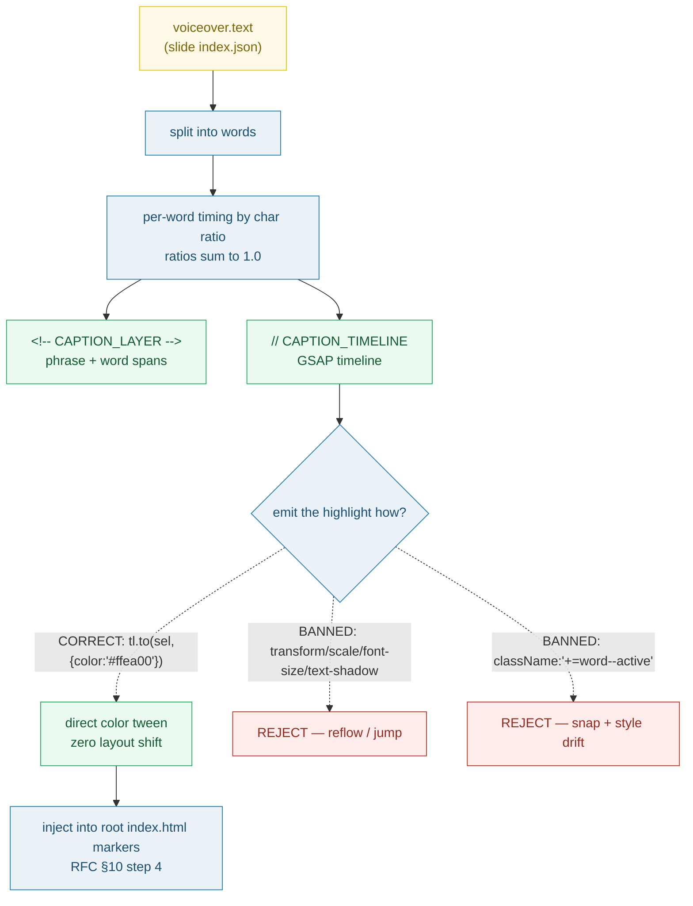

# CAPTIONS_KARAOKE — word-level karaoke captions (AGENTS.md CRITICAL RULES)

> **Goal:** understand the ONE export contract that makes karaoke captions look
> smooth instead of "jumping" — each voiceover word is timed by **char ratio**
> and highlighted by a **GSAP direct color tween**, and a fixed list of CSS/JS
> patterns are **banned** on the active word. This bundle exists to drill those
> banned patterns, because they are the whole point.
>
> **Run:** `pnpm exec tsx bundles/captions_karaoke.ts`
> **Prerequisites:** [UNIT_MODEL](./UNIT_MODEL.md) (root `index.html` vs slide
> `index.html`), [SLIDE_INDEX_JSON](./SLIDE_INDEX_JSON.md) (`voiceover.text`).
> **Spec:** AGENTS.md "Caption styling — CRITICAL RULES" + RFC 0001 §7 (markers) / §10 (pipeline step 4).

---

## Lineage — why this exists

The voiceover pipeline ([SLIDE_INDEX_JSON](./SLIDE_INDEX_JSON.md)) measures each
sentence's real TTS duration. The captions pipeline then turns one sentence into a
row of word spans that light up in sync with that audio. RFC 0001 §10 step 4 makes
the assembler run the existing `captions.build_captions()` to emit two things into
the **root** `index.html` — the caption HTML and the GSAP word-highlight timeline.
AGENTS.md freezes the styling contract so preview and export agree (RFC §9.4):

> Caption highlighting uses **GSAP direct color tween** (not CSS class toggling).

The risk this contract kills is "jumping": if the active word also changes size,
scale, or shadow, the whole caption line reflows every word and looks broken. So
the rules are deliberately asymmetric — animate `color`, animate **nothing else**.



## What the runnable proves

> From `captions_karaoke.ts` Section A (char-ratio timing — the pinned value):
> ```
>   sentence = "Eco bottles save the planet"
>   words = 5, totalChars = 23 (ignoring spaces)
>
>   ┌───────┬───────┬────────┬────────────┬────────────┬────────────┬────────────┐
>   │ word  │ chars │ ratio  │ start (s)  │ dur (s)    │ end (s)    │ emphasis?  │
>   ├───────┼───────┼────────┼────────────┼────────────┼────────────┼────────────┤
>   │ Eco   │ 3     │ 0.130435 │ 0.000000   │ 0.600000   │ 0.600000   │ —          │
>   │ bottles │ 7     │ 0.304348 │ 0.600000   │ 1.400000   │ 2.000000   │ YES        │
>   │ save  │ 4     │ 0.173913 │ 2.000000   │ 0.800000   │ 2.800000   │ —          │
>   │ the   │ 3     │ 0.130435 │ 2.800000   │ 0.600000   │ 3.400000   │ —          │
>   │ planet │ 6     │ 0.260870 │ 3.400000   │ 1.200000   │ 4.600000   │ YES        │
>   └───────┴───────┴────────┴────────────┴────────────┴────────────┴────────────┘
> [check] char-ratios sum to 1.0 (exact partition): OK
> [check] per-word durations sum to sentenceDur: OK
>   PINNED: ratioSum = 1.000000   durSum = 4.600000 (=== 4.600000)
> ```

> From `captions_karaoke.ts` Section B (the CORRECT GSAP pattern):
> ```
>   AGENTS.md "The correct caption pattern" (verbatim):
>     tl.to(wordSelector, { color: '#ffea00', duration: 0.15, ease: 'power2.out' }, wordStart);
>     tl.to(wordSelector, { color: 'rgba(255,255,255,0.4)', duration: 0.15, ease: 'power2.in' }, wordEnd);
>
>   // CAPTION_TIMELINE  (two direct-color tweens per word):
>     var tl = gsap.timeline({ paused: true });
>     tl.to('[data-i="0"]', { color: '#ffea00', duration: 0.150000, ease: 'power2.out' }, 0.000000);
>     tl.to('[data-i="0"]', { color: 'rgba(255,255,255,0.4)', duration: 0.150000, ease: 'power2.in' }, 0.600000);
>     ...
> [check] timeline uses DIRECT color tweens (no className): OK
> [check] timeline tweens the ACTIVE color exactly once per word: OK
> ```

> From `captions_karaoke.ts` Section C/D (the detectors — banned = the point):
> ```
> [check] lintCaptionCSS PASSES on the correct base style (no banned tokens in .word--active): OK
> [check] lintCaptionCSS FAILS on the banned .word--active (transform/scale/font-size/text-shadow): OK
>   bannedCss   lint → ok=false  hits=[".word--active contains \"transform\"",".word--active contains \"scale(\"",".word--active contains \"font-size\"",".word--active contains \"text-shadow\""]
> [check] lintCaptionJS FAILS on the className toggle: OK
> [check] lintCaptionJS PASSES on the direct color tween: OK
> ```

> From `captions_karaoke.ts` Section F (the enum + markers):
> ```
>   RFC 0001 §5.2: theme.caption_style ∈ { highlight, neon, editorial, eco-green }
>   highlight   active=#ffea00      spec-pinned (AGENTS.md)
>   neon        active=(template-defined) enum-only
>   editorial   active=(template-defined) enum-only
>   eco-green   active=(template-defined) enum-only
> [check] caption_style enum has exactly the 4 RFC §5.2 members: OK
> ```

## Why / internals

### Why char ratio (and why the ratios sum to 1.0)
`captions.build_captions()` step 2 says "estimate per-word timing by char ratio."
The natural normalization — `wordChars / totalChars` *ignoring spaces* — is an
exact partition of 1.0, so `Σ durationᵢ = sentenceDur * Σ ratioᵢ = sentenceDur`.
That invariant is what Section A's first `[check]` asserts: if it ever failed, a
word would drift out of sync with the audio. Longer words (`bottles`, `planet`)
get proportionally more time; the cursor advances by each duration so starts are
`sentenceStart + Σ previousDurations`.

### Why a DIRECT color tween (not a class toggle)
`tl.to(sel, { color })` sets one non-layout CSS property every frame (GSAP docs:
a tween is a "high-performance property setter" that applies the interpolated
property value at each playhead position). `color` never reflows the line box, so
the caption stays pixel-stable while the active word lights up. AGENTS.md quotes
the exact two tweens — color → `#ffea00` at `wordStart`, color → dim white at
`wordEnd`, each `0.15s`.

### Why `transform`/`font-size`/`text-shadow` are banned on `.word--active`
MDN: "CSS transforms **change the shape and position** of the affected content."
`scale(1.15)` rescales the box; `font-size: 56px` reflows the line; a new
`text-shadow` repaints a different glyph halo. Each forces the browser to
recompute layout/paint mid-animation → the visible "jump". The lint is scoped to
`.word--active` blocks deliberately: `transform: scale(...)` is *legal* elsewhere
(the preview's canvas-frame scaling in [STAGE_CANVAS](./STAGE_CANVAS.md)) — it is
banned only on the actively-highlighted word.

### Why GSAP `className` is banned
GSAP's className plugin reads computed styles before/after the class swap and
tweens the diff. In practice it (1) picks up unintended property changes and
animates them, (2) at `duration: 0.05` is too short to see — an instant **snap**,
and (3) fights the CSS `transition` on the same element. So even though it looks
like "animate adding a class," it is banned; use a direct `color`/`opacity` tween.

### Emphasis is STATIC, the active state is animated
`.word--emphasis { color:#4ade80; }` is colored once at render and never touched
by the timeline. `.word--active` is the *only* thing the timeline animates, and
only its `color`. Section E's `[check]` confirms the caption layer never emits
`word--active` as a class — that state exists only as tween targets, not markup.

## 🔗 Cross-references

- 🔗 [SLIDE_INDEX_JSON](./SLIDE_INDEX_JSON.md) — `voiceover.text` is the sentence
  split into captioned words; per-word timings derive from the measured
  `voiceover` duration.
- 🔗 [ROOT_INDEX_JSON](./ROOT_INDEX_JSON.md) — `theme.caption_style` selects which
  caption CSS (`/* CAPTION_CSS */`) the assembler emits.
- 🔗 [STAGE_CANVAS](./STAGE_CANVAS.md) — the preview drives this caption GSAP
  timeline from the global playhead (same local-time clamp as a slide timeline).
- 🔗 [TIMELINE_PANEL](./TIMELINE_PANEL.md) — caption timeline positions are
  absolute on the root timeline; the panel is the view over slide order +
  measured durations.

## Pitfalls

> **NON-NEGOTIABLE.** This bundle's pitfalls ARE the lesson — every row is a
> banned pattern from AGENTS.md. The detectors (`lintCaptionCSS` /
> `lintCaptionJS`) exist to catch them at export.

<div style="overflow-x:auto;min-width:0">

| Trap (BANNED) | Symptom | Fix |
|---|---|---|
| `transform: scale(1.15)` on `.word--active` | word box rescales → the whole caption line **reflows/jumps** every word | color ONLY: `tl.to(sel,{color:'#ffea00'})` |
| `font-size: 56px` on `.word--active` | line-box reflow; neighbors shift horizontally | keep one `font-size` on base `.word`; never on active |
| `text-shadow: 0 0 30px ...` on `.word--active` | repaint of a different halo each frame → visual flicker | static `text-shadow` on base `.word` only |
| `tl.to(word,{className:'+=word--active'})` | instant **snap** (0.05s too short); animates unintended props; fights CSS `transition` | direct property tween (`color`/`opacity`) |
| `tl.to(word,{className:'+=word--active',duration:0.05})` short duration | not a tween at all — an invisible class swap | give the color tween a real `duration` (0.15s) |
| animating `.word--emphasis` | a static keyword color starts "flashing" | emphasis is set once in CSS, never targeted by the timeline |
| per-word timings that don't sum to `sentenceDur` | last word ends early/late vs audio (drift) | char-ratio partition: `Σ ratioᵢ = 1.0` (Section A check) |
| emitting `word--active` as a class in the caption HTML | markup + tween fight over the same state | layer emits `word` / `word--emphasis` only; active is tween-only |

</div>

## Cheat sheet

```
timing      word i dur  = sentenceDur * (wordChars / totalChars)   # ignoring spaces
            word i start = sentenceStart + Σ previousDurations     # ratios sum to 1.0
CORRECT     tl.to('[data-i="n"]', { color:'#ffea00', duration:0.15, ease:'power2.out' }, wordStart)
            tl.to('[data-i="n"]', { color:'rgba(255,255,255,0.4)', duration:0.15, ease:'power2.in' }, wordEnd)
BANNED css  .word--active { transform; scale(); font-size; text-shadow }   # layout shift
BANNED js   tl.to(x, { className:'+=word--active' })                       # snap + drift
base        .word { display:inline-block; color:rgba(255,255,255,.4); transition:color .2s ease }
emphasis    .word--emphasis { color:#4ade80 }   # static, never animated
markers     <!-- CAPTION_LAYER -->  /* CAPTION_CSS */  // CAPTION_TIMELINE    (root index.html)
enum        caption_style ∈ { highlight(#ffea00), neon, editorial, eco-green }   # RFC §5.2
pipeline    captions.build_captions() → layer + timeline   (RFC §10 step 4)
```

## Sources

- AGENTS.md — "Caption styling — CRITICAL RULES", "The correct caption pattern",
  "What NOT to do", "Why `className` toggle is banned", "Root index.html markers",
  voiceover→captions pipeline (in-repo: `docs/AGENTS.md`).
- RFC 0001 — §5.2 (`theme.caption_style`), §7 (caption overlay surface),
  §10 step 4 (captions pipeline at export) (in-repo: `docs/rfc-0001.md`).
- GSAP Tween docs — `tl.to(target, { color })` is a direct property tween
  ("high-performance property setter"): https://gsap.com/docs/v3/GSAP/Tween/
- MDN — CSS transforms "change the shape and position of the affected content"
  (why `transform`/`scale` are banned on the active word):
  https://developer.mozilla.org/en-US/docs/Web/CSS/CSS_transforms/Using_CSS_transforms
