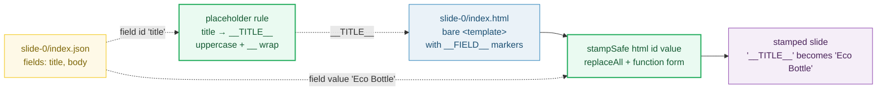

# DATA_BINDING — `__FIELD__` stamping: how `fields` reach the HTML

> **Goal:** understand the single mechanism that carries values from a slide's
> `index.json` (`fields`) into its `index.html` — **string replacement**, called
> "stamping". Each field id uppercases to a placeholder (`title` → `__TITLE__`)
> and is substituted into the HTML. This exists because HyperFrames'
> `getVariables()` returns `{}` in sub-compositions, so HF variables cannot be
> used.
>
> **Run:** `pnpm exec tsx bundles/data_binding.ts`
> **Prerequisites:** [UNIT_MODEL](./UNIT_MODEL.md) (the unit model),
> [BARE_TEMPLATE](./BARE_TEMPLATE.md) (the format being stamped into),
> [SLIDE_INDEX_JSON](./SLIDE_INDEX_JSON.md) (where `fields` live).
> **RFC:** §5.6 (Data binding); decision record §5.5; export step §10.2.

---

## Lineage — why this exists

The prior app stamped values into a template via a generated HTML form. RFC 0001
keeps that mechanism and **promotes it to the contract** for how data reaches a
slide's animation file. From §5.6:

> Stamping — `__FIELD__` string replacement — remains the data-injection
> mechanism, because HF's `getVariables()` returns `{}` in sub-compositions
> ([`AGENTS.md`](../docs/AGENTS.md)). The editor:
> - Stamps on structural change (slide add/remove/reorder, layout swap).
> - Live-binds text **fields** for responsive editing (textarea → immediate
>   preview update via a light DOM patch, no full re-stamp).
> - Fully re-stamps at export.

Three facts make stamping non-optional: (1) slides are bare `<template>`
sub-compositions, (2) HF's `getVariables()` returns `{}` for sub-comps, so the
HF variable system is unavailable, and (3) the source files are already HF's
files, so stamping is the **only** step needed to make them renderable (§10).



## What the runnable proves

> From `data_binding.ts` Section A (the placeholder rule):
> ```
>   field id   -> placeholder   (uppercased, wrapped in __)
>     title      -> __TITLE__
> [check] placeholder for "title" is __ID_UPPER__: OK
>     body       -> __BODY__
> [check] placeholder for "body" is __ID_UPPER__: OK
>     image      -> __IMAGE__
> [check] placeholder for "image" is __ID_UPPER__: OK
>     step       -> __STEP__
> [check] placeholder for "step" is __ID_UPPER__: OK
>   special:   __SLIDE_ID__ (slide-id, not a field id)
>
>   the stamp function (one-line):
>     html.replaceAll("__" + id.toUpperCase() + "__", value)
> [check] the placeholder rule is field id -> __ID_UPPER__: OK
> ```

> From `data_binding.ts` Section B (the pinned value):
> ```
>   AFTER stamping (__SLIDE_ID__ -> slide-0, __TITLE__ -> Eco Bottle, __BODY__ -> Hello World):
>     <template>
>       <div data-composition-id="slide-0" data-width="1920" data-height="1080">
>         <div class="content">
>           <h1>Eco Bottle</h1>
>           <p>Hello World</p>
>         </div>
>   ...
> [check] after stamping, no __PLACEHOLDER__ remains: OK
> [check] after stamping contains the stamped title: OK
>   PINNED: distinct placeholders substituted = 3 (SLIDE_ID, TITLE, BODY)
>   GOLD:   after.includes("Eco Bottle") && !after.includes("__TITLE__") => true
> ```

> From `data_binding.ts` Section C (the THREE stamping modes):
> ```
>   ┌──────────────┬──────────────────────────────────┬──────────────────────────────────────────┬──────────────────────────┐
>   │ Mode         │ Trigger                          │ Mechanism                                │ Cost                     │
>   ├──────────────┼──────────────────────────────────┼──────────────────────────────────────────┼──────────────────────────┤
>   │ structural   │ slide add / remove / reorder,    │ Full re-stamp of the affected slide's    │ One rewrite per change.  │
>   │              │ layout swap                      │ HTML from its fields.                    │                          │
>   ├──────────────┼──────────────────────────────────┼──────────────────────────────────────────┼──────────────────────────┤
>   │ live-bind    │ typing in a text field (textarea) │ Light DOM patch on the ONE node bound to │ No full re-stamp; the    │
>   │              │                                  │ the field.                               │ stage stays responsive.   │
>   ├──────────────┼──────────────────────────────────┼──────────────────────────────────────────┼──────────────────────────┤
>   │ export       │ Export to MP4                    │ Full re-stamp of EVERY slide from its    │ Runs once, at export.    │
>   │              │                                  │ index.json; produces the rendered truth. │                          │
>   └──────────────┴──────────────────────────────────┴──────────────────────────────────────────┴──────────────────────────┘
> [check] RFC §5.6 defines exactly three stamping modes (structural / live-bind / export): OK
> ```

> From `data_binding.ts` Section E (the MDN-verified `$` pitfall — the real corruption cases):
> ```
>   NAIVE stampNaive(html, 'body', value) — corruption table:
> [check] naive: value contains $& -> "Cost: x __BODY__ y": OK
>     value contains $&      value="x $& y"     -> "Cost: x __BODY__ y"
> [check] naive: value contains $$ -> "Cost: Pay $5": OK
>     value contains $$      value="Pay $$5"    -> "Cost: Pay $5"
> [check] naive: value contains $` -> "Cost: x Cost:  y": OK
>     value contains $`      value="x $` y"     -> "Cost: x Cost:  y"
> [check] naive: value contains $' -> "Cost: x  y": OK
>     value contains $'      value="x $' y"     -> "Cost: x  y"
> [check] naive: value contains $5 -> "Cost: Cost: $5": OK
>     value contains $5      value="Cost: $5"   -> "Cost: Cost: $5"
>
>   SAFE stampSafe(html, 'body', value) — function form, every value preserved:
> [check] safe: value contains $& preserved verbatim: OK
>   ...
>   → FIX: use a replacement FUNCTION (() => value); MDN: special patterns do not
>     apply for strings returned from the replacer function.
> ```

## Why / internals

### Why the `__ID_UPPER__` placeholder shape

Double underscores on both sides + uppercase id is **deliberately unlikely** to
collide with anything a template author would type in body copy or CSS. The
shape is also a single, mechanically-derivable token: `"__" + id.toUpperCase() + "__"`,
so the stamp function needs no lookup table — every field is its own rule. The
one exception is `__SLIDE_ID__`, which is **structural** (the slide's mount id
used in `data-composition-id`, in CSS attribute selectors, and in the GSAP
timeline registry) — it is stamped from the slide's folder id, not from `fields`.

### Why string replacement and not HF variables

HyperFrames exposes `getVariables()` for compositions, but in **v0.7.3 it
returns `{}` for sub-compositions** (verified in
[`AGENTS.md`](../docs/AGENTS.md) "Why NOT data-variable-values / getVariables()").
Since every slide is a sub-comp (see 🔗 BARE_TEMPLATE), the HF variable system is
unavailable exactly where we need it. String replacement works on plain HTML
text, so it is unaffected by HF's runtime — it runs **before** HF ever sees the
file. This is also why export is just "assemble + stamp + render" (§10): the
stamped file is already a valid, self-contained HF composition.

### Why three modes (and not "always full re-stamp")

Typing one character in a title textarea must not rewrite the whole slide's HTML
and remount the sub-comp — that would flicker the stage and lose GSAP state.
So the editor splits the work:

- **structural** changes mutate the slide set or which layout a slide uses —
  those need a fresh stamp because the HTML skeleton changed;
- **live-bind** edits one field's text, so the editor patches only the one DOM
  node bound to that field (responsive, no re-stamp);
- **export** re-stamps every slide from its `index.json` so the rendered file is
  the single source of truth, not whatever the live-bind state left on the stage.

The full-re-stamp at export is what makes "the file is the truth" hold even
though the stage was driven by fast DOM patches during editing.

### Why the replacement-FUNCTION form (the `$` fix)

`String.prototype.replaceAll` with a **string** replacement still parses the
replacement for special patterns. MDN
([`String.prototype.replace`](https://developer.mozilla.org/en-US/docs/Web/JavaScript/Reference/Global_Objects/String/replace))
lists them: `$$` → `$`, `$&` → the matched substring, `` $` `` → the portion
before the match, `$'` → the portion after. (`$n` / `$<Name>` need a **RegExp**
search, so a plain string search leaves them literal — which is why `$5` does
**not** corrupt, but `$$`, `$&`, `` $` ``, `$'` do.) A title like `"Special: $&"`
would silently inject the literal placeholder text into the slide. The fix is to
pass a **function** as the replacement: `html.replaceAll(ph, () => value)`. MDN:
*"The above-mentioned special replacement patterns do not apply for strings
returned from the replacer function."* This is one of those silent bugs that
only fires on certain user input — use the function form unconditionally.

## 🔗 Cross-references

- 🔗 [BARE_TEMPLATE](./BARE_TEMPLATE.md) — the file format being stamped into
  (bare `<template>`, no `<html>` wrapper); stamping is what turns it from a
  skeleton into a renderable slide.
- 🔗 [SLIDE_INDEX_JSON](./SLIDE_INDEX_JSON.md) — `fields` here is the source of
  every stamped value; `__SLIDE_ID__` comes from the slide's folder id.
- 🔗 [PROPERTIES_PANEL](./PROPERTIES_PANEL.md) — the **live-bind** mode is what
  the Properties panel does while you type (light DOM patch, no full re-stamp).
- 🔗 [EXPORT_PIPELINE](./EXPORT_PIPELINE.md) — the **export** mode runs a full
  re-stamp of every slide so the rendered file is the single source of truth.

## Pitfalls

| Trap | Symptom | Fix |
|---|---|---|
| Naive `replaceAll(ph, value)` with a string replacement | A value containing `$$`, `$&`, `` $` ``, or `$'` is silently corrupted (`"Special: $&"` → injects the placeholder text; `"Pay $$5"` → `"Pay $5"`) | Use the function form: `html.replaceAll(ph, () => value)` — MDN: special patterns do not apply to replacer-function return values |
| Using `replace()` instead of `replaceAll()` | Only the **first** occurrence is substituted; `__SLIDE_ID__` (used in `data-composition-id`, CSS selectors, and the GSAP registry) is left half-stamped → broken styling + broken timeline | Use `replaceAll` — a placeholder appears many times in one template |
| Treating `__SLIDE_ID__` as a field | Slide-id never stamped, so HF mounts the sub-comp under a literal `__SLIDE_ID__` id; CSS attribute selectors and `window.__timelines['__SLIDE_ID__']` all miss | Stamp `__SLIDE_ID__` from the slide's folder id **separately** from `fields`; it is structural, not data |
| Stamping an image field as text | Bytes (or a data URL) end up in the HTML, bloating it and breaking HF asset handling | Image → byte swap to `assets/` first, then stamp the **path** into `__IMAGE__` (AGENTS.md "Layout field types") |
| Live-binding during typing and never re-stamping at export | The rendered MP4 reflects stale stage state, not the saved `index.json` | Always run a full re-stamp of every slide at export (RFC §5.6 mode 3) — the file is the truth |
| Assuming HF `getVariables()` works for sub-comps | Variables resolve to `{}`; the slide renders with blank fields (verified HF v0.7.3) | Stamping is the **only** mechanism that works in sub-compositions; do not add a "variables" path |
| Placeholder typo in the template (`__TITEL__`, `__Title__`) | The field's value never lands; the literal `__TITEL__` shows in the rendered slide | Template authors use uppercase: `__FIELDID_UPPER__`; the stamp uppercases the id, so the placeholder must be all-caps |
| Case-mismatched field id (`Title` vs `title`) | Both uppercase to `__TITLE__`, so this is *safe* — but a field id with unusual chars (`hero-1`) produces `__HERO-1__`, easy to typo in the template | Keep field ids lowercase-kebab or lowercase-snake; document the placeholder next to each field |

## Cheat sheet

```
placeholder rule : field id "title" -> "__TITLE__"  (= "__" + id.toUpperCase() + "__")
special          : __SLIDE_ID__  (structural, from the slide's folder id — NOT a field)
stamp (safe)     : html.replaceAll("__" + id.toUpperCase() + "__", () => value)
stamp (NAIVE)    : html.replaceAll(ph, value)          // corrupts on $$ $& $` $' — do not use
image field      : bytes -> assets/, then stamp the PATH into __IMAGE__ (not text)
THREE modes      : structural (add/remove/reorder/swap) | live-bind (textarea DOM patch) | export (full re-stamp)
why stamp        : HF getVariables() returns {} in v0.7.3 sub-compositions -> variables unusable
export step      : assemble + stamp __SLIDE_ID__ + every __FIELD__ + render  (RFC §10)
```

## Sources

- RFC 0001 §5.6 (Data binding), §5.5 (decision record), §10.2 (Stamp): `docs/rfc-0001.md` (in-repo)
- `docs/AGENTS.md` "Placeholder convention" + "Layout field types" + "Why NOT data-variable-values / getVariables()" (in-repo)
- MDN `String.prototype.replace` — special replacement-string patterns and the replacer-function exception: https://developer.mozilla.org/en-US/docs/Web/JavaScript/Reference/Global_Objects/String/replace
- MDN `String.prototype.replaceAll` — global replacement semantics (a placeholder appears many times): https://developer.mozilla.org/en-US/docs/Web/JavaScript/Reference/Global_Objects/String/replaceAll
- MDN `<template>` element — the placeholder-substitution pattern used by layouts: https://developer.mozilla.org/en-US/docs/Web/HTML/Element/template
