# EXPORT_PIPELINE — turn a workspace into an MP4 in 6 deterministic steps

> **Goal:** understand the whole export path — how the RFC §5.1 workspace (root
> `index.html`/`index.json` + `slides/*/index.{html,json}` + `assets/`) becomes an
> MP4. The single load-bearing claim: **zero format translation**. The slide
> `index.html` files ARE already HyperFrames' sub-composition format (bare
> `<template>`), so export never compiles a scene graph into HTML — it copies,
> stamps data, and renders.
>
> **Run:** `pnpm exec tsx bundles/export_pipeline.ts`
> **Prerequisites:** [UNIT_MODEL](./UNIT_MODEL.md) (the workspace shape),
> [BARE_TEMPLATE](./BARE_TEMPLATE.md) (what gets copied), [DATA_BINDING](./DATA_BINDING.md)
> (the `__FIELD__` stamp).
> **RFC:** §10 (Export Pipeline), §5.4–5.6, §16, §18

---

## Lineage — why this exists

The prior app stamped values into a template and rendered it, but had no clean
"export" abstraction — stamping and rendering were tangled inside one form
handler. RFC 0001 splits the model into a **symmetric unit workspace** (§5.1)
where the slide `index.html` is *already* HyperFrames' native sub-composition
format (a bare `<template>`, §5.4). That one decision collapses export to:

> **Export is assembly + stamp + render — no format translation, because the
> source files are already HF's files.** (RFC §10)

There is no exporter that walks a JSON scene graph and emits HTML. There is no
serializer. The assembler is a **file copier + string stamper** that hands the
resulting tree to `npx hyperframes render`. `AGENTS.md` is the **export-target
spec** — the assembler's output must obey the full AGENTS.md contract (bare
`<template>`, `position:absolute;inset:0;` host divs, caption rules, the
`__PLACEHOLDER__` convention).

```mermaid
graph LR
  WS["workspace/<br/>root + slides/ + assets/<br/>(RFC §5.1 units)"]:::data

  WS -.->|"1. assemble<br/>copy slide index.html VERBATIM<br/>into compositions/slide-N.html"| ASS:::stage
  ASS -.->|"2. stamp<br/>__SLIDE_ID__ + __FIELD__<br/>(from slide index.json)"| STM:::stage
  STM -.->|"3. voiceover<br/>edge-tts + ffprobe + ffmpeg<br/>→ data-start/data-duration + DUR"| VO:::stage
  VO -.->|"4. captions<br/>build_captions() → markers<br/>CAPTION_LAYER / CAPTION_TIMELINE"| CAP:::stage
  CAP -.->|"5. render<br/>npx hyperframes render<br/>--output scene.mp4"| RND:::stage
  RND -.->|"6. progress<br/>parse HF stdout → events"| PROG["scene.mp4 + UI bar"]:::data

  classDef data fill:#fef9e7,stroke:#f1c40f,color:#7d6608
  classDef stage fill:#eaf2f8,stroke:#2980b9,color:#1b4f72
```



## What the runnable proves

> From `export_pipeline.ts` Section A (the 6 stages — ZERO TRANSLATION):
> ```
>   1. assemble  — write workspace into HF layout: root index.html + compositions/slide-N.html + assets/
>   2. stamp     — replace __SLIDE_ID__ and every __FIELD__ in each composition from slide index.json
>   3. voiceover — edge-tts + ffprobe + ffmpeg concat → timings → data-start/data-duration + root DUR
>   4. captions  — build_captions() → caption layer + GSAP word-highlight into the root markers
>   5. render    — npx hyperframes render <workspace> --output scene.mp4
>   6. progress  — parse HF stdout → progress events → UI progress bar
> [check] the pipeline has exactly 6 stages: OK
> [check] no stage translates a foreign scene graph into HTML (zero translation): OK
> ```

> From `export_pipeline.ts` Section B (assemble = verbatim copy):
> ```
>   emitted HF layout tree:
>     workspace/
>       index.html                          (root HOST — markers)
>       compositions/slide-0.html               (slide index.html, copied verbatim)
>       compositions/slide-1.html               (slide index.html, copied verbatim)
>       assets/voiceover.mp3
>       assets/sha256-c0ffee.jpg
> [check] slide-0 index.html copied VERBATIM into compositions/slide-0.html: OK
> [check] slide-1 index.html copied VERBATIM into compositions/slide-1.html: OK
> [check] every emitted composition is still a bare <template> (no <html> wrapper): OK
>   PINNED: emitted files = 3 + assets/(2)
> ```

> From `export_pipeline.ts` Section C (stamp — the GOLD value):
> ```
>   stamped compositions/slide-0.html:
>     <template>
>       <div data-composition-id="slide-0" data-width="1920" data-height="1080">
>         <div class="content">
>           <h1>Eco Bottle</h1>
>           <p>Refill. Reuse. Repeat.</p>
>         </div>
>         ...
> [check] stamped composition contains data-composition-id="slide-0": OK
> [check] stamped composition contains the title text: OK
> [check] stamped composition contains the body text: OK
> [check] ZERO __ placeholders remain after stamp: OK
>   PINNED: remaining __...__ placeholders after stamp = 0  ← GOLD
>   GOLD:   countPlaceholders(stamped) === 0 => true
> ```

> From `export_pipeline.ts` Section D (voiceover timings drive host divs + DUR):
> ```
>   ┌──────────┬──────────┬──────────┬──────────┬────────────────────────────────┐
>   │ slide    │ start    │ duration │ end      │ source                         │
>   ├──────────┼──────────┼──────────┼──────────┼────────────────────────────────┤
>   │ slide-0 │ 0.500000 │ 4.600000 │ 5.100000 │ INITIAL_LEAD (0.5)             │
>   │ slide-1 │ 5.900000 │ 3.400000 │ 9.300000 │ prev_end(5.100000) + GAP(0.8)  │
>   └──────────┴──────────┴──────────┴──────────┴────────────────────────────────┘
> 
>   host divs written into root index.html (data-start/data-duration from timings):
>     <div data-composition-id="slide-0" data-composition-src="compositions/slide-0.html" data-start="0.500000" data-duration="4.600000" class="clip" style="position:absolute;inset:0;z-index:100;"></div>
>     <div data-composition-id="slide-1" data-composition-src="compositions/slide-1.html" data-start="5.900000" data-duration="3.400000" class="clip" style="position:absolute;inset:0;z-index:99;"></div>
> [check] root DUR stamped to the measured voiceover length: OK
> [check] slide-1 start = slide-0 end + gap_between_slides: OK
>   PINNED: root DUR = 9.300000 (last slide end)
> ```

> From `export_pipeline.ts` Section F (render + progress):
> ```
>   render command: npx hyperframes render workspace --output scene.mp4
>   parsed progress events:
>     frame 1/270 → 0.370370%
>     frame 135/270 → 50.000000%
>     frame 270/270 → 100.000000%
> [check] progress parser extracts frame x/total from HF stdout: OK
> [check] final frame reaches 100%: OK
>   PINNED: progress events parsed = 3; final = 100.000000%
>   RFC §18 risk: the parser couples to HF's stdout format — pin HF version, integration-test it.
> ```

## Why / internals

### Why zero translation is structurally guaranteed (not a hope)

The slide `index.html` is authored AS a bare `<template>` sub-composition
(§5.4 / AGENTS.md "Layout file format"). HyperFrames' runtime "extracts the
`<template>` content, mounts it, executes scripts, and registers the timeline"
(HF docs — see 🔗 [BARE_TEMPLATE](./BARE_TEMPLATE.md)). So the editor's source
format *is* HF's on-disk format. Export's "assemble" step is therefore a
**`cp`**, not a compile: `slides/slide-0/index.html` → `compositions/slide-0.html`
byte-for-byte (Section B's two `[check] ... copied VERBATIM` lines assert this).
If the source were a JSON scene graph, you would need a serializer that could
diverge from the preview; because the source IS HTML, preview and export read
the same bytes.

### Why stamping (not HF variables) is step 2

HyperFrames' `getVariables()` returns `{}` in v0.7.3 sub-compositions
(AGENTS.md "Why NOT data-variable-values"). So data reaches the HTML by
**`__FIELD__` string replacement** (§5.6): each field id uppercases to a
placeholder (`title` → `__TITLE__`), and the special `__SLIDE_ID__` placeholder
is replaced with `slide-N`. The stamped composition must contain **zero**
`__...__` placeholders remaining — that is the GOLD value this bundle pins
(Section C: `remaining __...__ placeholders after stamp = 0`). See 🔗
[DATA_BINDING](./DATA_BINDING.md) for the safe-stamp form (replacement as a
function, so `$` patterns in values don't corrupt).

### Why voiceover timings OWN the timeline (not the editor)

Slide durations are not guessed — they are **measured**. The voiceover step runs
`edge-tts` per sentence → `ffprobe` measures each MP3's real duration →
`ffmpeg` concatenates silence-padded sentences into one `voiceover.mp3`. Then
**smart timing** (AGENTS.md) computes each slide's start as
`prev_end + gap_between_slides` (default `0.8`s; slide-0 gets an initial lead of
`0.5`s). Those computed starts become the host divs' `data-start`/
`data-duration`, and the root `DUR` variable is set to the last slide's end
(Section D: `DUR = 9.300000`). The timeline panel is a *view* over `(slide
order + measured durations)` — it never persists timing as a separate structure.
See 🔗 [SLIDE_INDEX_JSON](./SLIDE_INDEX_JSON.md) and 🔗
[TIMELINE_PANEL](./TIMELINE_PANEL.md).

### Why captions + transitions inject into the SAME root via markers

The root `index.html` carries four markers (AGENTS.md "Root index.html markers"):

| Marker | Replaced by |
|---|---|
| `<!-- SLIDES_HERE -->` | the host divs (one per slide, with timings) |
| `<!-- CAPTION_LAYER -->` | caption phrase HTML (word spans) |
| `/* CAPTION_CSS */` | caption CSS (driven by `caption_style`) |
| `// CAPTION_TIMELINE` | GSAP word-by-word color-highlight JS |
| `// SCENE_TRANSITIONS` | GSAP z-index swap (show slide N at its start) |

The caption timeline uses **GSAP direct color tweens** (`tl.to(sel,{color:...})`),
never `className` toggles and never `transform`/`scale`/`font-size` on
`.word--active` (AGENTS.md "Caption styling — CRITICAL RULES"). All of this lands
in the *same* root `index.html` the renderer reads — captions are not a separate
track layered on afterward. See 🔗 [CAPTIONS_KARAOKE](./CAPTIONS_KARAOKE.md).

### Why render is one command and progress is parsed from stdout

Step 5 is a single subprocess: `npx hyperframes render <workspace> --output
scene.mp4`. HF's CLI is "agent-friendly by default ... Output is plain text
suitable for parsing" (HF docs), so step 6 parses lines like `frame N/total`
into progress events for the UI bar. RFC §18 flags the coupling risk
("HyperFrames stdout format changes break the progress parser — pin HF version;
integration-test the parser in CI"). HF also offers `--json` (a `_meta`
envelope) and `--docker` for deterministic output — both are future-proofing
levers that don't change the 6-step shape.

## 🔗 Cross-references

- 🔗 [BARE_TEMPLATE](./BARE_TEMPLATE.md) — the slide `index.html` format that
  step 1 copies **verbatim** into `compositions/`. Zero translation starts here.
- 🔗 [DATA_BINDING](./DATA_BINDING.md) — the `__SLIDE_ID__` + `__FIELD__`
  stamping step 2 performs; the safe-stamp form (function replacement).
- 🔗 [SLIDE_INDEX_JSON](./SLIDE_INDEX_JSON.md) — `voiceover.text` + measured
  `duration` drive the timing math at step 3.
- 🔗 [ROOT_INDEX_JSON](./ROOT_INDEX_JSON.md) — `slides[]` order +
  `transition_default` consumed at assemble; the markers live in root
  `index.html`.
- 🔗 [CAPTIONS_KARAOKE](./CAPTIONS_KARAOKE.md) — the caption pipeline (char-ratio
  timing + GSAP direct color tween) emitted at step 4.
- 🔗 [UNIT_MODEL](./UNIT_MODEL.md) — the workspace shape (root + slide units)
  that the assembler walks.
- 🔗 [SLIDE_RENDERER_INTERFACE](./SLIDE_RENDERER_INTERFACE.md) — preview and
  export share one engine, so "it looked different when I exported" is
  structurally impossible (§9.4).

## Pitfalls

<div style="overflow-x:auto;min-width:0">
<table>
<thead><tr><th>Trap</th><th>Symptom</th><th>Fix</th></tr></thead>
<tbody>
<tr><td>Translating a scene graph → HTML at export</td><td>Preview ≠ export; a serializer drift bug class appears</td><td>Copy slide <code>index.html</code> <strong>verbatim</strong> into <code>compositions/</code> (§10 step 1). The source IS HF's format.</td></tr>
<tr><td>Wrapping a copied composition in <code>&lt;html&gt;…&lt;body&gt;</code></td><td>HF renders the sub-comp <strong>blank</strong> (verified HF v0.7.3)</td><td>Emit a bare <code>&lt;template&gt;</code>; lint-gate with <code>npx hyperframes lint</code> (§18). See 🔗 BARE_TEMPLATE</td></tr>
<tr><td>Leaving a <code>__FIELD__</code> unstamped</td><td>The literal <code>__TITLE__</code> shows in the rendered video</td><td>Assert <code>/__[A-Z0-9_]+__/</code> finds nothing post-stamp (the GOLD check). Fully re-stamp at export (§5.6)</td></tr>
<tr><td>Stamping with a string replacement (<code>replaceAll(ph, value)</code>)</td><td>A value containing <code>$$</code>/<code>$&amp;</code>/<code>$`</code>/<code>$'</code> is corrupted</td><td>Pass a <strong>function</strong> as the replacement so <code>$</code> patterns don't apply. See 🔗 DATA_BINDING</td></tr>
<tr><td>Hardcoding slide <code>data-start</code> instead of measuring</td><td>Captions/slides drift out of sync with the real audio length</td><td><code>ffprobe</code> each TTS MP3; compute start = <code>prev_end + gap</code>; set <code>data-start</code>/<code>data-duration</code> + root <code>DUR</code> from measurements (step 3)</td></tr>
<tr><td>Missing <code>position:absolute;inset:0;</code> on a host div</td><td>Sub-comp content collapses to zero size</td><td>Use the AGENTS.md host-div format verbatim: <code>class="clip" style="position:absolute;inset:0;z-index:100-idx;"</code></td></tr>
<tr><td>Caption <code>.word--active</code> using <code>transform</code>/<code>scale</code>/<code>font-size</code>/<code>text-shadow</code></td><td>Word highlights "jump" (layout shift / repaint)</td><td>GSAP <strong>direct color tween</strong> only; never <code>className</code> toggle. See 🔗 CAPTIONS_KARAOKE</td></tr>
<tr><td>Forgetting a root marker (<code>&lt;!-- CAPTION_LAYER --&gt;</code> etc.)</td><td>Captions/transitions silently absent from the render</td><td>Assert no marker literals remain after injection (Section E check)</td></tr>
<tr><td>HF stdout format changes</td><td>Progress bar stalls / shows 0%</td><td>Pin HF version; integration-test the parser in CI (§18). Consider HF <code>--json</code></td></tr>
<tr><td>Calling <code>asyncio.run()</code> inside a FastAPI route for TTS</td><td><code>RuntimeError: asyncio.run() cannot be called from a running event loop</code></td><td>Use the thread-based wrapper (<code>tts_sentence_sync</code>, AGENTS.md pitfall #2)</td></tr>
<tr><td>Using a non-<code>Neural</code> edge-tts voice id</td><td>TTS fails / wrong voice</td><td>Voice ids need the <code>Neural</code> suffix: <code>vi-VN-HoaiMyNeural</code> (AGENTS.md pitfall #1)</td></tr>
</tbody>
</table>
</div>

## Cheat sheet

```
export = 6 steps, ZERO translation (RFC §10)
1. assemble  cp slides/slide-N/index.html → compositions/slide-N.html (verbatim)
             + root index.html (markers) + assets/
2. stamp     __SLIDE_ID__ → slide-N ; __FIELD__ → value (uppercase id). Assert 0 remain.
3. voiceover edge-tts → ffprobe(dur) → ffmpeg anullsrc+concat → voiceover.mp3
             smart timing: start = prev_end + 0.8s  →  data-start/data-duration + root DUR
4. captions  build_captions() → <!-- CAPTION_LAYER --> + // CAPTION_TIMELINE
             + // SCENE_TRANSITIONS  (GSAP direct color tween; NO className/scale)
5. render    npx hyperframes render <workspace> --output scene.mp4
6. progress  parse HF stdout (frame N/total) → UI bar

host div   <div data-composition-id="slide-N" data-composition-src="compositions/slide-N.html"
             data-start data-duration class="clip" style="position:absolute;inset:0;z-index:100-idx;">
spec       AGENTS.md IS the export-target contract — assembler output must obey it.
```

## Sources

- RFC 0001 §10 (all 6 steps), §5.4/§5.5 (bare `<template>`), §5.6 (stamp), §16 (GSAP+vanilla), §18 (lint gate + stdout-parser risk): `docs/rfc-0001.md` (in-repo)
- `docs/AGENTS.md` — the export-target spec: voiceover pipeline, caption rules, host-div format, root markers, placeholder convention (in-repo)
- HyperFrames CLI (`render`, `lint`, parseable stdout, `--json`/`--docker`): https://hyperframes.heygen.com/packages/cli
- edge-tts (Python TTS → MP3 + word-level SRT; `…Neural` voice ids): https://github.com/rany2/edge-tts
- FFmpeg (`anullsrc` silence, concat protocol, encoder): https://ffmpeg.org/ffmpeg.html
- ffprobe (measure media duration): https://ffmpeg.org/ffprobe.html
