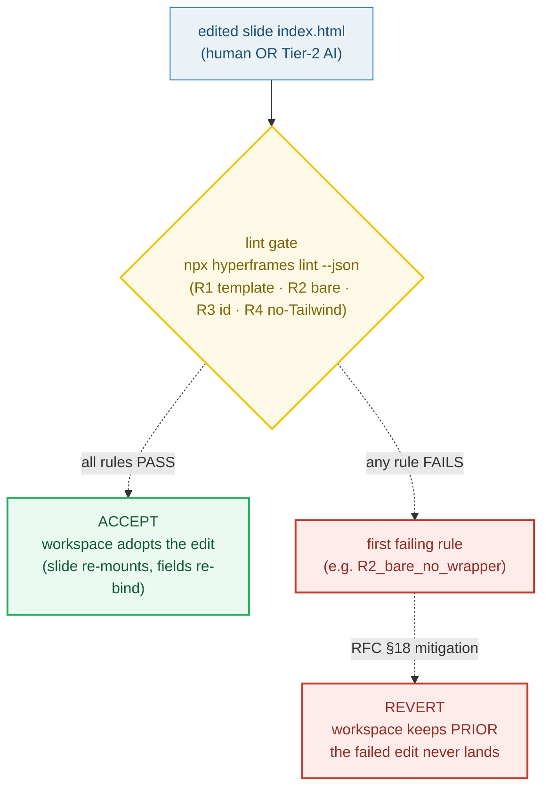

# HTML_EDITOR_SURFACE — the per-slide HTML editor + the lint gate (accept or revert)

> **Goal:** understand the surface that edits a slide's `index.html` (the bare
> `<template>`) — the **Tier-2 AI surface** and the power-user surface — and the
> **lint gate** that runs `npx hyperframes lint` *before* an edit is accepted.
> On pass the workspace adopts the new HTML (**ACCEPT**); on fail the workspace
> keeps the prior version (**REVERT**). A broken edit never reaches the files.
>
> **Run:** `pnpm exec tsx bundles/html_editor_surface.ts`
> **Prerequisites:** [UNIT_MODEL](./UNIT_MODEL.md) (a slide is a folder with
> `index.html` + `index.json`), [BARE_TEMPLATE](./BARE_TEMPLATE.md) (the format
> the gate enforces).
> **RFC:** §7 (HTML-editor surface row), §16 (animation framework), §18 (the
> risk row this gate mitigates)

---

## Lineage — why this exists

The prior app had no per-slide HTML editor — only a generated form that stamped
values into a template. RFC 0001 adds a **native-class editor surface** that
edits a slide's `index.html` directly (RFC §7: *"HTML editor (per slide) … binds
to slide `index.html` … edit within-slide animation; the **AI Tier-2 surface**;
power users"*). That opening is also AI's opening: RFC 0002's **Tier-2 coding
model** authors slide HTML/CSS/GSAP through this same surface.

Opening the canvas to a coding model is powerful and dangerous in the same
breath: a model (or a human) can emit an `<html><body>` wrapper, drop the
`data-composition-id`, or pull in Tailwind — any of which silently breaks the
slide (blank render, unscoped CSS, un-reviewable diffs). RFC §18 names this
exact risk — *"Tier-2 AI writes broken/invalid slide HTML"* — and its mitigation
is the contract this bundle is about: an **AGENTS.md lint gate
(`npx hyperframes lint`) before accepting an HTML edit**. The gate is a
predicate: pass → the edit lands; fail → the edit is reverted and the workspace
is untouched.



## What the runnable proves

> From `html_editor_surface.ts` Section A (the surface — what it edits):
> ```
>   RFC 0001 §7 — Editor Surfaces (HTML editor row):
>     'HTML editor (per slide)' binds to slide 'index.html'; job =
>     'edit within-slide animation; the AI Tier-2 surface; power users.'
>   RFC 0002 — Tier-2 AI authors slide HTML/CSS/GSAP through this surface.
>
> [check] the surface's binding target is the slide index.html (the bare <template>): OK
> [check] the VALID fixture is exactly the format AGENTS.md 'Layout file format — CRITICAL' mandates: OK
> ```

> From `html_editor_surface.ts` Section B (the gate predicate set):
> ```
>   HF CLI (§lint): 'Check a composition for common issues ... --json'
>   RFC §18 risk row → mitigation: 'AGENTS.md lint gate (npx hyperframes
>   lint) before accepting an HTML edit'. The gate runs BEFORE accept.
>
>     PASS  R1_has_one_template
>     PASS  R2_bare_no_wrapper
>     PASS  R3_has_data_composition_id
>     PASS  R4_no_tailwind
> [check] the gate is a pure predicate (same input ⇒ same pass/fail, no side effects): OK
> [check] R2 enforces the bare-<template> invariant (cross-ref BARE_TEMPLATE): OK
> [check] R4 enforces §16 (no Tailwind in composition files): OK
> ```

> From `html_editor_surface.ts` Section C (the pinned value — three fixtures):
> ```
>   Each edit runs through the gate. The decision + the fired rule are pinned.
>
>     VALID     (bare <template>)  →  ACCEPT  (fired: -)
>     WRAPPED   (<html><body> trap)  →  REVERT  (fired: R2_bare_no_wrapper)
>     MISSING_ID(no data-composition-id)  →  REVERT  (fired: R3_has_data_composition_id)
> [check] VALID fixture passes the gate and is ACCEPTed: OK
> [check] WRAPPED fixture fails R2 (bare-<template>) and is REVERTed: OK
> [check] MISSING_ID fixture fails R3 (data-composition-id) and is REVERTed: OK
>   PINNED: gate decisions = ACCEPT, REVERT, REVERT
> ```

> From `html_editor_surface.ts` Section D (revert semantics):
> ```
>   RFC §18 mitigation: a broken edit is rejected BEFORE it reaches the
>   workspace. After REVERT, on-disk HTML is byte-identical to PRIOR.
>
>     workspace before any edit:        625 chars
>     workspace after WRAPPED attempt:   625 chars (REVERT)
>     workspace after MISSING_ID attempt: 625 chars (REVERT)
> [check] REVERT leaves the workspace byte-identical to PRIOR (WRAPPED case): OK
> [check] a failed edit NEVER becomes the workspace (both invalid fixtures rejected): OK
> ```

## Why / internals

### Why a gate, not a free edit (the §18 risk → mitigation)

RFC §18 lists the risk verbatim: *"Tier-2 AI writes broken/invalid slide
HTML."* The moment a coding model can write `index.html`, it can write a slide
that renders blank, leaks CSS across slides, or won't export. The mitigation is
equally verbatim: *"AGENTS.md lint gate (`npx hyperframes lint`) before accepting
an HTML edit."* A **gate** (not a suggestion) means the edit is provisional
until it passes — the workspace write is *conditional* on the predicate. The HF
CLI makes this callable as a programmatic check: `npx hyperframes lint [dir]
--json` returns machine-readable findings (HF docs, §lint), so the editor parses
the JSON, sees whether any error-level rule fired, and decides ACCEPT or REVERT
without a human in the loop. This bundle's `lintGate()` is a deterministic
in-process mirror of that contract so the decision is reproducible in a test.

### Why these four predicates (the rule set)

The rules encode the export-target spec ([AGENTS.md](../AGENTS.md) "Layout file
format — CRITICAL") in evaluation order — structural format first, because a
wrapper breaks extraction and makes the later rules meaningless:

| Rule | Predicate | Source | What it catches |
|---|---|---|---|
| **R1** `has_one_template` | exactly one `<template>` | HF extraction handle | a fragment with no template, or two |
| **R2** `bare_no_wrapper` | no `<html>`/`<head>`/`<body>` *outside* the `<template>` | AGENTS.md "Why bare `<template>`" | the "New HTML File" wrapper → blank render (HF v0.7.3) |
| **R3** `has_data_composition_id` | the extracted content carries `data-composition-id="..."` | AGENTS.md host-div format | a rewrite that drops the id → unscoped CSS, no timeline key |
| **R4** `no_tailwind` | no Tailwind play-CDN / `@tailwind` / `@apply` | RFC §16 | a non-reviewable, framework-heavy diff |

The first failing rule wins (deterministic ordering); that is the rule the
editor reports to the user or the Tier-2 model so the next attempt can fix it.

### Why ACCEPT vs REVERT (not "save + fix later")

The gate runs *before* the workspace write, so a failed edit is not "saved with
an error" — it never lands. After REVERT the on-disk HTML is **byte-identical to
the prior version** (Section D). This is the property that makes the surface
safe to hand to a coding model: the worst a Tier-2 attempt can do is *no-op*. It
cannot corrupt the workspace, break export, or desync the preview — because the
preview and export both read the (unchanged) workspace files. The model simply
gets the failing rule back and retries.

### Why GSAP + vanilla CSS, no Tailwind (§16)

RFC §16: *"GSAP + vanilla CSS inside slide `index.html` … Do **not** introduce
Tailwind or a motion library into composition files … a coding model that writes
vanilla CSS + GSAP produces diffs a human can review."* The gate's R4 encodes
this: it rejects the Tailwind *imports* (play CDN, `@tailwind`, `@apply`) — not
utility-class names, because `flex`/`grid` are valid vanilla CSS and
class-name heuristics produce false positives. The payoff is reviewability: a
Tier-2 edit is a small, legible diff a human can approve at a glance, which is
the whole reason the surface exists for AI at all.

### Why two surfaces don't fight (Tier-1 data vs Tier-2 HTML)

The slide unit has two files (🔗 [UNIT_MODEL](./UNIT_MODEL.md)); two editor
surfaces edit them. The **Properties panel** edits `index.json` `fields` — the
Tier-1 *small-model* surface. The **HTML editor** edits `index.html` — the
Tier-2 *coding-model* surface. They do not collide because the data layer
re-injects through `__FIELD__` placeholders *after* an HTML edit (🔗
[DATA_BINDING](./DATA_BINDING.md)): an accepted HTML edit must still carry its
`__TITLE__` / `__BODY__` placeholders (Section F), so a later Tier-1 field edit
re-stamps cleanly. The gate does not enforce placeholder presence (a slide may
legitimately hard-code text), but a Tier-2 edit that deletes a `__FIELD__` severs
that field's data binding — a documented pitfall, not a lint error.

## 🔗 Cross-references

- 🔗 [BARE_TEMPLATE](./BARE_TEMPLATE.md) — the format the gate's R2 rule enforces
  (a bare `<template>`, no `<html>` wrapper); the wrapper trap R2 rejects.
- 🔗 [EXPORT_PIPELINE](./EXPORT_PIPELINE.md) — the lint gate **is** the export
  contract: an accepted edit is already export-valid (AGENTS.md is the
  export-target spec); nothing else re-validates at render time.
- 🔗 [SLIDE_INDEX_JSON](./SLIDE_INDEX_JSON.md) — the sibling surface (Properties
  panel) edits this file; `fields` still re-inject via `__FIELD__` after an HTML
  edit (Section F).
- 🔗 [DATA_BINDING](./DATA_BINDING.md) — the `__FIELD__` placeholders must
  survive a Tier-2 edit or the data layer loses its binding (a pitfall, below).
- 🔗 [UNIT_MODEL](./UNIT_MODEL.md) — the HTML editor edits one of the slide
  unit's two files; the "within-slide (here) vs between-slide (root)" split.

## Pitfalls

<div style="overflow-x:auto;min-width:0">
<table>
<thead><tr><th>Trap</th><th>Symptom</th><th>Fix</th></tr></thead>
<tbody>
<tr><td>Editing the slide as a full <code>&lt;html&gt;&lt;body&gt;</code> document (what "New HTML File" emits; common Tier-2 output)</td><td>HF renders the sub-comp <strong>blank</strong> (verified HF v0.7.3) — silent, no error; R2 fires at the gate</td><td>Keep a bare <code>&lt;template&gt;</code>; the gate REVERTs the wrapper so it never lands (🔗 BARE_TEMPLATE)</td></tr>
<tr><td>Dropping <code>data-composition-id</code> while rewriting the opening tag</td><td>CSS selectors miss, the GSAP timeline registers under the wrong/absent key, the slide looks unstyled; R3 fires</td><td>Keep <code>data-composition-id="__SLIDE_ID__"</code> on the inner div; the gate rejects the edit</td></tr>
<tr><td>Introducing Tailwind (play CDN / <code>@apply</code>) "to speed up styling"</td><td>Diffs become un-reviewable framework noise; a motion/Tailwind dep enters the composition; R4 fires (§16)</td><td>GSAP + vanilla CSS only in composition files; Tailwind is fine in the app UI shell, never here</td></tr>
<tr><td>Deleting a <code>__FIELD__</code> placeholder during a Tier-2 HTML edit</td><td>The field's data binding is severed; a later Properties-panel edit can't re-stamp; slide shows hardcoded text</td><td>Not a lint error (hard-coded text is legal) — review Tier-2 diffs for placeholder preservation (🔗 DATA_BINDING)</td></tr>
<tr><td>Treating the gate as advisory ("save, then fix the lint warning")</td><td>A broken edit reaches the workspace and desyncs preview/export (both read workspace files)</td><td>The gate is a precondition on the write, not a post-save warning; REVERT means the write is skipped entirely</td></tr>
<tr><td>Letting a Tier-2 edit put between-slide transitions in the slide's <code>&lt;script&gt;</code></td><td>The slide tries to orchestrate siblings it can't see; transitions break/duplicate</td><td>Within-slide timeline here; between-slide transitions live in the ROOT <code>index.html</code> (🔗 UNIT_MODEL §C)</td></tr>
<tr><td>Editing <code>index.html</code> while a <code>__SLIDE_ID__</code> is still un-stamped</td><td>Selectors/timeline key don't match the stamped id; the edit looks right in isolation, breaks after stamp</td><td>Author against the <code>__SLIDE_ID__</code> literal (the gate checks the literal, not a stamped value)</td></tr>
</tbody>
</table>
</div>

## Cheat sheet

```
surface         = edits slide index.html (the bare <template>) — Tier-2 AI + power users (RFC §7)
gate            = npx hyperframes lint --json, run BEFORE the workspace write (RFC §18 mitigation)
                  pass → ACCEPT (workspace adopts the edit); fail → REVERT (workspace keeps PRIOR)
predicate set   = R1 exactly one <template>
                  R2 NO <html>/<head>/<body> outside <template>   (bare-<template> invariant)
                  R3 extracted content has data-composition-id     (host-div requirement)
                  R4 NO Tailwind (play CDN / @tailwind / @apply)   (RFC §16)
first fail wins = the reported rule is the one to fix on retry
revert          = the failed edit NEVER lands; on-disk HTML is byte-identical to PRIOR
reviewable diff = GSAP + vanilla CSS only; no Tailwind / motion lib in composition files (§16)
two surfaces    = Properties panel → index.json (Tier-1 data); HTML editor → index.html (Tier-2 HTML)
data after edit = __FIELD__ placeholders survive an accept, so Tier-1 fields re-bind post-edit
```

## Sources

- RFC 0001 §7 (Editor Surfaces — "HTML editor (per slide)" row), §16 (Animation
  Framework — "GSAP + vanilla CSS … Do NOT introduce Tailwind"), §18 (Risks —
  "Tier-2 AI writes broken/invalid slide HTML" → lint-gate mitigation):
  `docs/rfc-0001.md` (in-repo)
- `docs/AGENTS.md` — "Layout file format — CRITICAL", "Why bare `<template>`
  (no `<html>` wrapper)", the command `npx hyperframes lint templates/eco-bottle`
  (in-repo)
- HyperFrames CLI — §lint: *"Check a composition for common issues:
  `npx hyperframes lint [dir] --json` # machine-readable JSON output … The linter
  detects … structural problems"*; *"handles … linting … from your terminal"*:
  https://hyperframes.heygen.com/packages/cli
- HyperFrames, *Compositions* — *"extracts the `<template>` content, mounts it,
  executes scripts, and registers the timeline"* (the extraction contract R2/R3
  protect): https://hyperframes.heygen.com/concepts/compositions
- MDN, `<template>` — *"By default, the element's content is not rendered …
  `content` is read-only and holds a `DocumentFragment`"* (why the wrapper
  *outside* the template breaks extraction): https://developer.mozilla.org/en-US/docs/Web/HTML/Element/template
