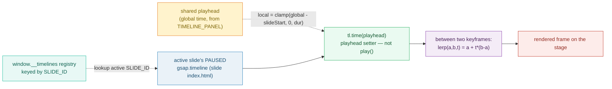
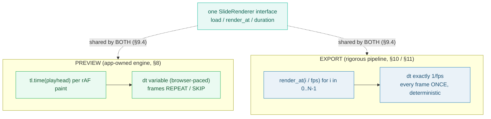

# PREVIEW_ENGINE — app-owned: drive GSAP from the playhead (real-time, not frame-accurate)

> **Goal:** understand RFC 0001 §8's **app-owned preview engine**. It renders the
> **active slide's** `index.html` live in-browser via the `SlideRenderer`
> interface, and **drives the slide's GSAP timeline from the playhead time** by
> *seeking* it — `tl.time(playheadTime)` — not by playing it. It is explicitly
> **real-time, not frame-accurate**: that is the *point* of decoupling preview
> (responsive for editing) from export (rigorous, §10/§11). The engine is
> app-owned — the editor drives it; HyperFrames is **not** in the editing loop as
> a black box.
>
> **Run:** `pnpm exec tsx bundles/preview_engine.ts`
> **Prerequisites:** [UNIT_MODEL](./UNIT_MODEL.md) (the unit model),
> [BARE_TEMPLATE](./BARE_TEMPLATE.md) (the slide HTML the engine mounts),
> [STAGE_CANVAS](./STAGE_CANVAS.md) (the surface whose playhead the engine consumes).
> **RFC:** §8 (App-Owned Preview Engine), §9 (SlideRenderer), §11 (Determinism)

---

## Lineage — why this exists

The prior app coupled preview to HyperFrames' composition lifecycle: you stamped
a template, hit render, and HF was both the live preview *and* the final
renderer. RFC 0001 §2 calls this out — *"You cannot iterate on a preview without
coupling to HF's composition lifecycle, and preview/render fidelity is only as
good as HF's internal consistency."*

§8 is the fix. The preview becomes **app-owned**: the editor drives a
`SlideRenderer` interface (§9.1), and the engine's single job per paint is —

> render the active slide, then **drive its GSAP timeline from the playhead**.

"Drive" has a precise meaning. Each slide's `index.html` (a bare `<template`,
per [AGENTS.md](../docs/AGENTS.md) / [BARE_TEMPLATE](./BARE_TEMPLATE.md)) ends
its `<script>` with:

```js
var tl = gsap.timeline({ paused: true });
tl.from('...', { opacity: 0, y: 40, duration: 0.4, stagger: 0.1 });
window.__timelines['__SLIDE_ID__'] = tl;   // ← registered, PAUSED
```

The timeline is created **paused** and stashed in the `window.__timelines`
registry, keyed by the slide's composition id. The preview engine looks that
timeline up for the *active* slide and **seeks** it:

```js
tl.time(playheadTime);   // playhead setter, NOT play(). Moves the head; never auto-plays.
```

GSAP's own docs describe `Timeline.time()` as the playhead setter — *"Gets or
sets the local position of the playhead ... sets time, jumping to new value just
like `seek()`"* (see [Sources](#sources)). Because the timeline is paused,
seeking is **deterministic given `t`**: the same `t` always yields the same
rendered frame, and the timeline never advances on its own. And because preview
and export share one `SlideRenderer` (§9.4), *"it looked different when I
exported"* is **structurally impossible**.



The decoupling this enables is the single most important design sentence in §8:

> *"Real-time, not frame-accurate. That is the point of decoupling: the preview
> is responsive for editing; the export is rigorous (§10)."*



## What the runnable proves

> From `preview_engine.ts` Section A (renders the ACTIVE slide via SlideRenderer):
> ```
>   SlideRenderer interface (RFC §9.1, verbatim):
>     interface SlideRenderer:
>         load(slide_html, fields, assets)   # mount a slide composition
>         render_at(timecode) -> frame       # render at time t (preview or capture)
>         duration() -> seconds
>
>   ACTIVE_SLIDE_ID = "slide-0" (mounted via SlideRenderer.load)
> [check] exactly one active slide is mounted at a time: OK
> [check] SlideRenderer exposes load() / render_at() / duration(): OK
> ```

> From `preview_engine.ts` Section B (drive GSAP from the playhead — seek, not play):
> ```
>     var tl = gsap.timeline({ paused: true });
>     tl.from('[data-composition-id="__SLIDE_ID__"] .content > *',
>             { opacity: 0, y: 40, duration: 0.4, stagger: 0.1 });
>     window.__timelines['__SLIDE_ID__'] = tl;
>
>     tl.time(0.000000)  →  value 0.000000   (registry["slide-0"], paused)
>     tl.time(0.250000)  →  value 0.250000   (registry["slide-0"], paused)
>     tl.time(0.500000)  →  value 0.500000   (registry["slide-0"], paused)
>     tl.time(0.750000)  →  value 0.750000   (registry["slide-0"], paused)
>     tl.time(1.000000)  →  value 1.000000   (registry["slide-0"], paused)
> [check] tl.time(t) seeks without playing (playhead setter; value at 0.5 === 0.5): OK
> [check] window.__timelines['__SLIDE_ID__'] = tl  registers the paused timeline: OK
>
>   PINNED: tl.time(0.500000) on slide-0 → value 0.500000 (lerp midpoint).
> ```

> From `preview_engine.ts` Section C (the interpolation math — the pinned values):
> ```
>   2-keyframe timeline slide-0: keyframes (t=0, v=0.0) , (t=1, v=1.0), linear:
>     playhead 0.250000 → localT 0.250000 → lerp(0, 1, 0.250000) = 0.250000
>     playhead 0.500000 → localT 0.500000 → lerp(0, 1, 0.500000) = 0.500000
>     playhead 0.750000 → localT 0.750000 → lerp(0, 1, 0.750000) = 0.750000
> [check] 2-keyframe lerp at t=0.5 === 0.5 (lerp(0,1,0.5)): OK
> [check] 2-keyframe lerp at t=0.25 === 0.25, t=0.75 === 0.75: OK
>
>   3-keyframe timeline slide-1: (0,0.0) → (1,1.0) → (2,0.5), linear (piecewise):
>     playhead 0.500000 → segment value 0.500000
>     playhead 1.000000 → segment value 1.000000
>     playhead 1.500000 → segment value 0.750000
>     detail @1.5: segment [1,2], localT=(1.5-1)/(2-1)=0.5 → lerp(1.0, 0.5, 0.5) = 0.750000
> [check] 3-keyframe multi-segment lerp at t=1.5 === 0.75 (lerp(1.0, 0.5, 0.5)): OK
>
>   PINNED: sampleAt(slide-0, 0.5) = 0.500000; sampleAt(slide-1, 1.5) = 0.750000.
> ```

> From `preview_engine.ts` Section D (real-time, NOT frame-accurate):
> ```
>   RFC 0001 §8 (verbatim): "Real-time, not frame-accurate. That is the point of decoupling: the preview is responsive for editing; the export is rigorous (§10)."
>
>   PREVIEW (real-time): on each browser paint (rAF) the engine calls
>   tl.time(playhead). dt between paints is variable (browser-paced), so
>   frame indices may REPEAT (slow paint) or SKIP (scrub/fast-forward):
>     playhead 0.000000s → tl.time(0.000000); value 0.000000; nearest frame 0
>     playhead 0.040000s → tl.time(0.040000); value 0.040000; nearest frame 1
>     playhead 0.060000s → tl.time(0.060000); value 0.060000; nearest frame 1
>     playhead 0.120000s → tl.time(0.120000); value 0.120000; nearest frame 3
>     playhead 0.130000s → tl.time(0.130000); value 0.130000; nearest frame 3
>
>   EXPORT (frame-accurate): npx hyperframes render steps frame index
>   0..N-1 at exactly 1/fps = 0.033333s each (RFC §10, §11):
>     frame[0] → render_at(0.000000)  (exact, no repeat/skip)
>     frame[1] → render_at(0.033333)  (exact, no repeat/skip)
> [check] preview sample dt is NOT 1/fps (real-time, variable cadence): OK
> [check] export step IS exactly 1/fps (frame-accurate, deterministic): OK
> ```

> From `preview_engine.ts` Section E (app-owned — HF is not a black box):
> ```
>   RFC 0001 §8 (verbatim): "The preview is app-owned — the editor drives it; HyperFrames is not in the editing loop as a black box."
> [check] §8 quote asserts app ownership (editor drives; HF not a black box): OK
> [check] SlideRenderer is the pluggable seam (engine swappable behind one interface): OK
> ```

> From `preview_engine.ts` Section F (active-slide swap):
> ```
>   registry keys: slide-0, slide-1
>
>   active="slide-0", playhead 0.5 → value 0.500000  (2-keyframe)
>   active="slide-1", playhead 1.5 → value 0.750000  (3-keyframe)
> [check] swap changes the active slide id (slide-0 → slide-1): OK
> [check] each active slide resolves to its OWN timeline value via the registry: OK
> ```

## Why / internals

### Why "drive from the playhead" means **seek**, not **play**

A slide's GSAP timeline is created `paused: true` and registered in
`window.__timelines['__SLIDE_ID__']` ([AGENTS.md](../docs/AGENTS.md) "Layout file
format"). The preview engine never calls `tl.play()` — that would hand control
of the playhead to GSAP's internal clock, racing the editor's playhead and
making the preview non-deterministic with respect to `t`. Instead it calls the
**playhead setter** `tl.time(playheadTime)`. GSAP's docs describe this exactly:
`Timeline.time()` *"Gets or sets the local position of the playhead ... sets
time, jumping to new value just like `seek()`"*. On a paused timeline this moves
the head and renders that one frame; it never starts auto-playback. The preview
is therefore a pure function of `t`: same `t` → same frame, every time. That is
what makes scrubbing, single-frame stepping, and "show me t=2.0" all work.

### Why `lerp(a,b,t)` is the math underneath

Between two keyframes, a timeline evaluates the **linear interpolant** along the
straight line between them. Wikipedia, ["Linear interpolation"](#sources): for a
value `x` in `(x0, x1)` with known points `(x0,y0),(x1,y1)`,

```
y = y0 + (x - x0) * (y1 - y0) / (x1 - x0)
```

In the computer-graphics **lerp** form (with `t = (x - x0)/(x1 - x0)` in `[0,1]`
within the segment, and `a = y0`, `b = y1`):

```
lerp(a, b, t) = a + t * (b - a)      // Wikipedia, "Programming language support"
```

So a 2-keyframe timeline `(t=0,v=0.0),(t=1,v=1.0)` evaluated at `playhead=0.5`
gives `localT = 0.5` → `lerp(0, 1, 0.5) = 0.5`. A 3-keyframe timeline
`0 → 1 → 0.5` across `[0,1,2]s` is a **piecewise** lerp: at `playhead=1.5` the
active segment is `[1,2]` with values `[1.0, 0.5]`, so `localT = (1.5-1)/(2-1) =
0.5` → `lerp(1.0, 0.5, 0.5) = 0.75`. (Any GSAP *ease* — default `power1.out` —
is just a remap of `t` before the lerp; the lerp identity itself is unchanged.
The runnable models the linear/"none" case so the numbers are reproducible by
hand and the `.html` gold-check is a mathematical identity, not a
GSAP-version-dependent value.)

### Why real-time, NOT frame-accurate (the decoupling rationale)

On each browser paint (`requestAnimationFrame`), the engine calls
`tl.time(playhead)`. Because paints are browser-paced, the delta between
successive seeks is **variable** — a slow paint holds the same frame (the nearest
frame index **repeats**), and a scrub/fast-forward **skips** indices. That is
correct and desirable: the preview must be *responsive to interaction*, not
locked to a fixed `1/fps` cadence. Frame-accurate output — every index `0..N-1`
exactly once, at `1/fps` each — is the **export** pipeline's job
(`npx hyperframes render`, §10) under the visual-determinism bar (§11). The
`SlideRenderer` interface (§9.4) is what keeps the two honest: preview and
export share one engine, so drift is *"structurally impossible"*.

### Why app-owned (HF is not a black box)

§8 is blunt: *"The preview is app-owned — the editor drives it; HyperFrames is
not in the editing loop as a black box."* §9.5 sharpens this: HF's role
contracts from "the whole composition engine" to "render this one slide at time
*t*." Timeline orchestration, the document model, and the editor are **ours**;
HF is a pluggable rendering primitive behind the `SlideRenderer` seam. That seam
is also the upgrade path: Implementation 1 (POC, now) wraps HF's
`<hyperframes-player>`; Implementation 2 (future) swaps in a headless-Chromium +
FFmpeg renderer behind the **same** interface — the editor and export pipeline
don't change (§9.2/§9.3).

## 🔗 Cross-references

- 🔗 [SLIDE_RENDERER_INTERFACE](./SLIDE_RENDERER_INTERFACE.md) — the engine sits
  behind this interface (`load` / `render_at` / `duration`); preview and export
  share it, so fidelity drift is structurally impossible (§9.4).
- 🔗 [STAGE_CANVAS](./STAGE_CANVAS.md) — the center surface whose **playhead**
  (global time → clamped local time) the engine consumes; the engine renders
  what the stage hosts.
- 🔗 [BARE_TEMPLATE](./BARE_TEMPLATE.md) — the slide `index.html` (bare
  `<template>`) whose `<script>` registers the paused `gsap.timeline` the engine
  seeks.
- 🔗 [AUDIO_SYNC](./AUDIO_SYNC.md) — audio is synced **alongside** the timeline
  via the external-`<audio>` pattern; both follow the same playhead.
- 🔗 [CAPTIONS_KARAOKE](./CAPTIONS_KARAOKE.md) — caption word-highlights are a
  GSAP timeline driven the **same** way (`tl.time(t)`); the engine is what
  advances them.

## Pitfalls

<div style="overflow-x:auto;min-width:0">
<table>
<thead><tr><th>Trap</th><th>Symptom</th><th>Fix</th></tr></thead>
<tbody>
<tr><td>Driving the preview with <code>tl.play()</code> instead of <code>tl.time(t)</code></td><td>GSAP's internal clock races the editor's playhead; scrubbing stutters; the preview is no longer a pure function of <code>t</code></td><td>Always <strong>seek</strong> the paused timeline: <code>tl.time(playheadTime)</code> per paint. The slide script must create it with <code>paused: true</code> and register it in <code>window.__timelines</code>.</td></tr>
<tr><td>Forgetting <code>paused: true</code> when the slide registers its timeline</td><td>The timeline auto-runs on mount; the playhead setter and GSAP's clock fight; <code>render_at(t)</code> no longer matches what the user sees</td><td>Every slide <code>&lt;script&gt;</code> begins <code>var tl = gsap.timeline({ paused: true });</code> (AGENTS.md). Seeking a paused timeline is deterministic.</td></tr>
<tr><td>Looking up the timeline by the wrong key after an active-slide swap</td><td>Preview seeks the PREVIOUS slide's timeline; values lag or jump on slide switch</td><td>Registry is keyed by composition id (<code>__SLIDE_ID__</code>). On swap, re-resolve <code>window.__timelines[activeSlideId]</code> before seeking (Section F).</td></tr>
<tr><td>Expecting frame-accurate preview</td><td>"The preview skipped/repeated a frame while scrubbing" — treated as a bug</td><td>It isn't. Preview is real-time by design (§8); frame indices repeat/skip under variable rAF cadence. Frame-accuracy is export's job (§10/§11). Don't lock preview to <code>1/fps</code>.</td></tr>
<tr><td>Calling the playhead setter on a NON-paused timeline and assuming determinism</td><td>Between two <code>tl.time(t)</code> calls the timeline advances on its own; same <code>t</code> yields different frames depending on wall-clock</td><td>Pause is the contract. <code>tl.time(t)</code> is deterministic only on a timeline that won't self-advance. Verify <code>paused: true</code>.</td></tr>
<tr><td>Confusing <code>time()</code> with <code>totalTime()</code> on repeating timelines</td><td>Seeking appears off-by-cycles when a timeline has <code>repeat</code>; the head lands somewhere unexpected</td><td><code>time()</code> excludes repeats/repeatDelays; it never exceeds <code>duration()</code> (GSAP docs). Slide within-slide timelines don't repeat, so <code>time()</code> is the correct primitive here.</td></tr>
<tr><td>Thinking easing changes the <code>lerp</code> identity</td><td>Trying to hand-verify a <code>power1.out</code> tween with <code>lerp(0,1,0.5)</code> and getting 0.75, not 0.5</td><td>Easing remaps <code>t</code> <em>before</em> the lerp; <code>lerp(a,b,t)=a+t*(b-a)</code> is unchanged. The runnable uses linear ("none") easing so the math is reproducible; GSAP's default is <code>power1.out</code>.</td></tr>
</tbody>
</table>
</div>

## Cheat sheet

```
preview engine = app-owned (§8): editor drives it; HF is NOT a black box
interface      = SlideRenderer: load(...) / render_at(t) -> frame / duration()  (§9.1)
active slide   = mount EXACTLY one slide composition; swap on playhead boundary cross (§7)
registry       = window.__timelines['__SLIDE_ID__'] = tl   (slide <script>, paused:true)
drive          = tl.time(playheadTime)   ← SEEK the paused timeline, never tl.play()
determinism    = given t, tl.time(t) always yields the same frame (pure function of t)
lerp           = lerp(a, b, t) = a + t*(b-a)     (Wikipedia "Linear interpolation")
  2-kf [0,0]->[1,1]  @0.5 → 0.5 ; @0.25 → 0.25 ; @0.75 → 0.75
  3-kf 0->1->0.5     @1.5 → 0.75 (segment [1,2], localT 0.5 → lerp(1.0,0.5,0.5))
real-time      = preview seeks per rAF paint (variable dt; frames repeat/skip) — NOT frame-accurate (§8)
frame-accurate = EXPORT only: npx hyperframes render, every index 0..N-1 at 1/fps (§10/§11)
no drift       = preview + export share one SlideRenderer (§9.4) → "looked different when exported" is impossible
```

## Sources

- RFC 0001 §8 (App-Owned Preview Engine), §9.1 (SlideRenderer interface),
  §9.4–§9.5 (no fidelity drift; make HF smaller), §10/§11 (export + determinism),
  §5.2 (canvas `fps: 30`): `docs/rfc-0001.md` (in-repo)
- AGENTS.md "Layout file format" — the slide `<script>` that registers the
  paused timeline: `docs/AGENTS.md` (in-repo)
- GSAP — `Timeline.time()`, the playhead setter ("Gets or sets the local
  position of the playhead ... sets time, jumping to new value just like
  `seek()`"): https://gsap.com/docs/v3/GSAP/Timeline/time()
- Wikipedia — "Linear interpolation" (the `lerp(v0,v1,t)=v0+t*(v1-v0)` identity
  in "Programming language support"; the two-point interpolant derivation):
  https://en.wikipedia.org/wiki/Linear_interpolation
- GSAP — Tween (GSAP's default ease is `power1.out`, not linear; easing remaps
  `t` before the lerp): https://gsap.com/docs/v3/GSAP/Tween
