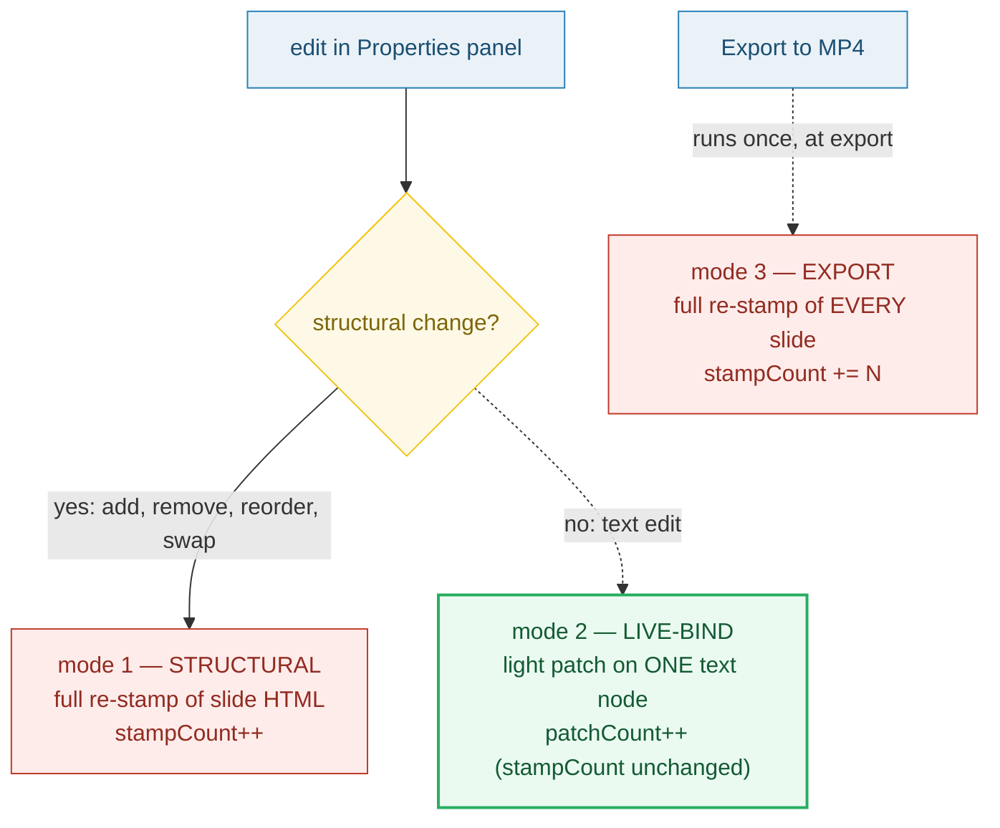

# PROPERTIES_PANEL — the data panel: live-bind (light patch) vs re-stamp

> **Goal:** understand the RIGHT-HAND editor surface — the Properties/data panel.
> It binds to the **active slide's `index.json`** and edits four keys: `fields`,
> asset refs, `voiceover` text, and the `transition` override. The headline
> behavior is **live-bind** (RFC §5.6 mode 2): typing in a text field updates the
> preview via a **light DOM patch** on the one bound text node — **not** a full
> re-stamp. A full re-stamp only fires on a **structural** change (mode 1) or at
> **export** (mode 3).
>
> **Run:** `pnpm exec tsx bundles/properties_panel.ts`
> **Prerequisites:** [UNIT_MODEL](./UNIT_MODEL.md) (the unit model),
> [SLIDE_INDEX_JSON](./SLIDE_INDEX_JSON.md) (the data being bound),
> [DATA_BINDING](./DATA_BINDING.md) (the three stamping modes).
> **RFC:** §7 (Editor Surfaces — "Properties / data" row), §5.6 (Data binding),
> §5.2/§5.3 (transition_default vs slide.transition).

---

## Lineage — why this exists

The prior app had **no properties panel** — RFC §2 calls it out: "there is no
timeline, no visual stage, no properties panel. The only affordance is a
generated form." Every edit was a full form re-submit that re-stamped the whole
template. RFC §7 promotes the right-hand pane to a first-class surface:

> **Properties / data** (right) — binds to **slide `index.json`** — job: *edit
> `fields`, asset refs, voiceover text, transition override.*

The key design move is in §5.6: the panel does **not** re-stamp on every
keystroke. It splits editing into the three DATA_BINDING modes:

- **structural** change (slide add/remove/reorder, layout swap) → full re-stamp;
- **live-bind** text edit → light DOM patch on the one bound node;
- **export** → full re-stamp of every slide.

Live-bind is what makes the panel feel native: typing in a title textarea
mutates `index.json.fields.title` and patches the one preview text node, leaving
`stampCount` untouched. The stage never remounts, GSAP state is preserved, and
the preview stays responsive.



## What the runnable proves

> From `properties_panel.ts` Section A (the four keys the panel binds):
> ```
>     slide.index.json . fields
>     slide.index.json . assets
>     slide.index.json . voiceover
>     slide.index.json . transition
> [check] panel edits exactly {fields, assets, voiceover, transition} on slide index.json: OK
>   → switching the active slide re-binds the panel to THAT slide's index.json.
> ```

> From `properties_panel.ts` Section B (field type → form control, AGENTS.md "Layout field types"):
> ```
>     title    (text     ) -> <textarea>
>     body     (text     ) -> <textarea>
>     img      (image    ) -> <input type="file">
>     voice    (voiceover) -> <textarea> (amber styled)
> [check] text & voiceover both render a <textarea>; image renders a file input: OK
> ```

> From `properties_panel.ts` Section C (the patch-vs-stamp counter demo — the pinned value):
> ```
>   start: patchCount=0, stampCount=0, preview.title="Old"
>   liveBind("title","New"): patchCount=1, stampCount=0
>     JSON.fields.title="New"  preview.title="New"
> [check] live-bind incremented patchCount to 1: OK
> [check] live-bind left stampCount at 0 (NO full re-stamp): OK
> [check] live-bind updated JSON.fields.title to "New": OK
> [check] live-bind patched the bound preview text node to "New": OK
>   structuralChange (swap layout): stampCount=1, patchCount=1
> [check] structural change incremented stampCount to 1: OK
>   exportRestamp (3 slides): stampCount=3
> [check] export re-stamps EVERY slide once (stampCount === slide count): OK
>
>   PINNED: after one live-bind edit -> patchCount=1, stampCount=0
>   GOLD:   after a live-bind edit, stampCount === 0 (light patch only) => true
> ```

> From `properties_panel.ts` Section D (the syncFromDOM pitfall, AGENTS.md #7):
> ```
> [check] WRONG: re-render without syncFromDOM loses the typed value (preview stays "Old"): OK
> [check] RIGHT: syncFromDOM() before re-render preserves the typed value: OK
>     synced title -> "Typed but not synced"
> ```

> From `properties_panel.ts` Section E (transition override):
> ```
>   root.transition_default = {"type":"crossfade","duration":0.4}
>   slide w/o override -> effective = {"type":"crossfade","duration":0.4}
> [check] slide without transition falls back to root transition_default: OK
>   slide w/  override -> effective = {"type":"push","duration":0.5}
> [check] slide transition overrides root transition_default: OK
> ```

## Why / internals

### Why a light DOM patch instead of always re-stamping

Typing one character must not rewrite the whole slide's HTML and remount the
HyperFrames sub-comp — that would flicker the stage and **kill GSAP timeline
state** (the within-slide animation would restart on every keystroke). So a text
edit takes the cheapest path the DOM allows: mutate the **one** `Text` node
bound to that field. MDN
([`Text`](https://developer.mozilla.org/en-US/docs/Web/API/Text)): *"The `Text`
interface represents a text node in a DOM tree"* — each text node is its own
object, so it is the smallest possible patch target. MDN
([`Node.textContent`](https://developer.mozilla.org/en-US/docs/Web/API/Node/textContent)):
*"If the node is a … text node, `textContent` returns, or sets, the text inside
the node."* Setting it is a text-only mutation; the surrounding element tree is
untouched. Contrast `innerHTML`, which MDN warns *"needs to invoke the HTML
parser"* — that parser invocation is exactly the full re-stamp live-bind avoids
(and the parser path is also an XSS vector, so `textContent` is the safe choice
for user-typed text).

### Why three modes (and the counter invariant)

The panel keeps two counters to make the mode split *observable*:

- `patchCount` — light DOM patches (live-bind, mode 2);
- `stampCount` — full re-stamps (structural mode 1, export mode 3).

The invariant the runnable pins: **after a pure text edit, `stampCount === 0`**.
That single fact is the whole point of live-bind — the stage updated, the JSON
updated, and **no re-stamp happened**. A structural change (swap layout) bumps
`stampCount` to 1; export bumps it by the slide count (one re-stamp per slide).

### Why live-bind still mutates the JSON (and export re-stamps anyway)

Live-bind writes `index.json.fields` on every keystroke so the data layer is
never stale during editing. But the stage is still driven by mutable DOM state,
so RFC §5.6 mode 3 re-stamps **every** slide from its `index.json` at export.
The rendered file is the single source of truth, not whatever the live-bind
state left on the stage. See 🔗 DATA_BINDING (mode 3) and the "stage vs file"
pitfall below.

### Why `syncFromDOM()` runs before a structural re-render (AGENTS.md #7)

A structural change (add/remove/reorder slide) triggers a full re-render, which
rebuilds the form from `index.json`. But the textarea the user is typing into
holds the freshest value in the **DOM** — it may not be in JSON yet (e.g. the
user typed then immediately clicked "add slide" without blurring). AGENTS.md
pitfall #7: *"`syncFromDOM()` must run before any re-render … to avoid losing
typed values."* Section D of the runnable proves both halves: a re-render
without sync loses the typed value; sync-then-render keeps it. Live-bind itself
dodges this for text (JSON updates every keystroke), but `syncFromDOM()` is the
safety net before any structural re-render.

### Why transition is a per-slide override, not a root edit

The panel's transition control writes **`slide.transition`**, which overrides
the root `transition_default` (RFC §5.2) for *this slide only*. Absent
`slide.transition`, the slide falls back to the root default (Section E). This
is why the panel binds to the **slide** `index.json`, not the root: a per-slide
push transition must not change the crossfade every other slide uses. Editing
transitions globally is the root HTML editor's job, not the Properties panel's.

## 🔗 Cross-references

- 🔗 [SLIDE_INDEX_JSON](./SLIDE_INDEX_JSON.md) — the data file the panel binds:
  `fields`, `assets`, `voiceover`, and the optional `transition` override.
- 🔗 [DATA_BINDING](./DATA_BINDING.md) — defines the three stamping modes; the
  panel's live-bind is mode 2, structural is mode 1, export is mode 3.
- 🔗 [BARE_TEMPLATE](./BARE_TEMPLATE.md) — the `__FIELD__` placeholders the
  light patch targets (the bound text node is the stamped value's home).
- 🔗 [HTML_EDITOR_SURFACE](./HTML_EDITOR_SURFACE.md) — the structural-edit
  sibling: layout/HTML changes are the mode-1 trigger that forces a full
  re-stamp (and thus a `syncFromDOM()` first).

## Pitfalls

| Trap | Symptom | Fix |
|---|---|---|
| Re-render (add/remove/reorder) **without** `syncFromDOM()` first | The textarea's freshly-typed value is discarded; the re-stamp writes the stale `index.json` value back over it (AGENTS.md #7) | Call `syncFromDOM()` to copy DOM textarea values into JSON **before** any structural re-render (Section D proves both halves) |
| Patching the bound node with `innerHTML` instead of `textContent` | Invokes the HTML parser (slow) and opens an XSS hole on user-typed text; also can clobber sibling nodes | Mutate the one `Text` node via `textContent` / `nodeValue` (MDN: text-only set, no parser) |
| Treating live-bind stage state as the rendered truth | The exported MP4 reflects stale DOM, not the saved `index.json` | Always run a full re-stamp of every slide at export (RFC §5.6 mode 3) — the file is the truth, not the stage |
| Editing `transition_default` (root) when you meant one slide | Every slide's transition changes; the per-slide override you wanted never lands | The panel writes **`slide.transition`** (absent ⇒ root default wins); root-level edits belong to the root HTML editor |
| Stale binding after switching the active slide | Edits land on the *previous* slide's `index.json` | Re-bind the panel to the newly-active slide's `index.json` on every selection change |
| Treating the `voiceover` textarea like a plain text field | Expecting instant preview; instead it queues the batch TTS pipeline | `voiceover` is amber-styled to flag it as TTS-bound (AGENTS.md "Layout field types"); its value feeds `generate_voiceover_smart()`, not a text-node patch |
| Stamping image bytes / a data URL into the field | Bloated HTML, broken HF asset handling | `image` → byte swap to `assets/` first, then the value is an asset SHA **path** (see 🔗 DATA_BINDING Section D) |

## Cheat sheet

```
panel binds to : ACTIVE slide's index.json → fields, assets, voiceover, transition
field→control : text→<textarea> | image→<input type=file> | voiceover→<textarea> (amber)
live-bind     : text edit → mutate JSON.fields → textContent on ONE node → patchCount++ (stampCount unchanged)
structural    : add/remove/reorder/layout swap → full re-stamp → stampCount++   (RFC §5.6 mode 1)
export        : full re-stamp of EVERY slide → stampCount += N                  (RFC §5.6 mode 3)
patch rule    : use textContent (light, no parser, XSS-safe); NEVER innerHTML for user text (MDN)
syncFromDOM   : copy DOM textarea values into JSON BEFORE any structural re-render (AGENTS.md #7)
transition    : slide.transition overrides root.transition_default (absent ⇒ root wins)
the invariant : after a pure text edit, stampCount === 0  (the live-bind proof)
```

## Sources

- RFC 0001 §7 ("Properties / data" row), §5.6 (Data binding — three modes), §5.2 (`transition_default`), §5.3 (`slide.transition`): `docs/rfc-0001.md` (in-repo)
- `docs/AGENTS.md` "Layout field types" (text→textarea, image→file input, voiceover→amber textarea) + "Common pitfalls" #7 (`syncFromDOM()` before re-render) (in-repo)
- MDN `Node.textContent` — text-only set on a text node (light patch), and `innerHTML` invokes the HTML parser (the full re-stamp path): https://developer.mozilla.org/en-US/docs/Web/API/Node/textContent
- MDN `Text` — a text node is a discrete, independently-mutable DOM node (the smallest patch target): https://developer.mozilla.org/en-US/docs/Web/API/Text
- MDN `<input>` (`type="file"`) + MDN `<textarea>` (multi-line text control) — the field-type → form-control mapping: https://developer.mozilla.org/en-US/docs/Web/HTML/Element/input , https://developer.mozilla.org/en-US/docs/Web/HTML/Element/textarea
