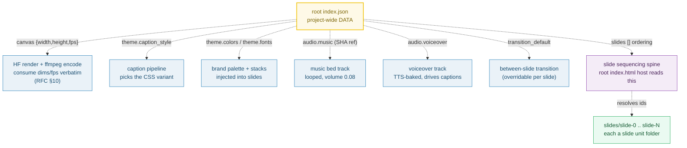

# ROOT_INDEX_JSON — the project-wide data file: canvas, theme, audio, ordering

> **Goal:** understand the ROOT `index.json` — the single source of truth for
> "what the video is" *globally*. Where the slide `index.json` carries per-slide
> content (fields, voiceover, duration), the root carries everything project-wide:
> canvas dimensions/fps, theme, audio refs, the transition default, and the slide
> ordering spine.
>
> **Run:** `pnpm exec tsx bundles/root_index_json.ts`
> **Prerequisites:** [UNIT_MODEL](./UNIT_MODEL.md) (the root is a unit folder with
> `index.html` + `index.json`; this guide is the data half of the root unit).
> **RFC:** §5.2 (root index.json schema), §5.1 (why root is a unit), §10 (export)

---

## Lineage — why this exists

The current app stores project-wide config in `templates/<id>/template.json`
(`id`/`name`/`duration`/`priority`/`mode`/`caption_style`/`layouts`/`default_slides`
— see [`AGENTS.md`](../docs/AGENTS.md) "Template JSON schema"). That file mixes
*template definition* with *instance data* and has no canvas, no audio refs, no
ordering spine. RFC 0001 §5.2 evolves it into a clean **root `index.json`** that
holds only project-wide data and delegates per-slide content to each slide's own
`index.json`. This is the "JSON = data" half of the symmetric unit model: the
root data file, deliberately small, ideal for small-model AI edits (RFC 0002).



The dotted arrows are the binding: each root field *controls* something outside
the data file. None of them carry animation (that lives in `index.html`).

## What the runnable proves

> From `root_index_json.ts` Section A (the parsed schema):
> ```
>   RFC 0001 §5.2 — root index.json carries canvas, theme, audio,
>   transition_default, and the slides ordering array.
>
>   root index.json (parsed):
>     version             = 1
>     canvas              = {width:1920, height:1080, fps:30}
>     theme.caption_style = "highlight"
>     theme.colors keys   = []
>     theme.fonts  keys   = []
>     audio.music         = {asset:"sha256:deadbeef", volume:0.080000, loop:true}
>     audio.voiceover     = {asset:"voiceover.mp3", auto_generated:true}
>     transition_default  = {type:"crossfade", duration:0.400000}
>     slides              = ["slide-0", "slide-1", "slide-2"]
> [check] version is a number: OK
> [check] canvas has width,height,fps: OK
> [check] audio has music + voiceover: OK
> [check] slides is an array of strings: OK
> ```

> From `root_index_json.ts` Section B (the pinned canvas):
> ```
>     width  = 1920  (Full HD horizontal, 16:9)
>     height = 1080 (1080 progressive scan lines)
>     fps    = 30    (ATSC/DVB standard rate; 24/25/60 also valid)
> [check] canvas is standard Full HD (1920x1080): OK
> [check] canvas.fps is a positive standard rate: OK
>   PINNED: canvas.width = 1920, canvas.height = 1080, canvas.fps = 30
> ```

> From `root_index_json.ts` Section C (caption_style enum):
> ```
>   allowed enum: "highlight" | "neon" | "editorial" | "eco-green"
>
>     theme.caption_style = "highlight"
> [check] caption_style is one of the 4 allowed values: OK
> ```

> From `root_index_json.ts` Section D (music bed vs voiceover):
> ```
>     MUSIC BED
>       asset         = "sha256:deadbeef"   (SHA-256 content ref)
>       volume        = 0.080000  (0..1; AGENTS.md default 0.08)
>       loop          = true   (bed loops for the whole video)
>     VOICEOVER TRACK
>       asset         = "voiceover.mp3"   (filename ref, TTS-baked)
>       auto_generated= true  (edge-tts pipeline produces it)
>       loop          = (implicit false — plays once, drives captions)
>
> [check] music.asset is a SHA-256 content reference: OK
> [check] music.volume is within [0,1]: OK
> [check] music loops (loop === true): OK
> [check] voiceover.auto_generated is boolean: OK
> [check] music default volume matches AGENTS.md (0.08): OK
> ```

> From `root_index_json.ts` Section F (the ordering spine — the gold value):
> ```
>     slides[0] = "slide-0"  → slides/slide-0/
>     slides[1] = "slide-1"  → slides/slide-1/
>     slides[2] = "slide-2"  → slides/slide-2/
> [check] every id in root.slides resolves to a slide unit folder: OK
> [check] slides has no duplicate ids: OK
>   PINNED: slides = ["slide-0","slide-1","slide-2"] (length 3)
>   → reorder = mutate this array, never move folders on disk.
> ```

## Why / internals

### Why one root data file (and what it deliberately does NOT carry)

The root `index.json` is the **only** place these five concerns live, so there is
exactly one source of truth for each: canvas (render dims), theme (look), audio
refs (tracks), transition default (pacing), slide ordering (structure). It
deliberately carries **no per-slide content** — that is the slide unit's job
(🔗 [SLIDE_INDEX_JSON](./SLIDE_INDEX_JSON.md)). Mixing them would re-couple the
two scales the symmetric model works so hard to keep apart (RFC §5.5).

### Why `canvas` is `{width, height, fps}` (not a preset string like `"1080p"`)

A preset string hides the numbers the renderer needs. HyperFrames render and the
ffmpeg mux step consume `width`/`height`/`fps` **verbatim** (RFC §10), so they
must be first-class numeric fields. `1920×1080@30fps` is standard Full HD; `24`
(cinema), `25` (PAL), and `60` (high-frame-rate) are equally valid — all are
ATSC/DVB standard rates. Keeping them as explicit numbers means a future
4K/vertical/social-cut render just changes three fields, not a string parser.

### Why `audio.music.asset` is a SHA-256 content reference

`"sha256:..."` is a **content-addressed** reference into `assets/`. The address
is derived from the bytes themselves, so dedup is automatic — the same music bed
in ten projects is stored once (🔗 [UNIT_MODEL](./UNIT_MODEL.md) Section D).
The voiceover track, by contrast, is `"voiceover.mp3"` — a *generated* artifact
baked per-project by the edge-tts batch pipeline, so it is referenced by filename,
not hashed. `music.loop = true` (the bed plays for the whole video); the
voiceover has no `loop` field because it plays once and *drives* the caption
timeline (its measured length becomes the root `DUR`).

### Why `transition_default` is root-owned but overridable

Transitions happen **between** slides — that is root-`index.html` territory (the
root host sequences slides; see 🔗 [UNIT_MODEL](./UNIT_MODEL.md) "between vs
within"). So the *default* transition lives in root `index.json`. But a single
slide may need a different entrance (e.g. a hard `push` for a key moment), so
slide `index.json` MAY carry its own `transition` field that overrides this
default (RFC §5.3; forward-ref 🔗 [SLIDE_INDEX_JSON](./SLIDE_INDEX_JSON.md)).

### Why `slides` is an array of ids, not a list of folder paths

The ids (`"slide-0"`, `"slide-1"`, …) are **stable handles**. The root
`index.html` host reads this array to emit `data-composition-src` host divs in
order; every id must resolve to a slide unit folder (`slides/<id>/`). Reordering
a video is a mutation of *this array* — never a filesystem operation. This is
the same "ordering is data, not disk position" invariant from
🔗 [UNIT_MODEL](./UNIT_MODEL.md) Section E.

## 🔗 Cross-references

- 🔗 [UNIT_MODEL](./UNIT_MODEL.md) — the root unit invariant: root IS a unit
  folder with `index.html` + `index.json`; this file is its data half.
- 🔗 [SLIDE_INDEX_JSON](./SLIDE_INDEX_JSON.md) — the other half of the data
  model: per-slide `fields`, `assets`, `voiceover`, `duration`, and the
  per-slide `transition` override.
- 🔗 [DATA_BINDING](./DATA_BINDING.md) — how `theme.caption_style` reaches the
  rendered captions (the caption pipeline reads this enum to pick the CSS).

## Pitfalls

| Trap | Symptom | Fix |
|---|---|---|
| Putting per-slide `fields`/`voiceover` in root index.json | The data layer bloats; AI Tier-1 edits hit one giant file instead of a focused slide file | Per-slide content lives in each slide's `index.json`; root holds only project-wide data (🔗 SLIDE_INDEX_JSON) |
| Storing `canvas` as a string preset (`"1080p"`) | The renderer/muxer can't read numeric dims/fps; export breaks or needs a parser | Always `{width, height, fps}` as numbers — HF render + ffmpeg read them verbatim |
| Setting `canvas.fps` to a non-standard rate (e.g. 17) | Stutter / incompatible MP4; players drop frames | Use a standard ATSC/DVB rate: 24, 25, 30 (default), or 60 |
| Using a filename/path for `audio.music.asset` instead of a SHA | Dedup breaks; same bed stored per-project; moves invalidate refs | Use `"sha256:..."` content addressing (🔗 UNIT_MODEL §D); reserve filenames for generated artifacts like `voiceover.mp3` |
| Setting `audio.music.volume` above 1 (or above the bed's intended 0.08) | Music drowns the voiceover; preview/export sound wrong | Keep `volume ∈ [0,1]`; the AGENTS.md default is `0.08` |
| Using a `caption_style` value outside the enum | Caption CSS lookup fails; captions render unstyled | Use exactly one of `highlight`, `neon`, `editorial`, `eco-green` (AGENTS.md "Slot extras") |
| Slide id in `slides[]` with no matching `slides/<id>/` folder | Root host emits a host div to a missing composition; HF renders a blank gap | Every id must resolve to a slide unit folder (runnable Section F enforces this) |
| Reordering slides by renaming/moving folders | Breaks every `data-composition-src` ref; loses history | Reorder = mutate the `slides` array in root `index.json`; folders are stable handles |

## Cheat sheet

```
root index.json  = project-wide DATA (RFC §5.2). NOT per-slide content.
version          = schema number (1)
canvas           = {width:1920, height:1080, fps:30}  → HF render + ffmpeg (§10)
theme            = {caption_style: highlight|neon|editorial|eco-green, colors{}, fonts{}}
audio.music      = {asset:"sha256:...", volume:0.08, loop:true}   (content-addressed bed)
audio.voiceover  = {asset:"voiceover.mp3", auto_generated:true}   (TTS-baked, no loop)
transition_default = {type:"crossfade", duration:0.4}             (overridable per slide)
slides           = ["slide-0","slide-1","slide-2"]                (ordering spine; ids resolve)
edit rule        = reorder = mutate slides[]; folders never move
export rule      = canvas/theme/audio/transition/ordering feed the assembler (§10) unchanged
```

## Sources

- RFC 0001 §5.2 (root index.json schema, verbatim), §5.1, §10: `docs/rfc-0001.md` (in-repo)
- `AGENTS.md` "Slot extras" (caption_style enum) + "Preview audio" (music volume 0.08): `docs/AGENTS.md` (in-repo)
- 1080p / Full HD 1920×1080 + standard frame rates (24/25/30/60): https://en.wikipedia.org/wiki/1080p
- JSON Schema Draft 2020-12 (structural validation of JSON — the validation approach for this schema): https://json-schema.org/draft/2020-12
- SHA-256 content-addressed storage (why `audio.music.asset` is a hash, dedup): https://stonefly.com/blog/content-addressable-storage-enterprise-guide/ and https://t34ch.tech/articles/content-addressed-storage/
