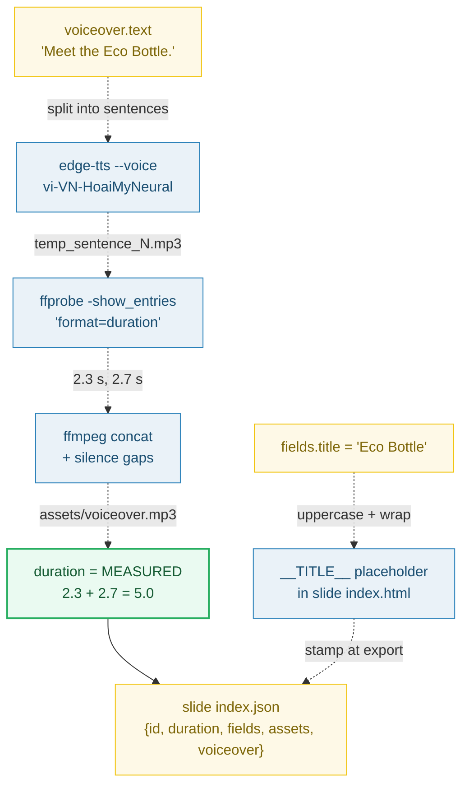

# SLIDE_INDEX_JSON — the data for ONE slide: what the Properties panel binds to

> **Goal:** understand the per-slide `index.json` — the data file that lives next
> to each slide's `index.html`. It carries `id`, `duration` (**measured** from the
> voiceover, never authored), an optional `transition` override, `fields` (bound
> to `__FIELD__`), `assets` (SHA refs), and `voiceover` (text + voice id).
>
> **Run:** `pnpm exec tsx bundles/slide_index_json.ts`
> **Prerequisites:** [UNIT_MODEL](./UNIT_MODEL.md) (a slide unit = a folder with
> `index.html` + `index.json`); [ROOT_INDEX_JSON](./ROOT_INDEX_JSON.md) helps.
> **RFC:** §5.3 (slide `index.json` schema), §5.6 (`fields` → `__FIELD__`), §10 (export pipeline reuses the measured-duration voiceover run).

---

## Lineage — why this exists

RFC 0001's heart is **"JSON is data. HTML is animation."** At the slide scale that
splits cleanly: the slide `index.html` is the bare `<template>` sub-composition
(within-slide GSAP, `__FIELD__` placeholders, CSS), and the slide `index.json` is
**the data the editor UI binds to**. The Properties panel (RFC §7) edits `fields`,
asset refs, voiceover text, and the transition override — all of which live here.

The single most important fact about this file is the one juniors get wrong:
**`duration` is not a number the user types.** It is **measured** from the
voiceover pipeline (edge-tts per sentence → ffprobe each → ffmpeg concat → sum).
That is the key "why" of this bundle.



## What the runnable proves

> From `slide_index_json.ts` Section A:
> ```
>   The data file for ONE slide. Pretty-printed, RFC §5.3 key order:
> 
>   {
>     "id": "slide-0",
>     "duration": 5,
>     "transition": {
>       "type": "push",
>       "duration": 0.5
>     },
>     "fields": {
>       "title": "Eco Bottle",
>       "body": "Sustainable. Reusable. Beautiful."
>     },
>     "assets": {
>       "img": "sha256:aaaaaaaaaaaaaaaaaaaaaaaaaaaaaaaaaaaaaaaaaaaaaaaaaaaaaaaaaaaaaaaa"
>     },
>     "voiceover": {
>       "text": "Meet the Eco Bottle. Built for the planet.",
>       "voice": "vi-VN-HoaiMyNeural"
>     }
>   }
> [check] all required keys present {id, duration, fields, assets, voiceover}: OK
>   → transition is OPTIONAL (present here: true)
> ```

> From `slide_index_json.ts` Section D (the edge-tts gotcha):
> ```
>   AGENTS.md pitfall #1: edge-tts voice IDs MUST end in 'Neural'.
> 
>   good: "vi-VN-HoaiMyNeural"  → isValidVoiceId = true
>   bad : "vi-VN-HoaiMy"  → isValidVoiceId = false
> [check] good voice (vi-VN-HoaiMyNeural) accepted: OK
> [check] bad voice (vi-VN-HoaiMy) rejected: OK
>   → the editor's Properties panel should validate before TTS runs.
> ```

> From `slide_index_json.ts` Section E (the key "why" — duration is MEASURED):
> ```
>     voiceover.text  →  split into sentences
>     each sentence   →  edge-tts → temp.mp3
>     ffprobe each    →  measure ACTUAL duration (seconds)
>     ffmpeg concat   →  assets/voiceover.mp3
>     sum + gaps      →  measured slide duration
> 
>   sentences = [2.3,2.7]
>   gap       = 0
>   measured  = 5.0  (matches SAMPLE.duration = 5)
> [check] measured duration === 5.0: OK
>   → the user never types a duration; the pipeline measures it.
> ```

> From `slide_index_json.ts` Section F (transition override vs inheritance):
> ```
>   root transition_default = {"type":"crossfade","duration":0.4}
> 
>   slide-0 (has transition)  → effective = {"type":"push","duration":0.5}
>   slide-1 (no transition)   → effective = {"type":"crossfade","duration":0.4} (inherited)
> [check] slide with transition uses its override: OK
> [check] slide without transition inherits root default: OK
>   → omitting transition is a feature: bulk-edit the root default once.
> ```

## Why / internals

### Why `duration` is measured, not authored (the big one)

Authored durations drift from reality: the TTS engine's actual render length
depends on the text, the voice, rate, and punctuation, and you cannot predict it
from the character count. If the JSON carried a hand-typed number, the timeline
panel, the captions, and the exported `data-duration` would all disagree with the
audio that actually plays. So the voiceover pipeline (AGENTS.md "Voiceover
pipeline") **measures** instead: it edge-tts's each sentence, runs `ffprobe` on
each temp file to read the real stream duration, concatenates with silence gaps,
and writes the **sum** back as `duration` and into `voiceover_timings.json`.
Export step 3 (RFC §10) reuses exactly this pipeline and sets `data-duration` /
the root `DUR` to the measured length. **What the user types is the *text*; the
*length* is a measurement.**

### Why `fields` is a flat string map (and how it reaches the HTML)

`fields` is `Record<string, string>` — exactly the values the Properties panel
textareas edit. They reach the slide `index.html` via `__FIELD__` string
replacement (RFC §5.6), because HyperFrames' `getVariables()` returns `{}` in
sub-compositions (AGENTS.md). Each field id uppercases to its placeholder:
`title` → `__TITLE__`, `body` → `__BODY__`. Stamping happens on structural change
and fully at export; live text edits patch the DOM without a full re-stamp. See
🔗 [DATA_BINDING](./DATA_BINDING.md).

### Why `assets` are SHA refs, not embedded blobs

An asset value is a short `"sha256:…"` content-address string, not a base64 blob.
The binary lives once in `assets/`; the JSON only points at it. This gives free
dedup (same bytes ⇒ same SHA ⇒ one stored blob) and keeps the data file small and
diff-friendly — ideal for AI Tier-1 edits. See 🔗 [UNIT_MODEL](./UNIT_MODEL.md)
Section D.

### Why `transition` is optional (override vs inheritance)

A slide MAY carry its own `transition` `{type, duration}`. If it omits the field,
it **inherits** the root `transition_default` (RFC §5.2). This is deliberate:
most slides share the project-wide default and you bulk-edit it once at the root;
only the slide that needs a special effect adds a local override. The effective
transition is simply `slide.transition ?? root.transition_default`.

## 🔗 Cross-references

- 🔗 [UNIT_MODEL](./UNIT_MODEL.md) — the slide unit invariant this file is half of
  (a slide = a folder with `index.html` + this `index.json`); also why `assets/`
  are SHA blobs, not units.
- 🔗 [ROOT_INDEX_JSON](./ROOT_INDEX_JSON.md) — owns `transition_default` (which a
  slide without `transition` inherits) and the `slides[]` array that references
  this slide's `id`.
- 🔗 [DATA_BINDING](./DATA_BINDING.md) — the full `fields` → `__FIELD__` stamping
  lifecycle (live-bind vs structural re-stamp vs export re-stamp).
- 🔗 [EXPORT_PIPELINE](./EXPORT_PIPELINE.md) — `duration` drives the host div's
  `data-start` / `data-duration`; export step 3 runs the measured-voiceover pipeline.

## Pitfalls

| Trap | Symptom | Fix |
|---|---|---|
| Authoring `duration` by hand | Timeline, captions, and `data-duration` drift from the audio that actually plays | Never type `duration`; let the voiceover pipeline measure it via ffprobe and write the sum back |
| Using a voice id without the `Neural` suffix (`vi-VN-HoaiMy`) | edge-tts fails / returns nothing at TTS time (AGENTS.md pitfall #1) | Validate `voice.endsWith("Neural")` in the Properties panel before running TTS (`vi-VN-HoaiMyNeural`, `en-US-AriaNeural`) |
| Embedding asset bytes (base64) in `assets` | The JSON bloats, diffs become unreviewable, dedup breaks | Store the binary in `assets/`, reference it by `"sha256:…"` |
| Putting animation timing in `fields` | The data layer bloats; AI Tier-1 edits become hard; timeline becomes a persisted structure | Timing/motion/layering live in the slide `index.html`; JSON carries only data the UI binds to |
| Making `transition` required | Every slide must duplicate the project default; bulk changes become N edits | `transition` is OPTIONAL; omit it to inherit root `transition_default` |
| Forgetting `duration` is per-voiceover, not per-slide-layout | Swapping a voice id changes timing and nothing re-measures | Re-run the voiceover pipeline on any `voiceover` change; `duration` is derived data |

## Cheat sheet

```
slide index.json = { id, duration, transition?, fields, assets, voiceover }
  id          = "slide-N"             (referenced by root.slides[])
  duration    = MEASURED (ffprobe per sentence → concat → sum); NOT authored
  transition  = OPTIONAL {type, duration}; omit → inherit root transition_default
  fields      = {key: value}  →  __KEY__ placeholder in slide index.html
  assets      = {key: "sha256:…"}     (SHA refs, never embedded blobs)
  voiceover   = {text, voice}         voice MUST end in "Neural"

effective transition = slide.transition ?? root.transition_default
duration source      = Σ sentence_durations + Σ inter_sentence_gaps  (measured, rounded)
```

## Sources

- RFC 0001 §5.3 + §5.6 + §10: `docs/rfc-0001.md` (in-repo) — slide `index.json`
  schema, `fields` → `__FIELD__` binding, and the export voiceover step that sets
  the measured `data-duration`.
- `docs/AGENTS.md` (in-repo) — "Layout field types", "Voiceover pipeline"
  (edge-tts → ffprobe → ffmpeg concat → timings), pitfall #1 (`Neural` suffix).
- edge-tts voice id format (`{lang}-{Name}Neural`, suffix mandatory): https://github.com/rany2/edge-tts
- ffprobe measures stream duration (not authored): https://ffmpeg.org/ffprobe.html
- ffprobe duration probe command (`-show_entries format=duration` → seconds): https://superuser.com/questions/650291/how-to-get-video-duration-in-seconds
