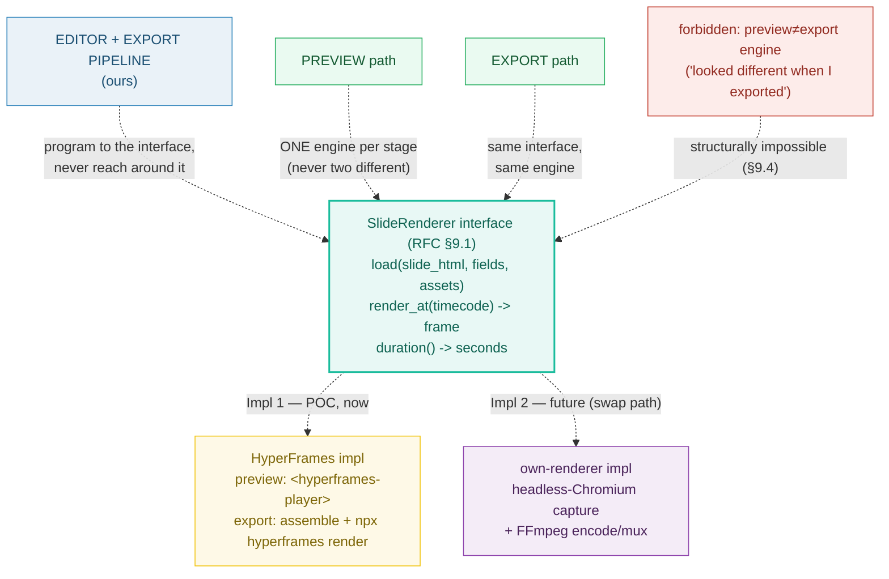

# SLIDE_RENDERER_INTERFACE — the seam that makes preview/export drift impossible

> **Goal:** understand the single interface — `SlideRenderer` — that decouples
> the editor from the rendering engine. It has three methods:
> `load(slide_html, fields, assets)`, `render_at(timecode) → frame`,
> `duration() → seconds`. **Preview AND export both go through it.** HyperFrames
> is the initial implementation for both; it is replaceable later by our own
> renderer (headless Chromium + FFmpeg) without touching the editor — and because
> the two paths never use different engines, *"it looked different when I
> exported"* is **structurally impossible**.
>
> **Run:** `pnpm exec tsx bundles/slide_renderer_interface.ts`
> **Prerequisites:** [UNIT_MODEL](./UNIT_MODEL.md) (the slide `index.html` this
> mounts), [STAGE_CANVAS](./STAGE_CANVAS.md) (the surface that drives the
> renderer from the playhead).
> **RFC:** §9 (the interface + the HF → own-renderer path), §10 (export uses the
> same engine), §11 (visual determinism)

---

## Lineage — why this exists

The prior app coupled the editor to HyperFrames as a black box: there was no
surface you could drive without going through HF's composition lifecycle, and
preview/render fidelity was "only as good as HF's internal consistency" (RFC §2).
RFC 0001 replaces that with a strict seam:

> **The editor and the export pipeline both program to a `SlideRenderer`
> interface.** HyperFrames is the initial *implementation* of that interface for
> both preview and export; it is replaceable by our own renderer later without
> touching the editor. (RFC §1, §9)

The contract is three methods (§9.1). HF's role *contracts* from "the whole
composition engine" to "render this one slide at time *t*" (§9.5); timeline
orchestration, the document model, and the editor all stay **ours**. The payoff
is double: HF becomes a small, replaceable primitive, **and** preview/export
fidelity drift is eliminated by construction — there is never a code path where
the two pick different engines (§9.4).



## What the runnable proves

> From `slide_renderer_interface.ts` Section A (the interface, verbatim):
> ```
>   RFC 0001 §9.1 — the SlideRenderer interface (verbatim):
>
>     interface SlideRenderer:
>         load(slide_html, fields, assets)   # mount a slide composition
>         render_at(timecode) -> frame       # render at time t (preview or capture)
>         duration() -> seconds
> [check] interface exposes load(slide_html, fields, assets): OK
> [check] interface exposes render_at(timecode) -> frame: OK
> [check] interface exposes duration() -> seconds: OK
> ```

> From `slide_renderer_interface.ts` Section B (Impl 1 = HyperFrames):
> ```
>     backend = hyperframes
>     preview = instantiate HF's <hyperframes-player> per active slide; drive to playhead
>     export  = assemble slides + data into one HF composition; `npx hyperframes render` once
>     tools   = <hyperframes-player>, npx hyperframes render, npx hyperframes lint
>
>     hf.load(...) → mounted; hf.renderAt(2.0) →
>       { slideId: "slide-0", time: 2.000000, loaded: true, hasContent: true }
> [check] HF preview path uses <hyperframes-player>: OK
> [check] HF export path uses `npx hyperframes render`: OK
> [check] HF impl satisfies the interface (load -> renderAt -> duration all work): OK
> ```

> From `slide_renderer_interface.ts` Section C (Impl 2 = own renderer, the swap path):
> ```
>     backend = own-renderer
>     preview = headless-Chromium frame capture; seek GSAP to t, capture the frame
>     export  = headless-Chromium capture every frame index 0..N-1 + FFmpeg encode/mux
>     tools   = headless-Chromium (Page.screenshot / CDP), FFmpeg encode/mux
>
>     own.load(...) → mounted; own.renderAt(2.0) →
>       { slideId: "slide-0", time: 2.000000, loaded: true, hasContent: true }
> [check] own-renderer preview path uses headless-Chromium frame capture: OK
> [check] own-renderer export path uses FFmpeg encode/mux: OK
> [check] swap is invisible to callers: own-renderer satisfies the SAME interface: OK
> ```

> From `slide_renderer_interface.ts` Section D (§9.4 — drift is structurally impossible):
> ```
>     POC   preview.renderAt(2) = {"slideId":"slide-0","time":2,"loaded":true,"hasContent":true}
>     POC   export .renderAt(2) = {"slideId":"slide-0","time":2,"loaded":true,"hasContent":true}
>     LATER preview.renderAt(2) = {"slideId":"slide-0","time":2,"loaded":true,"hasContent":true}
>     LATER export .renderAt(2) = {"slideId":"slide-0","time":2,"loaded":true,"hasContent":true}
>     MIXED preview.renderAt(2) = {"slideId":"slide-0","time":2,"loaded":true,"hasContent":true}  (HF backend)
>     MIXED export .renderAt(2) = {"slideId":"slide-0","time":2,"loaded":true,"hasContent":true}  (own backend)
> [check] POC stage: preview + export use the SAME backend (both HF) → frames match: OK
> [check] LATER stage: preview + export use the SAME backend (both own) → frames match: OK
> [check] the MIXED case (preview≠export engine) is exactly what the architecture FORBIDS: OK
> ```

> From `slide_renderer_interface.ts` Section E (§9.5 — make HF smaller):
> ```
>     HF owns   = "render one slide at time t"
>     OURS      = timeline orchestration, document model, editor, asset library, AI
> [check] HF's surface is the 3-method interface (load / render_at / duration): OK
> [check] timeline + document model + editor + assets + AI are OURS (5 concerns, not HF's): OK
> ```

> From `slide_renderer_interface.ts` Section F (the mock impl + contract invariants):
> ```
>     (1) render_at() BEFORE load()  → error (load-before-render)
>     (2) render_at(t) after load    → PURE function of t (determinism)
>     (3) duration()                 → stable across calls
>
>     (1) before load: renderAt(1.0) → throws Error
>         message: "SlideRenderer.render_at() called before load()"
> [check] render_at() before load() throws (load-before-render invariant): OK
>
>     r.load(SAMPLE_SLIDE_HTML, SAMPLE_FIELDS, SAMPLE_ASSETS) → mounted
>     r.duration() = 5.000000  (mocks ffprobe on the voiceover)
>
>     (2) renderAt(2.0) #1 = {"slideId":"slide-0","time":2,"loaded":true,"hasContent":true}
>         renderAt(2.0) #2 = {"slideId":"slide-0","time":2,"loaded":true,"hasContent":true}
>         byte-identical? true
> [check] render_at(t) is PURE: same t → byte-identical frame descriptor: OK
>
>     GOLD: renderAt(2.0).time = 2.000000 === 2.000000  (html gold-checks this)
> [check] GOLD: render_at(2.0).time === 2.0 (the pinned value the html recomputes): OK
>
>     (3) duration() ×3 = 5.000000, 5.000000, 5.000000  (stable)
> [check] duration() is stable across calls (same value every time): OK
> [check] determinism: fresh instance, same inputs → same measured duration: OK
> ```

## Why / internals

### Why one interface for preview *and* export (the §9.4 argument)

A decoupled-preview architecture's biggest risk is fidelity drift: the preview
shows one thing, the export renders another. The usual cause is that preview and
render are **two different engines** with subtly different rendering rules
(CSS rasterization quirks, timing math, font hinting). RFC §9.4 kills this *by
construction*: preview and export share **one interface → one engine at every
stage**.

- **POC (now):** both preview and export use HyperFrames. The preview mounts a
  `<hyperframes-player>` per active slide; export assembles the same slides into
  one HF composition and calls `npx hyperframes render` once (§9.2, §10). Same
  engine → consistent.
- **Later:** both swap to our own renderer (headless Chromium + FFmpeg) *together*
  (§9.3). Still one engine → still consistent.
- **The forbidden case** (preview = HF, export = ours) **has no code path**: the
  editor and exporter never name an engine, they name the interface. There is no
  knob that picks "preview engine" vs "export engine" separately.

Section D's runnable models all three cases. Same-backend stages produce
byte-identical frames; the mixed case is precisely what the architecture rules
out (RFC §18 risk row: *"Preview ↔ export fidelity drift — Structurally
eliminated"*).

### Why HF's role *contracts* (the §9.5 argument)

Today HyperFrames is "the whole composition engine" — it owns the timeline, the
document model, the player. Behind the interface, HF's job shrinks to **"render
this one slide at time *t*"** (§9.5). Timeline orchestration, the document
model, the editor, the asset library, and AI all become **ours**. This matters
for two reasons:

1. **Replaceability.** HF's surface is exactly 3 methods. Swapping it for our
   own renderer means implementing those 3 methods — not rewriting the editor.
   If HF owned the timeline or the document model, a swap would be a rewrite.
2. **Control.** The editor's timeline panel, properties panel, and AI dock all
   mutate workspace files directly; they are not gated on HF's composition
   lifecycle. The preview is **app-owned** (§8), driven from the playhead.

### Why the contract has three invariants (Section F)

Every implementation of the seam — HF or ours — must satisfy three rules. The
mock in Section F asserts all three:

1. **`render_at()` before `load()` is an error.** A slide must be mounted before
   it can be rendered. The mock throws `SlideRenderer.render_at() called before
   load()`. Without this, a caller could render an unmounted composition and get
   a blank/garbage frame silently.
2. **`render_at(t)` is a pure function of `t` after load.** Same `t` →
   byte-identical frame descriptor. This is the **determinism** contract: the
   editor scrubs to `t` and sees frame X; export renders `t` and gets frame X.
   (A real browser-capture impl is *visually* deterministic, not byte- — see
   🔗 [VISUAL_DETERMINISM](./VISUAL_DETERMINISM.md); the bar is "same input →
   visually equivalent output," RFC §11.)
3. **`duration()` is stable.** Measured once at `load()` (mocking ffprobe on the
   voiceover), returned identically on every subsequent call. The timeline panel
   (🔗 [TIMELINE_PANEL](./TIMELINE_PANEL.md)) reads this to lay out slide
   widths; if it wobbled, the timeline would jitter.

### Why Impl 2 is headless Chromium + FFmpeg (not a custom rasterizer)

RFC §9.3 names the two tools deliberately. Headless Chromium (via Puppeteer's
`Page.screenshot()` or CDP) is the **standard** frame-capture primitive — it
renders the slide's HTML/CSS/GSAP through the same browser engine the preview
uses, so capture matches what the editor showed. FFmpeg is the **standard**
encode/mux step — it takes the captured frames and writes an MP4. Both are
documented, battle-tested, and the variable (browser-capture) part is the only
non-determinism, which §11 bounds with the visual-determinism bar. There is no
custom rasterizer to build or maintain.

## 🔗 Cross-references

- 🔗 [STAGE_CANVAS](./STAGE_CANVAS.md) — the surface that drives the renderer
  from the playhead (converts global → local time, then calls `render_at`).
- 🔗 [PREVIEW_ENGINE](./PREVIEW_ENGINE.md) — the app-owned engine that drives
  GSAP timelines via this interface (§8); "real-time, not frame-accurate."
- 🔗 [EXPORT_PIPELINE](./EXPORT_PIPELINE.md) — the export path uses the SAME
  interface (§9.4): assemble + stamp + `npx hyperframes render` (§10).
- 🔗 [VISUAL_DETERMINISM](./VISUAL_DETERMINISM.md) — why the own-renderer targets
  *visual* (not byte) determinism; the purity contract is visual, not bytewise.
- 🔗 [BARE_TEMPLATE](./BARE_TEMPLATE.md) — the slide `index.html` (bare
  `<template>`) that `load(slide_html, …)` receives as its first argument.

## Pitfalls

<div style="overflow-x:auto;min-width:0">
<table>
<thead><tr><th>Trap</th><th>Symptom</th><th>Fix</th></tr></thead>
<tbody>
<tr><td>Calling <code>render_at(t)</code> before <code>load()</code></td><td>Silent blank/garbage frame; or a crash deep inside the engine with no clear cause</td><td>The interface MUST error (<code>SlideRenderer.render_at() called before load()</code>). Never return a default frame — fail loud (Section F invariant 1).</td></tr>
<tr><td>Editor importing HyperFrames directly (bypassing the interface)</td><td>HF becomes coupled to the editor again; swapping it rewrites the editor; fidelity drift returns</td><td>Import the <strong>interface</strong>, not HF. HF is one implementation behind it (§9.5). DI/inject the impl at the seam.</td></tr>
<tr><td>Preview and export picking <em>different</em> engines</td><td>"It looked different when I exported" — the classic decoupled-preview failure</td><td>Structurally impossible by design (§9.4): one interface → one engine per stage. Never wire a "preview engine" vs "export engine" knob.</td></tr>
<tr><td>Letting HF own the timeline or document model</td><td>HF's surface balloons; a future swap becomes a full rewrite; the editor is gated on HF's composition lifecycle</td><td>Contract HF to "render one slide at time <em>t</em>" (§9.5). Timeline / document model / editor / assets / AI are OURS.</td></tr>
<tr><td><code>duration()</code> changing between calls</td><td>Timeline panel widths jitter; playhead math drifts; captions desync</td><td>Measure once at <code>load()</code> (ffprobe on voiceover); return the cached value forever (Section F invariant 3).</td></tr>
<tr><td>Assuming <code>render_at</code> is byte-deterministic for a real browser capture</td><td>CI flakiness; "the same frame changed bytes between runs" treated as a bug</td><td>The bar is <strong>visual</strong> determinism (§11), not byte-. Browser capture has minor non-determinism; cache-key on perceptual hashes, not byte hashes.</td></tr>
<tr><td>Impl 2 inventing a custom rasterizer instead of using headless Chromium + FFmpeg</td><td>Massive engineering surface; CSS/GSAP fidelity regressions vs the browser</td><td>Use the standard pair: Puppeteer <code>Page.screenshot()</code>/CDP for capture, FFmpeg for encode/mux (§9.3). The browser IS the reference renderer.</td></tr>
<tr><td>Confusing <code>render_at(timecode)</code> with "advance the timeline"</td><td>Stateful render calls accumulate; scrubbing backwards renders the wrong frame</td><td><code>render_at</code> is a <strong>pure seek</strong> to time <em>t</em>, not a tick. Same <em>t</em> → same frame (Section F invariant 2).</td></tr>
</tbody>
</table>
</div>

## Cheat sheet

```
interface      = load(slide_html, fields, assets) · render_at(timecode) -> frame · duration() -> seconds
who uses it    = editor (§8 preview) AND export pipeline (§10) — BOTH, never reaching around it
Impl 1 (POC)   = HyperFrames: preview <hyperframes-player>; export assemble + `npx hyperframes render`
Impl 2 (later) = own renderer: headless-Chromium capture (Page.screenshot/CDP) + FFmpeg encode/mux
swap           = invisible to callers — implement the same 3 methods; editor/export unchanged (§9.3)
fidelity drift = STRUCTURALLY IMPOSSIBLE — one interface -> one engine per stage (§9.4)
HF's job       = "render this one slide at time t" — 3 methods, replaceable (§9.5)
OURS           = timeline orchestration · document model · editor · asset library · AI
contract (1)   = render_at() before load() -> Error  (load-before-render)
contract (2)   = render_at(t) PURE: same t -> same frame (determinism; visual bar §11)
contract (3)   = duration() stable: measured once at load (ffprobe), cached forever
GOLD           = render_at(2.0).time === 2.0   (the html recomputes this)
```

## Sources

- RFC 0001 §9.1–§9.5 (the interface + the HF → own-renderer path), §10 (export
  uses the same engine), §11 (visual determinism), §18 (drift risk row):
  `docs/rfc-0001.md` (in-repo)
- AGENTS.md "Module responsibilities" + "Commands" (rendering.py, `npx hyperframes
  render`/`lint`/`inspect`/`snapshot`): `docs/AGENTS.md` (in-repo)
- Puppeteer — `Page.screenshot()` ("Captures a screenshot of this page" →
  `Promise<Uint8Array>`): the standard headless-Chromium frame-capture primitive
  for Impl 2: https://pptr.dev/api/puppeteer.page.screenshot
- FFmpeg — ffmpeg(1) ("a universal media converter … can read a wide variety of
  inputs … filter, and transcode them into a plethora of output formats"): the
  standard encode/mux step for Impl 2: https://ffmpeg.org/ffmpeg.html
- MDN — `HTMLCanvasElement.toDataURL()` (alternative in-browser frame-capture
  primitive; confirms headless-Chromium capture is the standard Web-API approach):
  https://developer.mozilla.org/en-US/docs/Web/API/HTMLCanvasElement/toDataURL
