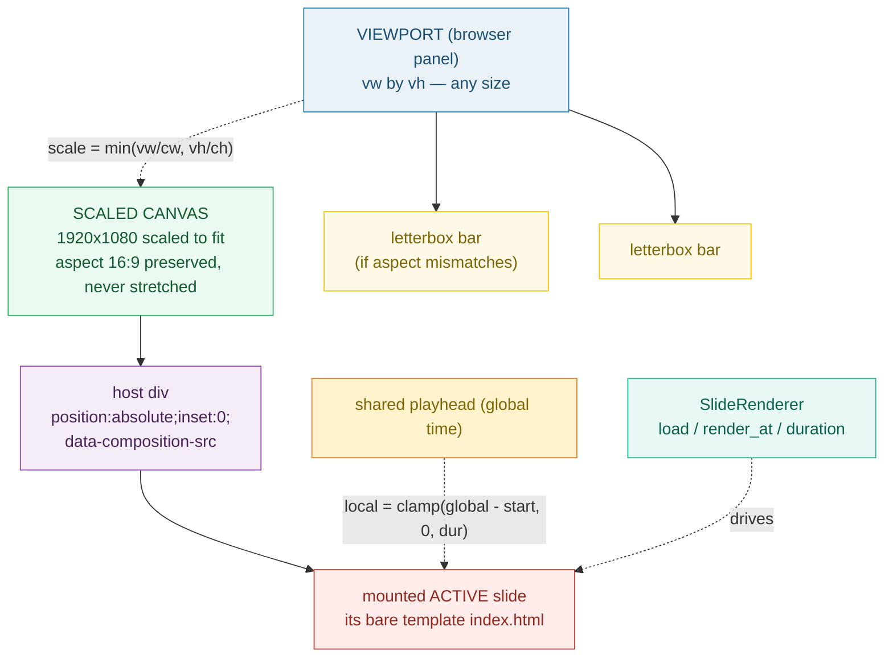

# STAGE_CANVAS — the center panel: a real-time, scaled preview of the active slide

> **Goal:** understand the editor's center surface — the Stage/Canvas. It mounts
> the **active slide's** `index.html` via the `SlideRenderer` interface, renders
> it at the root canvas dims (1920×1080, 16:9), scales that canvas to fit the
> viewport **without stretching** (letterbox), and binds to the shared playhead.
> It is **real-time, not frame-accurate** — and that decoupling is the point.
>
> **Run:** `pnpm exec tsx bundles/stage_canvas.ts`
> **Prerequisites:** [UNIT_MODEL](./UNIT_MODEL.md) (the unit model),
> [BARE_TEMPLATE](./BARE_TEMPLATE.md) (the slide HTML the stage mounts),
> [ROOT_INDEX_JSON](./ROOT_INDEX_JSON.md) (where `canvas` lives).
> **RFC:** §7 (Editor Surfaces — Stage/Canvas row), §8 (App-Owned Preview Engine)

---

## Lineage — why this exists

The prior app had **no stage**. It rendered a generated HTML form, stamped values
into a template, and produced a video — there was no live preview surface you
could scrub. RFC 0001 §2 calls this out as a non-goal-class limitation: *"there
is no timeline, no visual stage, no properties panel. The only affordance is a
generated form."*

The Stage/Canvas (RFC §7) is the answer for the center panel. It is a **live,
in-browser preview of one slide at a time** — the active slide. Crucially, the
preview is **app-owned** (§8): the editor drives a `SlideRenderer` interface,
and HyperFrames is the initial *implementation* of that interface for both
preview and export. The stage is therefore **not frame-accurate** — it is
responsive for editing. Frame-accurate output is the export pipeline's job
(§10/§11). Decoupling the two is what lets the editor stay fast without lying
about the final video.



## What the runnable proves

> From `stage_canvas.ts` Section A (the stage renders the ACTIVE slide):
> ```
>   SlideRenderer interface (RFC §9.1, verbatim):
>     interface SlideRenderer:
>         load(slide_html, fields, assets)   # mount a slide composition
>         render_at(timecode) -> frame       # render at time t (preview or capture)
>         duration() -> seconds
>
>   ACTIVE_SLIDE_ID = "slide-0" (mounted via SlideRenderer.load)
> [check] exactly one active slide is mounted at a time: OK
> [check] SlideRenderer exposes load() / render_at() / duration(): OK
> ```

> From `stage_canvas.ts` Section B (canvas + aspect + scale-to-fit — the pinned values):
> ```
>     width  = 1920
>     height = 1080
>     aspect = width/height = 1.777778
>     16/9                = 1.777778
> [check] 1920/1080 === 16/9 within 1e-6: OK
> [check] aspect is the standard 16:9 (1.777778): OK
>     viewport 800x450: scale=0.416667 → canvas 800.000000x450.000000  (same 16:9 aspect → no letterbox)
>     viewport 600x500: scale=0.312500 → canvas 600.000000x337.500000  (taller viewport → letterbox top/bottom)
>     viewport 1280x720: scale=0.666667 → canvas 1280.000000x720.000000  (same aspect, larger viewport)
> [check] 800x450 viewport (16:9) → scale 0.416667, canvas 800x450 (fills, no bars): OK
> [check] 600x500 viewport (taller) → scale 0.312500, canvas 600x337.5 (letterboxed): OK
>   PINNED: aspect = 1.777778; fit 1920x1080 into 800x450 → scale 0.416667;
>   fit into 600x500 → scale 0.312500, canvas 600.000000x337.500000.
> ```

> From `stage_canvas.ts` Section C (playhead → local time, clamped):
> ```
>     local = clamp(globalTime - slideStart, 0, slideDuration)
>
>     globalTime=4.000000  →  local=0.000000   (slide-1: start=5.900000, dur=4.000000)
>     globalTime=5.900000  →  local=0.000000   (slide-1: start=5.900000, dur=4.000000)
>     globalTime=7.500000  →  local=1.600000   (slide-1: start=5.900000, dur=4.000000)
>     globalTime=9.890000  →  local=3.990000   (slide-1: start=5.900000, dur=4.000000)
>     globalTime=11.000000  →  local=4.000000   (slide-1: start=5.900000, dur=4.000000)
> [check] before slide start (global 4.0) clamps UP to local 0: OK
> [check] after slide end (global 11.0) clamps DOWN to slideDuration (4.0): OK
>   PINNED: globalTime 7.5, slide-1 start 5.9 → local 1.600000 (GSAP seeks here).
> ```

> From `stage_canvas.ts` Section D (switching slides = swap):
> ```
>   project slides (global timeline windows):
>     slide-0: [0.500000, 5.500000)
>     slide-1: [5.900000, 9.900000)
>     slide-2: [10.300000, 16.300000)
>
>     activeSlideAt(7.5)  = slide-1
>     activeSlideAt(11.0) = slide-2
>     activeSlideAt(5.6)  = null  (in a gap between slides)
> [check] active slide swaps when the playhead crosses a slide boundary: OK
> [check] activeSlideAt returns null in a gap (no slide contains the time): OK
> ```

> From `stage_canvas.ts` Section E (real-time, NOT frame-accurate):
> ```
>   PREVIEW (real-time): stage seeks GSAP to the playhead per paint;
>   dt is variable (browser-paced) — frame indices repeat/skip:
>     playhead 0.000000s → seek(0.000000); nearest frame index 0
>     playhead 0.060000s → seek(0.060000); nearest frame index 1
>     playhead 0.090000s → seek(0.090000); nearest frame index 2
>     playhead 0.150000s → seek(0.150000); nearest frame index 4
>     playhead 0.166000s → seek(0.166000); nearest frame index 4
>
>   EXPORT (frame-accurate): npx hyperframes render steps frame index
>   0..N-1 at exactly 1/fps = 0.033333s each (RFC §10, §11):
>     frame[0] → render_at(0.000000)  (exact, no repeat/skip)
>     frame[1] → render_at(0.033333)  (exact, no repeat/skip)
> [check] preview sample dt is NOT 1/fps (real-time, variable cadence): OK
> [check] export step IS exactly 1/fps (frame-accurate, deterministic): OK
> ```

> From `stage_canvas.ts` Section F (why `position:absolute;inset:0;` on the host div):
> ```
>     <div data-composition-id="slide-0"
>          data-composition-src="compositions/slide-0.html"
>          data-start="0.5" data-duration="5.0"
>          class="clip" style="position:absolute;inset:0;z-index:100;"></div>
>
> [check] host div carries position:absolute;inset:0; (REQUIRED, non-negotiable): OK
> [check] host div references the composition (data-composition-src) + class="clip": OK
> ```

## Why / internals

### Why the stage renders ONE active slide (not all slides)

RFC §7 binds the stage to **the active slide**. Rendering all slides at once
would mean rendering a 16.3-second timeline every paint — wasteful and
disorienting. Instead the stage mounts exactly one slide's composition and
drives ITS within-slide GSAP timeline from the playhead's local time (Section C).
When the playhead crosses into the next slide's window, the stage **swaps** the
mounted composition (Section D). Between-slide transitions (crossfade/push) are
NOT the stage's job — they live in the ROOT `index.html` (RFC §5.1, the
"between vs within" split from [UNIT_MODEL](./UNIT_MODEL.md)).

### Why scale-to-fit (min scale), not stretch

The canvas is a fixed 1920×1080 raster (RFC §5.2); the browser viewport is any
size. To preview without distortion, the stage applies a **uniform** scale =
`min(vw/cw, vh/ch)` — the limiting axis wins (MDN `object-fit: contain`).
A non-uniform scale (different x/y factors) would stretch the 16:9 canvas into
whatever box the viewport happens to be, and text/captions would deform. The
unused viewport area is filled with letterbox bars. The `.html` companion
renders this for real: a 16:9 div scaled inside a resizable viewport.

### Why local time = clamp(global − start, 0, duration)

The playhead is a **single shared global time** (🔗 [TIMELINE_PANEL](./TIMELINE_PANEL.md)).
Each slide's GSAP timeline starts at 0 and runs to its measured `duration`. The
stage translates global → local before seeking: `local = clamp(globalTime −
slideStart, 0, slideDuration)`. Clamping matters at the boundaries — scrubbing
*before* the slide starts seeks to 0 (not a negative); scrubbing *after* it ends
seeks to its final frame (not past it). Without the clamp, GSAP would seek
outside the timeline's range and the preview would freeze or jump.

### Why real-time, NOT frame-accurate (the decoupling rationale)

This is the single most important design sentence in §8:

> *"Real-time, not frame-accurate. That is the point of decoupling: the preview
> is responsive for editing; the export is rigorous (§10)."*

The preview seeks GSAP to whatever the playhead reports, **on each browser
paint** (`requestAnimationFrame`). Because paints are browser-paced, the delta
between successive seeks is variable — frame indices can **repeat** (a slow
paint holds the same frame) or **skip** (a scrub jumps past one). That is
correct and desirable: the preview must be responsive to interaction, not
locked to a fixed `1/fps` cadence. Frame-accurate output (every index 0..N-1,
exactly once, at `1/fps` each) is the **export** pipeline's job —
`npx hyperframes render` (§10) under the visual-determinism bar (§11). The
`SlideRenderer` interface (§9) is what keeps the two consistent: preview and
export share one engine, so "it looked different when I exported" is
structurally impossible (§9.4).

### Why `position:absolute;inset:0;` on the host div

AGENTS.md "Host div format" is blunt: *"position:absolute;inset:0; is REQUIRED
on the host div — without it, sub-comp content collapses to zero size."* The
slide's bare `<template>` (🔗 [BARE_TEMPLATE](./BARE_TEMPLATE.md)) is mounted
into this div. `inset:0` stretches the host to fill the scaled canvas; if the
host has zero size, the mounted composition has nowhere to render and the stage
goes blank. This is the same HF sub-comp mounting-context quirk that bans
`display:flex` and absolute+transform centering (AGENTS.md "Why NOT
flex/absolute centering") — `inset:0` is the sanctioned way to size the host.

## 🔗 Cross-references

- 🔗 [SLIDE_RENDERER_INTERFACE](./SLIDE_RENDERER_INTERFACE.md) — the engine the
  stage drives (`load` / `render_at` / `duration`). Preview and export share it.
- 🔗 [PREVIEW_ENGINE](./PREVIEW_ENGINE.md) — drives GSAP from the playhead; the
  "real-time, not frame-accurate" contract lives here.
- 🔗 [TIMELINE_PANEL](./TIMELINE_PANEL.md) — owns the shared playhead (global
  time) the stage converts into per-slide local time.
- 🔗 [BARE_TEMPLATE](./BARE_TEMPLATE.md) — the slide `index.html` (bare
  `<template>`) the stage mounts into the host div.
- 🔗 [ROOT_INDEX_JSON](./ROOT_INDEX_JSON.md) — where `canvas` {1920,1080,30}
  lives; the dims the stage scales to fit.

## Pitfalls

<div style="overflow-x:auto;min-width:0">
<table>
<thead><tr><th>Trap</th><th>Symptom</th><th>Fix</th></tr></thead>
<tbody>
<tr><td>Stretching the canvas to fill the viewport (non-uniform scale)</td><td>16:9 preview deforms; text/captions look warped when the viewport isn't 16:9</td><td>Use uniform <code>scale = min(vw/cw, vh/ch)</code> (object-fit: contain). Letterbox the remainder — never stretch.</td></tr>
<tr><td>Forgetting the clamp in <code>local = global − start</code></td><td>Scrubbing before a slide's start seeks GSAP to a negative time (preview freezes/jumps); scrubbing past the end seeks beyond the timeline</td><td><code>clamp(globalTime − slideStart, 0, slideDuration)</code> — always pin to <code>[0, duration]</code>.</td></tr>
<tr><td>Rendering all slides at once instead of the active one</td><td>Every paint re-renders the whole 16s timeline; janky, disorienting preview</td><td>Mount exactly ONE slide (the active id); swap on playhead boundary cross (RFC §7).</td></tr>
<tr><td>Host div missing <code>position:absolute;inset:0;</code></td><td>Mounted <code>&lt;template&gt;</code> collapses to zero size — <strong>blank stage</strong> (AGENTS.md)</td><td>Always set <code>style="position:absolute;inset:0;"</code> on the host div; add <code>class="clip"</code> for HF visibility.</td></tr>
<tr><td>Expecting frame-accurate preview</td><td>"The preview skipped/repeated a frame while scrubbing" — treated as a bug</td><td>It isn't. Preview is real-time by design (§8); frame-accuracy is export's job (§10/§11). Don't lock preview to <code>1/fps</code>.</td></tr>
<tr><td>Putting between-slide transitions in the stage</td><td>Stage logic balloons; transitions drift from what export renders</td><td>Transitions (crossfade/push) live in ROOT <code>index.html</code> (§5.1). The stage only swaps the mounted composition.</td></tr>
<tr><td>Treating a playhead "gap" (null active slide) as slide-0</td><td>Preview mounts the wrong slide during timeline gaps</td><td><code>activeSlideAt(t)</code> can return null between slides; render a neutral state, never fall back to a default slide.</td></tr>
</tbody>
</table>
</div>

## Cheat sheet

```
stage         = center panel; renders the ACTIVE slide (one at a time) via SlideRenderer
canvas dims   = root index.json canvas {width:1920, height:1080, fps:30} (RFC §5.2)
aspect        = 1920/1080 = 16/9 = 1.777778  (Full HD, 16:9 standard)
scale-to-fit  = min(vw/cw, vh/ch);  scaled = (cw*scale, ch*scale); letterbox, never stretch
playhead      = shared global time (🔗 TIMELINE_PANEL)
local time    = clamp(globalTime − slideStart, 0, slideDuration)  → GSAP seek()
swap          = playhead crosses into next slide's [start, start+duration) → SlideRenderer.load()
real-time     = preview seeks per rAF paint (variable dt; frames repeat/skip) — NOT frame-accurate (§8)
frame-accurate= EXPORT only: npx hyperframes render, every index 0..N-1 at 1/fps (§10/§11)
host div      = position:absolute;inset:0; class="clip" — REQUIRED or sub-comp collapses (AGENTS.md)
```

## Sources

- RFC 0001 §7 (Stage/Canvas row), §8 (App-Owned Preview Engine), §9.1
  (SlideRenderer interface), §5.2 (canvas), §10/§11 (export + determinism):
  `docs/rfc-0001.md` (in-repo)
- AGENTS.md "Host div format" + "Why NOT flex/absolute centering":
  `docs/AGENTS.md` (in-repo) — the `position:absolute;inset:0;` rule and the
  `data-width="1920" data-height="1080"` composition dims.
- Wikipedia — 16:9 aspect ratio (1920×1080 = Full HD is a 16:9 resolution; 16:9 = 1.77:1):
  https://en.wikipedia.org/wiki/16:9_aspect_ratio
- Wikipedia — 1080p (1920×1080 progressive, the Full HD raster):
  https://en.wikipedia.org/wiki/1080p
- MDN — `object-fit: contain` ("sized to maintain its aspect ratio while fitting
  within the element's content box" = the scale-to-fit / letterbox math):
  https://developer.mozilla.org/en-US/docs/Web/CSS/object-fit
- MDN — `scale()` (uniform scale preserves aspect; non-uniform stretches):
  https://developer.mozilla.org/en-US/docs/Web/CSS/transform-function/scale
