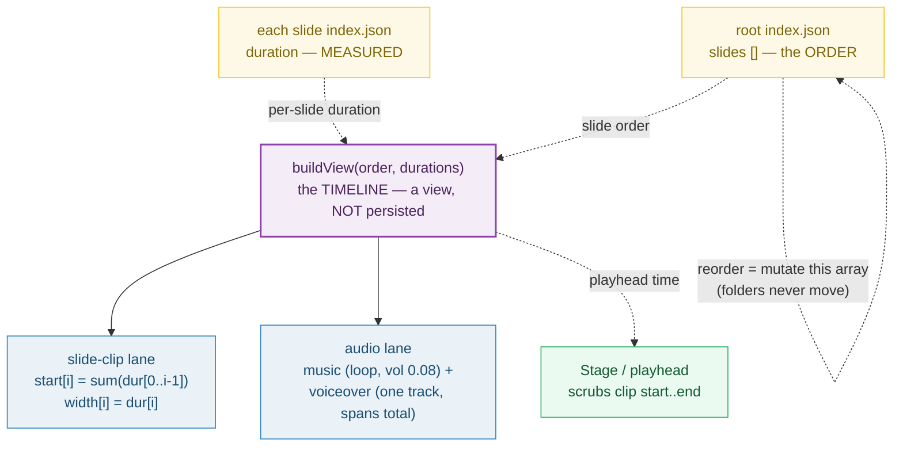

# TIMELINE_PANEL — the bottom surface: a *view* over `(slide order + measured durations)`

> **Goal:** understand the editor's bottom panel — what it binds to, how it
> turns per-slide durations into a sequential timeline, why reordering is a
> JSON mutation (never a filesystem move), and why it is deliberately NOT a
> multi-track NLE.
>
> **Run:** `pnpm exec tsx bundles/timeline_panel.ts`
> **Prerequisites:** [UNIT_MODEL](./UNIT_MODEL.md) (a unit is a folder),
> [ROOT_INDEX_JSON](./ROOT_INDEX_JSON.md) (the `slides` ordering spine),
> [SLIDE_INDEX_JSON](./SLIDE_INDEX_JSON.md) (per-slide `duration`).
> **RFC:** §7 (Editor Surfaces — Timeline), §5.5 (why JSON holds only data),
> §3 (Non-Goals)

---

## Lineage — why this exists

The prior app had **no timeline at all** — only a generated HTML form
(RFC §2). RFC 0001 §7 introduces a real editor surface for the bottom of the
screen. But — and this is the subtle part — the timeline is **not a new data
structure**. RFC §5.5 is explicit:

> The editor's "timeline" panel is a *view* over `(slide order + measured
> durations)` — not a rich structure it persists. This keeps the data layer
> small, stable, and ideal for small-model AI edits (RFC 0002).

So the panel **binds to two things that already exist** (RFC §7, verbatim):
the `slides` array in root `index.json`, and each slide's `duration` in its
own `index.json`. It owns no file of its own. Its job is to *render* those as
a Gantt-style lane of clips and let the user *reorder* slides — which is a
mutation of the `slides` array, **never** a move of folders on disk.



The dotted arrows are the binding: the panel reads order + durations and
**re-derives** everything else (clip starts, total, audio span). None of that
derived state is saved.

## What the runnable proves

> From `timeline_panel.ts` Section A (the view signature):
> ```
>   RFC 0001 §5.5 — "The editor's 'timeline' panel is a *view* over
>   (slide order + measured durations) — not a rich structure it persists."
>
>   signature:  view(slideOrder: string[], durations: Record<id,number>) → lanes
>
>     clip slide-0  start=0.000000  dur=4.000000  end=4.000000
>     clip slide-1  start=4.000000  dur=5.000000  end=9.000000
>     clip slide-2  start=9.000000  dur=3.000000  end=12.000000
>     total = 12.000000
> [check] timeline is a pure view (output derived solely from order + durations): OK
>   → the panel persists NOTHING of its own; it reads two existing files.
> ```

> From `timeline_panel.ts` Section B (the pinned prefix-sum example):
> ```
>   start[i] = sum(dur[0..i-1]) + i*gap. With gap = 0:
>
>     order      = ["slide-0", "slide-1", "slide-2"]
>     durations  = [4, 5, 3]
>     cum Starts = [0.000000, 4.000000, 9.000000]
>     total      = 12.000000
>
> [check] cumulative starts === [0, 4, 9] (prefix sums of [4,5,3]): OK
> [check] total === 12.0 (sum of durations, gap 0): OK
>   PINNED: starts = [0, 4.0, 9.0], total = 12.0
> ```

> From `timeline_panel.ts` Section C (reorder — the gold value):
> ```
>   BEFORE:
>     root.slides = ["slide-0", "slide-1", "slide-2"]
>     cum Starts  = [0.000000, 4.000000, 9.000000]  total=12.000000
>   AFTER (swap slide-0 ↔ slide-2):
>     root.slides = ["slide-2", "slide-1", "slide-0"]
>     cum Starts  = [0.000000, 3.000000, 8.000000]  total=12.000000
>
>     folders on disk (before): slide-0,slide-1,slide-2
>     folders on disk (after) : slide-0,slide-1,slide-2  ← UNCHANGED
>
> [check] reorder: new cumulative starts === [0, 3, 8]: OK
> [check] reorder: total is invariant (12.0 === 12.0): OK
> [check] reorder: folders on disk unchanged: OK
>   → undo/redo is a JSON array mutation, not a filesystem operation.
> ```

> From `timeline_panel.ts` Section D (the audio lane):
> ```
>     MUSIC BED
>       loop   = true   (bed loops for the whole video)
>       volume = 0.080000  (0..1; AGENTS.md default 0.08)
>     VOICEOVER TRACK
>       span   = 12.000000  (ONE track, spans measured total)
>       loop   = false  (plays once; its measured length drives captions)
>
> [check] music loops (loop === true): OK
> [check] voiceover span === measured total: OK
> ```

> From `timeline_panel.ts` Section F (the non-goal):
> ```
>   RFC §3 Non-Goals (verbatim):
>     "Full multi-track NLE (Premiere/Resolve class). Scene-based only."
>
> [check] single sequential scene lane (no overlapping clips): OK
>   → no parallel tracks, no J/L cuts, no keyframed opacity lanes.
>     One slide at a time, back to back. That is the entire timeline model.
> ```

## Why / internals

### Why a view, not a persisted structure (the key idea — RFC §5.5)

A timeline *panel* that owned its own file would be a third data layer beside
root and slide `index.json`. That bloats the model, invites drift (timeline
says one thing, `slides[]` says another), and — critically for the AI strategy
(RFC 0002) — gives a small Tier-1 model a big, easy-to-corrupt structure to
edit. Keeping the timeline a **pure function of `(slides[], durations)`**
means:

- There is exactly **one** source of slide order (root `index.json` `slides`).
- There is exactly **one** source of each clip width (the slide's own
  `duration`).
- Undo/redo is a JSON array mutation, not an HTML/filesystem diff (RFC §7).
- A Tier-1 AI edit is just "reorder `slides[]`" or "tweak a `duration`"; the
  panel re-derives the rest. No timeline JSON to parse or corrupt.

### Why cumulative starts are prefix sums (Gantt model)

Each slide is a clip laid end-to-start on a horizontal time axis. A clip's
start is the **cumulative end of every clip before it** — i.e. a prefix
(running) sum of durations. With an optional inter-slide gap
(`start[i] = sum(dur[0..i-1]) + i*gap`; the voiceover pipeline's default gap is
0.8s per AGENTS.md "Smart timing"). The runnable computes this with
`Array.prototype.reduce`, whose MDN semantics — "passing in the return value
from the calculation on the preceding element" — are *exactly* a running sum.
This is the same bar-width = duration, bar-position = cumulative-start model a
[Gantt chart](https://en.wikipedia.org/wiki/Gantt_chart) uses.

### Why reorder mutates `root.slides`, never the filesystem

Slide folders (`slide-0/`, `slide-1/`, …) are **stable handles**. Every
`data-composition-src` ref, every asset path, every caption binding keys off
the folder name. Renaming or moving a folder to "reorder" would break all of
them and destroy history. So reorder is a **mutation of the `slides` array in
root `index.json`** — the array is the order, the folders are just identities
(🔗 [UNIT_MODEL](./UNIT_MODEL.md) Section E, 🔗 [ROOT_INDEX_JSON](./ROOT_INDEX_JSON.md)
Section F). The runnable proves the on-disk folder set is byte-identical
before and after a swap.

### Why the audio lane is two tracks, not per-slide audio

Per AGENTS.md "Voiceover pipeline", the batch TTS pipeline produces **ONE**
`voiceover.mp3` for the whole project — individual per-slide audio files are
explicitly NOT used. So the audio lane is just two bars: a **music bed**
(looped, volume 0.08, content-addressed) and a **voiceover track** (one span
from 0 to the measured total, not looped — its length drives captions and
becomes the root `DUR`). The voiceover span therefore **equals** the timeline
total; the runnable asserts this.

### Why this is NOT a multi-track NLE (RFC §3 Non-Goal)

A Premiere/Resolve-class NLE arranges clips on many **parallel** tracks with
overlaps, J/L cuts, and keyframed opacity. This editor is **scene-based**:
one sequential lane, one slide at a time, back to back. There is no concept of
two clips playing simultaneously. This is a deliberate scope cut — it is what
makes the "timeline = view over `slides[]`" model viable (a multi-track model
could not be a pure function of an ordering array).

## 🔗 Cross-references

- 🔗 [ROOT_INDEX_JSON](./ROOT_INDEX_JSON.md) — owns the `slides` ordering array
  the timeline reorders; that array is the panel's only write target.
- 🔗 [SLIDE_INDEX_JSON](./SLIDE_INDEX_JSON.md) — owns each slide's `duration`
  (MEASURED); that number is the per-clip lane width.
- 🔗 [STAGE_CANVAS](./STAGE_CANVAS.md) — the playhead the timeline scrubs drives
  the stage; scrubbing to clip `start..end` is what "selects" a slide.
- 🔗 [PREVIEW_ENGINE](./PREVIEW_ENGINE.md) — the engine that renders the active
  slide at the playhead time the timeline emits.
- 🔗 [UNIT_MODEL](./UNIT_MODEL.md) — why folders are stable handles (reorder
  never moves them); Section E is the ordering invariant this panel relies on.

## Pitfalls

| Trap | Symptom | Fix |
|---|---|---|
| Persisting the timeline as its own JSON file | A third data layer drifts from `slides[]`/`duration`; AI edits corrupt it | Keep it a pure view of `(slides[], durations)` — the panel owns no file (RFC §5.5) |
| Reordering by renaming/moving slide folders | Breaks every `data-composition-src` ref, asset path, and caption binding; loses history | Reorder = mutate the `slides` array in root `index.json`; folders are stable handles (🔗 UNIT_MODEL §E) |
| Caching clip start times across edits | Stale starts after a duration change or reorder; playhead lands in the wrong clip | Always recompute cumulative starts (prefix sums) from current `(order, durations)` on every render |
| Modeling per-slide audio files in the audio lane | Contradicts the batch TTS pipeline (one `voiceover.mp3`); desyncs from captions | Audio lane = music bed (looped) + ONE voiceover track spanning the measured total (AGENTS.md) |
| Treating the gap as the clip's own duration | Off-by-one in total; last clip end ≠ voiceover span | Total = `starts[n-1] + dur[n-1]` = `sum(dur) + (n-1)*gap`; the gap is BETWEEN slides, not part of any clip |
| Forgetting the gap when computing `start[i]` | Clips overlap or leave silence; voiceover desyncs | `start[i] = sum(dur[0..i-1]) + i*gap` (default gap 0.8s from AGENTS.md "Smart timing") |
| Assuming multi-track features (overlap, J/L cuts, opacity keyframes) | Scope creep into an NLE; breaks the "view over `slides[]`" invariant | Scene-based only — one sequential lane, no parallel tracks (RFC §3 Non-Goal) |
| Authoring (typing in) a slide `duration` by hand | Drifts from the measured voiceover length; total ≠ voiceover span | `duration` is MEASURED by the ffprobe + concat pipeline; the panel reads it, never writes it (🔗 SLIDE_INDEX_JSON) |

## Cheat sheet

```
timeline panel  = VIEW over (root.slides[], each slide.duration). Persists NOTHING.
binds to        = root index.json slides[] (ORDER) + each slide index.json duration (WIDTH)
cumulative start[i] = sum(dur[0..i-1]) + i*gap          (prefix sum via reduce)
total           = starts[n-1] + dur[n-1] = sum(dur) + (n-1)*gap
reorder         = mutate root.slides[]; folders NEVER move on disk
audio lane      = music (loop, vol 0.08) + voiceover (ONE track, spans total, no loop)
PINNED          = durations [4,5,3] gap 0 → starts [0,4,9], total 12.0
                  swap(slide-0 ↔ slide-2) → starts [0,3,8], total STILL 12.0
NON-GOAL        = multi-track NLE (Premiere/Resolve). Scene-based, single lane only.
```

## Sources

- RFC 0001 §7 (Editor Surfaces — Timeline row), §5.5, §3, §5.2–§5.3: `docs/rfc-0001.md` (in-repo)
- `AGENTS.md` "Preview audio" (music 0.08 loop, voiceover no-loop) + "Voiceover pipeline" (gap 0.8s): `docs/AGENTS.md` (in-repo)
- MDN `Array.prototype.reduce()` — the prefix-sum / running-total algorithm behind cumulative starts: https://developer.mozilla.org/en-US/docs/Web/JavaScript/Reference/Global_Objects/Array/reduce
- Wikipedia — Gantt chart (bar width = duration, bars positioned by cumulative start/finish): https://en.wikipedia.org/wiki/Gantt_chart
- Wikipedia — Non-linear editing (what a multi-track NLE is, and thus what this is NOT): https://en.wikipedia.org/wiki/Non-linear_editing
