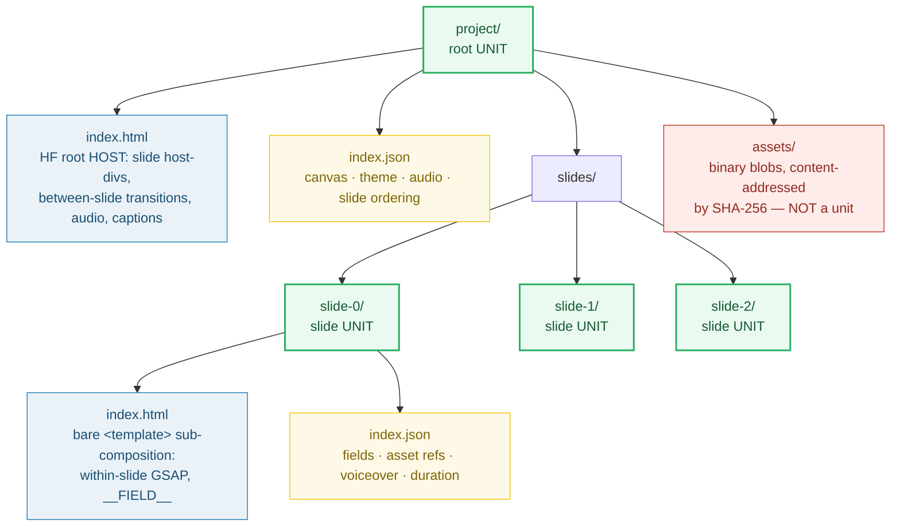

# UNIT_MODEL — the symmetric unit: "JSON is data, HTML is animation"

> **Goal:** understand the single most important idea in RFC 0001 — that every
> unit of a project (the root and each slide) is a folder with exactly two files,
> and those two filenames mean different things at different scales.
>
> **Run:** `pnpm exec tsx bundles/unit_model.ts`
> **Prerequisites:** none. This is the foundation bundle.
> **RFC:** §5.1 (Core Document Model), §5.5 (decision records)

---

## Lineage — why this exists

The prior app was a generated HTML form that stamped values into a template and
rendered it. It had no notion of *units*. RFC 0001 replaces that with a strict,
two-level document model:

> **JSON is data. HTML is animation.** — at *both* granularities.

Every unit — the project root **and** each slide — is a folder containing
`index.html` (the animation/visual) and `index.json` (the data). The same two
filenames, used symmetrically, disambiguated by folder. The payoff is enormous:
**the editable source files *are* HyperFrames' files**, so export is "arrange +
stamp data + render" with **zero format translation** (RFC §10).



## What the runnable proves

> From `unit_model.ts` Section A:
> ```
>   RFC 0001 §5.1 — every unit is a folder with index.html + index.json
>
>   <root>/
>     index.html
>     index.json
> [check] <root> is a valid unit folder: OK
>   slides/slide-0/
>     index.html
>     index.json
> [check] slides/slide-0 is a valid unit folder: OK
>   slides/slide-1/
>     index.html
>     index.json
> [check] slides/slide-1 is a valid unit folder: OK
>   slides/slide-2/
>     index.html
>     index.json
> [check] slides/slide-2 is a valid unit folder: OK
> ```

> From `unit_model.ts` Section B (the pinned value):
> ```
> [check] exactly one root unit: OK
>   root unit   → index.html + index.json
>   slide units → 3 (slide-0 .. slide-2)
> [check] every unit has exactly {index.html, index.json}: OK
>   PINNED: units validated = 4 (1 root + 3 slides)
> ```

> From `unit_model.ts` Section D (assets are NOT units):
> ```
>   assets/ holds binary blobs. index.json references them by SHA-256.
>     assets/sha256-c0ffee.jpg
>     assets/voiceover.mp3
> [check] assets/ is NOT a unit folder (no index.html): OK
>   → dedup is free: same bytes ⇒ same SHA ⇒ one stored blob.
> ```

> From `unit_model.ts` Section E (ordering lives in ONE place):
> ```
> [check] every id in root.slides resolves to a slide unit folder: OK
>   root.slides[0] → slides/slide-0/
>   root.slides[1] → slides/slide-1/
>   root.slides[2] → slides/slide-2/
>   → reorder = mutate root index.json, never move folders on disk.
> ```

## Why / internals

### Why symmetric naming (the same two filenames at root and slide)

The convention disambiguates by **folder** (`slide-0/index.html` vs root
`index.html`), not by filename. This matches filesystem-site conventions
(Next.js et al.) and makes "a unit is a folder" trivial to reason about,
duplicate, reorder, and delete. Reordering slides never touches the filesystem —
it mutates the `slides` array in root `index.json` (Section E). Folders are
stable handles; ordering is data.

### Why JSON holds only data (not the timeline structure)

Animation timing, motion, layering, and transitions live in the **HTML**, where
AI authors them (RFC 0002 Tier-2). The editor's "timeline" panel is a **view**
over `(slide order + measured durations)` — not a rich structure it persists.
This keeps the data layer small, stable, and ideal for small-model AI edits.
See 🔗 [TIMELINE_PANEL](./TIMELINE_PANEL.md) for the consequences.

### Why two file *roles* under one invariant

The invariant ("a unit is a folder with `index.html` + `index.json`") is
identical at both scales; the **jobs** of those files differ:

| Unit | `index.html` (animation) | `index.json` (data) |
|---|---|---|
| Root | HF root **host**: slide host-divs, **between-slide** transitions, audio, caption overlay | canvas, theme, audio refs, slide ordering, `transition_default` |
| Slide | bare `<template>` sub-comp: **within-slide** GSAP timeline, `__FIELD__` placeholders, CSS | fields, asset refs (SHAs), voiceover text + voice, measured duration |

This is the "between vs within" split that makes the model scale: root HTML
orchestrates slides; slide HTML animates one slide's content.

## 🔗 Cross-references

- 🔗 [ROOT_INDEX_JSON](./ROOT_INDEX_JSON.md) — the root data file: `canvas`,
  `theme`, `audio`, `slides[]`. You can't understand the root unit without seeing
  what its `index.json` carries.
- 🔗 [SLIDE_INDEX_JSON](./SLIDE_INDEX_JSON.md) — the slide data file: `fields`,
  `assets`, `voiceover`, `duration`. The other half of the invariant.
- 🔗 [BARE_TEMPLATE](./BARE_TEMPLATE.md) — why the slide `index.html` is a bare
  `<template>`, not a full `<html>` document (HF extracts `<template>` content).
- 🔗 [DATA_BINDING](./DATA_BINDING.md) — how `fields` in slide `index.json`
  reach the HTML via `__FIELD__` stamping.

## Pitfalls

| Trap | Symptom | Fix |
|---|---|---|
| Wrapping a slide `index.html` in `<html>…<body>` | HF renders the sub-comp **blank** (verified HF v0.7.3) | Use a bare `<template>`; see 🔗 BARE_TEMPLATE |
| Storing slide order as folder names / disk position | Reorder shuffles files, breaks refs, loses history | Order is the `slides` array in **root** `index.json`; folders are stable handles |
| Treating `assets/` as a unit (giving it `index.json`) | Asset blobs get coupled to the data model; dedup breaks | Assets are content-addressed blobs referenced by SHA, never units |
| Putting animation timing in `index.json` | The data layer bloats; AI Tier-1 edits become hard; timeline becomes a persisted structure | Timing/motion/layering live in the HTML; JSON carries only data the UI binds to |
| Two files with different names per unit (e.g. `slide.html`) | Breaks the symmetric invariant; tooling must special-case every unit | Always `index.html` + `index.json`, disambiguated by folder |

## Cheat sheet

```
unit          = a folder with EXACTLY {index.html, index.json}
root unit     = HOST (between-slide) + {canvas, theme, audio, slides[], transition_default}
slide unit    = bare <template> (within-slide) + {fields, assets, voiceover, duration}
assets/       = NOT a unit; SHA-256 content-addressed blobs
slide order   = root index.json `slides` array (data, not disk position)
export        = arrange + stamp __FIELD__ + render (zero translation)
```

## Sources

- RFC 0001 §5.1–§5.6: `docs/rfc-0001.md` (in-repo)
- HyperFrames CLI (workspace layout is HF's native on-disk format): https://hyperframes.heygen.com/packages/cli
- Filesystem-site conventions (folder-disambiguated `index`): https://developer.mozilla.org/en-US/docs/Learn/Getting_started_with_the_web/Dealing_with_files
