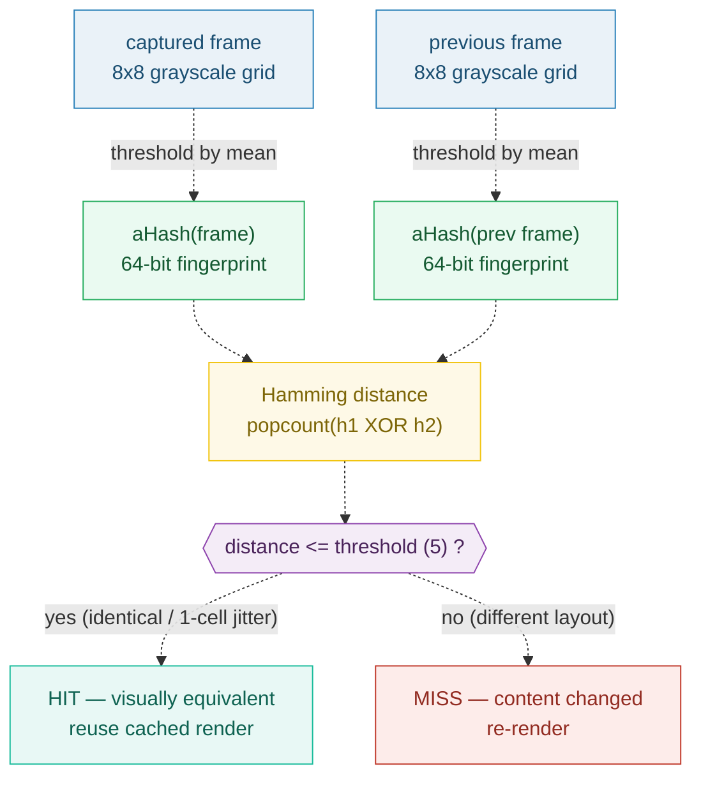

# VISUAL_DETERMINISM — same input → visually equivalent output (not byte-identical)

> **Goal:** understand the determinism contract of OpenVideoKit. Re-rendering the
> same input must produce **visually equivalent** output; minor **byte**
> differences (encoder / browser non-determinism) are explicitly allowed. Cache
> keying and "did this edit change the output?" diffs therefore use **perceptual
> hashing** (aHash + Hamming distance), not byte hashing.
>
> **Run:** `pnpm exec tsx bundles/visual_determinism.ts`
> **Prerequisites:** [UNIT_MODEL](./UNIT_MODEL.md) (the document model),
> [SLIDE_RENDERER_INTERFACE](./SLIDE_RENDERER_INTERFACE.md) (the §9.3 own-renderer
> where browser-capture non-determinism enters).
> **RFC:** §11 (Determinism), §3 Non-Goals (byte-identical), §9.3 (own-renderer),
> §18 (determinism risk row)

---

## Lineage — why this exists

A naive editor promises "the rendered MP4 is byte-for-byte identical across
re-renders." That promise is expensive and fragile: video encoders, GPU
rasterizers, and browser frame capture all carry tiny, lawful non-determinism.
Chasing byte equality would mean pinning Chromium, forcing CPU rasterization,
and preloading every asset — a cost with no editorial value.

RFC 0001 §11 makes the deliberate trade: **visual determinism, not
byte-identical**. "Same input → visually equivalent output across re-renders.
Minor byte differences (encoder/browser non-determinism) are allowed." Byte-
identical is listed as a §3 **Non-Goal** ("visual determinism suffices — see
§11") — but §11 adds the escape hatch: it **can be tightened later** (pin
Chromium, force CPU rasterization, full asset preload) **without
rearchitecting**, should CI ever need that precision.

The practical consequence: cache keying and "did this edit change the output?"
diffs cannot use a byte hash (a 1-byte encoder diff would force a cache MISS and
a wasted re-render). They use **perceptual hashing** instead. This bundle
implements the canonical recipe — **aHash** (average hash) + **Hamming distance**
— on fixed in-source 8×8 "frame" matrices and walks three cases: identical
frames, a 1-cell jitter, and genuinely different content.



## What the runnable proves

> From `visual_determinism.ts` Section A (visual ≠ byte; byte-identical is a Non-Goal):
> ```
>   RFC 0001 §11 — Determinism (verbatim):
>
>     **Visual determinism**, not byte-identical.
>     - Same input → visually equivalent output across re-renders. Minor byte
>       differences (encoder/browser non-determinism) are allowed.
>     ...
>     Byte-identical determinism is a non-goal. If it ever becomes required (e.g.,
>     for CI gate precision), it can be tightened later (pin Chromium, force CPU
>     rasterization, full asset preload) without rearchitecting.
>
>   RFC 0001 §3 Non-Goals — the byte-identical line (verbatim):
>     "Byte-identical determinism (visual determinism suffices — see §11)."
>
> [check] §11 opens with 'Visual determinism, not byte-identical': OK
> [check] §11 declares byte-identical a non-goal (tighten-able later): OK
> [check] §3 Non-Goals lists byte-identical determinism (defers to §11): OK
> ```

> From `visual_determinism.ts` Section B (where non-determinism enters):
> ```
>   RFC §11 bullet: 'FFmpeg with fixed params is near-byte-deterministic; the
>   variable part is browser capture, which only matters once we ship our own
>   renderer.'
>
>   RFC §9.3 (own-renderer, verbatim):
>     "Headless-Chromium frame capture + FFmpeg encode/mux, targeting visual determinism (§11)."
>
> [check] FFmpeg (fixed params) is the near-byte-deterministic half: OK
> [check] browser capture is the variable half — own-renderer only (§9.3): OK
> ```

> From `visual_determinism.ts` Section C (aHash recipe + the pinned Frame A values):
> ```
>     1. reduce size     -> resize to 8x8 (hash_size=8 -> 64-bit hash)
>     2. reduce color    -> convert to grayscale ('L'): one luma value 0..255 per cell
>     3. compute mean    -> avg = mean(all 64 luma values)
>     4. threshold       -> bit = 1 if pixel > avg else 0   (strictly greater than)
>
>   Frame A (vertical split: left=30, right=200)
>     mean(A)            = 115.000000  (== 115 exactly: 32*30+32*200 = 7360; /64)
>     popcount(aHash(A)) = 32  (32 above mean, 32 below — balanced)
>     hex(aHash(A))      = 0f0f0f0f0f0f0f0f
>     aHash(A) bit grid  (# = above mean, . = below mean):
>   . . . . # # # #
>   . . . . # # # #
>   ... (8 identical rows)
> [check] mean(A) === 115.000000 (clean threshold, no boundary ambiguity): OK
> [check] aHash(A) is a 64-bit hash (8x8 grid): OK
> [check] aHash is DETERMINISTIC: aHash(A) computed twice is byte-identical: OK
> ```

> From `visual_determinism.ts` Section D (Hamming distance — the pinned values):
> ```
>     hex(A)  = 0f0f0f0f0f0f0f0f
>     hex(A') = 0f0f0f0f0f0f0f0f   (byte-identical copy of A)
>     hex(B)  = 8f0f0f0f0f0f0f0f   (A with cell[0][0] flipped across the mean)
>     hex(C)  = 00000000ffffffff   (horizontal split — different content)
>
>     distance(A, A)  = 0   (same object)
>     distance(A, A') = 0   (IDENTICAL frames)
>     distance(A, B)  = 1   (1 cell changed -> SMALL)
>     distance(A, C)  = 32   (different layout -> LARGE)
> [check] IDENTICAL frames -> Hamming distance === 0: OK
> [check] 1 cell changed -> small Hamming distance (=== 1): OK
> [check] different content -> large Hamming distance (32 of 64 bits differ): OK
> ```

> From `visual_determinism.ts` Section E (the cache decision — the pinned threshold):
> ```
>     distance A vs A' (identical) =  0  ->  cache HIT
>     distance A vs B  (1 cell)    =  1  ->  cache HIT
>     distance A vs C  (different) = 32  ->  cache MISS
>
> [check] identical + 1-cell jitter -> cache HIT (distance <= 5): OK
> [check] different content -> cache MISS (distance > 5): OK
> ```

## Why / internals

### Why visual, not byte, determinism

Byte-identical video output is a **property of the whole capture+encode stack**:
the encoder's rate-control state, the rasterizer's GPU scheduling, font
hinting, and — once the own-renderer (§9.3) ships — headless-Chromium frame
capture. None of these are editorially meaningful; all of them can drift a few
bytes between runs without changing what the viewer sees. RFC §11 picks the bar
that matches the actual product need ("does the video *look* the same?") instead
of a bar that costs real performance and CI complexity to chase. The §18 risk
row lists "determinism engineering when we ship our own renderer" and mitigates
it with exactly this visual bar (with HF as a fallback behind the
`SlideRenderer` seam).

### Why perceptual hashing (aHash), not byte hashing, for cache keying

The §11 use case is concrete: *"did this edit change the output?"* The answer
must be **insensitive to lawful byte jitter** but **sensitive to real content
changes**. A cryptographic/byte hash (SHA-256, MD5) fails the first half by
design — its avalanche property means a 1-bit input diff flips ~half the output
bits, so every encoder-deterministic re-render would look "changed" and force a
wasted re-render (cache MISS).

aHash (average hash) is the opposite — a **locality-sensitive** fingerprint.
The recipe (verbatim from the canonical `imagehash` library): reduce to 8×8 →
grayscale → threshold every cell by the mean → 64 bits. Two frames that *look*
the same land on (almost) the same 64 bits; only cells whose luminance crosses
the mean flip. The **Hamming distance** between two hashes (popcount of their
XOR) then measures visual difference directly: 0 = identical, small = near-
identical, large = different. A threshold (5 here) separates "visually
equivalent → cache HIT" from "content changed → cache MISS". That threshold is
the one tuning knob; everything else is deterministic arithmetic.

### Why aHash is robust to the mean shifting (the 1-cell case)

When Frame B perturbs one cell, the mean shifts slightly (115 → 118.437500) —
yet exactly **one** bit flips. The reason is structural: the threshold tracks
the mean, so only cells that *cross* the new mean change their bit. Cells that
were far below (30) or far above (200) the mean stay on their original side
across the small shift. This is the locality-sensitive property in action: a
tiny perturbation moves the hash by a tiny amount (distance 1), never an
avalanche.

### Why "tighten later" needs no rearchitecture

§11 names three additive levers — **pin Chromium**, **force CPU
rasterization**, **full asset preload** — and promises they can be applied
"without rearchitecting." The reason is the seam: all three levers are
configuration of the **own-renderer implementation** (§9.3), which sits behind
the `SlideRenderer` interface (§9). Tightening byte-equality changes *how the
engine renders a frame*, not *what the editor or export pipeline calls*. The
document model (🔗 UNIT_MODEL), the export assembly (🔗 EXPORT_PIPELINE), and
the editor are untouched. Byte-identical is therefore a CI precision knob the
project can turn on later, not a redesign.

## 🔗 Cross-references

- 🔗 [SLIDE_RENDERER_INTERFACE](./SLIDE_RENDERER_INTERFACE.md) — the §9.3
  own-renderer (headless Chromium + FFmpeg) is exactly where browser-capture
  non-determinism enters; the visual-determinism bar is what makes it shippable.
- 🔗 [EXPORT_PIPELINE](./EXPORT_PIPELINE.md) — the `npx hyperframes render`
  output whose visual equivalence this bundle's perceptual hash caches/diffs.
- 🔗 [STAGE_CANVAS](./STAGE_CANVAS.md) — why the real-time preview can stay
  non-frame-accurate without breaking this export-time determinism contract.

## Pitfalls

| Trap | Symptom | Fix |
|---|---|---|
| Using a byte hash (SHA/MD5) for "did the output change?" | Every encoder-deterministic re-render flips ~half the hash bits → permanent cache MISS → wasted re-renders | Use a **perceptual** hash (aHash) + Hamming distance; threshold the distance (§11). |
| Confusing visual with byte determinism | Treating a lawful 1-byte encoder diff as a bug; over-constraining the render pipeline | §11: byte diffs are allowed. Byte-identical is a §3 Non-Goal, tighten-able *later* only if CI needs it. |
| `>=` instead of `>` in the aHash threshold | Cells exactly at the mean are inconsistent across libraries/rounding → hash drift | Match `imagehash`: `diff = pixels > avg` (strictly greater than). Design frames so no cell sits on the mean. |
| Comparing hashes of different sizes | `hamming()` raises (or silently miscounts) because the bit grids differ in shape | aHash always produces an 8×8 / 64-bit grid; assert equal length before differ-counting. |
| 64-bit hex via `parseInt(bits, 2).toString(16)` | Silent precision loss above 2^53 corrupts the last hex bytes | Build hex **nibble-by-nibble** (4 bits → 1 hex char); never route 64 bits through a float. |
| Expecting browser-capture determinism today | Engineering pin-Chromium/CPU-raster levers prematurely | That variable only matters once the own-renderer (§9.3) ships; today HF's pipeline is the surface. |
| Picking a threshold without measuring | HIT/MISS boundary wrong → either stale caches or thrashing re-renders | Tune the threshold against real frame pairs; 5 is this bundle's teaching value, not a product decree. |

## Cheat sheet

```
determinism   = VISUAL equivalence across re-renders (RFC §11); byte-identical is a §3 Non-Goal
non-determinism enters = browser capture (own-renderer only, §9.3); FFmpeg fixed-params ≈ stable
cache keying  = perceptual hash, NOT byte hash (§11)
aHash         = resize 8x8 -> grayscale -> bit = (pixel > mean) -> 64-bit fingerprint
Hamming dist  = popcount(h1 XOR h2); identical -> 0; 1-cell jitter -> 1; different layout -> 32
cache decision= distance <= threshold(5) -> HIT (reuse); > threshold -> MISS (re-render)
tighten later = pin Chromium + CPU raster + full preload — NO rearchitecture (§9 seam unchanged)
```

## Sources

- RFC 0001 §11 (Determinism), §3 (Non-Goals — byte-identical), §9.3 (own-renderer),
  §18 (determinism risk row): `docs/rfc-0001.md` (in-repo)
- Wikipedia — Hamming distance ("number of positions at which the corresponding
  symbols are different"; for binary strings, popcount of XOR; identical → 0):
  https://en.wikipedia.org/wiki/Hamming_distance
- JohannesBuchner/imagehash — `average_hash` (the verbatim aHash recipe:
  `convert("L").resize((8,8))` → `mean` → `pixels > avg`) and `__sub__`
  (`count_nonzero(h1 != h2)` = Hamming distance):
  https://github.com/JohannesBuchner/imagehash
- Wikipedia — Perceptual hashing (a perceptual hash is "locality-sensitive …
  analogous if features of the multimedia are similar," contrasting with
  cryptographic hashing's avalanche effect):
  https://en.wikipedia.org/wiki/Perceptual_hashing
