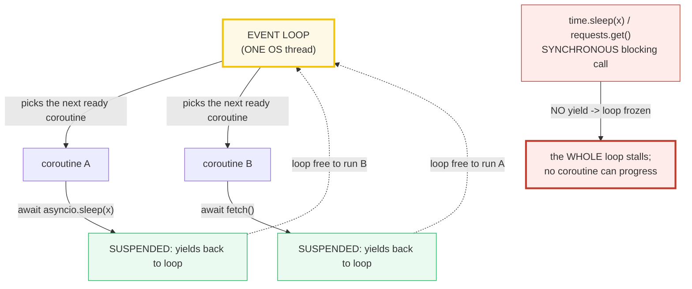
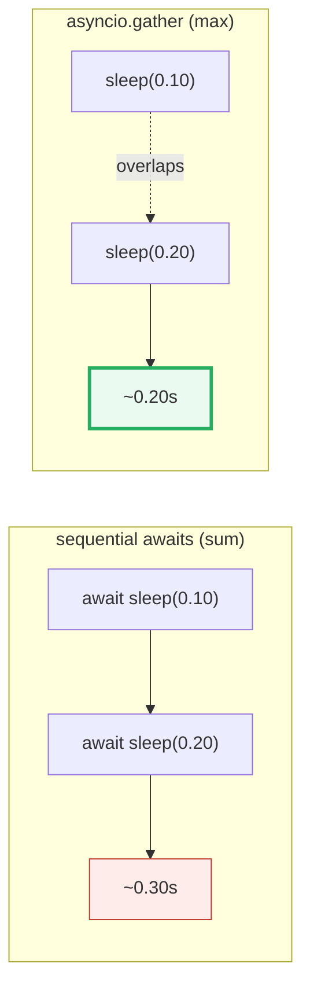
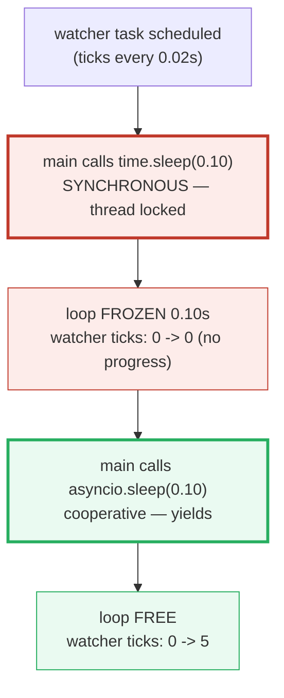

# Asyncio Basics — Single-Threaded Cooperative Concurrency

> **The one rule:** `asyncio` is **concurrency without parallelism**. One OS
> thread runs an **event loop** that switches between **coroutines** *only* when
> they `await`. The win is overlapping **I/O waits** (network, disk, timers) —
> not CPU work. A single blocking call (`time.sleep`, `requests.get`) freezes
> the *entire* loop, because there is no other thread to keep it moving.

**Companion code:** [`asyncio_basics.py`](./asyncio_basics.py).
**Every value and ordering below is printed by `uv run python
asyncio_basics.py`** — change the code, re-run, re-paste. Nothing here is
hand-computed. Captured stdout lives in
[`asyncio_basics_output.txt`](./asyncio_basics_output.txt).

**Goal of this bundle (lineage, old → new):**

> from *"threads let things run at the same time"*
> → *"`async`/`await` is cooperative: `await` yields control to an event loop
> > that interleaves I/O. It's concurrency, NOT parallelism — one thread, and a
> > blocking call freezes everything."*

🔗 Contrast directly with [`THREADING_GIL`](./THREADING_GIL.md) (Phase 3 #19):
threads are *pre-emptive* and OS-scheduled (but GIL-bound for CPU); asyncio is
*cooperative* and switch-on-`await` (single thread, so the GIL is **irrelevant**
here). For real CPU parallelism see [`MULTIPROCESSING`](./MULTIPROCESSING.md)
(Phase 3 #20). `async with` (used by `asyncio.Lock` below) is dissected in
[`CONTEXT_MANAGERS`](./CONTEXT_MANAGERS.md) (Phase 3 #22). The whole async
stack underlies [`FASTAPI`](./FASTAPI.md) (Phase 7) and MCP transports
(Phase 8).

---

## 0. The one picture



| Question | Answer |
|---|---|
| Does asyncio use more than one thread? | **No** — one thread runs the loop. (The GIL is a non-issue here.) |
| When does a coroutine give up control? | **Only at an `await`** that actually suspends (e.g. `asyncio.sleep`, async I/O). |
| Is it parallelism? | **No** — only one coroutine executes Python *at a time*. It's *concurrency* via interleaved waits. |
| What does it buy you? | Overlapping **I/O wait** time across many connections (HTTP, DB, sockets). |
| What kills it? | A **blocking** call (`time.sleep`, `requests.get`, heavy CPU) — it freezes every coroutine. |

---

## 1. Coroutine object + `asyncio.run` — calling `f()` does NOT run it

An `async def` function is a **coroutine function**. Calling it does **not**
execute the body — it returns a **coroutine object** (an *awaitable*), whose
repr looks like `<coroutine object f at 0x...>`. To actually run it you drive
it with `asyncio.run(coro)`, which creates an event loop, schedules the
coroutine, and blocks until it completes. (Native `async`/`await` syntax was
introduced by [PEP 492](https://peps.python.org/pep-0492/) in Python 3.5,
replacing the older generator-based `@asyncio.coroutine` / `yield from`.)

> From `asyncio_basics.py` Section A:
> ```
> ======================================================================
> SECTION A — Coroutine object + asyncio.run: calling f() does NOT run it
> ======================================================================
> An `async def` function is a COROUTINE FUNCTION. Calling it returns
> a COROUTINE OBJECT (repr '<coroutine object f at 0x...>'); the body
> does NOT run yet. The object is an awaitable. asyncio.run(coro)
> creates an event loop, schedules the coroutine, drives it to done.
> 
> type(coro).__name__                 -> coroutine
> asyncio.iscoroutine(coro)           -> True
> asyncio.iscoroutinefunction(greet)  -> True
> 
> [check] type(coro).__name__ == 'coroutine': OK
> [check] asyncio.iscoroutine(coro) is True: OK
> [check] greet is a coroutine function (iscoroutinefunction): OK
> 
> asyncio.run(coro) -> 'hello from coroutine'
> [check] asyncio.run returned the coroutine's value: OK
> ```

### Why calling `f()` doesn't run it (internals)

A coroutine function compiles to a code object flagged `CO_COROUTINE`; calling
it builds a **frame** and wraps it in a `coroutine` object — but never enters
the frame. The frame only advances when something *drives* it: `await`
(delegation), `asyncio.run` (a fresh loop), or `Task` scheduling. That is why a
bare `greet()` in a sync context emits `RuntimeWarning: coroutine 'greet' was
never awaited` — the object is created, never driven, then garbage-collected.
`asyncio.iscoroutine(x)` / `inspect.iscoroutine(x)` detect these objects;
`asyncio.iscoroutinefunction(f)` detects the *function*.

---

## 2. `await` yields control — interleaved execution on one thread

`await asyncio.sleep(0)` is the smallest possible yield: it suspends the
current coroutine and lets the loop run whatever else is ready. Two coroutines
that each `await` therefore **interleave** — strict proof that `await` is a real
control transfer, not a no-op. Critically this all happens on **one thread**:
only one coroutine is *executing Python* at any instant, the loop just rotates
which one.

> From `asyncio_basics.py` Section B:
> ```
> ======================================================================
> SECTION B — await yields control to the loop (interleaved execution)
> ======================================================================
> Inside one coroutine, `await asyncio.sleep(0)` SUSPENDS it and hands
> control back to the event loop, which runs OTHER ready coroutines.
> Two coroutines that each await therefore INTERLEAVE — proof that
> await is a real yield, not a no-op (all on ONE thread).
> 
> execution log = ['A:1', 'B:1', 'A:2', 'B:2', 'A:3', 'B:3']
> (A and B alternate at every await point — single thread, interleaved)
> 
> [check] log[0] == 'A:1' (A was scheduled first): OK
> [check] log[1] == 'B:1' (B ran while A was suspended): OK
> [check] A and B interleaved (never A:1,A:2,A:3,B:1,...): OK
> ```

### Why `await` only yields *sometimes* (the subtlety)

`await expr` delegates to `expr`: it does **not** automatically return to the
loop. The loop only gets control when the awaited object *itself* suspends —
`asyncio.sleep`, an unfinished `Task`, a `Future`, async I/O. `await
some_done_future` returns immediately without yielding; `await
asyncio.sleep(0)` always yields (the [docs](https://docs.python.org/3/library/asyncio-task.html#asyncio.sleep)
call out `delay=0` as an explicit "let other tasks run" path). The trace above
is deterministic because `gather` schedules A before B, and each `sleep(0)`
re-queues the current coroutine at the back of the ready queue — so the two
strictly alternate. The [Task docs](https://docs.python.org/3/library/asyncio-task.html#asyncio.Task)
state the model plainly: *"Event loops use cooperative scheduling: an event
loop runs one Task at a time. While a Task awaits for the completion of a
Future, the event loop runs other Tasks, callbacks, or performs IO operations."*

---

## 3. `asyncio.gather` — concurrent waits take `~max`, not `~sum`

`await asyncio.gather(*aws)` schedules every awaitable **concurrently** on the
single loop and returns their results **in submission order**. Two sleeps of
`0.10s` and `0.20s` therefore finish in `~max = 0.20s`, because the loop runs
both waits at once — *not* `~sum = 0.30s`, which is what two **sequential**
`await`s would cost.



> From `asyncio_basics.py` Section C:
> ```
> ======================================================================
> SECTION C — asyncio.gather: concurrent waits take ~max, NOT ~sum
> ======================================================================
> gather(*aws) schedules every awaitable CONCURRENTLY on the one loop.
> Two sleeps of 0.10s and 0.20s overlap: total ~= max (0.20s), not
> ~= sum (0.30s). Awaiting them SEQUENTIALLY (one await, then the
> other) WOULD sum. (Exact ms vary; the ORDERING facts below hold.)
> 
> concurrent gather  -> ['x@0.10s', 'y@0.20s'] in 0.202s
> sequential awaits  -> ['x@0.10s', 'y@0.20s'] in 0.304s
> sum of durations = 0.30s  |  max of durations = 0.20s
> 
> [check] gather returned both results in submission order: OK
> [check] concurrent elapsed < sum (0.30s) — the waits overlapped: OK
> [check] concurrent elapsed < sequential elapsed (overlap beat serial): OK
> [check] sequential elapsed ~= sum (>= 0.28s, no overlap): OK
> ```

> **Reproducibility note:** the millisecond figures (`0.202s`, `0.304s`) drift
> slightly machine-to-machine; the **invariants** — concurrent `<` sum,
> concurrent `<` sequential, results in submission order — always hold.

### Why gather is "concurrent" not "parallel" (internals)

Per the [gather docs](https://docs.python.org/3/library/asyncio-task.html#asyncio.gather),
if any awaitable in `aws` is a coroutine it is **automatically wrapped in a
Task** and scheduled. All those Tasks share the one loop thread, so no two of
them execute a Python instruction at the *same* instant — but their **waits**
overlap. The 0.20s result above is the proof: the loop started both sleeps,
suspended on the longer one, and the shorter one completed *during* that wait.
That is the entire performance model of asyncio: turn a sum of I/O latencies
into a max. (For structured-concurrency with automatic cancellation on error,
prefer [`asyncio.TaskGroup`](https://docs.python.org/3/library/asyncio-task.html#asyncio.TaskGroup),
added in 3.11.)

---

## 4. `asyncio.create_task` — schedule once, overlap, await later

`asyncio.create_task(coro)` wraps a coroutine in a `Task` and schedules it to
run **soon** — *without* awaiting — so it overlaps the code that created it.
By the time you `await task`, it may already be done; `await` then returns
instantly. This is the standard way to fan out concurrent work inside a
coroutine (versus a bare `await coro`, which runs it **inline** and blocks the
caller until it finishes).

> From `asyncio_basics.py` Section D:
> ```
> ======================================================================
> SECTION D — asyncio.create_task: schedule once, overlap, await later
> ======================================================================
> create_task(coro) wraps a coroutine in a Task and schedules it to run
> SOON on the loop — WITHOUT awaiting. It runs CONCURRENTLY with the
> code that created it, so a long background task overlaps your other
> work and may already be DONE by the time you await it.
> 
>   main:created task
>   background:done
>   main:task.done()=True
>   main:joined
> 
> [check] background finished BEFORE main joined it (true overlap): OK
> [check] task.done() was True before the final await (it already completed): OK
> ```

### Why you must keep a reference to the Task (gotcha)

The [create_task docs](https://docs.python.org/3/library/asyncio-task.html#asyncio.create_task)
warn: *"Save a reference to the result of this function, to avoid a task
disappearing mid-execution. The event loop only keeps weak references to
tasks."* A fire-and-forget `asyncio.create_task(coro)` with no variable holding
the result can be **garbage-collected before it finishes**, silently dropping
the work (and any exception). The idiomatic fix is to store tasks in a `set`
and discard them via `task.add_done_callback(s.discard)`. Also: `create_task`
requires a running loop — call it from inside `async def`, not from sync code.

---

## 5. THE trap — a blocking call freezes the WHOLE loop

This is the single most important asyncio gotcha. `asyncio.sleep(x)` is
**cooperative**: it suspends the coroutine and the loop is free to run others.
`time.sleep(x)` (or `requests.get`, `socket.recv`, any heavy CPU loop) is a
plain **synchronous** block — it hog-ties the one OS thread, so the event loop
**cannot schedule anything else** for the entire duration. The demo proves it:
a background watcher ticking every 0.02s makes **zero** progress during a
`time.sleep(0.10)`, then resumes the instant the loop is freed by
`asyncio.sleep`.



> From `asyncio_basics.py` Section E:
> ```
> ======================================================================
> SECTION E — THE TRAP: a blocking call (time.sleep) freezes the WHOLE loop
> ======================================================================
> asyncio.sleep() SUSPENDS the coroutine (cooperative — the loop is
> free to run others). time.sleep() is a plain SYNCHRONOUS block: the
> entire thread — and thus the whole event loop — STALLS. Other tasks
> cannot make ANY progress while it runs.
> 
> watcher ticks before time.sleep(0.10)   : 0
> watcher ticks AFTER  time.sleep(0.10)   : 0   <- NO progress
> watcher ticks AFTER  asyncio.sleep(0.10): 5   <- resumes
> 
> [check] time.sleep froze the loop (watcher made NO progress during it): OK
> [check] asyncio.sleep did NOT freeze (watcher progressed after it): OK
> ```

### Why blocking is catastrophic (internals) & the fix

The loop is a `while True:` that pops the next ready callback and runs it. A
blocking call is just a callback that **doesn't return** for N seconds, so the
`while` body can't advance — every other coroutine, timer, and socket stall
behind it. The fix is never to call blocking code in an async function. Use the
**async equivalent** (`asyncio.sleep`, `httpx.AsyncClient`, `aiofiles`); or
offload genuinely blocking work to a thread with
[`asyncio.to_thread(func, ...)`](https://docs.python.org/3/library/asyncio-task.html#asyncio.to_thread),
which runs `func` in a `ThreadPoolExecutor` and returns an awaitable. (Because
of the GIL, `to_thread` helps for **I/O-bound** blocking, not CPU-bound — for
that you need a `ProcessPoolExecutor`.)

---

## 6. Primitives — `wait_for`, `as_completed`, `Queue`, `Lock`

Four workhorses you reach for constantly:

- **`asyncio.wait_for(aw, timeout)`** — await `aw` but cancel it (raising
  `TimeoutError`) if it exceeds `timeout` seconds.
- **`asyncio.as_completed(aws)`** — yields results in **completion** order (not
  submission order), as each awaitable finishes.
- **`asyncio.Queue`** — `await q.put(x)` / `await q.get()`; the async analogue
  of `queue.Queue`, for producer/consumer patterns across coroutines.
- **`asyncio.Lock`** — `async with lock:` serializes a critical section across
  coroutines. Even on one thread, an `await` *inside* a section would otherwise
  let another coroutine interleave and corrupt shared state.

> From `asyncio_basics.py` Section F:
> ```
> ======================================================================
> SECTION F — Primitives: wait_for (timeout), as_completed, Queue, Lock
> ======================================================================
> Four workhorses. wait_for(aw, t) cancels + raises TimeoutError at t.
> as_completed(aws) yields results in COMPLETION order. Queue and Lock
> are the async analogues of queue.Queue / threading.Lock.
> 
> wait_for(sleep(1.0), timeout=0.05) -> TimeoutError after 0.052s
> [check] wait_for raised TimeoutError near 0.05s (cancelled, not 1.0s): OK
> as_completed(slow@0.10, fast@0.02) -> ['fast', 'slow']
> [check] as_completed yields 'fast' before 'slow' (completion order, not input): OK
> asyncio.Queue producer/consumer -> [0, 1, 2]
> [check] Queue handed off 0,1,2 via async put/get: OK
> Lock-protected critical sections -> ['X:in', 'X:out', 'Y:in', 'Y:out']
> [check] Lock kept each section atomic (no interleave): OK
> ```

> **Reproducibility note:** the `0.052s` wait_for figure drifts slightly; the
> invariant is that it lands near `0.05s`, nowhere near the uncapped `1.0s`.

### Why even single-threaded code needs a `Lock` (the subtle bit)

People assume "one thread → no races → no locks needed." That's true for code
with **no `await`** in the critical section (it runs atomically). But the moment
you `await` between reading and writing shared state, the loop can switch to
another coroutine that touches the same state — a classic check-then-act race.
`async with lock:` ensures no other lock-holding coroutine runs *its* section
until yours exits. The same reasoning applies to `asyncio.Event`, `Condition`,
and `Semaphore`. 🔗 The `async with` protocol (`__aenter__`/`__aexit__`) is
covered in [`CONTEXT_MANAGERS`](./CONTEXT_MANAGERS.md) (Phase 3 #22).

---

## 7. When to use asyncio vs threads vs multiprocessing

asyncio overlaps **I/O waits** on one thread — it does **not** parallelize CPU.
The proof is runnable: a coroutine doing pure CPU (`sum(range(1_000_000))`,
no `await`) runs to completion and **blocks** every other coroutine until it
returns, because it never yields. So pick the model by the *bottleneck*.

> From `asyncio_basics.py` Section G:
> ```
> ======================================================================
> SECTION G — When to use asyncio vs threads vs multiprocessing
> ======================================================================
> asyncio overlaps I/O WAITS on ONE thread. It does NOT parallelize
> CPU. Proof: a coroutine doing pure CPU (no await) runs to completion
> and BLOCKS every other coroutine until it returns.
> 
>   gather(cpu_hog, io_waiter) -> ['cpu done: 499999500000', 'io:ran']
>   (cpu_hog finished ENTIRELY before io_waiter got a single tick)
> 
> [check] CPU coroutine with no await blocked the loop (ran first, fully): OK
> workload                        best fit          why
> ------------------------------------------------------------------------
> many slow I/O connections       asyncio           one thread overlaps waits
> quick blocking I/O / sync libs  threads           easy wrap, GIL-OK for I/O
> CPU-bound (math, hashing)       multiprocessing   real parallel cores
> mix of CPU + I/O                procs + asyncio   per-core event loop
> 
> [check] asyncio fits MANY slow I/O connections (not CPU work): OK
> [check] multiprocessing fits CPU-bound work (real parallel cores): OK
> ```

🔗 **Threads vs asyncio:** [`THREADING_GIL`](./THREADING_GIL.md) (Phase 3 #19)
covers the pre-emptive, GIL-bound thread model — better for wrapping existing
*synchronous* blocking libraries, worse than asyncio at scaling to thousands of
simultaneous I/O connections (thread-per-connection is expensive). 🔗
**Processes:** [`MULTIPROCESSING`](./MULTIPROCESSING.md) (Phase 3 #20) is the
only one of the three that gives *real* CPU parallelism, by spawning separate
interpreters that each hold their own GIL. The `499999500000` above — the sum
of `0..999999` — is just `1_000_000 * 999_999 / 2`, computed live to prove the
CPU coroutine never yielded.

---

## Pitfalls

| Trap | Example | The fix |
|---|---|---|
| Calling a blocking fn inside `async def` | `time.sleep(1)` / `requests.get()` freezes the whole loop for 1s | use the async lib (`asyncio.sleep`, `httpx.AsyncClient`); or `await asyncio.to_thread(fn)` |
| Calling a coroutine without awaiting | `greet()` returns a coroutine object, body never runs, `RuntimeWarning` | `await greet()` or `asyncio.create_task(greet())`; drive with `asyncio.run` at the top |
| `asyncio.create_task` with no reference held | task GC'd mid-flight, work silently dropped | keep a ref (`tasks.add(t); t.add_done_callback(tasks.discard)`) |
| Assuming `await` always yields to the loop | `await finished_future` returns immediately — no yield | only awaits that *suspend* (sleep, pending I/O, unfinished Task) yield |
| Treating asyncio as CPU parallelism | a CPU loop in a coroutine blocks every other coroutine (proven in §7) | move CPU work to a `ProcessPoolExecutor` via `loop.run_in_executor` |
| Forgetting a `Lock` around a section that `await`s | read-modify-write across an `await` interleaves and corrupts state | `async with lock:` even on one thread (§6) |
| Mixing sync and async sinks | `print` is fine, but `logging` to a slow handler, or sync file writes, stalls the loop | use async-aware libraries (`aiofiles`, `aiologger`) or `to_thread` |
| Calling `asyncio.run` twice / nesting loops | `RuntimeError: asyncio.run() cannot be called from a running event loop` | one `asyncio.run` at the top; inside, use `await`, `create_task`, `TaskGroup` |
| Catching `TimeoutError` too broadly | `asyncio.TimeoutError` was folded into builtin `TimeoutError` in 3.11 | catch `TimeoutError` (works 3.11+); `asyncio.wait_for`/`asyncio.timeout` raise it |
| Letting exceptions escape a `Task` | "Task exception was never retrieved" warning, swallowed error | `await task` (surfaces it) or `task.add_done_callback`; prefer `TaskGroup` |

---

## Cheat sheet

- **Coroutine function vs object:** `async def f` is the *function*; `f()` is a
  *coroutine object* (an awaitable) — calling it does NOT run the body. Drive
  with `asyncio.run(coro)` (top level) or `await coro` (inside async).
- **await = yield (sometimes):** `await` delegates to the awaited object; the
  loop only regains control when that object *suspends* (`asyncio.sleep`, async
  I/O, an unfinished Task/Future). `asyncio.sleep(0)` always yields.
- **One thread:** the event loop runs a single OS thread; only one coroutine
  executes Python at a time. The GIL is irrelevant. It's *concurrency*, not
  *parallelism*.
- **`asyncio.gather(*aws)`:** schedules all awaitables concurrently; returns
  results in **submission order**; total wait ≈ `max`, not `sum`. (3.11+:
  `asyncio.TaskGroup` for structured concurrency + auto-cancellation.)
- **`asyncio.create_task(coro)`:** schedules a coroutine to run soon without
  awaiting; keep a reference or it may be GC'd. Requires a running loop.
- **The blocking-call trap:** `time.sleep` / `requests.get` / CPU loops freeze
  the whole loop. Use async libs or `await asyncio.to_thread(fn, *args)`.
- **Primitives:** `wait_for(aw, t)` → `TimeoutError`; `as_completed(aws)` →
  completion order; `Queue` (async put/get); `Lock`/`Event`/`Semaphore` —
  needed whenever a critical section contains an `await`.
- **Pick by bottleneck:** many slow I/O → asyncio; quick blocking I/O / sync
  libs → threads; CPU-bound → multiprocessing; mixed → processes + per-core
  asyncio.

---

## Sources

- **Python docs — `asyncio`: Coroutines and Tasks.**
  https://docs.python.org/3/library/asyncio-task.html
  *The authoritative reference for coroutines, `asyncio.run`, `create_task`,
  `gather`, `sleep`, `wait_for`, `as_completed`, `to_thread`, and the Task
  object. Quoted/paraphrased throughout (§1–§6): "simply calling a coroutine
  will not schedule it"; "Event loops use cooperative scheduling: an event loop
  runs one Task at a time"; "sleep() always suspends the current task, allowing
  other tasks to run"; "Save a reference to the result of [create_task]".*
- **Python docs — `asyncio` module index & synchronization primitives.**
  https://docs.python.org/3/library/asyncio.html
  https://docs.python.org/3/library/asyncio-sync.html
  *Overview of the event-loop / coroutine model; `asyncio.Queue`, `Lock`,
  `Event`, `Semaphore` (§6).*
- **Python docs — asyncio Developer Guide (blocking calls).**
  https://docs.python.org/3/library/asyncio-dev.html#asyncio-blocking
  *"Long-running CPU-bound functions will block the event loop … if any
  function call takes a long time to complete, the event loop will not be able
  to run other tasks during that time." Basis for §5 and §7.*
- **PEP 492 — Coroutines with async and await syntax (Selivanov, 2015).**
  https://peps.python.org/pep-0492/
  *Introduced `async def` / `await` (3.5), replacing generator-based
  `@asyncio.coroutine` + `yield from`. Defines native coroutines as a distinct
  concept from generators. Referenced in §1.*
- **Stack Overflow — "How asyncio.sleep isn't blocking thread?"**
  https://stackoverflow.com/questions/62493718/how-asyncio-sleep-isnt-blocking-thread
  *Independent confirmation that `time.sleep` inside a coroutine "blocks the
  main thread, therefore freezing the event loop" — the §5 trap.*
- **Mergify — "Detecting Blocking Tasks in Asyncio."**
  https://mergify.com/blog/detecting-blocking-tasks-in-asyncio-by-measuring-event-loop-latency
  *Corroborates that "one blocking call can freeze your entire app" and
  describes the watchdog/loop-latency technique for catching it in production.*
- **Rob Nagler — "Python Coroutines: Words of Advice."**
  https://www.robnagler.com/2025/03/01/Coroutines.html
  *Independent restatement: "Coroutines do not run in parallel. They execute in
  a single Python thread … controlled by the asyncio event loop." Supports the
  §0/§2 concurrency-vs-parallelism distinction.*
