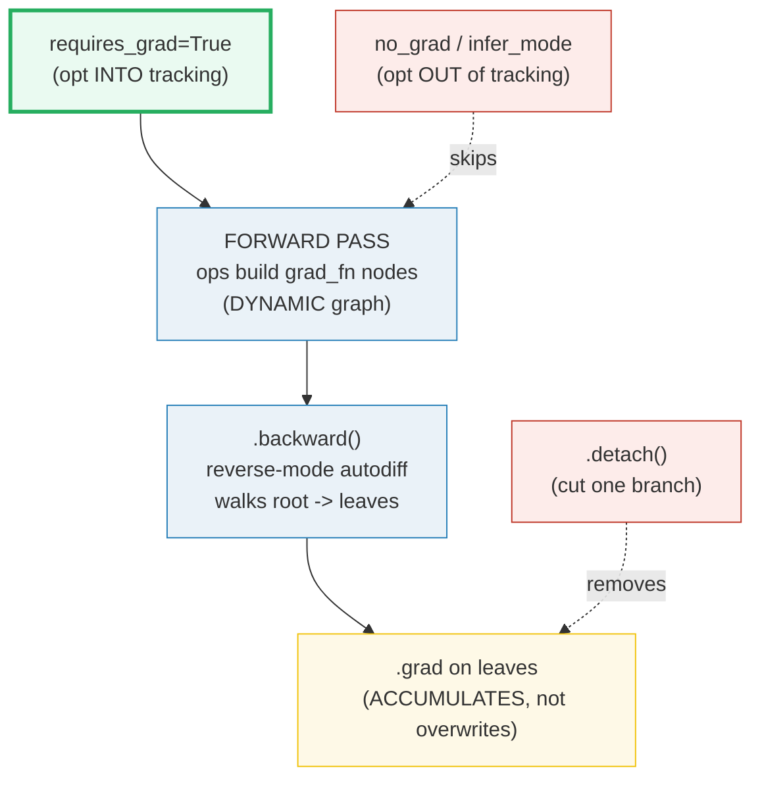
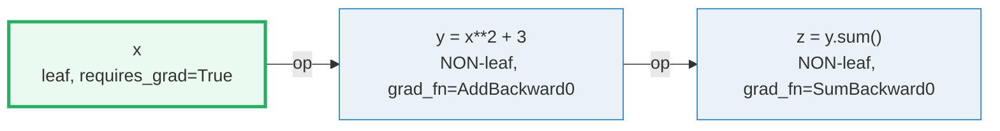
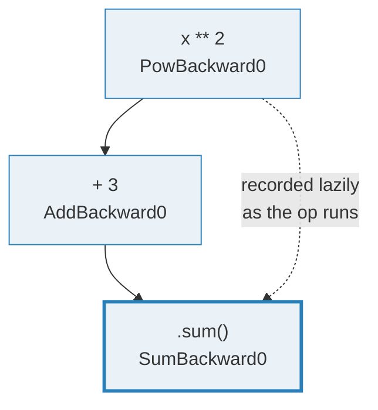

# Autograd — The Dynamic Computation Graph & Reverse-Mode Autodiff

> **The one rule:** PyTorch does not "know" your model ahead of time. As you run
> ops on tensors marked `requires_grad=True`, autograd **records a dynamic
> computation graph** (`grad_fn` nodes). Calling `.backward()` walks that graph
> **in reverse**, applying the chain rule to fill `.grad` on the leaves. Master
> the four tools — `requires_grad`, `no_grad`/`inference_mode`, `detach`, and
> the **grad-accumulation** rule — and you understand every training loop.

**Companion code:** [`autograd.py`](./autograd.py).
**Every number and table below is printed by `uv run python autograd.py`** —
change the code, re-run, re-paste. Nothing here is hand-computed. Captured
stdout lives in [`autograd_output.txt`](./autograd_output.txt).

**Goal of this bundle (lineage, old → new):**

> from *"PyTorch computes gradients for me"*
> → *"autograd builds a DYNAMIC computation graph as you go and runs
> reverse-mode autodiff on `.backward()`; I know about grad accumulation,
> `no_grad`, `detach`, and the leaf rules."*

🔗 This is the **autograd** entry point of Phase 5. It assumes you know what a
tensor is ([`TENSORS`](./TENSORS.md), P5 #29) and is the prerequisite for
[`NN_MODULE`](./NN_MODULE.md) (P5 #31 — `nn.Parameter` sets
`requires_grad=True`) and [`TRAINING_LOOP`](./TRAINING_LOOP.md) (P5 #33 —
`optimizer.zero_grad()` exists *because* of §4 below). See
[`TODO.md`](./TODO.md) for the full plan.

---

## 0. The five ideas on one page



| Tool / concept | One-liner | When you reach for it |
|---|---|---|
| `requires_grad=True` | "please track ops on **this** tensor" | defining learnable params |
| `grad_fn` | the backward node an op attaches | inspecting the graph |
| `.backward()` | walk the graph root→leaves, fill `.grad` | end of a training step |
| `.grad` **accumulates** | each `backward()` **adds**; you must `zero_grad()` | every optimizer step |
| `torch.no_grad()` / `inference_mode()` | disable tracking for a block | inference / model eval |
| `.detach()` | return a tensor with **no** `grad_fn` | stop gradient flow |
| leaf vs non-leaf | only **leaves** get `.grad` by default | debugging "why is `.grad` None?" |

---

## 1. `requires_grad` and the leaf / non-leaf rule

`requires_grad` is a per-tensor flag (default `False` unless the tensor is an
`nn.Parameter`). Set it `True` on the tensors you want autograd to track. A
tensor is a **leaf** if it was created *directly* by you (no `grad_fn`) — or if
its `requires_grad` is `False`. Leaves are the only place `.grad` accumulates
(see §8). Tensors produced by ops (`y = x ** 2`) are **non-leaves**: they carry
a `grad_fn` and propagate `requires_grad=True` downstream.



> From `autograd.py` Section A:
> ```
> ======================================================================
> SECTION A — requires_grad and the leaf/non-leaf rule
> ======================================================================
> requires_grad=True tells autograd to track ops on this tensor. A
> tensor is a LEAF if it was created directly by the user (no grad_fn)
> or has requires_grad=False. Leaves are where .grad accumulates.
> 
> expression                                value
> ----------------------------------------------------------------------
> x = torch.tensor([1,2,3], requires_grad=True)
>   x.requires_grad                         True
>   x.is_leaf                               True
>   x.grad_fn                               None
>   x.grad (before backward)                None
> c = torch.tensor([4,5]) (default)         
>   c.requires_grad                         False
>   c.is_leaf                               True
> 
> [check] x.requires_grad is True: OK
> [check] x.is_leaf is True (created directly, requires grad): OK
> [check] x.grad_fn is None (leaves have no creator): OK
> [check] x.grad is None before any backward(): OK
> [check] c.requires_grad is False by default: OK
> [check] c.is_leaf is True (requires_grad=False -> always leaf): OK
> ```

### Why `is_leaf` matters (internals)

Autograd only accumulates gradients into **leaf** `.grad` fields. The reason is
the *direction* of reverse-mode AD: it computes `∂L/∂(leaf)` for every leaf,
using the intermediates' local Jacobians as stepping stones and then *throwing
them away* (unless `retain_grad()` is called — §8). A non-leaf's `.grad` would
be overwritten on every backward and is usually not what you want, so PyTorch
leaves it `None`. The formal definition from the
[docs](https://docs.pytorch.org/docs/stable/notes/autograd.html#setting-requires-grad):
tensors with `requires_grad=False` are always leaves; tensors with
`requires_grad=True` are leaves **iff** they have no `grad_fn` (i.e. they were
created by the user, not by an op).

🔗 [`NN_MODULE`](./NN_MODULE.md) — `nn.Parameter` is just a tensor with
`requires_grad=True` registered on a module, so the optimizer can find it.

---

## 2. A forward pass builds the dynamic graph (`grad_fn` nodes)



Each op applied to a tensor that `requires_grad` attaches a **`grad_fn`**: a
`Function` object that knows how to *differentiate* that op. `y.grad_fn` is
`AddBackward0`, `z.grad_fn` is `SumBackward0` — the name encodes the op. The
graph is **dynamic**: it is *rebuilt from scratch every iteration*, which is why
arbitrary Python control flow (`if`, `while`, variable-length loops) "just
works" — *what you run is what you differentiate*. This is the defining
contrast with TensorFlow 1's static graphs.

> From `autograd.py` Section B:
> ```
> ======================================================================
> SECTION B — forward pass builds the dynamic graph (grad_fn nodes)
> ======================================================================
> Each op on a tensor that requires grad attaches a grad_fn: the
> backward node that knows how to differentiate that op. The graph is
> DYNAMIC — rebuilt every iteration, so Python control flow is fair
> game (unlike static TF1 graphs).
> 
> expression                  grad_fn         is_leaf   requires_grad
> --------------------------------------------------------------------
> x                           None            True      True
> y = x**2 + 3                AddBackward0    False     True
> z = y.sum()                 SumBackward0    False     True
> 
> [check] z.grad_fn is not None (graph node exists): OK
> [check] y.grad_fn is not None (AddBackward0 names the op): OK
> [check] y.is_leaf is False (y was produced by an op): OK
> [check] y.requires_grad is True (propagated from x): OK
> ```

### Why the graph is built lazily (internals)

Autograd is a **reverse automatic differentiation system**. From the
[mechanics note](https://docs.pytorch.org/docs/stable/notes/autograd.html#how-autograd-encodes-the-history):
"autograd records a graph recording all of the operations that created the data
*as you execute operations*, giving you a directed acyclic graph whose leaves
are the input tensors and roots are the output tensors." During the forward
pass PyTorch **simultaneously** computes the result *and* builds the backward
graph (the `.grad_fn` chain). The graph is then *freed* by default after
`backward()` (use `retain_graph=True` to keep it — §4). Some ops must save
intermediate tensors (e.g. `x ↦ x²` saves `x`); you can inspect them via the
`_saved_*` attributes on the `grad_fn`.

---

## 3. `backward()` computes grads — reverse-mode autodiff

`.backward()` seeds a gradient of `1` at the root and walks the graph **root →
leaves**, multiplying by each node's local Jacobian (the chain rule). For
`y = x²`, `dy/dx = 2x`; summing the elements (`z = y.sum()`) leaves
`dz/dxᵢ = 2xᵢ` — exactly what lands in `x.grad`.

```mermaid
graph RL
    z["z<br/>grad seed = 1"] -->|d(sum)/dy = 1| y
    y -->|d(x²+3)/dx = 2x| x["x.grad = 2x"]
    style z fill:#eaf2f8,stroke:#2980b9
    style x fill:#eafaf1,stroke:#27ae60,stroke-width:3px
```

> From `autograd.py` Section C:
> ```
> ======================================================================
> SECTION C — backward() computes grads (reverse-mode autodiff)
> ======================================================================
> .backward() walks the graph from the root (z) back to the leaves,
> applying the chain rule. For y = x**2 the analytical derivative is
> dy/dx = 2x; summing leaves dz/dx = 2x elementwise.
> 
> z        = 23   (1+3)+(4+3)+(9+3) = 4+7+12 = 23
> x.grad   = [2.0, 4.0, 6.0]
> 2 * x    = [2.0, 4.0, 6.0]   (the analytical derivative)
> 
> [check] x.grad equals the analytical derivative 2*x (y=x^2 -> dy/dx=2x): OK
> [check] z.item() == 23: OK
> ```

### Why reverse-mode, not forward-mode (internals)

Reverse-mode AD computes **all** `∂L/∂(input)` for a scalar `L` in a single
backward sweep — cost `O(graph size)`, independent of how many inputs there
are. That is exactly the shape of neural-network training (millions of
parameters, **one** scalar loss), which is why every deep-learning framework
defaults to reverse-mode. Forward-mode (which PyTorch also offers, in beta)
would be `O(#inputs)` per pass — cheap for one input, ruinous for a million
parameters. `.backward()` on a **non-scalar** tensor requires you to pass a
`gradient=` vector (the "seed") because the chain rule needs a scalar root;
`.sum()` collapses to a scalar so the default seed of `1` works.

---

## 4. Gradient **accumulation** — `backward()` adds, you must `zero_grad()`

`.grad` is **accumulated, not overwritten**. Calling `backward()` twice on the
same graph doubles `.grad`. This is by design — it lets you aggregate gradients
across multiple micro-batches — but it is also the #1 reason your optimizer
**must** call `zero_grad()` (or set `param.grad = None`) before each step.
Forget it and your gradients silently grow every epoch.

> From `autograd.py` Section D:
> ```
> ======================================================================
> SECTION D — gradient accumulation: backward() ADDS to .grad
> ======================================================================
> .grad is ACCUMULATED, not overwritten. Calling backward() twice on
> the same graph (retain_graph=True) doubles .grad. This is exactly
> why optimizers call zero_grad() every step.  (TRAINING_LOOP)
> 
> call            x.grad
> --------------------------------
> 1st backward    [2.0, 4.0, 6.0]
> 2nd backward    [4.0, 8.0, 12.0]
> 
> 2 * first == second ?  True
> 
> [check] after 2nd backward x.grad == [4, 8, 12] (doubled): OK
> [check] 2*first == second (accumulation ADDS, not overwrites): OK
> ```

### Why the graph must be retained for a second `backward()` (internals)

By default `backward()` **frees** the graph after walking it (to reclaim
memory). To call it twice on the same graph you pass `retain_graph=True` on the
first call. With `create_graph=False` (the default) accumulation is done
**in-place** into the existing `.grad` (preserving its strides); with
`create_graph=True` (needed for higher-order derivatives) `.grad` is replaced by
a fresh `.grad + new_grad`. The docs even note a valid alternative to
`zero_grad()`: setting every `param.grad = None` before each step so the
accumulator is recreated with optimal layout each time.

🔗 [`TRAINING_LOOP`](./TRAINING_LOOP.md) (P5 #33) — the canonical
`zero_grad() → forward → backward → step` rhythm is built on this rule.

---

## 5. `torch.no_grad()` / `inference_mode()` — disable tracking

When you only need the **forward** output (inference, validation, data
processing), recording the backward graph is pure waste. Two context managers
opt out:

| Mode | Records backward graph? | Skips autograd overhead? | Tensors reusable in grad mode later? | Use case |
|---|---|---|---|---|
| default (grad) | yes | no | ✓ | training forward |
| `no_grad` | **no** | no | ✓ | optimizer updates, init |
| `inference_mode` | **no** | **yes** | ✗ | pure inference / eval |

> From `autograd.py` Section E:
> ```
> ======================================================================
> SECTION E — torch.no_grad() / inference_mode() for inference
> ======================================================================
> Inside these contexts no backward graph is recorded, so new tensors
> have requires_grad=False and grad_fn=None. Use them for inference to
> save memory and time. (infer_mode is faster but its tensors cannot
> re-enter a grad-required graph.)
> 
> context                    requires_grad   grad_fn
> ----------------------------------------------------
> with torch.no_grad():      False           None
> with torch.infer_mode():   False           None
> 
> [check] no_grad: y.requires_grad is False: OK
> [check] no_grad: y.grad_fn is None (no graph node): OK
> [check] inference_mode: yi.requires_grad is False: OK
> [check] inference_mode: yi.grad_fn is None: OK
> ```

### Why two modes exist (internals)

From the [docs](https://docs.pytorch.org/docs/stable/notes/autograd.html#grad-modes):
in both modes computations behave as if **no** input requires grad — the
backward graph is never recorded. `no_grad` is the conservative choice: its
outputs can still be used later inside a grad-required graph. `inference_mode`
is the "extreme" version — it additionally **disables autograd version
counting and tracking entirely**, which is faster but makes tensors created
inside it **refuse to participate** in any later autograd-recorded computation
(you get a `RuntimeError`). `nn.init` functions use `no_grad` to update
parameters in place without the update being recorded. Note: `model.eval()` is
**orthogonal** — it toggles dropout/batchnorm behavior, not gradient tracking.

---

## 6. `.detach()` and the leaf in-place `RuntimeError`

`.detach()` returns a **new** tensor sharing the same storage but with
`requires_grad=False`, `grad_fn=None`, and `is_leaf=True` — it is *cut off*
from the graph. Use it to stop gradients flowing into a branch (e.g. a
target/value you treat as a constant, or a log-prob in RL). The inverse trap:
mutating a leaf that requires grad **in place** raises `RuntimeError`, because
autograd needs the leaf's original value for the backward pass.

> From `autograd.py` Section F:
> ```
> ======================================================================
> SECTION F — .detach() and the leaf-in-place RuntimeError
> ======================================================================
> .detach() returns a tensor with the same values but disconnected
> from the graph (no grad_fn, is a leaf). Mutating a leaf that
> requires grad IN-PLACE raises RuntimeError — autograd forbids it so
> the history needed for the backward pass stays valid.
> 
> expression            requires_grad   grad_fn         is_leaf
> ----------------------------------------------------------------
> y = x**2              True            PowBackward0    False
> yd = y.detach()       False           None            True
> 
> values match: y=[1.0, 4.0, 9.0]  yd=[1.0, 4.0, 9.0]
> 
> [check] detach: same values as y: OK
> [check] detach: requires_grad is False: OK
> [check] detach: grad_fn is None: OK
> [check] detach: result is a leaf: OK
> 
> leaf.add_(1.0) -> RuntimeError raised? True
> message: "a leaf Variable that requires grad is being used in an in-place operation."
> 
> [check] in-place op on a grad leaf raises RuntimeError: OK
> ```

### Why in-place ops are policed (internals)

PyTorch tracks a **version counter** on every tensor, incremented each time it
is dirtied in place. When a `Function` *saves* a tensor for backward, it also
saves that tensor's version; on backward the saved version is compared to the
current one and a mismatch raises — this is what guarantees "if you used
in-place ops and saw no error, your gradients are correct." For a **leaf** that
requires grad, an in-place mutation is forbidden outright (the message above)
because the leaf *is* the input the whole graph depends on. To update a leaf
legitimately, do it inside `with torch.no_grad():` (that is exactly how
optimizers apply `param -= lr * param.grad`). `.detach_()` is the in-place
variant that severs a tensor from its history, turning it into a leaf in place.

---

## 7. A manual gradient check — analytical + numerical

The gold standard for trusting an autograd engine: pick a tiny graph, hand-derive
the expected gradients, assert `backward()` matches, **and** confirm with a
finite-difference numerical check. Here `y = relu(x·w + b)`, `L = y.sum()`, with
`x = [1, 2, 0.5]`, `w = [2, −1, 3]`, `b = [1, −1, 0]`:

- `pre = x·w + b = [3, −3, 1.5]`
- relu mask = `[1, 0, 1]` (only positive pre-activations pass)
- `dL/dw = mask ⊙ x = [1·1, 0·2, 1·0.5] = [1, 0, 0.5]`
- `dL/db = mask = [1, 0, 1]`

> From `autograd.py` Section G:
> ```
> ======================================================================
> SECTION G — manual gradient check: relu(x*w + b)
> ======================================================================
> A small graph y = relu(x*w + b); L = y.sum(). We hand-derive the
> expected grads, assert backward() matches, and confirm with a
> finite-difference numerical check (float64, the gold standard).
> 
> pre       = [3.0, -3.0, 1.5]
> y=relu(p) = [3.0, 0.0, 1.5]
> L = sum(y) = 4.5
> w.grad    = [1.0, 0.0, 0.5]   (hand-derived: [1.0, 0.0, 0.5])
> b.grad    = [1.0, 0.0, 1.0]   (hand-derived: [1.0, 0.0, 1.0])
> numerical = [1.000000000139778, 0.0, 0.5000000005139782]  (finite-diff, eps=1e-06)
> 
> [check] w.grad == hand-derived [1, 0, 0.5]: OK
> [check] b.grad == hand-derived [1, 0, 1]: OK
> [check] numerical grad matches analytical (atol=1e-5): OK
> ```

### Why the numerical check uses `float64` (internals)

A finite-difference estimate `(f(x+ε) − f(x−ε)) / 2ε` has two error sources:
*truncation* error `O(ε²)` (smaller ε is better) and *cancellation* error
`~ machine_eps / ε` (smaller ε is **worse**). In `float32` (`machine_eps ≈
1.2e-7`) the two balance around `ε ≈ 1e-4` and you still see `~1e-3` noise —
enough to *fail* an `atol=1e-5` assertion. Switching to `float64`
(`machine_eps ≈ 2.2e-16`) shrinks the cancellation floor by nine orders of
magnitude, so `ε = 1e-6` gives a clean match (the residual `1.4e-10` you see
above is the `O(ε²)` truncation term, exactly as predicted). This is precisely
what `torch.autograd.gradcheck` does internally — it casts to `float64` before
running the finite-difference comparison.

---

## 8. Non-leaf tensors don't retain `.grad` unless `retain_grad()`

By default only **leaves** get a populated `.grad`. A non-leaf intermediate's
`.grad` stays `None` — it was only an ephemeral Jacobian stepping stone. If you
need to inspect an intermediate's gradient (debugging vanishing/exploding
grads), call `tensor.retain_grad()` **before** `backward()`.

> From `autograd.py` Section H:
> ```
> ======================================================================
> SECTION H — non-leaf tensors: no .grad unless retain_grad()
> ======================================================================
> Only LEAF tensors get .grad populated by default. A non-leaf (any
> tensor with a grad_fn) is an intermediate; its .grad stays None
> unless you call .retain_grad() on it before backward().
> 
> tensor  is_leaf   .grad
> ----------------------------------
> x       True      [2.0, 4.0, 6.0]
> y       False     [1.0, 1.0, 1.0]
> 
> [check] x.grad is [2, 4, 6] (leaf accumulates by default): OK
> [check] y.grad is [1, 1, 1] (dL/dy via retain_grad): OK
> ```

`y.grad = [1, 1, 1]` because `L = y.sum()`, so `dL/dyᵢ = 1` — the seed that
then flows *through* `relu`/`pow` down to the leaf `x`. Calling `.grad` on a
non-leaf **without** `retain_grad()` raises a `UserWarning` and returns `None`.

---

## Pitfalls

| Trap | Example | The fix |
|---|---|---|
| Forgetting `zero_grad()` | `x.grad` doubles every step → training diverges | call `optimizer.zero_grad()` (or `param.grad = None`) before each `backward()` |
| Calling `backward()` twice without `retain_graph` | `RuntimeError: Trying to backward through the graph a second time` | pass `retain_graph=True` on the first call, or recompute the forward |
| Inspecting `.grad` on a non-leaf | returns `None` (+ `UserWarning`) | call `y.retain_grad()` before `backward()`, or read the leaf's `.grad` |
| In-place op on a leaf that requires grad | `leaf.add_(1)` → `RuntimeError` | wrap the update in `with torch.no_grad():` (that's how optimizers do it) |
| Modifying a saved tensor in place (non-leaf) | version-counter mismatch on backward | use out-of-place ops, or `x = x + 1` (rebind, don't mutate) |
| Using `inference_mode` tensors in a later grad graph | `RuntimeError: inference tensors cannot be saved for backward` | use `no_grad` instead if you need the output downstream in training |
| `model.eval()` ≠ no gradients | eval only flips dropout/batchnorm; grads still tracked | also wrap inference in `with torch.no_grad():` / `inference_mode()` |
| Finite-difference check in `float32` | cancellation noise → spurious mismatch | cast to `float64` (what `torch.autograd.gradcheck` does) |
| Calling `.backward()` on a non-scalar without a seed | `RuntimeError: grad can be implicitly created only for scalar outputs` | pass `tensor.backward(gradient=torch.ones_like(tensor))`, or `.sum()` first |
| Detaching the wrong tensor | `loss = loss.detach()` silently stops ALL learning | detach only the *branch* you want to treat as a constant |

---

## Cheat sheet

- **`requires_grad=True`**: opt a tensor *into* tracking. Default `False`;
  `nn.Parameter` sets it `True`. An op is recorded only if ≥1 input requires grad.
- **Leaf vs non-leaf**: leaf = created directly (no `grad_fn`) or
  `requires_grad=False`. Only leaves accumulate `.grad` by default.
- **`grad_fn`**: the backward node an op attaches (`AddBackward0`, `SumBackward0`…).
  Its presence means "this tensor is part of the graph."
- **Dynamic graph**: rebuilt every iteration from the ops you actually run —
  Python control flow (`if`/`while`) is differentiable. Freed after `backward()`
  unless `retain_graph=True`.
- **`.backward()`**: reverse-mode autodiff; walks root → leaves with the chain
  rule, fills leaf `.grad`. Non-scalar root needs an explicit `gradient=` seed.
- **`.grad` accumulates**: each `backward()` *adds* → `zero_grad()` every step.
- **`no_grad`**: opt out of recording for a block; outputs still reusable later.
- **`inference_mode`**: faster `no_grad`; its tensors can't re-enter a grad graph.
- **`.detach()`**: same values, `grad_fn=None`, now a leaf → cuts gradient flow.
- **In-place on a grad leaf**: `RuntimeError`. Update leaves inside `no_grad()`.
- **`retain_grad()`**: opt a non-leaf into keeping `.grad` (for debugging).
- **`gradcheck`**: finite-difference sanity check; cast to `float64` for clean results.

---

## Sources

- **PyTorch docs — Automatic differentiation package (`torch.autograd`).**
  https://docs.pytorch.org/docs/stable/autograd.html
  *Authoritative API reference: `Tensor.requires_grad`, `Tensor.is_leaf` ("All
  Tensors that have requires_grad which is False will be leaf Tensors"),
  `Tensor.grad`, `Tensor.backward()`, `Tensor.detach()`, `Tensor.retain_grad()`,
  and `gradcheck`. The `grad_fn`/`Function` model and the in-place-correctness
  notes are quoted in §2 and §6.*
- **PyTorch docs — Autograd mechanics.**
  https://docs.pytorch.org/docs/stable/notes/autograd.html
  *The internals note: "Autograd is a reverse automatic differentiation system";
  "the graph is recreated from scratch at every iteration" (dynamic graphs, §2);
  the `grad_fn` chain as the backward graph (§2); the grad-modes comparison
  table (default / no-grad / inference) quoted in §5; `requires_grad` semantics
  and leaf rules (§1); the version-counter in-place correctness mechanism (§6);
  default gradient-layout / accumulation rules (§4).*
- **PyTorch docs — `torch.autograd.gradcheck`.**
  https://docs.pytorch.org/docs/stable/generated/torch.autograd.gradcheck.html
  *"Check gradients computed via small finite differences against analytical
  gradients" — the gold-standard tool whose `float64` casting is explained in §7.*
- **PyTorch docs — Inference Mode (C++ notes).**
  https://pytorch.org/cppdocs/notes/inference_mode.html
  *Why `inference_mode` is faster than `no_grad` and why its tensors cannot
  re-enter an autograd-recorded computation (§5).*
- **Wikipedia — Automatic differentiation.**
  https://en.wikipedia.org/wiki/Automatic_differentiation
  *Independent background on reverse-mode (backward) accumulation: a single
  backward sweep computes all `∂L/∂input` for a scalar `L` in `O(graph size)`,
  the cost model that motivates §3.*
