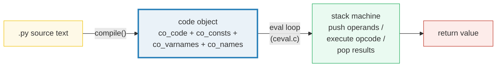
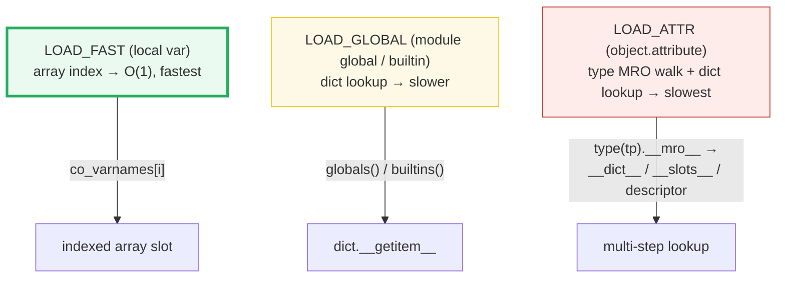

# Bytecode Internals — Source → Code Objects → The Stack Machine

> **The one rule:** Python is NOT "interpreted" in the naive sense — it does
> not re-read source line-by-line at runtime. CPython **compiles** every `.py`
> to **bytecode** (code objects) at import time, then executes that bytecode on
> a **stack-based eval loop**. `dis.dis(fn)` shows you exactly what runs, and
> once you can read it, you can see *why* `obj.method` in a hot loop costs a
> `LOAD_ATTR` every single iteration.

**Companion code:** [`bytecode_internals.py`](./bytecode_internals.py).
**Every instruction stream, constant pool, and structural assertion below is
printed by `uv run python bytecode_internals.py`** — change the code, re-run,
re-paste. Nothing here is hand-computed. Captured stdout lives in
[`bytecode_internals_output.txt`](./bytecode_internals_output.txt).

> **Bytecode is a CPython implementation detail.** Opcodes, operands, and jump
> offsets change between minor versions (3.10 → 3.11 → 3.12 → 3.13 all changed
> them). The dumps below are captured verbatim on **CPython 3.13.5**; the
> structural assertions (opname present/absent, constant-pool membership) are
> stable across 3.12–3.14. If you run on a different version, the offsets and
> line numbers will differ but the opcodes will be the same.

**Goal of this bundle (lineage, old → new):**

> from *"Python is interpreted"*
> → *"CPython compiles to bytecode (code objects) run by a stack machine; I can
> > read `dis` output and see exactly why `[].append` is a `LOAD_ATTR` and why a
> > hot loop costs what it does."*

🔗 This is bundle **#23 of Phase 4**. It depends on the data-model basics of
[`TYPES_AND_TRUTHINESS`](./TYPES_AND_TRUTHINESS.md) (Phase 1). The "why locals
are fast" thread continues in
[`FUNCTIONS_ARGS_SCOPE`](./FUNCTIONS_ARGS_SCOPE.md) (Phase 1, #6); the "cost of
attribute lookup" is rooted in [`DESCRIPTORS`](./DESCRIPTORS.md) (Phase 2); the
"read bytecode to optimize" tie is the gateway to
[`PROFILING_OPTIMIZATION`](./PROFILING_OPTIMIZATION.md) (Phase 4, #24).

---

## 0. The big picture



Every Python function carries its own **code object** (`fn.__code__`), which is
an immutable bundle of: the raw instruction bytes (`co_code`), the literal
constants (`co_consts`), the local variable names (`co_varnames`), and the
global/attribute names (`co_names`). The eval loop walks `co_code` one
instruction at a time, pushing and popping an operand stack.



---

## 1. Source → code object → eval loop

[`compile()`](https://docs.python.org/3/library/functions.html#compile) takes
source text and returns a **code object** — the same type that lives in
`fn.__code__`. The `'eval'` mode compiles a single expression; `'exec'` mode
compiles statements. A `.py` file is compiled to a **module code object**, then
that code object is executed top-to-bottom by the eval loop. There is no
runtime source re-reading.

> From `bytecode_internals.py` Section A:
> ```
> ======================================================================
> SECTION A — Source -> code object -> eval loop
> ======================================================================
> compile('x + 1', '<demo>', 'eval') produces a CODE OBJECT:
>   type(co)     = code
>   co.co_consts = (1,)
>   co.co_names  = ('x',)
>   eval(co, dict(x=41)) = 42
> 
> 'eval' mode compiles a single EXPRESSION; 'exec' mode compiles
> STATEMENTS (def/class/import/assignment). A .py file is compiled
> to a MODULE code object, then that code object is executed by
> CPython's stack-based eval loop — there is no runtime source
> re-reading.
> 
>   compile('y = 2', '<demo>', 'exec'); exec(co_exec, {})
>   ns['y'] = 2
> 
> [check] compile('eval') returns a code object: OK
> [check] eval runs the compiled code object: OK
> [check] 'eval' co_consts contains literal 1: OK
> [check] 'eval' co_names contains 'x': OK
> ```

### What a code object holds (internals)

A `code` object ([`types.CodeType`](https://docs.python.org/3/library/types.html#types.CodeType))
is the *compiled representation* of a block of Python. It stores everything the
eval loop needs *except* the runtime values:

| Attribute    | What it is                                                |
|--------------|-----------------------------------------------------------|
| `co_code`    | Raw instruction bytes (2 bytes per instruction since 3.6) |
| `co_consts`  | Tuple of literal constants (numbers, strings, `None`, …) |
| `co_varnames`| Tuple of local variable names (indexed by `LOAD_FAST`)   |
| `co_names`   | Tuple of global/attribute names (indexed by `LOAD_GLOBAL`/`LOAD_ATTR`) |
| `co_filename`| Source filename (for tracebacks)                          |
| `co_firstlineno` | First source line number                             |

When you `import mymod`, CPython reads `mymod.py`, calls `compile()` on the
entire source, and `exec()`s the resulting module code object. Each `def`
inside creates a *nested* code object stored in `co_consts` of the parent; the
`MAKE_FUNCTION` opcode wraps it into a `function` object.

---

## 2. `fn.__code__` — the bytecode + constant pool of a function

Every function object has a `__code__` attribute pointing at its code object.
Inspecting it reveals the literal constants, local names, and global/attribute
names the function uses — all determined at **compile time**, before the
function ever runs.

> From `bytecode_internals.py` Section B:
> ```
> ======================================================================
> SECTION B — fn.__code__: the bytecode + constant pool of a function
> ======================================================================
> def add_one(x): return x + 1
>   type(add_one.__code__)       = code
>   add_one.__code__.co_consts   = (None, 1)
>   add_one.__code__.co_varnames = ('x',)
>   add_one.__code__.co_names    = ()
>   add_one.__code__.co_code     = b'\x95\x00U\x00S\x01-\x00\x00\x00$\x00'
>   len(co_code)                 = 12 bytes
> 
> co_consts  = tuple of literal constants used in the body.
> co_varnames = tuple of local variable names (indexed by LOAD_FAST).
> co_names   = tuple of global/attribute names (LOAD_GLOBAL/LOAD_ATTR).
> co_code    = raw bytes of the instruction stream (2 bytes/instr).
> 
> [check] fn.__code__ is a code object: OK
> [check] co_consts contains None and 1: OK
> [check] co_varnames lists local 'x': OK
> [check] co_names is empty (no global/attr in add_one): OK
> [check] co_code is bytes (raw instruction stream): OK
> ```

### Why `co_consts` starts with `None` (internals)

The first element of `co_consts` is always `None` for a function. CPython uses
it as the implicit default return value (a bare `return` pushes `None`). The
literal `1` from `return x + 1` is stored at index 1 — that's why
`LOAD_CONST 1` appears in the disassembly: the `1` is the *argument*, indexing
into `co_consts[1]`.

### Why `co_names` is empty for `add_one` (internals)

`add_one` accesses no globals, no builtins, and no attributes — only the local
`x`. So `co_names` (the tuple of names looked up via `LOAD_GLOBAL` /
`LOAD_ATTR`) is empty. If the function did `return math.sqrt(x)`, then
`co_names` would be `('math', 'sqrt')` and the bytecode would show
`LOAD_GLOBAL` + `LOAD_ATTR`.

---

## 3. `dis.dis(fn)` — reading the instruction stream line by line

The [`dis`](https://docs.python.org/3/library/dis.html) module disassembles a
code object into human-readable instructions. Each row shows: the source line
number, the opcode name, the numeric argument, and the resolved argument
(human-readable). The eval loop executes these **in order**, pushing and
popping an operand stack.

> From `bytecode_internals.py` Section C:
> ```
> ======================================================================
> SECTION C — dis.dis(add_one): reading the instruction stream
> ======================================================================
> Each row = ONE bytecode instruction. Columns: source-line, opcode,
> arg (numeric), arg-resolved (human). The eval loop executes these in
> order, pushing/popping an operand stack.
> 
> >>> dis.dis(add_one)
>  82           RESUME                   0
> 
>  83           LOAD_FAST                0 (x)
>               LOAD_CONST               1 (1)
>               BINARY_OP                0 (+)
>               RETURN_VALUE
> 
> opnames: ['RESUME', 'LOAD_FAST', 'LOAD_CONST', 'BINARY_OP', 'RETURN_VALUE']
> 
> [check] LOAD_FAST present (push local 'x'): OK
> [check] LOAD_CONST present (push literal 1): OK
> [check] BINARY_OP present (pop two, push result): OK
> [check] RETURN_VALUE present (pop and return top): OK
> ```

### Reading `add_one` bytecode step by step

Here is what the eval loop does for `add_one(41)`:

| Step | Opcode      | Stack (after)     | What it did                              |
|------|-------------|-------------------|------------------------------------------|
| 1    | `RESUME`    | (empty)           | No-op (3.11+ tracing/quickening hook)    |
| 2    | `LOAD_FAST` | `[41]`            | Push `co_varnames[0]` (= `x` = 41)       |
| 3    | `LOAD_CONST`| `[41, 1]`         | Push `co_consts[1]` (= 1)                |
| 4    | `BINARY_OP` | `[42]`            | Pop two, add, push result                |
| 5    | `RETURN_VALUE` | (returns 42)   | Pop top of stack, return it              |

This is a **stack machine**: there are no registers. Every operand is pushed
onto a stack; every operation pops its inputs and pushes its result. The `0`
after `BINARY_OP` selects the operation (0 = `NB_ADD`).

---

## 4. `LOAD_FAST` vs `LOAD_GLOBAL` vs `LOAD_ATTR` — the lookup cost hierarchy

Not all name lookups are equal. CPython maps each kind to a **different
opcode** with a **different cost**:

- **`LOAD_FAST`** — local variable. The compiler assigns each local an index;
  `LOAD_FAST 0` reads `co_varnames[0]` from a C array. This is a single pointer
  dereference — the **cheapest** lookup.
- **`LOAD_GLOBAL`** — module global *or* builtin. Since 3.12, builtins are
  loaded via `LOAD_GLOBAL` too (with a `+ NULL` suffix to distinguish them).
  This does a **dict lookup** in `globals()` (and `builtins()` if not found) —
  slower.
- **`LOAD_ATTR`** — `object.attribute`. This walks the type's MRO looking for
  a data/non-data descriptor or a `__dict__`/`__slots__` entry — the **most
  expensive** of the three.

> From `bytecode_internals.py` Section D:
> ```
> ======================================================================
> SECTION D — LOAD_FAST vs LOAD_GLOBAL vs LOAD_ATTR (lookup costs)
> ======================================================================
> Three different lookups map to three different opcodes:
> 
>   LOAD_FAST   — local var; fast-indexed array slot   (cheapest)
>   LOAD_GLOBAL — module global OR builtin; dict lookup (slower)
>   LOAD_ATTR   — object.attribute; type MRO + dict walk (slowest)
> 
> >>> dis.dis(use_local)   # x is a local
>  86           RESUME                   0
> 
>  87           LOAD_CONST               1 (1)
>               STORE_FAST               0 (x)
> 
>  88           LOAD_FAST                0 (x)
>               LOAD_CONST               1 (1)
>               BINARY_OP                0 (+)
>               RETURN_VALUE
> 
> >>> dis.dis(use_global)  # G is a module global
>  91           RESUME                   0
> 
>  92           LOAD_GLOBAL              0 (G)
>               LOAD_CONST               1 (1)
>               BINARY_OP                0 (+)
>               RETURN_VALUE
> 
> >>> dis.dis(use_builtin) # len is a builtin (LOAD_GLOBAL + NULL)
>  95           RESUME                   0
> 
>  96           LOAD_GLOBAL              1 (len + NULL)
>               BUILD_LIST               0
>               LOAD_CONST               1 ((1, 2, 3))
>               LIST_EXTEND              1
>               CALL                     1
>               RETURN_VALUE
> 
> >>> dis.dis(use_attr)    # WIDGET.add is an attribute
>  99           RESUME                   0
> 
> 100           LOAD_GLOBAL              0 (WIDGET)
>               LOAD_ATTR                2 (add)
>               RETURN_VALUE
> 
> [check] use_local uses LOAD_FAST (indexed array access): OK
> [check] use_global uses LOAD_GLOBAL (dict lookup): OK
> [check] use_builtin uses LOAD_GLOBAL too (3.12+ merged builtins into it): OK
> [check] use_attr uses LOAD_ATTR (type + dict walk): OK
> [check] no LOAD_NAME in any of the four (3.13 uses LOAD_FAST/GLOBAL/ATTR): OK
> ```

### Why builtins use `LOAD_GLOBAL` (not a separate opcode) — 3.12 change

Before Python 3.12, looking up a name went through `LOAD_NAME` (at module
level) or `LOAD_GLOBAL` (inside a function), and builtins were found by
falling through to the `builtins` module. In 3.12, `LOAD_GLOBAL` was enhanced
to handle both globals and builtins in a single opcode: the `+ NULL` suffix in
the disassembly (`len + NULL`) means "push a NULL marker then the value" so
that `CALL` knows whether the callable was loaded as a bound method or a plain
function. `LOAD_NAME` now only appears in `eval()`/`exec()` namespaces and
class bodies.

🔗 The speed difference between locals and globals is the *practical*
motivation for understanding scoping rules — see
[`FUNCTIONS_ARGS_SCOPE`](./FUNCTIONS_ARGS_SCOPE.md) (Phase 1, #6).

---

## 5. The `obj.method`-per-iteration cost & the cache-the-method fix

This is the single most impactful bytecode-reading insight for performance.
When you write `total += obj.method()` inside a loop, **every iteration**
emits `LOAD_GLOBAL(obj)` + `LOAD_ATTR(method)` + `CALL`. The attribute lookup
(re-resolving `method` on `obj`'s type) happens `n` times. The fix is to
**hoist** the lookup out of the loop: `m = obj.method` runs the `LOAD_ATTR`
once, and the loop body is just `CALL` on a local (`LOAD_FAST`).

> From `bytecode_internals.py` Section E:
> ```
> ======================================================================
> SECTION E — obj.method per iteration: cost + cache-the-method fix
> ======================================================================
> hot_loop calls WIDGET.add() INSIDE the loop — each iteration emits
> LOAD_GLOBAL(WIDGET) + LOAD_ATTR(add) + CALL. hot_loop_cached hoists
> the attribute lookup OUT: 'add = WIDGET.add' runs ONCE, then the
> loop body is just CALL on a local.
> 
> >>> dis.dis(hot_loop)
> 103           RESUME                   0
> 
> 104           LOAD_CONST               1 (0)
>               STORE_FAST               1 (total)
> 
> 105           LOAD_GLOBAL              1 (range + NULL)
>               LOAD_FAST                0 (n)
>               CALL                     1
>               GET_ITER
>       L1:     FOR_ITER                26 (to L2)
>               STORE_FAST               2 (_)
> 
> 106           LOAD_FAST                1 (total)
>               LOAD_GLOBAL              2 (WIDGET)
>               LOAD_ATTR                5 (add + NULL|self)
>               CALL                     0
>               BINARY_OP               13 (+=)
>               STORE_FAST               1 (total)
>               JUMP_BACKWARD           28 (to L1)
> 
> 105   L2:     END_FOR
>               POP_TOP
> 
> 107           LOAD_FAST                1 (total)
>               RETURN_VALUE
> 
> >>> dis.dis(hot_loop_cached)
> 110           RESUME                   0
> 
> 111           LOAD_CONST               1 (0)
>               STORE_FAST               1 (total)
> 
> 112           LOAD_GLOBAL              0 (WIDGET)
>               LOAD_ATTR                2 (add)
>               STORE_FAST               2 (add)
> 
> 113           LOAD_GLOBAL              5 (range + NULL)
>               LOAD_FAST                0 (n)
>               CALL                     1
>               GET_ITER
>       L1:     FOR_ITER                12 (to L2)
>               STORE_FAST               3 (_)
> 
> 114           LOAD_FAST_LOAD_FAST     18 (total, add)
>               PUSH_NULL
>               CALL                     0
>               BINARY_OP               13 (+=)
>               STORE_FAST               1 (total)
>               JUMP_BACKWARD           14 (to L1)
> 
> 113   L2:     END_FOR
>               POP_TOP
> 
> 115           LOAD_FAST                1 (total)
>               RETURN_VALUE
> 
> hot_loop       loop-body ops: ['STORE_FAST', 'LOAD_FAST', 'LOAD_GLOBAL', 'LOAD_ATTR', 'CALL', 'BINARY_OP', 'STORE_FAST']
> hot_loop_cached loop-body ops: ['STORE_FAST', 'LOAD_FAST_LOAD_FAST', 'PUSH_NULL', 'CALL', 'BINARY_OP', 'STORE_FAST']
> 
> [check] hot_loop body contains LOAD_ATTR (attr lookup per iteration): OK
> [check] hot_loop_cached body has NO LOAD_ATTR (hoisted out): OK
> [check] both loops return the same result: OK
> ```

### Reading the loop bodies side by side

The loop body (instructions between `FOR_ITER` and `JUMP_BACKWARD`) tells the
whole story:

| `hot_loop` (per iteration)         | `hot_loop_cached` (per iteration) |
|-------------------------------------|-------------------------------------|
| `LOAD_FAST 1` (total)              | `LOAD_FAST_LOAD_FAST` (total, add)  |
| `LOAD_GLOBAL 2` (WIDGET)           | `PUSH_NULL`                         |
| **`LOAD_ATTR 5` (add + NULL\|self)** | *(absent — hoisted)*              |
| `CALL 0`                           | `CALL 0`                            |
| `BINARY_OP 13` (+=)                | `BINARY_OP 13` (+=)                 |
| `STORE_FAST 1` (total)             | `STORE_FAST 1` (total)              |

The uncached version does a `LOAD_GLOBAL` + `LOAD_ATTR` **every iteration** —
two dict/MRO lookups per trip. The cached version replaces both with a single
`LOAD_FAST_LOAD_FAST` (a 3.12 super-instruction that pushes two locals at
once). Over a million iterations, that is two million fewer dict lookups.

> **Caveat:** this optimization is safe only when `WIDGET` and `WIDGET.add`
> don't change during the loop. It is a **manual** version of what a JIT would
> do speculatively (see §7 on the adaptive interpreter).

🔗 The attribute-lookup cost is rooted in the descriptor protocol — see
[`DESCRIPTORS`](./DESCRIPTORS.md) (Phase 2) for why `LOAD_ATTR` has to walk the
MRO. The "read bytecode to find bottlenecks" workflow is formalized in
[`PROFILING_OPTIMIZATION`](./PROFILING_OPTIMIZATION.md) (Phase 4, #24).

---

## 6. Code objects are immutable — you replace `__code__`, you don't mutate it

Code objects are **read-only**. You cannot edit `co_consts` or `co_code` in
place. But a function's `__code__` attribute *is* writable: you can swap the
entire code object, which instantly changes what the function does. This is
the mechanism behind `types.CodeType.replace()`, decorators that rewrite
bytecode, and some monkey-patching techniques.

> From `bytecode_internals.py` Section F:
> ```
> ======================================================================
> SECTION F — Code objects are immutable; replace __code__, don't mutate
> =======================================================================
> co_consts is READONLY — you cannot mutate bytecode in place:
>   c.co_consts = (None, 2)  ->  AttributeError: readonly attribute
> 
> But you CAN swap a function's entire __code__ object:
>   original_fn() before swap: 1
>   original_fn() after swap:  999
> 
> Two functions with identical source get DISTINCT code objects
> (CPython does not deduplicate code objects):
>   f1.__code__ is f2.__code__  ->  False
>   f1.__code__ is f1.__code__  ->  True
> 
> [check] co_consts is readonly (cannot mutate in place): OK
> [check] replacing __code__ changes the function's behavior: OK
> [check] two distinct functions have distinct code objects: OK
> [check] a code object identity is stable across accesses: OK
> ```

### Why code objects are immutable (internals)

Code objects are shared: the same code object can be referenced by multiple
frames simultaneously (e.g., a recursive function). If `co_consts` were
mutable, one frame could corrupt another's view. The immutability guarantee
also lets the compiler intern and cache code objects safely. When you *do*
need a modified code object, use
[`code.replace(co_consts=...)`](https://docs.python.org/3/library/types.html#types.CodeType.replace)
(3.8+) — it creates a *new* code object with the specified fields changed,
leaving the original untouched.

---

## 7. The 3.11+ specializing adaptive interpreter (PEP 659)

Since CPython 3.11, the interpreter **quickens** bytecode at runtime. After an
instruction executes enough times (typically ~8 calls), it is replaced
in-place by a **specialized variant** tuned to the actual types and values it
sees. This is not a JIT (no machine code is generated) — it is an adaptive
interpreter that rewrites opcodes in a private buffer.

**Specialization families** (from [PEP 659](https://peps.python.org/pep-0659/)):

| Generic opcode  | Specialized variants                                         |
|-----------------|--------------------------------------------------------------|
| `LOAD_ATTR`     | `LOAD_ATTR_SLOT`, `LOAD_ATTR_MODULE`, `LOAD_ATTR_INSTANCE_VALUE`, … |
| `LOAD_GLOBAL`   | `LOAD_GLOBAL_MODULE`, `LOAD_GLOBAL_BUILTIN`                  |
| `CALL`          | `CALL_PY_EXACT_ARGS`, `CALL_PY_GENERAL`, `CALL_BUILTIN_O`, … |

Specialization lives in the interpreter's **quickened bytecode buffer** — *not*
in the code object's `co_code` (which stays unspecialized). That is why
`dis.dis(fn)` always shows the unspecialized form. Passing `show_caches=True`
reveals the **inline cache entries** (`CACHE` instructions) that the
specializing interpreter reads and writes at runtime.

> From `bytecode_internals.py` Section G:
> ```
> ======================================================================
> SECTION G — The 3.11+ specializing adaptive interpreter (PEP 659)
> =======================================================================
> Since CPython 3.11 (PEP 659), the interpreter QUICKENS bytecode at
> runtime: after an instruction executes enough times, it is replaced
> in-place by a SPECIALIZED variant tuned to the actual types/values.
> 
>   LOAD_ATTR   -> LOAD_ATTR_SLOT / LOAD_ATTR_MODULE / ...
>   LOAD_GLOBAL -> LOAD_GLOBAL_MODULE / LOAD_GLOBAL_BUILTIN
> 
> Specialization lives in the interpreter's QUICKENED bytecode buffer,
> NOT in the code object's co_code (which stays unspecialized).
> dis.dis() shows the UNSPECIALIZED form; show_caches=True reveals the
> inline-cache slots that the specializing interpreter writes to.
> 
> >>> dis.dis(use_attr, show_caches=True)
>  99           RESUME                   0
> 
> 100           LOAD_GLOBAL              0 (WIDGET)
>               CACHE                    0 (counter: 0)
>               CACHE                    0 (index: 0)
>               CACHE                    0 (module_keys_version: 0)
>               CACHE                    0 (builtin_keys_version: 0)
>               LOAD_ATTR                2 (add)
>               CACHE                    0 (counter: 0)
>               CACHE                    0 (version: 0)
>               CACHE                    0
>               CACHE                    0 (keys_version: 0)
>               CACHE                    0
>               CACHE                    0 (descr: 0)
>               CACHE                    0
>               CACHE                    0
>               CACHE                    0
>               RETURN_VALUE
> (13 CACHE entries follow LOAD_ATTR — specialization data)
> 
> Python 3.13 — adaptive interpreter present.
> 
> [check] running on CPython >= 3.11 (PEP 659 adaptive interpreter): OK
> [check] LOAD_ATTR is followed by CACHE entries (specialization slots): OK
> [check] dis.Bytecode accepts adaptive=True (3.11+): OK
> ```

### How quickening works (internals)

1. **Quickening**: the first time a code object is executed, CPython copies its
   `co_code` into a private "quickened" buffer. Adaptive opcodes
   (`LOAD_ATTR`, `LOAD_GLOBAL`, `CALL`, `BINARY_OP`, …) are replaced by their
   `_ADAPTIVE` counterparts.
2. **Counter**: each adaptive instruction has a counter (stored in the first
   `CACHE` slot). It decrements on each execution.
3. **Specialization**: when the counter hits zero, the interpreter inspects the
   actual operand's type and *rewrites* the opcode in the buffer — e.g.,
   `LOAD_ATTR_ADAPTIVE` → `LOAD_ATTR_SLOT` if the attribute lives in
   `__slots__`.
4. **De-optimization**: if a specialized instruction later sees an unexpected
   type (the "guard" fails), it decrements its own counter; if it fails too
   often, it de-optimizes back to the adaptive form.

This is why the 3.11 release was ~25% faster than 3.10 on many benchmarks —
without any JIT compilation, just smarter interpretation.

---

## Pitfalls

| Trap | Example | The fix |
|---|---|---|
| Assuming `dis` offsets are stable across versions | jump targets and CACHE layout changed in 3.11, 3.12, 3.13 | assert *structural* facts (opname present), not exact offsets/line numbers |
| `obj.method()` inside a hot loop | `LOAD_ATTR` + `CALL` execute N times | hoist: `m = obj.method` before the loop, call `m()` inside |
| Treating builtins as "free" | `len`/`print` are `LOAD_GLOBAL` (dict lookup), not `LOAD_FAST` | for ultra-hot calls, bind to a local: `_len = len` |
| Trying to patch bytecode by mutating `co_consts` | `AttributeError: readonly attribute` | use `code.replace(co_consts=...)` (3.8+) to get a *new* code object |
| Assuming `co_code` length maps 1:1 to instruction count | some instructions take inline `CACHE` entries (2 bytes each, hidden by default) | use `dis.get_instructions(fn)` or `show_caches=True` to see the true layout |
| Confusing `LOAD_NAME` with `LOAD_GLOBAL` | `LOAD_NAME` only appears in `eval()`/`exec()` namespaces and class bodies — not in normal functions | in functions, the compiler always emits `LOAD_FAST` (locals) or `LOAD_GLOBAL` (globals/builtins) |
| Expecting `dis.dis` to show specialized opcodes | `dis` shows the *unspecialized* form from `co_code`; specialization lives in the runtime quickened buffer | use `adaptive=True` on `dis.Bytecode` to see adaptive opcode names; note actual specialization is runtime-only |
| Assuming two identical functions share a code object | each `def` creates a fresh `code` object — CPython does not deduplicate | if you need sharing, assign `f2.__code__ = f1.__code__` explicitly |

---

## Cheat sheet

- **Source → bytecode → eval loop:** `compile(src, file, 'eval'|'exec')` →
  code object → `eval()`/`exec()` runs it on the stack machine. A `.py` file is
  compiled once at import, then its module code object is executed.
- **Code object (`fn.__code__`):** immutable bundle of `co_code` (raw bytes),
  `co_consts` (literals), `co_varnames` (local names), `co_names`
  (global/attr names). 2 bytes per instruction since 3.6.
- **`dis.dis(fn)`:** prints the instruction stream. Each row = source-line,
  opcode, arg, arg-resolved. Read it left to right; the eval loop does the same.
- **Stack machine:** every opcode pushes/pops an operand stack. `LOAD_FAST`
  pushes a local; `BINARY_OP` pops two and pushes one; `RETURN_VALUE` pops and
  returns.
- **Lookup cost hierarchy:** `LOAD_FAST` (local, indexed array, cheapest) →
  `LOAD_GLOBAL` (global/builtin, dict lookup, slower) → `LOAD_ATTR`
  (attribute, type MRO + dict walk, slowest).
- **`obj.method` in a loop:** emits `LOAD_GLOBAL` + `LOAD_ATTR` + `CALL` every
  iteration. Fix: `m = obj.method` before the loop → loop body is just
  `CALL` on a `LOAD_FAST` local.
- **Code objects are immutable:** you cannot mutate `co_consts`/`co_code`.
  Swap `fn.__code__` entirely, or use `code.replace(...)` for a modified copy.
- **PEP 659 adaptive interpreter (3.11+):** the interpreter quickens bytecode
  at runtime — `LOAD_ATTR` may specialize to `LOAD_ATTR_SLOT`, etc.
  `dis.dis()` shows the unspecialized form; `show_caches=True` reveals the
  inline-cache slots.

---

## Sources

- **Python docs — `dis`: Disassembler for Python bytecode.**
  https://docs.python.org/3/library/dis.html
  *The authoritative reference for every opcode (`LOAD_FAST`, `LOAD_GLOBAL`,
  `LOAD_ATTR`, `BINARY_OP`, `RETURN_VALUE`, `CALL`, `CACHE`), the
  `show_caches`/`adaptive` keyword arguments, and the note that bytecode is a
  CPython implementation detail subject to change between versions. Quoted
  throughout §3–§7.*
- **Python docs — `inspect`: Types and members — code objects.**
  https://docs.python.org/3/library/inspect.html#inspect-module-code-objects
  *Documents `co_code`, `co_consts`, `co_varnames`, `co_names`, and the other
  code-object attributes introspected in §2.*
- **Python docs — `types.CodeType`.**
  https://docs.python.org/3/library/types.html#types.CodeType
  *The `code.replace()` method (3.8+) and the immutability of code objects
  referenced in §6.*
- **Python docs — Built-in Functions: `compile()`.**
  https://docs.python.org/3/library/functions.html#compile
  *The `'eval'` vs `'exec'` mode distinction and the return type (`code`
  object) demonstrated in §1.*
- **PEP 659 — Specializing Adaptive Interpreter (Mark Shannon, 2021).**
  https://peps.python.org/pep-0659/
  *The design document for the 3.11 adaptive interpreter: quickening,
  adaptive instructions, specialization families (`LOAD_ATTR_SLOT`,
  `LOAD_GLOBAL_MODULE`, …), inline caches, and de-optimization. The basis for
  §7.*
- **Python docs — What's New in Python 3.11: PEP 659.**
  https://docs.python.org/3/whatsnew/3.11.html#whatsnew311-pep659
  *The user-facing summary of the specializing adaptive interpreter and its
  performance impact (~25% speedup on many benchmarks).*
- **Python docs — What's New in Python 3.12.**
  https://docs.python.org/3/whatsnew/3.12.html
  *Documents the `LOAD_GLOBAL` unification (builtins now use `LOAD_GLOBAL`
  with the `+ NULL` convention) and the removal of the old `LOAD_METHOD` /
  `CALL_METHOD` pair in favor of `LOAD_ATTR` + `CALL`. Referenced in §4.*
- **CPython source — `Python/ceval.c` (the eval loop).**
  https://github.com/python/cpython/blob/main/Python/ceval.c
  *The C implementation of the stack machine that executes bytecode. The
  TARGET() macros for each opcode are the ground truth for opcode behavior.*
- **CPython source — `Python/specialize.c` (specialization logic).**
  https://github.com/python/cpython/blob/main/Python/specialize.c
  *The `_Py_Specialize_LoadAttr`, `_Py_Specialize_LoadGlobal`, etc. functions
  that decide which specialized variant to write into the quickened buffer.
  Referenced in PEP 659 and §7.*
