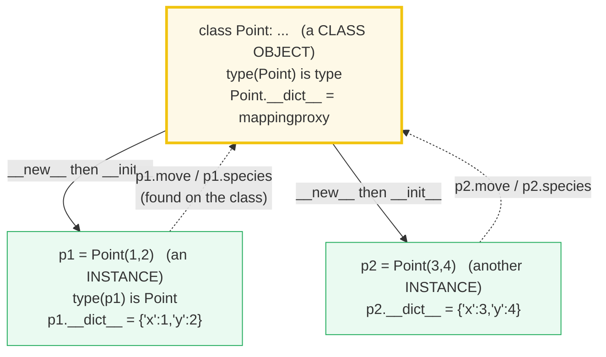
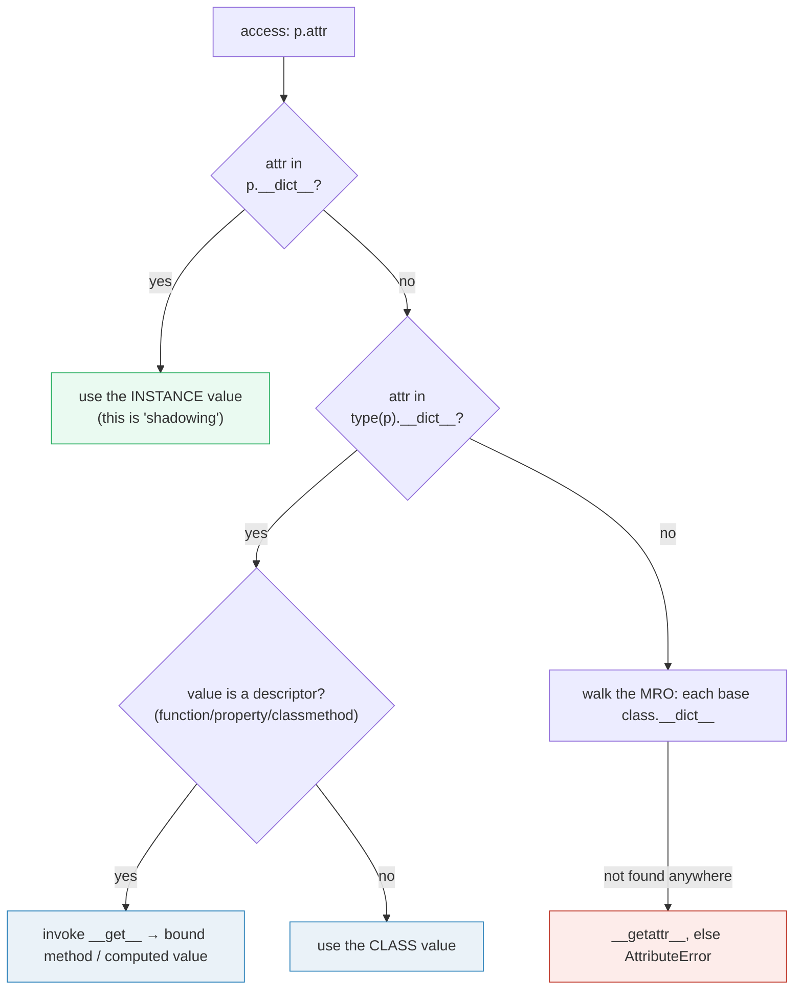

# Classes Basics — `class`, `__init__`, `self`, `__dict__`, and the Mutable Class-Attribute Trap

> **The one rule:** a `class` statement builds a *class object* (which is itself
> an instance of `type`); instantiating it builds *instance objects*, each with
> its **own** `__dict__`. Attribute access walks a fixed chain — **instance
> `__dict__` → class `__dict__` → base classes** — and a `def` in a class is a
> plain function that turns into a *bound method* when you read it through an
> instance. The single trap that catches everyone: a **mutable class attribute
> is shared state**, so two instances appending to it mutate the *same* list.

**Companion code:** [`classes_basics.py`](./classes_basics.py).
**Every number and table below is printed by `uv run python
classes_basics.py`** — change the code, re-run, re-paste. Nothing here is
hand-computed. Captured stdout lives in
[`classes_basics_output.txt`](./classes_basics_output.txt).

**Goal of this bundle (lineage, old → new):**

> from *"I write a class with `def __init__`"*
> → *"I understand that a class is an object, that instances have their own
> `__dict__`, that methods bind `self` via the descriptor protocol, and that
> class-vs-instance attributes resolve through the attribute-lookup chain."*

🔗 This is bundle **#9 of Phase 2** (the start of the object-model spine). It
builds directly on the object model of
[`TYPES_AND_TRUTHINESS`](./TYPES_AND_TRUTHINESS.md) (everything is a `PyObject`)
and on [`FUNCTIONS_ARGS_SCOPE`](./FUNCTIONS_ARGS_SCOPE.md) (the mutable-*default*
trap in §B — the **mutable class attribute** is its exact sibling). The two
forward links: method binding generalizes to the full **dunder protocols** in
[`DUNDER_METHODS`](./DUNDER_METHODS.md) (P2 #10) and to **descriptors**
(`property`/`classmethod`/`staticmethod`) in
[`PROPERTIES_DESCRIPTORS`](./PROPERTIES_DESCRIPTORS.md) (P2 #12). See
[`TODO.md`](./TODO.md) for the full plan.

---

## 0. The three ideas on one page



| Question | Mechanism | Where the data lives |
|---|---|---|
| "What kind of thing is `Point`?" | `Point` is an object; `type(Point) is type` | one class object, shared |
| "Where do `p1.x`/`p2.x` live?" | written by `__init__` into the instance `__dict__` | **separate** `dict` per instance |
| "Where does `p.move` come from?" | `move` is a function in `Point.__dict__`; reading `p.move` calls its `__get__` → a bound method | class `__dict__` (shared) |
| "Why do two instances share a `tags = []`?" | the list is a **class** attribute — looked up (not copied) on mutation | one list on the class |

### The attribute-lookup chain



> The simplified chain above is what this bundle proves. The full descriptor
> precedence rule — *data descriptor beats instance `__dict__` beats non-data
> descriptor beats class `__dict__`* — is the subject of 🔗
> [`PROPERTIES_DESCRIPTORS`](./PROPERTIES_DESCRIPTORS.md). For ordinary methods
> the picture here is exact: `move` is a non-data descriptor whose `__get__`
> builds the bound method.

---

## 1. Class creation — a class is an object, an instance of `type`

A `class` statement is **executable code**. When the interpreter runs it, it (a)
enters a new namespace, (b) executes the class body in that namespace (binding
`species`, `move`, `__init__`, …), and (c) on exit calls `type(name, bases,
namespace)` to build a **class object**, then binds the class name to it. That
class object is itself a value: it has a type (`type`), attributes, and a
`__dict__` (a read-only `mappingproxy`).

> From `classes_basics.py` Section A:
> ```
> ======================================================================
> SECTION A — Class creation: a class is an object, an instance of `type`
> ======================================================================
> A `class` statement, when it executes, builds a CLASS OBJECT. That
> object is itself an instance of `type` (the metaclass). So Point is
> a value like any other: it has a type, an id, attributes, and a
> __dict__. The class __dict__ is a read-only mappingproxy that holds
> the methods and class-level attributes.
> 
> expression                                result
> ------------------------------------------------------------------
> Point                                     <class '__main__.Point'>
> type(Point)                               <class 'type'>
> type(Point) is type                       True
> isinstance(Point, type)                   True
> Point.__name__                            'Point'
> Point.__mro__                             (<class '__main__.Point'>, <class 'object'>)
> type(Point.__dict__).__name__             'mappingproxy'
> 'move' in Point.__dict__                  True
> 'species' in Point.__dict__               True
> 
> [check] type(Point) is type (the class-of-the-class): OK
> [check] Point is an instance of type: OK
> [check] Point.__name__ == 'Point': OK
> [check] methods live in the CLASS __dict__ ('move' in Point.__dict__): OK
> [check] the class __dict__ is a read-only mappingproxy: OK
> ```

### Why `type(Point) is type` (internals)

`type` is the **metaclass** — the class-of-classes. Every class object is an
instance of `type` (or a subclass of it); that is literally what "calling the
class body" means: `type.__call__` runs `type.__new__` then `type.__init__` to
produce the class object, exactly mirroring how `Point(1, 2)` runs
`Point.__new__` + `Point.__init__`. Two consequences worth pinning:

- **The class `__dict__` is a `mappingproxy`**, not a plain `dict`. The proxy
  stops you from doing `Point.__dict__['x'] = ...` directly; you must go
  through `setattr` / normal assignment so the type machinery (updating slots,
  method-resolution tables) stays consistent.
- **Methods are stored on the class, not the instance.** `'move' in
  Point.__dict__` is `True` but `'move' in p.__dict__` is `False` — which is the
  whole reason a thousand instances can share one function object instead of
  each carrying a copy.

🔗 Customizing class *creation* itself (writing your own metaclass, or the
90%-solution `__init_subclass__`) is [`METACLASSES`](./TODO.md) (P2 #13).

---

## 2. `__init__` writes the instance `__dict__`; instances are independent

`Point(1, 2)` is a *call* on the class object. `type.__call__` dispatches it as:
(1) `Point.__new__(Point)` allocates a fresh, empty instance; (2)
`Point.__init__(instance, 1, 2)` runs and writes `self.x` / `self.y`. Those
writes go into the instance's **own** `__dict__` — a real, writable `dict` (not
a proxy). Because each instance gets its own dict, mutating one instance never
touches another.

> From `classes_basics.py` Section B:
> ```
> ======================================================================
> SECTION B — __init__ writes the INSTANCE __dict__; instances are independent
> ======================================================================
> Calling Point(1, 2) runs two steps: (1) Point.__new__ creates a fresh
> empty instance, (2) Point.__init__(that_instance, 1, 2) runs and writes
> self.x / self.y into the instance's OWN __dict__. Each instance gets a
> distinct, writable dict, so mutating one never touches another.
> 
> p1 = Point(1, 2);  p2 = Point(3, 4)       
> p1.x                  1       p2.x      3
> p1.__dict__                     {'x': 1, 'y': 2}
> p2.__dict__                     {'x': 3, 'y': 4}
> type(p1.__dict__).__name__      'dict'
> p1.__dict__ is not p2.__dict__  True
> 
> [check] p1.__dict__ == {'x': 1, 'y': 2}: OK
> [check] p2.__dict__ == {'x': 3, 'y': 4}: OK
> [check] each instance owns a distinct dict object: OK
> p1.x = 10   # writes p1's INSTANCE dict; p2 is unaffected
> 
> p1.x                  10
> p2.x                  3
> x in p1.__dict__      True
> 
> [check] mutating p1.x leaves p2.x unchanged: OK
> ```

### Why `__init__` returns `None` and `self` is just a name (internals)

`__init__` is **not** a constructor — it is an *initializer*. The object already
exists by the time it runs (`__new__` built it). Its job is purely to populate
`self.__dict__`; CPython enforces this by making `__init__` return `None`
(returning anything else raises `TypeError`). `self` has no magic: it is the
first parameter, and the only special thing about it is that the bound-method
machinery (§4) passes the instance automatically. You can name it anything; the
convention `self` is universal and worth keeping.

The instance `__dict__` is a genuine `dict`, so you can introspect it directly:
`p.__dict__`, `vars(p)`, `'x' in p.__dict__`. Assignment `p.x = v` is sugar for
`p.__dict__['x'] = v` (for normal classes — `__slots__` changes this, see 🔗
[`PROPERTIES_DESCRIPTORS`](./PROPERTIES_DESCRIPTORS.md)).

---

## 3. Class attribute vs instance attribute — lookup order & shadowing

A **class attribute** (`species`, `dimensions`) is assigned in the class body
and stored once in `Point.__dict__`. An **instance attribute** (`x`, `y`) is
assigned on `self` and stored in `p.__dict__`. Reading `p.species` does **not**
copy the class value into the instance — it walks the lookup chain and finds it
on the class. Writing `p.species = "rogue"` creates an **instance** attribute
that *shadows* the class attribute for that one instance only; the class value
and all other instances are untouched.

> From `classes_basics.py` Section C:
> ```
> ======================================================================
> SECTION C — Class attr vs instance attr: lookup order & shadowing
> ======================================================================
> Attribute lookup walks a fixed chain: INSTANCE __dict__ first, then
> the CLASS __dict__, then base classes. A class attr (e.g. `species`)
> is NOT copied into each instance — it lives once on the class and is
> found on the second step. Assigning p.species = ... creates an INSTANCE
> attr that SHADOWS the class attr for that one instance only.
> 
> Point.species                 'point'
> p1.species (read from class)  'point'
> p2.species (read from class)  'point'
> species in p1.__dict__        False
> species in Point.__dict__     True
> 
> [check] species is NOT stored on the instance: OK
> [check] species IS stored on the class: OK
> [check] both instances see the same class value: OK
> p1.species = "rogue"   # creates an INSTANCE attr, shadows the class
> 
> p1.species (now the instance attr)        'rogue'
> Point.species (class attr untouched)      'point'
> p2.species (other instance untouched)     'point'
> species in p1.__dict__                    True
> 
> [check] assignment created an instance attr (shadow): OK
> [check] the class attr itself is unchanged: OK
> [check] other instances are unaffected: OK
> [check] instance lookup wins over class lookup (shadow): OK
> ```

### Why assignment *always* lands on the instance (internals)

Read and write of attributes are **not symmetric**. The read path
(`type.__getattribute__`) walks the chain described in §0. The write path
(`type.__setattr__`) does *not* walk it — `p.species = v` unconditionally writes
into `p.__dict__`. That asymmetry is why shadowing "just works": assigning on the
instance can never mutate the class attribute (contrast with `self.tags.append`
in §5, which *reads* `tags`, finds it on the class, and mutates the shared list
in place — assignment and mutation are different operations). To change the
class attribute for everyone, qualify it: `Point.species = "vector"`.

---

## 4. Methods & `self` — bound vs unbound (the descriptor protocol)

A `def` inside a class body is an ordinary **function object**. It is stored in
the class `__dict__` like any other attribute. Reading `Point.move` returns that
raw function (`type == function`). Reading `p.move` triggers the function's
`__get__` — functions are **descriptors** — which manufactures a *bound method*
object that remembers the instance. Calling `p.move(2, 3)` is therefore
identical to `Point.move(p, 2, 3)`: the instance is inserted as the first
argument (`self`).

> From `classes_basics.py` Section D:
> ```
> ======================================================================
> SECTION D — Methods & self: bound vs unbound (descriptor binding)
> ======================================================================
> A `def` inside a class is a plain FUNCTION object stored in the class
> __dict__. Reading Point.move returns that raw function; reading p.move
> INVOKES the function's __get__ (it is a descriptor), which packs the
> instance into a bound method object. Calling p.move(2, 3) is exactly
> Point.move(p, 2, 3): the instance is passed as the first arg (self).
> 
> type(Point.move).__name__     'function'
> type(p.move).__name__         'method'
> p.move.__self__ is p          True
> p.move.__func__ is Point.move True
> 
> [check] Point.move is a plain function object: OK
> [check] p.move is a bound method object: OK
> [check] the bound method remembers its instance: OK
> [check] the bound method wraps the original function: OK
> p = Point(0, 0);  p.move(2, 3)        -> Point(x=4, y=6)  (after=(2, 3))
> Point.move(p, 2, 3)  (same thing)     -> Point(x=4, y=6)  (after=(4, 6))
> 
> [check] p.move(2,3) moved p by (2,3): OK
> [check] Point.move(p,2,3) is the equivalent call (moves p again): OK
> ```

### Why a bound method is a tiny two-field object (internals)

A bound method is a *new* object created fresh on each `p.move` access (it is
not cached). It holds exactly two references: `__self__` (the instance `p`) and
`__func__` (the underlying function, `Point.move`). Calling it prepends
`__self__` to the argument tuple and calls `__func__`. That is the *entire*
mechanism — there is no "virtual dispatch table" as in C++; Python's dispatch is
just the attribute lookup in §0 plus the function descriptor's `__get__`. Every
method is effectively virtual because lookup always goes through the instance's
type. The `p.move(2,3)` then `Point.move(p,2,3)` demo prints identical results
because they are the same call.

🔗 `staticmethod` and `classmethod` are siblings of this mechanism — they are
*descriptors whose `__get__` does something else* (skip binding / bind the class
instead). The full treatment is
[`PROPERTIES_DESCRIPTORS`](./PROPERTIES_DESCRIPTORS.md) (P2 #12).

---

## 5. The mutable-class-attribute trap — a shared list

The bug the Python tutorial warns about verbatim: a **mutable class attribute**
(`list`, `dict`, `set`) is created *once*, on the class. When a method does
`self.tags.append(x)`, the read of `self.tags` walks the lookup chain, fails to
find `tags` in the instance `__dict__`, finds it on the **class**, and then
`.append` mutates *that shared object*. Two instances end up writing into the
same list. The fix: assign a fresh list per instance in `__init__`.

> From `classes_basics.py` Section E:
> ```
> ======================================================================
> SECTION E — The mutable-class-attribute trap: a shared list
> ======================================================================
> A mutable CLASS attribute (list/dict/set) is created ONCE, on the
> class. self.tags.append(...) does NOT create an instance attr — it
> looks up `tags` (found on the class) and mutates THAT shared object.
> Result: every instance shares one list. The fix is to build a fresh
> list per instance inside __init__.
> 
> class Buggy:  tags = []   # class-level, shared
> b1 = Buggy(); b2 = Buggy();  b1.add('x');  b2.add('y')
> 
> b1.tags               ['x', 'y']
> b2.tags               ['x', 'y']
> b1.tags is b2.tags    True
> b1.tags is Buggy.tags True
> 
> [check] the class-level list is shared across instances: OK
> [check] b2 leaked b1's append (cross-contamination): OK
> class Fixed:  def __init__(self): self.tags = []  # per-instance
> f1 = Fixed(); f2 = Fixed();  f1.add('x');  f2.add('y')
> 
> f1.tags                   ['x']
> f2.tags                   ['y']
> f1.tags is not f2.tags    True
> 
> [check] instance-level lists are independent: OK
> [check] no leakage: f1.tags == ['x'] and f2.tags == ['y']: OK
> ```

### Why this is the *exact sibling* of the mutable-default trap (internals)

Both bugs share one root cause: **a mutable object is built once and then
"found" by many callers.** Here the list lives on the class and is found by
attribute lookup; in
[`FUNCTIONS_ARGS_SCOPE`](./FUNCTIONS_ARGS_SCOPE.md) §B the list is the default
value, built at `def`-time, and reused on every call. The mental model is
identical: *mutating a value you only **read** mutates the shared original.*
`self.tags.append(x)` is a **read** of `self.tags` (no assignment, so no
instance attribute is created) followed by a mutation — that is why the
class-level list is the one that grows. The two correct fixes mirror each other
too: assign inside `__init__` (per instance) ↔ assign inside the function body
or use a sentinel default (per call).

---

## 6. `@dataclass` — auto `__init__`/`__repr__`/`__eq__`, `frozen`, `default_factory`

`@dataclass` (stdlib, [`dataclasses`](https://docs.python.org/3/library/dataclasses.html))
reads the annotated class attributes and **generates** the boilerplate dunders:
`__init__` (parameters in field order), `__repr__` (`Name(field=value, …)` using
`__qualname__`), and `__eq__` (compares the field tuple, so equal values compare
equal even though they are distinct objects). `frozen=True` makes instances
immutable and hashable; `field(default_factory=list)` is the dataclass-native
fix for the shared-mutable-default problem.

> From `classes_basics.py` Section F:
> ```
> ======================================================================
> SECTION F — @dataclass: auto __init__/__repr__/__eq__, frozen, default_factory
> ======================================================================
> @dataclass reads the annotated class attributes and GENERATES the
> dunder methods for you: __init__ (from the fields in order), __repr__
> (Name(f1=..., f2=...)), and __eq__ (field-by-field tuple comparison).
> frozen=True makes instances immutable; field(default_factory=list) is
> the dataclass fix for the shared-mutable-default trap.
> 
> @dataclass
> class Pt:
>     x: int
>     y: int
> 
> Pt(1, 2)                Pt(x=1, y=2)
> repr(Pt(1, 2))          'Pt(x=1, y=2)'
> Pt(1, 2) == Pt(1, 2)    True
> Pt(1, 2) is Pt(1, 2)    False
> 
> [check] dataclass auto-generates __repr__: OK
> [check] dataclass auto-generates __eq__ (value equality): OK
> [check] equal values are still distinct objects (is is False): OK
> 
> @dataclass(frozen=True)
> class FPt:
>     x: int
>     y: int
> 
> FPt(1, 2) == FPt(1, 2)              True
> hash(FPt(1, 2)) == hash(FPt(1, 2))  True
> fp.x = 99  -> raises                'FrozenInstanceError'
> isinstance(exc, AttributeError)     True
> 
> [check] frozen=True blocks setattr (FrozenInstanceError): OK
> [check] frozen instances are hashable (hash does not raise): OK
> 
> @dataclass
> class WithTags:
>     name: str
>     tags: list = field(default_factory=list)
> w1 = WithTags('a'); w2 = WithTags('b')
> w1.tags.append(1); w2.tags.append(2)
> 
> w1.tags                   [1]
> w2.tags                   [2]
> w1.tags is not w2.tags    True
> 
> [check] default_factory builds an independent list per instance: OK
> [check] no shared-default leakage: w1.tags == [1] and w2.tags == [2]: OK
> ```

### Why `frozen` raises `FrozenInstanceError` (internals)

With `frozen=True`, the decorator installs a `__setattr__` / `__delattr__` that
unconditionally raises `dataclasses.FrozenInstanceError`. Note (and the demo
prints it) that **`FrozenInstanceError` subclasses `AttributeError`** — so a
broad `except AttributeError` will swallow it, which is usually *not* what you
want. `frozen=True` *plus* `eq=True` (the default) also makes the class
**hashable**: the generated `__hash__` is `hash((field1, field2, …))`, so frozen
dataclasses work as `dict` keys / `set` members. (Without `frozen`, `eq=True`
sets `__hash__ = None` — unhashable — because a mutable equal-by-value object
would break the hash/eq contract.)

`field(default_factory=list)` calls the factory **once per instance** during the
generated `__init__`, producing an independent list each time — the dataclass
equivalent of `self.tags = []` in §5. A bare `tags: list = []` is rejected by
the decorator with `ValueError: mutable default ... is not allowed` — the trap
is now linted away.

---

## Pitfalls

| Trap | Example | The fix |
|---|---|---|
| Mutable **class** attribute shared by all instances | `class C: tags = []` → every instance's `.append` hits one list | assign `self.tags = []` in `__init__`; or `@dataclass` + `field(default_factory=list)` |
| `self.tags.append(x)` *looks* like it creates an instance attr | it **reads** `tags` (found on the class) then mutates it in place | remember: read+mutate ≠ assign; assignment is the only thing that lands on the instance |
| Shadowing a class attr and thinking you changed it for everyone | `p.species = "x"` changes only `p`; `Point.species` is untouched | to change it globally, assign on the class: `Point.species = "x"` |
| Treating `__init__` as a constructor / returning a value | `return obj` from `__init__` raises `TypeError` | `__init__` only populates `self`; use `__new__` to control creation |
| Forgetting `self` on an instance-attr write | `x = 1` inside a method makes a *local*, not `self.x` | always write `self.x = …` for instance state |
| Comparing instances with `==` in a plain class | `Point(1,2) == Point(1,2)` is `False` (default `__eq__` is identity) | define `__eq__`, or use `@dataclass` (auto `__eq__`) |
| `frozen=False` (default) dataclass is **unhashable** | `hash(Pt(1,2))` raises `TypeError` | use `frozen=True`, or `@dataclass(eq=False)`, or set `unsafe_hash=True` deliberately |
| `except AttributeError` swallowing `FrozenInstanceError` | a frozen dataclass assignment silently "succeeds" in your handler | catch `dataclasses.FrozenInstanceError` explicitly |
| Expecting the class `__dict__` to be writable | `Point.__dict__['x'] = 1` → `TypeError` (it is a `mappingproxy`) | use `setattr(Point, 'x', 1)` / normal assignment |
| Relying on `p.move` being a stable cached object | a bound method is rebuilt on **every** access; `p.move is p.move` → `False` | don't identity-compare methods; call them or store `m = p.move` once |

---

## Cheat sheet

- **A class is an object:** `type(Point) is type`; `isinstance(Point, type)` →
  `True`. The class `__dict__` is a read-only `mappingproxy` holding methods and
  class attributes.
- **`Point(1, 2)`:** `type.__call__` → `__new__` (allocates) → `__init__`
  (writes `self.x`/`self.y`). `__init__` returns `None`.
- **Instance `__dict__`:** a real, writable `dict`, **distinct per instance**.
  `p.x = v` ≡ `p.__dict__['x'] = v`. Mutating one instance never touches another.
- **Lookup chain:** instance `__dict__` → class `__dict__` → base classes (MRO)
  → `__getattr__`/`AttributeError`. Read walks it; **write does not** — write
  always lands on the instance (shadowing).
- **Methods:** `Point.move` is a `function`; `p.move` is a `method` (a bound
  method = `__self__` + `__func__`, rebuilt each access). `p.move(2,3) ≡
  Point.move(p, 2, 3)`.
- **Mutable class-attribute trap:** a class-level `list`/`dict`/`set` is shared;
  `self.x.append(...)` mutates the class object. Fix: `self.x = []` in
  `__init__`.
- **`@dataclass`:** auto `__init__`/`__repr__`/`__eq__`. `frozen=True` ⇒
  immutable + hashable, blocks `setattr` with `FrozenInstanceError` (an
  `AttributeError` subclass). `field(default_factory=list)` ⇒ per-instance
  mutable default.

---

## Sources

- **Python docs — Tutorial §9: Classes.**
  https://docs.python.org/3/tutorial/classes.html
  *The canonical walkthrough this bundle follows: §9.3.1 class-definition
  syntax (a class body executes and builds a class object); §9.3.2 class objects
  (attribute references + instantiation, `__init__`); §9.3.3 instance objects;
  §9.3.4 method objects ("`x.f()` is exactly equivalent to `MyClass.f(x)`");
  §9.3.5 class *and* instance variables, with the `Dog.tricks = []` shared-list
  bug and its `__init__` fix reproduced verbatim in §5; §9.7 pointing to
  `dataclasses` for the record/struct use case.*
- **Python docs — Language Reference §3: Data model.**
  https://docs.python.org/3/reference/datamodel.html
  *`object.__init__` / `__new__` (the two-step instantiation: "__new__ creates,
  __init__ customizes"); `__dict__` ("a dictionary or other mapping used to store
  an object's writable attributes"); the standard type hierarchy (classes are
  "callable objects" — instances of `type`); the instance-method attributes
  `__self__` / `__func__` cited in §4.*
- **Python docs — Library: `dataclasses`.**
  https://docs.python.org/3/library/dataclasses.html
  *`@dataclass` generated methods (`__init__`/`__repr__`/`__eq__`/`__hash__`);
  `field(default_factory=...)` ("a default value is provided by calling
  `default_factory()` … for each instance"); `frozen=True` semantics and
  `FrozenInstanceError`; the rule that a non-frozen `eq=True` dataclass sets
  `__hash__` to `None` (unhashable); and the `ValueError` on mutable defaults.
  Basis for §6.*
- **Python docs — Descriptor Guide.**
  https://docs.python.org/3/howto/descriptor.html
  *Confirms that dotted lookup of a function through an instance "calls
  `__get__()` which returns a bound method object" — the exact mechanism quoted
  in §4 and the bridge to 🔗 `PROPERTIES_DESCRIPTORS`.*
- **Python docs — Library: `types`, standard type hierarchy / `mappingproxy`.**
  https://docs.python.org/3/library/stdtypes.html#typesmapping
  *`types.MappingProxyType` — the read-only mapping view returned as a class
  `__dict__`; cited in §1 ("the class __dict__ is a `mappingproxy`").*
- **Python docs — Tutorial: A Word About Names and Objects (§9.1).**
  https://docs.python.org/3/tutorial/classes.html#a-word-about-names-and-objects
  *The aliasing discussion ("multiple names … can be bound to the same object")
  that explains *why* a shared class list is mutated by every instance — the
  conceptual underpinning of §5 and its link to 🔗 `FUNCTIONS_ARGS_SCOPE`.*
